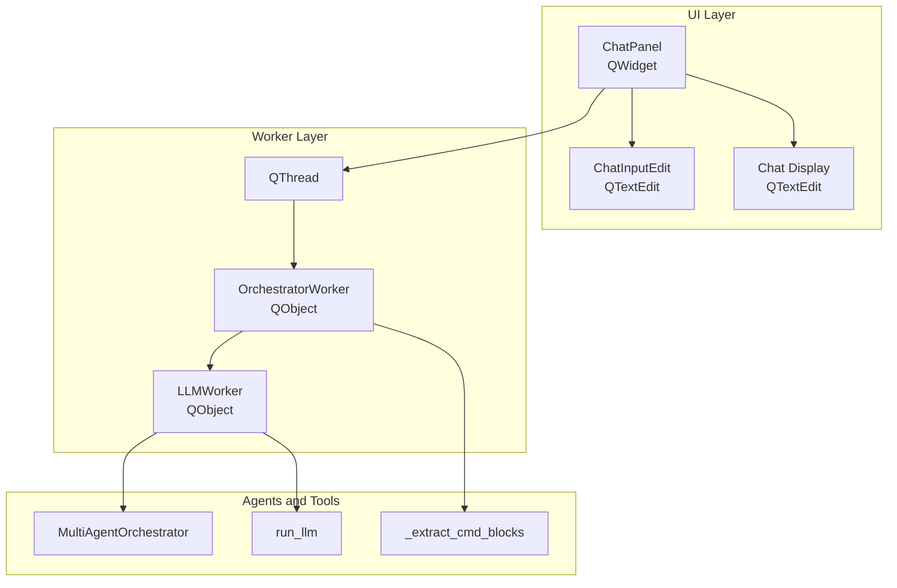
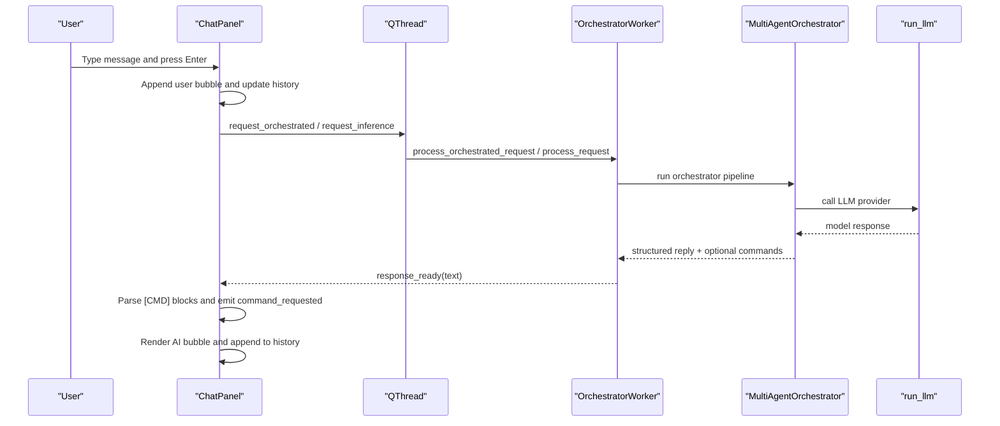
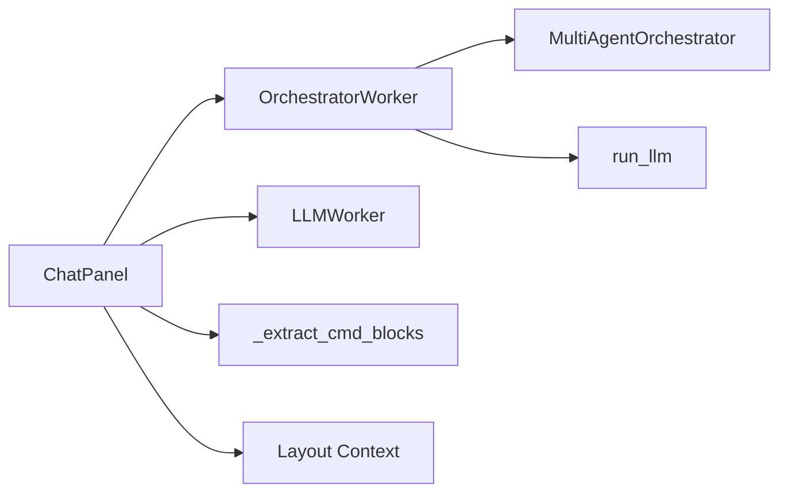
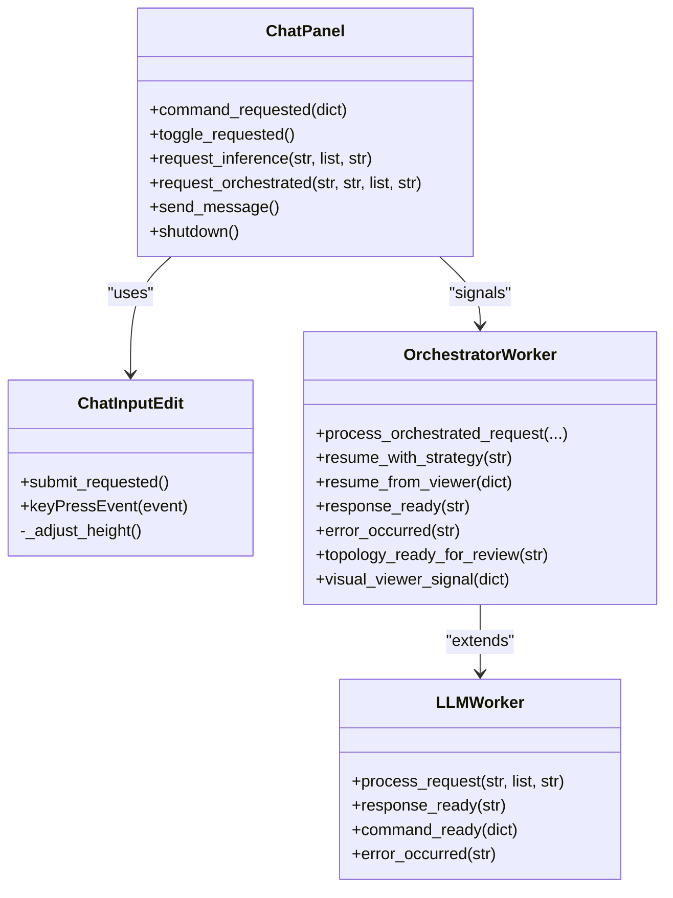

# Chat Interface and UI Components

<cite>
**Referenced Files in This Document**
- [chat_panel.py](file://symbolic_editor/chat_panel.py)
- [llm_worker.py](file://ai_agent/ai_chat_bot/llm_worker.py)
- [cmd_utils.py](file://ai_agent/ai_chat_bot/cmd_utils.py)
- [layout_tab.py](file://symbolic_editor/layout_tab.py)
- [main.py](file://symbolic_editor/main.py)
- [loading_overlay.py](file://symbolic_editor/widgets/loading_overlay.py)
- [welcome_screen.py](file://symbolic_editor/widgets/welcome_screen.py)
</cite>

## Table of Contents
1. [Introduction](#introduction)
2. [Project Structure](#project-structure)
3. [Core Components](#core-components)
4. [Architecture Overview](#architecture-overview)
5. [Detailed Component Analysis](#detailed-component-analysis)
6. [Dependency Analysis](#dependency-analysis)
7. [Performance Considerations](#performance-considerations)
8. [Troubleshooting Guide](#troubleshooting-guide)
9. [Conclusion](#conclusion)
10. [Appendices](#appendices)

## Introduction
This document explains the Chat Interface and UI Components of the Symbolic Layout Editor, focusing on the ChatPanel widget, the Worker-Object Pattern with QThread and OrchestratorWorker/LlmWorker integration, auto-resizing input, message rendering with HTML conversion, animated thinking indicators, signal-slot communication, conversation history management, UI styling with custom CSS, keyboard shortcuts, responsive design, and accessibility features. Practical examples illustrate chat bubble rendering, message formatting, and user interaction patterns.

## Project Structure
The chat interface is implemented as a standalone panel integrated into the main layout editor tab. The ChatPanel widget manages UI rendering, user input, and conversation history, while a background worker executes LLM inference safely off the GUI thread. The worker supports both single-agent and multi-agent orchestrator modes.

**Diagram sources**
- [chat_panel.py:95-157](file://symbolic_editor/chat_panel.py#L95-L157)
- [llm_worker.py:87-165](file://ai_agent/ai_chat_bot/llm_worker.py#L87-L165)
- [cmd_utils.py:61-107](file://ai_agent/ai_chat_bot/cmd_utils.py#L61-L107)

**Section sources**
- [chat_panel.py:1-161](file://symbolic_editor/chat_panel.py#L1-L161)
- [layout_tab.py:101-174](file://symbolic_editor/layout_tab.py#L101-L174)

## Core Components
- ChatPanel: The main chat widget that renders messages, manages conversation history, and routes requests to the worker thread. It exposes signals for command execution and toggling the panel visibility.
- ChatInputEdit: An auto-resizing QTextEdit that behaves like a single-line input but expands up to four lines; Enter submits, Shift+Enter inserts a newline.
- OrchestratorWorker/LLMWorker: Background workers that execute LLM inference on a dedicated QThread, emitting signals for responses, errors, and human-in-the-loop interrupts.
- Command Parsing: Utilities to extract structured commands from AI responses and apply them to the layout.

**Section sources**
- [chat_panel.py:62-90](file://symbolic_editor/chat_panel.py#L62-L90)
- [chat_panel.py:95-157](file://symbolic_editor/chat_panel.py#L95-L157)
- [llm_worker.py:87-165](file://ai_agent/ai_chat_bot/llm_worker.py#L87-L165)
- [cmd_utils.py:61-107](file://ai_agent/ai_chat_bot/cmd_utils.py#L61-L107)

## Architecture Overview
The ChatPanel follows the Worker-Object Pattern:
- A QThread hosts an OrchestratorWorker (or LLMWorker) that performs inference.
- The GUI communicates exclusively via Qt signals/slots.
- Responses are rendered in the chat display; commands are extracted and emitted for execution by the editor.

**Diagram sources**
- [chat_panel.py:463-514](file://symbolic_editor/chat_panel.py#L463-L514)
- [llm_worker.py:195-336](file://ai_agent/ai_chat_bot/llm_worker.py#L195-L336)

## Detailed Component Analysis

### ChatPanel Widget
Responsibilities:
- Initialize UI (header, chat display, input area).
- Manage conversation history and timestamps.
- Route messages to single-agent or orchestrator worker paths.
- Render chat bubbles with HTML and animate thinking indicators.
- Extract and emit commands from user text and AI responses.

Key behaviors:
- Auto-resizing input: ChatInputEdit adjusts height based on content and limits expansion.
- Message rendering: _append_bubble generates distinct HTML for user and AI bubbles with inline styles.
- Thinking indicators: _start_thinking/_animate_thinking cycles through stage labels or dots.
- Command extraction: _infer_commands_from_text recognizes swaps, moves, and dummy additions; _parse_commands extracts [CMD] blocks.

Signal-slot integration:
- request_inference/request_orchestrated connect to worker slots.
- response_ready/error_occurred/topology_ready_for_review/visual_viewer_signal connect back to GUI handlers.
- command_requested emitted to trigger editor actions.

**Section sources**
- [chat_panel.py:62-90](file://symbolic_editor/chat_panel.py#L62-L90)
- [chat_panel.py:250-341](file://symbolic_editor/chat_panel.py#L250-L341)
- [chat_panel.py:402-458](file://symbolic_editor/chat_panel.py#L402-L458)
- [chat_panel.py:529-580](file://symbolic_editor/chat_panel.py#L529-L580)
- [chat_panel.py:655-787](file://symbolic_editor/chat_panel.py#L655-L787)
- [chat_panel.py:801-908](file://symbolic_editor/chat_panel.py#L801-L908)

### ChatInputEdit Component
Features:
- Accepts rich text disabled to enforce plain text.
- Dynamically resizes from a minimum to a capped maximum height.
- Emits submit_requested on Enter (without Shift) to trigger message sending.

Keyboard handling:
- Enter without Shift triggers submission.
- Shift+Enter allows newline insertion.

**Section sources**
- [chat_panel.py:62-90](file://symbolic_editor/chat_panel.py#L62-L90)

### Message Rendering and HTML Conversion
Markdown-to-HTML conversion:
- Basic support for code blocks, inline code, bold, italic, bullet lists, numbered lists, and line breaks.
- Escapes unsafe characters to prevent XSS.

Bubble rendering:
- User bubbles: right-aligned with rounded corners and timestamp.
- AI bubbles: left-aligned with avatar, background, borders, and timestamp.
- Timestamps are appended automatically.

**Section sources**
- [chat_panel.py:345-381](file://symbolic_editor/chat_panel.py#L345-L381)
- [chat_panel.py:402-458](file://symbolic_editor/chat_panel.py#L402-L458)

### Animated Thinking Indicators
Behavior:
- Single-agent: Dots counter animates “Thinking” label.
- Orchestrator: Cycles through stage labels every few seconds.
- Timer-based updates; replaces the last “Thinking” bubble with updated text.

**Section sources**
- [chat_panel.py:529-580](file://symbolic_editor/chat_panel.py#L529-L580)

### Signal-Slot Communication Pattern
Forward path:
- ChatPanel emits request_inference or request_orchestrated with serialized context and messages.
- Worker executes inference and emits response_ready or error_occurred.

Backward path:
- response_ready: _on_llm_response parses [CMD] blocks, emits command_requested, and renders the AI bubble.
- error_occurred: _on_llm_error displays an error bubble.
- topology_ready_for_review: Pauses pipeline awaiting user choice.
- visual_viewer_signal: Pauses pipeline awaiting visual approval; resumes with approved edits.

**Section sources**
- [chat_panel.py:134-154](file://symbolic_editor/chat_panel.py#L134-L154)
- [chat_panel.py:801-908](file://symbolic_editor/chat_panel.py#L801-L908)
- [llm_worker.py:179-182](file://ai_agent/ai_chat_bot/llm_worker.py#L179-L182)
- [llm_worker.py:444-461](file://ai_agent/ai_chat_bot/llm_worker.py#L444-L461)

### Conversation History Management
- Maintains a list of {"role", "content"} entries.
- Trims recent messages for prompts and cleans noisy content (e.g., removes [CMD] blocks and error prefixes).
- Appends normalized messages after rendering.

**Section sources**
- [chat_panel.py:121-128](file://symbolic_editor/chat_panel.py#L121-L128)
- [chat_panel.py:615-650](file://symbolic_editor/chat_panel.py#L615-L650)
- [chat_panel.py:584-614](file://symbolic_editor/chat_panel.py#L584-L614)

### UI Styling with Custom CSS
- Header: Dark gradient background with a blue accent border.
- Chat display: Dark theme with custom scrollbar styling.
- Input area: Dark-themed frame with styled send button and input field focus effects.
- Buttons: Hover and pressed states with transparency and color transitions.

**Section sources**
- [chat_panel.py:190-246](file://symbolic_editor/chat_panel.py#L190-L246)
- [chat_panel.py:259-286](file://symbolic_editor/chat_panel.py#L259-L286)
- [chat_panel.py:299-340](file://symbolic_editor/chat_panel.py#L299-L340)
- [chat_panel.py:318-338](file://symbolic_editor/chat_panel.py#L318-L338)

### Practical Examples

#### Chat Bubble Rendering
- User bubble: Right-aligned with a distinct background and rounded corner style.
- AI bubble: Left-aligned with avatar, background, border, and timestamp.

Paths:
- [User bubble HTML generation:407-426](file://symbolic_editor/chat_panel.py#L407-L426)
- [AI bubble HTML generation:427-454](file://symbolic_editor/chat_panel.py#L427-L454)

#### Message Formatting
- Markdown conversion: Code blocks, inline code, bold, italic, bullet/numbered lists, and line breaks.
- Escaping: Unsafe characters are escaped prior to HTML insertion.

Paths:
- [Markdown to HTML conversion:345-381](file://symbolic_editor/chat_panel.py#L345-L381)

#### User Interaction Patterns
- Submitting messages: Enter (without Shift) triggers send; Shift+Enter inserts a newline.
- Clearing chat: Clear button resets display and history and shows a welcome message.

Paths:
- [Input key handling:82-89](file://symbolic_editor/chat_panel.py#L82-L89)
- [Send message flow:463-514](file://symbolic_editor/chat_panel.py#L463-L514)
- [Clear chat:516-520](file://symbolic_editor/chat_panel.py#L516-L520)

### Keyboard Shortcuts and Responsive Design
- Workspace shortcuts: Fit view and detailed view toggles are bound to keys within the workspace area.
- Panel toggling: Toggle button in the chat header hides or shows the panel.
- Splitter-based layout: The main tab uses splitters to arrange the device tree, workspace, and chat panel with adjustable widths.

Paths:
- [Workspace shortcuts:249-258](file://symbolic_editor/layout_tab.py#L249-L258)
- [Panel toggle binding](file://symbolic_editor/layout_tab.py#L232)
- [Splitter arrangement:165-174](file://symbolic_editor/layout_tab.py#L165-L174)

### Accessibility Features
- Focus states: Input field highlights on focus for keyboard navigation.
- Scrollbars: Customized scrollbars improve readability and contrast.
- Color scheme: Dark theme reduces eye strain; sufficient contrast for text and controls.

Paths:
- [Input focus styling:310-312](file://symbolic_editor/chat_panel.py#L310-L312)
- [Scrollbar styling:269-285](file://symbolic_editor/chat_panel.py#L269-L285)

## Dependency Analysis
The ChatPanel depends on:
- OrchestratorWorker/LlmWorker for inference.
- Command utilities for parsing [CMD] blocks.
- Layout context from the editor tab for multi-agent routing.

**Diagram sources**
- [chat_panel.py:134-154](file://symbolic_editor/chat_panel.py#L134-L154)
- [llm_worker.py:170-182](file://ai_agent/ai_chat_bot/llm_worker.py#L170-L182)
- [cmd_utils.py:61-107](file://ai_agent/ai_chat_bot/cmd_utils.py#L61-L107)

**Section sources**
- [chat_panel.py:134-154](file://symbolic_editor/chat_panel.py#L134-L154)
- [llm_worker.py:170-182](file://ai_agent/ai_chat_bot/llm_worker.py#L170-L182)
- [cmd_utils.py:61-107](file://ai_agent/ai_chat_bot/cmd_utils.py#L61-L107)

## Performance Considerations
- Off-main-thread inference: All LLM calls run on a dedicated QThread to keep the UI responsive.
- Minimal UI updates: Thinking indicators update only the last bubble’s text rather than rewriting the entire display.
- Prompt trimming: Recent messages are trimmed and cleaned to reduce token usage and latency.
- Batch command emission: Commands are emitted individually after parsing to avoid blocking the UI.

## Troubleshooting Guide
Common issues and resolutions:
- Worker thread not stopping: Ensure shutdown is called on the ChatPanel before application exit.
- Malformed [CMD] blocks: The parser attempts repair; if parsing fails, the worker emits an error and the UI shows an error bubble.
- Interrupted pipeline: When the orchestrator pauses for strategy or visual review, the UI waits for user input and resumes accordingly.

Paths:
- [Shutdown method:162-167](file://symbolic_editor/chat_panel.py#L162-L167)
- [Error handling:850-859](file://symbolic_editor/chat_panel.py#L850-L859)
- [Interrupt handling:891-900](file://symbolic_editor/chat_panel.py#L891-L900)

## Conclusion
The Chat Interface integrates a modern, responsive UI with a robust backend using the Worker-Object Pattern. The ChatPanel provides a seamless chat experience with auto-resizing input, rich message rendering, and animated feedback. The multi-agent orchestrator enables sophisticated layout automation while maintaining a safe separation between UI and inference workloads.

## Appendices

### Class Relationships

**Diagram sources**
- [chat_panel.py:95-157](file://symbolic_editor/chat_panel.py#L95-L157)
- [chat_panel.py:62-90](file://symbolic_editor/chat_panel.py#L62-L90)
- [llm_worker.py:87-165](file://ai_agent/ai_chat_bot/llm_worker.py#L87-L165)
- [llm_worker.py:170-182](file://ai_agent/ai_chat_bot/llm_worker.py#L170-L182)