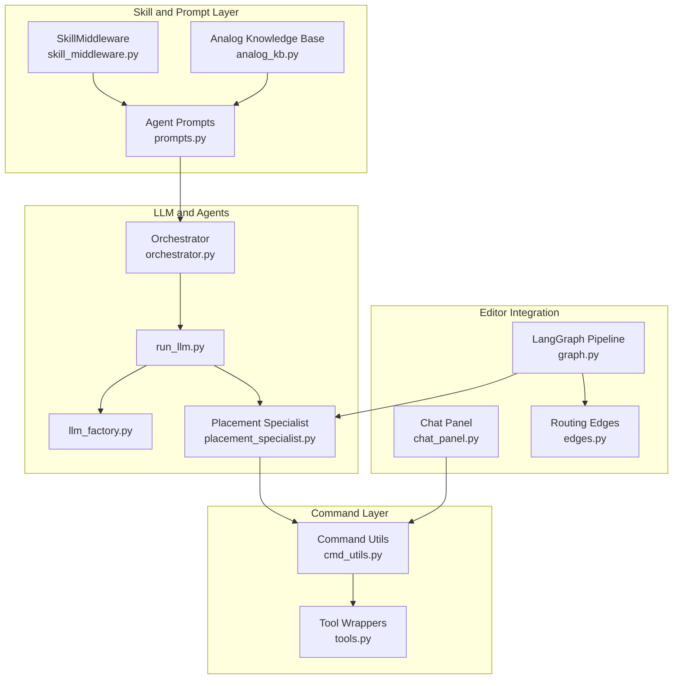
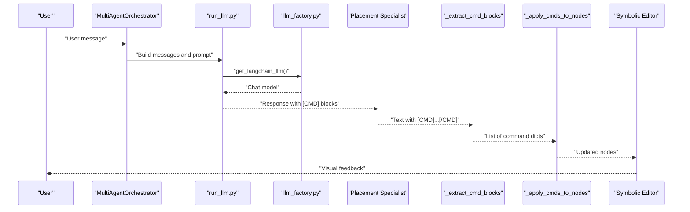
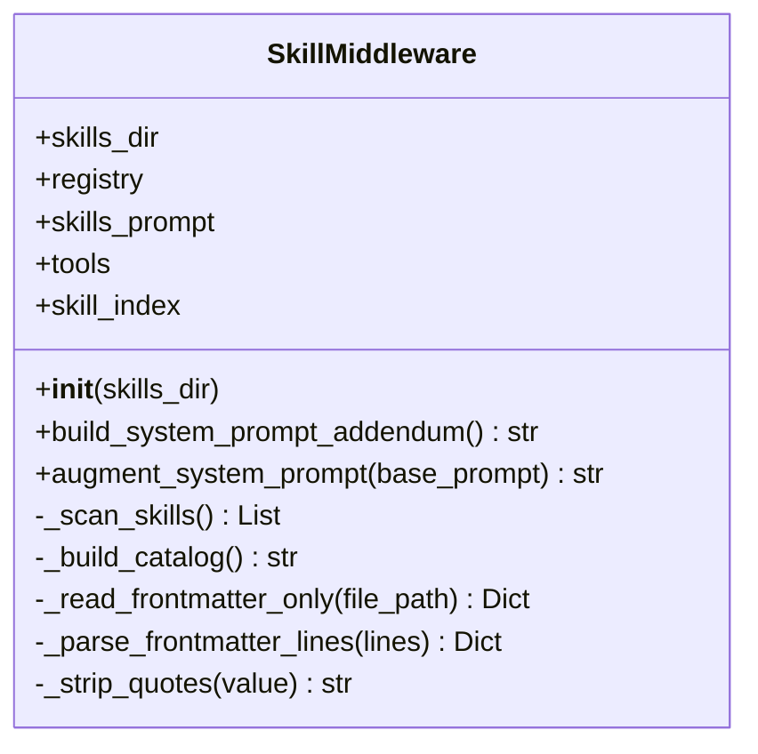
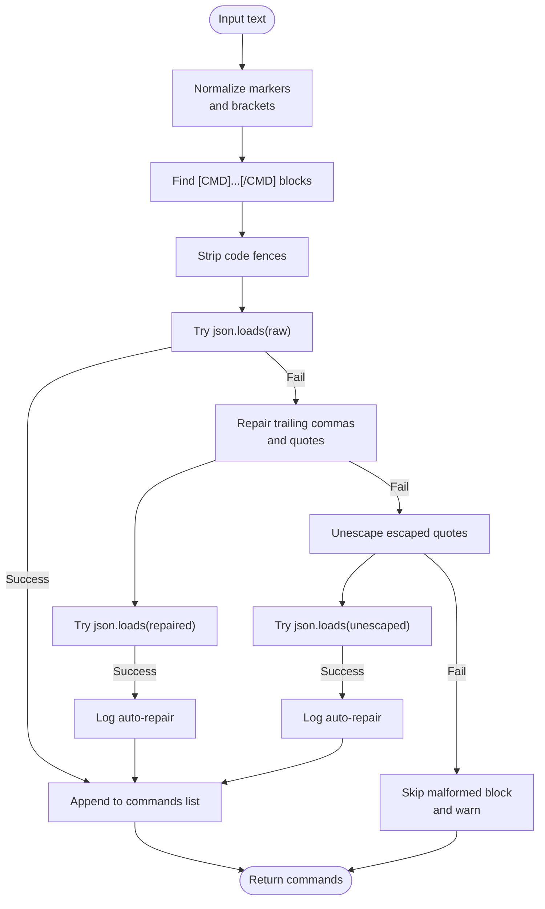
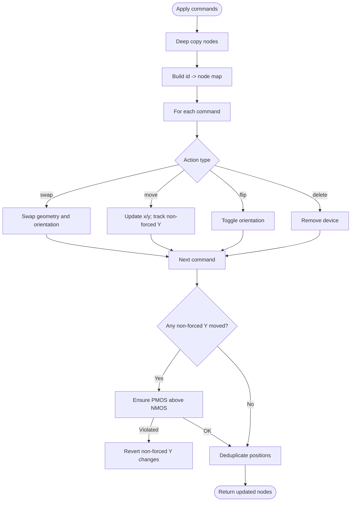
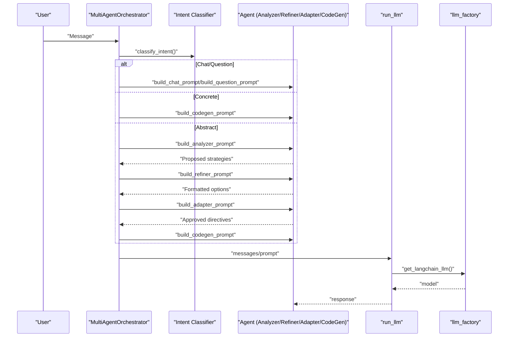
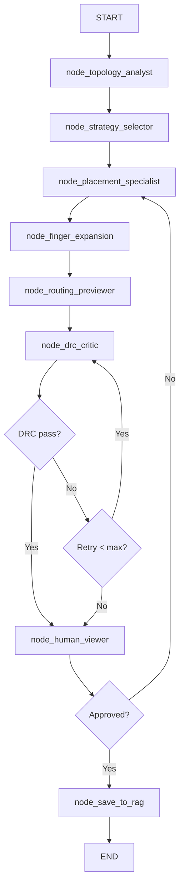
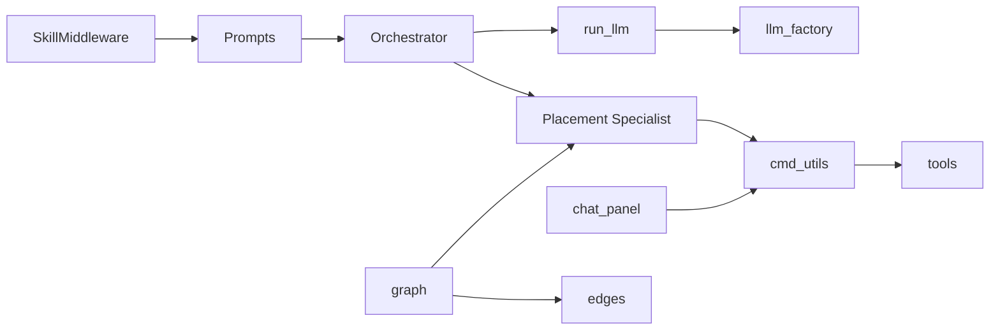

# Command Execution and Skill Middleware

<cite>
**Referenced Files in This Document**
- [skill_middleware.py](file://ai_agent/ai_chat_bot/skill_middleware.py)
- [cmd_utils.py](file://ai_agent/ai_chat_bot/cmd_utils.py)
- [tools.py](file://ai_agent/ai_chat_bot/tools.py)
- [analog_kb.py](file://ai_agent/ai_chat_bot/analog_kb.py)
- [state.py](file://ai_agent/ai_chat_bot/state.py)
- [run_llm.py](file://ai_agent/ai_chat_bot/run_llm.py)
- [llm_factory.py](file://ai_agent/ai_chat_bot/llm_factory.py)
- [orchestrator.py](file://ai_agent/ai_chat_bot/agents/orchestrator.py)
- [prompts.py](file://ai_agent/ai_chat_bot/agents/prompts.py)
- [placement_specialist.py](file://ai_agent/ai_chat_bot/agents/placement_specialist.py)
- [common-centroid-matching.md](file://ai_agent/SKILLS/common-centroid-matching.md)
- [interdigitated-matching.md](file://ai_agent/SKILLS/interdigitated-matching.md)
- [mirror-biasing-sequencing.md](file://ai_agent/SKILLS/mirror-biasing-sequencing.md)
- [chat_panel.py](file://symbolic_editor/chat_panel.py)
- [graph.py](file://ai_agent/ai_chat_bot/graph.py)
- [edges.py](file://ai_agent/ai_chat_bot/edges.py)
</cite>

## Table of Contents
1. [Introduction](#introduction)
2. [Project Structure](#project-structure)
3. [Core Components](#core-components)
4. [Architecture Overview](#architecture-overview)
5. [Detailed Component Analysis](#detailed-component-analysis)
6. [Dependency Analysis](#dependency-analysis)
7. [Performance Considerations](#performance-considerations)
8. [Troubleshooting Guide](#troubleshooting-guide)
9. [Conclusion](#conclusion)
10. [Appendices](#appendices)

## Introduction
This document explains the Command Execution and Skill Middleware system used by the AI-based analog layout automation pipeline. It covers:
- How natural language and structured responses are parsed into executable commands
- How the skill middleware augments agent prompts and exposes on-demand skill loading
- How tools validate and transform layout data safely
- How the system integrates with the main layout editor and LangGraph pipeline
- Practical examples, debugging workflows, and security/performance considerations

## Project Structure
The system spans several modules:
- Skill middleware and skills catalog
- Command extraction and application utilities
- Tool wrappers for safe, deterministic layout operations
- Agent orchestration and prompts
- LLM invocation and model factory
- Editor integration and LangGraph pipeline

**Diagram sources**
- [skill_middleware.py:1-278](file://ai_agent/ai_chat_bot/skill_middleware.py#L1-L278)
- [analog_kb.py:1-333](file://ai_agent/ai_chat_bot/analog_kb.py#L1-L333)
- [prompts.py:1-383](file://ai_agent/ai_chat_bot/agents/prompts.py#L1-L383)
- [cmd_utils.py:1-171](file://ai_agent/ai_chat_bot/cmd_utils.py#L1-L171)
- [tools.py:1-230](file://ai_agent/ai_chat_bot/tools.py#L1-L230)
- [run_llm.py:1-162](file://ai_agent/ai_chat_bot/run_llm.py#L1-L162)
- [llm_factory.py:1-131](file://ai_agent/ai_chat_bot/llm_factory.py#L1-L131)
- [orchestrator.py:1-226](file://ai_agent/ai_chat_bot/agents/orchestrator.py#L1-L226)
- [placement_specialist.py:1-829](file://ai_agent/ai_chat_bot/agents/placement_specialist.py#L1-L829)
- [chat_panel.py:826-853](file://symbolic_editor/chat_panel.py#L826-L853)
- [graph.py:1-52](file://ai_agent/ai_chat_bot/graph.py#L1-L52)
- [edges.py:1-24](file://ai_agent/ai_chat_bot/edges.py#L1-L24)

**Section sources**
- [skill_middleware.py:1-278](file://ai_agent/ai_chat_bot/skill_middleware.py#L1-L278)
- [cmd_utils.py:1-171](file://ai_agent/ai_chat_bot/cmd_utils.py#L1-L171)
- [tools.py:1-230](file://ai_agent/ai_chat_bot/tools.py#L1-L230)
- [analog_kb.py:1-333](file://ai_agent/ai_chat_bot/analog_kb.py#L1-L333)
- [state.py:1-37](file://ai_agent/ai_chat_bot/state.py#L1-L37)
- [run_llm.py:1-162](file://ai_agent/ai_chat_bot/run_llm.py#L1-L162)
- [llm_factory.py:1-131](file://ai_agent/ai_chat_bot/llm_factory.py#L1-L131)
- [orchestrator.py:1-226](file://ai_agent/ai_chat_bot/agents/orchestrator.py#L1-L226)
- [prompts.py:1-383](file://ai_agent/ai_chat_bot/agents/prompts.py#L1-L383)
- [placement_specialist.py:1-829](file://ai_agent/ai_chat_bot/agents/placement_specialist.py#L1-L829)
- [chat_panel.py:826-853](file://symbolic_editor/chat_panel.py#L826-L853)
- [graph.py:1-52](file://ai_agent/ai_chat_bot/graph.py#L1-L52)
- [edges.py:1-24](file://ai_agent/ai_chat_bot/edges.py#L1-L24)

## Core Components
- SkillMiddleware: Scans skills directory, builds a catalog, and exposes a tool to load full skill content on demand. Augments system prompts with available skills.
- Command Utilities: Extracts [CMD]...[/CMD] blocks from LLM responses, repairs malformed JSON, and applies commands to layout nodes while enforcing constraints.
- Tool Wrappers: Provide deterministic, safe operations (graph building, DRC, overlap resolution, device conservation checks).
- Agent Orchestration: Routes user intents to appropriate agents, constructs prompts, and manages multi-step workflows.
- LLM Factory and Invocation: Centralized model instantiation and robust retry logic for transient API failures.
- Editor Integration: Parses AI responses, strips commands from display text, and forwards commands to the layout editor.

**Section sources**
- [skill_middleware.py:19-101](file://ai_agent/ai_chat_bot/skill_middleware.py#L19-L101)
- [cmd_utils.py:61-107](file://ai_agent/ai_chat_bot/cmd_utils.py#L61-L107)
- [tools.py:15-230](file://ai_agent/ai_chat_bot/tools.py#L15-L230)
- [orchestrator.py:23-96](file://ai_agent/ai_chat_bot/agents/orchestrator.py#L23-L96)
- [run_llm.py:76-123](file://ai_agent/ai_chat_bot/run_llm.py#L76-L123)
- [llm_factory.py:29-130](file://ai_agent/ai_chat_bot/llm_factory.py#L29-L130)
- [chat_panel.py:840-848](file://symbolic_editor/chat_panel.py#L840-L848)

## Architecture Overview
The system follows a multi-agent pipeline with LangGraph:
- Intent classification routes to either conversational agents or a planning pipeline.
- The planning pipeline invokes the Placement Specialist to produce [CMD] blocks.
- Commands are extracted, validated, and applied to the layout.
- Post-processing includes DRC checks, routing previews, and human-in-the-loop approvals.

**Diagram sources**
- [orchestrator.py:43-96](file://ai_agent/ai_chat_bot/agents/orchestrator.py#L43-L96)
- [run_llm.py:76-123](file://ai_agent/ai_chat_bot/run_llm.py#L76-L123)
- [llm_factory.py:29-130](file://ai_agent/ai_chat_bot/llm_factory.py#L29-L130)
- [placement_specialist.py:15-596](file://ai_agent/ai_chat_bot/agents/placement_specialist.py#L15-L596)
- [cmd_utils.py:61-107](file://ai_agent/ai_chat_bot/cmd_utils.py#L61-L107)
- [chat_panel.py:840-848](file://symbolic_editor/chat_panel.py#L840-L848)

## Detailed Component Analysis

### Skill Middleware
- Discovery: Scans skills directory for Markdown files with YAML frontmatter. Supports flat and nested layouts.
- Catalog: Builds a prompt addendum listing skills with names, IDs, and descriptions.
- Tool: Exposes load_skill to fetch full skill content on demand.
- Prompt Augmentation: Appends skill catalog and guidance to system prompts.

**Diagram sources**
- [skill_middleware.py:19-101](file://ai_agent/ai_chat_bot/skill_middleware.py#L19-L101)

**Section sources**
- [skill_middleware.py:19-278](file://ai_agent/ai_chat_bot/skill_middleware.py#L19-L278)
- [common-centroid-matching.md:1-26](file://ai_agent/SKILLS/common-centroid-matching.md#L1-L26)
- [interdigitated-matching.md:1-29](file://ai_agent/SKILLS/interdigitated-matching.md#L1-L29)
- [mirror-biasing-sequencing.md:1-29](file://ai_agent/SKILLS/mirror-biasing-sequencing.md#L1-L29)

### Command Extraction and Parsing
- Marker normalization: Converts various bracket styles and case-insensitive markers to canonical [CMD]/[/CMD].
- Block extraction: Finds delimited blocks and strips embedded code fences.
- JSON repair: Attempts multiple repair strategies for malformed JSON.
- Auto-repair logging: Warns on successful repairs and logs skipped malformed blocks.
- Empty block handling: Skips empty blocks with warnings.

**Diagram sources**
- [cmd_utils.py:61-107](file://ai_agent/ai_chat_bot/cmd_utils.py#L61-L107)

**Section sources**
- [cmd_utils.py:61-107](file://ai_agent/ai_chat_bot/cmd_utils.py#L61-L107)

### Command Application and Validation
- Deep copy: Operates on a copy of nodes to avoid mutating originals during validation.
- Action mapping:
  - swap/swap_devices: swaps geometry and orientation of two devices
  - move/move_device: updates x/y; tracks non-forced Y changes
  - flip/flip_h/flip_v: toggles orientation
  - delete: removes a device
- Row ordering enforcement: Ensures PMOS stays above NMOS; reverts non-forced Y changes if violated
- Deduplication: Snaps devices to minimum spacing grid to prevent overlaps
- Validation guardrails: Device conservation checks and overlap detection

**Diagram sources**
- [cmd_utils.py:109-171](file://ai_agent/ai_chat_bot/cmd_utils.py#L109-L171)

**Section sources**
- [cmd_utils.py:109-171](file://ai_agent/ai_chat_bot/cmd_utils.py#L109-L171)
- [tools.py:69-114](file://ai_agent/ai_chat_bot/tools.py#L69-L114)

### Tool Integration Patterns
- Deterministic helpers: Pure-data equivalents of editor functions (e.g., nearest free X, overlap resolution)
- Safety-first design: Graceful fallbacks and error summaries; no crashes on missing optional dependencies
- Conservation and validation: Device inventory checks and overlap resolution

Examples of tool categories:
- Circuit graph building from SPICE netlists
- Routing quality scoring
- DRC overlap/gap checks
- Device conservation and inventory validation
- Nearest free X search and overlap resolution

**Section sources**
- [tools.py:15-230](file://ai_agent/ai_chat_bot/tools.py#L15-L230)

### Agent Orchestration and Middleware Chain
- Intent classification: Routes to chat/question/concrete/abstract modes
- Concrete flow: Single CodeGen call produces [CMD] blocks
- Abstract flow: Analyzer → Refiner → Adapter → CodeGen → [CMD] blocks
- Middleware augmentation: Skill catalog injected into system prompts
- LLM invocation: Centralized with retry/backoff for transient errors

**Diagram sources**
- [orchestrator.py:43-226](file://ai_agent/ai_chat_bot/agents/orchestrator.py#L43-L226)
- [prompts.py:86-241](file://ai_agent/ai_chat_bot/agents/prompts.py#L86-L241)
- [run_llm.py:76-123](file://ai_agent/ai_chat_bot/run_llm.py#L76-L123)
- [llm_factory.py:29-130](file://ai_agent/ai_chat_bot/llm_factory.py#L29-L130)

**Section sources**
- [orchestrator.py:23-226](file://ai_agent/ai_chat_bot/agents/orchestrator.py#L23-L226)
- [prompts.py:102-241](file://ai_agent/ai_chat_bot/agents/prompts.py#L102-L241)
- [run_llm.py:76-123](file://ai_agent/ai_chat_bot/run_llm.py#L76-L123)
- [llm_factory.py:29-130](file://ai_agent/ai_chat_bot/llm_factory.py#L29-L130)

### Placement Specialist and Command Generation
- Strict prompt with priority hierarchy, mode assignment, and validation rules
- Mode-specific sequencing: Common-centroid, interdigitated, mirror biasing, simple
- Slot-based placement with mechanical coordinate derivation
- Comprehensive validation: overlaps, centroid checks, symmetry, dummy placement
- Unified output template with MODE_MAP, slot mappings, coordinates, and commands

**Section sources**
- [placement_specialist.py:15-596](file://ai_agent/ai_chat_bot/agents/placement_specialist.py#L15-L596)

### LangGraph Pipeline and Editor Integration
- State machine with nodes for topology analysis, strategy selection, placement, finger expansion, routing preview, DRC critic, human viewer, and saving
- Conditional routing based on DRC pass/fail and human approval
- Editor integration parses AI responses, strips commands from display text, and emits command events

**Diagram sources**
- [graph.py:1-52](file://ai_agent/ai_chat_bot/graph.py#L1-L52)
- [edges.py:6-24](file://ai_agent/ai_chat_bot/edges.py#L6-L24)

**Section sources**
- [graph.py:1-52](file://ai_agent/ai_chat_bot/graph.py#L1-L52)
- [edges.py:1-24](file://ai_agent/ai_chat_bot/edges.py#L1-L24)
- [chat_panel.py:826-853](file://symbolic_editor/chat_panel.py#L826-L853)

## Dependency Analysis
- SkillMiddleware depends on filesystem scanning and LangChain tool decorator
- Command utilities depend on regex and JSON parsing with repair strategies
- Tool wrappers depend on optional libraries (e.g., networkx) with guarded imports
- Orchestrator composes agent prompts and routes to LLM invocation
- LLM factory centralizes model instantiation and environment handling
- Editor integration depends on command extraction and event emission

**Diagram sources**
- [skill_middleware.py:1-278](file://ai_agent/ai_chat_bot/skill_middleware.py#L1-L278)
- [prompts.py:1-383](file://ai_agent/ai_chat_bot/agents/prompts.py#L1-L383)
- [orchestrator.py:1-226](file://ai_agent/ai_chat_bot/agents/orchestrator.py#L1-L226)
- [run_llm.py:1-162](file://ai_agent/ai_chat_bot/run_llm.py#L1-L162)
- [llm_factory.py:1-131](file://ai_agent/ai_chat_bot/llm_factory.py#L1-L131)
- [placement_specialist.py:1-829](file://ai_agent/ai_chat_bot/agents/placement_specialist.py#L1-L829)
- [cmd_utils.py:1-171](file://ai_agent/ai_chat_bot/cmd_utils.py#L1-L171)
- [tools.py:1-230](file://ai_agent/ai_chat_bot/tools.py#L1-L230)
- [chat_panel.py:826-853](file://symbolic_editor/chat_panel.py#L826-L853)
- [graph.py:1-52](file://ai_agent/ai_chat_bot/graph.py#L1-L52)
- [edges.py:1-24](file://ai_agent/ai_chat_bot/edges.py#L1-L24)

**Section sources**
- [skill_middleware.py:1-278](file://ai_agent/ai_chat_bot/skill_middleware.py#L1-L278)
- [cmd_utils.py:1-171](file://ai_agent/ai_chat_bot/cmd_utils.py#L1-L171)
- [tools.py:1-230](file://ai_agent/ai_chat_bot/tools.py#L1-L230)
- [orchestrator.py:1-226](file://ai_agent/ai_chat_bot/agents/orchestrator.py#L1-L226)
- [run_llm.py:1-162](file://ai_agent/ai_chat_bot/run_llm.py#L1-L162)
- [llm_factory.py:1-131](file://ai_agent/ai_chat_bot/llm_factory.py#L1-L131)
- [chat_panel.py:826-853](file://symbolic_editor/chat_panel.py#L826-L853)
- [graph.py:1-52](file://ai_agent/ai_chat_bot/graph.py#L1-L52)
- [edges.py:1-24](file://ai_agent/ai_chat_bot/edges.py#L1-L24)

## Performance Considerations
- Command parsing: Regex-based extraction with repair attempts; complexity proportional to text length and number of blocks
- Command application: Single-pass per command with dictionary lookups; deduplication sorts per row and applies snapping
- Tool wrappers: Pure-Python implementations avoid heavy dependencies; fallbacks minimize overhead
- LLM invocation: Centralized factory reduces initialization overhead; retry/backoff avoids wasted cycles on transient failures
- LangGraph pipeline: Conditional edges limit unnecessary recomputation; early exits on pass/fail

[No sources needed since this section provides general guidance]

## Troubleshooting Guide
Common issues and remedies:
- Malformed [CMD] blocks: Parser attempts repairs; check logs for auto-repair warnings and malformed block skips
- Missing device IDs: Ensure device conservation; use validation tools to detect deletions or hallucinations
- Overlaps after moves: Use overlap resolution tools and deduplication logic
- PMOS/NMOS ordering violations: Non-forced Y changes are reverted to enforce row ordering
- LLM rate limits/unavailable: Automatic retry with exponential backoff; inspect transient error messages
- Skill loading failures: Confirm skill name/id exists in the catalog; verify frontmatter presence

**Section sources**
- [cmd_utils.py:84-100](file://ai_agent/ai_chat_bot/cmd_utils.py#L84-L100)
- [tools.py:69-114](file://ai_agent/ai_chat_bot/tools.py#L69-L114)
- [run_llm.py:102-121](file://ai_agent/ai_chat_bot/run_llm.py#L102-L121)
- [skill_middleware.py:37-61](file://ai_agent/ai_chat_bot/skill_middleware.py#L37-L61)

## Conclusion
The Command Execution and Skill Middleware system provides a robust, deterministic pipeline for transforming natural language into precise layout commands. By combining skill-driven prompt augmentation, resilient command parsing, validated transformations, and a structured agent orchestration, it enables reliable automation of analog layout tasks while maintaining safety and traceability.

[No sources needed since this section summarizes without analyzing specific files]

## Appendices

### Command Format Specifications
- Delimiters: [CMD]...[/CMD] with support for various bracket styles and case-insensitive markers
- Actions: swap, move, flip, delete; additional actions supported by the Placement Specialist prompt
- Parameters: device/device_id/id, x, y, force_y, device_a/device_b, type, count, side
- Constraints: device conservation, row ordering, overlap prevention, grid-aligned coordinates

**Section sources**
- [prompts.py:189-241](file://ai_agent/ai_chat_bot/agents/prompts.py#L189-L241)
- [placement_specialist.py:15-596](file://ai_agent/ai_chat_bot/agents/placement_specialist.py#L15-L596)
- [cmd_utils.py:61-107](file://ai_agent/ai_chat_bot/cmd_utils.py#L61-L107)

### Parameter Validation and Error Handling
- Frontmatter parsing: Robust YAML-like parsing with list support and quote stripping
- JSON repair: Multiple strategies for malformed inputs; logs warnings and continues
- Device conservation: Strict checks to prevent deletions or duplication
- Overlap detection: Post-application validation with revert-on-violation for non-forced Y moves
- LLM resilience: Transient error detection and retry/backoff

**Section sources**
- [skill_middleware.py:112-174](file://ai_agent/ai_chat_bot/skill_middleware.py#L112-L174)
- [cmd_utils.py:84-100](file://ai_agent/ai_chat_bot/cmd_utils.py#L84-L100)
- [tools.py:69-114](file://ai_agent/ai_chat_bot/tools.py#L69-L114)
- [run_llm.py:102-121](file://ai_agent/ai_chat_bot/run_llm.py#L102-L121)

### Security Considerations
- Tool wrappers encapsulate external operations behind guarded imports and fallbacks
- Command parsing isolates JSON blocks and repairs malformed inputs
- Device conservation and overlap checks act as safety guards against invalid state transitions
- Skill loading is constrained to predefined frontmatter catalogs

**Section sources**
- [tools.py:15-38](file://ai_agent/ai_chat_bot/tools.py#L15-L38)
- [cmd_utils.py:84-100](file://ai_agent/ai_chat_bot/cmd_utils.py#L84-L100)
- [skill_middleware.py:37-61](file://ai_agent/ai_chat_bot/skill_middleware.py#L37-L61)

### Practical Examples
- Command execution: Use [CMD] blocks with move/swap actions; verify coordinates align with row/grid rules
- Skill development: Create Markdown files with YAML frontmatter in the skills directory; load on demand via the load_skill tool
- Debugging workflows: Inspect logs for auto-repair notices, device conservation summaries, and overlap validation messages

**Section sources**
- [placement_specialist.py:15-596](file://ai_agent/ai_chat_bot/agents/placement_specialist.py#L15-L596)
- [skill_middleware.py:37-61](file://ai_agent/ai_chat_bot/skill_middleware.py#L37-L61)
- [cmd_utils.py:84-100](file://ai_agent/ai_chat_bot/cmd_utils.py#L84-L100)