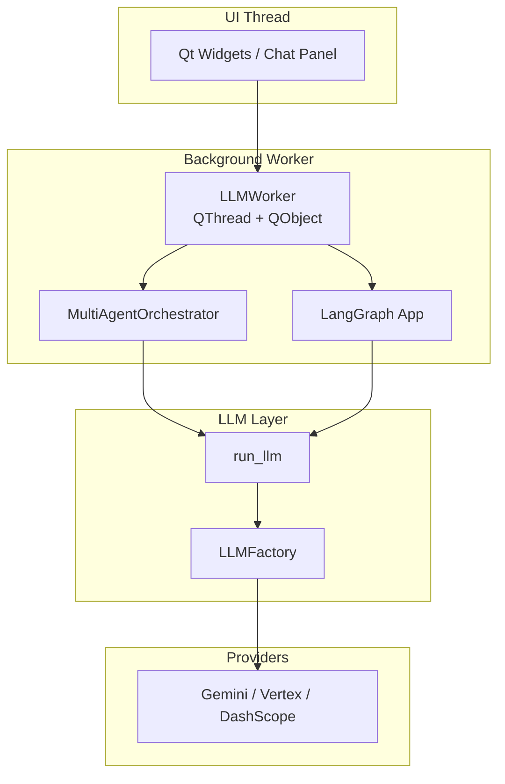
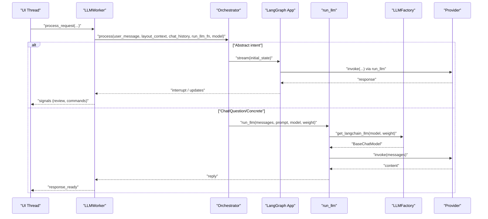
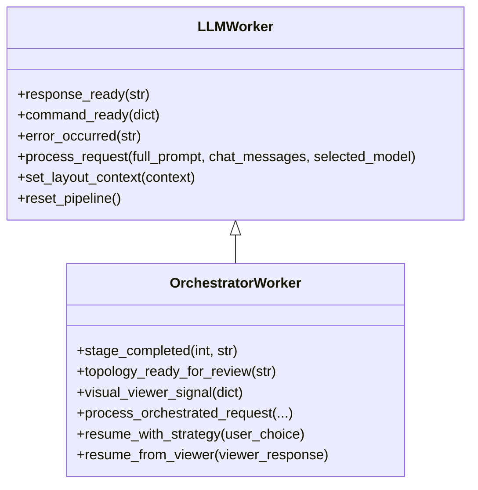
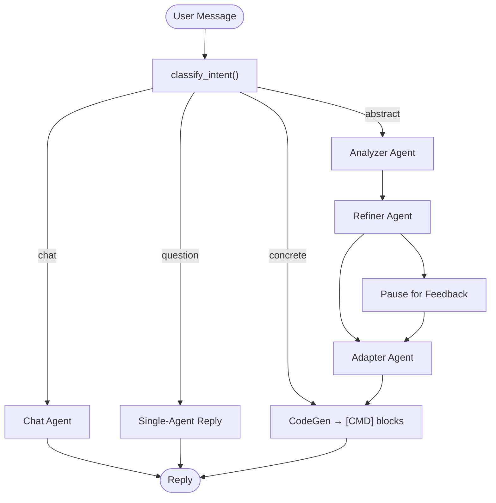
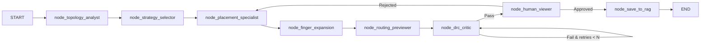
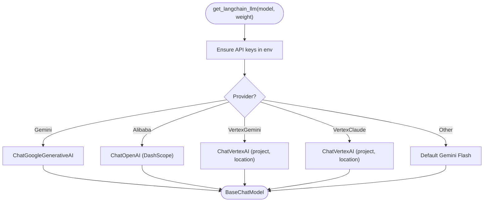
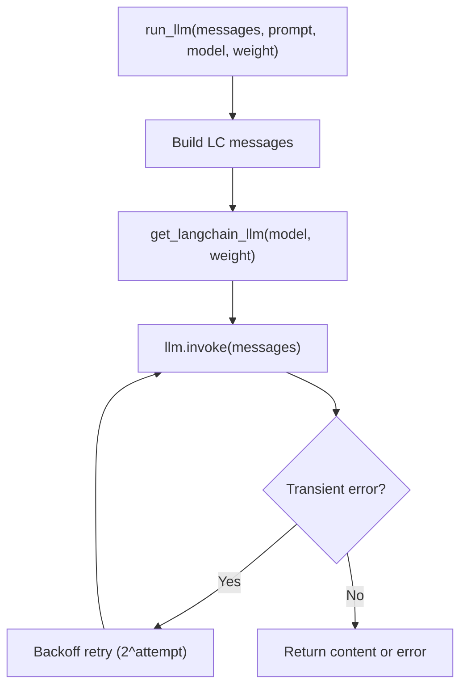
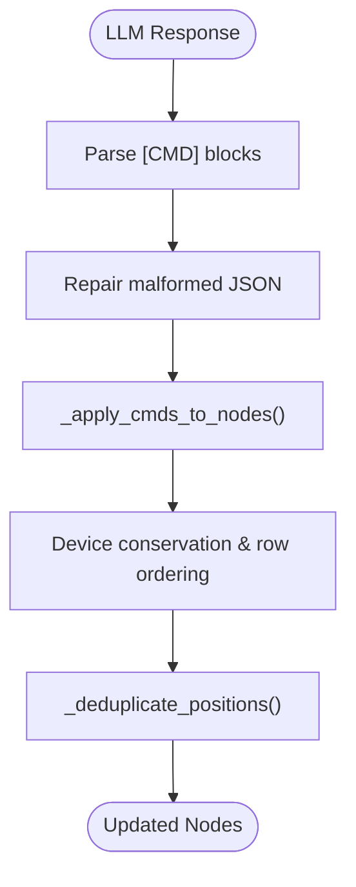
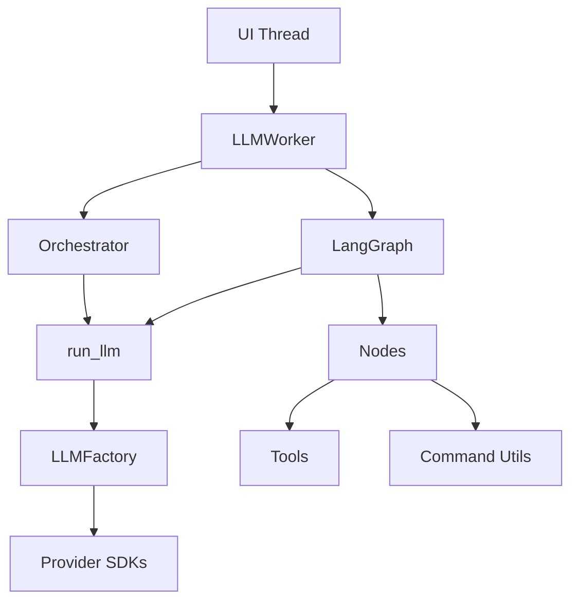
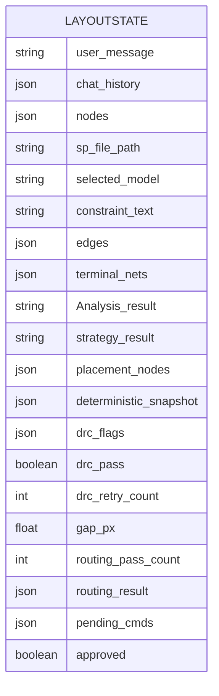

# LLM Integration and Provider System

<cite>
**Referenced Files in This Document**
- [llm_worker.py](file://ai_agent/ai_chat_bot/llm_worker.py)
- [llm_factory.py](file://ai_agent/ai_chat_bot/llm_factory.py)
- [run_llm.py](file://ai_agent/ai_chat_bot/run_llm.py)
- [orchestrator.py](file://ai_agent/ai_chat_bot/agents/orchestrator.py)
- [graph.py](file://ai_agent/ai_chat_bot/graph.py)
- [nodes.py](file://ai_agent/ai_chat_bot/nodes.py)
- [edges.py](file://ai_agent/ai_chat_bot/edges.py)
- [state.py](file://ai_agent/ai_chat_bot/state.py)
- [cmd_utils.py](file://ai_agent/ai_chat_bot/cmd_utils.py)
- [tools.py](file://ai_agent/ai_chat_bot/tools.py)
- [skill_middleware.py](file://ai_agent/ai_chat_bot/skill_middleware.py)
- [finger_grouping.py](file://ai_agent/ai_chat_bot/finger_grouping.py)
</cite>

## Table of Contents
1. [Introduction](#introduction)
2. [Project Structure](#project-structure)
3. [Core Components](#core-components)
4. [Architecture Overview](#architecture-overview)
5. [Detailed Component Analysis](#detailed-component-analysis)
6. [Dependency Analysis](#dependency-analysis)
7. [Performance Considerations](#performance-considerations)
8. [Troubleshooting Guide](#troubleshooting-guide)
9. [Conclusion](#conclusion)
10. [Appendices](#appendices)

## Introduction
This document explains the LLM Integration and Provider System used by the AI-Based Analog Layout Automation project. It focuses on:
- The thread-safe execution environment of the LLM worker
- The provider abstraction layer (LLMFactory) supporting multiple providers
- The unified API interface for invoking LLMs
- The command execution pipeline, response parsing/validation, error handling and retry mechanisms
- Performance optimization strategies
- Provider configuration, authentication, rate limiting, and fallback procedures
- Practical examples of provider switching, custom provider implementation, and troubleshooting

## Project Structure
The LLM integration resides under ai_agent/ai_chat_bot and orchestrates a multi-agent pipeline that communicates with LLM providers through a centralized factory and a unified interface. Key modules include:
- LLMWorker: Qt-based worker that runs LLM calls in a background thread and emits signals for GUI updates
- Orchestrator: Multi-agent orchestration for chat/question/concrete/abstract intents
- LangGraph pipeline: A state machine that drives topology analysis, strategy selection, placement, DRC, routing, and human review
- LLMFactory: Centralized provider/model instantiation with environment-driven configuration
- run_llm: Unified interface with retry/backoff for transient errors
- Command utilities: Parsing and applying [CMD] blocks to layout nodes
- Tools and middleware: Circuit graph building, DRC scoring, device conservation, and skill catalogs

**Diagram sources**
- [llm_worker.py:87-165](file://ai_agent/ai_chat_bot/llm_worker.py#L87-L165)
- [orchestrator.py:23-96](file://ai_agent/ai_chat_bot/agents/orchestrator.py#L23-L96)
- [graph.py:1-52](file://ai_agent/ai_chat_bot/graph.py#L1-L52)
- [run_llm.py:76-124](file://ai_agent/ai_chat_bot/run_llm.py#L76-L124)
- [llm_factory.py:29-131](file://ai_agent/ai_chat_bot/llm_factory.py#L29-L131)

**Section sources**
- [llm_worker.py:1-461](file://ai_agent/ai_chat_bot/llm_worker.py#L1-L461)
- [llm_factory.py:1-131](file://ai_agent/ai_chat_bot/llm_factory.py#L1-L131)
- [run_llm.py:1-162](file://ai_agent/ai_chat_bot/run_llm.py#L1-L162)
- [orchestrator.py:1-226](file://ai_agent/ai_chat_bot/agents/orchestrator.py#L1-L226)
- [graph.py:1-52](file://ai_agent/ai_chat_bot/graph.py#L1-L52)

## Core Components
- LLMWorker: Executes multi-agent orchestration and LangGraph pipelines in a background QThread, emitting signals for replies, commands, and errors. It supports both simple chat intents and complex abstract workflows.
- Orchestrator: Routes user messages to specialized agents (chat, question, concrete, abstract) and coordinates intermediate steps with run_llm.
- LangGraph pipeline: A state machine that drives topology analysis, strategy selection, placement, DRC, routing, and human-in-the-loop review.
- LLMFactory: Centralized provider/model instantiation with environment-driven timeouts and provider-specific configuration.
- run_llm: Unified interface that builds LangChain messages, invokes the factory, and handles retries for transient errors.
- Command utilities: Parse [CMD] blocks from LLM responses and apply them to layout nodes with validation and deduplication.
- Tools and middleware: Provide domain-specific tools (DRC, net crossing scoring, device conservation) and inject skill catalogs into prompts.

**Section sources**
- [llm_worker.py:87-165](file://ai_agent/ai_chat_bot/llm_worker.py#L87-L165)
- [orchestrator.py:23-96](file://ai_agent/ai_chat_bot/agents/orchestrator.py#L23-L96)
- [graph.py:1-52](file://ai_agent/ai_chat_bot/graph.py#L1-L52)
- [run_llm.py:76-162](file://ai_agent/ai_chat_bot/run_llm.py#L76-L162)
- [llm_factory.py:29-131](file://ai_agent/ai_chat_bot/llm_factory.py#L29-L131)
- [cmd_utils.py:61-107](file://ai_agent/ai_chat_bot/cmd_utils.py#L61-L107)
- [tools.py:15-114](file://ai_agent/ai_chat_bot/tools.py#L15-L114)
- [skill_middleware.py:19-102](file://ai_agent/ai_chat_bot/skill_middleware.py#L19-L102)

## Architecture Overview
The system separates concerns across threads and layers:
- UI thread: Initiates requests and listens for signals
- Background worker thread: Runs orchestrators and LangGraph, ensuring UI responsiveness
- LLM layer: Normalizes prompts/messages, selects provider/model, and executes calls
- Domain logic: Applies commands, validates placements, and enforces constraints

**Diagram sources**
- [llm_worker.py:103-157](file://ai_agent/ai_chat_bot/llm_worker.py#L103-L157)
- [orchestrator.py:43-96](file://ai_agent/ai_chat_bot/agents/orchestrator.py#L43-L96)
- [graph.py:337-380](file://ai_agent/ai_chat_bot/graph.py#L337-L380)
- [run_llm.py:126-157](file://ai_agent/ai_chat_bot/run_llm.py#L126-L157)
- [llm_factory.py:29-131](file://ai_agent/ai_chat_bot/llm_factory.py#L29-L131)

## Detailed Component Analysis

### LLMWorker: Thread-Safe Execution Environment
- Inherits QObject and runs on a background QThread to keep the UI responsive
- Emits signals for replies, commands, and errors
- Processes both simple and orchestrated requests:
  - Simple: chat/question/concrete intents routed to agents
  - Orchestrated: LangGraph pipeline with human-in-the-loop interrupts
- Stores layout context and resets orchestrator state when needed

**Diagram sources**
- [llm_worker.py:87-165](file://ai_agent/ai_chat_bot/llm_worker.py#L87-L165)
- [llm_worker.py:170-461](file://ai_agent/ai_chat_bot/llm_worker.py#L170-L461)

**Section sources**
- [llm_worker.py:87-165](file://ai_agent/ai_chat_bot/llm_worker.py#L87-L165)
- [llm_worker.py:170-461](file://ai_agent/ai_chat_bot/llm_worker.py#L170-L461)

### Orchestrator: Multi-Agent Orchestration
- Classifies user intent (chat, question, concrete, abstract)
- For abstract intents, coordinates Analyzer → Refiner → Adapter → CodeGen stages
- For concrete intents, invokes CodeGen to produce [CMD] blocks
- Maintains state to support human-in-the-loop feedback

**Diagram sources**
- [orchestrator.py:43-96](file://ai_agent/ai_chat_bot/agents/orchestrator.py#L43-L96)
- [orchestrator.py:139-226](file://ai_agent/ai_chat_bot/agents/orchestrator.py#L139-L226)

**Section sources**
- [orchestrator.py:23-226](file://ai_agent/ai_chat_bot/agents/orchestrator.py#L23-L226)

### LangGraph Pipeline: State Machine and Nodes
- Defines a state machine with nodes for topology analysis, strategy selection, placement, DRC, routing preview, human viewer, and persistence
- Uses conditional edges to support retries and human-in-the-loop
- Nodes invoke LLMs via run_llm with provider/model selection and apply command parsing and validation

**Diagram sources**
- [graph.py:1-52](file://ai_agent/ai_chat_bot/graph.py#L1-L52)
- [edges.py:6-24](file://ai_agent/ai_chat_bot/edges.py#L6-L24)

**Section sources**
- [graph.py:1-52](file://ai_agent/ai_chat_bot/graph.py#L1-L52)
- [edges.py:1-24](file://ai_agent/ai_chat_bot/edges.py#L1-L24)
- [nodes.py:325-613](file://ai_agent/ai_chat_bot/nodes.py#L325-L613)

### LLMFactory: Provider Abstraction Layer
- Centralized model instantiation with environment-driven configuration
- Supports provider selection and dynamic model choice based on task weight
- Handles timeouts and logs provider/model details
- Known providers: Gemini, Alibaba (DashScope), VertexGemini, VertexClaude
- Falls back to a default model for unknown providers

**Diagram sources**
- [llm_factory.py:29-131](file://ai_agent/ai_chat_bot/llm_factory.py#L29-L131)

**Section sources**
- [llm_factory.py:1-131](file://ai_agent/ai_chat_bot/llm_factory.py#L1-L131)

### Unified API Interface: run_llm
- Builds LangChain-compatible messages from chat transcripts
- Invokes LLMFactory to obtain a provider model
- Implements automatic retry with exponential backoff for transient errors (429/503)
- Parses and logs outcomes, returning either the LLM reply or an error message

**Diagram sources**
- [run_llm.py:76-162](file://ai_agent/ai_chat_bot/run_llm.py#L76-L162)

**Section sources**
- [run_llm.py:1-162](file://ai_agent/ai_chat_bot/run_llm.py#L1-L162)

### Command Execution Pipeline: Parsing and Application
- Extracts [CMD] blocks from LLM responses and repairs malformed JSON
- Applies commands to layout nodes with validation and deduplication
- Enforces device conservation and row ordering constraints
- Supports swap, move, flip, delete actions

**Diagram sources**
- [cmd_utils.py:61-107](file://ai_agent/ai_chat_bot/cmd_utils.py#L61-L107)
- [cmd_utils.py:109-171](file://ai_agent/ai_chat_bot/cmd_utils.py#L109-L171)

**Section sources**
- [cmd_utils.py:1-171](file://ai_agent/ai_chat_bot/cmd_utils.py#L1-L171)

### Provider Configuration, Authentication, Rate Limiting, and Fallbacks
- Environment-driven configuration:
  - API keys and provider-specific environment variables
  - Task-weighted timeouts via environment variables
- Authentication:
  - Gemini: GOOGLE_API_KEY or GEMINI_API_KEY
  - Vertex: VERTEX_PROJECT_ID and VERTEX_LOCATION
  - Alibaba: ALIBABA_API_KEY with DashScope base URL
- Rate limiting and retries:
  - Automatic retry for 429/503 with exponential backoff
  - Additional provider-side retry delay parsing
- Fallback:
  - Unknown provider falls back to a default Gemini model
  - Timeout-aware retries in node invocations

**Section sources**
- [llm_factory.py:46-126](file://ai_agent/ai_chat_bot/llm_factory.py#L46-L126)
- [run_llm.py:20-43](file://ai_agent/ai_chat_bot/run_llm.py#L20-L43)
- [nodes.py:225-241](file://ai_agent/ai_chat_bot/nodes.py#L225-L241)

### Practical Examples

#### Switching Providers
- Change the selected model parameter to switch providers at runtime
- Ensure the corresponding environment variables are set for the chosen provider

**Section sources**
- [llm_worker.py:110-137](file://ai_agent/ai_chat_bot/llm_worker.py#L110-L137)
- [llm_factory.py:29-131](file://ai_agent/ai_chat_bot/llm_factory.py#L29-L131)

#### Custom Provider Implementation
- Extend LLMFactory to add a new provider by instantiating the appropriate LangChain chat model
- Set environment variables and configure timeouts as needed

**Section sources**
- [llm_factory.py:119-126](file://ai_agent/ai_chat_bot/llm_factory.py#L119-L126)

#### Human-in-the-Loop Interruptions
- The LangGraph pipeline emits interrupts for strategy selection and visual review
- Resume the pipeline with user choices or viewer responses

**Section sources**
- [llm_worker.py:350-371](file://ai_agent/ai_chat_bot/llm_worker.py#L350-L371)
- [llm_worker.py:444-460](file://ai_agent/ai_chat_bot/llm_worker.py#L444-L460)

## Dependency Analysis
The system exhibits clear separation of concerns:
- UI thread depends on LLMWorker signals
- LLMWorker depends on Orchestrator and LangGraph
- Orchestrator and LangGraph depend on run_llm
- run_llm depends on LLMFactory
- LLMFactory depends on provider SDKs (LangChain integrations)
- Nodes depend on tools and command utilities for validation and application

**Diagram sources**
- [llm_worker.py:87-165](file://ai_agent/ai_chat_bot/llm_worker.py#L87-L165)
- [orchestrator.py:43-96](file://ai_agent/ai_chat_bot/agents/orchestrator.py#L43-L96)
- [graph.py:1-52](file://ai_agent/ai_chat_bot/graph.py#L1-L52)
- [run_llm.py:126-157](file://ai_agent/ai_chat_bot/run_llm.py#L126-L157)
- [llm_factory.py:29-131](file://ai_agent/ai_chat_bot/llm_factory.py#L29-L131)
- [nodes.py:1-800](file://ai_agent/ai_chat_bot/nodes.py#L1-L800)
- [tools.py:1-230](file://ai_agent/ai_chat_bot/tools.py#L1-L230)
- [cmd_utils.py:1-171](file://ai_agent/ai_chat_bot/cmd_utils.py#L1-L171)

**Section sources**
- [llm_worker.py:1-461](file://ai_agent/ai_chat_bot/llm_worker.py#L1-L461)
- [orchestrator.py:1-226](file://ai_agent/ai_chat_bot/agents/orchestrator.py#L1-L226)
- [graph.py:1-52](file://ai_agent/ai_chat_bot/graph.py#L1-L52)
- [run_llm.py:1-162](file://ai_agent/ai_chat_bot/run_llm.py#L1-L162)
- [llm_factory.py:1-131](file://ai_agent/ai_chat_bot/llm_factory.py#L1-L131)
- [nodes.py:1-800](file://ai_agent/ai_chat_bot/nodes.py#L1-L800)
- [tools.py:1-230](file://ai_agent/ai_chat_bot/tools.py#L1-L230)
- [cmd_utils.py:1-171](file://ai_agent/ai_chat_bot/cmd_utils.py#L1-L171)

## Performance Considerations
- Task-weighted models: Light tasks use faster/cheaper models; heavy tasks use more capable models
- Retries and backoff: Reduce impact of transient provider errors
- Timeout configuration: Controlled via environment variables per task weight
- Deduplication and validation: Minimizes redundant computation and ensures correctness
- Human-in-the-loop: Interrupts reduce unnecessary iterations and improve accuracy

[No sources needed since this section provides general guidance]

## Troubleshooting Guide
Common issues and resolutions:
- Provider timeouts: Retry with increased backoff; adjust timeouts via environment variables
- Rate limits (429/503): Automatic retry; wait before retrying manually if needed
- Malformed [CMD] blocks: Auto-repair attempts; inspect logs for repair warnings
- Device conservation failures: Indicates hallucinations or deletions; revert to original nodes
- DRC violations persist: Review LLM fixes and prescriptive engine; consider increasing retry counts
- Missing API keys: Ensure environment variables are set for the selected provider

**Section sources**
- [run_llm.py:91-123](file://ai_agent/ai_chat_bot/run_llm.py#L91-L123)
- [nodes.py:593-602](file://ai_agent/ai_chat_bot/nodes.py#L593-L602)
- [cmd_utils.py:84-101](file://ai_agent/ai_chat_bot/cmd_utils.py#L84-L101)
- [llm_factory.py:19-27](file://ai_agent/ai_chat_bot/llm_factory.py#L19-L27)

## Conclusion
The LLM Integration and Provider System provides a robust, thread-safe, and extensible framework for integrating multiple LLM providers into an analog layout automation pipeline. Through a centralized factory, unified interface, and well-defined orchestration layers, it supports both simple conversational flows and complex, multi-stage, human-in-the-loop workflows. Built-in retries, validation, and performance optimizations help ensure reliability and responsiveness.

## Appendices

### Data Models: LayoutState
The LangGraph state defines the shared data structure across pipeline stages.

**Diagram sources**
- [state.py:3-37](file://ai_agent/ai_chat_bot/state.py#L3-L37)

**Section sources**
- [state.py:1-37](file://ai_agent/ai_chat_bot/state.py#L1-L37)

### Skill Middleware and Tools
- SkillMiddleware: Discovers skills and augments prompts with a catalog and load_skill tool
- Tools: Provide DRC checks, net crossing scoring, device conservation, and overlap resolution

**Section sources**
- [skill_middleware.py:19-102](file://ai_agent/ai_chat_bot/skill_middleware.py#L19-L102)
- [tools.py:15-114](file://ai_agent/ai_chat_bot/tools.py#L15-L114)

### Finger Grouping and Expansion
- Aggregates multi-finger devices into logical units for placement
- Expands logical placement back to physical finger positions deterministically

**Section sources**
- [finger_grouping.py:198-354](file://ai_agent/ai_chat_bot/finger_grouping.py#L198-L354)