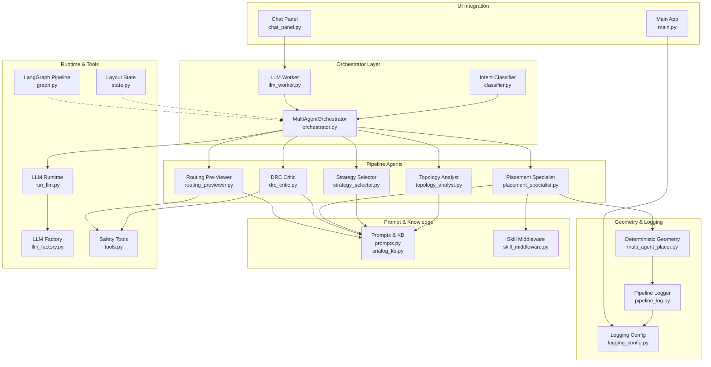
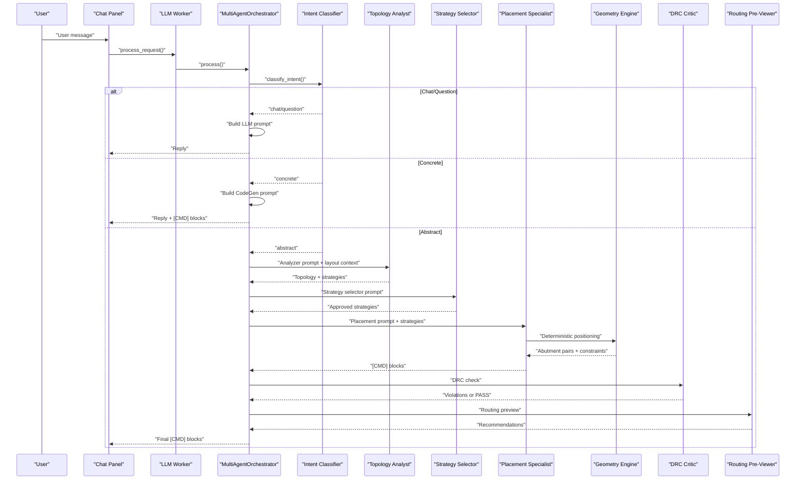
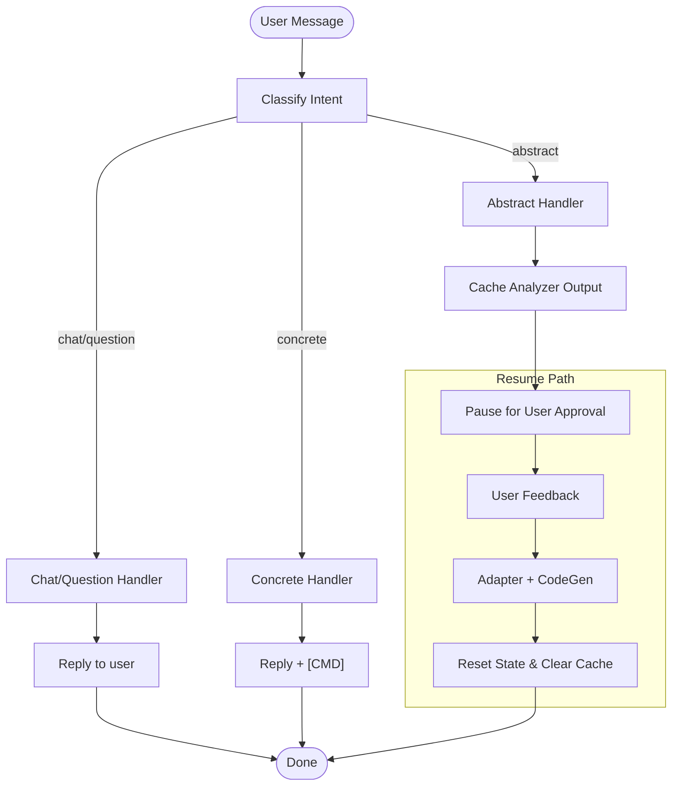
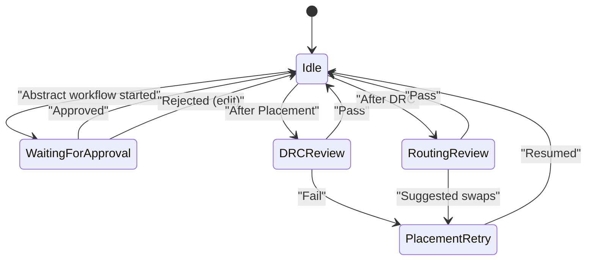
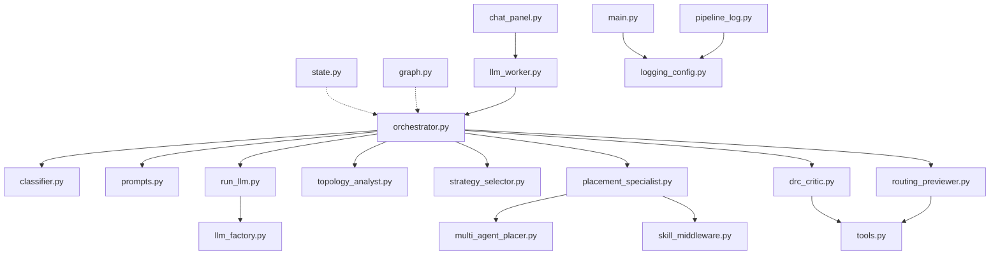

# Orchestration Engine and Pipeline

<cite>
**Referenced Files in This Document**
- [orchestrator.py](file://ai_agent/ai_chat_bot/agents/orchestrator.py)
- [state.py](file://ai_agent/ai_chat_bot/state.py)
- [topology_analyst.py](file://ai_agent/ai_chat_bot/agents/topology_analyst.py)
- [placement_specialist.py](file://ai_agent/ai_chat_bot/agents/placement_specialist.py)
- [drc_critic.py](file://ai_agent/ai_chat_bot/agents/drc_critic.py)
- [routing_previewer.py](file://ai_agent/ai_chat_bot/agents/routing_previewer.py)
- [prompts.py](file://ai_agent/ai_chat_bot/agents/prompts.py)
- [analog_kb.py](file://ai_agent/ai_chat_bot/analog_kb.py)
- [llm_factory.py](file://ai_agent/ai_chat_bot/llm_factory.py)
- [run_llm.py](file://ai_agent/ai_chat_bot/run_llm.py)
- [tools.py](file://ai_agent/ai_chat_bot/tools.py)
- [classifier.py](file://ai_agent/ai_chat_bot/agents/classifier.py)
- [strategy_selector.py](file://ai_agent/ai_chat_bot/agents/strategy_selector.py)
- [skill_middleware.py](file://ai_agent/ai_chat_bot/skill_middleware.py)
- [graph.py](file://ai_agent/ai_chat_bot/graph.py)
- [llm_worker.py](file://ai_agent/ai_chat_bot/llm_worker.py)
- [chat_panel.py](file://symbolic_editor/chat_panel.py)
- [main.py](file://symbolic_editor/main.py)
- [logging_config.py](file://config/logging_config.py)
- [pipeline_log.py](file://ai_agent/ai_chat_bot/pipeline_log.py)
- [multi_agent_placer.py](file://ai_agent/ai_initial_placement/multi_agent_placer.py)
- [sa_optimizer.py](file://ai_agent/ai_initial_placement/sa_optimizer.py)
</cite>

## Update Summary
**Changes Made**
- Enhanced deterministic geometry engine with multi-row abutment detection and row-level constraints
- Improved logging and debugging infrastructure with structured pipeline timing and progress tracking
- Added comprehensive UI integration layer with centralized logging configuration
- Expanded state management with deterministic snapshot capabilities
- Strengthened human-in-the-loop interruption handling with enhanced resume mechanisms

## Table of Contents
1. [Introduction](#introduction)
2. [Project Structure](#project-structure)
3. [Core Components](#core-components)
4. [Architecture Overview](#architecture-overview)
5. [Detailed Component Analysis](#detailed-component-analysis)
6. [Dependency Analysis](#dependency-analysis)
7. [Performance Considerations](#performance-considerations)
8. [Troubleshooting Guide](#troubleshooting-guide)
9. [Conclusion](#conclusion)
10. [Appendices](#appendices)

## Introduction
This document describes the Orchestration Engine and Pipeline system that powers the multi-agent layout automation workflow. The system has been enhanced with a deterministic geometry engine, improved logging and debugging infrastructure, and enhanced user interface integration. It explains how the MultiAgentOrchestrator manages conversation and stage-by-stage processing across four pipeline stages: Topology Analyst, Strategy Selector, Placement Specialist, DRC Critic, and Routing Pre-Viewer. The enhanced system now features deterministic device positioning, structured logging with pipeline timing, and seamless UI integration for human-in-the-loop interruptions.

## Project Structure
The orchestration pipeline is implemented in the ai_agent/ai_chat_bot package with modular agents, prompts, and utilities. The runtime orchestrator coordinates intent classification, stage execution, and human approval checkpoints. A LangGraph-based state machine complements the orchestrator for advanced control-flow and persistence. The enhanced system now includes centralized logging configuration and deterministic geometry processing.

**Diagram sources**
- [orchestrator.py:23-226](file://ai_agent/ai_chat_bot/agents/orchestrator.py#L23-L226)
- [llm_worker.py:87-165](file://ai_agent/ai_chat_bot/llm_worker.py#L87-L165)
- [multi_agent_placer.py:1002-1038](file://ai_agent/ai_initial_placement/multi_agent_placer.py#L1002-L1038)
- [pipeline_log.py:1-157](file://ai_agent/ai_chat_bot/pipeline_log.py#L1-L157)
- [logging_config.py:22-65](file://config/logging_config.py#L22-L65)
- [chat_panel.py:158-879](file://symbolic_editor/chat_panel.py#L158-L879)
- [main.py:24-26](file://symbolic_editor/main.py#L24-L26)

**Section sources**
- [orchestrator.py:1-226](file://ai_agent/ai_chat_bot/agents/orchestrator.py#L1-L226)
- [graph.py:1-52](file://ai_agent/ai_chat_bot/graph.py#L1-L52)
- [pipeline_log.py:1-157](file://ai_agent/ai_chat_bot/pipeline_log.py#L1-L157)
- [logging_config.py:1-65](file://config/logging_config.py#L1-L65)

## Core Components
- MultiAgentOrchestrator: Central controller that routes user intents to appropriate stages, manages state transitions, and supports human-in-the-loop interruptions with enhanced logging.
- Agents: Specialized modules for Topology Analysis, Strategy Selection, Placement, DRC checking, and Routing Preview with deterministic geometry support.
- Deterministic Geometry Engine: Multi-row abutment detection and row-level constraint enforcement for precise device positioning.
- Enhanced Logging Infrastructure: Structured pipeline timing, progress tracking, and centralized logging configuration with configurable verbosity.
- UI Integration Layer: Seamless integration between LLM workers, chat panels, and the symbolic editor with proper error handling and state synchronization.
- Prompts and Knowledge Base: Domain-specific system prompts and analog layout rules injected into agents.
- LLM Runtime and Factory: Unified interface for model invocation with retry/backoff and dynamic provider selection.
- Safety Tools: Validation and utility functions to preserve device inventory and resolve conflicts.
- State Management: Typed dictionary capturing layout state, strategy results, placement snapshots, DRC flags, routing metrics, and human approvals.

**Section sources**
- [orchestrator.py:23-226](file://ai_agent/ai_chat_bot/agents/orchestrator.py#L23-L226)
- [state.py:3-42](file://ai_agent/ai_chat_bot/state.py#L3-L42)
- [multi_agent_placer.py:1002-1038](file://ai_agent/ai_initial_placement/multi_agent_placer.py#L1002-L1038)
- [pipeline_log.py:1-157](file://ai_agent/ai_chat_bot/pipeline_log.py#L1-L157)
- [logging_config.py:22-65](file://config/logging_config.py#L22-L65)
- [llm_worker.py:87-165](file://ai_agent/ai_chat_bot/llm_worker.py#L87-L165)

## Architecture Overview
The orchestration engine implements a hybrid control flow with enhanced deterministic geometry processing and structured logging:
- Intent classification determines whether the request is chat/conversational, concrete (direct commands), or abstract (requires topology analysis).
- Abstract requests trigger a multi-stage pipeline with deterministic geometry processing: Topology Analyst → Strategy Selector → Placement Specialist → DRC Critic → Routing Pre-Viewer.
- Concrete requests are routed to a Code Generation stage that emits [CMD] blocks.
- Human-in-the-loop checkpoints occur after DRC and Routing Preview to allow user approval or edits with enhanced UI integration.
- A LangGraph-based state machine provides persistent state and conditional routing for advanced workflows.
- Centralized logging tracks pipeline progress with timestamps and structured timing information.
- Deterministic geometry engine ensures precise device positioning with multi-row abutment detection.

**Diagram sources**
- [llm_worker.py:103-165](file://ai_agent/ai_chat_bot/llm_worker.py#L103-L165)
- [orchestrator.py:43-226](file://ai_agent/ai_chat_bot/agents/orchestrator.py#L43-L226)
- [multi_agent_placer.py:1002-1038](file://ai_agent/ai_initial_placement/multi_agent_placer.py#L1002-L1038)

## Detailed Component Analysis

### Enhanced MultiAgentOrchestrator Workflow
The orchestrator maintains a simple state machine to manage mid-pipeline pauses for user approval with enhanced logging and debugging capabilities. It classifies intent, executes the appropriate handler, and transitions between states. During abstract workflows, it caches intermediate results to resume after user feedback.

Key behaviors with enhancements:
- State transitions: IDLE → WAITING_FOR_REFINER_FEEDBACK → IDLE with structured logging.
- Cached context: Analyzer output is retained until Adapter/CodeGen completes.
- Conversation control: Limits chat/history context to recent turns for efficiency.
- Enhanced logging: Print statements with timestamp and stage information for debugging.

**Diagram sources**
- [orchestrator.py:43-226](file://ai_agent/ai_chat_bot/agents/orchestrator.py#L43-L226)

**Section sources**
- [orchestrator.py:17-34](file://ai_agent/ai_chat_bot/agents/orchestrator.py#L17-L34)
- [orchestrator.py:43-96](file://ai_agent/ai_chat_bot/agents/orchestrator.py#L43-L96)
- [orchestrator.py:139-178](file://ai_agent/ai_chat_bot/agents/orchestrator.py#L139-L178)
- [orchestrator.py:182-226](file://ai_agent/ai_chat_bot/agents/orchestrator.py#L182-L226)

### Enhanced State Management and Conversation Control
The LayoutState typed dictionary now includes deterministic snapshot capabilities and expanded pipeline configuration options:
- Inputs: user message, chat history, nodes, SP file path, selected model.
- Topology: constraint text, edges, terminal nets.
- Strategy: analysis and strategy results.
- Placement: placement nodes, deterministic snapshot for reproducible positioning.
- DRC: flags, pass/fail, retry count, gap with enhanced dynamic gap computation.
- Routing: pass count and results.
- Pending updates: accumulated [CMD] blocks.
- Human approval: flag to gate resume.
- Pipeline config: run_SA, no_abutment, abutment_candidates for enhanced control.

Conversation control enhancements:
- Chat handlers limit history to the last N turns to reduce token usage.
- Context building injects layout summary and device lists into prompts.
- Deterministic snapshot enables reproducible placement workflows.

**Section sources**
- [state.py:3-42](file://ai_agent/ai_chat_bot/state.py#L3-L42)
- [prompts.py:287-382](file://ai_agent/ai_chat_bot/agents/prompts.py#L287-L382)
- [orchestrator.py:100-121](file://ai_agent/ai_chat_bot/agents/orchestrator.py#L100-L121)

### Deterministic Geometry Engine and Enhanced Logging
The system now features a sophisticated deterministic geometry engine with multi-row abutment detection and structured logging infrastructure:

**Deterministic Geometry Engine:**
- Multi-row abutment detection ensures devices are positioned correctly within rows
- Row-level constraint enforcement prevents cross-row positioning errors
- Abutment pair generation considers both explicit candidates and implicit adjacency
- Enhanced coordinate derivation with mechanical precision (0.294 μm pitch)

**Enhanced Logging Infrastructure:**
- Structured pipeline timing with stage-level performance tracking
- Timestamped console output for debugging and monitoring
- Environment-controlled verbosity (PLACEMENT_STEPS_ONLY, PLACEMENT_DEBUG_FULL_LOG)
- Windows character encoding safety for cross-platform compatibility
- Pipeline lifecycle management with start/end banners and summaries

**Section sources**
- [multi_agent_placer.py:1002-1038](file://ai_agent/ai_initial_placement/multi_agent_placer.py#L1002-L1038)
- [pipeline_log.py:1-157](file://ai_agent/ai_chat_bot/pipeline_log.py#L1-L157)
- [logging_config.py:22-65](file://config/logging_config.py#L22-L65)

### Enhanced UI Integration and Human-in-the-Loop Interruption Handling
The system now provides seamless UI integration with enhanced human-in-the-loop capabilities:

**UI Integration Layer:**
- Centralized logging configuration at application startup
- Thread-safe LLM worker with Qt signal/slot communication
- Chat panel integration with command parsing and execution
- Symbolic editor main window with proper resource cleanup
- Generic worker pattern for background task execution

**Enhanced Interruption Handling:**
- After Abstract stage: Orchestrator pauses and waits for user approval before proceeding to Adapter/CodeGen.
- After DRC: Orchestrator can loop back to Placement if violations are found.
- After Routing Preview: Orchestrator can loop back to Placement for suggested swaps.
- Enhanced resume mechanisms with proper state restoration and cache clearing.
- Structured logging for debugging interruption points and resume flows.

**Diagram sources**
- [orchestrator.py:17-34](file://ai_agent/ai_chat_bot/agents/orchestrator.py#L17-L34)
- [drc_critic.py:265-546](file://ai_agent/ai_chat_bot/agents/drc_critic.py#L265-L546)
- [routing_previewer.py:125-269](file://ai_agent/ai_chat_bot/agents/routing_previewer.py#L125-L269)

**Section sources**
- [orchestrator.py:139-178](file://ai_agent/ai_chat_bot/agents/orchestrator.py#L139-L178)
- [orchestrator.py:182-226](file://ai_agent/ai_chat_bot/agents/orchestrator.py#L182-L226)
- [llm_worker.py:87-165](file://ai_agent/ai_chat_bot/llm_worker.py#L87-L165)
- [chat_panel.py:158-879](file://symbolic_editor/chat_panel.py#L158-L879)
- [main.py:24-26](file://symbolic_editor/main.py#L24-L26)

### Enhanced Pipeline Execution Examples
- Example 1: Improve matching in a current mirror with deterministic geometry
  - User: "Improve matching for the current mirror."
  - Classifier: abstract
  - Topology Analyst: identifies mirror topology and matching requirements.
  - Strategy Selector: proposes interdigitated/common centroid strategies.
  - Placement Specialist: generates [CMD] blocks for finger interleaving with deterministic positioning.
  - Deterministic Geometry Engine: ensures proper abutment and row-level constraints.
  - DRC Critic: validates overlaps/gaps with enhanced dynamic gap computation; if violations, suggests fixes.
  - Routing Pre-Viewer: recommends swaps to reduce wire length and crossings.
  - Orchestrator: returns final [CMD] blocks after user approval.

- Example 2: Direct device operation with UI integration
  - User: "Swap MM3 and MM5."
  - Classifier: concrete
  - Orchestrator: builds CodeGen prompt and emits [CMD] blocks immediately.
  - Chat Panel: parses and executes commands with proper error handling.
  - UI Integration: updates symbolic editor with new device positions.

- Example 3: Routing optimization with enhanced logging
  - User: "Reduce routing crossings."
  - Classifier: abstract
  - Topology Analyst → Strategy Selector → Placement Specialist → Deterministic Geometry → DRC → Routing Pre-Viewer
  - Pipeline Logger: tracks stage completion with timing information.
  - Orchestrator: returns [CMD] blocks for swaps and net prioritization.

**Section sources**
- [classifier.py:60-105](file://ai_agent/ai_chat_bot/agents/classifier.py#L60-L105)
- [topology_analyst.py:27-159](file://ai_agent/ai_chat_bot/agents/topology_analyst.py#L27-L159)
- [strategy_selector.py:123-168](file://ai_agent/ai_chat_bot/agents/strategy_selector.py#L123-L168)
- [placement_specialist.py:15-596](file://ai_agent/ai_chat_bot/agents/placement_specialist.py#L15-L596)
- [drc_critic.py:265-546](file://ai_agent/ai_chat_bot/agents/drc_critic.py#L265-L546)
- [routing_previewer.py:125-269](file://ai_agent/ai_chat_bot/agents/routing_previewer.py#L125-L269)
- [prompts.py:189-241](file://ai_agent/ai_chat_bot/agents/prompts.py#L189-L241)

### Enhanced Error Recovery Procedures
- LLM runtime with retry/backoff: Automatic exponential backoff for transient API errors (429/503).
- Device conservation guard: Validates that all original devices are present after proposed changes.
- Overlap resolution: Iterative row sweep to eliminate overlaps; cascading fixes converge.
- Enhanced DRC legalizer: Cost-driven movement with symmetry preservation for matched groups and dynamic gap computation.
- Routing scoring: Estimates wire length and crossings; suggests targeted swaps.
- Centralized logging: Structured error reporting with timestamps and stack traces.
- UI integration: Graceful error handling with user-friendly error messages and proper cleanup.

**Section sources**
- [run_llm.py:76-162](file://ai_agent/ai_chat_bot/run_llm.py#L76-L162)
- [tools.py:69-114](file://ai_agent/ai_chat_bot/tools.py#L69-L114)
- [tools.py:170-209](file://ai_agent/ai_chat_bot/tools.py#L170-L209)
- [drc_critic.py:575-800](file://ai_agent/ai_chat_bot/agents/drc_critic.py#L575-L800)
- [routing_previewer.py:125-269](file://ai_agent/ai_chat_bot/agents/routing_previewer.py#L125-L269)
- [llm_factory.py:49-131](file://ai_agent/ai_chat_bot/llm_factory.py#L49-L131)
- [logging_config.py:22-65](file://config/logging_config.py#L22-L65)

## Dependency Analysis
The orchestrator coordinates several subsystems with clear boundaries and enhanced integration:
- Agents depend on prompts and optionally on the analog knowledge base.
- LLM runtime depends on the factory for provider/model selection.
- Safety tools are used by DRC and Routing agents to validate and sanitize outputs.
- Deterministic geometry engine integrates with placement specialists for precise positioning.
- Centralized logging configuration affects all components uniformly.
- UI integration layer connects LLM workers to the symbolic editor interface.

**Diagram sources**
- [orchestrator.py:69-95](file://ai_agent/ai_chat_bot/agents/orchestrator.py#L69-L95)
- [run_llm.py:126-154](file://ai_agent/ai_chat_bot/run_llm.py#L126-L154)
- [llm_factory.py:29-131](file://ai_agent/ai_chat_bot/llm_factory.py#L29-L131)
- [topology_analyst.py:27-159](file://ai_agent/ai_chat_bot/agents/topology_analyst.py#L27-L159)
- [strategy_selector.py:123-168](file://ai_agent/ai_chat_bot/agents/strategy_selector.py#L123-L168)
- [placement_specialist.py:15-596](file://ai_agent/ai_chat_bot/agents/placement_specialist.py#L15-L596)
- [drc_critic.py:265-546](file://ai_agent/ai_chat_bot/agents/drc_critic.py#L265-L546)
- [routing_previewer.py:125-269](file://ai_agent/ai_chat_bot/agents/routing_previewer.py#L125-L269)
- [skill_middleware.py:19-102](file://ai_agent/ai_chat_bot/skill_middleware.py#L19-L102)
- [tools.py:15-230](file://ai_agent/ai_chat_bot/tools.py#L15-L230)
- [state.py:3-42](file://ai_agent/ai_chat_bot/state.py#L3-L42)
- [graph.py:1-52](file://ai_agent/ai_chat_bot/graph.py#L1-L52)
- [llm_worker.py:87-165](file://ai_agent/ai_chat_bot/llm_worker.py#L87-L165)
- [chat_panel.py:158-879](file://symbolic_editor/chat_panel.py#L158-L879)
- [main.py:24-26](file://symbolic_editor/main.py#L24-L26)
- [logging_config.py:22-65](file://config/logging_config.py#L22-L65)
- [pipeline_log.py:1-157](file://ai_agent/ai_chat_bot/pipeline_log.py#L1-L157)

**Section sources**
- [orchestrator.py:69-95](file://ai_agent/ai_chat_bot/agents/orchestrator.py#L69-L95)
- [run_llm.py:126-154](file://ai_agent/ai_chat_bot/run_llm.py#L126-L154)
- [graph.py:1-52](file://ai_agent/ai_chat_bot/graph.py#L1-L52)

## Performance Considerations
- Prompt size control: Chat handlers cap history length; context builders summarize layout data.
- LLM cost optimization: Classifier uses regex fast-path for trivial cases; only ambiguous intents invoke the LLM.
- Computational complexity:
  - DRC overlap detection upgraded to O(N log N + R) using sweep-line technique with enhanced dynamic gap computation.
  - Routing preview computes per-net spans and crossings efficiently.
  - Deterministic geometry engine ensures O(1) abutment validation per device pair.
- Retry/backoff reduces pipeline downtime from transient API failures.
- Centralized logging adds minimal overhead with environment-controlled verbosity.
- UI integration uses thread-safe communication patterns to prevent blocking.

## Troubleshooting Guide
Common issues and remedies with enhanced debugging:
- Rate limits and transient errors: LLM runtime retries with exponential backoff; monitor logs for transient error markers.
- Device conservation failure: Use the validation tool to detect missing or extra devices; adjust commands to restore inventory.
- Overlaps persist after DRC fixes: The overlap resolver iteratively pushes devices; verify row boundaries and device widths.
- Routing score remains high: Review critical nets and consider suggested swaps; prioritize differential and output nets.
- Model selection problems: Ensure environment variables for providers are configured; the factory logs provider/model details.
- Pipeline timing issues: Check pipeline_log.py output for stage completion times and bottlenecks.
- UI integration problems: Verify logging_config.py is loaded before other components; check for proper signal/slot connections.
- Deterministic geometry errors: Review multi_agent_placer.py output for abutment pair validation and row constraint violations.

**Section sources**
- [run_llm.py:98-124](file://ai_agent/ai_chat_bot/run_llm.py#L98-L124)
- [tools.py:69-114](file://ai_agent/ai_chat_bot/tools.py#L69-L114)
- [tools.py:170-209](file://ai_agent/ai_chat_bot/tools.py#L170-L209)
- [drc_critic.py:575-800](file://ai_agent/ai_chat_bot/agents/drc_critic.py#L575-L800)
- [routing_previewer.py:125-269](file://ai_agent/ai_chat_bot/agents/routing_previewer.py#L125-L269)
- [llm_factory.py:49-131](file://ai_agent/ai_chat_bot/llm_factory.py#L49-L131)
- [pipeline_log.py:146-157](file://ai_agent/ai_chat_bot/pipeline_log.py#L146-L157)
- [logging_config.py:22-65](file://config/logging_config.py#L22-L65)

## Conclusion
The enhanced Orchestration Engine and Pipeline system integrates intent classification, modular agent stages, robust prompt engineering, deterministic geometry processing, and human-in-the-loop controls to deliver reliable layout automation. The MultiAgentOrchestrator coordinates state transitions, preserves context across stages, and recovers gracefully from errors with enhanced logging and debugging capabilities. The deterministic geometry engine ensures precise device positioning with multi-row abutment detection, while the centralized logging infrastructure provides structured pipeline monitoring. The UI integration layer enables seamless interaction between the AI system and the symbolic editor. Together, these components enable scalable, explainable, and maintainable multi-agent layout workflows with enhanced reliability and debugging support.

## Appendices

### Enhanced Pipeline Stage-by-Stage Breakdown
- Topology Analyst: Extracts circuit topology, roles, matching/symmetry requirements, and outputs structured groups.
- Strategy Selector: Generates non-conflicting, placement-only strategies tailored to topology groups.
- Placement Specialist: Produces [CMD] blocks for device repositioning with strict inventory and row constraints using deterministic geometry.
- Deterministic Geometry Engine: Multi-row abutment detection and row-level constraint enforcement for precise device positioning.
- DRC Critic: Validates overlaps, gaps, and row-type correctness with enhanced dynamic gap computation; computes legal moves with symmetry preservation.
- Routing Pre-Viewer: Scores routing quality and recommends swaps/net priorities to reduce crossings and wire length.

**Section sources**
- [topology_analyst.py:27-159](file://ai_agent/ai_chat_bot/agents/topology_analyst.py#L27-L159)
- [strategy_selector.py:9-103](file://ai_agent/ai_chat_bot/agents/strategy_selector.py#L9-L103)
- [placement_specialist.py:15-596](file://ai_agent/ai_chat_bot/agents/placement_specialist.py#L15-L596)
- [multi_agent_placer.py:1002-1038](file://ai_agent/ai_initial_placement/multi_agent_placer.py#L1002-L1038)
- [drc_critic.py:265-546](file://ai_agent/ai_chat_bot/agents/drc_critic.py#L265-L546)
- [routing_previewer.py:125-269](file://ai_agent/ai_chat_bot/agents/routing_previewer.py#L125-L269)

### Enhanced Human-in-the-Loop and Resume Mechanisms
- Pause after Abstract stage: Orchestrator caches analyzer output and waits for user choice with enhanced logging.
- Resume after DRC/Routing: Orchestrator loops back to Placement with suggested changes; user can approve or edit.
- State reset: Orchestrator clears cached data and resets state upon successful completion.
- UI integration: Chat panel handles command parsing, execution, and error reporting with proper cleanup.
- Logging integration: Structured pipeline timing and progress tracking for debugging and monitoring.

**Section sources**
- [orchestrator.py:139-178](file://ai_agent/ai_chat_bot/agents/orchestrator.py#L139-L178)
- [orchestrator.py:182-226](file://ai_agent/ai_chat_bot/agents/orchestrator.py#L182-L226)
- [chat_panel.py:158-879](file://symbolic_editor/chat_panel.py#L158-L879)
- [pipeline_log.py:146-157](file://ai_agent/ai_chat_bot/pipeline_log.py#L146-L157)