# Specialized Agent Types

<cite>
**Referenced Files in This Document**
- [classifier.py](file://ai_agent/ai_chat_bot/agents/classifier.py)
- [drc_critic.py](file://ai_agent/ai_chat_bot/agents/drc_critic.py)
- [placement_specialist.py](file://ai_agent/ai_chat_bot/agents/placement_specialist.py)
- [topology_analyst.py](file://ai_agent/ai_chat_bot/agents/topology_analyst.py)
- [routing_previewer.py](file://ai_agent/ai_chat_bot/agents/routing_previewer.py)
- [strategy_selector.py](file://ai_agent/ai_chat_bot/agents/strategy_selector.py)
- [orchestrator.py](file://ai_agent/ai_chat_bot/agents/orchestrator.py)
- [prompts.py](file://ai_agent/ai_chat_bot/agents/prompts.py)
- [state.py](file://ai_agent/ai_chat_bot/state.py)
- [analog_kb.py](file://ai_agent/ai_chat_bot/analog_kb.py)
- [tools.py](file://ai_agent/ai_chat_bot/tools.py)
</cite>

## Table of Contents
1. [Introduction](#introduction)
2. [System Architecture Overview](#system-architecture-overview)
3. [Classifier Agent](#classifier-agent)
4. [Topology Analyst Agent](#topology-analyst-agent)
5. [Strategy Selector Agent](#strategy-selector-agent)
6. [Placement Specialist Agent](#placement-specialist-agent)
7. [DRC Critic Agent](#drc-critic-agent)
8. [Routing Pre-Viewer Agent](#routing-pre-viewer-agent)
9. [Agent Collaboration Patterns](#agent-collaboration-patterns)
10. [Decision Trees and Workflows](#decision-trees-and-workflows)
11. [Error Handling and Validation](#error-handling-and-validation)
12. [Performance Considerations](#performance-considerations)
13. [Practical Examples](#practical-examples)
14. [Conclusion](#conclusion)

## Introduction

The AI-Based Analog Layout Automation system employs a sophisticated multi-agent architecture designed to automate complex analog IC layout tasks. Each agent specializes in specific aspects of the layout process, from initial intent classification to final routing optimization. This documentation provides comprehensive coverage of each specialized agent type, their responsibilities, internal mechanisms, and collaborative patterns within the overall pipeline.

The system operates on a four-stage pipeline: Topology Analysis → Strategy Selection → Placement → DRC Verification → Routing Optimization. Each agent plays a crucial role in maintaining design rule compliance, achieving optimal device matching, and minimizing routing complexity while preserving analog performance characteristics.

## System Architecture Overview

The multi-agent system follows a structured pipeline architecture with clear separation of concerns:

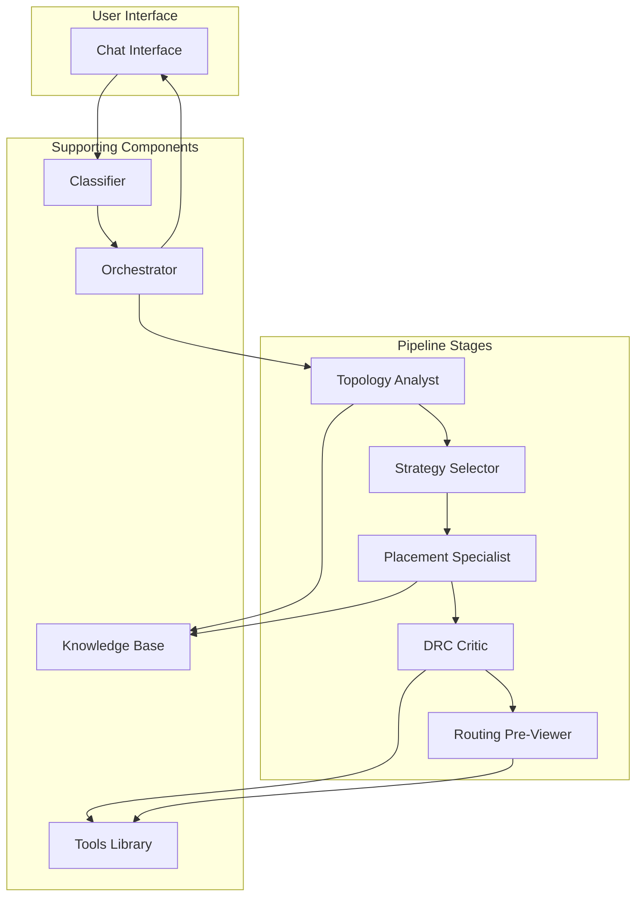

**Diagram sources**
- [orchestrator.py:23-226](file://ai_agent/ai_chat_bot/agents/orchestrator.py#L23-L226)
- [classifier.py:60-105](file://ai_agent/ai_chat_bot/agents/classifier.py#L60-L105)

The architecture emphasizes modularity, with each agent maintaining distinct responsibilities while sharing common data structures and validation mechanisms.

## Classifier Agent

### Purpose and Responsibilities

The Classifier Agent serves as the entry point and traffic cop for the multi-agent system. Its primary function is to rapidly categorize user intents into four distinct types: concrete operations, abstract design goals, informational questions, and casual conversation.

### Intent Classification Mechanism

The classifier employs a hybrid approach combining regex-based fast-path detection with LLM-assisted classification:

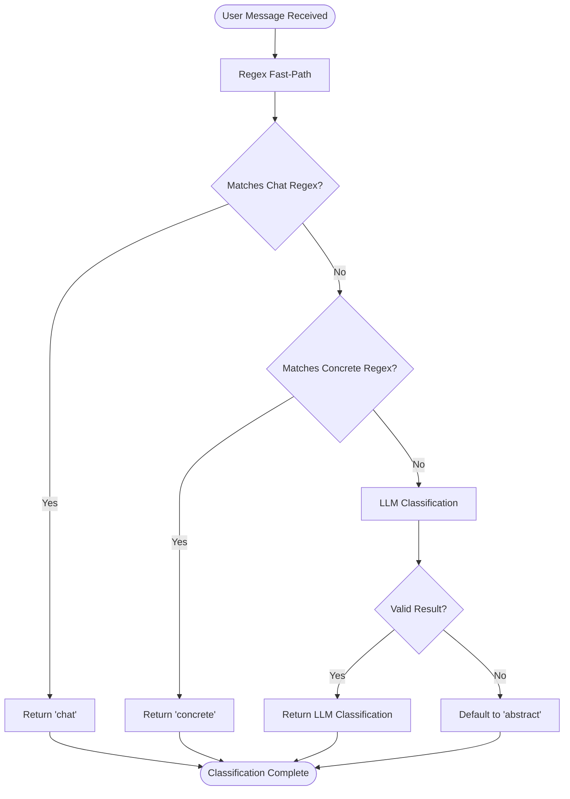

**Diagram sources**
- [classifier.py:75-105](file://ai_agent/ai_chat_bot/agents/classifier.py#L75-L105)

### Classification Categories

The agent recognizes four distinct intent categories:

1. **CHAT**: Casual conversation, greetings, and small talk
2. **CONCRETE**: Direct device manipulation commands
3. **ABSTRACT**: High-level design optimization requests
4. **QUESTION**: Informational queries requiring no layout changes

### Input/Output Specifications

**Input:**
- `user_message`: Raw text from chat interface
- `selected_model`: LLM backend identifier

**Output:**
- String classification: 'concrete', 'abstract', 'question', or 'chat'
- Graceful fallback to 'abstract' on LLM failures

**Section sources**
- [classifier.py:60-105](file://ai_agent/ai_chat_bot/agents/classifier.py#L60-L105)

## Topology Analyst Agent

### Purpose and Responsibilities

The Topology Analyst Agent performs circuit topology analysis to identify fundamental analog building blocks and their electrical relationships. This agent transforms raw device and netlist data into structured topology information that guides subsequent optimization stages.

### Topology Analysis Process

The agent implements a comprehensive analysis pipeline that identifies:

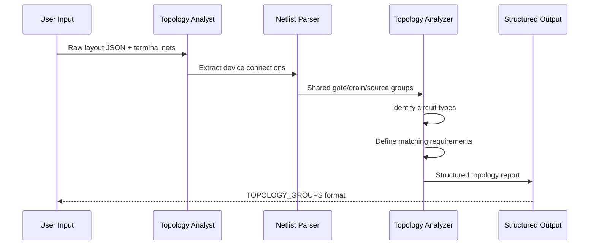

**Diagram sources**
- [topology_analyst.py:163-326](file://ai_agent/ai_chat_bot/agents/topology_analyst.py#L163-L326)

### Circuit Type Recognition

The agent identifies key analog circuit topologies:

- **Differential Pairs**: Complementary input devices with shared source
- **Current Mirrors**: Reference and copy devices sharing gate nets
- **Cascode Structures**: Stacked devices for improved performance
- **Active Loads**: Current-steering devices
- **Bias Networks**: Reference current provision
- **Logic Gates**: CMOS implementation structures

### Output Format and Structure

The agent produces a standardized output format:

```
CIRCUIT_TYPE:
[Overall circuit function]

TOPOLOGY_GROUPS:

[GROUP_NAME_1]
Type: [Differential Pair / Current Mirror / Cascode]
Devices: [D1, D2, D3, ...]
Roles:
  - D1: [role]
  - D2: [role]
Secondary_Tags:
  - D1: [tag1, tag2, ...]
  - D2: [tag1, ...]
Matching_Requirements:
  - [Device matching statements]
Symmetry:
  - [Symmetry requirements]
```

**Section sources**
- [topology_analyst.py:27-159](file://ai_agent/ai_chat_bot/agents/topology_analyst.py#L27-L159)
- [topology_analyst.py:163-326](file://ai_agent/ai_chat_bot/agents/topology_analyst.py#L163-L326)

## Strategy Selector Agent

### Purpose and Responsibilities

The Strategy Selector Agent generates high-level floorplanning strategies based on the identified topology and user requirements. Unlike the Analyzer agent, it focuses on conceptual placement approaches rather than specific device manipulations.

### Strategy Generation Process

The agent implements a sophisticated strategy generation system:

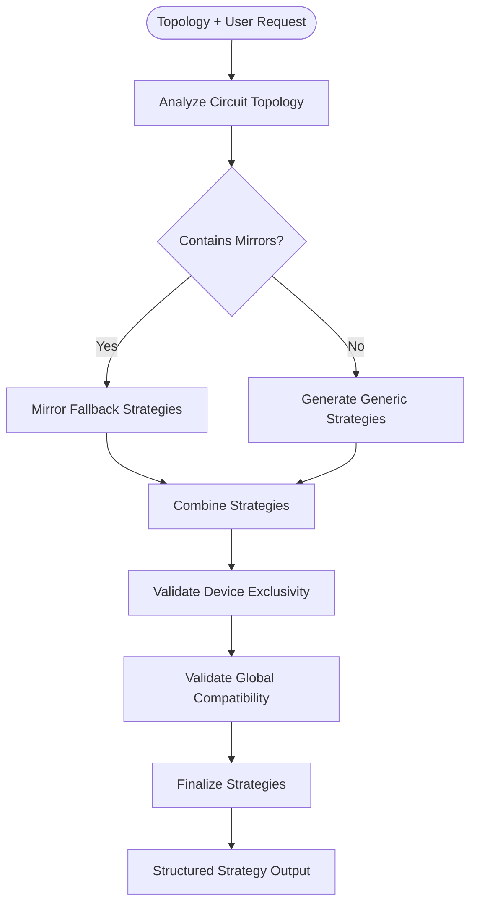

**Diagram sources**
- [strategy_selector.py:123-219](file://ai_agent/ai_chat_bot/agents/strategy_selector.py#L123-L219)

### Strategy Categories

The agent generates strategies focusing on:

1. **Common Centroid Placement**: Multi-row symmetric arrangements
2. **Interdigitated Placement**: Single-row alternating patterns
3. **Symmetry Enhancement**: Horizontal and vertical symmetry optimization
4. **Clustering Strategies**: Device grouping for matching enhancement

### Output Generation

The agent produces strategies in a standardized format with clear placement instructions and rationale for each approach.

**Section sources**
- [strategy_selector.py:9-103](file://ai_agent/ai_chat_bot/agents/strategy_selector.py#L9-L103)
- [strategy_selector.py:123-219](file://ai_agent/ai_chat_bot/agents/strategy_selector.py#L123-L219)

## Placement Specialist Agent

### Purpose and Responsibilities

The Placement Specialist Agent generates precise device positioning commands while enforcing strict layout constraints, device conservation, and matching requirements. This agent operates at the device-level with sophisticated algorithms for different matching techniques.

### Placement Algorithms

The agent implements four distinct placement algorithms:

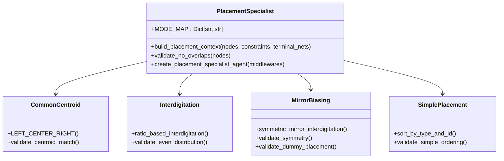

**Diagram sources**
- [placement_specialist.py:15-596](file://ai_agent/ai_chat_bot/agents/placement_specialist.py#L15-L596)

### Mode Assignment System

The agent uses a hierarchical mode assignment system:

1. **Mirror Biasing (MB)**: Highest priority for matched pairs
2. **Common Centroid (CC)**: For advanced matching requirements  
3. **Interdigitation (IG)**: Balanced matching and routing
4. **Simple (S)**: Basic left-to-right ordering

### Validation Framework

The agent implements comprehensive validation:

- **Device Conservation**: Ensures all devices present exactly once
- **Overlap Detection**: Prevents device collisions
- **Centroid Validation**: Verifies matching requirements
- **Symmetry Validation**: Maintains geometric relationships
- **Dummy Placement**: Enforces proper dummy device positioning

**Section sources**
- [placement_specialist.py:15-596](file://ai_agent/ai_chat_bot/agents/placement_specialist.py#L15-L596)
- [placement_specialist.py:615-641](file://ai_agent/ai_chat_bot/agents/placement_specialist.py#L615-L641)

## DRC Critic Agent

### Purpose and Responsibilities

The DRC Critic Agent performs comprehensive design rule checking and violation detection for analog IC layouts. It implements advanced algorithms for overlap detection, gap computation, and legalizing violations while preserving critical layout symmetries.

### Advanced DRC Algorithms

The agent implements three major algorithmic innovations:

```mermaid
flowchart TD
Start([Layout Input]) --> DetectViolations[Detect Violations]
DetectViolations --> OverlapDetection[Sweep-Line Overlap Detection]
DetectViolations --> GapCalculation[Dynamic Gap Computation]
DetectViolations --> RowValidation[Row-Type Validation]
OverlapDetection --> O_N_LOG_N[O(N log N + R) Algorithm]
GapCalculation --> YieldLimiting[Yield-Limiting Constraints]
RowValidation --> CrossTypeHandling[Cross-Type Violation Handling]
O_N_LOG_N --> GenerateFixes[Generate Prescriptive Fixes]
YieldLimiting --> GenerateFixes
CrossTypeHandling --> GenerateFixes
GenerateFixes --> Legalization[Cost-Driven Legalization]
Legalization --> SymmetryPreservation[Symmetry Preservation]
SymmetryPreservation --> Output[Structured Command Output]
```

**Diagram sources**
- [drc_critic.py:184-259](file://ai_agent/ai_chat_bot/agents/drc_critic.py#L184-L259)
- [drc_critic.py:575-800](file://ai_agent/ai_chat_bot/agents/drc_critic.py#L575-L800)

### Violation Detection System

The agent identifies three primary violation types:

1. **OVERLAP**: Geometric overlap between devices
2. **GAP**: Insufficient spacing between devices
3. **ROW_ERROR**: Devices in incorrect row types

### Legalization Algorithm

The agent implements a cost-driven legalization system:

- **Manhattan Cost Function**: α·|Δx| + β·|Δy| + γ·HPWL penalty
- **Symmetry Preservation**: Maintains matched group relationships
- **Group Movement**: Applies uniform displacements to matched groups
- **Row Constraint Enforcement**: Preserves PMOS/NMOS row separation

**Section sources**
- [drc_critic.py:106-101](file://ai_agent/ai_chat_bot/agents/drc_critic.py#L106-L101)
- [drc_critic.py:184-546](file://ai_agent/ai_chat_bot/agents/drc_critic.py#L184-L546)
- [drc_critic.py:575-800](file://ai_agent/ai_chat_bot/agents/drc_critic.py#L575-L800)

## Routing Pre-Viewer Agent

### Purpose and Responsibilities

The Routing Pre-Viewer Agent evaluates placement quality by estimating routing complexity and recommending optimization strategies. It focuses on wire length minimization, crossing reduction, and critical net prioritization.

### Routing Quality Assessment

The agent implements a comprehensive routing evaluation system:

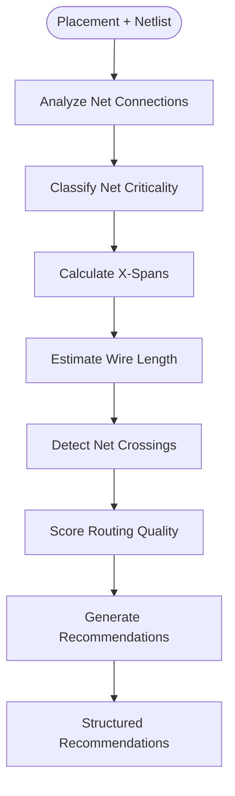

**Diagram sources**
- [routing_previewer.py:125-269](file://ai_agent/ai_chat_bot/agents/routing_previewer.py#L125-L269)

### Net Classification System

The agent categorizes nets by criticality:

1. **CRITICAL NETS**: Differential signals, outputs, clocks
2. **SIGNAL NETS**: General signal connections  
3. **BIAS NETS**: Bias and tail networks

### Recommendation Generation

The agent generates actionable recommendations:

- **Swap Operations**: Device reordering to reduce net spans
- **Priority Annotations**: Net priority assignments
- **Wire Width Settings**: Custom routing specifications
- **Spacing Adjustments**: Coupling reduction strategies

**Section sources**
- [routing_previewer.py:48-117](file://ai_agent/ai_chat_bot/agents/routing_previewer.py#L48-L117)
- [routing_previewer.py:125-370](file://ai_agent/ai_chat_bot/agents/routing_previewer.py#L125-L370)

## Agent Collaboration Patterns

### Pipeline Coordination

The agents collaborate through a well-defined pipeline with clear handoffs:

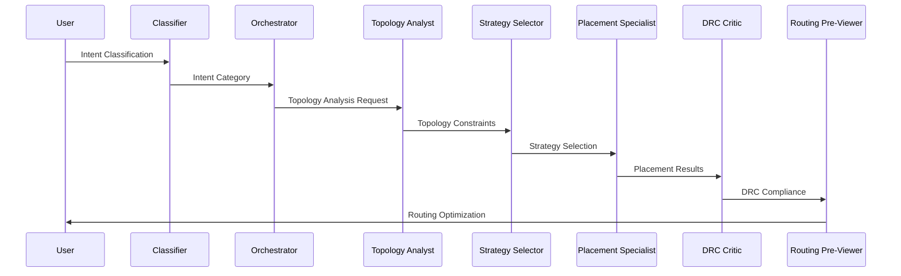

**Diagram sources**
- [orchestrator.py:43-95](file://ai_agent/ai_chat_bot/agents/orchestrator.py#L43-L95)

### State Management

The system maintains comprehensive state across agent interactions:

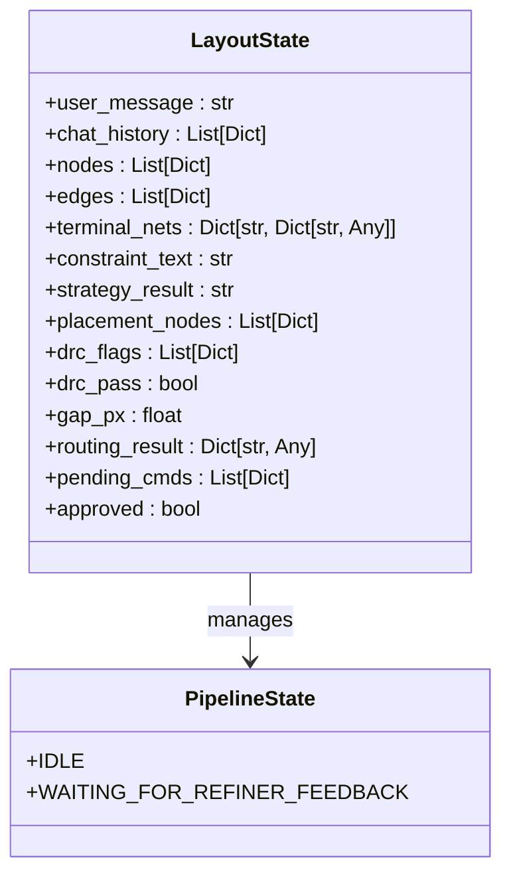

**Diagram sources**
- [state.py:3-37](file://ai_agent/ai_chat_bot/state.py#L3-L37)

**Section sources**
- [orchestrator.py:23-226](file://ai_agent/ai_chat_bot/agents/orchestrator.py#L23-L226)
- [state.py:3-37](file://ai_agent/ai_chat_bot/state.py#L3-L37)

## Decision Trees and Workflows

### Classification Decision Tree

The classifier implements a sophisticated decision tree:

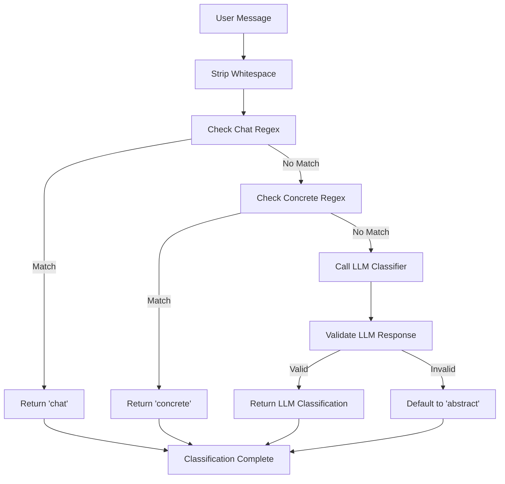

**Diagram sources**
- [classifier.py:75-105](file://ai_agent/ai_chat_bot/agents/classifier.py#L75-L105)

### Strategy Selection Workflow

The strategy selector implements a multi-phase workflow:

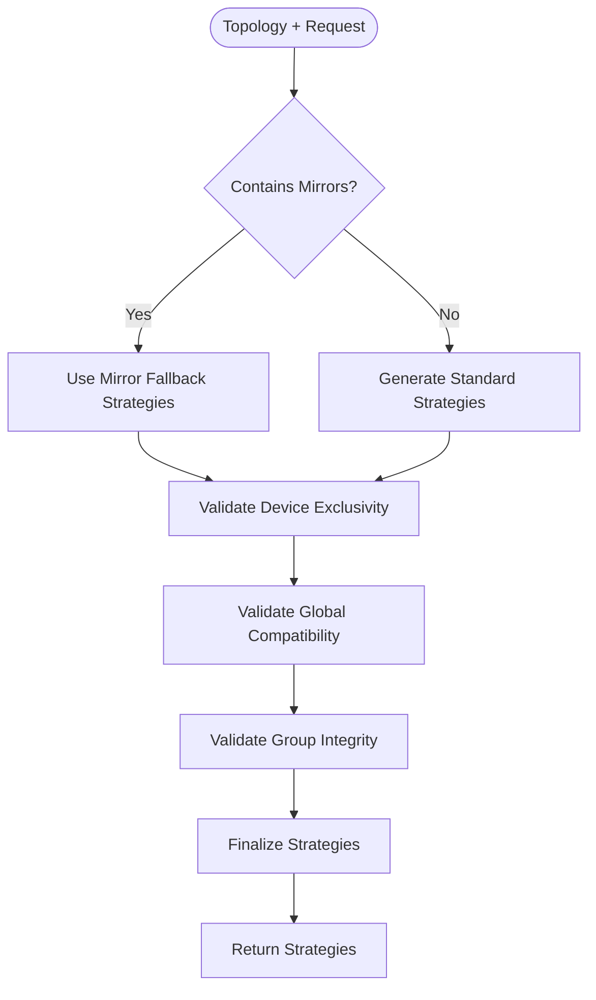

**Diagram sources**
- [strategy_selector.py:170-219](file://ai_agent/ai_chat_bot/agents/strategy_selector.py#L170-L219)

## Error Handling and Validation

### Comprehensive Validation Framework

The system implements layered validation:

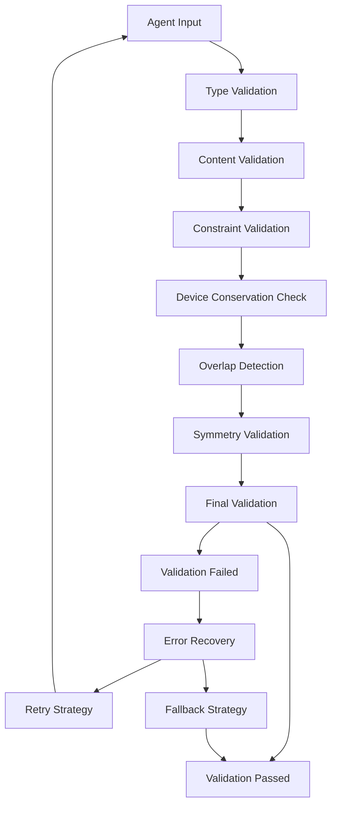

**Diagram sources**
- [tools.py:69-114](file://ai_agent/ai_chat_bot/tools.py#L69-L114)

### Validation Components

The system includes several validation mechanisms:

1. **Device Conservation**: Prevents device deletion or duplication
2. **Overlap Detection**: Identifies device collisions
3. **Symmetry Validation**: Maintains geometric relationships
4. **Constraint Validation**: Enforces layout rules
5. **Fallback Mechanisms**: Graceful degradation on failures

**Section sources**
- [tools.py:41-114](file://ai_agent/ai_chat_bot/tools.py#L41-L114)

## Performance Considerations

### Algorithmic Complexity

Each agent implements performance-optimized algorithms:

- **Classifier**: O(1) regex operations + minimal LLM calls
- **DRC Critic**: O(N log N + R) sweep-line algorithm
- **Placement Specialist**: O(N log N) sorting + validation
- **Routing Pre-Viewer**: O(N²) net crossing detection with optimizations

### Memory Management

The system employs efficient memory management:

- **Slot-based Storage**: Minimal memory footprint for device positions
- **Lazy Evaluation**: Deferred computation for non-critical paths
- **Validation Caching**: Reuse of computed results where safe
- **Graceful Degradation**: Fallback algorithms for edge cases

## Practical Examples

### Example 1: Differential Pair Placement

**Scenario**: User requests improved matching for a differential pair

**Agent Interaction Flow**:

1. **Classifier**: Identifies abstract intent → routes to topology analysis
2. **Topology Analyst**: Identifies differential pair topology → defines matching requirements
3. **Strategy Selector**: Generates common centroid strategy for optimal matching
4. **Placement Specialist**: Implements LEFT-CENTER-RIGHT algorithm for centroid matching
5. **DRC Critic**: Validates placement against design rules
6. **Routing Pre-Viewer**: Optimizes routing for differential signals

**Expected Outcome**: Symmetric placement with optimal matching performance

### Example 2: Current Mirror Optimization

**Scenario**: User wants to improve current mirror accuracy

**Agent Interaction Flow**:

1. **Classifier**: Routes to abstract optimization pipeline
2. **Topology Analyst**: Identifies current mirror topology → defines adjacency requirements
3. **Strategy Selector**: Recommends interdigitated placement for best matching
4. **Placement Specialist**: Implements ratio-based interdigitation algorithm
5. **DRC Critic**: Ensures proper spacing and symmetry preservation
6. **Routing Pre-Viewer**: Minimizes routing complexity for bias networks

**Expected Outcome**: High-precision current mirror with reduced matching error

## Conclusion

The specialized agent types in the multi-agent system demonstrate sophisticated design patterns for analog IC layout automation. Each agent maintains clear responsibilities while collaborating through well-defined interfaces and validation mechanisms.

The system's strength lies in its modular architecture, where agents can be developed, tested, and optimized independently while maintaining system-wide consistency. The combination of advanced algorithms, comprehensive validation, and graceful error handling ensures reliable operation across diverse analog circuit types and complexity levels.

Future enhancements could include adaptive agent selection, dynamic resource allocation, and enhanced learning capabilities for continuous improvement of layout quality metrics.