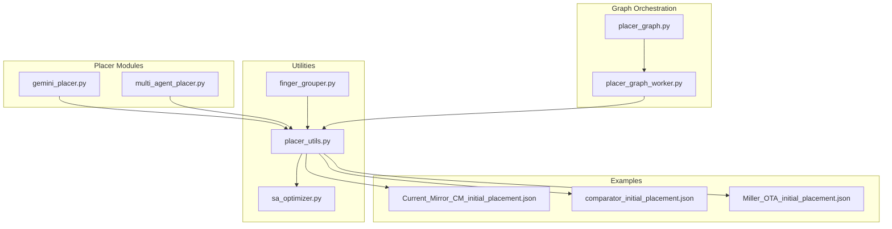
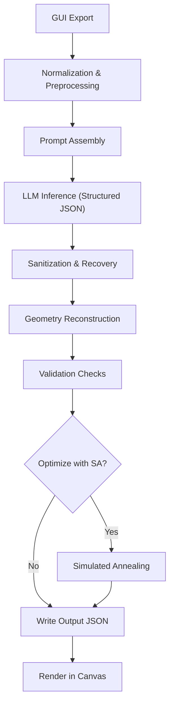
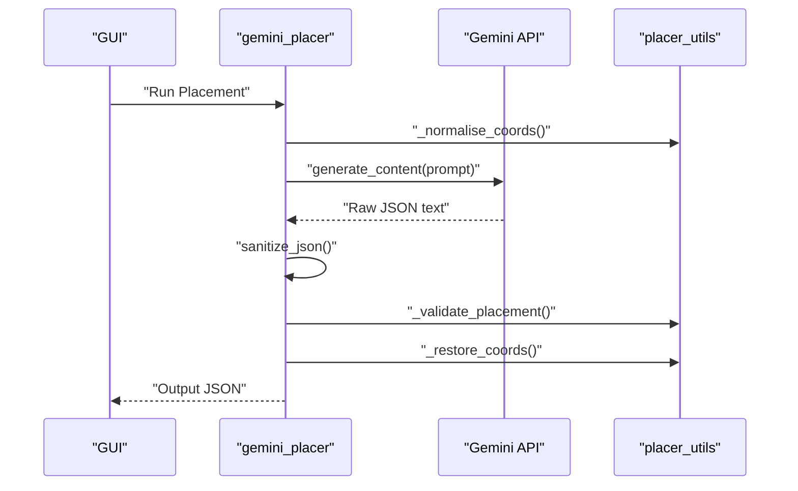
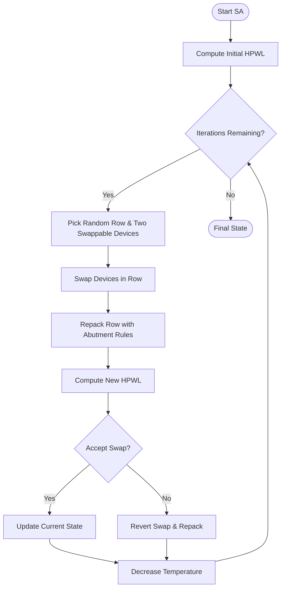
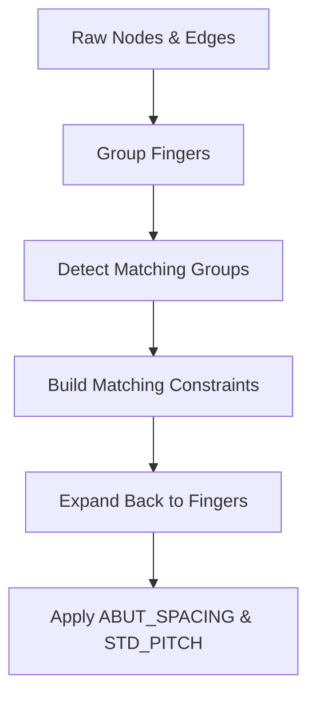
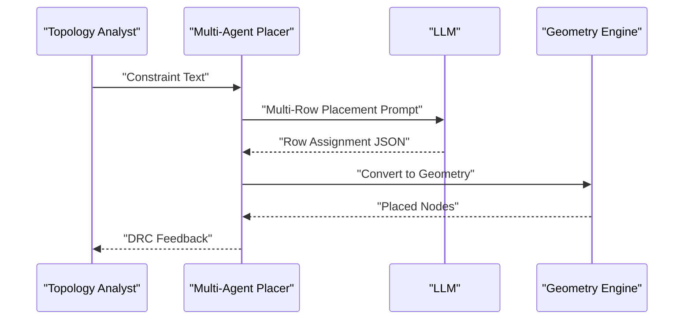
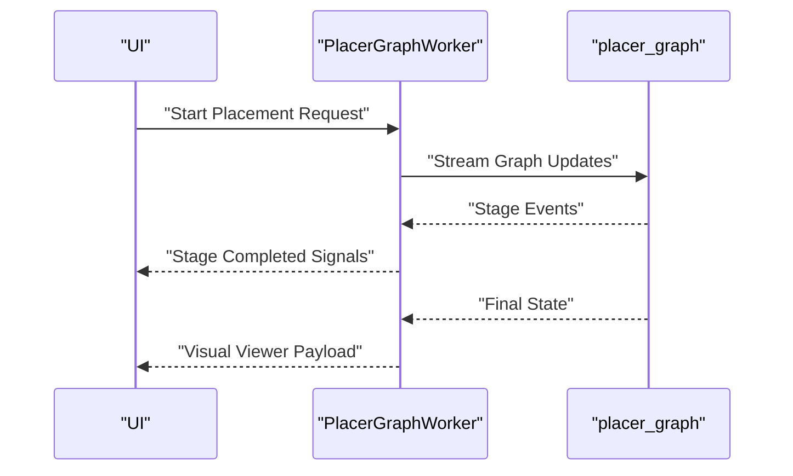
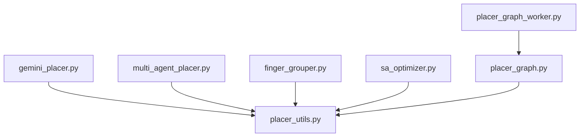

# AI Initial Placement System

<cite>
**Referenced Files in This Document**
- [README.md](file://ai_agent/ai_initial_placement/README.md)
- [gemini_placer.py](file://ai_agent/ai_initial_placement/gemini_placer.py)
- [sa_optimizer.py](file://ai_agent/ai_initial_placement/sa_optimizer.py)
- [finger_grouper.py](file://ai_agent/ai_initial_placement/finger_grouper.py)
- [placer_utils.py](file://ai_agent/ai_initial_placement/placer_utils.py)
- [multi_agent_placer.py](file://ai_agent/ai_initial_placement/multi_agent_placer.py)
- [placer_graph.py](file://ai_agent/ai_initial_placement/placer_graph.py)
- [placer_graph_worker.py](file://ai_agent/ai_initial_placement/placer_graph_worker.py)
- [Current_Mirror_CM_initial_placement.json](file://examples/current_mirror/Current_Mirror_CM_initial_placement.json)
- [comparator_initial_placement.json](file://examples/comparator/comparator_initial_placement.json)
- [Miller_OTA_initial_placement.json](file://examples/Miller_OTA/Miller_OTA_initial_placement.json)
</cite>

## Table of Contents
1. [Introduction](#introduction)
2. [Project Structure](#project-structure)
3. [Core Components](#core-components)
4. [Architecture Overview](#architecture-overview)
5. [Detailed Component Analysis](#detailed-component-analysis)
6. [Dependency Analysis](#dependency-analysis)
7. [Performance Considerations](#performance-considerations)
8. [Troubleshooting Guide](#troubleshooting-guide)
9. [Conclusion](#conclusion)
10. [Appendices](#appendices)

## Introduction
The AI Initial Placement System automates the transition from a topological circuit representation to a DRC-compliant initial layout for analog integrated circuits. It combines modern Large Language Model (LLM) reasoning with deterministic geometric reconstruction and validation to produce high-quality initial placements in under five seconds. The system emphasizes:
- Slot-based prompting for deterministic, structured outputs
- Pre- and post-processing stages for device grouping and abutment healing
- Simulated Annealing optimization for wire length minimization
- Multi-agent orchestration for complex, multi-row layouts

## Project Structure
The AI Initial Placement subsystem is organized into modular components:
- Placer modules: LLM connectors for Gemini, Claude, and other providers
- Utility layer: JSON sanitization, coordinate normalization, validation, and geometry reconstruction
- Optimization: Simulated Annealing post-processing
- Multi-agent pipeline: staged reasoning for multi-row layouts
- Example outputs: validated initial placements for benchmark circuits

**Diagram sources**
- [gemini_placer.py:1-597](file://ai_agent/ai_initial_placement/gemini_placer.py#L1-L597)
- [multi_agent_placer.py:1-1403](file://ai_agent/ai_initial_placement/multi_agent_placer.py#L1-L1403)
- [placer_utils.py:1-1313](file://ai_agent/ai_initial_placement/placer_utils.py#L1-L1313)
- [finger_grouper.py:1-1690](file://ai_agent/ai_initial_placement/finger_grouper.py#L1-L1690)
- [sa_optimizer.py:1-256](file://ai_agent/ai_initial_placement/sa_optimizer.py#L1-L256)
- [placer_graph.py:1-37](file://ai_agent/ai_initial_placement/placer_graph.py#L1-L37)
- [placer_graph_worker.py:1-157](file://ai_agent/ai_initial_placement/placer_graph_worker.py#L1-L157)

**Section sources**
- [README.md:1-119](file://ai_agent/ai_initial_placement/README.md#L1-L119)

## Core Components
- Placer modules: Generate initial placements using LLMs with structured prompts and robust JSON recovery
- Utilities: Normalize coordinates, validate placements, compress graphs for prompts, and heal abutments
- Finger grouper: Collapse multi-finger devices into compact groups for efficient LLM processing
- Simulated Annealing optimizer: Minimize HPWL by swapping devices within rows while preserving abutment chains
- Multi-agent pipeline: Staged reasoning for multi-row layouts with topology-aware row assignment
- Graph orchestration: LangGraph-based streaming pipeline for human-in-the-loop workflows

**Section sources**
- [gemini_placer.py:1-597](file://ai_agent/ai_initial_placement/gemini_placer.py#L1-L597)
- [placer_utils.py:1-1313](file://ai_agent/ai_initial_placement/placer_utils.py#L1-L1313)
- [finger_grouper.py:1-1690](file://ai_agent/ai_initial_placement/finger_grouper.py#L1-L1690)
- [sa_optimizer.py:1-256](file://ai_agent/ai_initial_placement/sa_optimizer.py#L1-L256)
- [multi_agent_placer.py:1-1403](file://ai_agent/ai_initial_placement/multi_agent_placer.py#L1-L1403)
- [placer_graph.py:1-37](file://ai_agent/ai_initial_placement/placer_graph.py#L1-L37)
- [placer_graph_worker.py:1-157](file://ai_agent/ai_initial_placement/placer_graph_worker.py#L1-L157)

## Architecture Overview
The system follows a hybrid pipeline integrating AI reasoning and deterministic geometry:
1. Data serialization from the GUI into a compressed topology graph
2. Normalization and pre-processing (coordinate normalization, device grouping)
3. Prompt assembly and AI inference with structured JSON output
4. Mathematical reconstruction and abutment healing
5. Validation checks and optional Simulated Annealing optimization
6. File delivery to the GUI canvas for rendering

**Diagram sources**
- [README.md:65-108](file://ai_agent/ai_initial_placement/README.md#L65-L108)
- [gemini_placer.py:422-597](file://ai_agent/ai_initial_placement/gemini_placer.py#L422-L597)
- [placer_utils.py:393-462](file://ai_agent/ai_initial_placement/placer_utils.py#L393-L462)
- [sa_optimizer.py:130-256](file://ai_agent/ai_initial_placement/sa_optimizer.py#L130-L256)

## Detailed Component Analysis

### Gemini Placer
The Gemini Placer orchestrates slot-based prompting, robust JSON sanitization, and validation:
- Structured prompt construction with net adjacency, device inventory, and block grouping
- Coordinate normalization to ensure PMOS/NMOS rows are correctly positioned
- JSON sanitization strategies to handle truncated outputs and malformed responses
- Validation to catch missing devices, overlapping slots, and type mismatches
- Output restoration to original coordinate frame

**Diagram sources**
- [gemini_placer.py:422-597](file://ai_agent/ai_initial_placement/gemini_placer.py#L422-L597)
- [placer_utils.py:393-462](file://ai_agent/ai_initial_placement/placer_utils.py#L393-L462)

**Section sources**
- [gemini_placer.py:1-597](file://ai_agent/ai_initial_placement/gemini_placer.py#L1-L597)
- [placer_utils.py:1-200](file://ai_agent/ai_initial_placement/placer_utils.py#L1-L200)

### Simulated Annealing Optimizer
The SA optimizer minimizes total Half-Perimeter Wire Length (HPWL) by swapping devices within rows while preserving abutment chains:
- HPWL computation across signal nets
- Row-wise repacking enforcing abutment spacing (0.070 µm) and standard pitch (0.294 µm)
- Temperature-based acceptance criterion for swaps
- Tracking improvements and acceptance ratios

**Diagram sources**
- [sa_optimizer.py:27-256](file://ai_agent/ai_initial_placement/sa_optimizer.py#L27-L256)

**Section sources**
- [sa_optimizer.py:1-256](file://ai_agent/ai_initial_placement/sa_optimizer.py#L1-L256)

### Finger Grouper
The Finger Grouper reduces token usage and improves matching by collapsing multi-finger devices:
- Grouping logic for legacy and modern naming conventions
- Matching detection and symmetry constraints
- Interdigitated ABBA patterns for matched pairs
- Expansion back to finger-level coordinates with proper abutment spacing

**Diagram sources**
- [finger_grouper.py:116-233](file://ai_agent/ai_initial_placement/finger_grouper.py#L116-L233)
- [finger_grouper.py:256-306](file://ai_agent/ai_initial_placement/finger_grouper.py#L256-L306)
- [finger_grouper.py:568-641](file://ai_agent/ai_initial_placement/finger_grouper.py#L568-L641)

**Section sources**
- [finger_grouper.py:1-1690](file://ai_agent/ai_initial_placement/finger_grouper.py#L1-L1690)

### Multi-Agent Placer
The Multi-Agent Placer extends the pipeline to multi-row layouts with topology-aware row assignment:
- Topology Analyst stage: extracts connectivity groups and circuit identification
- Multi-row placement prompt: assigns devices to functional rows with interdigitated ordering
- Geometry Engine: packs rows with dynamic row pitch and abutment enforcement
- DRC Healing: deterministic abutment packing and overlap guards

**Diagram sources**
- [multi_agent_placer.py:254-382](file://ai_agent/ai_initial_placement/multi_agent_placer.py#L254-L382)
- [multi_agent_placer.py:388-554](file://ai_agent/ai_initial_placement/multi_agent_placer.py#L388-L554)
- [multi_agent_placer.py:641-805](file://ai_agent/ai_initial_placement/multi_agent_placer.py#L641-L805)

**Section sources**
- [multi_agent_placer.py:1-1403](file://ai_agent/ai_initial_placement/multi_agent_placer.py#L1-L1403)

### Placer Graph and Worker
The Placer Graph provides a streaming LangGraph pipeline for human-in-the-loop workflows:
- Node-based stages: topology analysis, strategy selection, placement, finger expansion, DRC critique
- Worker emits stage updates and final placement commands
- Integrates with the GUI for interactive refinement

**Diagram sources**
- [placer_graph.py:1-37](file://ai_agent/ai_initial_placement/placer_graph.py#L1-L37)
- [placer_graph_worker.py:38-157](file://ai_agent/ai_initial_placement/placer_graph_worker.py#L38-L157)

**Section sources**
- [placer_graph.py:1-37](file://ai_agent/ai_initial_placement/placer_graph.py#L1-L37)
- [placer_graph_worker.py:1-157](file://ai_agent/ai_initial_placement/placer_graph_worker.py#L1-L157)

## Dependency Analysis
The components exhibit low coupling and high cohesion:
- Placer modules depend on utility functions for sanitization, validation, and geometry
- Finger grouper integrates with utility functions for matching and expansion
- SA optimizer depends on utility functions for HPWL computation and repacking
- Multi-agent pipeline composes utility functions for normalization, compression, and geometry conversion
- Graph worker orchestrates the LangGraph pipeline and streams updates to the UI

**Diagram sources**
- [gemini_placer.py:1-597](file://ai_agent/ai_initial_placement/gemini_placer.py#L1-L597)
- [multi_agent_placer.py:1-1403](file://ai_agent/ai_initial_placement/multi_agent_placer.py#L1-L1403)
- [placer_utils.py:1-1313](file://ai_agent/ai_initial_placement/placer_utils.py#L1-L1313)
- [finger_grouper.py:1-1690](file://ai_agent/ai_initial_placement/finger_grouper.py#L1-L1690)
- [sa_optimizer.py:1-256](file://ai_agent/ai_initial_placement/sa_optimizer.py#L1-L256)
- [placer_graph.py:1-37](file://ai_agent/ai_initial_placement/placer_graph.py#L1-L37)
- [placer_graph_worker.py:1-157](file://ai_agent/ai_initial_placement/placer_graph_worker.py#L1-L157)

**Section sources**
- [gemini_placer.py:1-597](file://ai_agent/ai_initial_placement/gemini_placer.py#L1-L597)
- [multi_agent_placer.py:1-1403](file://ai_agent/ai_initial_placement/multi_agent_placer.py#L1-L1403)
- [placer_utils.py:1-1313](file://ai_agent/ai_initial_placement/placer_utils.py#L1-L1313)
- [finger_grouper.py:1-1690](file://ai_agent/ai_initial_placement/finger_grouper.py#L1-L1690)
- [sa_optimizer.py:1-256](file://ai_agent/ai_initial_placement/sa_optimizer.py#L1-L256)
- [placer_graph.py:1-37](file://ai_agent/ai_initial_placement/placer_graph.py#L1-L37)
- [placer_graph_worker.py:1-157](file://ai_agent/ai_initial_placement/placer_graph_worker.py#L1-L157)

## Performance Considerations
- Token efficiency: Finger grouping reduces context size by 95%+, enabling larger models to process complex layouts
- Deterministic geometry: Abutment healing and repacking guarantee DRC compliance without iterative retries
- SA optimization: Typical runtime of 1–3 seconds for up to ~100 devices; iterations can be tuned for speed/quality trade-offs
- Multi-row scaling: Dynamic row pitch computation prevents vertical overlaps and improves aspect ratios

[No sources needed since this section provides general guidance]

## Troubleshooting Guide
Common issues and resolutions:
- Empty or malformed LLM responses: The sanitizer attempts multiple recovery strategies (markdown fences removal, trailing comma stripping, truncated output repair)
- Missing or extra devices: Validation checks ensure complete coverage and type consistency
- Overlapping devices: Post-placement overlap checks enforce bounding-box alignment and abutment spacing
- SA not improving: Verify HPWL computation and ensure abutment chains are preserved during swaps

**Section sources**
- [gemini_placer.py:111-183](file://ai_agent/ai_initial_placement/gemini_placer.py#L111-L183)
- [placer_utils.py:297-389](file://ai_agent/ai_initial_placement/placer_utils.py#L297-L389)
- [sa_optimizer.py:27-73](file://ai_agent/ai_initial_placement/sa_optimizer.py#L27-L73)

## Conclusion
The AI Initial Placement System delivers a robust, scalable solution for analog layout automation. By combining structured LLM prompting, deterministic geometry reconstruction, and targeted optimization, it achieves high-quality initial placements that are ready for routing and manual refinement. The modular design enables easy integration of new LLM providers and extension to more complex topologies.

[No sources needed since this section summarizes without analyzing specific files]

## Appendices

### Practical Examples and Scenarios
- Current Mirror: Demonstrates matched pair placement with interdigitated ABBA patterns and symmetric layout
- Comparator: Shows multi-finger device handling and abutment chain enforcement
- Miller OTA: Illustrates complex multi-row placement with passive components on dedicated rows

**Section sources**
- [Current_Mirror_CM_initial_placement.json:1-800](file://examples/current_mirror/Current_Mirror_CM_initial_placement.json#L1-L800)
- [comparator_initial_placement.json:1-800](file://examples/comparator/comparator_initial_placement.json#L1-L800)
- [Miller_OTA_initial_placement.json:1-800](file://examples/Miller_OTA/Miller_OTA_initial_placement.json#L1-L800)

### Optimization Strategies
- Enable SA optimization for wire length minimization when acceptable runtime is available
- Use multi-row placement for complex circuits to improve aspect ratios and reduce congestion
- Leverage matching constraints to enforce symmetric placement and interdigitated patterns

[No sources needed since this section provides general guidance]

### Manual Refinement Processes
- The final placement JSON can be rendered directly into the GUI canvas for manual editing
- LangGraph worker emits stage updates and final commands for interactive refinement
- DRC feedback loops enable iterative improvements with human oversight

**Section sources**
- [placer_graph_worker.py:109-157](file://ai_agent/ai_initial_placement/placer_graph_worker.py#L109-L157)
- [placer_graph.py:1-37](file://ai_agent/ai_initial_placement/placer_graph.py#L1-L37)