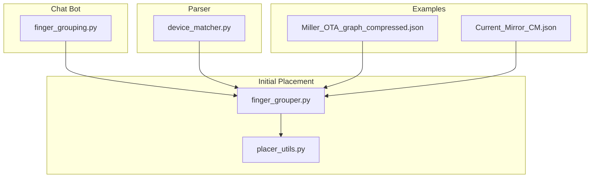
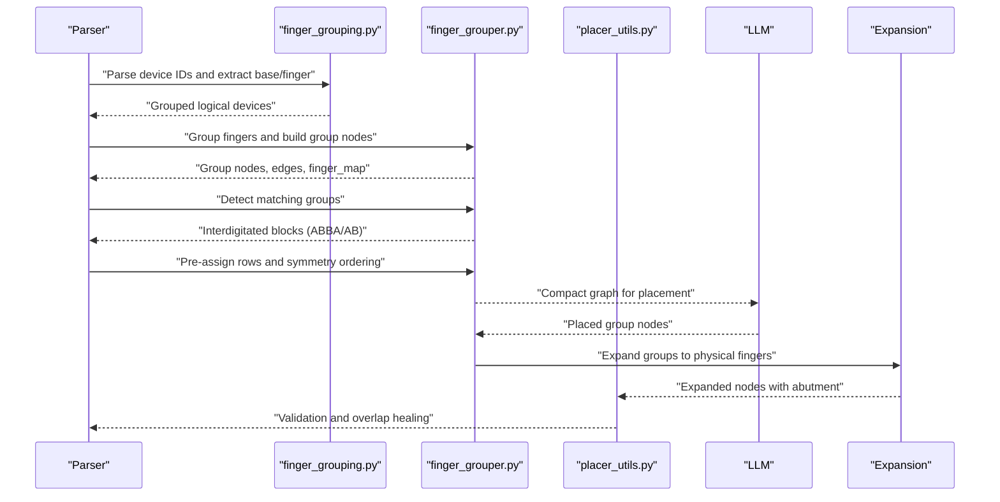
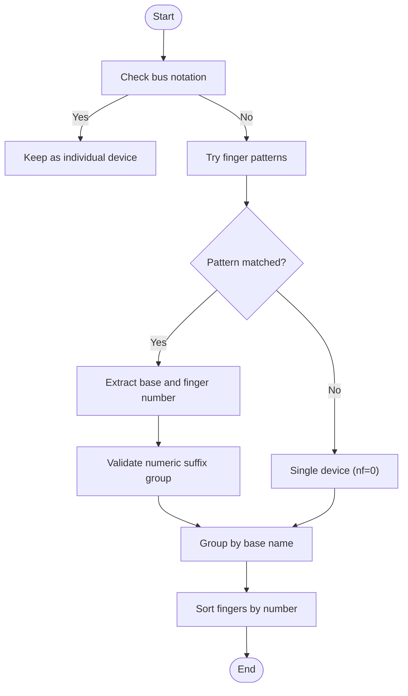
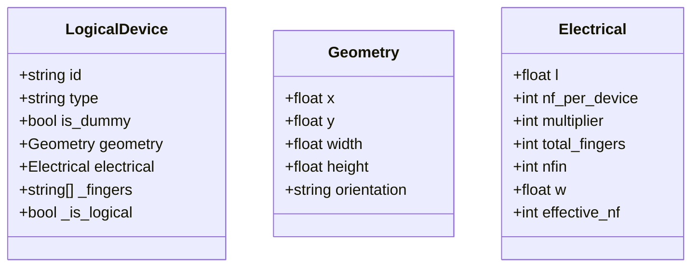
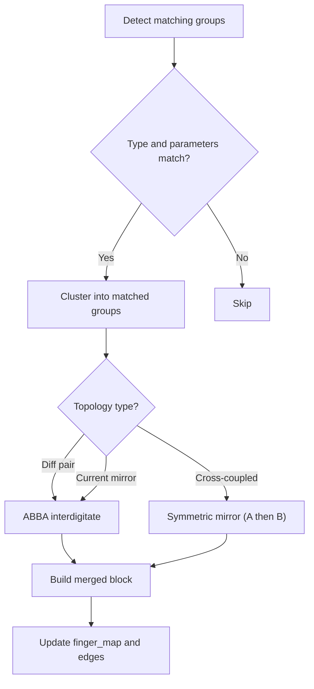
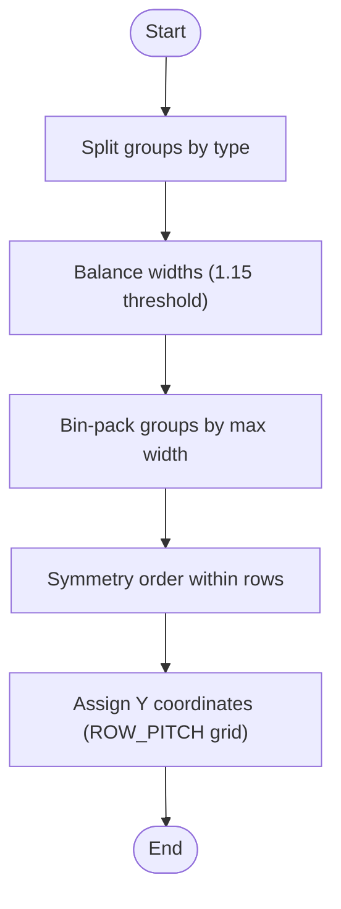
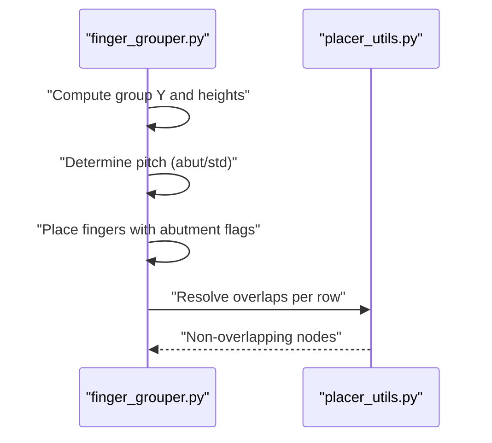
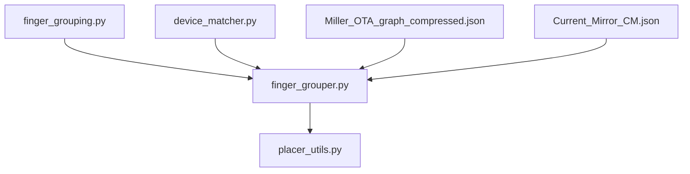

# Device Grouping and Multi-Finger Handling

<cite>
**Referenced Files in This Document**
- [finger_grouping.py](file://ai_agent/ai_chat_bot/finger_grouping.py)
- [finger_grouper.py](file://ai_agent/ai_initial_placement/finger_grouper.py)
- [placer_utils.py](file://ai_agent/ai_initial_placement/placer_utils.py)
- [device_matcher.py](file://parser/device_matcher.py)
- [Miller_OTA_graph_compressed.json](file://examples/Miller_OTA/Miller_OTA_graph_compressed.json)
- [Current_Mirror_CM.json](file://examples/current_mirror/Current_Mirror_CM.json)
</cite>

## Table of Contents
1. [Introduction](#introduction)
2. [Project Structure](#project-structure)
3. [Core Components](#core-components)
4. [Architecture Overview](#architecture-overview)
5. [Detailed Component Analysis](#detailed-component-analysis)
6. [Dependency Analysis](#dependency-analysis)
7. [Performance Considerations](#performance-considerations)
8. [Troubleshooting Guide](#troubleshooting-guide)
9. [Conclusion](#conclusion)

## Introduction
This document explains the device grouping system and multi-finger handling algorithms used in the analog layout automation pipeline. It covers how multi-finger transistors are detected, grouped into logical units, and later expanded back to physical finger positions. It also documents device pairing strategies (differential pairs, current mirrors, cross-coupled pairs), spacing calculations, adjacency constraints, and integration with the placement optimization process. The focus is on PMOS/NMOS devices with varying finger counts (nf) and multipliers (m), including edge cases such as large finger counts and complex hierarchies.

## Project Structure
The device grouping and multi-finger handling spans several modules:
- Chat-bot utilities for finger parsing and logical aggregation
- Initial placement pipeline for grouping, matching, row assignment, and expansion
- Placement utilities for validation and healing
- Parser utilities for device matching and hierarchical grouping
- Example datasets demonstrating multi-finger and hierarchical structures

**Diagram sources**
- [finger_grouping.py:1-512](file://ai_agent/ai_chat_bot/finger_grouping.py#L1-L512)
- [finger_grouper.py:1-1690](file://ai_agent/ai_initial_placement/finger_grouper.py#L1-L1690)
- [placer_utils.py:1-1313](file://ai_agent/ai_initial_placement/placer_utils.py#L1-L1313)
- [device_matcher.py:1-151](file://parser/device_matcher.py#L1-L151)
- [Miller_OTA_graph_compressed.json:1-186](file://examples/Miller_OTA/Miller_OTA_graph_compressed.json#L1-L186)
- [Current_Mirror_CM.json:1-5018](file://examples/current_mirror/Current_Mirror_CM.json#L1-L5018)

**Section sources**
- [finger_grouping.py:1-512](file://ai_agent/ai_chat_bot/finger_grouping.py#L1-L512)
- [finger_grouper.py:1-1690](file://ai_agent/ai_initial_placement/finger_grouper.py#L1-L1690)
- [placer_utils.py:1-1313](file://ai_agent/ai_initial_placement/placer_utils.py#L1-L1313)
- [device_matcher.py:1-151](file://parser/device_matcher.py#L1-L151)

## Core Components
- Finger parsing and grouping: Detects multi-finger naming conventions and aggregates physical fingers into logical devices.
- Logical aggregation: Creates compact group nodes with electrical parameters (nf_per_device, multiplier, total_fingers, nfin).
- Matching and interdigitated pairing: Identifies matched pairs and generates ABBA/AB interdigitated patterns.
- Row assignment and bin packing: Pre-assigns PMOS/NMOS rows to balance width and enforce type separation.
- Expansion and healing: Expands logical placements back to physical fingers with precise spacing and abutment constraints.
- Validation and overlap resolution: Ensures no collisions and correct row separation.

**Section sources**
- [finger_grouping.py:116-252](file://ai_agent/ai_chat_bot/finger_grouping.py#L116-L252)
- [finger_grouper.py:116-232](file://ai_agent/ai_initial_placement/finger_grouper.py#L116-L232)
- [finger_grouper.py:256-305](file://ai_agent/ai_initial_placement/finger_grouper.py#L256-L305)
- [finger_grouper.py:1159-1334](file://ai_agent/ai_initial_placement/finger_grouper.py#L1159-L1334)
- [placer_utils.py:297-388](file://ai_agent/ai_initial_placement/placer_utils.py#L297-L388)
- [placer_utils.py:599-769](file://ai_agent/ai_initial_placement/placer_utils.py#L599-L769)

## Architecture Overview
The system operates in stages:
1. Group physical fingers into logical devices.
2. Detect structural matches and interdigitate pairs.
3. Pre-assign rows and reorder for symmetry.
4. Expand placements back to physical fingers with abutment.
5. Validate and heal overlaps.

**Diagram sources**
- [finger_grouping.py:116-252](file://ai_agent/ai_chat_bot/finger_grouping.py#L116-L252)
- [finger_grouper.py:116-232](file://ai_agent/ai_initial_placement/finger_grouper.py#L116-L232)
- [finger_grouper.py:256-305](file://ai_agent/ai_initial_placement/finger_grouper.py#L256-L305)
- [finger_grouper.py:1159-1334](file://ai_agent/ai_initial_placement/finger_grouper.py#L1159-L1334)
- [placer_utils.py:599-769](file://ai_agent/ai_initial_placement/placer_utils.py#L599-L769)

## Detailed Component Analysis

### Finger Parsing and Logical Aggregation
- Pattern detection supports multiple naming conventions for fingers and multipliers.
- Bus notation MM8<0> is excluded from grouping.
- Numeric suffix grouping requires a minimum sibling count to avoid false splits.
- Aggregation produces a single logical device with total nf and effective nf.

**Diagram sources**
- [finger_grouping.py:48-191](file://ai_agent/ai_chat_bot/finger_grouping.py#L48-L191)

**Section sources**
- [finger_grouping.py:48-191](file://ai_agent/ai_chat_bot/finger_grouping.py#L48-L191)
- [finger_grouping.py:198-301](file://ai_agent/ai_chat_bot/finger_grouping.py#L198-L301)

### Logical Device Aggregation and Electrical Parameters
- Aggregates physical finger nodes into a logical device with:
  - id: base name
  - electrical.nf_per_device: number of fingers per device
  - electrical.multiplier: number of array copies
  - electrical.total_fingers: total number of fingers
  - electrical.nfin: number of fins per finger
  - geometry: width computed from total_fingers × STD_PITCH
- Effective nf is tracked for display and matching.

**Diagram sources**
- [finger_grouping.py:255-301](file://ai_agent/ai_chat_bot/finger_grouping.py#L255-L301)

**Section sources**
- [finger_grouping.py:255-301](file://ai_agent/ai_chat_bot/finger_grouping.py#L255-L301)

### Matching Strategies and Interdigitation
- Structural matching: Groups with identical type, nf_per_device, multiplier, total_fingers, l, nfin.
- Differential pairs: VINP/VINN terminals define pairs requiring ABBA interdigitation.
- Current mirrors: Gate-net sharing with diode connection identifies mirrors.
- Cross-coupled pairs: Drain of A equals Gate of B and vice versa.
- Interdigitation patterns:
  - ABBA: Even distribution of fingers for thermal symmetry.
  - ABAB: Alternating fingers across devices.
  - Symmetric mirror: A fingers followed by B fingers (no interleaving).

**Diagram sources**
- [finger_grouper.py:256-305](file://ai_agent/ai_initial_placement/finger_grouper.py#L256-L305)
- [finger_grouper.py:647-735](file://ai_agent/ai_initial_placement/finger_grouper.py#L647-L735)
- [finger_grouper.py:826-984](file://ai_agent/ai_initial_placement/finger_grouper.py#L826-L984)

**Section sources**
- [finger_grouper.py:256-305](file://ai_agent/ai_initial_placement/finger_grouper.py#L256-L305)
- [finger_grouper.py:647-735](file://ai_agent/ai_initial_placement/finger_grouper.py#L647-L735)
- [finger_grouper.py:785-984](file://ai_agent/ai_initial_placement/finger_grouper.py#L785-L984)

### Row Assignment and Symmetry Ordering
- Pre-assign rows via bin packing to balance PMOS/NMOS widths and maintain rectangular aspect.
- Symmetry-aware ordering within rows: center (cross-coupled), near-center (diff pairs), tail sources, outer edges (CLK switches).
- Enforces PMOS/NMOS separation with dynamic height computation from nfin.

**Diagram sources**
- [finger_grouper.py:1159-1334](file://ai_agent/ai_initial_placement/finger_grouper.py#L1159-L1334)
- [finger_grouper.py:1076-1156](file://ai_agent/ai_initial_placement/finger_grouper.py#L1076-L1156)

**Section sources**
- [finger_grouper.py:1159-1334](file://ai_agent/ai_initial_placement/finger_grouper.py#L1159-L1334)
- [finger_grouper.py:1076-1156](file://ai_agent/ai_initial_placement/finger_grouper.py#L1076-L1156)

### Expansion and Abutment Healing
- Expands logical placements back to physical fingers with:
  - Deterministic spacing using FINGER_PITCH (0.070 µm) for abutment or STD_PITCH (0.294 µm) otherwise.
  - Height computation from nfin to ensure correct row separation.
  - Abutment flags for hierarchy siblings to form continuous chains.
- Overlap resolution per row using chain-based clustering and deterministic placement.

**Diagram sources**
- [finger_grouper.py:1358-1555](file://ai_agent/ai_initial_placement/finger_grouper.py#L1358-L1555)
- [placer_utils.py:599-769](file://ai_agent/ai_initial_placement/placer_utils.py#L599-L769)

**Section sources**
- [finger_grouper.py:1358-1555](file://ai_agent/ai_initial_placement/finger_grouper.py#L1358-L1555)
- [placer_utils.py:599-769](file://ai_agent/ai_initial_placement/placer_utils.py#L599-L769)

### Handling Devices with Varying nfin Values and nf Configurations
- nfin influences device height and row separation.
- total_fingers = nf_per_device × multiplier.
- Width estimation uses STD_PITCH for group footprint to avoid underestimation.

**Section sources**
- [finger_grouper.py:178-198](file://ai_agent/ai_initial_placement/finger_grouper.py#L178-L198)
- [placer_utils.py:1358-1425](file://ai_agent/ai_initial_placement/placer_utils.py#L1358-L1425)

### Examples of Optimal Grouping Scenarios
- Differential pair in a comparator: ABBA interdigitation across VINP/VINN pairs.
- Current mirror: Gate-net sharing with diode connection yields matched block.
- Cross-coupled latch: Symmetric mirror pattern with shared S/D nets.

**Section sources**
- [finger_grouper.py:497-560](file://ai_agent/ai_initial_placement/finger_grouper.py#L497-L560)
- [finger_grouper.py:740-782](file://ai_agent/ai_initial_placement/finger_grouper.py#L740-L782)
- [finger_grouper.py:845-850](file://ai_agent/ai_initial_placement/finger_grouper.py#L845-L850)

### Edge Cases with Large Finger Counts
- Hierarchical structures (multiplier × nf) are collapsed into logical groups to reduce token usage.
- Abutment chains are enforced for hierarchy siblings even if not explicitly constrained.
- Overlap resolution ensures deterministic placement despite large numbers of fingers.

**Section sources**
- [finger_grouper.py:116-138](file://ai_agent/ai_initial_placement/finger_grouper.py#L116-L138)
- [placer_utils.py:599-769](file://ai_agent/ai_initial_placement/placer_utils.py#L599-L769)

### Integration with Placement Optimization
- Compressed graph for LLM includes devices, nets, matching constraints, and blocks.
- Post-placement validation checks missing/excess devices, overlaps, and row type correctness.
- Healing routines reconstruct abutment chains and resolve overlaps deterministically.

**Section sources**
- [placer_utils.py:469-568](file://ai_agent/ai_initial_placement/placer_utils.py#L469-L568)
- [placer_utils.py:297-388](file://ai_agent/ai_initial_placement/placer_utils.py#L297-L388)
- [placer_utils.py:599-769](file://ai_agent/ai_initial_placement/placer_utils.py#L599-L769)

## Dependency Analysis
Key dependencies and relationships:
- finger_grouping.py depends on regex patterns and bus notation exclusion.
- finger_grouper.py depends on electrical signatures, matching detection, and row assignment.
- placer_utils.py depends on finger_grouper outputs for validation and healing.
- device_matcher.py provides hierarchical grouping for netlist-to-layout matching.

**Diagram sources**
- [finger_grouping.py:1-512](file://ai_agent/ai_chat_bot/finger_grouping.py#L1-L512)
- [finger_grouper.py:1-1690](file://ai_agent/ai_initial_placement/finger_grouper.py#L1-L1690)
- [placer_utils.py:1-1313](file://ai_agent/ai_initial_placement/placer_utils.py#L1-L1313)
- [device_matcher.py:1-151](file://parser/device_matcher.py#L1-L151)

**Section sources**
- [finger_grouping.py:1-512](file://ai_agent/ai_chat_bot/finger_grouping.py#L1-L512)
- [finger_grouper.py:1-1690](file://ai_agent/ai_initial_placement/finger_grouper.py#L1-L1690)
- [placer_utils.py:1-1313](file://ai_agent/ai_initial_placement/placer_utils.py#L1-L1313)
- [device_matcher.py:1-151](file://parser/device_matcher.py#L1-L151)

## Performance Considerations
- Token reduction: Grouping reduces 40+ finger nodes down to 1 logical group for LLM consumption.
- Deterministic spacing: FINGER_PITCH (0.070 µm) ensures tight abutment; STD_PITCH (0.294 µm) maintains diffusion breaks.
- Row balancing: Threshold of 1.15 for width imbalance triggers multi-row splitting to maintain rectangular aspect.
- Overlap resolution: Chain-based clustering minimizes recomputation and guarantees non-overlapping layouts.

[No sources needed since this section provides general guidance]

## Troubleshooting Guide
Common issues and resolutions:
- Missing or extra devices after expansion: Use validation to detect discrepancies and rebuild finger_map.
- Overlaps within rows: Enable overlap resolution to force non-overlapping placements.
- Incorrect row ordering: Ensure symmetry ordering and row assignment are applied before expansion.
- Abutment spacing errors: Verify abutment flags and healing routines; confirm FINGER_PITCH vs STD_PITCH usage.

**Section sources**
- [placer_utils.py:297-388](file://ai_agent/ai_initial_placement/placer_utils.py#L297-L388)
- [placer_utils.py:599-769](file://ai_agent/ai_initial_placement/placer_utils.py#L599-L769)

## Conclusion
The device grouping and multi-finger handling system provides a robust pipeline for analog layout automation. By collapsing hierarchical multi-finger structures into logical groups, detecting structural matches, enforcing symmetry and abutment constraints, and validating placements, the system achieves optimal device pairing, spacing, and adjacency while integrating seamlessly with placement optimization. The approach scales to large finger counts and complex topologies, ensuring deterministic and high-quality layouts.