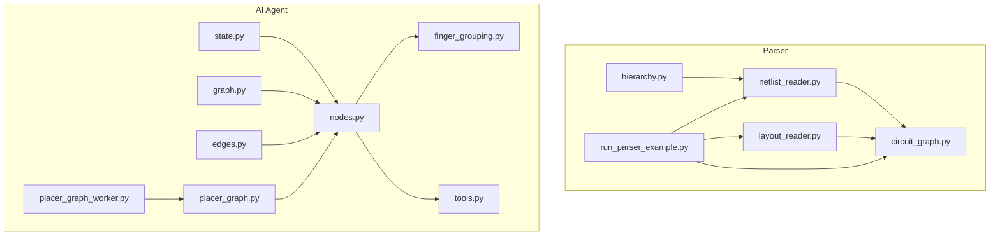
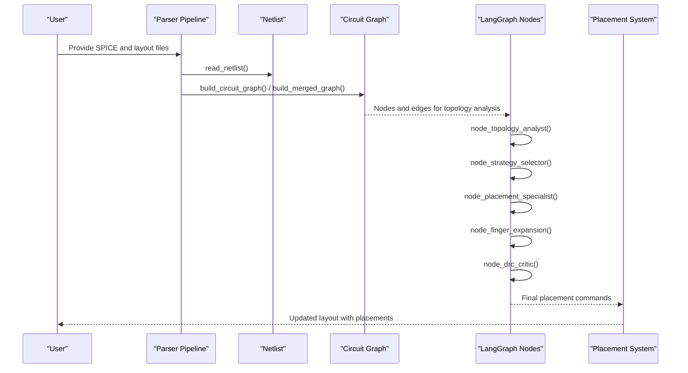
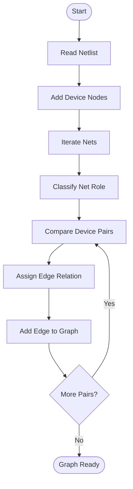
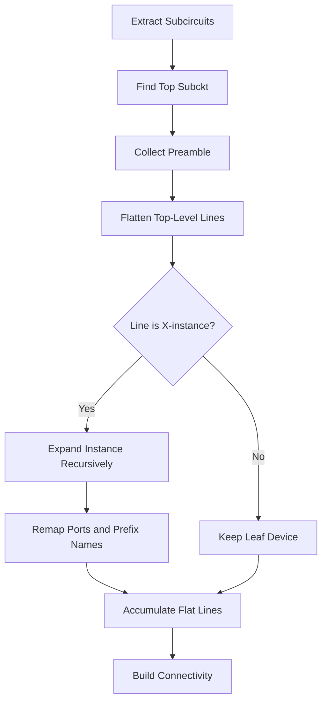
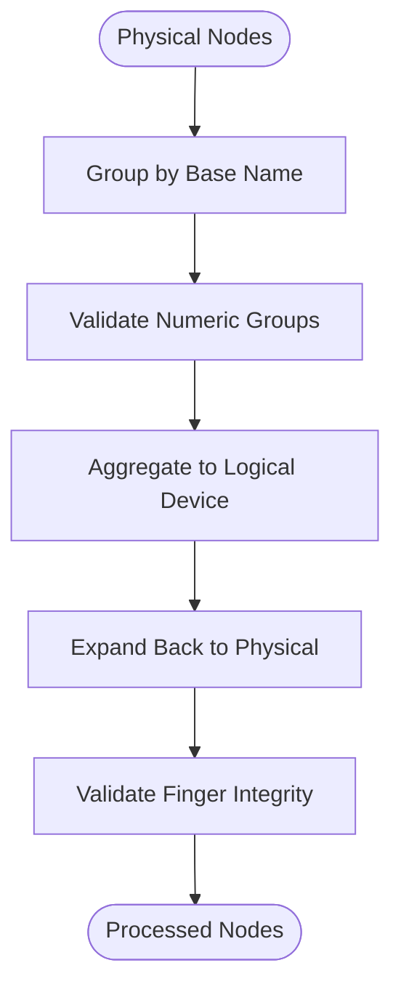
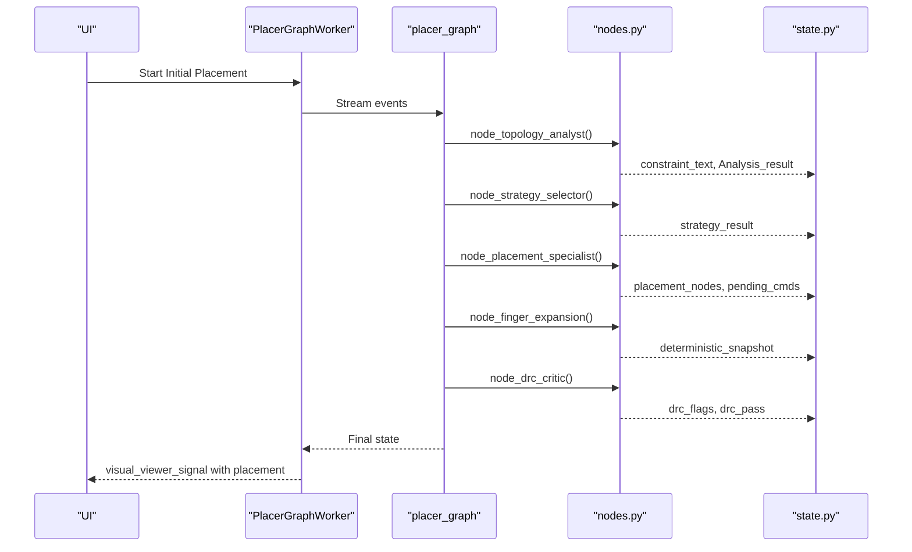
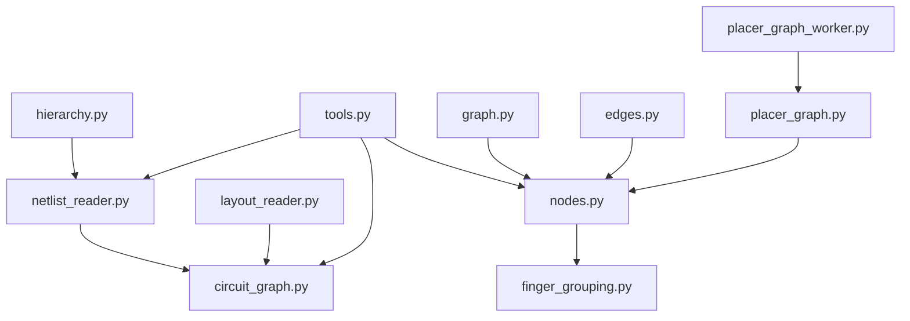

# Graph Processing and Topology Analysis

<cite>
**Referenced Files in This Document**
- [circuit_graph.py](file://parser/circuit_graph.py)
- [netlist_reader.py](file://parser/netlist_reader.py)
- [hierarchy.py](file://parser/hierarchy.py)
- [layout_reader.py](file://parser/layout_reader.py)
- [run_parser_example.py](file://parser/run_parser_example.py)
- [graph.py](file://ai_agent/ai_chat_bot/graph.py)
- [nodes.py](file://ai_agent/ai_chat_bot/nodes.py)
- [edges.py](file://ai_agent/ai_chat_bot/edges.py)
- [placer_graph.py](file://ai_agent/ai_initial_placement/placer_graph.py)
- [placer_graph_worker.py](file://ai_agent/ai_initial_placement/placer_graph_worker.py)
- [state.py](file://ai_agent/ai_chat_bot/state.py)
- [finger_grouping.py](file://ai_agent/ai_chat_bot/finger_grouping.py)
- [tools.py](file://ai_agent/ai_chat_bot/tools.py)
- [Miller_OTA_graph_compressed.json](file://examples/Miller_OTA/Miller_OTA_graph_compressed.json)
- [Current_Mirror_CM_graph_compressed.json](file://examples/current_mirror/Current_Mirror_CM_graph_compressed.json)
</cite>

## Table of Contents
1. [Introduction](#introduction)
2. [Project Structure](#project-structure)
3. [Core Components](#core-components)
4. [Architecture Overview](#architecture-overview)
5. [Detailed Component Analysis](#detailed-component-analysis)
6. [Dependency Analysis](#dependency-analysis)
7. [Performance Considerations](#performance-considerations)
8. [Troubleshooting Guide](#troubleshooting-guide)
9. [Conclusion](#conclusion)
10. [Appendices](#appendices)

## Introduction
This document explains the graph processing and topology analysis components used to construct circuit graphs from SPICE netlists, analyze connectivity and behavioral roles of nets, and integrate with the placement system. It covers:
- Circuit graph construction from netlist data
- Node and edge processing with behavioral classification
- Hierarchical block identification and flattening
- Graph transformation workflows and connectivity analysis
- Component grouping strategies for multi-finger devices
- Integration with the placement system and data flow between graph processing and AI placement

## Project Structure
The graph processing pipeline spans the parser and AI agent modules:
- Parser: netlist parsing, hierarchy flattening, layout extraction, and circuit graph construction
- AI Agent: topology analysis, strategy selection, placement, and DRC validation integrated via LangGraph

**Diagram sources**
- [netlist_reader.py:1-855](file://parser/netlist_reader.py#L1-L855)
- [circuit_graph.py:1-191](file://parser/circuit_graph.py#L1-L191)
- [hierarchy.py:1-475](file://parser/hierarchy.py#L1-L475)
- [layout_reader.py:1-442](file://parser/layout_reader.py#L1-L442)
- [run_parser_example.py:1-62](file://parser/run_parser_example.py#L1-L62)
- [state.py:1-37](file://ai_agent/ai_chat_bot/state.py#L1-L37)
- [graph.py:1-52](file://ai_agent/ai_chat_bot/graph.py#L1-L52)
- [nodes.py:1-1016](file://ai_agent/ai_chat_bot/nodes.py#L1-L1016)
- [edges.py:1-24](file://ai_agent/ai_chat_bot/edges.py#L1-L24)
- [placer_graph.py:1-37](file://ai_agent/ai_initial_placement/placer_graph.py#L1-L37)
- [placer_graph_worker.py:1-157](file://ai_agent/ai_initial_placement/placer_graph_worker.py#L1-L157)
- [finger_grouping.py:1-512](file://ai_agent/ai_chat_bot/finger_grouping.py#L1-L512)
- [tools.py:1-230](file://ai_agent/ai_chat_bot/tools.py#L1-L230)

**Section sources**
- [run_parser_example.py:13-58](file://parser/run_parser_example.py#L13-L58)

## Core Components
- Netlist reader: Parses SPICE/CDL netlists, flattens hierarchy, builds connectivity, and constructs a Netlist object with devices and nets.
- Circuit graph builder: Transforms the Netlist into a NetworkX graph, classifying edges by behavioral roles (shared bias, shared source, shared gate, shared drain).
- Layout reader: Extracts device instances from OAS/GDS layout files, handling flat and hierarchical structures.
- Merged graph builder: Combines electrical connectivity with geometric layout to produce a spatial-electrical hybrid graph.
- Topology analysis and placement pipeline: Uses LangGraph to orchestrate topology analysis, strategy selection, placement, and DRC validation.

**Section sources**
- [netlist_reader.py:51-761](file://parser/netlist_reader.py#L51-L761)
- [circuit_graph.py:131-191](file://parser/circuit_graph.py#L131-L191)
- [layout_reader.py:357-442](file://parser/layout_reader.py#L357-L442)
- [graph.py:1-52](file://ai_agent/ai_chat_bot/graph.py#L1-L52)
- [nodes.py:325-634](file://ai_agent/ai_chat_bot/nodes.py#L325-L634)

## Architecture Overview
The system integrates parsing and AI-driven placement through a staged workflow:
- Data ingestion: SPICE netlist and layout files
- Graph construction: Electrical graph and merged spatial-electrical graph
- Topology analysis: Behavioral classification of nets and edges
- Strategy and placement: AI agents generate and refine placements
- Validation: DRC checks and post-processing

**Diagram sources**
- [run_parser_example.py:13-58](file://parser/run_parser_example.py#L13-L58)
- [graph.py:1-52](file://ai_agent/ai_chat_bot/graph.py#L1-L52)
- [nodes.py:325-634](file://ai_agent/ai_chat_bot/nodes.py#L325-L634)
- [placer_graph.py:1-37](file://ai_agent/ai_initial_placement/placer_graph.py#L1-L37)

## Detailed Component Analysis

### Circuit Graph Construction from Netlist Data
The circuit graph builder constructs a NetworkX graph from a flattened Netlist:
- Adds device nodes with type and geometry parameters
- Builds edges between devices connected to the same net, classifying edges by behavioral roles
- Supplies merged graph that includes layout geometry for spatial-electrical analysis

Key steps:
- Normalize pin names to canonical roles (drain, gate, source, bulk)
- Classify nets by counts of source/gate/drain connections
- Assign edge relations (shared bias, shared source, shared gate, shared drain, connection)
- Build merged graph with layout geometry for spatial analysis

**Diagram sources**
- [circuit_graph.py:131-191](file://parser/circuit_graph.py#L131-L191)

**Section sources**
- [circuit_graph.py:9-191](file://parser/circuit_graph.py#L9-L191)

### Node and Edge Processing with Behavioral Classification
Behavioral classification determines how nets connect devices:
- Bias nets: multiple sources with no gates
- Signal nets: multiple drains with no gates
- Gate coupling: multiple gates
- Mixed roles: default connection

This classification enables targeted topology analysis and placement strategies.

**Section sources**
- [circuit_graph.py:36-128](file://parser/circuit_graph.py#L36-L128)

### Hierarchical Block Identification and Flattening
Hierarchical flattening resolves nested subcircuits into a flat netlist:
- Extract subcircuit definitions and ports
- Identify top-level subcircuit
- Expand X-instances recursively, remapping nets and avoiding collisions
- Track block membership for hierarchical awareness

**Diagram sources**
- [netlist_reader.py:260-457](file://parser/netlist_reader.py#L260-L457)

**Section sources**
- [netlist_reader.py:121-457](file://parser/netlist_reader.py#L121-L457)

### Graph Transformation Workflows and Connectivity Analysis
The merged graph combines electrical and geometric information:
- Merge layout geometry (position, orientation, dimensions) with electrical connectivity
- Preserve net-level connectivity for routing and DRC analysis
- Enable spatial-electrical analysis for placement and optimization

Integration points:
- Tools expose graph building to the AI agent pipeline
- Example compressed graphs demonstrate device types, terminals, and DRC rules

**Section sources**
- [circuit_graph.py:142-191](file://parser/circuit_graph.py#L142-L191)
- [tools.py:15-38](file://ai_agent/ai_chat_bot/tools.py#L15-L38)
- [Miller_OTA_graph_compressed.json:1-186](file://examples/Miller_OTA/Miller_OTA_graph_compressed.json#L1-L186)
- [Current_Mirror_CM_graph_compressed.json:1-126](file://examples/current_mirror/Current_Mirror_CM_graph_compressed.json#L1-L126)

### Component Grouping Strategies for Multi-Finger Devices
Multi-finger devices require aggregation and expansion:
- Detect finger patterns (underscore, F/f, numeric suffixes)
- Exclude bus notation (angle-bracket) from grouping
- Aggregate physical fingers into logical devices with total finger count
- Expand logical devices back to physical finger positions deterministically

**Diagram sources**
- [finger_grouping.py:116-354](file://ai_agent/ai_chat_bot/finger_grouping.py#L116-L354)

**Section sources**
- [finger_grouping.py:116-512](file://ai_agent/ai_chat_bot/finger_grouping.py#L116-L512)

### Integration with the Placement System and Data Flow
The AI agent orchestrates placement via LangGraph:
- State carries nodes, edges, terminal nets, and placement results
- Nodes implement topology analysis, strategy selection, placement, finger expansion, and DRC critique
- Conditional edges manage retries and human-in-the-loop approval
- Worker streams stage updates and emits final placement payload

**Diagram sources**
- [placer_graph_worker.py:38-157](file://ai_agent/ai_initial_placement/placer_graph_worker.py#L38-L157)
- [placer_graph.py:1-37](file://ai_agent/ai_initial_placement/placer_graph.py#L1-L37)
- [nodes.py:325-800](file://ai_agent/ai_chat_bot/nodes.py#L325-L800)
- [state.py:1-37](file://ai_agent/ai_chat_bot/state.py#L1-L37)
- [edges.py:1-24](file://ai_agent/ai_chat_bot/edges.py#L1-L24)

**Section sources**
- [placer_graph_worker.py:38-157](file://ai_agent/ai_initial_placement/placer_graph_worker.py#L38-L157)
- [placer_graph.py:1-37](file://ai_agent/ai_initial_placement/placer_graph.py#L1-L37)
- [nodes.py:325-800](file://ai_agent/ai_chat_bot/nodes.py#L325-L800)
- [state.py:1-37](file://ai_agent/ai_chat_bot/state.py#L1-L37)
- [edges.py:1-24](file://ai_agent/ai_chat_bot/edges.py#L1-L24)

## Dependency Analysis
The parser and AI agent modules depend on each other through well-defined interfaces:
- Parser produces Netlist and merged graphs consumed by AI tools
- AI nodes rely on tools for graph building, DRC, and routing scoring
- LangGraph orchestrates nodes and manages state transitions

**Diagram sources**
- [netlist_reader.py:1-855](file://parser/netlist_reader.py#L1-L855)
- [circuit_graph.py:1-191](file://parser/circuit_graph.py#L1-L191)
- [hierarchy.py:1-475](file://parser/hierarchy.py#L1-L475)
- [layout_reader.py:1-442](file://parser/layout_reader.py#L1-L442)
- [tools.py:1-230](file://ai_agent/ai_chat_bot/tools.py#L1-L230)
- [nodes.py:1-1016](file://ai_agent/ai_chat_bot/nodes.py#L1-L1016)
- [finger_grouping.py:1-512](file://ai_agent/ai_chat_bot/finger_grouping.py#L1-L512)
- [graph.py:1-52](file://ai_agent/ai_chat_bot/graph.py#L1-L52)
- [edges.py:1-24](file://ai_agent/ai_chat_bot/edges.py#L1-L24)
- [placer_graph.py:1-37](file://ai_agent/ai_initial_placement/placer_graph.py#L1-L37)
- [placer_graph_worker.py:1-157](file://ai_agent/ai_initial_placement/placer_graph_worker.py#L1-L157)

**Section sources**
- [tools.py:15-38](file://ai_agent/ai_chat_bot/tools.py#L15-L38)
- [nodes.py:325-634](file://ai_agent/ai_chat_bot/nodes.py#L325-L634)

## Performance Considerations
- Netlist flattening and device parsing scale with the number of devices and instances; prefer efficient string parsing and dictionary lookups
- Graph construction iterates over nets and device pairs; consider pruning supply nets early to reduce edge creation
- Hierarchical expansion can be expensive for deeply nested designs; cache subcircuit expansions when feasible
- Finger grouping validates numeric suffix groups; ensure minimal passes over node sets
- LangGraph streaming reduces memory overhead by processing stages incrementally

## Troubleshooting Guide
Common issues and resolutions:
- Missing or malformed subcircuit definitions: verify .subckt/.ends blocks and ensure top-level subcircuit identification succeeds
- Incorrect device naming collisions: confirm hierarchical prefixing and port remapping during instance expansion
- Supply net interference: ensure supply nets are excluded from electrical edges to preserve meaningful connectivity
- Finger grouping anomalies: check for bus notation and numeric suffix thresholds to avoid false splits
- DRC violations after placement: use the DRC critic to propose fixes and apply prescriptive adjustments

**Section sources**
- [netlist_reader.py:121-457](file://parser/netlist_reader.py#L121-L457)
- [circuit_graph.py:65-128](file://parser/circuit_graph.py#L65-L128)
- [finger_grouping.py:68-191](file://ai_agent/ai_chat_bot/finger_grouping.py#L68-L191)
- [nodes.py:637-800](file://ai_agent/ai_chat_bot/nodes.py#L637-L800)

## Conclusion
The graph processing and topology analysis pipeline transforms SPICE netlists and layout geometries into actionable graphs for AI-driven placement. By classifying behavioral roles, flattening hierarchies, and grouping multi-finger devices, the system enables precise connectivity analysis and robust placement strategies. The LangGraph-based orchestration ensures iterative refinement with DRC validation and human-in-the-loop controls.

## Appendices

### Example Graph Preprocessing
- Run the parser walkthrough to observe end-to-end preprocessing from SPICE and layout to merged graph construction.

**Section sources**
- [run_parser_example.py:13-58](file://parser/run_parser_example.py#L13-L58)

### Block Detection Algorithms
- Hierarchical flattening detects and expands X-instances, tracking block membership for hierarchical awareness.

**Section sources**
- [netlist_reader.py:325-457](file://parser/netlist_reader.py#L325-L457)

### Topology Optimization Techniques
- Behavioral classification of nets and edges supports targeted optimization strategies for bias networks, gate coupling, and signal paths.
- Compressed graph examples illustrate device types, terminal nets, and DRC rules for downstream optimization.

**Section sources**
- [circuit_graph.py:36-128](file://parser/circuit_graph.py#L36-L128)
- [Miller_OTA_graph_compressed.json:1-186](file://examples/Miller_OTA/Miller_OTA_graph_compressed.json#L1-L186)
- [Current_Mirror_CM_graph_compressed.json:1-126](file://examples/current_mirror/Current_Mirror_CM_graph_compressed.json#L1-L126)