# LLM Integration and Prompt Engineering

<cite>
**Referenced Files in This Document**
- [run_llm.py](file://ai_agent/ai_chat_bot/run_llm.py)
- [llm_factory.py](file://ai_agent/ai_chat_bot/llm_factory.py)
- [llm_worker.py](file://ai_agent/ai_chat_bot/llm_worker.py)
- [prompts.py](file://ai_agent/ai_chat_bot/agents/prompts.py)
- [classifier.py](file://ai_agent/ai_chat_bot/agents/classifier.py)
- [topology_analyst.py](file://ai_agent/ai_chat_bot/agents/topology_analyst.py)
- [placement_specialist.py](file://ai_agent/ai_chat_bot/agents/placement_specialist.py)
- [routing_previewer.py](file://ai_agent/ai_chat_bot/agents/routing_previewer.py)
- [graph.py](file://ai_agent/ai_chat_bot/graph.py)
- [nodes.py](file://ai_agent/ai_chat_bot/nodes.py)
- [cmd_utils.py](file://ai_agent/ai_chat_bot/cmd_utils.py)
</cite>

## Table of Contents
1. [Introduction](#introduction)
2. [Project Structure](#project-structure)
3. [Core Components](#core-components)
4. [Architecture Overview](#architecture-overview)
5. [Detailed Component Analysis](#detailed-component-analysis)
6. [Dependency Analysis](#dependency-analysis)
7. [Performance Considerations](#performance-considerations)
8. [Troubleshooting Guide](#troubleshooting-guide)
9. [Conclusion](#conclusion)

## Introduction
This document explains the Gemini LLM integration and prompt engineering system used in the analog layout automation pipeline. It covers structured prompt construction for device inventory, net adjacency tables, and block grouping information; JSON sanitization and repair mechanisms for handling truncated or malformed LLM outputs; multi-attempt retry strategies with progressive error feedback; model fallback and selection; and prompt optimization techniques with validation criteria.

## Project Structure
The LLM integration centers on a multi-agent orchestration that composes domain-specific prompts and invokes a centralized LangChain model factory. The worker and orchestrator manage request lifecycles, while nodes implement each stage of the pipeline. Command extraction and sanitization ensure robust handling of LLM-generated JSON.

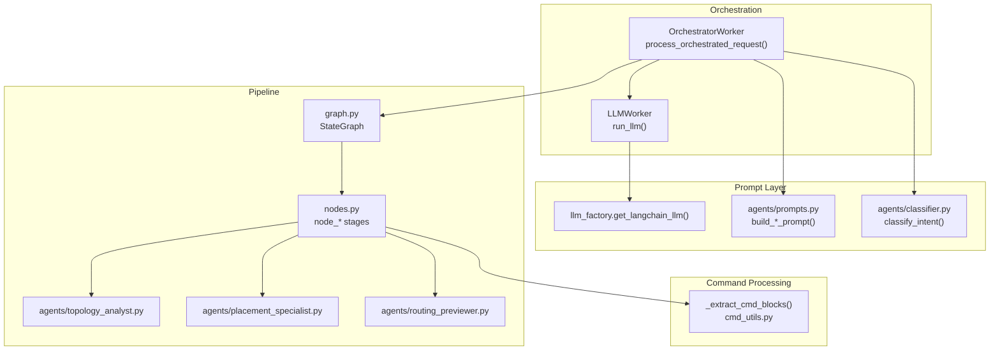

**Diagram sources**
- [llm_worker.py:103-137](file://ai_agent/ai_chat_bot/llm_worker.py#L103-L137)
- [run_llm.py:76-123](file://ai_agent/ai_chat_bot/run_llm.py#L76-L123)
- [llm_factory.py:29-131](file://ai_agent/ai_chat_bot/llm_factory.py#L29-L131)
- [prompts.py:86-383](file://ai_agent/ai_chat_bot/agents/prompts.py#L86-L383)
- [classifier.py:60-105](file://ai_agent/ai_chat_bot/agents/classifier.py#L60-L105)
- [graph.py:1-52](file://ai_agent/ai_chat_bot/graph.py#L1-L52)
- [nodes.py:325-1016](file://ai_agent/ai_chat_bot/nodes.py#L325-L1016)
- [cmd_utils.py:61-107](file://ai_agent/ai_chat_bot/cmd_utils.py#L61-L107)

**Section sources**
- [llm_worker.py:87-165](file://ai_agent/ai_chat_bot/llm_worker.py#L87-L165)
- [run_llm.py:76-162](file://ai_agent/ai_chat_bot/run_llm.py#L76-L162)
- [llm_factory.py:29-131](file://ai_agent/ai_chat_bot/llm_factory.py#L29-L131)
- [prompts.py:86-383](file://ai_agent/ai_chat_bot/agents/prompts.py#L86-L383)
- [graph.py:1-52](file://ai_agent/ai_chat_bot/graph.py#L1-L52)
- [nodes.py:325-1016](file://ai_agent/ai_chat_bot/nodes.py#L325-L1016)
- [cmd_utils.py:61-107](file://ai_agent/ai_chat_bot/cmd_utils.py#L61-L107)

## Core Components
- Unified LLM interface with retry and transient-error handling
- Centralized LangChain model factory supporting multiple providers and weights
- Multi-agent orchestration with intent classification and staged reasoning
- Structured prompts for topology analysis, placement, and routing preview
- Robust JSON command extraction and sanitization with repair strategies
- Validation and safety guards at each stage

**Section sources**
- [run_llm.py:76-162](file://ai_agent/ai_chat_bot/run_llm.py#L76-L162)
- [llm_factory.py:29-131](file://ai_agent/ai_chat_bot/llm_factory.py#L29-L131)
- [llm_worker.py:87-165](file://ai_agent/ai_chat_bot/llm_worker.py#L87-L165)
- [prompts.py:86-383](file://ai_agent/ai_chat_bot/agents/prompts.py#L86-L383)
- [classifier.py:60-105](file://ai_agent/ai_chat_bot/agents/classifier.py#L60-L105)
- [nodes.py:325-1016](file://ai_agent/ai_chat_bot/nodes.py#L325-L1016)
- [cmd_utils.py:61-107](file://ai_agent/ai_chat_bot/cmd_utils.py#L61-L107)

## Architecture Overview
The system integrates a unified LLM invocation layer with a LangGraph pipeline. The orchestrator classifies intent, builds system prompts, and streams through stages that refine placement and routing. The model factory selects the appropriate provider and model variant based on task weight and environment configuration.

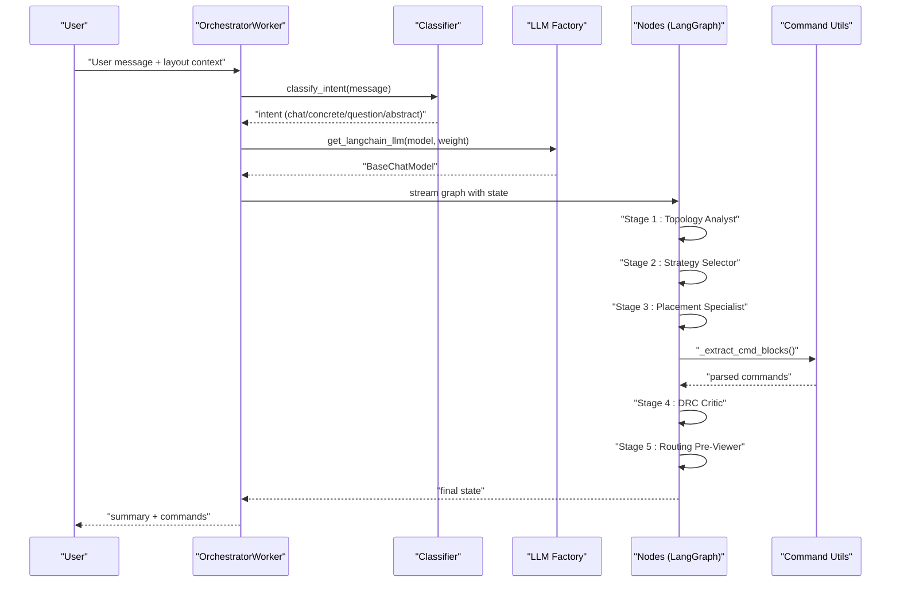

**Diagram sources**
- [llm_worker.py:195-336](file://ai_agent/ai_chat_bot/llm_worker.py#L195-L336)
- [classifier.py:60-105](file://ai_agent/ai_chat_bot/agents/classifier.py#L60-L105)
- [llm_factory.py:29-131](file://ai_agent/ai_chat_bot/llm_factory.py#L29-L131)
- [graph.py:1-52](file://ai_agent/ai_chat_bot/graph.py#L1-L52)
- [nodes.py:325-1016](file://ai_agent/ai_chat_bot/nodes.py#L325-L1016)
- [cmd_utils.py:61-107](file://ai_agent/ai_chat_bot/cmd_utils.py#L61-L107)

## Detailed Component Analysis

### Unified LLM Invocation and Retry Strategy
- Single-shot invocation with LangChain model
- Automatic retry for transient errors (rate limiting, service unavailable)
- Exponential backoff and detailed transient detection
- Graceful degradation to informative error messages

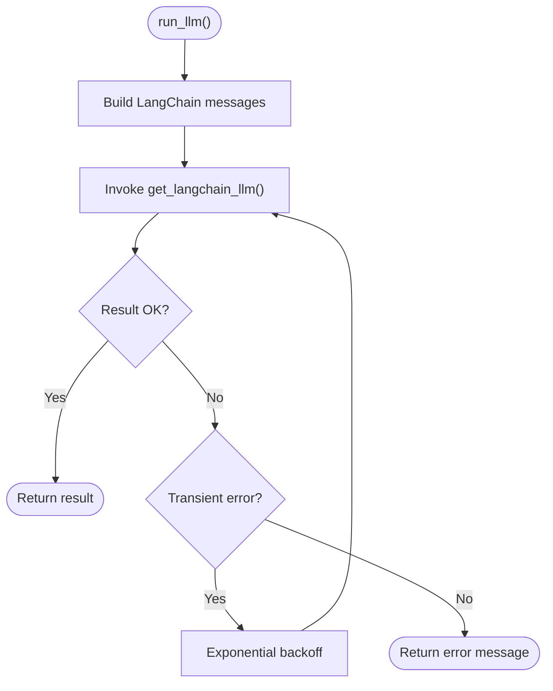

**Diagram sources**
- [run_llm.py:76-162](file://ai_agent/ai_chat_bot/run_llm.py#L76-L162)

**Section sources**
- [run_llm.py:76-162](file://ai_agent/ai_chat_bot/run_llm.py#L76-L162)

### Centralized LangChain Model Factory
- Provider selection: Gemini, Alibaba, VertexGemini, VertexClaude
- Task-weight-based model variant selection
- Environment-driven timeouts and API keys
- Consistent initialization and logging

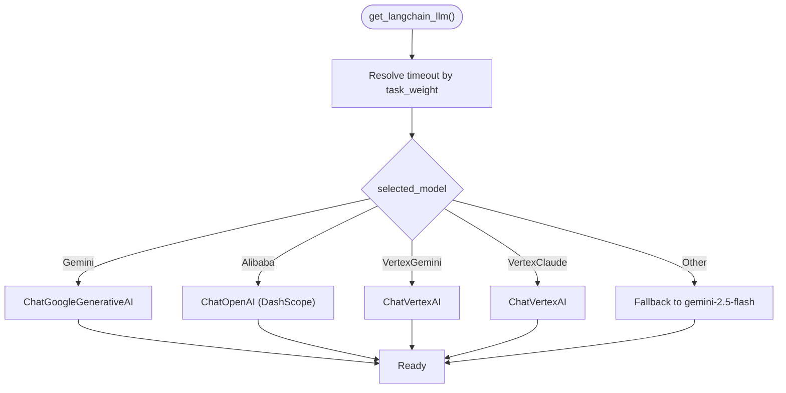

**Diagram sources**
- [llm_factory.py:29-131](file://ai_agent/ai_chat_bot/llm_factory.py#L29-L131)

**Section sources**
- [llm_factory.py:29-131](file://ai_agent/ai_chat_bot/llm_factory.py#L29-L131)

### Intent Classification and Prompt Construction
- Regex fast-path for trivial cases (no LLM cost)
- Lightweight LLM classification for ambiguous intents
- System prompts built per agent with layout context injection
- Conversational vs. concrete vs. abstract vs. question routing

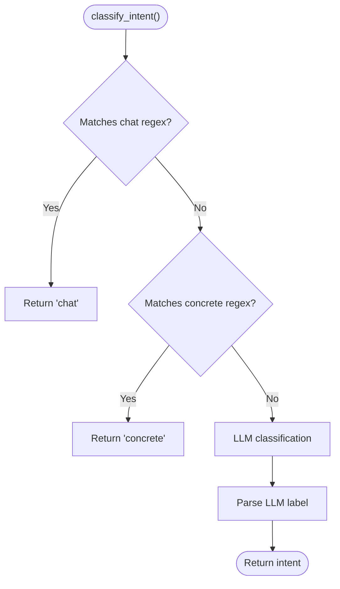

**Diagram sources**
- [classifier.py:60-105](file://ai_agent/ai_chat_bot/agents/classifier.py#L60-L105)

**Section sources**
- [classifier.py:60-105](file://ai_agent/ai_chat_bot/agents/classifier.py#L60-L105)
- [prompts.py:86-383](file://ai_agent/ai_chat_bot/agents/prompts.py#L86-L383)

### Structured Prompt Construction for Layout Context
- Device inventory: logical and physical device listings, finger expansion, row references
- Net adjacency tables: shared-gate/drain/source groups, net criticality classification
- Block grouping information: locked blocks, behavior, and rigid-body movement constraints
- Grid-aware coordinate rules and matching protection

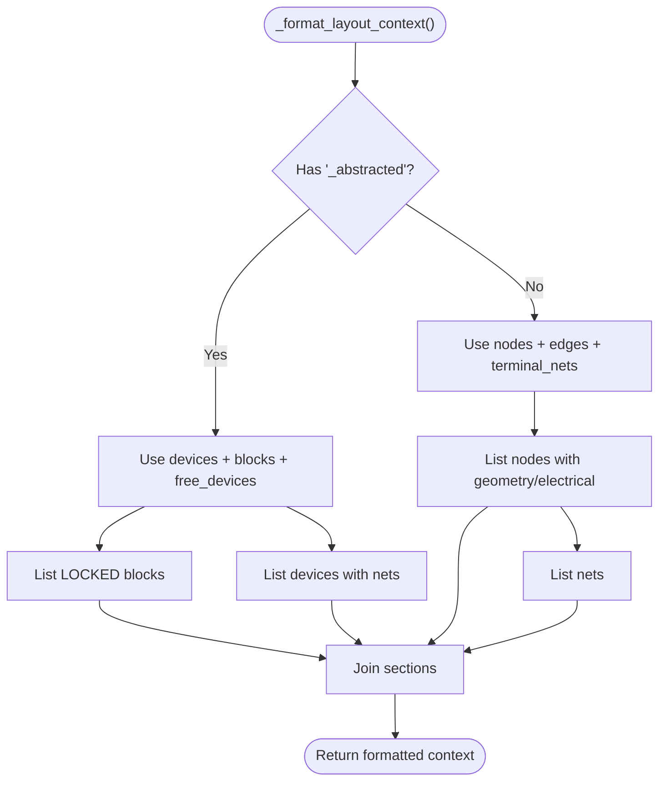

**Diagram sources**
- [prompts.py:287-383](file://ai_agent/ai_chat_bot/agents/prompts.py#L287-L383)

**Section sources**
- [prompts.py:287-383](file://ai_agent/ai_chat_bot/agents/prompts.py#L287-L383)

### Topology Analysis and Constraint Extraction
- Pure Python analysis of SPICE/netlist topology
- Shared-net grouping for matching and symmetry
- Functional role assignment within groups
- Strict output format enforcement

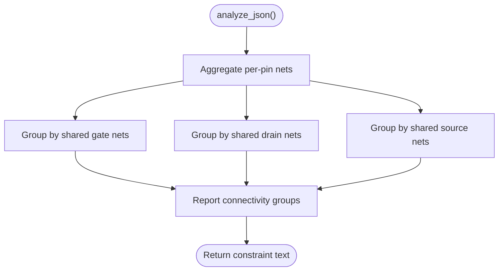

**Diagram sources**
- [topology_analyst.py:163-326](file://ai_agent/ai_chat_bot/agents/topology_analyst.py#L163-L326)

**Section sources**
- [topology_analyst.py:163-326](file://ai_agent/ai_chat_bot/agents/topology_analyst.py#L163-L326)

### Placement Specialist Prompt and Validation
- Mode assignment: common-centroid, interdigitation, mirror biasing, simple
- Deterministic sequencing with strict validation (overlap, centroid, symmetry)
- Row-level slot assignment and mechanical coordinate derivation
- DRC-aware and routing-quality-conscious placement

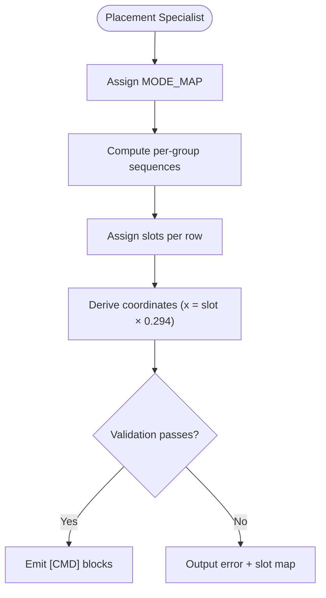

**Diagram sources**
- [placement_specialist.py:15-596](file://ai_agent/ai_chat_bot/agents/placement_specialist.py#L15-L596)

**Section sources**
- [placement_specialist.py:15-596](file://ai_agent/ai_chat_bot/agents/placement_specialist.py#L15-L596)

### Routing Pre-Viewer Prompt and Quality Scoring
- Net classification: critical, bias, signal
- Span-based scoring and wire length estimation
- Swap candidate identification and safety checks
- Prioritization of critical nets and cross-row awareness

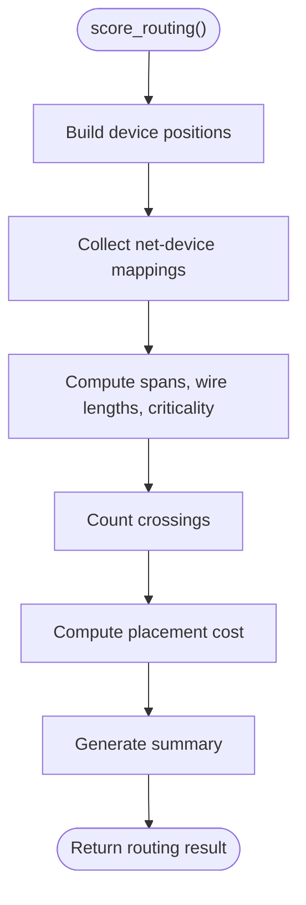

**Diagram sources**
- [routing_previewer.py:125-268](file://ai_agent/ai_chat_bot/agents/routing_previewer.py#L125-L268)

**Section sources**
- [routing_previewer.py:125-268](file://ai_agent/ai_chat_bot/agents/routing_previewer.py#L125-L268)

### JSON Sanitization and Repair Mechanisms
- Robust extraction of [CMD] blocks with normalization
- Repair strategies for malformed JSON: trailing commas, brackets, quotes, and escaped JSON
- Logging of warnings and skipped malformed blocks
- Deduplication and post-processing safeguards

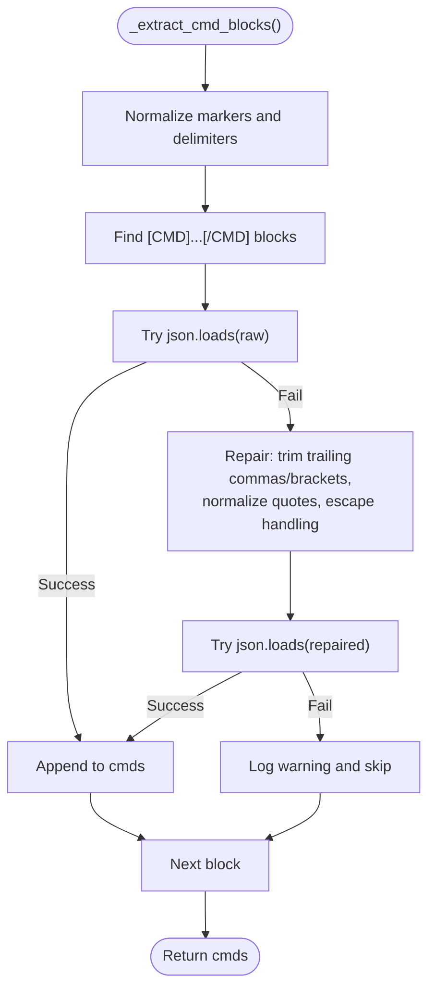

**Diagram sources**
- [cmd_utils.py:61-107](file://ai_agent/ai_chat_bot/cmd_utils.py#L61-L107)

**Section sources**
- [cmd_utils.py:61-107](file://ai_agent/ai_chat_bot/cmd_utils.py#L61-L107)

### Multi-Agent Pipeline and Human-in-the-Loop
- Stateful streaming through topology, strategy, placement, DRC, and routing
- Interrupts for strategy selection and visual review
- Tooling and middleware augmentation for placement specialist
- Final approval gating and command accumulation

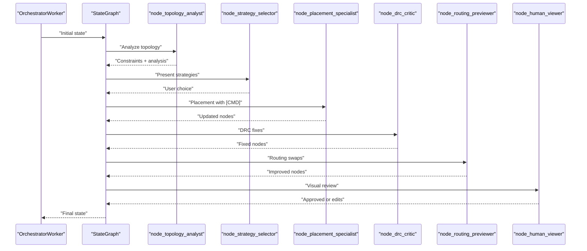

**Diagram sources**
- [graph.py:1-52](file://ai_agent/ai_chat_bot/graph.py#L1-L52)
- [nodes.py:325-1016](file://ai_agent/ai_chat_bot/nodes.py#L325-L1016)

**Section sources**
- [graph.py:1-52](file://ai_agent/ai_chat_bot/graph.py#L1-L52)
- [nodes.py:325-1016](file://ai_agent/ai_chat_bot/nodes.py#L325-L1016)

## Dependency Analysis
- Orchestrator depends on classifier, prompts, and LangGraph pipeline
- Nodes depend on agents’ prompts and tools; they orchestrate LLM invocations with retries
- Command extraction is decoupled and reused across stages
- Model factory centralizes provider configuration and selection

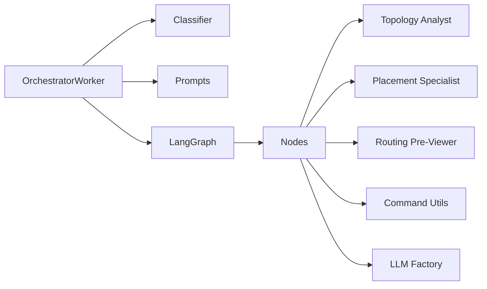

**Diagram sources**
- [llm_worker.py:195-336](file://ai_agent/ai_chat_bot/llm_worker.py#L195-L336)
- [graph.py:1-52](file://ai_agent/ai_chat_bot/graph.py#L1-L52)
- [nodes.py:325-1016](file://ai_agent/ai_chat_bot/nodes.py#L325-L1016)
- [cmd_utils.py:61-107](file://ai_agent/ai_chat_bot/cmd_utils.py#L61-L107)
- [llm_factory.py:29-131](file://ai_agent/ai_chat_bot/llm_factory.py#L29-L131)

**Section sources**
- [llm_worker.py:195-336](file://ai_agent/ai_chat_bot/llm_worker.py#L195-L336)
- [graph.py:1-52](file://ai_agent/ai_chat_bot/graph.py#L1-L52)
- [nodes.py:325-1016](file://ai_agent/ai_chat_bot/nodes.py#L325-L1016)
- [cmd_utils.py:61-107](file://ai_agent/ai_chat_bot/cmd_utils.py#L61-L107)
- [llm_factory.py:29-131](file://ai_agent/ai_chat_bot/llm_factory.py#L29-L131)

## Performance Considerations
- Task-weight-based model selection: lighter tasks use faster models; heavier tasks use more capable models
- Retries with exponential backoff mitigate transient provider errors
- Regex-based intent classification reduces unnecessary LLM calls
- Streaming LangGraph enables responsive human-in-the-loop interactions
- Deduplication and overlap resolution prevent redundant computation

## Troubleshooting Guide
Common issues and remedies:
- Transient provider errors: automatic retry with exponential backoff
- Malformed JSON in [CMD] blocks: automatic repair and logging; verify extracted commands
- Device conservation failures: revert to original nodes and clear pending commands
- DRC violations: prescriptive fixes merged with LLM proposals; final pass recheck
- Routing swaps rejected: cost did not improve; consider alternative strategies

**Section sources**
- [run_llm.py:103-121](file://ai_agent/ai_chat_bot/run_llm.py#L103-L121)
- [cmd_utils.py:84-107](file://ai_agent/ai_chat_bot/cmd_utils.py#L84-L107)
- [nodes.py:593-602](file://ai_agent/ai_chat_bot/nodes.py#L593-L602)
- [nodes.py:766-795](file://ai_agent/ai_chat_bot/nodes.py#L766-L795)
- [nodes.py:913-922](file://ai_agent/ai_chat_bot/nodes.py#L913-L922)

## Conclusion
The Gemini LLM integration leverages a robust, multi-layered architecture: a unified LLM interface with retry logic, a centralized model factory for provider and model selection, and a multi-agent pipeline with structured prompts and validation. The system emphasizes reliability through JSON sanitization and repair, progressive error feedback, and human-in-the-loop controls. Prompt engineering focuses on device inventory, net adjacency, and block grouping, enabling precise, physics-aware layout refinement.