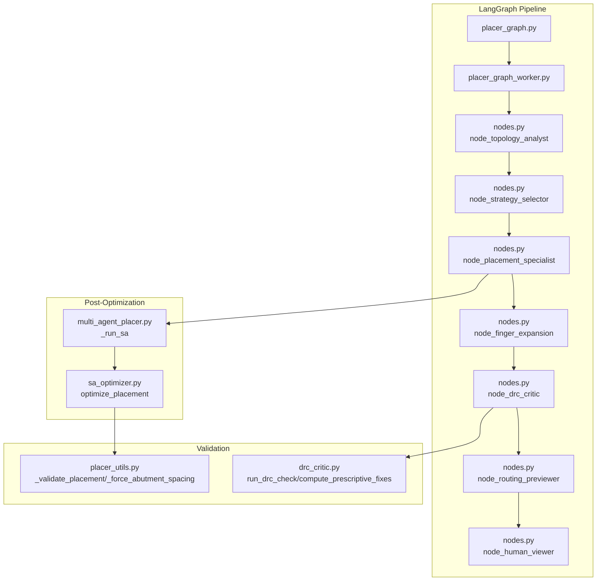
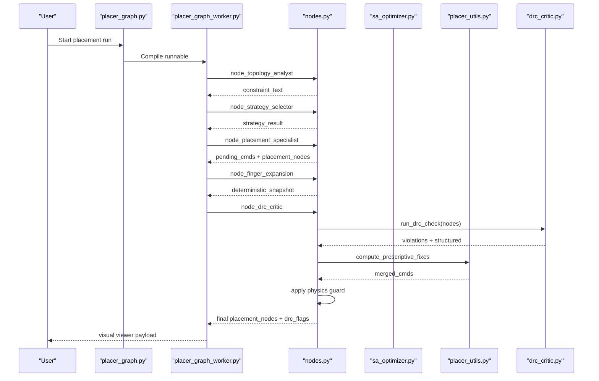
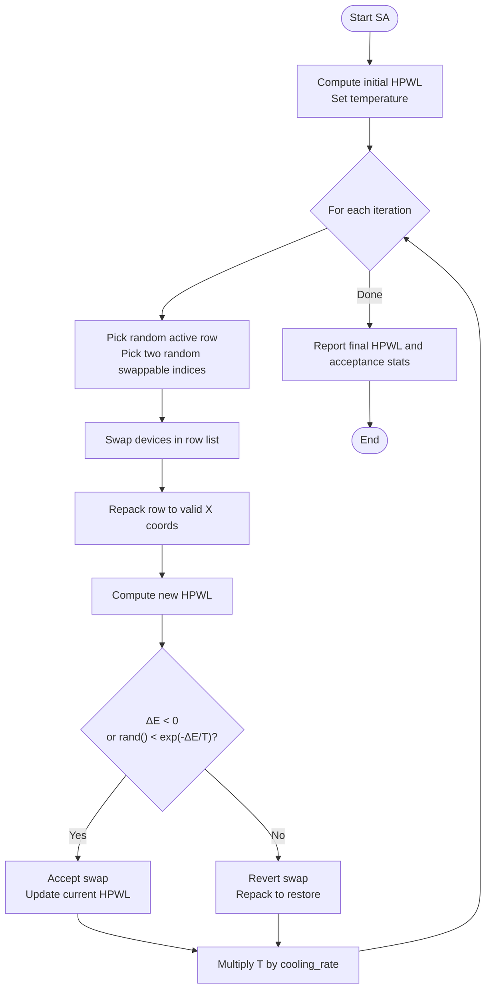
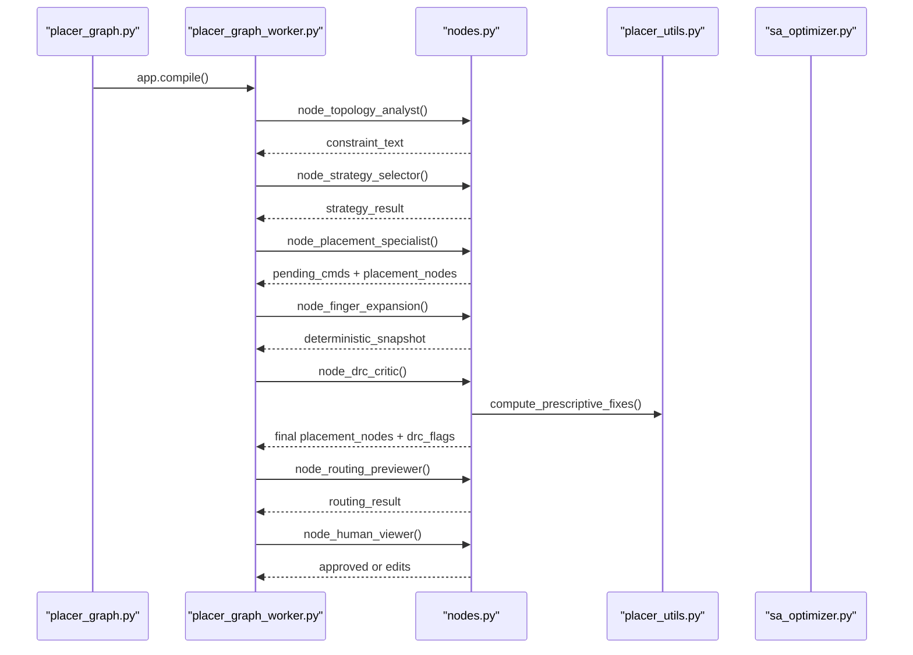
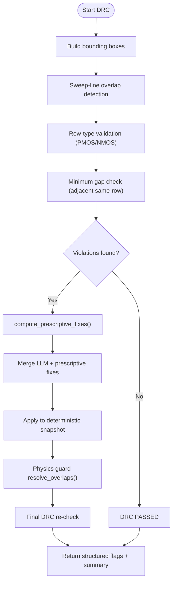
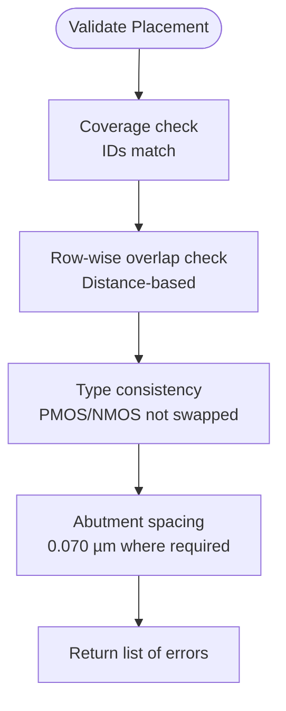
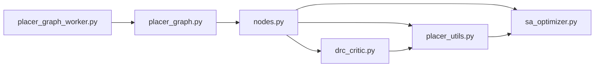

# Optimization and Validation Systems

<cite>
**Referenced Files in This Document**
- [sa_optimizer.py](file://ai_agent/ai_initial_placement/sa_optimizer.py)
- [multi_agent_placer.py](file://ai_agent/ai_initial_placement/multi_agent_placer.py)
- [placer_utils.py](file://ai_agent/ai_initial_placement/placer_utils.py)
- [drc_critic.py](file://ai_agent/ai_chat_bot/agents/drc_critic.py)
- [nodes.py](file://ai_agent/ai_chat_bot/nodes.py)
- [placer_graph.py](file://ai_agent/ai_initial_placement/placer_graph.py)
- [placer_graph_worker.py](file://ai_agent/ai_initial_placement/placer_graph_worker.py)
- [validation_script.py](file://tests/validation_script.py)
</cite>

## Table of Contents
1. [Introduction](#introduction)
2. [Project Structure](#project-structure)
3. [Core Components](#core-components)
4. [Architecture Overview](#architecture-overview)
5. [Detailed Component Analysis](#detailed-component-analysis)
6. [Dependency Analysis](#dependency-analysis)
7. [Performance Considerations](#performance-considerations)
8. [Troubleshooting Guide](#troubleshooting-guide)
9. [Conclusion](#conclusion)

## Introduction
This document explains the placement optimization and validation systems used to produce DRC-clean analog layouts. It covers:
- The simulated annealing (SA) post-optimization that minimizes total half-perimeter wire length (HPWL) within rows while respecting abutment constraints.
- The validation pipeline that verifies device counts, collisions, type consistency, and DRC compliance.
- Error reporting and quality metrics used to evaluate results.
- Practical examples of optimization scenarios, validation failures, and manual refinement workflows.

## Project Structure
The placement system is composed of:
- A multi-agent LangGraph pipeline that orchestrates topology analysis, strategy selection, placement, DRC critique, and routing preview.
- A deterministic geometry engine that converts row-based device orderings into precise coordinates.
- A lightweight SA optimizer that performs within-row reordering to reduce HPWL.
- A robust DRC checker with sweep-line overlap detection, dynamic gap computation, and cost-driven legalizer.

**Diagram sources**
- [placer_graph.py:1-37](file://ai_agent/ai_initial_placement/placer_graph.py#L1-L37)
- [placer_graph_worker.py:1-157](file://ai_agent/ai_initial_placement/placer_graph_worker.py#L1-L157)
- [nodes.py:325-1016](file://ai_agent/ai_chat_bot/nodes.py#L325-L1016)
- [multi_agent_placer.py:1222-1255](file://ai_agent/ai_initial_placement/multi_agent_placer.py#L1222-L1255)
- [sa_optimizer.py:127-256](file://ai_agent/ai_initial_placement/sa_optimizer.py#L127-L256)
- [placer_utils.py:297-389](file://ai_agent/ai_initial_placement/placer_utils.py#L297-L389)
- [drc_critic.py:265-546](file://ai_agent/ai_chat_bot/agents/drc_critic.py#L265-L546)

**Section sources**
- [placer_graph.py:1-37](file://ai_agent/ai_initial_placement/placer_graph.py#L1-L37)
- [placer_graph_worker.py:1-157](file://ai_agent/ai_initial_placement/placer_graph_worker.py#L1-L157)
- [nodes.py:325-1016](file://ai_agent/ai_chat_bot/nodes.py#L325-L1016)

## Core Components
- Simulated Annealing Optimizer: Performs within-row swaps to minimize HPWL, repacks rows to maintain spacing, and respects abutment constraints.
- Multi-Agent Placement Pipeline: Orchestrates topology analysis, strategy selection, placement generation, DRC critique, and routing preview.
- DRC Checker: Implements sweep-line overlap detection, dynamic gap computation, and a cost-driven legalizer to prescribe fixes.
- Validation Utilities: Enforce device count coverage, collision-free packing, type consistency, and abutment spacing.

**Section sources**
- [sa_optimizer.py:127-256](file://ai_agent/ai_initial_placement/sa_optimizer.py#L127-L256)
- [multi_agent_placer.py:1222-1255](file://ai_agent/ai_initial_placement/multi_agent_placer.py#L1222-L1255)
- [drc_critic.py:265-546](file://ai_agent/ai_chat_bot/agents/drc_critic.py#L265-L546)
- [placer_utils.py:297-389](file://ai_agent/ai_initial_placement/placer_utils.py#L297-L389)

## Architecture Overview
The system follows a five-stage pipeline:
1. Topology Analyst: Extracts constraints and functional blocks from the netlist.
2. Strategy Selector: Summarizes findings and waits for user selection.
3. Placement Specialist: Generates device orderings and [CMD] blocks for movement.
4. Finger Expansion: Expands logical devices into physical fingers and validates integrity.
5. DRC Critic: Detects violations and prescribes fixes; a final physics guard resolves residual overlaps.

**Diagram sources**
- [placer_graph.py:1-37](file://ai_agent/ai_initial_placement/placer_graph.py#L1-L37)
- [placer_graph_worker.py:38-157](file://ai_agent/ai_initial_placement/placer_graph_worker.py#L38-L157)
- [nodes.py:325-1016](file://ai_agent/ai_chat_bot/nodes.py#L325-L1016)
- [drc_critic.py:265-546](file://ai_agent/ai_chat_bot/agents/drc_critic.py#L265-L546)
- [placer_utils.py:575-800](file://ai_agent/ai_initial_placement/placer_utils.py#L575-L800)

## Detailed Component Analysis

### Simulated Annealing Optimizer
The SA optimizer focuses on minimizing HPWL by swapping pairs of standalone (non-chain) devices within the same row, then deterministically repacking the row to preserve spacing and abutment integrity.

Key behaviors:
- Energy function: HPWL computed across signal nets (excluding power nets).
- Feasibility: Only swaps eligible devices; abutment chains remain intact.
- Repack after swap: Ensures valid spacing using abutment or standard pitch.
- Acceptance: Metropolis criterion with exponential cooling schedule.
- Convergence: Iterations, initial temperature, and cooling rate are tunable.

**Diagram sources**
- [sa_optimizer.py:127-256](file://ai_agent/ai_initial_placement/sa_optimizer.py#L127-L256)

**Section sources**
- [sa_optimizer.py:27-72](file://ai_agent/ai_initial_placement/sa_optimizer.py#L27-L72)
- [sa_optimizer.py:82-125](file://ai_agent/ai_initial_placement/sa_optimizer.py#L82-L125)
- [sa_optimizer.py:130-256](file://ai_agent/ai_initial_placement/sa_optimizer.py#L130-L256)

### Multi-Agent Placement Pipeline
The LangGraph pipeline orchestrates:
- Topology Analyst: Builds connectivity groups and device summaries.
- Strategy Selector: Summarizes analysis for user selection.
- Placement Specialist: Generates [CMD] blocks and enforces device conservation.
- Finger Expansion: Expands logical devices to physical fingers and validates integrity.
- DRC Critic: Detects overlaps, gaps, and row-type errors; prescribes fixes.
- Routing Previewer: Optionally improves routing via LLM-suggested swaps.
- Human Viewer: Allows manual approval or edits.

**Diagram sources**
- [placer_graph.py:1-37](file://ai_agent/ai_initial_placement/placer_graph.py#L1-L37)
- [placer_graph_worker.py:38-157](file://ai_agent/ai_initial_placement/placer_graph_worker.py#L38-L157)
- [nodes.py:325-1016](file://ai_agent/ai_chat_bot/nodes.py#L325-L1016)
- [placer_utils.py:575-800](file://ai_agent/ai_initial_placement/placer_utils.py#L575-L800)
- [sa_optimizer.py:1226-1254](file://ai_agent/ai_initial_placement/sa_optimizer.py#L1226-L1254)

**Section sources**
- [nodes.py:325-1016](file://ai_agent/ai_chat_bot/nodes.py#L325-L1016)
- [placer_graph.py:1-37](file://ai_agent/ai_initial_placement/placer_graph.py#L1-L37)
- [placer_graph_worker.py:1-157](file://ai_agent/ai_initial_placement/placer_graph_worker.py#L1-L157)

### DRC Checker and Legalizer
The DRC checker implements:
- Sweep-line overlap detection: O(N log N + R) complexity for efficient overlap detection.
- Dynamic gap computation: Uses terminal_nets to compute yield-limiting gaps per device pair.
- Cost-driven legalizer: Evaluates four cardinal-direction candidates using a Manhattan cost function with HPWL penalty proxy; preserves symmetry for matched groups.

**Diagram sources**
- [drc_critic.py:265-546](file://ai_agent/ai_chat_bot/agents/drc_critic.py#L265-L546)
- [drc_critic.py:575-800](file://ai_agent/ai_chat_bot/agents/drc_critic.py#L575-L800)

**Section sources**
- [drc_critic.py:184-259](file://ai_agent/ai_chat_bot/agents/drc_critic.py#L184-L259)
- [drc_critic.py:265-546](file://ai_agent/ai_chat_bot/agents/drc_critic.py#L265-L546)
- [drc_critic.py:575-800](file://ai_agent/ai_chat_bot/agents/drc_critic.py#L575-L800)

### Validation Utilities
Validation routines ensure:
- Device count verification: Missing or extra devices are flagged.
- Collision detection: Overlaps or insufficient spacing within rows.
- Type consistency checks: Device types must not change during placement.
- DRC compliance: Overlaps, gaps, and row-type errors are reported with prescriptive fixes.

**Diagram sources**
- [placer_utils.py:297-389](file://ai_agent/ai_initial_placement/placer_utils.py#L297-L389)
- [placer_utils.py:888-950](file://ai_agent/ai_initial_placement/placer_utils.py#L888-L950)

**Section sources**
- [placer_utils.py:297-389](file://ai_agent/ai_initial_placement/placer_utils.py#L297-L389)
- [placer_utils.py:888-950](file://ai_agent/ai_initial_placement/placer_utils.py#L888-L950)

## Dependency Analysis
The system exhibits clear layering:
- LangGraph orchestrates domain-specific nodes.
- Post-placement utilities (placer_utils) provide deterministic geometry and validation.
- SA optimizer integrates as an optional post-processing step.
- DRC critic depends on terminal_nets and geometric metadata to compute dynamic gaps.

**Diagram sources**
- [nodes.py:325-1016](file://ai_agent/ai_chat_bot/nodes.py#L325-L1016)
- [drc_critic.py:265-546](file://ai_agent/ai_chat_bot/agents/drc_critic.py#L265-L546)
- [placer_utils.py:297-389](file://ai_agent/ai_initial_placement/placer_utils.py#L297-L389)
- [sa_optimizer.py:1226-1254](file://ai_agent/ai_initial_placement/sa_optimizer.py#L1226-L1254)
- [placer_graph.py:1-37](file://ai_agent/ai_initial_placement/placer_graph.py#L1-L37)
- [placer_graph_worker.py:1-157](file://ai_agent/ai_initial_placement/placer_graph_worker.py#L1-L157)

**Section sources**
- [nodes.py:325-1016](file://ai_agent/ai_chat_bot/nodes.py#L325-L1016)
- [placer_utils.py:297-389](file://ai_agent/ai_initial_placement/placer_utils.py#L297-L389)
- [sa_optimizer.py:1226-1254](file://ai_agent/ai_initial_placement/sa_optimizer.py#L1226-L1254)
- [drc_critic.py:265-546](file://ai_agent/ai_chat_bot/agents/drc_critic.py#L265-L546)

## Performance Considerations
- SA runtime: Typically 1–3 seconds for circuits up to ~100 devices, controlled by iteration count and cooling schedule.
- DRC complexity: Sweep-line algorithm reduces overlap detection from O(N²) to O(N log N + R), enabling scalable validation.
- Dynamic gap computation: Avoids unnecessary bloat by modeling yield-limiting constraints from terminal_nets.
- Cost-driven legalizer: Uses Manhattan cost with HPWL proxy to minimize wire length while preserving symmetry.

[No sources needed since this section provides general guidance]

## Troubleshooting Guide
Common issues and resolutions:
- Missing devices after placement: The device conservation tool rejects outputs that drop or duplicate devices; revert to the original nodes and regenerate placement.
- Overlaps or insufficient gaps: The DRC critic reports violations with prescriptive fixes; the cost-driven legalizer merges LLM and deterministic fixes; a physics guard nudges devices to resolve residual overlaps.
- Abutment spacing errors: The force-fix pass ensures abutted devices are exactly 0.070 µm apart; standalone devices are spaced by their widths.
- Manual refinement: The human viewer stage allows approvals or edits; pending [CMD] blocks are applied in subsequent stages.

**Section sources**
- [nodes.py:593-612](file://ai_agent/ai_chat_bot/nodes.py#L593-L612)
- [nodes.py:766-790](file://ai_agent/ai_chat_bot/nodes.py#L766-L790)
- [placer_utils.py:888-950](file://ai_agent/ai_initial_placement/placer_utils.py#L888-L950)
- [drc_critic.py:575-800](file://ai_agent/ai_chat_bot/agents/drc_critic.py#L575-L800)

## Examples

### Optimization Scenario
- Scenario: A layout with multiple matched pairs and long signal nets.
- SA behavior: Performs within-row swaps to reduce HPWL; repacks rows to maintain abutment and spacing; prints improvement percentage and acceptance rate.
- Outcome: Lower HPWL with preserved abutment chains and no collisions.

**Section sources**
- [sa_optimizer.py:127-256](file://ai_agent/ai_initial_placement/sa_optimizer.py#L127-L256)

### Validation Failure: Overlap Violation
- Symptom: DRC reports overlapping bounding boxes in the same row.
- Resolution: The DRC critic prescribes moves; the cost-driven legalizer selects the lowest-cost legal position; a physics guard resolves residual overlaps.

**Section sources**
- [drc_critic.py:341-389](file://ai_agent/ai_chat_bot/agents/drc_critic.py#L341-L389)
- [drc_critic.py:575-800](file://ai_agent/ai_chat_bot/agents/drc_critic.py#L575-L800)

### Validation Failure: Row-Type Error
- Symptom: PMOS devices appear below NMOS rows or vice versa.
- Resolution: The DRC critic identifies row errors and prescribes moves to the correct row bands; the legalizer respects type-aware row constraints.

**Section sources**
- [drc_critic.py:390-496](file://ai_agent/ai_chat_bot/agents/drc_critic.py#L390-L496)

### Manual Refinement Workflow
- Trigger: User requests edits via the human viewer stage.
- Action: Pending [CMD] blocks are applied; device conservation is enforced; the pipeline continues with updated placement.

**Section sources**
- [nodes.py:477-490](file://ai_agent/ai_chat_bot/nodes.py#L477-L490)
- [nodes.py:593-612](file://ai_agent/ai_chat_bot/nodes.py#L593-L612)

### Geometry Validation Example
- Purpose: Compare original finger-level widths to AI-generated device widths.
- Method: The validation script computes total width from original fingers and compares to new geometry; reports PASS or FAIL with error magnitude.

**Section sources**
- [validation_script.py:1-31](file://tests/validation_script.py#L1-L31)

## Conclusion
The placement optimization and validation systems combine a multi-agent pipeline, deterministic geometry, and robust DRC checking to produce compact, DRC-clean analog layouts. The SA optimizer further refines HPWL within row constraints, while the DRC checker and legalizer ensure scalability and correctness. Manual refinement is supported through the human viewer stage, enabling iterative improvements guided by structured error reporting and quality metrics.