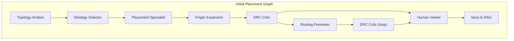
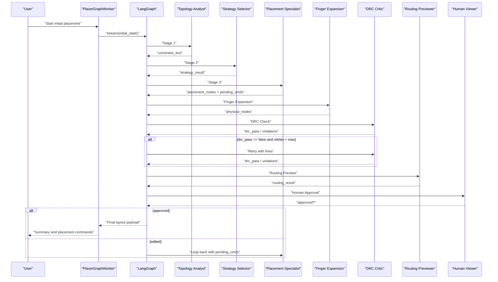
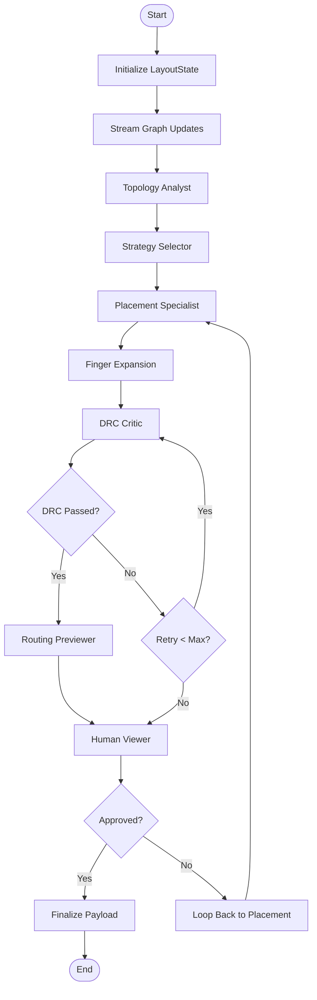
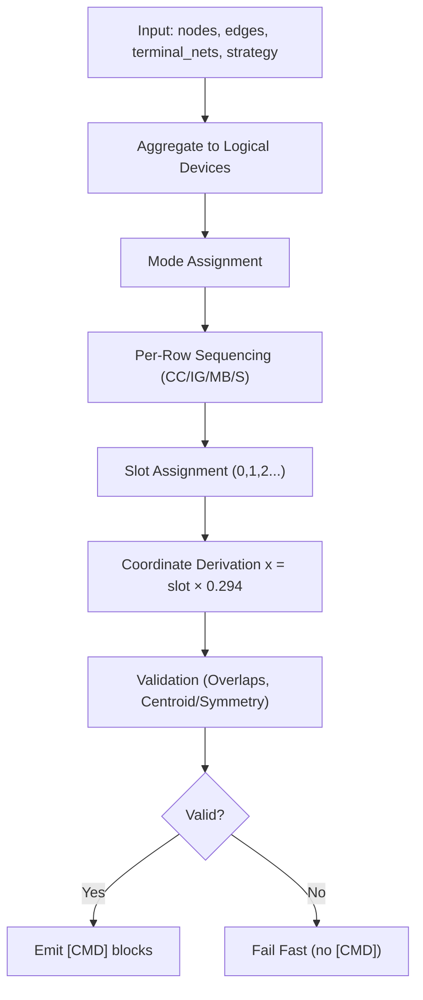
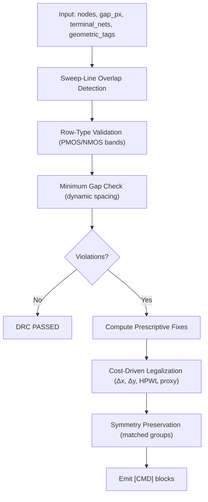
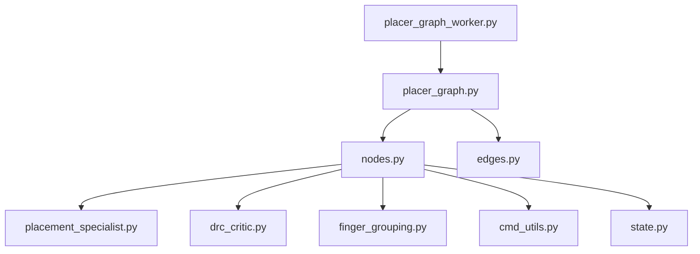

# Placement Algorithm Overview

<cite>
**Referenced Files in This Document**
- [placer_graph.py](file://ai_agent/ai_initial_placement/placer_graph.py)
- [placer_graph_worker.py](file://ai_agent/ai_initial_placement/placer_graph_worker.py)
- [sa_optimizer.py](file://ai_agent/ai_initial_placement/sa_optimizer.py)
- [graph.py](file://ai_agent/ai_chat_bot/graph.py)
- [nodes.py](file://ai_agent/ai_chat_bot/nodes.py)
- [edges.py](file://ai_agent/ai_chat_bot/edges.py)
- [state.py](file://ai_agent/ai_chat_bot/state.py)
- [finger_grouping.py](file://ai_agent/ai_chat_bot/finger_grouping.py)
- [placement_specialist.py](file://ai_agent/ai_chat_bot/agents/placement_specialist.py)
- [drc_critic.py](file://ai_agent/ai_chat_bot/agents/drc_critic.py)
- [cmd_utils.py](file://ai_agent/ai_chat_bot/cmd_utils.py)
- [Miller_OTA_graph_compressed.json](file://examples/Miller_OTA/Miller_OTA_graph_compressed.json)
- [Current_Mirror_CM_graph_compressed.json](file://examples/current_mirror/Current_Mirror_CM_graph_compressed.json)
</cite>

## Table of Contents
1. [Introduction](#introduction)
2. [Project Structure](#project-structure)
3. [Core Components](#core-components)
4. [Architecture Overview](#architecture-overview)
5. [Detailed Component Analysis](#detailed-component-analysis)
6. [Dependency Analysis](#dependency-analysis)
7. [Performance Considerations](#performance-considerations)
8. [Troubleshooting Guide](#troubleshooting-guide)
9. [Conclusion](#conclusion)
10. [Appendices](#appendices)

## Introduction
This document explains the AI placement algorithm architecture used for analog IC layout automation. It covers the end-to-end workflow from an input graph to final layout coordinates, including coordinate normalization, fin grid quantization, DRC compliance enforcement, prompt engineering for device inventory and constraints, and the retry mechanism with validation feedback loops. It also provides examples of successful scenarios and common failure patterns with resolutions.

## Project Structure
The placement pipeline is implemented as a LangGraph workflow composed of specialized nodes and agents. The initial placement graph defines a linear pipeline with optional loops for DRC review and human approval. A worker thread orchestrates streaming updates and finalizes the placement payload.

**Diagram sources**
- [placer_graph.py:11-37](file://ai_agent/ai_initial_placement/placer_graph.py#L11-L37)
- [graph.py:25-52](file://ai_agent/ai_chat_bot/graph.py#L25-L52)

**Section sources**
- [placer_graph.py:1-37](file://ai_agent/ai_initial_placement/placer_graph.py#L1-L37)
- [graph.py:1-52](file://ai_agent/ai_chat_bot/graph.py#L1-L52)

## Core Components
- Initial Placement Graph: Defines stages and edges for topology analysis, strategy selection, placement, finger expansion, DRC critique, routing preview, human viewer, and persistence.
- Worker Orchestrator: Streams stage progress and emits final placement commands and routing results.
- Placement Specialist Agent: Generates deterministic [CMD] blocks for device movement based on mode-specific algorithms and constraints.
- DRC Critic Agent: Detects overlaps, gaps, and row-type violations; computes prescriptive fixes; enforces symmetry preservation.
- Finger Grouping Utilities: Aggregates and expands multi-finger devices to/from logical representations.
- State Management: Typed dictionary holding inputs, intermediate results, and flags for retries and approvals.
- Retry and Routing Loops: Conditional edges enable iterative refinement until DRC passes or a maximum retry threshold is reached.

**Section sources**
- [placer_graph.py:11-37](file://ai_agent/ai_initial_placement/placer_graph.py#L11-L37)
- [placer_graph_worker.py:14-157](file://ai_agent/ai_initial_placement/placer_graph_worker.py#L14-L157)
- [nodes.py:325-800](file://ai_agent/ai_chat_bot/nodes.py#L325-L800)
- [drc_critic.py:1-987](file://ai_agent/ai_chat_bot/agents/drc_critic.py#L1-L987)
- [finger_grouping.py:198-355](file://ai_agent/ai_chat_bot/finger_grouping.py#L198-L355)
- [state.py:1-37](file://ai_agent/ai_chat_bot/state.py#L1-L37)
- [edges.py:1-24](file://ai_agent/ai_chat_bot/edges.py#L1-L24)

## Architecture Overview
The placement pipeline proceeds through a series of deterministic and iterative steps:
1. Topology Analyst extracts constraints from the graph and queries the LLM to confirm intent.
2. Strategy Selector proposes strategies and waits for human-in-the-loop approval.
3. Placement Specialist generates [CMD] blocks for device positions using mode-specific algorithms and slot-based coordinate derivation.
4. Finger Expansion converts logical devices back to physical fingers and validates integrity.
5. DRC Critic checks for overlaps, gaps, and row-type errors; computes prescriptive fixes; enforces symmetry.
6. Routing Previewer optionally evaluates routing feasibility; the pipeline loops back to DRC Critic if needed.
7. Human Viewer approves the result; upon approval, the run is saved to RAG.

**Diagram sources**
- [placer_graph_worker.py:38-157](file://ai_agent/ai_initial_placement/placer_graph_worker.py#L38-L157)
- [graph.py:25-52](file://ai_agent/ai_chat_bot/graph.py#L25-L52)
- [edges.py:6-24](file://ai_agent/ai_chat_bot/edges.py#L6-L24)
- [nodes.py:450-612](file://ai_agent/ai_chat_bot/nodes.py#L450-L612)
- [drc_critic.py:265-546](file://ai_agent/ai_chat_bot/agents/drc_critic.py#L265-L546)

## Detailed Component Analysis

### Initial Placement Graph and Worker
- The initial placement graph registers nodes for topology analysis, strategy selection, placement, finger expansion, DRC critique, routing previewer, human viewer, and persistence.
- The worker initializes a state from serialized layout context, streams stage completions, and finalizes a payload with placement commands and routing results.
- Finalization rounds coordinates to millimeter-scale and emits a consolidated summary.

**Diagram sources**
- [placer_graph.py:11-37](file://ai_agent/ai_initial_placement/placer_graph.py#L11-L37)
- [placer_graph_worker.py:38-157](file://ai_agent/ai_initial_placement/placer_graph_worker.py#L38-L157)
- [edges.py:6-24](file://ai_agent/ai_chat_bot/edges.py#L6-L24)

**Section sources**
- [placer_graph.py:1-37](file://ai_agent/ai_initial_placement/placer_graph.py#L1-L37)
- [placer_graph_worker.py:14-157](file://ai_agent/ai_initial_placement/placer_graph_worker.py#L14-L157)

### Topology Analyst and Strategy Selector
- Topology Analyst aggregates physical fingers into logical devices and derives constraints from the netlist and topology.
- Strategy Selector presents strategies to the user and parses their selection; the pipeline pauses for human-in-the-loop approval.

**Section sources**
- [nodes.py:325-447](file://ai_agent/ai_chat_bot/nodes.py#L325-L447)
- [finger_grouping.py:198-252](file://ai_agent/ai_chat_bot/finger_grouping.py#L198-L252)

### Placement Specialist Agent
- Generates [CMD] blocks for device movement using deterministic mode-specific algorithms:
  - Common-Centroid (CC): Left-Center-Right interleaving to match centroids.
  - Interdigitation (IG): Ratio-based proportional interleaving to avoid clustering.
  - Mirror Biasing (MB): Symmetric half-construction with dummy paddings at ends.
  - Simple (S): Left-to-right ordering without interleaving.
- Enforces slot-based coordinate derivation: x = slot × 0.294 µm, mechanical overlap checks, and routing-aware alignment.
- Builds a structured inventory context for the LLM, including device-to-finger maps, row references, and terminal nets.

**Diagram sources**
- [placement_specialist.py:15-596](file://ai_agent/ai_chat_bot/agents/placement_specialist.py#L15-L596)
- [finger_grouping.py:198-355](file://ai_agent/ai_chat_bot/finger_grouping.py#L198-L355)

**Section sources**
- [placement_specialist.py:15-596](file://ai_agent/ai_chat_bot/agents/placement_specialist.py#L15-L596)
- [cmd_utils.py:109-171](file://ai_agent/ai_chat_bot/cmd_utils.py#L109-L171)

### Finger Expansion and Integrity
- Converts logical devices back to physical fingers using a fixed pitch of 0.294 µm.
- Validates that all original finger devices are preserved across aggregation and expansion.

**Section sources**
- [finger_grouping.py:308-355](file://ai_agent/ai_chat_bot/finger_grouping.py#L308-L355)
- [finger_grouping.py:462-512](file://ai_agent/ai_chat_bot/finger_grouping.py#L462-L512)

### DRC Critic Agent
- Implements an upgraded DRC checker:
  - Sweep-line overlap detection O(N log N + R).
  - Dynamic gap computation based on equipotential nets (abutment allowed when shared).
  - Cost-driven legalizer with symmetry preservation for matched groups.
- Produces prescriptive fixes with exact coordinates and group-move semantics.

**Diagram sources**
- [drc_critic.py:265-546](file://ai_agent/ai_chat_bot/agents/drc_critic.py#L265-L546)
- [drc_critic.py:575-955](file://ai_agent/ai_chat_bot/agents/drc_critic.py#L575-L955)

**Section sources**
- [drc_critic.py:1-987](file://ai_agent/ai_chat_bot/agents/drc_critic.py#L1-L987)

### Retry Mechanism and Validation Feedback Loops
- Conditional edges route back to the DRC Critic if violations exist and retry attempts are under the maximum threshold.
- The Human Viewer can approve or request edits; edits are applied directly to placement nodes before looping back to Placement Specialist.

**Section sources**
- [edges.py:6-24](file://ai_agent/ai_chat_bot/edges.py#L6-L24)
- [nodes.py:477-490](file://ai_agent/ai_chat_bot/nodes.py#L477-L490)

### Coordinate Normalization and Fin Grid Quantization
- Slot-based coordinate derivation: x = slot × 0.294 µm.
- Deduplication and snapping to device pitch ensure no overlaps after movement.
- Row-type enforcement preserves PMOS above NMOS and maintains row bands.

**Section sources**
- [placement_specialist.py:286-350](file://ai_agent/ai_chat_bot/agents/placement_specialist.py#L286-L350)
- [cmd_utils.py:39-60](file://ai_agent/ai_chat_bot/cmd_utils.py#L39-L60)
- [cmd_utils.py:109-171](file://ai_agent/ai_chat_bot/cmd_utils.py#L109-L171)

### Prompt Engineering Approach
- Net Adjacency Injection: The Placement Specialist context includes terminal nets and device-to-finger maps to guide routing-aware placement.
- Device Inventory Presentation: Logical device counts, finger instances, and row references are formatted for deterministic reasoning.
- Block Grouping Information: The DRC Critic receives geometric tags for matched groups to preserve symmetry during legalizations.

**Section sources**
- [placement_specialist.py:646-829](file://ai_agent/ai_chat_bot/agents/placement_specialist.py#L646-L829)
- [drc_critic.py:575-955](file://ai_agent/ai_chat_bot/agents/drc_critic.py#L575-L955)

### Successful Placement Scenarios
- Example: Miller OTA
  - Logical device aggregation reduces complexity; IG sequencing balances device densities.
  - DRC passes after initial placement; routing preview confirms feasible access.
- Example: Current Mirror CM
  - MB mode ensures symmetric mirror pairs; dummy paddings enforce end constraints.
  - Post-DRC fixes preserve symmetry and resolve minor row-type violations.

**Section sources**
- [Miller_OTA_graph_compressed.json:1-186](file://examples/Miller_OTA/Miller_OTA_graph_compressed.json#L1-L186)
- [Current_Mirror_CM_graph_compressed.json:1-126](file://examples/current_mirror/Current_Mirror_CM_graph_compressed.json#L1-L126)

### Common Failure Patterns and Resolutions
- Overlaps
  - Cause: Incorrect slot assignments or insufficient deduplication.
  - Resolution: Re-run DRC Critic; apply prescriptive fixes; verify overlap-free expansion.
- Gap Violations
  - Cause: Insufficient spacing for non-abutting devices sharing different voltages.
  - Resolution: Increase gap_px or adjust dynamic gap computation; re-run DRC.
- Row-Type Errors
  - Cause: PMOS/NMOS swapped rows or misaligned bands.
  - Resolution: Apply vertical-only corrections; maintain matched-group symmetry.
- Mode Mismatch
  - Cause: Ambiguous device mode assignment or mixed-mode violations.
  - Resolution: Clarify user request; re-run Placement Specialist with corrected MODE_MAP.

**Section sources**
- [drc_critic.py:341-546](file://ai_agent/ai_chat_bot/agents/drc_critic.py#L341-L546)
- [placement_specialist.py:447-595](file://ai_agent/ai_chat_bot/agents/placement_specialist.py#L447-L595)

## Dependency Analysis
The placement system exhibits clear separation of concerns:
- LangGraph orchestrates control flow and state transitions.
- Agents encapsulate domain logic for topology, placement, and DRC.
- Utilities handle parsing, application, and validation of [CMD] blocks.
- Finger grouping bridges logical and physical device representations.

**Diagram sources**
- [placer_graph.py:1-37](file://ai_agent/ai_initial_placement/placer_graph.py#L1-L37)
- [placer_graph_worker.py:14-157](file://ai_agent/ai_initial_placement/placer_graph_worker.py#L14-L157)
- [nodes.py:1-800](file://ai_agent/ai_chat_bot/nodes.py#L1-L800)

**Section sources**
- [placer_graph.py:1-37](file://ai_agent/ai_initial_placement/placer_graph.py#L1-L37)
- [placer_graph_worker.py:14-157](file://ai_agent/ai_initial_placement/placer_graph_worker.py#L14-L157)
- [nodes.py:1-800](file://ai_agent/ai_chat_bot/nodes.py#L1-L800)

## Performance Considerations
- Simulated Annealing post-optimization minimizes HPWL while respecting abutment chains and row packing.
- DRC checker uses sweep-line and dynamic gap computation to scale efficiently with device counts.
- Slot-based coordinate derivation avoids arbitrary coordinate assignment and reduces validation overhead.

[No sources needed since this section provides general guidance]

## Troubleshooting Guide
- LLM Invocation Failures: Retries are applied for timeouts; inspect chat history and normalize content to strip thinking blocks.
- Device Conservation: If inventory is altered, revert to original nodes and clear pending commands.
- Human-in-the-Loop Loops: Pending edits are applied directly; ensure approvals to exit the loop.

**Section sources**
- [nodes.py:225-241](file://ai_agent/ai_chat_bot/nodes.py#L225-L241)
- [nodes.py:593-602](file://ai_agent/ai_chat_bot/nodes.py#L593-L602)
- [placer_graph_worker.py:477-490](file://ai_agent/ai_initial_placement/placer_graph_worker.py#L477-L490)

## Conclusion
The AI placement algorithm combines deterministic mode-specific sequencing, robust DRC enforcement, and iterative refinement to produce high-quality analog layouts. The LangGraph-based workflow enables human-in-the-loop oversight, while utilities ensure device conservation and coordinate quantization. The retry mechanism with prescriptive fixes and symmetry preservation yields reliable results across diverse topologies.

## Appendices
- Example Graphs: Miller OTA and Current Mirror CM demonstrate typical device configurations and netlists used for placement runs.

**Section sources**
- [Miller_OTA_graph_compressed.json:1-186](file://examples/Miller_OTA/Miller_OTA_graph_compressed.json#L1-L186)
- [Current_Mirror_CM_graph_compressed.json:1-126](file://examples/current_mirror/Current_Mirror_CM_graph_compressed.json#L1-L126)