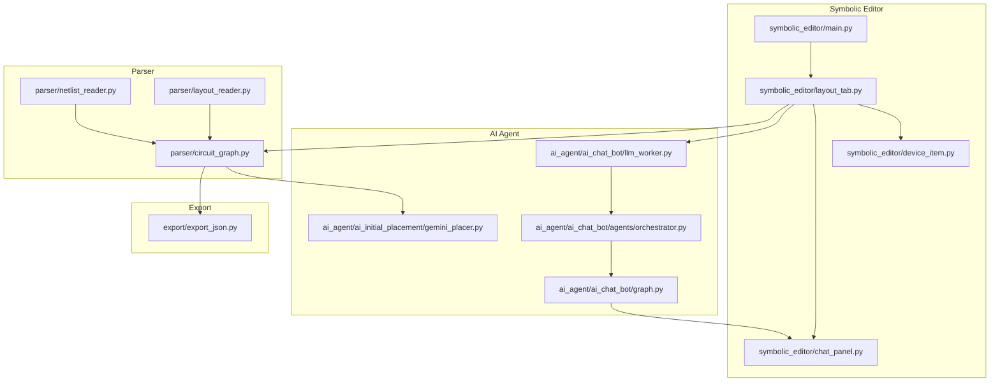
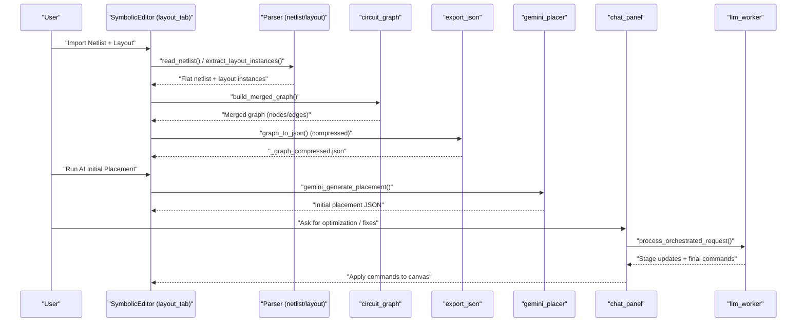
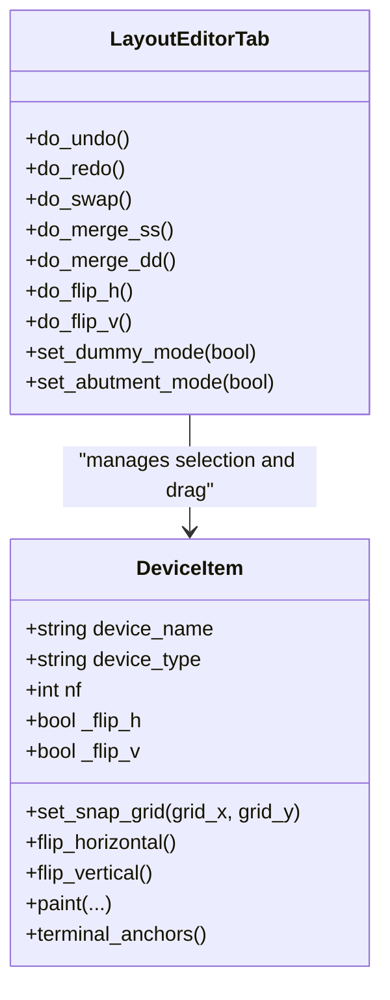
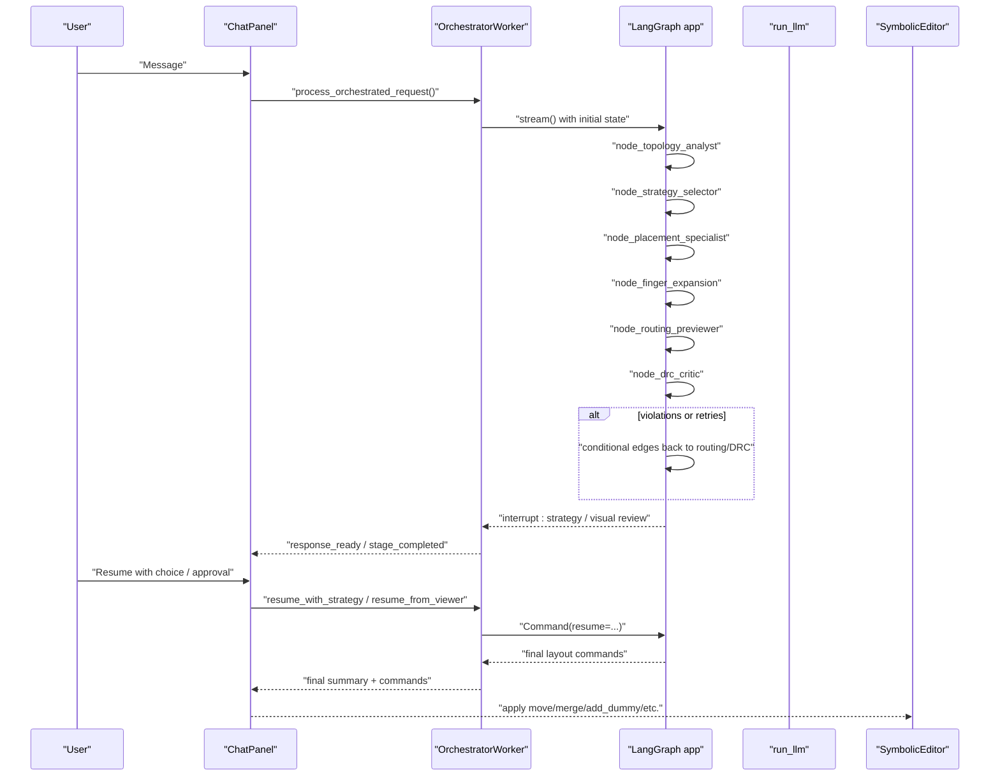
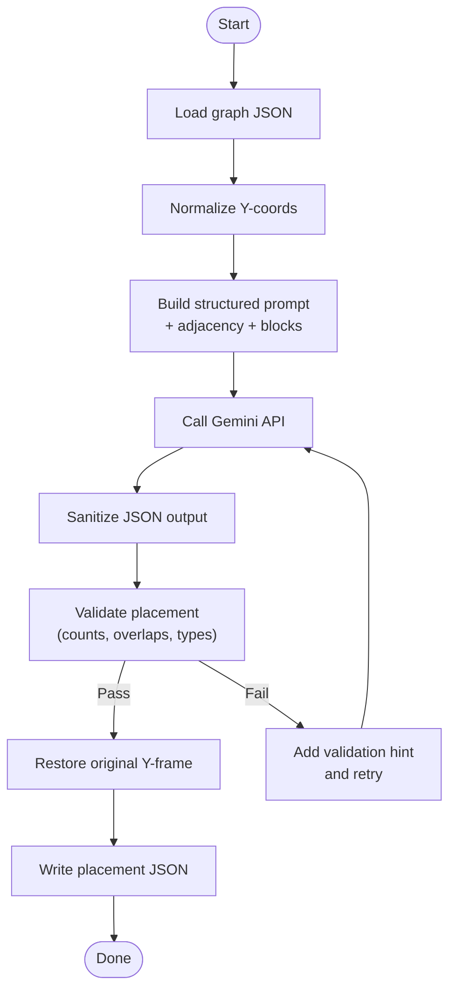
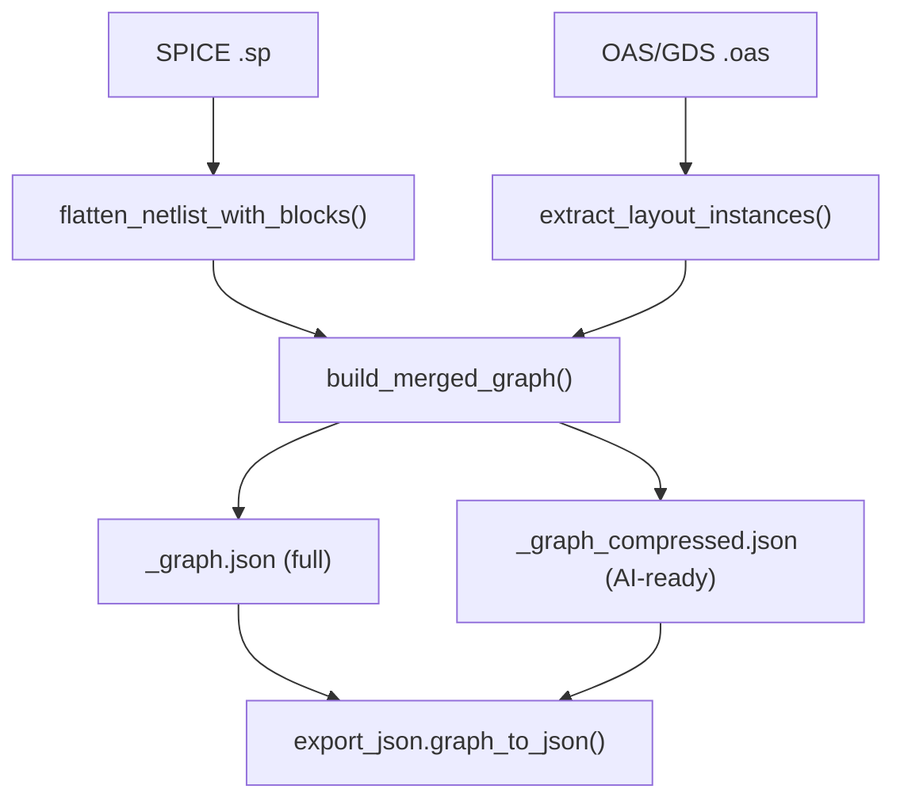
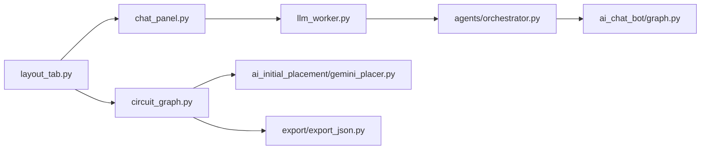

# Core Features

<cite>
**Referenced Files in This Document**
- [README.md](file://README.md)
- [main.py](file://symbolic_editor/main.py)
- [layout_tab.py](file://symbolic_editor/layout_tab.py)
- [device_item.py](file://symbolic_editor/device_item.py)
- [chat_panel.py](file://symbolic_editor/chat_panel.py)
- [export_json.py](file://export/export_json.py)
- [circuit_graph.py](file://parser/circuit_graph.py)
- [netlist_reader.py](file://parser/netlist_reader.py)
- [layout_reader.py](file://parser/layout_reader.py)
- [gemini_placer.py](file://ai_agent/ai_initial_placement/gemini_placer.py)
- [llm_worker.py](file://ai_agent/ai_chat_bot/llm_worker.py)
- [orchestrator.py](file://ai_agent/ai_chat_bot/agents/orchestrator.py)
- [graph.py](file://ai_agent/ai_chat_bot/graph.py)
</cite>

## Table of Contents
1. [Introduction](#introduction)
2. [Project Structure](#project-structure)
3. [Core Components](#core-components)
4. [Architecture Overview](#architecture-overview)
5. [Detailed Component Analysis](#detailed-component-analysis)
6. [Dependency Analysis](#dependency-analysis)
7. [Performance Considerations](#performance-considerations)
8. [Troubleshooting Guide](#troubleshooting-guide)
9. [Conclusion](#conclusion)
10. [Appendices](#appendices)

## Introduction
This document explains the core features of the AI-Based Analog Layout Automation system with a focus on:
- Interactive symbolic canvas for device-level manipulation
- AI chat panel with a multi-agent pipeline
- AI initial placement powered by Gemini LLM APIs
- Import/export pipeline integrating netlist and layout data

It provides feature comparisons, use cases, integration patterns, and practical examples of how these components collaborate in a typical design workflow.

## Project Structure
The system is organized into four major subsystems:
- Symbolic Editor: interactive canvas, device tree, properties, and chat panel
- AI Agent: multi-agent pipeline and LLM workers for chat and orchestration
- Parser: netlist and layout readers plus graph builders
- Export: JSON and OAS writers for downstream tools

**Diagram sources**
- [main.py:1-800](file://symbolic_editor/main.py#L1-L800)
- [layout_tab.py:1-800](file://symbolic_editor/layout_tab.py#L1-L800)
- [device_item.py:1-508](file://symbolic_editor/device_item.py#L1-L508)
- [chat_panel.py:1-908](file://symbolic_editor/chat_panel.py#L1-L908)
- [llm_worker.py:1-461](file://ai_agent/ai_chat_bot/llm_worker.py#L1-L461)
- [orchestrator.py:1-226](file://ai_agent/ai_chat_bot/agents/orchestrator.py#L1-L226)
- [graph.py:1-52](file://ai_agent/ai_chat_bot/graph.py#L1-L52)
- [gemini_placer.py:1-597](file://ai_agent/ai_initial_placement/gemini_placer.py#L1-L597)
- [netlist_reader.py:1-855](file://parser/netlist_reader.py#L1-L855)
- [layout_reader.py:1-442](file://parser/layout_reader.py#L1-L442)
- [circuit_graph.py:1-191](file://parser/circuit_graph.py#L1-L191)
- [export_json.py:1-58](file://export/export_json.py#L1-L58)

**Section sources**
- [README.md:131-191](file://README.md#L131-L191)

## Core Components
- Interactive Symbolic Canvas
  - Device manipulation: move, swap, flip H/V, merge S-S/DD, select-all, delete
  - Row-based abutment packing and live dummy placement preview
  - Undo/redo, fit-view, zoom, and keyboard-driven editing
- AI Chat Panel
  - Multi-agent pipeline with 4 stages: Topology → Placement → DRC → Routing Preview
  - Human-in-the-loop interrupts and resume mechanisms
  - Command extraction from natural language and AI-generated directives
- AI Initial Placement
  - Gemini-powered placement with robust JSON sanitization and validation
  - Injection of net adjacency and block grouping into prompts
- Import/Export Pipeline
  - Netlist and layout parsing with hierarchical flattening
  - Dual graph JSON formats: full for GUI, compressed for AI prompts
  - JSON export and OAS writer for downstream EDA tools

**Section sources**
- [README.md:59-129](file://README.md#L59-L129)
- [layout_tab.py:64-238](file://symbolic_editor/layout_tab.py#L64-L238)
- [device_item.py:17-178](file://symbolic_editor/device_item.py#L17-L178)
- [chat_panel.py:1-120](file://symbolic_editor/chat_panel.py#L1-L120)
- [llm_worker.py:1-165](file://ai_agent/ai_chat_bot/llm_worker.py#L1-L165)
- [orchestrator.py:1-96](file://ai_agent/ai_chat_bot/agents/orchestrator.py#L1-L96)
- [gemini_placer.py:1-120](file://ai_agent/ai_initial_placement/gemini_placer.py#L1-L120)
- [export_json.py:1-58](file://export/export_json.py#L1-L58)
- [circuit_graph.py:1-191](file://parser/circuit_graph.py#L1-L191)
- [netlist_reader.py:1-120](file://parser/netlist_reader.py#L1-L120)
- [layout_reader.py:1-120](file://parser/layout_reader.py#L1-L120)

## Architecture Overview
The system integrates a Qt-based GUI with AI agents and parsers. The workflow begins with importing a netlist and layout, building a merged graph, optionally generating AI-ready compressed JSON, and then invoking AI placement or chat-driven refinement.

**Diagram sources**
- [layout_tab.py:505-579](file://symbolic_editor/layout_tab.py#L505-L579)
- [netlist_reader.py:726-761](file://parser/netlist_reader.py#L726-L761)
- [layout_reader.py:357-442](file://parser/layout_reader.py#L357-L442)
- [circuit_graph.py:142-191](file://parser/circuit_graph.py#L142-L191)
- [export_json.py:1-58](file://export/export_json.py#L1-L58)
- [gemini_placer.py:422-597](file://ai_agent/ai_initial_placement/gemini_placer.py#L422-L597)
- [chat_panel.py:584-651](file://symbolic_editor/chat_panel.py#L584-L651)
- [llm_worker.py:195-336](file://ai_agent/ai_chat_bot/llm_worker.py#L195-L336)

## Detailed Component Analysis

### Interactive Symbolic Canvas
- Purpose: Device-level, row-based placement with precise control and visual feedback
- Key capabilities:
  - Move, swap, delete, flip H/V, merge S-S/DD, select-all
  - Undo/redo with unlimited history
  - Fit view, zoom, pan, and keyboard shortcuts
  - Dummy device placement with live ghost preview and snapping to rows
  - Hierarchical device tree and properties panel synchronized with canvas
- Integration: Emits device selection and drag events; applies AI commands in batch; maintains node positions for export

**Diagram sources**
- [device_item.py:17-178](file://symbolic_editor/device_item.py#L17-L178)
- [layout_tab.py:713-800](file://symbolic_editor/layout_tab.py#L713-L800)

**Section sources**
- [layout_tab.py:64-238](file://symbolic_editor/layout_tab.py#L64-L238)
- [device_item.py:17-178](file://symbolic_editor/device_item.py#L17-L178)
- [README.md:61-86](file://README.md#L61-L86)

### AI Chat Panel (Multi-Agent Pipeline)
- Purpose: Natural language-driven layout refinement with staged reasoning and human-in-the-loop controls
- Key capabilities:
  - Intent classification: chat, question, concrete, abstract
  - Four-stage pipeline: Topology Analyst → Strategy Selector → Placement Specialist → DRC Critic → Routing Previewer
  - Human viewer interrupts for strategy and visual review
  - Command extraction from natural language and AI replies
- Integration: Communicates with OrchestratorWorker via Qt signals; injects layout context; emits commands to the canvas

**Diagram sources**
- [chat_panel.py:482-651](file://symbolic_editor/chat_panel.py#L482-L651)
- [llm_worker.py:195-461](file://ai_agent/ai_chat_bot/llm_worker.py#L195-L461)
- [orchestrator.py:43-226](file://ai_agent/ai_chat_bot/agents/orchestrator.py#L43-L226)
- [graph.py:1-52](file://ai_agent/ai_chat_bot/graph.py#L1-L52)

**Section sources**
- [chat_panel.py:1-200](file://symbolic_editor/chat_panel.py#L1-L200)
- [llm_worker.py:87-165](file://ai_agent/ai_chat_bot/llm_worker.py#L87-L165)
- [orchestrator.py:23-96](file://ai_agent/ai_chat_bot/agents/orchestrator.py#L23-L96)
- [graph.py:1-52](file://ai_agent/ai_chat_bot/graph.py#L1-L52)

### AI Initial Placement (Gemini)
- Purpose: Generate an initial placement using Gemini LLM with validated, DRC-compliant coordinates
- Key capabilities:
  - Structured prompts with device inventory, net adjacency, and block grouping
  - Robust JSON sanitization and validation to prevent malformed outputs
  - Coordinate normalization and restoration to maintain numeric stability
  - Retry loop with targeted hints for improved convergence
- Integration: Reads compressed graph JSON; writes placement JSON; invoked from GUI menu

**Diagram sources**
- [gemini_placer.py:422-597](file://ai_agent/ai_initial_placement/gemini_placer.py#L422-L597)

**Section sources**
- [gemini_placer.py:1-120](file://ai_agent/ai_initial_placement/gemini_placer.py#L1-L120)
- [gemini_placer.py:214-358](file://ai_agent/ai_initial_placement/gemini_placer.py#L214-L358)
- [gemini_placer.py:422-597](file://ai_agent/ai_initial_placement/gemini_placer.py#L422-L597)

### Import/Export Pipeline
- Purpose: Bridge SPICE netlists and OAS/GDS layouts into a unified graph and export formats
- Key capabilities:
  - Netlist flattening with hierarchical expansion and block tracking
  - Layout instance extraction with PCell parameter parsing and orientation
  - Merged graph construction with electrical and geometric attributes
  - Dual JSON exports: full format for GUI, compressed format for AI prompts
- Integration: Used by GUI to populate panels and by AI placement to generate initial coordinates

**Diagram sources**
- [netlist_reader.py:397-457](file://parser/netlist_reader.py#L397-L457)
- [layout_reader.py:357-442](file://parser/layout_reader.py#L357-L442)
- [circuit_graph.py:142-191](file://parser/circuit_graph.py#L142-L191)
- [export_json.py:1-58](file://export/export_json.py#L1-L58)

**Section sources**
- [netlist_reader.py:260-457](file://parser/netlist_reader.py#L260-L457)
- [layout_reader.py:357-442](file://parser/layout_reader.py#L357-L442)
- [circuit_graph.py:142-191](file://parser/circuit_graph.py#L142-L191)
- [export_json.py:1-58](file://export/export_json.py#L1-L58)

## Dependency Analysis
- GUI-to-AI coupling
  - LayoutEditorTab connects chat_panel and orchestrator worker via signals
  - OrchestratorWorker drives LangGraph pipeline and emits stage updates and commands
- Parser-to-AI coupling
  - circuit_graph merges netlist and layout into a single graph for AI consumption
  - gemini_placer consumes the merged graph and writes placement JSON
- Export-to-parser coupling
  - export_json uses the merged graph to produce JSON for downstream tools

**Diagram sources**
- [layout_tab.py:220-237](file://symbolic_editor/layout_tab.py#L220-L237)
- [chat_panel.py:134-156](file://symbolic_editor/chat_panel.py#L134-L156)
- [llm_worker.py:167-205](file://ai_agent/ai_chat_bot/llm_worker.py#L167-L205)
- [orchestrator.py:23-96](file://ai_agent/ai_chat_bot/agents/orchestrator.py#L23-L96)
- [graph.py:1-52](file://ai_agent/ai_chat_bot/graph.py#L1-L52)
- [circuit_graph.py:142-191](file://parser/circuit_graph.py#L142-L191)
- [gemini_placer.py:422-597](file://ai_agent/ai_initial_placement/gemini_placer.py#L422-L597)
- [export_json.py:1-58](file://export/export_json.py#L1-L58)

**Section sources**
- [layout_tab.py:220-237](file://symbolic_editor/layout_tab.py#L220-L237)
- [chat_panel.py:134-156](file://symbolic_editor/chat_panel.py#L134-L156)
- [llm_worker.py:167-205](file://ai_agent/ai_chat_bot/llm_worker.py#L167-L205)
- [orchestrator.py:23-96](file://ai_agent/ai_chat_bot/agents/orchestrator.py#L23-L96)
- [graph.py:1-52](file://ai_agent/ai_chat_bot/graph.py#L1-L52)
- [circuit_graph.py:142-191](file://parser/circuit_graph.py#L142-L191)
- [gemini_placer.py:422-597](file://ai_agent/ai_initial_placement/gemini_placer.py#L422-L597)
- [export_json.py:1-58](file://export/export_json.py#L1-L58)

## Performance Considerations
- Dual graph JSON formats
  - Full graph for GUI: preserves device-level detail for rendering and interaction
  - Compressed graph for AI: reduces token usage and speeds up LLM inference
- Prompt engineering
  - Structured injection of adjacency and block grouping reduces ambiguity and improves accuracy
- Validation and sanitization
  - Early detection of malformed outputs prevents wasted compute and ensures reliable placement
- Human-in-the-loop interrupts
  - Allow users to steer the pipeline and reduce unnecessary retries

[No sources needed since this section provides general guidance]

## Troubleshooting Guide
- API key configuration
  - Ensure at least one provider key is configured; Gemini recommended for stability
- Empty or invalid placement JSON
  - Verify compressed graph exists and is valid; check sanitization and validation logs
- Chat panel stalls or no response
  - Confirm worker thread started and model selection passed; check orchestrator interrupts and resume actions
- Canvas not updating after AI commands
  - Ensure command extraction recognizes natural language intents and that batch flush timer executes

**Section sources**
- [README.md:111-129](file://README.md#L111-L129)
- [gemini_placer.py:522-597](file://ai_agent/ai_initial_placement/gemini_placer.py#L522-L597)
- [chat_panel.py:134-156](file://symbolic_editor/chat_panel.py#L134-L156)
- [llm_worker.py:167-205](file://ai_agent/ai_chat_bot/llm_worker.py#L167-L205)

## Conclusion
The AI-Based Analog Layout Automation system combines a powerful interactive canvas, a multi-agent AI pipeline, and a robust import/export workflow. Users can quickly bootstrap placements with AI, refine designs iteratively with the chat panel, and export to downstream tools. The modular architecture supports extensibility and integrates seamlessly with existing EDA flows.

[No sources needed since this section summarizes without analyzing specific files]

## Appendices
- Feature comparison matrix

| Feature | Interactive Canvas | AI Chat Panel | AI Initial Placement | Import/Export |
|---|---|---|---|---|
| Purpose | Device-level editing and preview | Multi-agent reasoning and commands | LLM-based placement generation | Netlist + layout ingestion and JSON/OAS export |
| Key Capabilities | Move, swap, flip, merge, dummy placement, undo/redo | Staged pipeline, interrupts, command extraction | Structured prompts, sanitization, validation | Flattening, merging, dual JSON formats |
| Integration | Applies commands to nodes | Emits commands to canvas | Consumes merged graph, produces placement JSON | Supplies merged graph to AI and export |
| Typical Use Case | Manual refinement and layout building | Optimization suggestions and fixes | First-pass placement for complex circuits | Onboarding new designs and downstream tooling |

[No sources needed since this section provides general guidance]