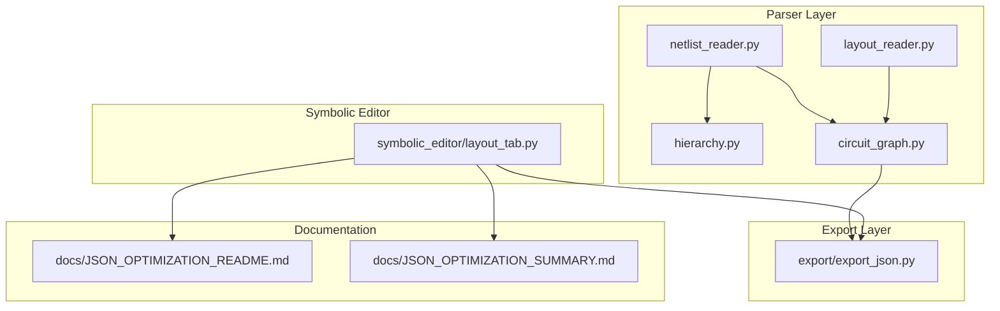
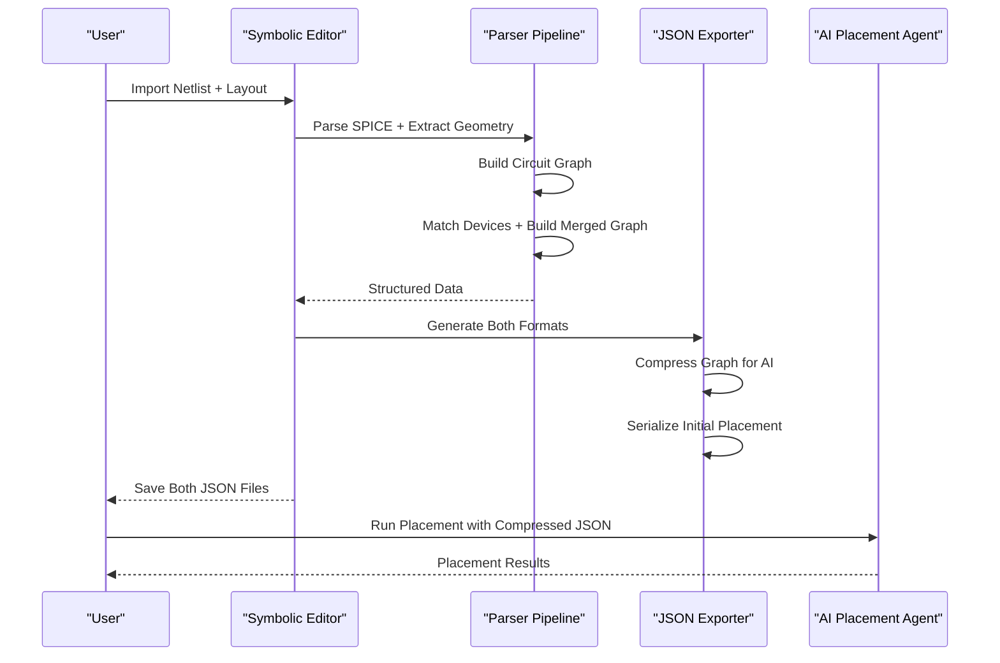
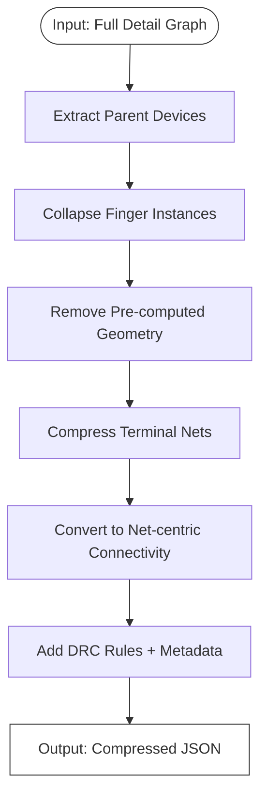
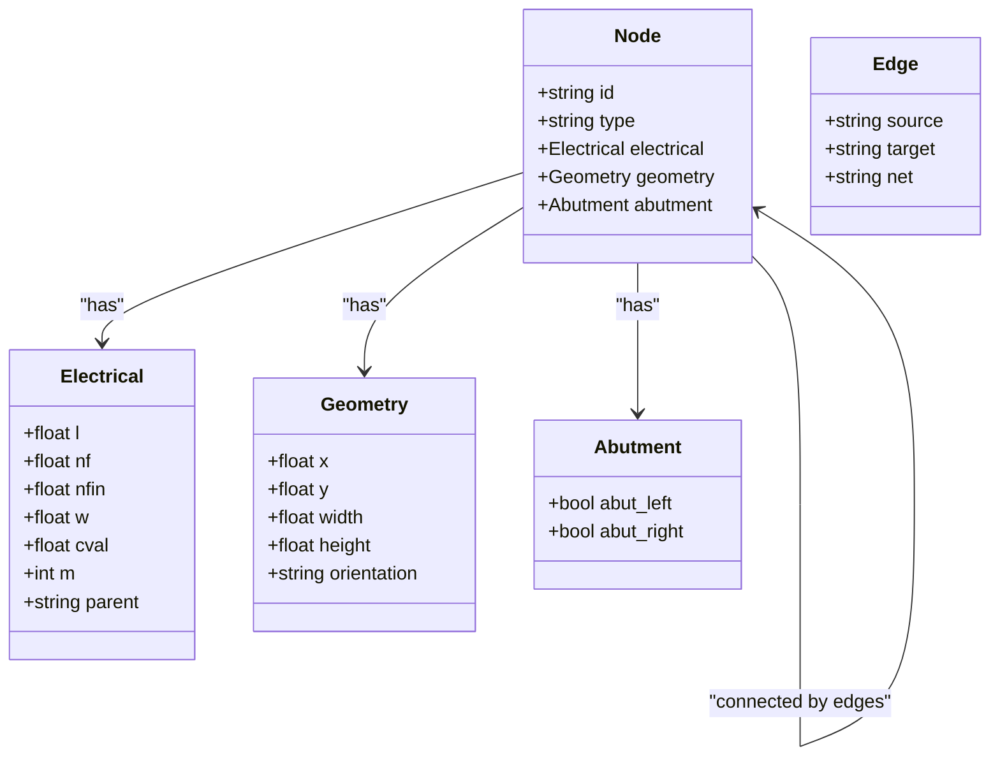
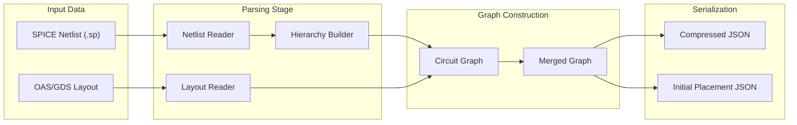
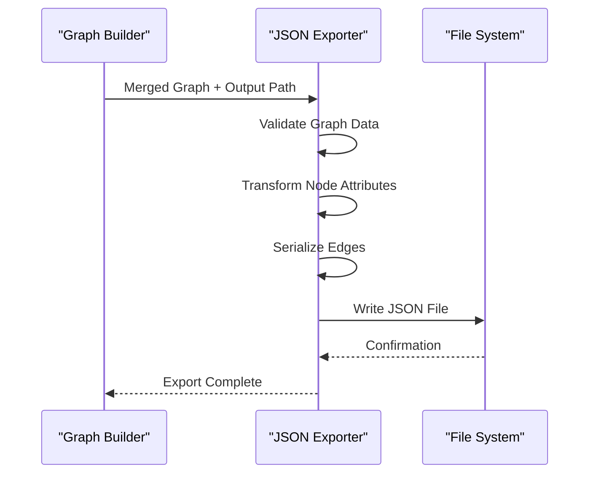
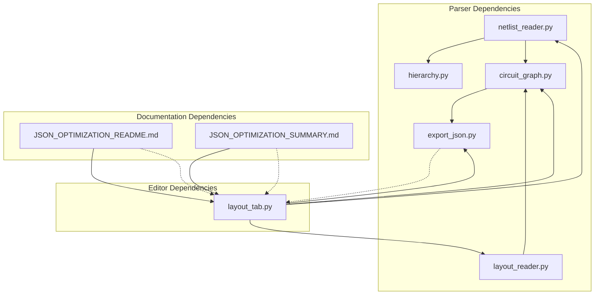

# Dual JSON Format Generation

<cite>
**Referenced Files in This Document**
- [export_json.py](file://export/export_json.py)
- [Miller_OTA_graph_compressed.json](file://examples/Miller_OTA/Miller_OTA_graph_compressed.json)
- [Miller_OTA_initial_placement.json](file://examples/Miller_OTA/Miller_OTA_initial_placement.json)
- [circuit_graph.py](file://parser/circuit_graph.py)
- [layout_reader.py](file://parser/layout_reader.py)
- [netlist_reader.py](file://parser/netlist_reader.py)
- [hierarchy.py](file://parser/hierarchy.py)
- [layout_tab.py](file://symbolic_editor/layout_tab.py)
- [JSON_OPTIMIZATION_README.md](file://docs/JSON_OPTIMIZATION_README.md)
- [JSON_OPTIMIZATION_SUMMARY.md](file://docs/JSON_OPTIMIZATION_SUMMARY.md)
</cite>

## Table of Contents
1. [Introduction](#introduction)
2. [Project Structure](#project-structure)
3. [Core Components](#core-components)
4. [Architecture Overview](#architecture-overview)
5. [Detailed Component Analysis](#detailed-component-analysis)
6. [Dependency Analysis](#dependency-analysis)
7. [Performance Considerations](#performance-considerations)
8. [Troubleshooting Guide](#troubleshooting-guide)
9. [Conclusion](#conclusion)

## Introduction
This document explains the dual JSON format generation system used for analog circuit layout automation. The system produces two complementary JSON formats:
- Graph-compressed JSON: A compact representation optimized for AI analysis and placement optimization prompts
- Initial placement JSON: A detailed representation with device geometry and connectivity for AI-driven placement workflows

The system transforms internal representations (SPICE netlists, layout geometry) into these JSON formats, enabling efficient storage, analysis, and integration with external AI tools.

## Project Structure
The JSON generation system spans several modules:
- Parser: Converts SPICE netlists and layout geometry into structured data
- Export: Generates initial placement JSON from merged graphs
- Symbolic Editor: Creates both graph-compressed and detailed JSON formats
- Documentation: Provides optimization rationale and usage guidelines



**Diagram sources**
- [circuit_graph.py:1-191](file://parser/circuit_graph.py#L1-L191)
- [layout_reader.py:1-442](file://parser/layout_reader.py#L1-L442)
- [netlist_reader.py:1-855](file://parser/netlist_reader.py#L1-L855)
- [hierarchy.py:1-475](file://parser/hierarchy.py#L1-L475)
- [export_json.py:1-58](file://export/export_json.py#L1-L58)
- [layout_tab.py:1100-1299](file://symbolic_editor/layout_tab.py#L1100-L1299)
- [JSON_OPTIMIZATION_README.md:1-173](file://docs/JSON_OPTIMIZATION_README.md#L1-L173)
- [JSON_OPTIMIZATION_SUMMARY.md:1-366](file://docs/JSON_OPTIMIZATION_SUMMARY.md#L1-L366)

**Section sources**
- [circuit_graph.py:1-191](file://parser/circuit_graph.py#L1-L191)
- [layout_reader.py:1-442](file://parser/layout_reader.py#L1-L442)
- [netlist_reader.py:1-855](file://parser/netlist_reader.py#L1-L855)
- [hierarchy.py:1-475](file://parser/hierarchy.py#L1-L475)
- [export_json.py:1-58](file://export/export_json.py#L1-L58)
- [layout_tab.py:1100-1299](file://symbolic_editor/layout_tab.py#L1100-L1299)
- [JSON_OPTIMIZATION_README.md:1-173](file://docs/JSON_OPTIMIZATION_README.md#L1-L173)
- [JSON_OPTIMIZATION_SUMMARY.md:1-366](file://docs/JSON_OPTIMIZATION_SUMMARY.md#L1-L366)

## Core Components
The dual JSON generation system consists of four primary components:

### 1. Graph-Compressed JSON Format
The compressed format optimizes for AI analysis by:
- Collapsing finger/multiplier instances into parent devices
- Removing pre-computed geometry (AI computes placement)
- Compressing terminal nets (one per parent device)
- Using net-centric connectivity instead of verbose edge lists

### 2. Initial Placement JSON Format
The detailed format preserves:
- Complete device instances (including finger expansions)
- Pre-computed geometry for immediate placement
- Abutment information for layout constraints
- Electrical parameters for device matching

### 3. Data Transformation Pipeline
The system transforms internal representations through:
- Netlist parsing and hierarchy reconstruction
- Layout geometry extraction from OAS/GDS files
- Device matching and graph construction
- Format-specific serialization

### 4. Export Functions
Two specialized export functions handle the different formats:
- `graph_to_json()`: Creates initial placement JSON from merged graphs
- Automatic compression: Generates both formats during import

**Section sources**
- [Miller_OTA_graph_compressed.json:1-186](file://examples/Miller_OTA/Miller_OTA_graph_compressed.json#L1-L186)
- [Miller_OTA_initial_placement.json:1-800](file://examples/Miller_OTA/Miller_OTA_initial_placement.json#L1-L800)
- [export_json.py:4-58](file://export/export_json.py#L4-L58)
- [layout_tab.py:1100-1123](file://symbolic_editor/layout_tab.py#L1100-L1123)

## Architecture Overview
The dual JSON generation system follows a layered architecture with clear separation of concerns:



**Diagram sources**
- [layout_tab.py:1229-1299](file://symbolic_editor/layout_tab.py#L1229-L1299)
- [circuit_graph.py:131-191](file://parser/circuit_graph.py#L131-L191)
- [layout_reader.py:357-442](file://parser/layout_reader.py#L357-L442)
- [netlist_reader.py:726-762](file://parser/netlist_reader.py#L726-L762)

## Detailed Component Analysis

### Graph-Compressed JSON Format
The compressed format represents devices at the parent level, eliminating finger instance duplication:



**Diagram sources**
- [JSON_OPTIMIZATION_SUMMARY.md:17-36](file://docs/JSON_OPTIMIZATION_SUMMARY.md#L17-L36)
- [layout_tab.py:1447-1446](file://symbolic_editor/layout_tab.py#L1447-L1446)

#### Key Features
- **Device Types Section**: Defines default dimensions and row heights per device type
- **Devices Section**: Maps parent device names to electrical parameters and terminal nets
- **Connectivity Section**: Groups devices by net, reducing edge list verbosity
- **DRC Rules**: Includes manufacturing constraints for AI placement
- **Blocks Section**: Hierarchical grouping information

**Section sources**
- [Miller_OTA_graph_compressed.json:1-186](file://examples/Miller_OTA/Miller_OTA_graph_compressed.json#L1-L186)
- [JSON_OPTIMIZATION_SUMMARY.md:44-64](file://docs/JSON_OPTIMIZATION_SUMMARY.md#L44-L64)

### Initial Placement JSON Format
The detailed format preserves complete device information for AI placement:



**Diagram sources**
- [Miller_OTA_initial_placement.json:1-800](file://examples/Miller_OTA/Miller_OTA_initial_placement.json#L1-L800)
- [export_json.py:10-51](file://export/export_json.py#L10-L51)

#### Data Structure Details
- **Nodes Array**: Complete device instances with geometry
- **Edges Array**: Explicit connectivity between devices
- **Electrical Properties**: Device parameters for matching and optimization
- **Geometry Properties**: Position and orientation for placement
- **Abutment Information**: Layout constraints for device adjacency

**Section sources**
- [Miller_OTA_initial_placement.json:1-800](file://examples/Miller_OTA/Miller_OTA_initial_placement.json#L1-L800)
- [export_json.py:4-58](file://export/export_json.py#L4-L58)

### Data Transformation Pipeline
The transformation from internal representations to JSON involves several stages:



**Diagram sources**
- [netlist_reader.py:726-762](file://parser/netlist_reader.py#L726-L762)
- [circuit_graph.py:142-191](file://parser/circuit_graph.py#L142-L191)
- [layout_reader.py:357-442](file://parser/layout_reader.py#L357-L442)
- [layout_tab.py:1229-1299](file://symbolic_editor/layout_tab.py#L1229-L1299)

#### Transformation Steps
1. **Netlist Parsing**: Extract devices, parameters, and connectivity
2. **Hierarchy Reconstruction**: Handle arrays, multipliers, and fingers
3. **Layout Extraction**: Parse OAS/GDS files for geometry and abutment info
4. **Device Matching**: Align netlist devices with layout instances
5. **Graph Construction**: Build merged graph with electrical + geometric data
6. **Format Serialization**: Export both compressed and detailed JSON formats

**Section sources**
- [netlist_reader.py:1-855](file://parser/netlist_reader.py#L1-L855)
- [hierarchy.py:1-475](file://parser/hierarchy.py#L1-L475)
- [circuit_graph.py:1-191](file://parser/circuit_graph.py#L1-L191)
- [layout_reader.py:1-442](file://parser/layout_reader.py#L1-L442)
- [layout_tab.py:1229-1299](file://symbolic_editor/layout_tab.py#L1229-L1299)

### Export Function Implementation
The export system provides specialized functions for different use cases:



**Diagram sources**
- [export_json.py:4-58](file://export/export_json.py#L4-L58)

#### Export Process Details
- **Node Serialization**: Converts graph nodes to JSON objects with electrical and geometry data
- **Edge Serialization**: Maps graph edges to connectivity records with net information
- **File Writing**: Uses indented JSON format for human readability
- **Error Handling**: Provides clear feedback on export completion

**Section sources**
- [export_json.py:4-58](file://export/export_json.py#L4-L58)

## Dependency Analysis
The JSON generation system exhibits clear module boundaries and minimal coupling:



**Diagram sources**
- [netlist_reader.py:1-855](file://parser/netlist_reader.py#L1-L855)
- [circuit_graph.py:1-191](file://parser/circuit_graph.py#L1-L191)
- [layout_reader.py:1-442](file://parser/layout_reader.py#L1-L442)
- [export_json.py:1-58](file://export/export_json.py#L1-L58)
- [layout_tab.py:1100-1299](file://symbolic_editor/layout_tab.py#L1100-L1299)
- [JSON_OPTIMIZATION_README.md:1-173](file://docs/JSON_OPTIMIZATION_README.md#L1-L173)
- [JSON_OPTIMIZATION_SUMMARY.md:1-366](file://docs/JSON_OPTIMIZATION_SUMMARY.md#L1-L366)

### Module Interactions
- **Parser Layer**: Independent of export format, focusing on data extraction
- **Export Layer**: Minimal dependencies, focused on serialization
- **Editor Integration**: Orchestrates both formats during import
- **Documentation**: Guides optimization and usage patterns

**Section sources**
- [netlist_reader.py:1-855](file://parser/netlist_reader.py#L1-L855)
- [circuit_graph.py:1-191](file://parser/circuit_graph.py#L1-L191)
- [layout_reader.py:1-442](file://parser/layout_reader.py#L1-L442)
- [export_json.py:1-58](file://export/export_json.py#L1-L58)
- [layout_tab.py:1100-1299](file://symbolic_editor/layout_tab.py#L1100-L1299)
- [JSON_OPTIMIZATION_README.md:1-173](file://docs/JSON_OPTIMIZATION_README.md#L1-L173)
- [JSON_OPTIMIZATION_SUMMARY.md:1-366](file://docs/JSON_OPTIMIZATION_SUMMARY.md#L1-L366)

## Performance Considerations
The dual JSON format system addresses performance challenges through strategic optimizations:

### Compression Benefits
- **Size Reduction**: 85-97% reduction in file size for AI prompts
- **Token Efficiency**: 95% smaller context fits within LLM token limits
- **Processing Speed**: Reduced parsing time for large designs
- **Memory Usage**: Lower memory footprint during AI processing

### Memory Optimization Strategies
- **Lazy Loading**: Only load necessary device instances for specific operations
- **Streaming**: Process large files incrementally where possible
- **Data Structures**: Use efficient Python data structures for large datasets
- **Garbage Collection**: Explicit cleanup of temporary objects

### Scalability Considerations
- **Batch Processing**: Support for processing multiple designs concurrently
- **Incremental Updates**: Only regenerate changed portions of JSON files
- **Caching**: Store computed results to avoid redundant processing
- **Parallel Execution**: Utilize multiple CPU cores for heavy computations

## Troubleshooting Guide

### Common Issues and Solutions

#### Issue: AI Placement Fails with "Device Not Found"
**Symptoms**: AI reports missing devices in compressed JSON
**Solution**: Verify all parent devices are present in compressed output
```bash
python test_compression.py
```

#### Issue: Compressed File Still Too Large
**Symptoms**: Even compressed file exceeds token limits
**Solution**: Reduce finger counts or use design-level collapsing
```spice
* Use m=4 instead of 4 separate instances
MM5 D G S B pmos w=1u l=14n m=4
```

#### Issue: Migration Script Fails
**Symptoms**: JSON validation errors during migration
**Solution**: Validate JSON structure before migration
```bash
python -m json.tool design_graph.json > /dev/null
```

#### Issue: Geometry Leaks into Compressed Output
**Symptoms**: Compressed JSON contains pre-computed geometry
**Solution**: Ensure compression removes geometry fields
- Check that geometry properties are excluded from compressed format
- Verify that only parent devices remain in compressed output

### Validation Procedures
- **Structure Validation**: Verify JSON schema compliance for both formats
- **Content Validation**: Ensure all devices and nets are preserved
- **Size Validation**: Confirm compression achieves expected reduction
- **Integration Validation**: Test AI placement with generated JSON files

**Section sources**
- [JSON_OPTIMIZATION_SUMMARY.md:331-351](file://docs/JSON_OPTIMIZATION_SUMMARY.md#L331-L351)

## Conclusion
The dual JSON format generation system provides a robust foundation for analog circuit layout automation. By maintaining both compressed and detailed formats, the system optimizes for different use cases: AI analysis and placement optimization require the compressed format, while manual inspection and editing benefit from the detailed format. The modular architecture ensures maintainability and extensibility, supporting future enhancements like hierarchical block expansion and binary format options.

The system successfully addresses performance challenges through strategic compression, enabling AI placement on large designs that would otherwise exceed token limits. The clear separation of concerns between parsing, exporting, and editor integration provides a solid foundation for continued development and enhancement.