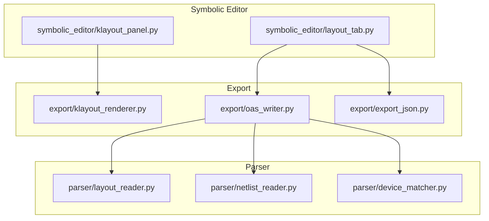
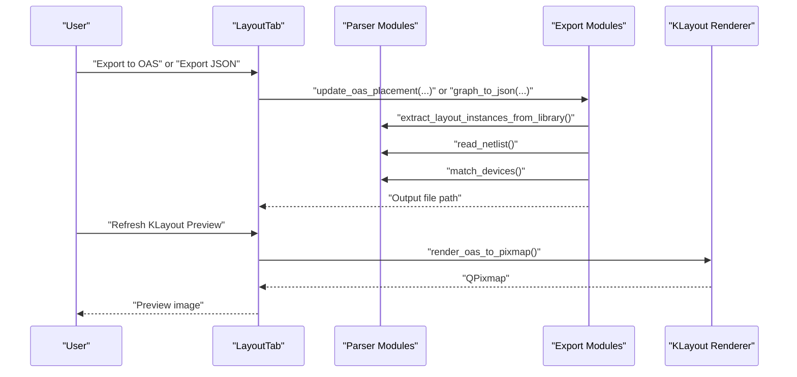
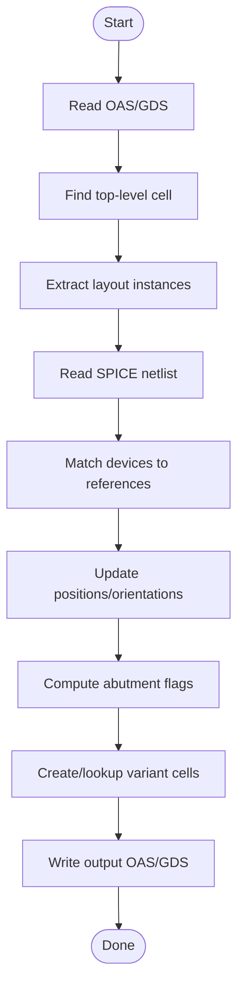
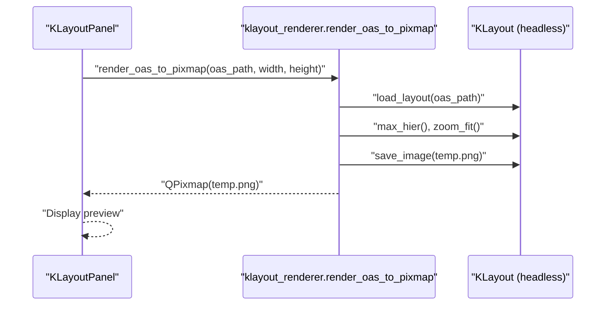
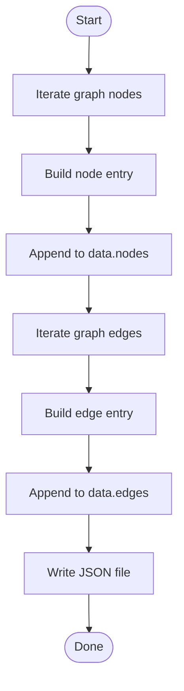
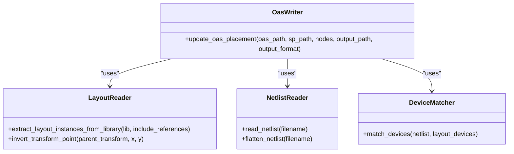
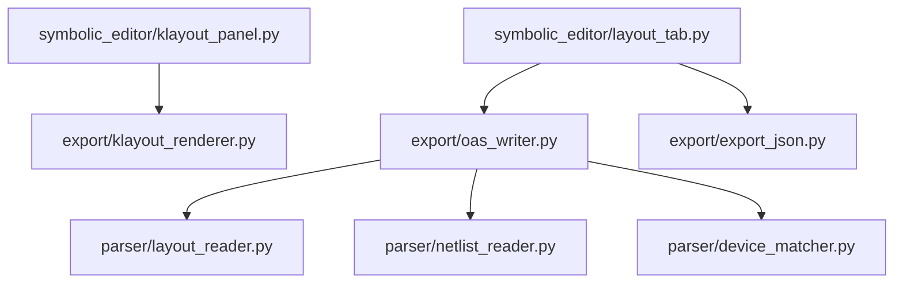

# Export System Capabilities

<cite>
**Referenced Files in This Document**
- [oas_writer.py](file://export/oas_writer.py)
- [klayout_renderer.py](file://export/klayout_renderer.py)
- [export_json.py](file://export/export_json.py)
- [layout_reader.py](file://parser/layout_reader.py)
- [netlist_reader.py](file://parser/netlist_reader.py)
- [device_matcher.py](file://parser/device_matcher.py)
- [klayout_panel.py](file://symbolic_editor/klayout_panel.py)
- [layout_tab.py](file://symbolic_editor/layout_tab.py)
- [README.md](file://README.md)
- [USER_GUIDE.md](file://docs/USER_GUIDE.md)
</cite>

## Table of Contents
1. [Introduction](#introduction)
2. [Project Structure](#project-structure)
3. [Core Components](#core-components)
4. [Architecture Overview](#architecture-overview)
5. [Detailed Component Analysis](#detailed-component-analysis)
6. [Dependency Analysis](#dependency-analysis)
7. [Performance Considerations](#performance-considerations)
8. [Troubleshooting Guide](#troubleshooting-guide)
9. [Conclusion](#conclusion)
10. [Appendices](#appendices)

## Introduction
This document explains the export system capabilities that enable:
- OASIS/GDS file generation with abutment support, variant cell handling, and manufacturing rule compliance
- Real-time KLayout integration for layout preview and interactive visualization
- JSON export functionality for analysis-ready placement data

It documents the implementation of the export modules, how they integrate with the parser and GUI, and provides practical guidance for exporting layouts to EDA tools, configuring export parameters, handling complex device arrangements, and optimizing performance for large exports.

## Project Structure
The export system resides under the export/ directory and integrates with parser/ and symbolic_editor/ modules. The key files are:
- export/oas_writer.py: OASIS/GDS writer with abutment and variant cell logic
- export/klayout_renderer.py: Headless KLayout rendering for previews
- export/export_json.py: JSON exporter for AI placement and analysis
- parser/layout_reader.py: Layout instance extraction and coordinate transforms
- parser/netlist_reader.py: SPICE/CDL netlist flattening and device parsing
- parser/device_matcher.py: Mapping between netlist devices and layout instances
- symbolic_editor/klayout_panel.py: KLayout preview panel in the GUI
- symbolic_editor/layout_tab.py: Export actions triggered from the GUI

**Diagram sources**
- [oas_writer.py:1-520](file://export/oas_writer.py#L1-L520)
- [klayout_renderer.py:1-74](file://export/klayout_renderer.py#L1-L74)
- [export_json.py:1-58](file://export/export_json.py#L1-L58)
- [layout_reader.py:1-442](file://parser/layout_reader.py#L1-L442)
- [netlist_reader.py:1-855](file://parser/netlist_reader.py#L1-L855)
- [device_matcher.py:1-151](file://parser/device_matcher.py#L1-L151)
- [klayout_panel.py:1-273](file://symbolic_editor/klayout_panel.py#L1-L273)
- [layout_tab.py:1603-1657](file://symbolic_editor/layout_tab.py#L1603-L1657)

**Section sources**
- [README.md:169-172](file://README.md#L169-L172)
- [USER_GUIDE.md:182-195](file://docs/USER_GUIDE.md#L182-L195)

## Core Components
- OASIS/GDS writer (export/oas_writer.py)
  - Reads original OAS/GDS, builds a catalog of variant cells, applies placement and orientation updates, and writes output OAS/GDS with abutment support and manufacturing rule compliance
- KLayout renderer (export/klayout_renderer.py)
  - Renders OAS/GDS to PNG or QPixmap for real-time preview in the GUI
- JSON exporter (export/export_json.py)
  - Converts merged NetworkX graph to JSON for AI placement agents and analysis

**Section sources**
- [oas_writer.py:1-520](file://export/oas_writer.py#L1-L520)
- [klayout_renderer.py:1-74](file://export/klayout_renderer.py#L1-L74)
- [export_json.py:1-58](file://export/export_json.py#L1-L58)

## Architecture Overview
The export system orchestrates data from the parser pipeline into EDA-compatible outputs. The GUI triggers export actions that call into the export modules, which rely on parser utilities for device matching and geometry.

**Diagram sources**
- [layout_tab.py:1621-1657](file://symbolic_editor/layout_tab.py#L1621-L1657)
- [oas_writer.py:269-520](file://export/oas_writer.py#L269-L520)
- [export_json.py:4-58](file://export/export_json.py#L4-L58)
- [layout_reader.py:232-241](file://parser/layout_reader.py#L232-L241)
- [netlist_reader.py:726-761](file://parser/netlist_reader.py#L726-L761)
- [device_matcher.py:85-150](file://parser/device_matcher.py#L85-L150)
- [klayout_renderer.py:16-74](file://export/klayout_renderer.py#L16-L74)

## Detailed Component Analysis

### OASIS/GDS Writer (export/oas_writer.py)
The OASIS writer reads an existing OAS/GDS layout, matches netlist devices to layout instances, updates positions/orientations, creates abutment variants, and writes the output OAS/GDS. It supports:
- SAED14nm abutment encoding via PCell properties and geometric clipping
- Variant cell catalog keyed by base device type and parameter hash
- Orientation and mirroring transformations mapped to GDSTK
- Hierarchical and flat layout support
- Output format selection (OAS or GDS)

Key implementation highlights:
- Orientation mapping to GDSTK rotation and mirror flags
- PCell property decoding and parameter parsing
- Parameter hashing to group variants by non-abutment parameters
- Geometric clipping engine for abutment rules
- Catalog-based reuse of variant cells
- Fresh library rebuild to avoid linkage issues

**Diagram sources**
- [oas_writer.py:269-520](file://export/oas_writer.py#L269-L520)

**Section sources**
- [oas_writer.py:1-520](file://export/oas_writer.py#L1-L520)

### KLayout Integration (export/klayout_renderer.py and symbolic_editor/klayout_panel.py)
KLayout integration provides:
- Headless rendering of OAS/GDS to PNG or QPixmap
- Real-time preview in the GUI’s KLayout panel
- Launching KLayout externally for inspection

**Diagram sources**
- [klayout_renderer.py:16-74](file://export/klayout_renderer.py#L16-L74)
- [klayout_panel.py:171-226](file://symbolic_editor/klayout_panel.py#L171-L226)

**Section sources**
- [klayout_renderer.py:1-74](file://export/klayout_renderer.py#L1-L74)
- [klayout_panel.py:1-273](file://symbolic_editor/klayout_panel.py#L1-L273)

### JSON Export (export/export_json.py)
The JSON exporter converts a merged NetworkX graph into a JSON structure suitable for AI placement agents and analysis. It exports:
- Nodes with device identifiers, types, electrical parameters, and geometry
- Edges with source/target and net information
- Writes a human-readable JSON file

**Diagram sources**
- [export_json.py:4-58](file://export/export_json.py#L4-L58)

**Section sources**
- [export_json.py:1-58](file://export/export_json.py#L1-L58)

### Parser Integration
The export modules depend on parser utilities for:
- Layout instance extraction and coordinate transforms
- SPICE netlist flattening and device parsing
- Device matching between netlist and layout

**Diagram sources**
- [layout_reader.py:232-241](file://parser/layout_reader.py#L232-L241)
- [netlist_reader.py:726-761](file://parser/netlist_reader.py#L726-L761)
- [device_matcher.py:85-150](file://parser/device_matcher.py#L85-L150)
- [oas_writer.py:269-520](file://export/oas_writer.py#L269-L520)

**Section sources**
- [layout_reader.py:1-442](file://parser/layout_reader.py#L1-L442)
- [netlist_reader.py:1-855](file://parser/netlist_reader.py#L1-L855)
- [device_matcher.py:1-151](file://parser/device_matcher.py#L1-L151)

## Dependency Analysis
The export system has clear module boundaries:
- export/oas_writer.py depends on parser modules for layout and netlist processing
- export/klayout_renderer.py depends on KLayout Python bindings and PySide6 for QPixmap
- export/export_json.py is standalone and depends only on the graph structure
- symbolic_editor modules trigger export actions and render previews

**Diagram sources**
- [oas_writer.py:40-45](file://export/oas_writer.py#L40-L45)
- [klayout_renderer.py:12-13](file://export/klayout_renderer.py#L12-L13)
- [klayout_panel.py:190-197](file://symbolic_editor/klayout_panel.py#L190-L197)
- [layout_tab.py:1648-1657](file://symbolic_editor/layout_tab.py#L1648-L1657)

**Section sources**
- [oas_writer.py:1-520](file://export/oas_writer.py#L1-L520)
- [klayout_renderer.py:1-74](file://export/klayout_renderer.py#L1-L74)
- [klayout_panel.py:1-273](file://symbolic_editor/klayout_panel.py#L1-L273)
- [layout_tab.py:1603-1657](file://symbolic_editor/layout_tab.py#L1603-L1657)

## Performance Considerations
- OASIS/GDS writer
  - Catalog-based variant reuse reduces repeated geometry processing
  - Fresh library rebuild avoids reference linkage issues and ensures clean output
  - Geometric clipping is performed per-layer and per-shape to enforce abutment rules efficiently
- KLayout renderer
  - Uses headless rendering with zoom-fit to minimize memory overhead
  - Temporary file cleanup prevents disk accumulation
- JSON export
  - Single-pass iteration over nodes and edges for minimal overhead
  - Human-readable indentation improves readability without impacting AI consumption significantly

[No sources needed since this section provides general guidance]

## Troubleshooting Guide
Common issues and resolutions:
- Missing OAS/GDS file
  - Ensure the OAS/GDS path exists and is readable
- Missing SPICE netlist
  - Ensure the .sp file path exists and is readable
- No top-level cells in layout
  - Verify the layout file contains top-level cells
- KLayout preview fails
  - Confirm KLayout is installed and accessible; the panel attempts to auto-detect the executable
- Abutment not applied
  - Verify device abutment states are set in the GUI and passed to the writer
- Output format mismatch
  - The writer selects output format by extension; ensure the output path ends with .oas or .gds

**Section sources**
- [oas_writer.py:272-284](file://export/oas_writer.py#L272-L284)
- [klayout_panel.py:228-272](file://symbolic_editor/klayout_panel.py#L228-L272)

## Conclusion
The export system provides robust capabilities for generating OASIS/GDS files with abutment support, real-time KLayout previews, and analysis-ready JSON exports. By leveraging parser utilities for device matching and geometry, and integrating cleanly with the GUI, it enables efficient workflows for exporting layouts to EDA tools and AI agents.

[No sources needed since this section summarizes without analyzing specific files]

## Appendices

### Practical Examples
- Exporting layouts for EDA tools
  - Use the GUI menu “File > Export to OAS” to export the current layout to OAS or GDS
  - Use “File > Export JSON” to export placement data for AI agents
- Configuring export parameters
  - OAS writer accepts placement nodes, abutment states, and output format
  - KLayout preview adjusts to the panel size for optimal viewing
- Handling complex device arrangements
  - Hierarchical layouts are supported; the writer recurses to find leaf devices
  - Multi-finger and array devices are matched using the device matcher logic

**Section sources**
- [layout_tab.py:1621-1657](file://symbolic_editor/layout_tab.py#L1621-L1657)
- [USER_GUIDE.md:182-195](file://docs/USER_GUIDE.md#L182-L195)

### File Format Compatibility
- OASIS/GDS
  - Input: OAS or GDS
  - Output: OAS or GDS
- JSON
  - Input: Merged NetworkX graph
  - Output: JSON with nodes and edges

**Section sources**
- [oas_writer.py:277-280](file://export/oas_writer.py#L277-L280)
- [export_json.py:4-58](file://export/export_json.py#L4-L58)