# Import Pipeline Integration

<cite>
**Referenced Files in This Document**
- [netlist_reader.py](file://parser/netlist_reader.py)
- [layout_reader.py](file://parser/layout_reader.py)
- [device_matcher.py](file://parser/device_matcher.py)
- [hierarchy.py](file://parser/hierarchy.py)
- [circuit_graph.py](file://parser/circuit_graph.py)
- [export_json.py](file://export/export_json.py)
- [oas_writer.py](file://export/oas_writer.py)
- [klayout_renderer.py](file://export/klayout_renderer.py)
- [run_parser_example.py](file://parser/run_parser_example.py)
- [main.py](file://symbolic_editor/main.py)
- [extract_net.tcl](file://eda/extract_net.tcl)
- [extract_oasis.tcl](file://eda/extract_oasis.tcl)
- [run.tcl](file://eda/run.tcl)
- [Layout_RTL.json](file://examples/Layout_RTL.json)
- [Miller_OTA_graph_compressed.json](file://examples/Miller_OTA/Miller_OTA_graph_compressed.json)
</cite>

## Table of Contents
1. [Introduction](#introduction)
2. [Project Structure](#project-structure)
3. [Core Components](#core-components)
4. [Architecture Overview](#architecture-overview)
5. [Detailed Component Analysis](#detailed-component-analysis)
6. [Dependency Analysis](#dependency-analysis)
7. [Performance Considerations](#performance-considerations)
8. [Troubleshooting Guide](#troubleshooting-guide)
9. [Conclusion](#conclusion)
10. [Appendices](#appendices)

## Introduction
This document describes the Import Pipeline Integration system that transforms SPICE netlists and OASIS/GDS layouts into a unified representation suitable for automated analog layout workflows. It covers:
- Netlist import from SPICE/CDL with hierarchical flattening and parameter parsing
- Layout import from OASIS/GDS with hierarchical traversal and PCell property extraction
- Automatic device-to-layout matching using deterministic rules
- Dual JSON format generation for downstream AI placement and export
- Hierarchical netlist support and validation
- Export system supporting OASIS/GDS generation, KLayout integration, and JSON exports
- Practical workflows, compatibility notes, troubleshooting, performance, and error handling

## Project Structure
The pipeline spans parser modules for netlist and layout ingestion, a device matcher, graph construction, and export utilities. The symbolic editor integrates these capabilities into a GUI workflow.

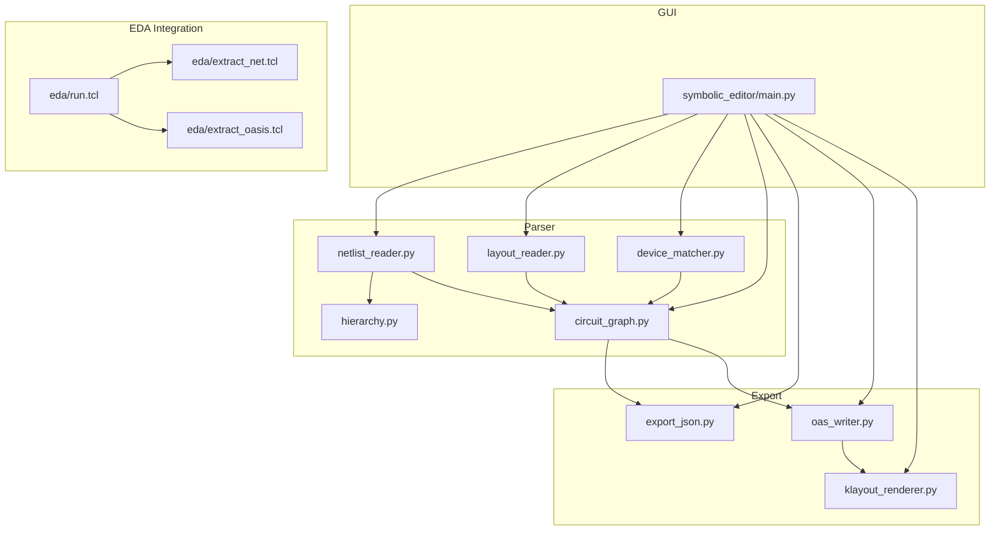

**Diagram sources**
- [netlist_reader.py:1-855](file://parser/netlist_reader.py#L1-L855)
- [layout_reader.py:1-442](file://parser/layout_reader.py#L1-L442)
- [device_matcher.py:1-151](file://parser/device_matcher.py#L1-L151)
- [hierarchy.py:1-475](file://parser/hierarchy.py#L1-L475)
- [circuit_graph.py:1-191](file://parser/circuit_graph.py#L1-L191)
- [export_json.py:1-58](file://export/export_json.py#L1-L58)
- [oas_writer.py:1-520](file://export/oas_writer.py#L1-L520)
- [klayout_renderer.py:1-74](file://export/klayout_renderer.py#L1-L74)
- [main.py:1-801](file://symbolic_editor/main.py#L1-L801)
- [run.tcl:1-200](file://eda/run.tcl#L1-L200)
- [extract_net.tcl:1-15](file://eda/extract_net.tcl#L1-L15)
- [extract_oasis.tcl:1-31](file://eda/extract_oasis.tcl#L1-L31)

**Section sources**
- [main.py:1-801](file://symbolic_editor/main.py#L1-L801)
- [run_parser_example.py:1-62](file://parser/run_parser_example.py#L1-L62)

## Core Components
- Netlist reader: parses SPICE/CDL, flattens hierarchy, builds connectivity, and constructs Device/Netlist objects.
- Layout reader: extracts device instances from OAS/GDS, supports flat and hierarchical layouts, and decodes PCell parameters.
- Device matcher: deterministically maps netlist devices to layout instances by type and spatial ordering.
- Hierarchy builder: reconstructs multi-finger/multiplier/array expansions and resolves array-indexed nets.
- Circuit graph: merges electrical connectivity with geometry to produce a NetworkX graph for downstream use.
- Exporters: JSON exporter for AI placement, OAS writer for placement updates and abutment variants, and KLayout renderer for previews.

**Section sources**
- [netlist_reader.py:1-855](file://parser/netlist_reader.py#L1-L855)
- [layout_reader.py:1-442](file://parser/layout_reader.py#L1-L442)
- [device_matcher.py:1-151](file://parser/device_matcher.py#L1-L151)
- [hierarchy.py:1-475](file://parser/hierarchy.py#L1-L475)
- [circuit_graph.py:1-191](file://parser/circuit_graph.py#L1-L191)
- [export_json.py:1-58](file://export/export_json.py#L1-L58)
- [oas_writer.py:1-520](file://export/oas_writer.py#L1-L520)
- [klayout_renderer.py:1-74](file://export/klayout_renderer.py#L1-L74)

## Architecture Overview
The pipeline is a staged process orchestrated by the symbolic editor. It ingests SPICE and layout files, aligns devices, constructs a merged graph, and produces outputs for AI placement and layout editing.

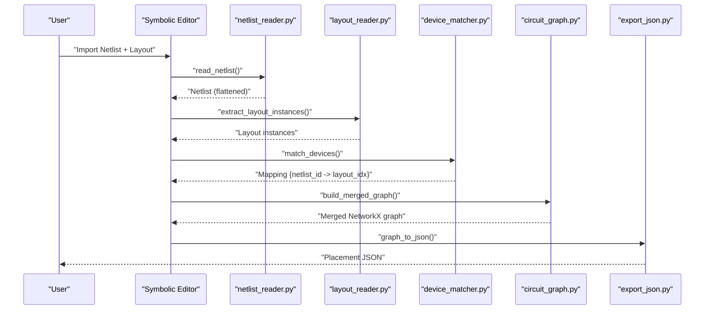

**Diagram sources**
- [main.py:1-801](file://symbolic_editor/main.py#L1-L801)
- [netlist_reader.py:726-761](file://parser/netlist_reader.py#L726-L761)
- [layout_reader.py:357-442](file://parser/layout_reader.py#L357-L442)
- [device_matcher.py:85-151](file://parser/device_matcher.py#L85-L151)
- [circuit_graph.py:142-191](file://parser/circuit_graph.py#L142-L191)
- [export_json.py:4-58](file://export/export_json.py#L4-L58)

## Detailed Component Analysis

### Netlist Import and Hierarchical Flattening
- Parses SPICE/CDL lines into Device objects, handling MOS, capacitors, and resistors.
- Supports array suffixes (<N>), multipliers (m=...), and fingers (nf=...) with deterministic naming.
- Flattens hierarchical subcircuits (.SUBCKT/.ENDS) to leaf-device statements with hierarchical prefixes.
- Builds connectivity mapping from nets to devices and pins.

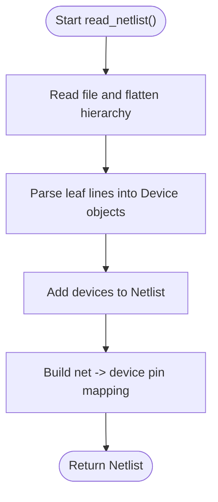

**Diagram sources**
- [netlist_reader.py:726-761](file://parser/netlist_reader.py#L726-L761)
- [netlist_reader.py:260-318](file://parser/netlist_reader.py#L260-L318)

**Section sources**
- [netlist_reader.py:13-101](file://parser/netlist_reader.py#L13-L101)
- [netlist_reader.py:114-318](file://parser/netlist_reader.py#L114-L318)
- [netlist_reader.py:478-720](file://parser/netlist_reader.py#L478-L720)
- [netlist_reader.py:726-798](file://parser/netlist_reader.py#L726-L798)

### Layout Import from OASIS/GDS
- Reads OAS/GDS via gdstk, supports both flat and hierarchical layouts.
- Traverses references recursively, extracting absolute positions, orientation, width, height, and PCell parameters.
- Filters known device types (transistors, resistors, capacitors) and ignores vias/utilities.
- Supports retrieving references for precise transform inversion and abutment updates.

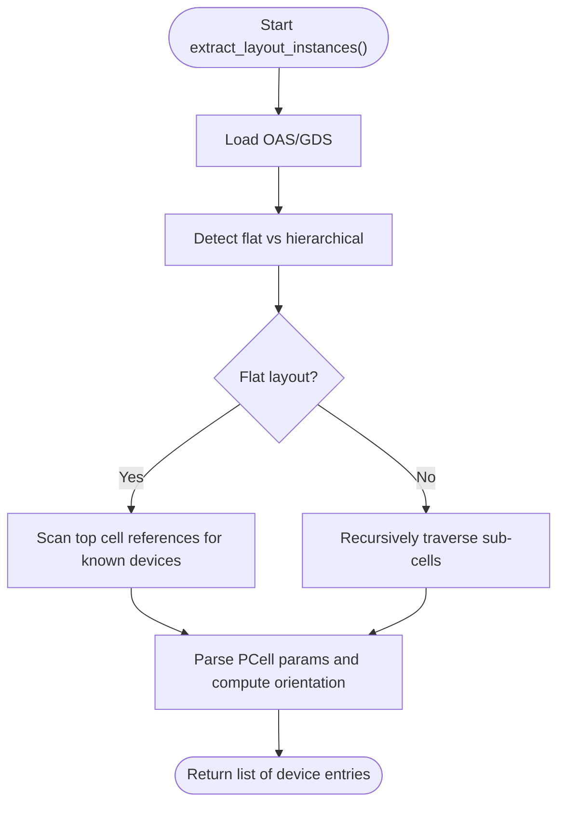

**Diagram sources**
- [layout_reader.py:357-442](file://parser/layout_reader.py#L357-L442)
- [layout_reader.py:153-229](file://parser/layout_reader.py#L153-L229)
- [layout_reader.py:244-354](file://parser/layout_reader.py#L244-L354)

**Section sources**
- [layout_reader.py:1-442](file://parser/layout_reader.py#L1-L442)

### Automatic Device-to-Layout Matching
- Splits netlist and layout by device type (nmos, pmos, res, cap).
- Sorts layout instances spatially and netlist devices by name/logical parents.
- Matches by exact counts, collapses expanded multi-finger devices onto shared layout instances, and falls back with warnings.

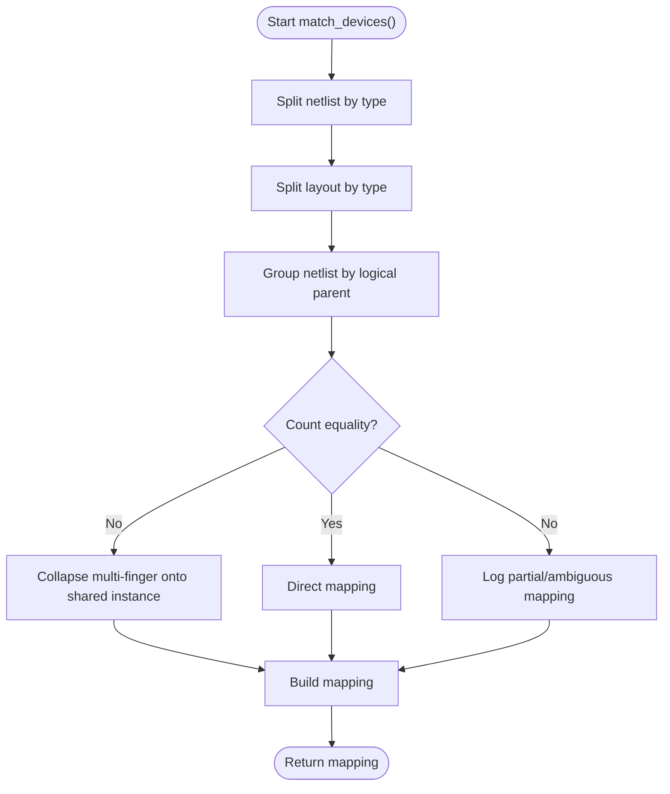

**Diagram sources**
- [device_matcher.py:85-151](file://parser/device_matcher.py#L85-L151)

**Section sources**
- [device_matcher.py:25-83](file://parser/device_matcher.py#L25-L83)
- [device_matcher.py:85-151](file://parser/device_matcher.py#L85-L151)

### Hierarchical Netlist Support and Expansion
- Parses array suffixes, multipliers, and fingers, generating deterministic naming conventions.
- Reconstructs hierarchy trees and expands into leaf devices with resolved parameters.
- Resolves array-indexed nets to leaf-specific net names for accurate connectivity.

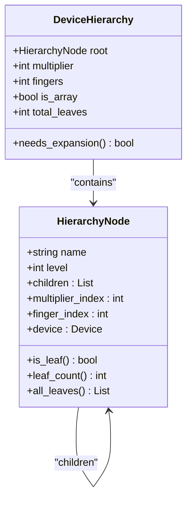

**Diagram sources**
- [hierarchy.py:133-177](file://parser/hierarchy.py#L133-L177)
- [hierarchy.py:183-213](file://parser/hierarchy.py#L183-L213)

**Section sources**
- [hierarchy.py:41-93](file://parser/hierarchy.py#L41-L93)
- [hierarchy.py:219-310](file://parser/hierarchy.py#L219-L310)
- [hierarchy.py:316-418](file://parser/hierarchy.py#L316-L418)
- [hierarchy.py:434-475](file://parser/hierarchy.py#L434-L475)

### Merged Circuit Graph Construction
- Builds a NetworkX graph with device nodes enriched with electrical and geometric attributes.
- Adds edges based on net classification (shared gate, shared source, etc.), excluding global supplies.
- Merges netlist connectivity with layout geometry for downstream AI placement.

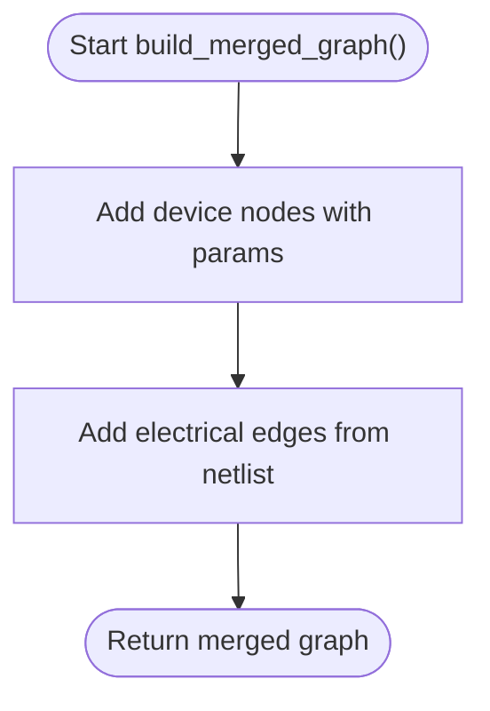

**Diagram sources**
- [circuit_graph.py:142-191](file://parser/circuit_graph.py#L142-L191)

**Section sources**
- [circuit_graph.py:1-191](file://parser/circuit_graph.py#L1-L191)

### Dual JSON Format Generation
- Placement JSON: exported for AI placement agents with nodes and edges.
- Compressed graph JSON: includes device types, terminal nets, connectivity, and DRC parameters.

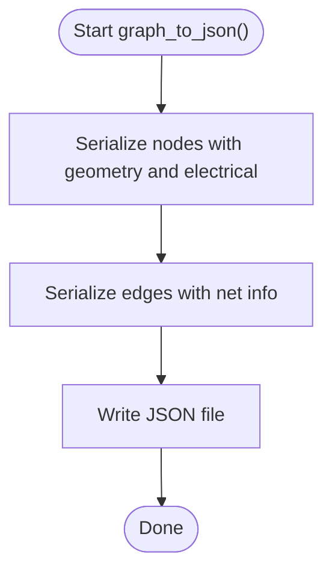

**Diagram sources**
- [export_json.py:4-58](file://export/export_json.py#L4-L58)

**Section sources**
- [export_json.py:1-58](file://export/export_json.py#L1-L58)
- [Miller_OTA_graph_compressed.json:1-186](file://examples/Miller_OTA/Miller_OTA_graph_compressed.json#L1-L186)
- [Layout_RTL.json:1-152](file://examples/Layout_RTL.json#L1-L152)

### Export System: OASIS/GDS Update and KLayout Integration
- OAS writer updates placements and orientations, manages abutment variants, and writes new OAS/GDS.
- KLayout renderer generates PNG previews for the symbolic editor.

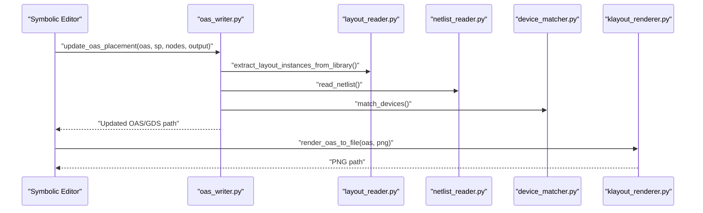

**Diagram sources**
- [oas_writer.py:269-520](file://export/oas_writer.py#L269-L520)
- [klayout_renderer.py:16-74](file://export/klayout_renderer.py#L16-L74)

**Section sources**
- [oas_writer.py:1-520](file://export/oas_writer.py#L1-L520)
- [klayout_renderer.py:1-74](file://export/klayout_renderer.py#L1-L74)

### EDA Integration and Workflows
- EDA TCL scripts automate extraction of SPICE netlists and OASIS layouts from Virtuoso.
- The run.tcl orchestrator routes commands to extraction scripts and validates inputs.

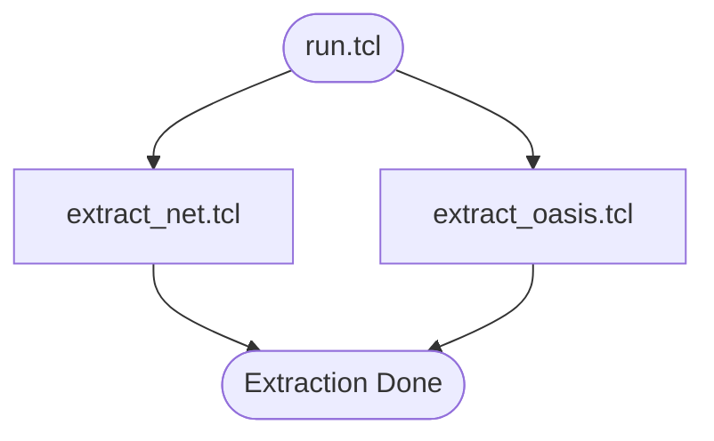

**Diagram sources**
- [run.tcl:14-86](file://eda/run.tcl#L14-L86)
- [extract_net.tcl:1-15](file://eda/extract_net.tcl#L1-L15)
- [extract_oasis.tcl:1-31](file://eda/extract_oasis.tcl#L1-L31)

**Section sources**
- [run.tcl:1-200](file://eda/run.tcl#L1-L200)
- [extract_net.tcl:1-15](file://eda/extract_net.tcl#L1-L15)
- [extract_oasis.tcl:1-31](file://eda/extract_oasis.tcl#L1-L31)

## Dependency Analysis
The pipeline exhibits clear layering: parser modules depend on each other for hierarchy and graph building; exporters depend on the merged graph; GUI integrates all stages.

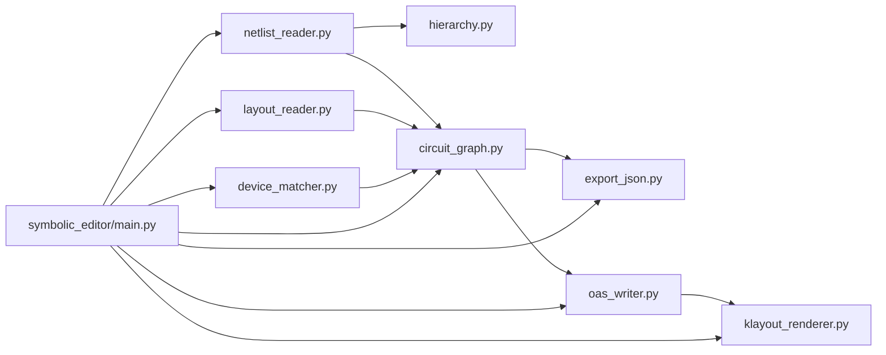

**Diagram sources**
- [netlist_reader.py:1-855](file://parser/netlist_reader.py#L1-L855)
- [layout_reader.py:1-442](file://parser/layout_reader.py#L1-L442)
- [device_matcher.py:1-151](file://parser/device_matcher.py#L1-L151)
- [hierarchy.py:1-475](file://parser/hierarchy.py#L1-L475)
- [circuit_graph.py:1-191](file://parser/circuit_graph.py#L1-L191)
- [export_json.py:1-58](file://export/export_json.py#L1-L58)
- [oas_writer.py:1-520](file://export/oas_writer.py#L1-L520)
- [klayout_renderer.py:1-74](file://export/klayout_renderer.py#L1-L74)
- [main.py:1-801](file://symbolic_editor/main.py#L1-L801)

**Section sources**
- [run_parser_example.py:1-62](file://parser/run_parser_example.py#L1-L62)

## Performance Considerations
- Memory optimization
  - Prefer streaming reads for large netlists and incremental graph construction.
  - Avoid duplicating geometry; reuse references when possible during OAS updates.
- Large design strategies
  - Use spatial sorting and hashing for device matching to reduce comparisons.
  - Limit connectivity classification to non-global nets to minimize edge creation.
- Transform computations
  - Cache transformed coordinates and reuse inverse transforms sparingly.
- Export throughput
  - Batch JSON serialization and write once per output file.

[No sources needed since this section provides general guidance]

## Troubleshooting Guide
- Netlist import issues
  - Unknown subcircuit during flattening: verify .SUBCKT definitions and filenames; ensure top-level subcircuit identification logic finds a match.
  - Non-integer m/nf values: hierarchy module clamps invalid values; check netlist parameter syntax.
- Layout import issues
  - Unsupported layout format: ensure .oas or .gds extension; confirm gdstk availability.
  - Missing top-level cells: verify layout file integrity and top cell presence.
- Matching mismatches
  - Count mismatch warnings: collapse multi-finger expansions onto shared instances; adjust expectations for partial matches.
  - Orientation/transform errors: validate parent transforms and invertibility; ensure mirrored flags are handled consistently.
- Export issues
  - OAS writer failures: confirm input files exist, top cell is present, and abutment variant creation succeeds.
  - KLayout rendering errors: ensure KLayout Python bindings are installed and layout paths are valid.

**Section sources**
- [netlist_reader.py:163-167](file://parser/netlist_reader.py#L163-L167)
- [hierarchy.py:116-126](file://parser/hierarchy.py#L116-L126)
- [layout_reader.py:363-369](file://parser/layout_reader.py#L363-L369)
- [layout_reader.py:123-135](file://parser/layout_reader.py#L123-L135)
- [device_matcher.py:117-141](file://parser/device_matcher.py#L117-L141)
- [oas_writer.py:272-285](file://export/oas_writer.py#L272-L285)
- [klayout_renderer.py:28-36](file://export/klayout_renderer.py#L28-L36)

## Conclusion
The Import Pipeline Integration system provides a robust, deterministic workflow for transforming SPICE netlists and OASIS/GDS layouts into a merged representation suitable for AI-driven placement and layout editing. Its modular design enables hierarchical support, accurate device matching, and flexible export formats, while the GUI and EDA integration streamline end-to-end automation.

[No sources needed since this section summarizes without analyzing specific files]

## Appendices

### Practical Import/Export Workflows
- Import workflow
  - Use the symbolic editor’s “Import Netlist + Layout” to load SPICE and OAS files.
  - The pipeline flattens the netlist, extracts layout instances, matches devices, and builds a merged graph.
  - Export placement JSON for AI placement agents.
- Export workflow
  - After placement, update OAS/GDS with new positions and abutments via the OAS writer.
  - Render previews with KLayout and embed them in the editor.

**Section sources**
- [main.py:190-197](file://symbolic_editor/main.py#L190-L197)
- [run_parser_example.py:13-62](file://parser/run_parser_example.py#L13-L62)
- [oas_writer.py:269-520](file://export/oas_writer.py#L269-L520)
- [klayout_renderer.py:16-74](file://export/klayout_renderer.py#L16-L74)

### File Format Compatibility
- Netlist formats: SPICE/CDL with .SUBCKT/.ENDS, array suffixes, m/nf parameters.
- Layout formats: OASIS (.oas) and GDS (.gds) via gdstk.
- JSON formats: Placement JSON and compressed graph JSON for AI agents.

**Section sources**
- [netlist_reader.py:111-112](file://parser/netlist_reader.py#L111-L112)
- [layout_reader.py:363-369](file://parser/layout_reader.py#L363-L369)
- [export_json.py:1-58](file://export/export_json.py#L1-L58)
- [Miller_OTA_graph_compressed.json:1-186](file://examples/Miller_OTA/Miller_OTA_graph_compressed.json#L1-L186)
- [Layout_RTL.json:1-152](file://examples/Layout_RTL.json#L1-L152)