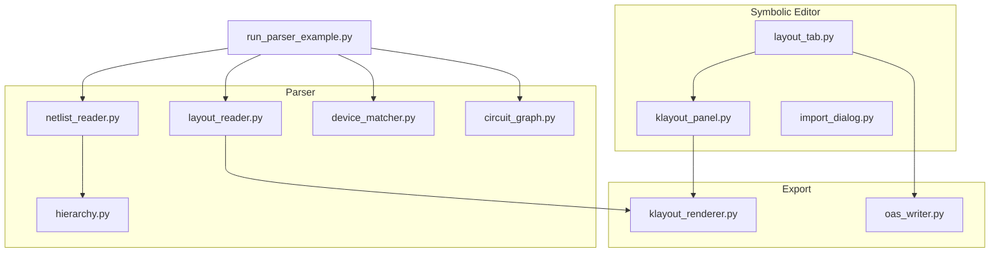
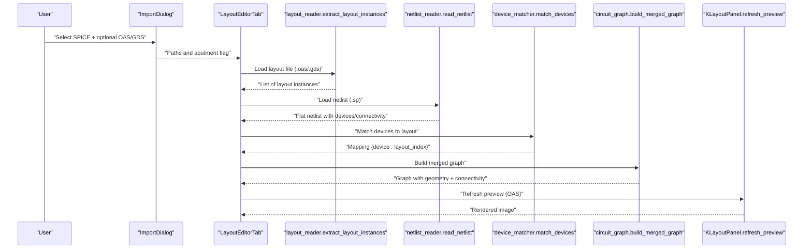
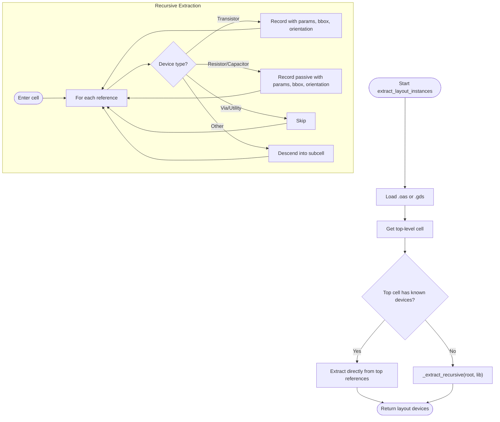
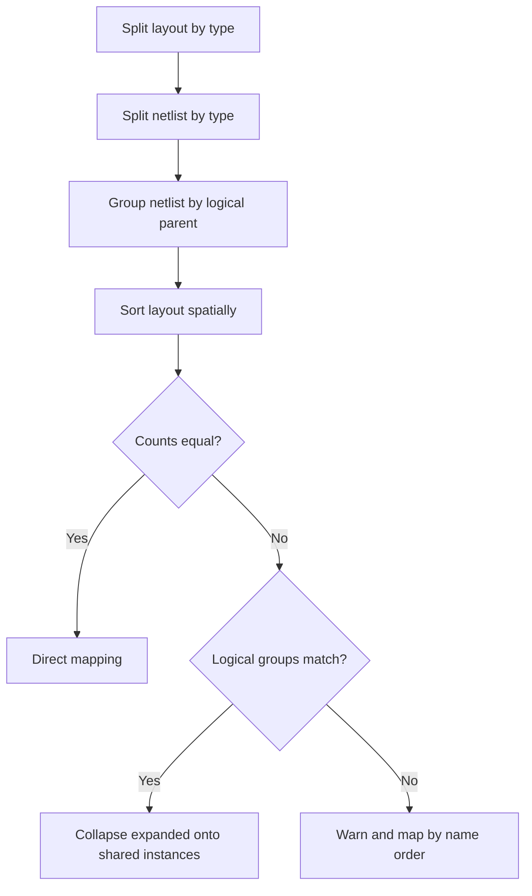
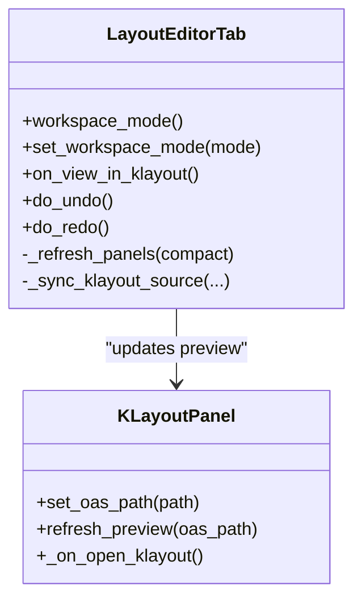
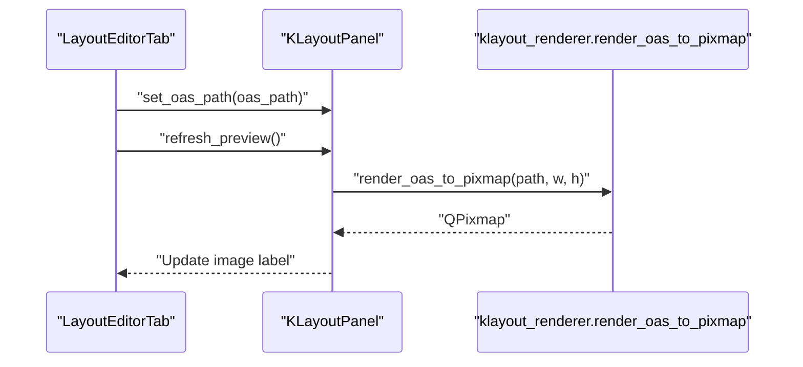
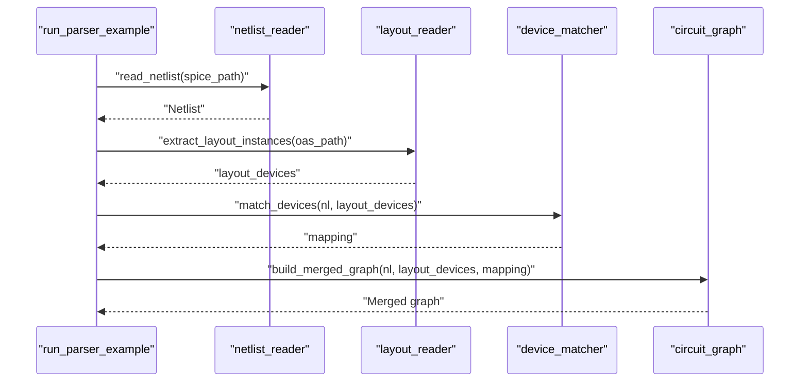
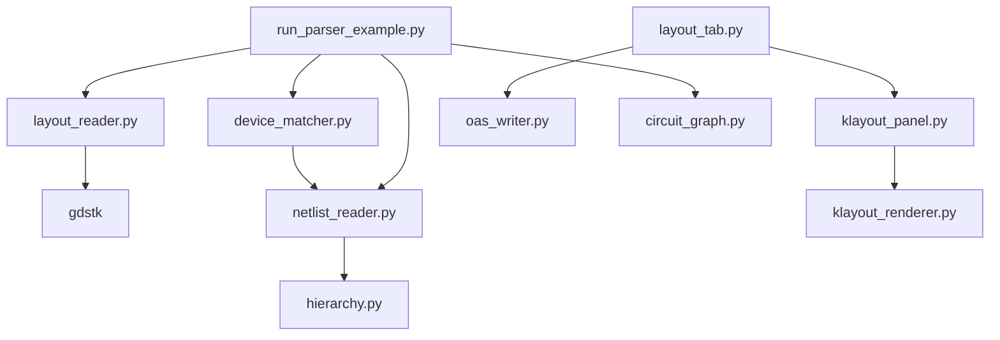

# Layout Import and Parsing

<cite>
**Referenced Files in This Document**
- [layout_reader.py](file://parser/layout_reader.py)
- [device_matcher.py](file://parser/device_matcher.py)
- [layout_tab.py](file://symbolic_editor/layout_tab.py)
- [klayout_panel.py](file://symbolic_editor/klayout_panel.py)
- [klayout_renderer.py](file://export/klayout_renderer.py)
- [run_parser_example.py](file://parser/run_parser_example.py)
- [netlist_reader.py](file://parser/netlist_reader.py)
- [circuit_graph.py](file://parser/circuit_graph.py)
- [hierarchy.py](file://parser/hierarchy.py)
- [import_dialog.py](file://symbolic_editor/dialogs/import_dialog.py)
- [oas_writer.py](file://export/oas_writer.py)
</cite>

## Table of Contents
1. [Introduction](#introduction)
2. [Project Structure](#project-structure)
3. [Core Components](#core-components)
4. [Architecture Overview](#architecture-overview)
5. [Detailed Component Analysis](#detailed-component-analysis)
6. [Dependency Analysis](#dependency-analysis)
7. [Performance Considerations](#performance-considerations)
8. [Troubleshooting Guide](#troubleshooting-guide)
9. [Conclusion](#conclusion)
10. [Appendices](#appendices)

## Introduction
This document explains the layout import and parsing capabilities of the system, focusing on:
- Extracting geometry data from OASIS and GDS layout files
- Automatic device-to-layout matching and coordinate normalization
- Integrating with the symbolic editor’s layout tab and KLayout preview
- Handling different layout formats, complex geometries, and validating layout integrity
- Managing coordinate system transformations, unit conversions, and manufacturing constraints

## Project Structure
The layout import pipeline spans parser modules for netlist and layout ingestion, a device matcher for alignment, and the symbolic editor for visualization and preview.

**Diagram sources**
- [run_parser_example.py:13-61](file://parser/run_parser_example.py#L13-L61)
- [netlist_reader.py:726-761](file://parser/netlist_reader.py#L726-L761)
- [layout_reader.py:357-441](file://parser/layout_reader.py#L357-L441)
- [device_matcher.py:85-150](file://parser/device_matcher.py#L85-L150)
- [circuit_graph.py:142-190](file://parser/circuit_graph.py#L142-L190)
- [hierarchy.py:219-474](file://parser/hierarchy.py#L219-L474)
- [layout_tab.py:367-376](file://symbolic_editor/layout_tab.py#L367-L376)
- [klayout_panel.py:171-226](file://symbolic_editor/klayout_panel.py#L171-L226)
- [klayout_renderer.py:16-73](file://export/klayout_renderer.py#L16-L73)
- [oas_writer.py:333-362](file://export/oas_writer.py#L333-L362)

**Section sources**
- [run_parser_example.py:13-61](file://parser/run_parser_example.py#L13-L61)

## Core Components
- Layout reader: Loads OAS/GDS via gdstk, walks hierarchical references, parses PCell parameters, computes absolute transforms, and extracts device instances with geometry and orientation.
- Device matcher: Matches netlist devices to layout instances by type, count, and logical parent grouping; supports multi-finger and expanded netlists.
- Symbolic editor layout tab: Hosts the editor canvas, device tree, properties panel, and KLayout preview; integrates import dialog and handles workspace modes.
- KLayout preview: Renders OAS/GDS previews using KLayout’s Python API and displays them in the editor.
- Pipeline runner: Demonstrates end-to-end import and matching.

**Section sources**
- [layout_reader.py:357-441](file://parser/layout_reader.py#L357-L441)
- [device_matcher.py:85-150](file://parser/device_matcher.py#L85-L150)
- [layout_tab.py:64-237](file://symbolic_editor/layout_tab.py#L64-L237)
- [klayout_panel.py:30-226](file://symbolic_editor/klayout_panel.py#L30-L226)
- [klayout_renderer.py:16-73](file://export/klayout_renderer.py#L16-L73)
- [run_parser_example.py:13-61](file://parser/run_parser_example.py#L13-L61)

## Architecture Overview
End-to-end flow from layout import to visualization and matching:

**Diagram sources**
- [import_dialog.py:163-171](file://symbolic_editor/dialogs/import_dialog.py#L163-L171)
- [layout_tab.py:367-376](file://symbolic_editor/layout_tab.py#L367-L376)
- [layout_reader.py:357-441](file://parser/layout_reader.py#L357-L441)
- [netlist_reader.py:726-761](file://parser/netlist_reader.py#L726-L761)
- [device_matcher.py:85-150](file://parser/device_matcher.py#L85-L150)
- [circuit_graph.py:142-190](file://parser/circuit_graph.py#L142-L190)
- [klayout_panel.py:171-226](file://symbolic_editor/klayout_panel.py#L171-L226)
- [klayout_renderer.py:39-73](file://export/klayout_renderer.py#L39-L73)

## Detailed Component Analysis

### Layout Reader: Geometry Extraction from OAS/GDS
Responsibilities:
- Load OAS or GDS using gdstk
- Traverse hierarchical references while composing affine transforms
- Identify device-like cells by name patterns (transistor, resistor, capacitor)
- Parse PCell parameters from cell and reference properties
- Compute bounding boxes and absolute positions/orientations
- Support both flat and hierarchical layouts

Key implementation patterns:
- Transform composition and inversion for absolute coordinates
- Recursive descent into subcells to reach leaf device instances
- Name-based classification to distinguish devices from vias/utilities

**Diagram sources**
- [layout_reader.py:357-441](file://parser/layout_reader.py#L357-L441)
- [layout_reader.py:244-354](file://parser/layout_reader.py#L244-L354)
- [layout_reader.py:153-229](file://parser/layout_reader.py#L153-L229)

Coordinate system and units:
- Absolute positions computed from composed transforms
- Orientation encoded as rotation degrees or mirrored flag
- Bounding box used to derive width/height for device sizing

Manufacturing constraints:
- Abutment flags parsed from PCell parameters for diffusion sharing
- Passive device sizing derived from parameters (width, length, fingers)

**Section sources**
- [layout_reader.py:357-441](file://parser/layout_reader.py#L357-L441)
- [layout_reader.py:153-229](file://parser/layout_reader.py#L153-L229)
- [layout_reader.py:244-354](file://parser/layout_reader.py#L244-L354)

### Device Matcher: Automatic Matching and Validation
Responsibilities:
- Separate layout devices by type (nmos, pmos, res, cap)
- Flatten netlist by device type and sort names naturally
- Group netlist leaves by logical parent for expanded multi-finger devices
- Spatially sort layout devices and deterministically match:
  - Exact count match by type
  - Collapse expanded logical devices onto shared layout instances
  - Partial fallback with warnings

**Diagram sources**
- [device_matcher.py:25-77](file://parser/device_matcher.py#L25-L77)
- [device_matcher.py:85-150](file://parser/device_matcher.py#L85-L150)

Validation and robustness:
- Logs warnings for mismatches and falls back to spatial/name-based mapping
- Preserves multi-finger semantics by collapsing expanded children to a single layout instance

**Section sources**
- [device_matcher.py:85-150](file://parser/device_matcher.py#L85-L150)

### Symbolic Editor Integration: Layout Tab and KLayout Preview
Responsibilities:
- Host panels: device tree, properties, editor canvas, chat, and KLayout preview
- Workspace modes: symbolic, klayout, or both
- Import workflow: open import dialog, load JSON placement, refresh panels, and optionally show KLayout preview
- Coordinate normalization and snapping for matched groups

**Diagram sources**
- [layout_tab.py:64-237](file://symbolic_editor/layout_tab.py#L64-L237)
- [layout_tab.py:367-376](file://symbolic_editor/layout_tab.py#L367-L376)
- [klayout_panel.py:30-226](file://symbolic_editor/klayout_panel.py#L30-L226)

Coordinate normalization and snapping:
- Uses editor’s snap grid and row pitch to compute virtual extents and enforce matched group movement
- Converts geometry positions to editor units and enforces row-gap constraints

**Section sources**
- [layout_tab.py:448-481](file://symbolic_editor/layout_tab.py#L448-L481)
- [layout_tab.py:640-676](file://symbolic_editor/layout_tab.py#L640-L676)

### KLayout Preview Integration
Responsibilities:
- Render OAS/GDS previews via KLayout’s Python API
- Display rendered images in a scrollable label
- Launch external KLayout viewer

**Diagram sources**
- [klayout_panel.py:163-226](file://symbolic_editor/klayout_panel.py#L163-L226)
- [klayout_renderer.py:39-73](file://export/klayout_renderer.py#L39-L73)

**Section sources**
- [klayout_panel.py:171-226](file://symbolic_editor/klayout_panel.py#L171-L226)
- [klayout_renderer.py:16-73](file://export/klayout_renderer.py#L16-L73)

### Pipeline Example: End-to-End Import and Matching
Demonstrates the recommended workflow:
- Read netlist and layout
- Extract layout instances
- Match devices to layout
- Build merged graph with geometry and connectivity

**Diagram sources**
- [run_parser_example.py:13-61](file://parser/run_parser_example.py#L13-L61)
- [netlist_reader.py:726-761](file://parser/netlist_reader.py#L726-L761)
- [layout_reader.py:357-441](file://parser/layout_reader.py#L357-L441)
- [device_matcher.py:85-150](file://parser/device_matcher.py#L85-L150)
- [circuit_graph.py:142-190](file://parser/circuit_graph.py#L142-L190)

**Section sources**
- [run_parser_example.py:13-61](file://parser/run_parser_example.py#L13-L61)

## Dependency Analysis
High-level dependencies among core modules:

**Diagram sources**
- [layout_reader.py:10-11](file://parser/layout_reader.py#L10-L11)
- [netlist_reader.py:726-761](file://parser/netlist_reader.py#L726-L761)
- [hierarchy.py:219-474](file://parser/hierarchy.py#L219-L474)
- [layout_tab.py:367-376](file://symbolic_editor/layout_tab.py#L367-L376)
- [klayout_panel.py:190-226](file://symbolic_editor/klayout_panel.py#L190-L226)
- [klayout_renderer.py:12-13](file://export/klayout_renderer.py#L12-L13)
- [oas_writer.py:358-362](file://export/oas_writer.py#L358-L362)
- [run_parser_example.py:8-11](file://parser/run_parser_example.py#L8-L11)

**Section sources**
- [layout_reader.py:10-11](file://parser/layout_reader.py#L10-L11)
- [klayout_renderer.py:12-13](file://export/klayout_renderer.py#L12-L13)
- [run_parser_example.py:8-11](file://parser/run_parser_example.py#L8-L11)

## Performance Considerations
- Hierarchical traversal: Prefer iterative or memoized approaches if dealing with very deep hierarchies to reduce recursion overhead.
- Transform composition: Batch transform computations when possible to minimize repeated trigonometric operations.
- Matching: Natural sorting and spatial sorting are efficient; ensure lists are not excessively large before matching.
- Rendering: Use appropriate preview dimensions to balance quality and responsiveness in the KLayout panel.

## Troubleshooting Guide
Common issues and resolutions:
- Unsupported layout format: Ensure the file ends with .oas or .gds; otherwise, a format error is raised.
- No top-level cells: If the loaded library has no top-level cells, a validation error is raised.
- Empty or missing layout instances: Verify that the layout contains device-like cells and that PCell parameters are present.
- Mismatched counts during matching: The matcher logs warnings and falls back to spatial/name-based mapping; review netlist expansion and layout hierarchy.
- KLayout preview failures: Confirm KLayout is installed and accessible; the panel attempts to locate the executable and falls back to platform defaults.
- Abutment constraints: Enable abutment in the import dialog and ensure PCell parameters include abutment flags.

**Section sources**
- [layout_reader.py:363-368](file://parser/layout_reader.py#L363-L368)
- [layout_reader.py:234-236](file://parser/layout_reader.py#L234-L236)
- [device_matcher.py:117-136](file://parser/device_matcher.py#L117-L136)
- [klayout_panel.py:234-247](file://symbolic_editor/klayout_panel.py#L234-L247)
- [import_dialog.py:123-129](file://symbolic_editor/dialogs/import_dialog.py#L123-L129)

## Conclusion
The layout import and parsing system provides a robust pipeline for ingesting OAS/GDS layouts, aligning them with SPICE netlists, and visualizing results in the symbolic editor with KLayout previews. It supports hierarchical layouts, complex device expansions, and manufacturing-aware constraints such as abutment and multi-finger configurations.

## Appendices

### Examples and Workflows
- Importing different layout formats:
  - OAS and GDS are supported interchangeably by the loader.
- Handling complex geometries:
  - Multi-finger and expanded netlists are collapsed onto shared layout instances.
- Validating layout integrity:
  - Use the KLayout preview to verify layout correctness and export OAS for preview updates.
- Coordinate system transformations and unit conversions:
  - Transforms are composed to yield absolute coordinates; editor snapping converts to canvas units.
- Manufacturing constraints:
  - Abutment flags and device parameters guide layout sizing and sharing.

**Section sources**
- [layout_reader.py:363-368](file://parser/layout_reader.py#L363-L368)
- [device_matcher.py:116-127](file://parser/device_matcher.py#L116-L127)
- [layout_tab.py:367-376](file://symbolic_editor/layout_tab.py#L367-L376)
- [klayout_panel.py:171-226](file://symbolic_editor/klayout_panel.py#L171-L226)
- [oas_writer.py:358-362](file://export/oas_writer.py#L358-L362)