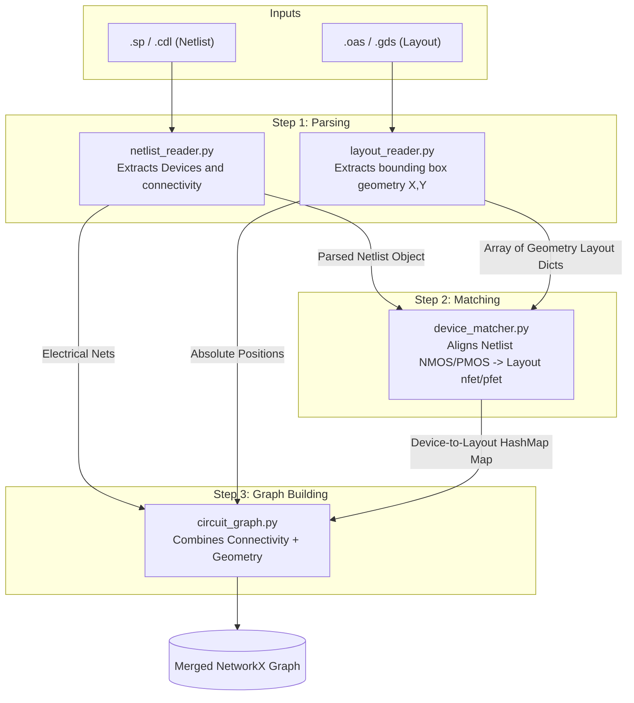
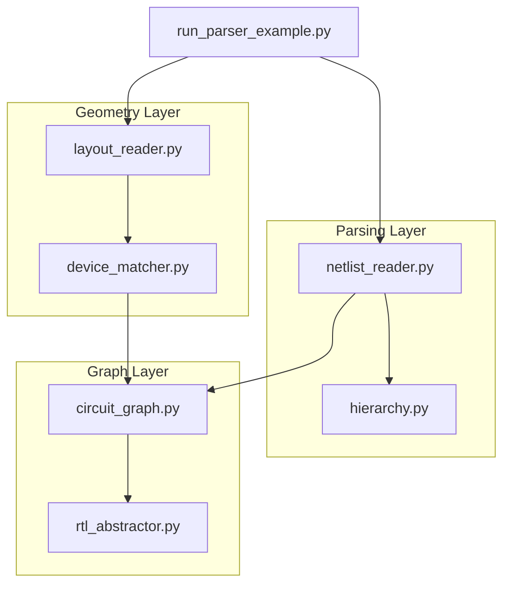
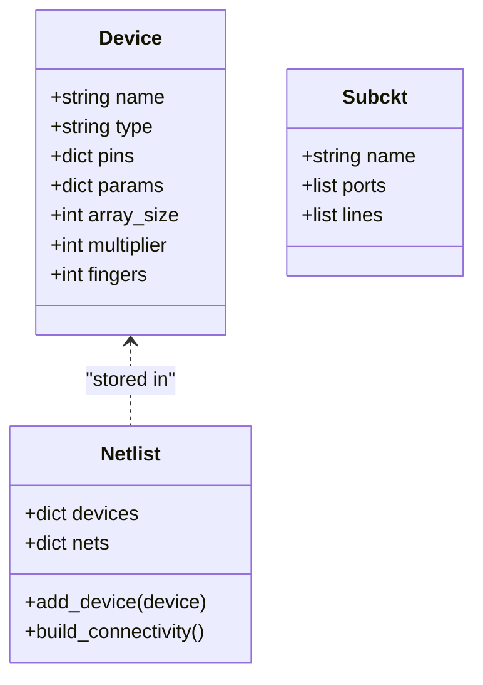
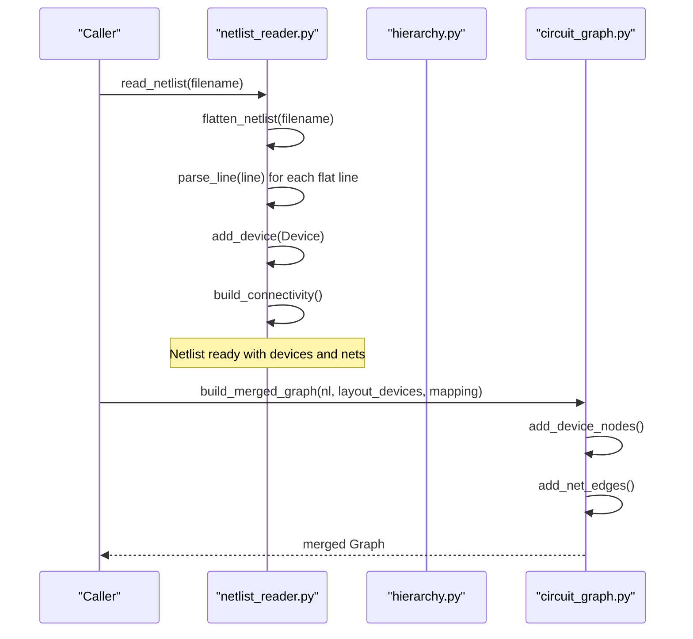
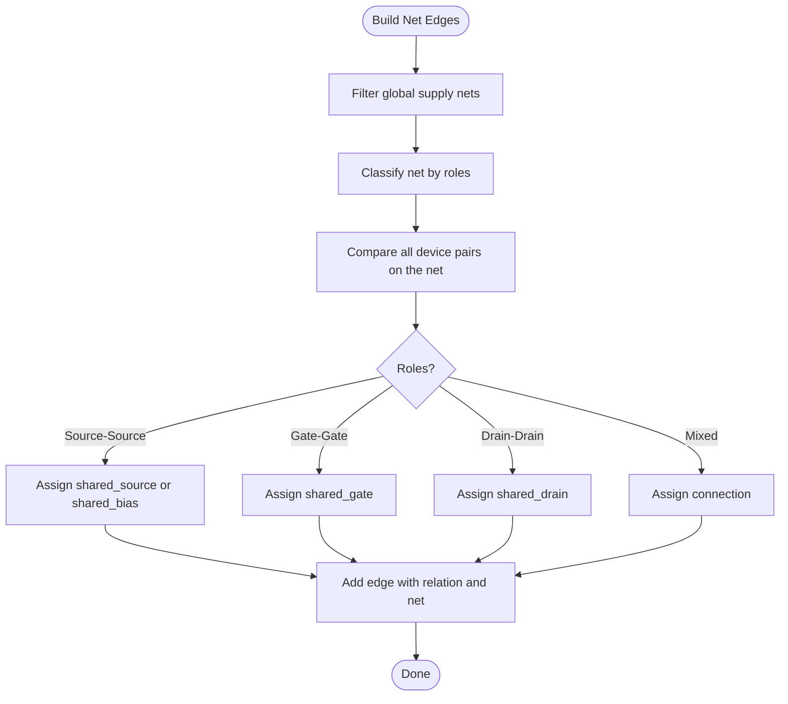
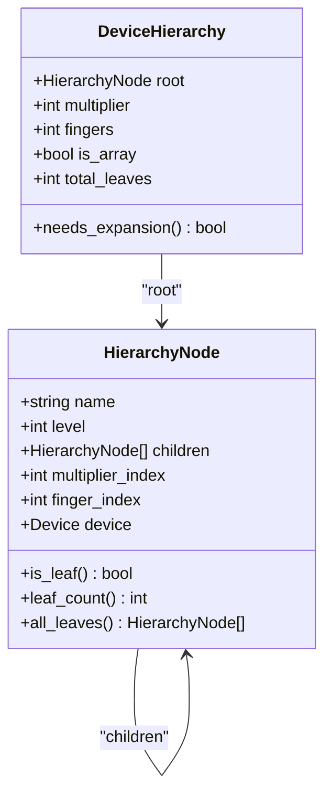
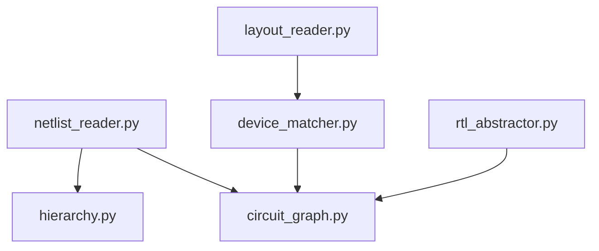

# Netlist Import Workflow

<cite>
**Referenced Files in This Document**
- [netlist_reader.py](file://parser/netlist_reader.py)
- [circuit_graph.py](file://parser/circuit_graph.py)
- [hierarchy.py](file://parser/hierarchy.py)
- [device_matcher.py](file://parser/device_matcher.py)
- [layout_reader.py](file://parser/layout_reader.py)
- [rtl_abstractor.py](file://parser/rtl_abstractor.py)
- [run_parser_example.py](file://parser/run_parser_example.py)
- [README.md](file://parser/README.md)
- [Xor_Automation.sp](file://examples/xor/Xor_Automation.sp)
- [Miller_OTA.sp](file://examples/Miller_OTA/Miller_OTA.sp)
- [Nand.sp](file://examples/Nand/Nand.sp)
- [RC.sp](file://examples/rc/RC.sp)
- [Current_Mirror_CM.sp](file://examples/current_mirror/Current_Mirror_CM.sp)
</cite>

## Table of Contents
1. [Introduction](#introduction)
2. [Project Structure](#project-structure)
3. [Core Components](#core-components)
4. [Architecture Overview](#architecture-overview)
5. [Detailed Component Analysis](#detailed-component-analysis)
6. [Dependency Analysis](#dependency-analysis)
7. [Performance Considerations](#performance-considerations)
8. [Troubleshooting Guide](#troubleshooting-guide)
9. [Conclusion](#conclusion)
10. [Appendices](#appendices)

## Introduction
This document explains the netlist import workflow used to convert SPICE/CDL netlists and layout geometry into a unified NetworkX graph suitable for AI-driven layout automation. It covers the SPICE parsing pipeline, hierarchical netlist flattening, device extraction and connectivity analysis, circuit graph construction, and the integration with layout geometry. Practical examples demonstrate importing different netlist types, handling various device types, and resolving common import inconsistencies.

## Project Structure
The parser subsystem orchestrates four major steps:
- Netlist parsing and hierarchy flattening
- Layout geometry extraction
- Device matching between netlist and layout
- Merged circuit graph construction

**Diagram sources**
- [README.md:9-40](file://parser/README.md#L9-L40)

**Section sources**
- [README.md:1-48](file://parser/README.md#L1-L48)

## Core Components
- netlist_reader.py: Parses SPICE/CDL lines into Device and Netlist objects, flattens hierarchical subcircuits, and builds connectivity mappings.
- hierarchy.py: Manages device hierarchy for arrays, multipliers (m), and fingers (nf), reconstructing logical parents and generating leaf devices.
- circuit_graph.py: Transforms netlist connectivity into a NetworkX graph, classifying edges by electrical roles and optionally merging with layout geometry.
- device_matcher.py: Matches netlist devices to layout instances, handling multi-finger devices and logical parent collapsing.
- layout_reader.py: Extracts device instances from OAS/GDS layouts, supporting both flat and hierarchical structures.
- rtl_abstractor.py: Produces a hierarchical block abstraction from a fully resolved graph, hiding individual fingers and grouping matched devices into blocks.
- run_parser_example.py: Demonstrates the end-to-end pipeline using example SPICE and layout files.

**Section sources**
- [netlist_reader.py:13-100](file://parser/netlist_reader.py#L13-L100)
- [hierarchy.py:133-310](file://parser/hierarchy.py#L133-L310)
- [circuit_graph.py:18-191](file://parser/circuit_graph.py#L18-L191)
- [device_matcher.py:85-151](file://parser/device_matcher.py#L85-L151)
- [layout_reader.py:357-442](file://parser/layout_reader.py#L357-L442)
- [rtl_abstractor.py:18-274](file://parser/rtl_abstractor.py#L18-L274)
- [run_parser_example.py:13-62](file://parser/run_parser_example.py#L13-L62)

## Architecture Overview
The netlist import workflow integrates parsing, hierarchy management, connectivity analysis, and geometry merging into a cohesive pipeline. The following diagram maps the actual code components and their interactions.

**Diagram sources**
- [netlist_reader.py:726-797](file://parser/netlist_reader.py#L726-L797)
- [hierarchy.py:316-418](file://parser/hierarchy.py#L316-L418)
- [layout_reader.py:357-442](file://parser/layout_reader.py#L357-L442)
- [device_matcher.py:85-151](file://parser/device_matcher.py#L85-L151)
- [circuit_graph.py:131-191](file://parser/circuit_graph.py#L131-L191)
- [rtl_abstractor.py:18-274](file://parser/rtl_abstractor.py#L18-L274)
- [run_parser_example.py:13-62](file://parser/run_parser_example.py#L13-L62)

## Detailed Component Analysis

### Netlist Reader: SPICE Parsing, Component Extraction, and Connectivity
The netlist_reader.py module performs:
- Value parsing for SPICE units (f, p, n, u, m, k, meg, g)
- Subcircuit extraction and top-level identification
- Hierarchical flattening with block-aware tracking
- Device parsing for MOS, capacitors, and resistors
- Netlist connectivity mapping

Key responsibilities:
- Device class encapsulates name, type, pin mapping, and parameters
- Netlist class stores devices and constructs net-to-device mappings
- parse_value converts scaled numeric strings to floats
- extract_subckts identifies .SUBCKT/.ENDS blocks
- flatten_netlist and flatten_netlist_with_blocks resolve nested X-instances
- parse_mos, parse_cap, parse_res handle device-specific parsing
- read_netlist orchestrates flattening, parsing, and connectivity

**Diagram sources**
- [netlist_reader.py:13-72](file://parser/netlist_reader.py#L13-L72)

**Diagram sources**
- [netlist_reader.py:726-761](file://parser/netlist_reader.py#L726-L761)
- [circuit_graph.py:131-191](file://parser/circuit_graph.py#L131-L191)

Practical parsing highlights:
- MOS parsing supports model inference, m and nf expansion, and array suffix handling
- Capacitor and resistor parsers accept both simple and CDL-style parameter forms
- Connectivity is built by iterating device pins and aggregating (device, pin) per net

Common parsing scenarios:
- Multi-finger devices (nf > 1) produce multiple leaf devices with _fN suffixes
- Multiplier expansion (m > 1) produces _mN children
- Arrays (<N>) are tracked with array_index and combined with m/nf expansions
- Supply nets are ignored in graph construction to preserve meaningful connectivity

**Section sources**
- [netlist_reader.py:74-100](file://parser/netlist_reader.py#L74-L100)
- [netlist_reader.py:121-149](file://parser/netlist_reader.py#L121-L149)
- [netlist_reader.py:260-318](file://parser/netlist_reader.py#L260-L318)
- [netlist_reader.py:397-457](file://parser/netlist_reader.py#L397-L457)
- [netlist_reader.py:478-620](file://parser/netlist_reader.py#L478-L620)
- [netlist_reader.py:623-692](file://parser/netlist_reader.py#L623-L692)
- [netlist_reader.py:700-720](file://parser/netlist_reader.py#L700-L720)
- [netlist_reader.py:726-797](file://parser/netlist_reader.py#L726-L797)

### Circuit Graph Construction: Device Networks and Edge Classification
The circuit_graph.py module transforms the parsed netlist into a NetworkX graph:
- Adds device nodes with type, width, length, and nf
- Ignores global supply nets
- Classifies nets by electrical roles (bias, signal, gate)
- Creates edges between devices based on shared pins and net semantics
- Supports merged graph construction by incorporating layout geometry

Edge classification logic:
- Shared source/source nets on bias nets are treated as shared_bias
- Shared drain/drains on signal nets are treated as shared_drain
- Gate-gate connections are treated as shared_gate
- Mixed roles default to connection

**Diagram sources**
- [circuit_graph.py:36-128](file://parser/circuit_graph.py#L36-L128)

Merged graph construction:
- Incorporates layout geometry (x, y, width, height, orientation)
- Preserves electrical edges while adding spatial proximity awareness

**Section sources**
- [circuit_graph.py:18-191](file://parser/circuit_graph.py#L18-L191)

### Hierarchy Management: Nested Blocks and Flattening
The hierarchy.py module manages device hierarchies:
- parse_array_suffix extracts array indices from device names
- HierarchyNode and DeviceHierarchy define the tree structure
- build_hierarchy_for_device constructs trees for m, nf, and array combinations
- build_device_hierarchy reconstructs logical parents from expanded devices
- expand_hierarchy_devices generates leaf Device objects with resolved pins and indices

**Diagram sources**
- [hierarchy.py:133-177](file://parser/hierarchy.py#L133-L177)
- [hierarchy.py:183-217](file://parser/hierarchy.py#L183-L217)

Hierarchy reconstruction:
- Determines effective m-level considering arrays and multipliers
- Recovers nf from total leaf count when m > 1
- Attaches actual Device objects to leaf nodes for downstream use

**Section sources**
- [hierarchy.py:44-74](file://parser/hierarchy.py#L44-L74)
- [hierarchy.py:219-310](file://parser/hierarchy.py#L219-L310)
- [hierarchy.py:316-418](file://parser/hierarchy.py#L316-L418)
- [hierarchy.py:434-475](file://parser/hierarchy.py#L434-L475)

### Practical Examples: Importing Different Netlist Types
The run_parser_example.py demonstrates the pipeline end-to-end using example SPICE and layout files. Example netlists include:
- XOR gate: mixed NMOS/PMOS with nf and m parameters
- NAND gate: simple NMOS/PMOS with nf
- Miller OTA: complex analog with nf, m, and passive devices
- RC circuit: resistor-capacitor passive network
- Current mirror: multi-finger NMOS/PMOS with nf and m

Example usage:
- read_netlist parses and flattens the SPICE file
- extract_layout_instances reads layout geometry
- match_devices aligns netlist and layout devices
- build_merged_graph produces a unified graph

**Section sources**
- [run_parser_example.py:13-62](file://parser/run_parser_example.py#L13-L62)
- [Xor_Automation.sp:14-28](file://examples/xor/Xor_Automation.sp#L14-L28)
- [Miller_OTA.sp:14-26](file://examples/Miller_OTA/Miller_OTA.sp#L14-L26)
- [Nand.sp:14-20](file://examples/Nand/Nand.sp#L14-L20)
- [RC.sp:14-18](file://examples/rc/RC.sp#L14-L18)
- [Current_Mirror_CM.sp:14-22](file://examples/current_mirror/Current_Mirror_CM.sp#L14-L22)

### Hierarchical Netlist Support
Hierarchical support is implemented through:
- Subcircuit extraction and top-level identification
- Recursive X-instance expansion with hierarchical prefixing
- Block-aware flattening that tracks top-level instance and subcircuit type
- Supply net filtering in graph construction

Block-aware flattening:
- Tracks device membership to top-level instances
- Records instance and subcircuit type for each device
- Enables downstream block-level reasoning

**Section sources**
- [netlist_reader.py:121-149](file://parser/netlist_reader.py#L121-L149)
- [netlist_reader.py:260-318](file://parser/netlist_reader.py#L260-L318)
- [netlist_reader.py:397-457](file://parser/netlist_reader.py#L397-L457)

## Dependency Analysis
The modules exhibit clear separation of concerns with minimal coupling:
- netlist_reader.py depends on hierarchy.py for array suffix parsing and on circuit_graph.py indirectly through the Netlist object
- hierarchy.py depends on netlist_reader.py’s Device class via a forward reference
- device_matcher.py operates independently on netlist and layout arrays
- circuit_graph.py depends on NetworkX and consumes Netlist and layout mappings
- layout_reader.py depends on gdstk for OAS/GDS parsing
- rtl_abstractor.py consumes the final graph representation

**Diagram sources**
- [netlist_reader.py:470-471](file://parser/netlist_reader.py#L470-L471)
- [device_matcher.py:85-151](file://parser/device_matcher.py#L85-L151)
- [circuit_graph.py:131-191](file://parser/circuit_graph.py#L131-L191)
- [layout_reader.py:357-442](file://parser/layout_reader.py#L357-L442)
- [rtl_abstractor.py:18-274](file://parser/rtl_abstractor.py#L18-L274)

**Section sources**
- [netlist_reader.py:470-471](file://parser/netlist_reader.py#L470-L471)
- [hierarchy.py:30-35](file://parser/hierarchy.py#L30-L35)

## Performance Considerations
- Netlist parsing scales with the number of lines and devices; flattening recursion depth affects performance for deeply nested hierarchies
- Graph construction iterates over all nets and compares device pairs; complexity is O(N^2) per net in worst case
- Layout extraction traverses hierarchical references; performance depends on the number of instances and depth
- Matching logic sorts and compares lists; ensure deterministic ordering to minimize overhead

[No sources needed since this section provides general guidance]

## Troubleshooting Guide
Common issues and resolutions:
- Unknown subcircuit during flattening: The flattener prints a warning and skips the instance; verify subcircuit definitions and names
- Non-integer m or nf values: Values are rounded to integers; confirm parameter correctness in the netlist
- Missing closing angle bracket in array syntax: Parsing returns None; ensure proper device naming with <N>
- Supply nets skew graph classification: Global nets are filtered out; verify net names match recognized supplies
- Count mismatches between netlist and layout: The matcher attempts logical collapsing and logs warnings; adjust expectations or verify matching criteria

Validation and error recovery:
- parse_value handles scaled numeric strings and falls back to raw values on parse errors
- Device parsing catches exceptions and preserves raw values for unknown formats
- Hierarchy parsing clamps invalid integer parameters to defaults and logs warnings

**Section sources**
- [netlist_reader.py:163-167](file://parser/netlist_reader.py#L163-L167)
- [netlist_reader.py:534-542](file://parser/netlist_reader.py#L534-L542)
- [netlist_reader.py:544-553](file://parser/netlist_reader.py#L544-L553)
- [circuit_graph.py:65-77](file://parser/circuit_graph.py#L65-L77)
- [hierarchy.py:116-126](file://parser/hierarchy.py#L116-L126)

## Conclusion
The netlist import workflow provides a robust pipeline for transforming SPICE/CDL netlists and layout geometry into a unified NetworkX graph. It supports hierarchical netlists, multi-finger and multiplier expansions, and integrates seamlessly with layout geometry for AI-driven automation. The modular design enables maintainability and extensibility for additional device types and formats.

[No sources needed since this section summarizes without analyzing specific files]

## Appendices

### Example Netlist Formats and Device Coverage
- NMOS/PMOS with nf and m parameters
- Capacitors and resistors with CDL-style parameters
- Hierarchical subcircuits with X-instances
- Array-indexed devices with <N> suffixes

**Section sources**
- [Xor_Automation.sp:16-26](file://examples/xor/Xor_Automation.sp#L16-L26)
- [Miller_OTA.sp:16-25](file://examples/Miller_OTA/Miller_OTA.sp#L16-L25)
- [Nand.sp:16-19](file://examples/Nand/Nand.sp#L16-L19)
- [RC.sp:16-17](file://examples/rc/RC.sp#L16-L17)
- [Current_Mirror_CM.sp:16-21](file://examples/current_mirror/Current_Mirror_CM.sp#L16-L21)