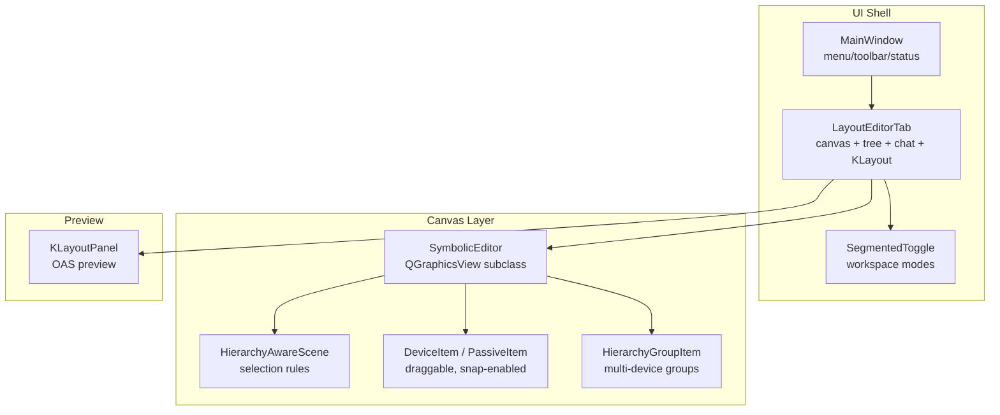
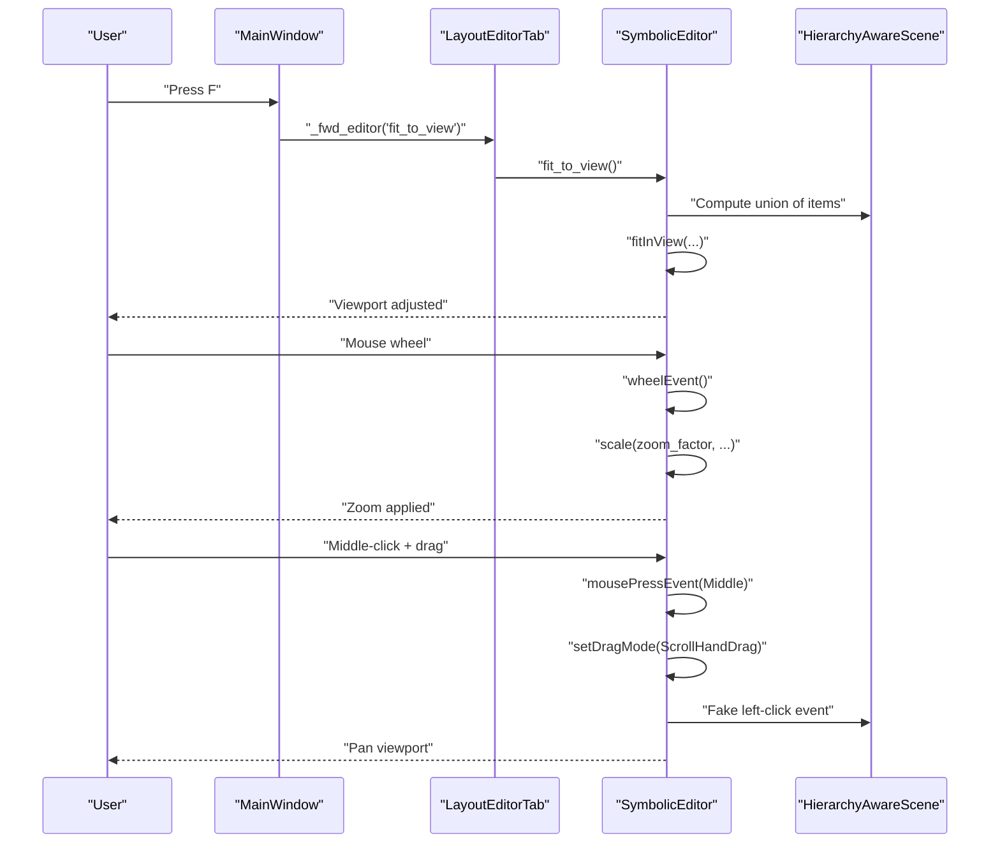
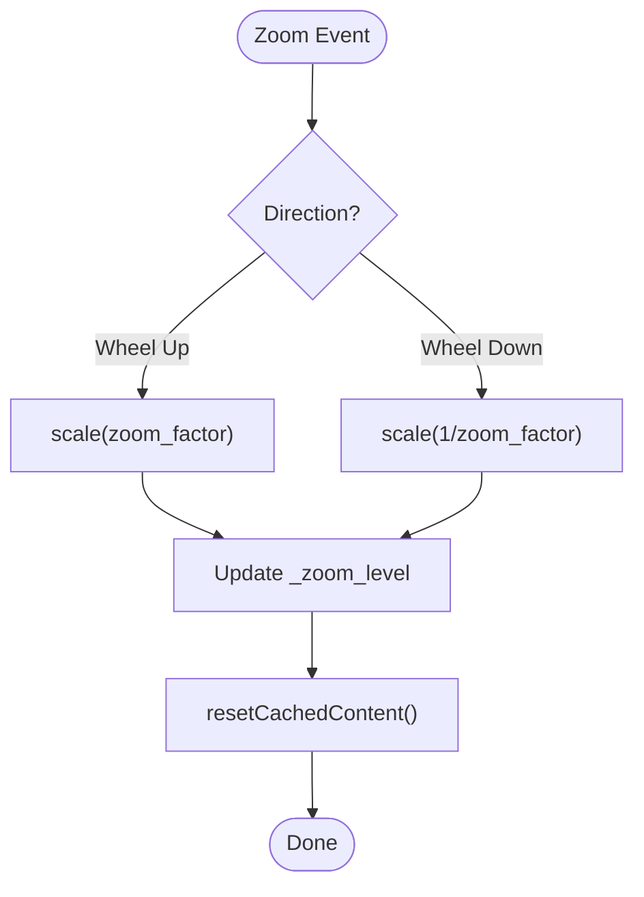
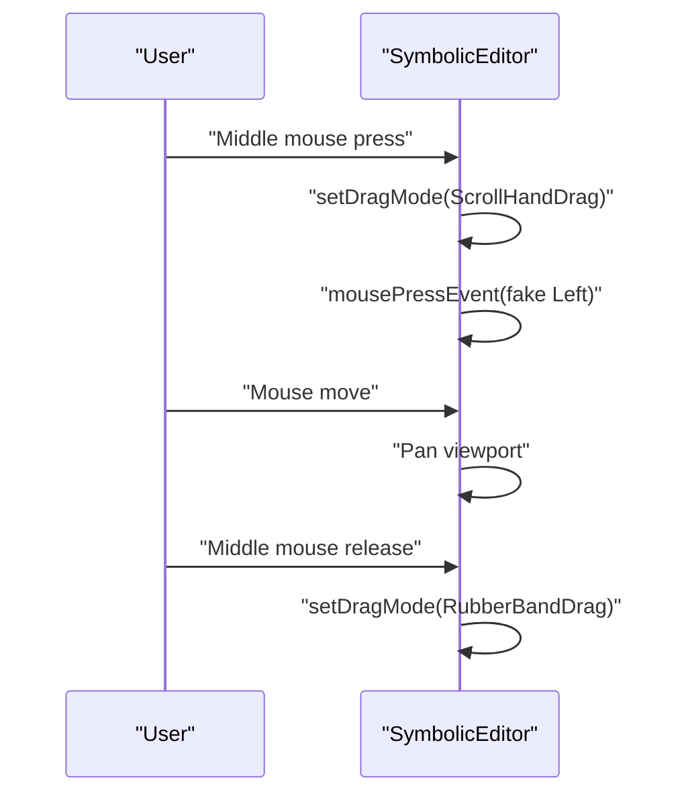
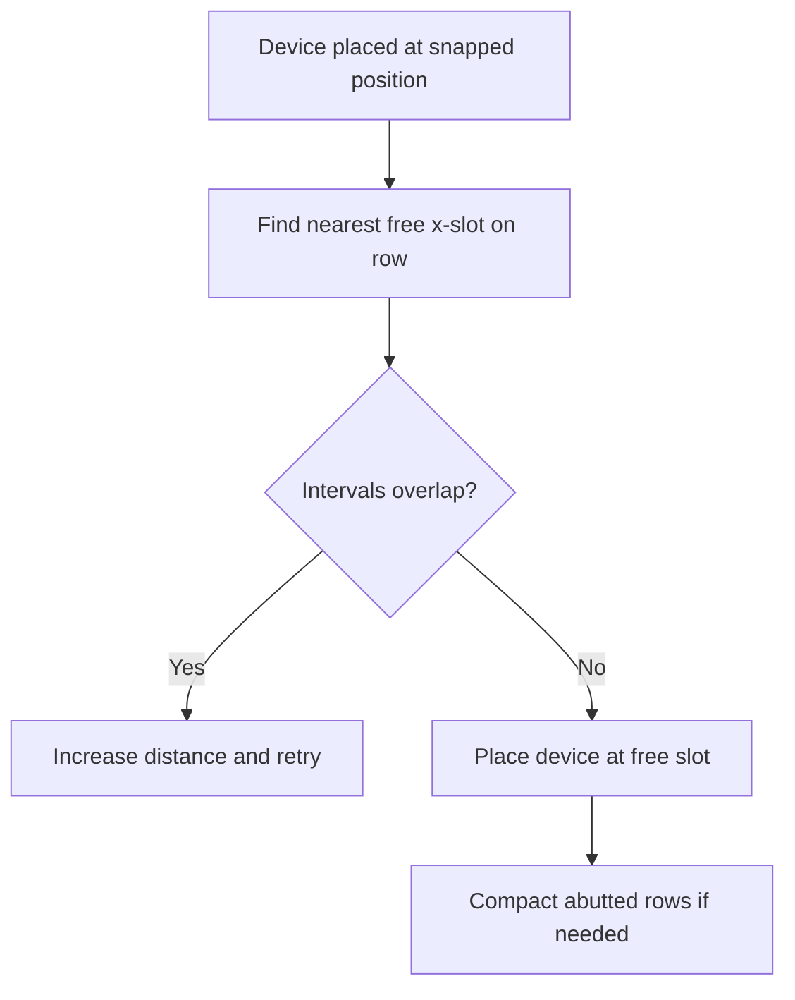
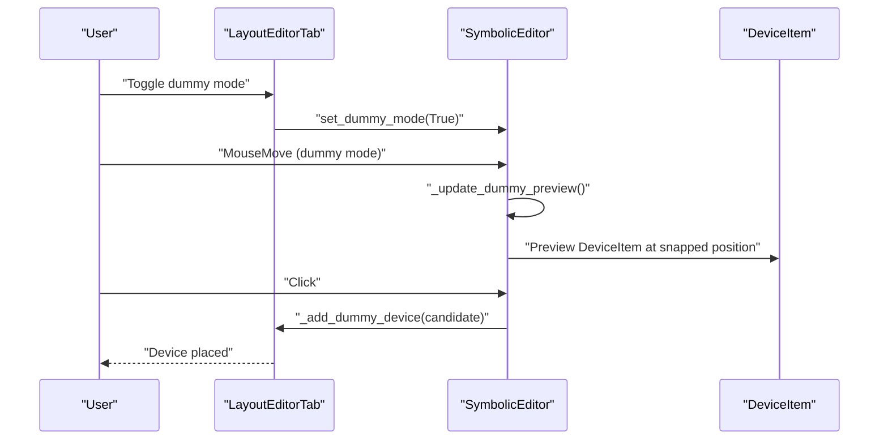
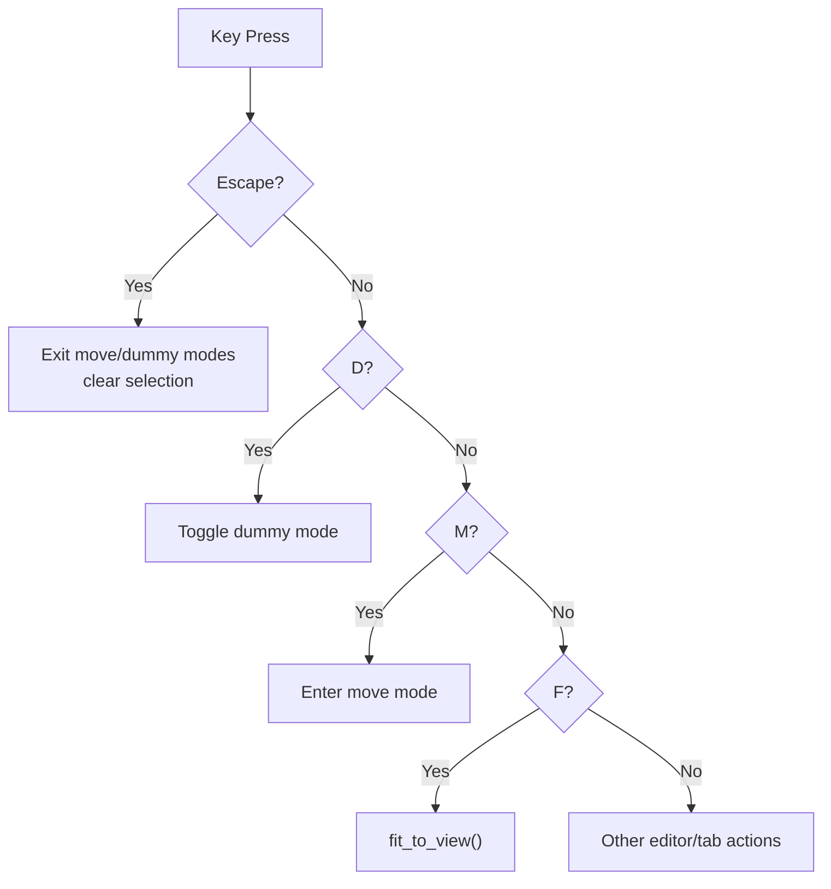
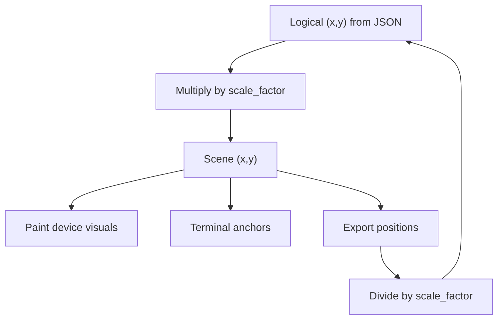
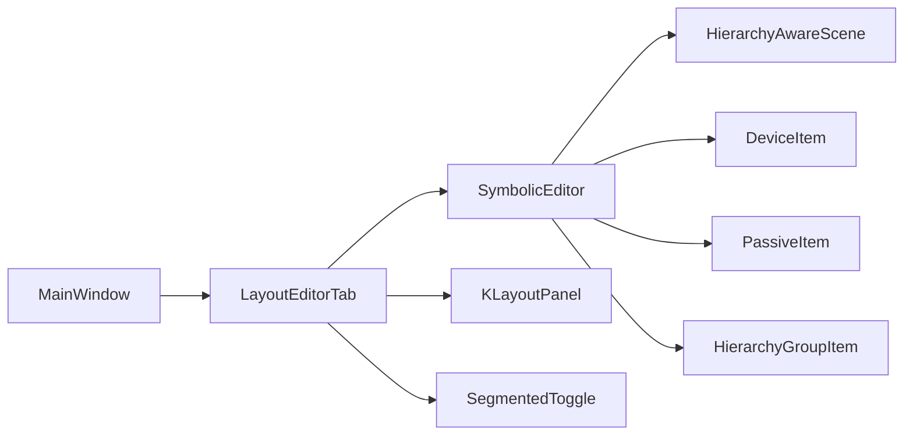

# Canvas Navigation and Controls

<cite>
**Referenced Files in This Document**
- [editor_view.py](file://symbolic_editor/editor_view.py)
- [layout_tab.py](file://symbolic_editor/layout_tab.py)
- [main.py](file://symbolic_editor/main.py)
- [device_item.py](file://symbolic_editor/device_item.py)
- [passive_item.py](file://symbolic_editor/passive_item.py)
- [hierarchy_group_item.py](file://symbolic_editor/hierarchy_group_item.py)
- [klayout_panel.py](file://symbolic_editor/klayout_panel.py)
- [view_toggle.py](file://symbolic_editor/view_toggle.py)
</cite>

## Table of Contents
1. [Introduction](#introduction)
2. [Project Structure](#project-structure)
3. [Core Components](#core-components)
4. [Architecture Overview](#architecture-overview)
5. [Detailed Component Analysis](#detailed-component-analysis)
6. [Dependency Analysis](#dependency-analysis)
7. [Performance Considerations](#performance-considerations)
8. [Troubleshooting Guide](#troubleshooting-guide)
9. [Conclusion](#conclusion)

## Introduction
This document explains the canvas navigation and control systems used in the symbolic layout editor. It covers zoom mechanics with zoom factors and scale settings, panning via the middle mouse button, viewport management, the grid system (base spacing, row pitch, snap-to-grid), mouse interaction patterns (rubber band selection, drag-and-drop, click-to-place dummy device), keyboard shortcuts, viewport scrolling, and canvas coordinate system transformations. Practical navigation workflows and performance optimization tips for large layouts are included.

## Project Structure
The canvas is implemented as a specialized QGraphicsView subclass with a custom scene and device items. The main application integrates the editor into a multi-tab UI with menus, toolbars, and a KLayout preview panel.

**Diagram sources**
- [main.py:127-148](file://symbolic_editor/main.py#L127-L148)
- [layout_tab.py:104-106](file://symbolic_editor/layout_tab.py#L104-L106)
- [editor_view.py:81-113](file://symbolic_editor/editor_view.py#L81-L113)
- [device_item.py:17-56](file://symbolic_editor/device_item.py#L17-L56)
- [hierarchy_group_item.py:28-90](file://symbolic_editor/hierarchy_group_item.py#L28-L90)
- [klayout_panel.py:30-80](file://symbolic_editor/klayout_panel.py#L30-L80)
- [view_toggle.py:11-29](file://symbolic_editor/view_toggle.py#L11-L29)

**Section sources**
- [main.py:80-148](file://symbolic_editor/main.py#L80-L148)
- [layout_tab.py:64-106](file://symbolic_editor/layout_tab.py#L64-L106)
- [editor_view.py:81-113](file://symbolic_editor/editor_view.py#L81-L113)

## Core Components
- SymbolicEditor: The interactive canvas built on QGraphicsView. It manages zoom, pan, grid drawing, dummy placement mode, device selection, and viewport fitting.
- HierarchyAwareScene: A custom scene enforcing hierarchy-aware selection rules.
- DeviceItem and PassiveItem: Draggable, snap-enabled items representing transistors, resistors, and capacitors.
- HierarchyGroupItem: A draggable overlay that groups multiple devices and supports descending/ascending the hierarchy.
- LayoutEditorTab: Orchestrates the canvas, device tree, properties panel, chat, and KLayout preview; wires keyboard shortcuts and workspace modes.
- KLayoutPanel: Renders a KLayout preview of exported OAS files.
- SegmentedToggle: Workspace mode selector (symbolic, KLayout, both).

**Section sources**
- [editor_view.py:39-113](file://symbolic_editor/editor_view.py#L39-L113)
- [device_item.py:17-56](file://symbolic_editor/device_item.py#L17-L56)
- [passive_item.py:24-47](file://symbolic_editor/passive_item.py#L24-L47)
- [hierarchy_group_item.py:28-90](file://symbolic_editor/hierarchy_group_item.py#L28-L90)
- [layout_tab.py:64-106](file://symbolic_editor/layout_tab.py#L64-L106)
- [klayout_panel.py:30-80](file://symbolic_editor/klayout_panel.py#L30-L80)
- [view_toggle.py:11-29](file://symbolic_editor/view_toggle.py#L11-L29)

## Architecture Overview
The canvas integrates input handling, rendering, and layout logic. The editor exposes public methods for zoom, pan, fit-to-view, and device manipulation. Keyboard shortcuts are bound at the tab and editor levels. The grid is drawn by the editor’s background painter and enforced by device snapping.

**Diagram sources**
- [main.py:626-629](file://symbolic_editor/main.py#L626-L629)
- [layout_tab.py:250-261](file://symbolic_editor/layout_tab.py#L250-L261)
- [editor_view.py:1547-1571](file://symbolic_editor/editor_view.py#L1547-L1571)
- [editor_view.py:1879-1895](file://symbolic_editor/editor_view.py#L1879-L1895)
- [editor_view.py:1905-1931](file://symbolic_editor/editor_view.py#L1905-L1931)

## Detailed Component Analysis

### Zoom, Scale, and Viewport Management
- Zoom factor and level: The editor defines a zoom factor and maintains a current zoom level derived from the transform matrix. Zoom in/out scales the view by the factor; reset clears transforms.
- Scale factor: A visual scaling constant is used when importing layout data to convert logical units to scene coordinates.
- Fit-to-view: Computes a union of device and group bounding boxes, adds margins, and fits the view to the combined rectangle.
- Cache mode: Background caching improves grid rendering performance.

**Diagram sources**
- [editor_view.py:1879-1895](file://symbolic_editor/editor_view.py#L1879-L1895)
- [editor_view.py:1897-1900](file://symbolic_editor/editor_view.py#L1897-L1900)
- [editor_view.py:1547-1571](file://symbolic_editor/editor_view.py#L1547-L1571)

**Section sources**
- [editor_view.py:109-113](file://symbolic_editor/editor_view.py#L109-L113)
- [editor_view.py:1879-1900](file://symbolic_editor/editor_view.py#L1879-L1900)
- [editor_view.py:1547-1571](file://symbolic_editor/editor_view.py#L1547-L1571)

### Panning with Middle Mouse Button
- Middle-click press switches the view to hand-pan mode, simulating a left-click press to initiate panning.
- Release restores rubber-band selection mode.

**Diagram sources**
- [editor_view.py:1905-1931](file://symbolic_editor/editor_view.py#L1905-L1931)

**Section sources**
- [editor_view.py:1905-1931](file://symbolic_editor/editor_view.py#L1905-L1931)

### Grid System and Snap-to-Grid
- Base grid spacing: A fixed base grid size drives minor/major grid lines.
- Row pitch: Computed from device heights and optional custom row gaps; used for row alignment.
- Snap grid: Derived from device widths to align devices in columns.
- Snapping functions: Per-axis snapping for precise placement; row snapping aligns to tracks.
- Virtual grid extents: Expandable canvas bounds to reserve space for future placements.
- Free-slot finder: Ensures new placements do not overlap existing devices in the target row.

**Diagram sources**
- [editor_view.py:1085-1115](file://symbolic_editor/editor_view.py#L1085-L1115)
- [editor_view.py:1003-1033](file://symbolic_editor/editor_view.py#L1003-L1033)

**Section sources**
- [editor_view.py:139-144](file://symbolic_editor/editor_view.py#L139-L144)
- [editor_view.py:225-232](file://symbolic_editor/editor_view.py#L225-L232)
- [editor_view.py:1116-1122](file://symbolic_editor/editor_view.py#L1116-L1122)
- [editor_view.py:1085-1115](file://symbolic_editor/editor_view.py#L1085-L1115)

### Mouse Interaction Patterns
- Rubber band selection: Enabled by default; users can drag a box to select multiple devices.
- Drag-and-drop: Items are draggable and snap to grid during movement. Hierarchical groups move all children together.
- Click-to-place dummy device: Toggle dummy mode to preview placement; clicking places a temporary device aligned to the nearest row and free slot.

**Diagram sources**
- [layout_tab.py:330-337](file://symbolic_editor/layout_tab.py#L330-L337)
- [editor_view.py:1908-1912](file://symbolic_editor/editor_view.py#L1908-L1912)
- [editor_view.py:301-347](file://symbolic_editor/editor_view.py#L301-L347)

**Section sources**
- [editor_view.py:102](file://symbolic_editor/editor_view.py#L102)
- [device_item.py:194-242](file://symbolic_editor/device_item.py#L194-L242)
- [hierarchy_group_item.py:156-167](file://symbolic_editor/hierarchy_group_item.py#L156-L167)
- [editor_view.py:1908-1912](file://symbolic_editor/editor_view.py#L1908-L1912)
- [editor_view.py:301-347](file://symbolic_editor/editor_view.py#L301-L347)

### Keyboard Shortcuts and Viewport Scrolling
- Global shortcuts: Fit view (F), toggle detailed/outline device view (Shift+F, Ctrl+F), toggle dummy mode (D), toggle move mode (M), escape clears selections and exits modes.
- Tab-level shortcuts: Select all, delete, swap, flip, and workspace mode toggles.
- Editor-level shortcuts: Zoom in/out/reset, fit-to-view, and device view toggles.

**Diagram sources**
- [layout_tab.py:380-416](file://symbolic_editor/layout_tab.py#L380-L416)
- [layout_tab.py:250-261](file://symbolic_editor/layout_tab.py#L250-L261)
- [editor_view.py:1582-1610](file://symbolic_editor/editor_view.py#L1582-L1610)

**Section sources**
- [layout_tab.py:380-416](file://symbolic_editor/layout_tab.py#L380-L416)
- [layout_tab.py:250-261](file://symbolic_editor/layout_tab.py#L250-L261)
- [editor_view.py:1582-1610](file://symbolic_editor/editor_view.py#L1582-L1610)

### Canvas Coordinate System Transformations
- Scene vs. logical coordinates: Imported positions are scaled by a constant to convert logical units to scene pixels. Y-axis negation ensures layout convention (increasing upward) matches Qt’s screen convention (increasing downward).
- Position retrieval: Converted back to logical coordinates for export or reporting.
- Device painting: Items compute terminal anchors and render labels using scene coordinates.

**Diagram sources**
- [editor_view.py:372-377](file://symbolic_editor/editor_view.py#L372-L377)
- [editor_view.py:461-466](file://symbolic_editor/editor_view.py#L461-L466)
- [device_item.py:453-507](file://symbolic_editor/device_item.py#L453-L507)

**Section sources**
- [editor_view.py:372-377](file://symbolic_editor/editor_view.py#L372-L377)
- [editor_view.py:461-466](file://symbolic_editor/editor_view.py#L461-L466)
- [device_item.py:453-507](file://symbolic_editor/device_item.py#L453-L507)

### Practical Navigation Workflows
- Zoom and pan large layouts:
  - Use mouse wheel to zoom; middle-click and drag to pan; press F to fit to view.
- Precise placement:
  - Enable dummy mode to preview placement; click to place; use row/column spinners to reserve virtual grid space.
- Selection and movement:
  - Rubber band select; drag devices; for matched groups, drag one to move the entire group.
- View modes:
  - Switch between detailed and outline device views; toggle workspace modes (symbolic/KLayout/both).

**Section sources**
- [layout_tab.py:250-261](file://symbolic_editor/layout_tab.py#L250-L261)
- [editor_view.py:1905-1931](file://symbolic_editor/editor_view.py#L1905-L1931)
- [editor_view.py:1547-1571](file://symbolic_editor/editor_view.py#L1547-L1571)
- [hierarchy_group_item.py:128-141](file://symbolic_editor/hierarchy_group_item.py#L128-L141)
- [view_toggle.py:113-121](file://symbolic_editor/view_toggle.py#L113-L121)

## Dependency Analysis
The canvas subsystem exhibits clear layering: UI shell delegates commands to the active tab, which controls the editor. The editor owns the scene and items, and the KLayout panel is independent but synchronized via file paths.

**Diagram sources**
- [main.py:127-148](file://symbolic_editor/main.py#L127-L148)
- [layout_tab.py:104-106](file://symbolic_editor/layout_tab.py#L104-L106)
- [editor_view.py:81-113](file://symbolic_editor/editor_view.py#L81-L113)
- [device_item.py:17-56](file://symbolic_editor/device_item.py#L17-L56)
- [passive_item.py:24-47](file://symbolic_editor/passive_item.py#L24-L47)
- [hierarchy_group_item.py:28-90](file://symbolic_editor/hierarchy_group_item.py#L28-L90)
- [klayout_panel.py:30-80](file://symbolic_editor/klayout_panel.py#L30-L80)
- [view_toggle.py:11-29](file://symbolic_editor/view_toggle.py#L11-L29)

**Section sources**
- [main.py:127-148](file://symbolic_editor/main.py#L127-L148)
- [layout_tab.py:104-106](file://symbolic_editor/layout_tab.py#L104-L106)
- [editor_view.py:81-113](file://symbolic_editor/editor_view.py#L81-L113)

## Performance Considerations
- Rendering cache: Background caching reduces redraw cost for grid and heavy scenes.
- Efficient grid drawing: Minor/major grid lines are batched and drawn once per frame.
- Snapping and compaction: Snapping occurs during item changes; compacting rows minimizes gaps and overlaps.
- Virtual extents: Expanding scene bounds avoids frequent resizes during large layout edits.
- Avoid unnecessary updates: Use cached content invalidation judiciously after expensive operations.

[No sources needed since this section provides general guidance]

## Troubleshooting Guide
- Selection blocked by hierarchy:
  - If a device cannot be selected, it may be hidden inside a non-descended hierarchy group. Descend the group or adjust hierarchy visibility.
- Dummy placement not working:
  - Ensure dummy mode is enabled and the cursor is over the canvas. Verify the callback is wired to place the device.
- Panning not responding:
  - Confirm middle-click is pressed during drag; releasing resets the drag mode to rubber band selection.
- Zoom feels sluggish:
  - Reduce device count temporarily or switch to outline device view to lower rendering overhead.
- Grid misalignment:
  - Check snap grid and row pitch computations; ensure device sizes are consistent and custom row gaps are set appropriately.

**Section sources**
- [editor_view.py:802-825](file://symbolic_editor/editor_view.py#L802-L825)
- [layout_tab.py:330-337](file://symbolic_editor/layout_tab.py#L330-L337)
- [editor_view.py:1905-1931](file://symbolic_editor/editor_view.py#L1905-L1931)
- [editor_view.py:1130-1137](file://symbolic_editor/editor_view.py#L1130-L1137)

## Conclusion
The canvas navigation system combines a robust zoom/pan framework, a precise grid and snap mechanism, and flexible mouse interactions. With dummy placement, hierarchical grouping, and workspace modes, it supports efficient editing of complex analog layouts. Following the workflows and performance tips outlined here will help achieve smooth, predictable navigation even on large designs.