# Device Manipulation Tools

<cite>
**Referenced Files in This Document**
- [README.md](file://README.md)
- [main.py](file://symbolic_editor/main.py)
- [layout_tab.py](file://symbolic_editor/layout_tab.py)
- [editor_view.py](file://symbolic_editor/editor_view.py)
- [device_item.py](file://symbolic_editor/device_item.py)
- [chat_panel.py](file://symbolic_editor/chat_panel.py)
- [cmd_utils.py](file://ai_agent/ai_chat_bot/cmd_utils.py)
- [abutment_engine.py](file://symbolic_editor/abutment_engine.py)
- [placer_graph_worker.py](file://ai_agent/ai_initial_placement/placer_graph_worker.py)
- [test_group_movement.py](file://tests/test_group_movement.py)
</cite>

## Table of Contents
1. [Introduction](#introduction)
2. [Project Structure](#project-structure)
3. [Core Components](#core-components)
4. [Architecture Overview](#architecture-overview)
5. [Detailed Component Analysis](#detailed-component-analysis)
6. [Dependency Analysis](#dependency-analysis)
7. [Performance Considerations](#performance-considerations)
8. [Troubleshooting Guide](#troubleshooting-guide)
9. [Conclusion](#conclusion)

## Introduction
This document explains the device manipulation tools and operations available in the symbolic layout editor. It covers move, swap, delete, and flip operations on the canvas, batch selection and multi-device operations, selection filtering, and the dummy device placement workflow including preview generation, candidate computation, and placement confirmation. It also documents device transformations, orientation changes, coordinate system conversions, practical manipulation workflows, error handling for invalid operations, and integration with the AI assistance system for automated operations.

## Project Structure
The device manipulation system spans several modules:
- GUI and canvas: main toolbar, editor canvas, device items, and layout tab
- AI integration: chat panel, command extraction, and AI placement workers
- Utilities: abutment engine and coordinate transforms

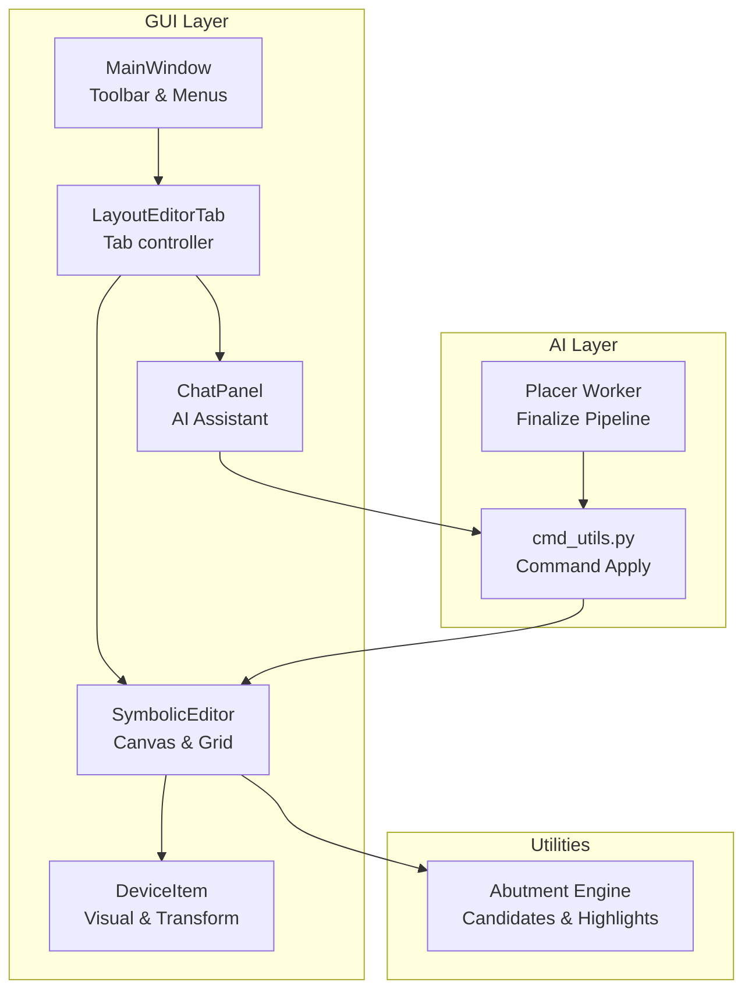

**Diagram sources**
- [main.py:414-527](file://symbolic_editor/main.py#L414-L527)
- [layout_tab.py:64-110](file://symbolic_editor/layout_tab.py#L64-L110)
- [editor_view.py:81-120](file://symbolic_editor/editor_view.py#L81-L120)
- [device_item.py:17-56](file://symbolic_editor/device_item.py#L17-L56)
- [chat_panel.py:95-120](file://symbolic_editor/chat_panel.py#L95-L120)
- [cmd_utils.py:109-171](file://ai_agent/ai_chat_bot/cmd_utils.py#L109-L171)
- [placer_graph_worker.py:108-143](file://ai_agent/ai_initial_placement/placer_graph_worker.py#L108-L143)
- [abutment_engine.py:65-82](file://symbolic_editor/abutment_engine.py#L65-L82)

**Section sources**
- [README.md:59-108](file://README.md#L59-L108)
- [main.py:414-527](file://symbolic_editor/main.py#L414-L527)
- [layout_tab.py:64-110](file://symbolic_editor/layout_tab.py#L64-L110)
- [editor_view.py:81-120](file://symbolic_editor/editor_view.py#L81-L120)
- [device_item.py:17-56](file://symbolic_editor/device_item.py#L17-L56)
- [chat_panel.py:95-120](file://symbolic_editor/chat_panel.py#L95-L120)
- [cmd_utils.py:109-171](file://ai_agent/ai_chat_bot/cmd_utils.py#L109-L171)
- [placer_graph_worker.py:108-143](file://ai_agent/ai_initial_placement/placer_graph_worker.py#L108-L143)
- [abutment_engine.py:65-82](file://symbolic_editor/abutment_engine.py#L65-L82)

## Core Components
- DeviceItem: represents a transistor device on the canvas, supports flip operations, orientation encoding, and rendering modes.
- SymbolicEditor: manages the canvas grid, device selection, dummy placement mode, and device operations (move, swap, flip).
- LayoutEditorTab: orchestrates multi-device operations, undo/redo, and integrates with the AI chat panel.
- ChatPanel: extracts structured commands from natural language and triggers device manipulations.
- cmd_utils: applies AI-generated commands to layout nodes and enforces constraints (PMOS/NMOS row ordering, deduplication).
- AbutmentEngine: computes diffusion-sharing candidates and highlights edges for abutment.

**Section sources**
- [device_item.py:155-188](file://symbolic_editor/device_item.py#L155-L188)
- [editor_view.py:192-347](file://symbolic_editor/editor_view.py#L192-L347)
- [layout_tab.py:736-820](file://symbolic_editor/layout_tab.py#L736-L820)
- [chat_panel.py:656-787](file://symbolic_editor/chat_panel.py#L656-L787)
- [cmd_utils.py:109-171](file://ai_agent/ai_chat_bot/cmd_utils.py#L109-L171)
- [abutment_engine.py:65-82](file://symbolic_editor/abutment_engine.py#L65-L82)

## Architecture Overview
The manipulation workflow connects user actions and AI commands to the underlying node graph. The editor maintains a device_items map keyed by device ID and a nodes list representing the layout. Operations are applied to nodes and reflected on the canvas.

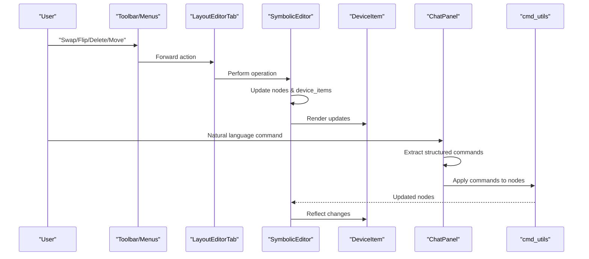

**Diagram sources**
- [main.py:349-361](file://symbolic_editor/main.py#L349-L361)
- [layout_tab.py:740-748](file://symbolic_editor/layout_tab.py#L740-L748)
- [editor_view.py:785-820](file://symbolic_editor/editor_view.py#L785-L820)
- [device_item.py:155-188](file://symbolic_editor/device_item.py#L155-L188)
- [chat_panel.py:656-787](file://symbolic_editor/chat_panel.py#L656-L787)
- [cmd_utils.py:109-171](file://ai_agent/ai_chat_bot/cmd_utils.py#L109-L171)

## Detailed Component Analysis

### Move Operation
- Canvas-level move: drag a selected device; the editor enables per-item snapping and propagates hierarchical group movements.
- Programmatic move: LayoutEditorTab.do_move delegates to SymbolicEditor.move_devices with undo/redo support.
- AI move: ChatPanel detects natural-language move intents and emits structured commands applied by cmd_utils.

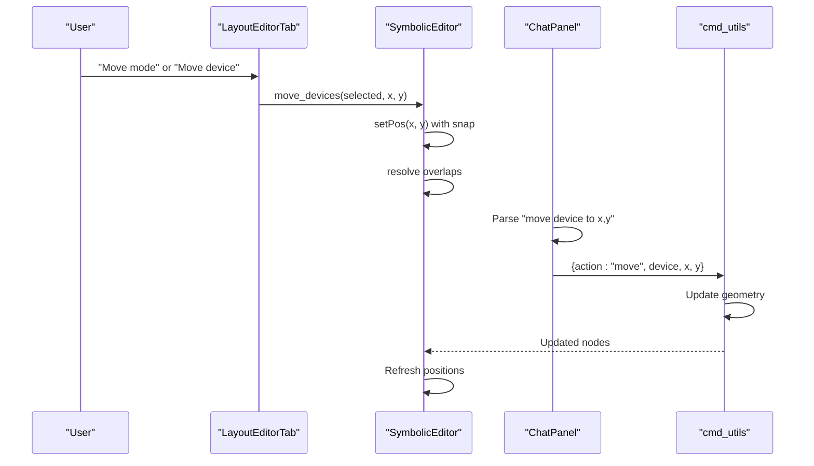

**Diagram sources**
- [layout_tab.py:421-481](file://symbolic_editor/layout_tab.py#L421-L481)
- [editor_view.py:785-820](file://symbolic_editor/editor_view.py#L785-L820)
- [chat_panel.py:705-731](file://symbolic_editor/chat_panel.py#L705-L731)
- [cmd_utils.py:130-145](file://ai_agent/ai_chat_bot/cmd_utils.py#L130-L145)

**Section sources**
- [layout_tab.py:421-481](file://symbolic_editor/layout_tab.py#L421-L481)
- [editor_view.py:785-820](file://symbolic_editor/editor_view.py#L785-L820)
- [chat_panel.py:705-731](file://symbolic_editor/chat_panel.py#L705-L731)
- [cmd_utils.py:130-145](file://ai_agent/ai_chat_bot/cmd_utils.py#L130-L145)

### Swap Operation
- Canvas-level swap: select exactly two devices and swap their positions and orientations.
- AI swap: ChatPanel recognizes natural-language swap patterns and emits structured commands.

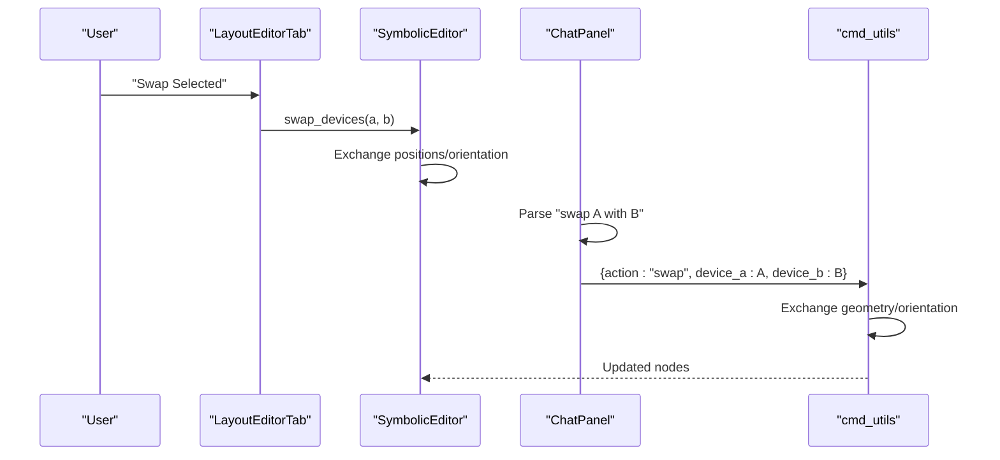

**Diagram sources**
- [layout_tab.py:740-748](file://symbolic_editor/layout_tab.py#L740-L748)
- [editor_view.py:785-820](file://symbolic_editor/editor_view.py#L785-L820)
- [chat_panel.py:667-703](file://symbolic_editor/chat_panel.py#L667-L703)
- [cmd_utils.py:118-128](file://ai_agent/ai_chat_bot/cmd_utils.py#L118-L128)

**Section sources**
- [layout_tab.py:740-748](file://symbolic_editor/layout_tab.py#L740-L748)
- [editor_view.py:785-820](file://symbolic_editor/editor_view.py#L785-L820)
- [chat_panel.py:667-703](file://symbolic_editor/chat_panel.py#L667-L703)
- [cmd_utils.py:118-128](file://ai_agent/ai_chat_bot/cmd_utils.py#L118-L128)

### Delete Operation
- Canvas-level delete: remove selected devices from the scene and nodes list.
- AI delete: ChatPanel can infer deletion intent; cmd_utils removes devices from nodes.

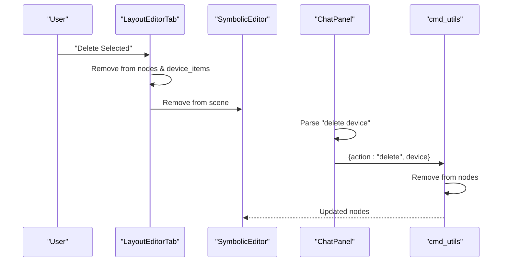

**Diagram sources**
- [layout_tab.py:805-820](file://symbolic_editor/layout_tab.py#L805-L820)
- [chat_panel.py:656-787](file://symbolic_editor/chat_panel.py#L656-L787)
- [cmd_utils.py:154-157](file://ai_agent/ai_chat_bot/cmd_utils.py#L154-L157)

**Section sources**
- [layout_tab.py:805-820](file://symbolic_editor/layout_tab.py#L805-L820)
- [chat_panel.py:656-787](file://symbolic_editor/chat_panel.py#L656-L787)
- [cmd_utils.py:154-157](file://ai_agent/ai_chat_bot/cmd_utils.py#L154-L157)

### Flip Operations (Horizontal/Vertical)
- Canvas-level flip: flip selected devices horizontally or vertically; DeviceItem stores flip state and orientation string.
- AI flip: ChatPanel recognizes flip intents; cmd_utils updates orientation tokens.

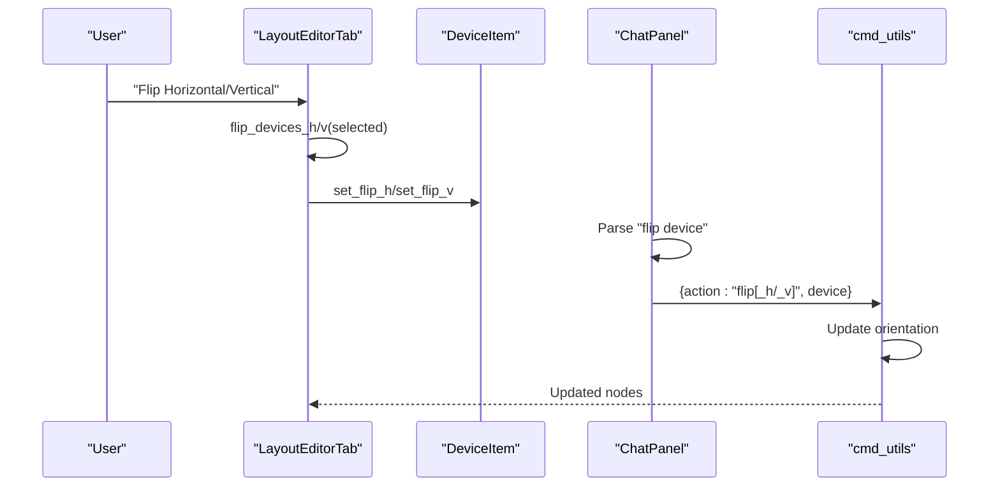

**Diagram sources**
- [layout_tab.py:789-804](file://symbolic_editor/layout_tab.py#L789-L804)
- [device_item.py:155-188](file://symbolic_editor/device_item.py#L155-L188)
- [chat_panel.py:656-787](file://symbolic_editor/chat_panel.py#L656-L787)
- [cmd_utils.py:147-152](file://ai_agent/ai_chat_bot/cmd_utils.py#L147-L152)

**Section sources**
- [layout_tab.py:789-804](file://symbolic_editor/layout_tab.py#L789-L804)
- [device_item.py:155-188](file://symbolic_editor/device_item.py#L155-L188)
- [chat_panel.py:656-787](file://symbolic_editor/chat_panel.py#L656-L787)
- [cmd_utils.py:147-152](file://ai_agent/ai_chat_bot/cmd_utils.py#L147-L152)

### Batch Selection and Multi-Device Operations
- Select all devices and operate on multiple selections (swap requires exactly two; flip/delete operate on any selection).
- Hierarchical group movement: dragging one finger moves the entire parent group; sibling groups are wired to propagate movement.

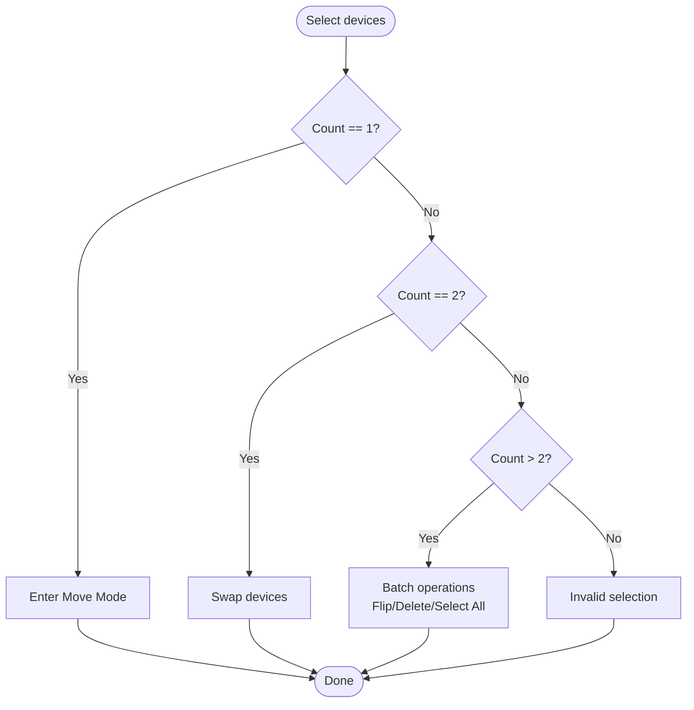

**Diagram sources**
- [layout_tab.py:421-447](file://symbolic_editor/layout_tab.py#L421-L447)
- [layout_tab.py:736-748](file://symbolic_editor/layout_tab.py#L736-L748)
- [layout_tab.py:789-804](file://symbolic_editor/layout_tab.py#L789-L804)
- [layout_tab.py:805-820](file://symbolic_editor/layout_tab.py#L805-L820)

**Section sources**
- [layout_tab.py:421-447](file://symbolic_editor/layout_tab.py#L421-L447)
- [layout_tab.py:736-748](file://symbolic_editor/layout_tab.py#L736-L748)
- [layout_tab.py:789-804](file://symbolic_editor/layout_tab.py#L789-L804)
- [layout_tab.py:805-820](file://symbolic_editor/layout_tab.py#L805-L820)

### Selection Filtering
- Hierarchy-aware selection: the scene blocks selection of devices outside the descended hierarchy to prevent unintended operations.
- Selection count and grid indicators update in real-time.

**Section sources**
- [editor_view.py:46-79](file://symbolic_editor/editor_view.py#L46-L79)
- [layout_tab.py:629-632](file://symbolic_editor/layout_tab.py#L629-L632)

### Dummy Device Placement Workflow
- Toggle dummy mode from toolbar; live ghost preview follows cursor at 55% opacity.
- Candidate computation finds the nearest row (PMOS/NMOS) and free grid slot; preview updates type if row boundary changes.
- Commit places the dummy at the computed candidate and invokes the callback to add the device.

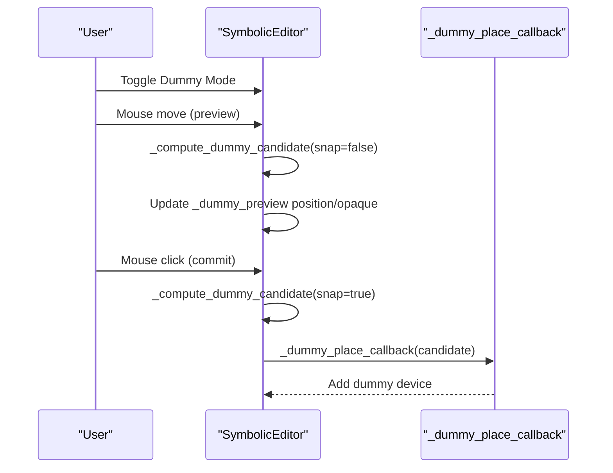

**Diagram sources**
- [editor_view.py:192-203](file://symbolic_editor/editor_view.py#L192-L203)
- [editor_view.py:246-290](file://symbolic_editor/editor_view.py#L246-L290)
- [editor_view.py:301-347](file://symbolic_editor/editor_view.py#L301-L347)
- [editor_view.py:340-347](file://symbolic_editor/editor_view.py#L340-L347)

**Section sources**
- [README.md:75-80](file://README.md#L75-L80)
- [editor_view.py:192-203](file://symbolic_editor/editor_view.py#L192-L203)
- [editor_view.py:246-290](file://symbolic_editor/editor_view.py#L246-L290)
- [editor_view.py:301-347](file://symbolic_editor/editor_view.py#L301-L347)
- [editor_view.py:340-347](file://symbolic_editor/editor_view.py#L340-L347)

### Device Transformation Operations and Orientation Changes
- Orientation tokens encode base orientation plus flips (e.g., R0, R0_FH, R0_FV, R0_FH_FV).
- DeviceItem exposes orientation_string and flip state; SymbolicEditor applies flips to selected items.
- Coordinate system conversion: layout JSON uses upward-y convention; the editor negates y for Qt’s downward-y display and restores upon export.

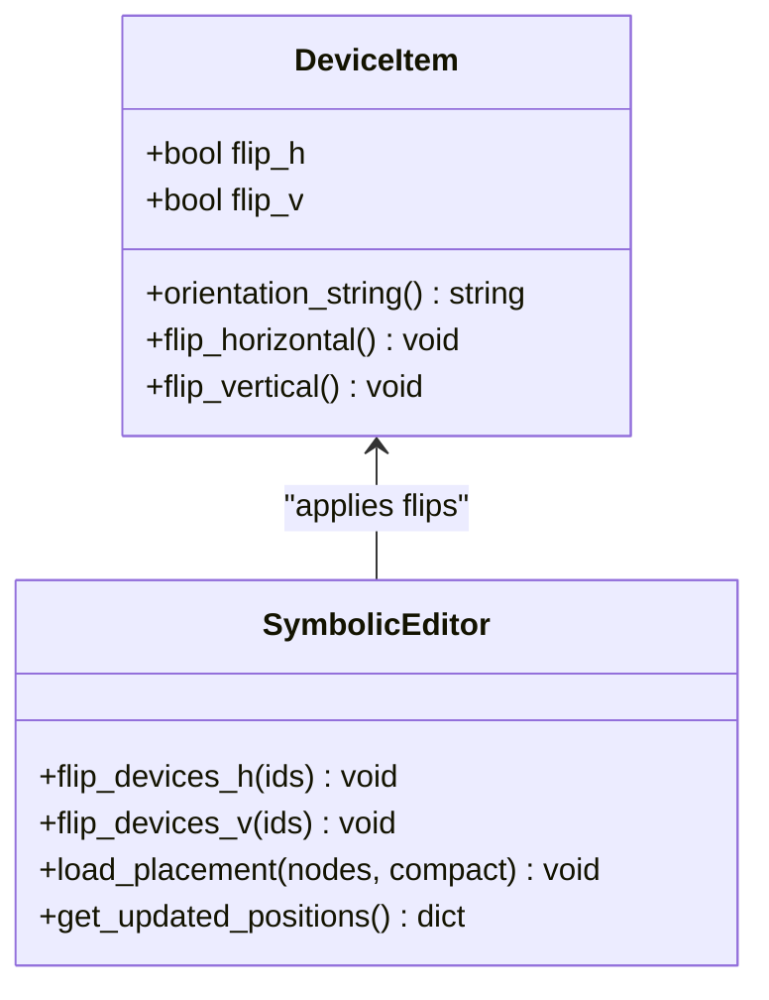

**Diagram sources**
- [device_item.py:155-188](file://symbolic_editor/device_item.py#L155-L188)
- [editor_view.py:789-820](file://symbolic_editor/editor_view.py#L789-L820)
- [editor_view.py:352-466](file://symbolic_editor/editor_view.py#L352-L466)

**Section sources**
- [device_item.py:155-188](file://symbolic_editor/device_item.py#L155-L188)
- [editor_view.py:789-820](file://symbolic_editor/editor_view.py#L789-L820)
- [editor_view.py:352-466](file://symbolic_editor/editor_view.py#L352-L466)

### Practical Manipulation Workflows
- Swap two adjacent transistors to adjust matching or symmetry.
- Flip devices to align terminals for abutment or improve routing.
- Move devices to resolve congestion while maintaining PMOS above NMOS constraints enforced by cmd_utils.
- Use dummy placement to pre-position placeholders and confirm placement before committing.

**Section sources**
- [README.md:59-80](file://README.md#L59-L80)
- [layout_tab.py:740-748](file://symbolic_editor/layout_tab.py#L740-L748)
- [cmd_utils.py:159-168](file://ai_agent/ai_chat_bot/cmd_utils.py#L159-L168)

### Integration with AI Assistance System
- Natural language commands are extracted and normalized by ChatPanel (swap, move, add dummy).
- AI placement workers generate move commands; finalization builds a list of [CMD] actions applied via cmd_utils.
- Device conservation checks ensure no devices are lost or hallucinated.

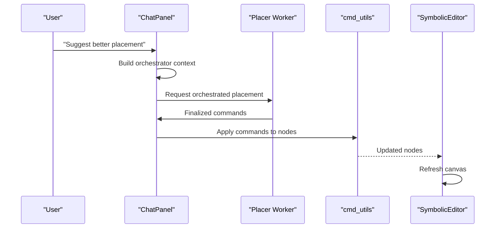

**Diagram sources**
- [chat_panel.py:584-651](file://symbolic_editor/chat_panel.py#L584-L651)
- [placer_graph_worker.py:108-143](file://ai_agent/ai_initial_placement/placer_graph_worker.py#L108-L143)
- [cmd_utils.py:109-171](file://ai_agent/ai_chat_bot/cmd_utils.py#L109-L171)

**Section sources**
- [chat_panel.py:584-651](file://symbolic_editor/chat_panel.py#L584-L651)
- [placer_graph_worker.py:108-143](file://ai_agent/ai_initial_placement/placer_graph_worker.py#L108-L143)
- [cmd_utils.py:109-171](file://ai_agent/ai_chat_bot/cmd_utils.py#L109-L171)

## Dependency Analysis
The manipulation system exhibits clear separation of concerns:
- GUI actions are routed through LayoutEditorTab to SymbolicEditor.
- DeviceItem encapsulates rendering and flip state.
- AI commands are parsed and applied via cmd_utils, which validates constraints.
- AbutmentEngine supports layout constraints for AI placement.

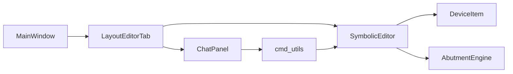

**Diagram sources**
- [main.py:127-148](file://symbolic_editor/main.py#L127-L148)
- [layout_tab.py:64-110](file://symbolic_editor/layout_tab.py#L64-L110)
- [editor_view.py:81-120](file://symbolic_editor/editor_view.py#L81-L120)
- [device_item.py:17-56](file://symbolic_editor/device_item.py#L17-L56)
- [chat_panel.py:95-120](file://symbolic_editor/chat_panel.py#L95-L120)
- [cmd_utils.py:109-171](file://ai_agent/ai_chat_bot/cmd_utils.py#L109-L171)
- [abutment_engine.py:65-82](file://symbolic_editor/abutment_engine.py#L65-L82)

**Section sources**
- [main.py:127-148](file://symbolic_editor/main.py#L127-L148)
- [layout_tab.py:64-110](file://symbolic_editor/layout_tab.py#L64-L110)
- [editor_view.py:81-120](file://symbolic_editor/editor_view.py#L81-L120)
- [device_item.py:17-56](file://symbolic_editor/device_item.py#L17-L56)
- [chat_panel.py:95-120](file://symbolic_editor/chat_panel.py#L95-L120)
- [cmd_utils.py:109-171](file://ai_agent/ai_chat_bot/cmd_utils.py#L109-L171)
- [abutment_engine.py:65-82](file://symbolic_editor/abutment_engine.py#L65-L82)

## Performance Considerations
- Grid snapping and row-pitch computations are derived from device sizes to maintain efficient placement and rendering.
- Outline rendering mode reduces visual overhead for large layouts.
- Hierarchical group movement avoids redundant updates by propagating deltas once per group.

[No sources needed since this section provides general guidance]

## Troubleshooting Guide
Common issues and resolutions:
- Invalid selection counts:
  - Swap requires exactly two devices; the tab displays an AI message and aborts otherwise.
  - Move mode requires exactly one device; otherwise, an AI message is appended.
- PMOS/NMOS ordering violations:
  - cmd_utils enforces row ordering by reverting non-forced Y moves that violate PMOS above NMOS.
- Device conservation failures:
  - AI tools validate that all original devices are preserved; missing or extra devices trigger warnings.
- Dummy placement:
  - If no transistors are present, dummy candidate computation returns None; ensure a layout is loaded before placing dummies.

**Section sources**
- [layout_tab.py:740-748](file://symbolic_editor/layout_tab.py#L740-L748)
- [layout_tab.py:421-447](file://symbolic_editor/layout_tab.py#L421-L447)
- [cmd_utils.py:159-168](file://ai_agent/ai_chat_bot/cmd_utils.py#L159-L168)
- [editor_view.py:246-290](file://symbolic_editor/editor_view.py#L246-L290)

## Conclusion
The device manipulation tools provide a robust, keyboard-driven, and AI-integrated workflow for editing analog layouts. Users can perform precise operations like move, swap, delete, and flip, leverage batch selection for multi-device workflows, and utilize dummy placement previews for guided insertion. The AI assistant understands natural language commands and can execute complex operations, while built-in validators ensure layout integrity and device conservation.