# Device Types and Items

<cite>
**Referenced Files in This Document**
- [device_item.py](file://symbolic_editor/device_item.py)
- [passive_item.py](file://symbolic_editor/passive_item.py)
- [block_item.py](file://symbolic_editor/block_item.py)
- [hierarchy_group_item.py](file://symbolic_editor/hierarchy_group_item.py)
- [editor_view.py](file://symbolic_editor/editor_view.py)
- [abutment_engine.py](file://symbolic_editor/abutment_engine.py)
- [properties_panel.py](file://symbolic_editor/properties_panel.py)
- [circuit_graph.py](file://parser/circuit_graph.py)
- [device_matcher.py](file://parser/device_matcher.py)
- [hierarchy.py](file://parser/hierarchy.py)
- [Miller_OTA_graph_compressed.json](file://examples/Miller_OTA/Miller_OTA_graph_compressed.json)
- [export_json.py](file://export/export_json.py)
</cite>

## Table of Contents
1. [Introduction](#introduction)
2. [Project Structure](#project-structure)
3. [Core Components](#core-components)
4. [Architecture Overview](#architecture-overview)
5. [Detailed Component Analysis](#detailed-component-analysis)
6. [Dependency Analysis](#dependency-analysis)
7. [Performance Considerations](#performance-considerations)
8. [Troubleshooting Guide](#troubleshooting-guide)
9. [Conclusion](#conclusion)
10. [Appendices](#appendices)

## Introduction
This document explains the device type system and item representations used in the symbolic editor. It covers:
- PMOS/NMOS transistor devices, including multi-finger configurations and electrical properties
- Resistor and capacitor implementations with geometric properties and rendering modes
- Block items for hierarchical circuit organization and device grouping
- Device item lifecycle, rendering modes (detailed vs outline), and visual styling
- Device property management, parameter validation, and integration with the circuit hierarchy system
- Practical examples of device creation, modification, and property updates

## Project Structure
The device system is implemented primarily in the symbolic editor module with supporting parsers and exporters:
- Device visuals and interactions: DeviceItem, ResistorItem, CapacitorItem, BlockItem, HierarchyGroupItem
- Editor orchestration and hierarchy building: SymbolicEditor, HierarchyAwareScene
- Abutment detection and highlighting: abutment_engine
- Property inspection: PropertiesPanel
- Circuit graph and hierarchy modeling: circuit_graph, device_matcher, hierarchy
- Example data and export pipeline: Miller_OTA_graph_compressed.json, export_json

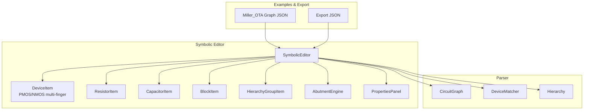

**Diagram sources**
- [device_item.py:17-508](file://symbolic_editor/device_item.py#L17-L508)
- [passive_item.py:135-313](file://symbolic_editor/passive_item.py#L135-L313)
- [block_item.py:11-144](file://symbolic_editor/block_item.py#L11-L144)
- [hierarchy_group_item.py:28-236](file://symbolic_editor/hierarchy_group_item.py#L28-L236)
- [editor_view.py:81-2078](file://symbolic_editor/editor_view.py#L81-L2078)
- [abutment_engine.py:65-225](file://symbolic_editor/abutment_engine.py#L65-L225)
- [properties_panel.py:24-263](file://symbolic_editor/properties_panel.py#L24-L263)
- [circuit_graph.py:131-191](file://parser/circuit_graph.py#L131-L191)
- [device_matcher.py:85-151](file://parser/device_matcher.py#L85-L151)
- [hierarchy.py:219-475](file://parser/hierarchy.py#L219-L475)
- [Miller_OTA_graph_compressed.json:1-186](file://examples/Miller_OTA/Miller_OTA_graph_compressed.json#L1-L186)
- [export_json.py:4-58](file://export/export_json.py#L4-L58)

**Section sources**
- [editor_view.py:81-2078](file://symbolic_editor/editor_view.py#L81-L2078)
- [device_item.py:17-508](file://symbolic_editor/device_item.py#L17-L508)
- [passive_item.py:135-313](file://symbolic_editor/passive_item.py#L135-L313)
- [block_item.py:11-144](file://symbolic_editor/block_item.py#L11-L144)
- [hierarchy_group_item.py:28-236](file://symbolic_editor/hierarchy_group_item.py#L28-L236)
- [abutment_engine.py:65-225](file://symbolic_editor/abutment_engine.py#L65-L225)
- [properties_panel.py:24-263](file://symbolic_editor/properties_panel.py#L24-L263)
- [circuit_graph.py:131-191](file://parser/circuit_graph.py#L131-L191)
- [device_matcher.py:85-151](file://parser/device_matcher.py#L85-L151)
- [hierarchy.py:219-475](file://parser/hierarchy.py#L219-L475)
- [Miller_OTA_graph_compressed.json:1-186](file://examples/Miller_OTA/Miller_OTA_graph_compressed.json#L1-L186)
- [export_json.py:4-58](file://export/export_json.py#L4-L58)

## Core Components
- DeviceItem: Visual representation of PMOS/NMOS transistors with multi-finger rendering, abutment flags, match highlighting, orientation flips, and terminal anchors.
- ResistorItem and CapacitorItem: Visual symbols for passive components with zig-zag and parallel-plate geometries, pin labels, and value formatting helpers.
- BlockItem: Hierarchical grouping overlay for device blocks with movable bounding boxes and header labels.
- HierarchyGroupItem: Bounding box wrapper for arrays/multipliers/fingers; supports descent/ascend navigation and rigid-body movement.
- SymbolicEditor: Central canvas managing device creation, hierarchy groups, rendering modes, and grid snapping.
- AbutmentEngine: Detects abutment candidates across transistors and builds highlight maps for edge sharing.
- PropertiesPanel: Read-only inspector for device and block properties derived from node data and terminal nets.
- Parser modules: Build circuit graphs, match devices to layout instances, and model hierarchy with multipliers and fingers.

**Section sources**
- [device_item.py:17-508](file://symbolic_editor/device_item.py#L17-L508)
- [passive_item.py:135-313](file://symbolic_editor/passive_item.py#L135-L313)
- [block_item.py:11-144](file://symbolic_editor/block_item.py#L11-L144)
- [hierarchy_group_item.py:28-236](file://symbolic_editor/hierarchy_group_item.py#L28-L236)
- [editor_view.py:81-2078](file://symbolic_editor/editor_view.py#L81-L2078)
- [abutment_engine.py:65-225](file://symbolic_editor/abutment_engine.py#L65-L225)
- [properties_panel.py:175-263](file://symbolic_editor/properties_panel.py#L175-L263)
- [circuit_graph.py:131-191](file://parser/circuit_graph.py#L131-L191)
- [device_matcher.py:85-151](file://parser/device_matcher.py#L85-L151)
- [hierarchy.py:219-475](file://parser/hierarchy.py#L219-L475)

## Architecture Overview
The device system integrates visual items with the editor’s hierarchy and property management. Devices are loaded from JSON nodes, grouped into hierarchy groups, and rendered in either detailed or outline modes. Passive devices are handled similarly but with simpler geometry. Blocks wrap device groups for organizational purposes.

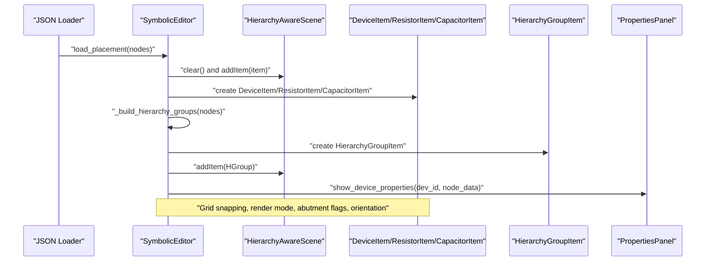

**Diagram sources**
- [editor_view.py:352-452](file://symbolic_editor/editor_view.py#L352-L452)
- [editor_view.py:472-692](file://symbolic_editor/editor_view.py#L472-L692)
- [device_item.py:19-508](file://symbolic_editor/device_item.py#L19-L508)
- [passive_item.py:146-313](file://symbolic_editor/passive_item.py#L146-L313)
- [hierarchy_group_item.py:38-236](file://symbolic_editor/hierarchy_group_item.py#L38-L236)
- [properties_panel.py:175-234](file://symbolic_editor/properties_panel.py#L175-L234)

## Detailed Component Analysis

### PMOS/NMOS Transistor DeviceItem
- Multi-finger rendering: The device paints alternating Source/Drain and Gate strips with equal visual width. Flip transforms handle horizontal/vertical mirroring.
- Electrical properties: nf (fingers), l (length), w (width), nfin (fins) are carried in node data and used for rendering and hierarchy.
- Rendering modes: “detailed” draws multi-finger structure with gradients and labels; “outline” draws a simplified border with device name.
- Abutment and matching: Manual abutment flags (left/right) and match highlighting enable visual feedback for diffusion sharing and matched groups.
- Terminal anchors: Center positions for S/G/D terminals are computed based on finger count and orientation, enabling routing.
- Orientation and flip: Compact orientation string encodes horizontal/vertical flips for export/import.

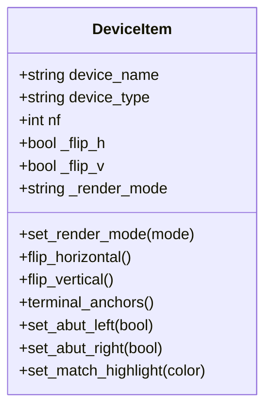

**Diagram sources**
- [device_item.py:17-508](file://symbolic_editor/device_item.py#L17-L508)

**Section sources**
- [device_item.py:17-508](file://symbolic_editor/device_item.py#L17-L508)

### ResistorItem and CapacitorItem
- ResistorItem: Amber/gold zig-zag body with lead wires, terminal dots, and pin labels “1”/“2”. Uses a helper to format SI values.
- CapacitorItem: Teal parallel-plate body with lead wires, plates, terminal dots, and pin labels “+”/“−”.
- Shared behavior: Both inherit from a common base with drag/snap/orientation interface and terminal anchors mapped to “1”/“2” and aliases “S”/“G”/“D”.

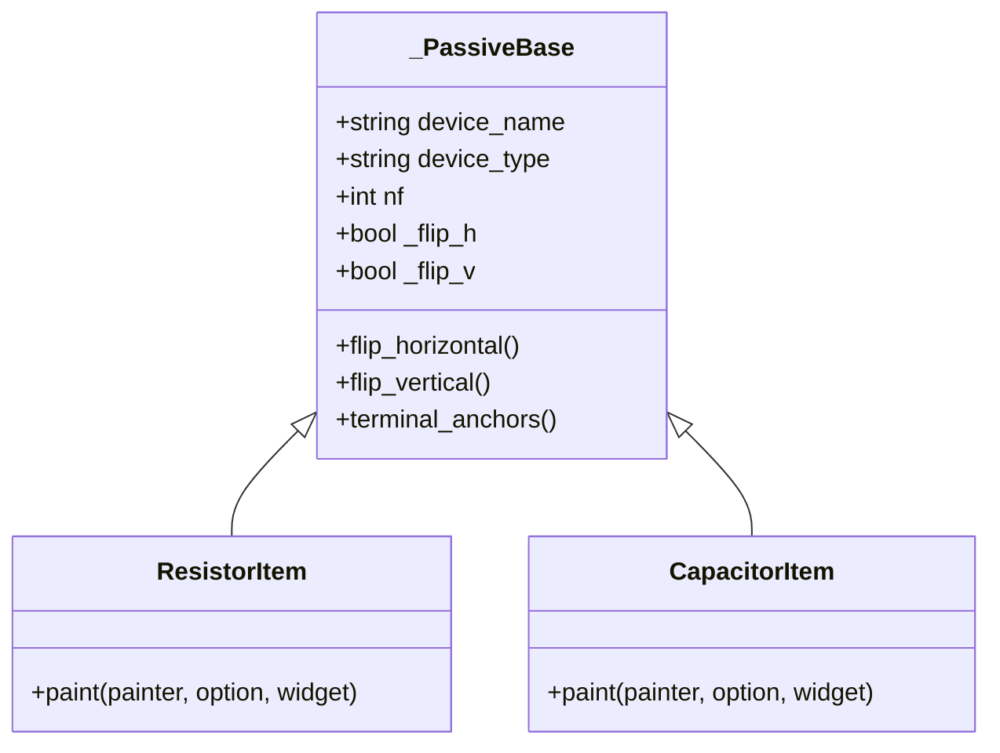

**Diagram sources**
- [passive_item.py:24-313](file://symbolic_editor/passive_item.py#L24-L313)

**Section sources**
- [passive_item.py:135-313](file://symbolic_editor/passive_item.py#L135-L313)

### BlockItem for Hierarchical Organization
- Bounding box: Computed from union of child device bounding boxes; positioned flush to top-left.
- Movement: Moves all child devices together; emits position change signals.
- Visual style: Rounded header bar with instance and subckt label; selection highlight adjusts border brightness.

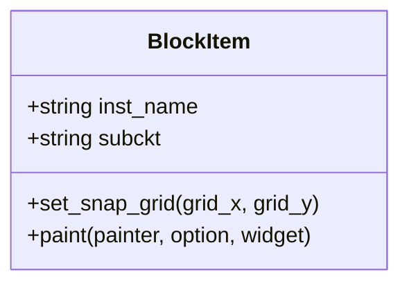

**Diagram sources**
- [block_item.py:11-144](file://symbolic_editor/block_item.py#L11-L144)

**Section sources**
- [block_item.py:11-144](file://symbolic_editor/block_item.py#L11-L144)

### HierarchyGroupItem for Arrays/Multipliers/Fingers
- Bounding box: Union of child DeviceItems; header bar enables descent/ascend navigation.
- Visibility: When descended, hides itself and shows children; when ascended, shows itself and hides children.
- Signals: Emits drag finished, descend/ascend requests; editor wires these to synchronization and navigation.
- Z-order: Below DeviceItems to allow device drag events to be captured first.

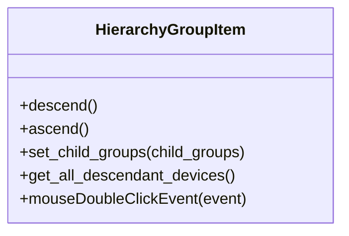

**Diagram sources**
- [hierarchy_group_item.py:28-236](file://symbolic_editor/hierarchy_group_item.py#L28-L236)

**Section sources**
- [hierarchy_group_item.py:28-236](file://symbolic_editor/hierarchy_group_item.py#L28-L236)

### Device Lifecycle and Rendering Modes
- Creation: Devices are instantiated from node data with geometry and electrical parameters; render mode is set according to editor preferences.
- Movement: Grid snapping is configurable; drag propagation synchronizes sibling groups for matched devices.
- Rendering: Detailed mode shows multi-finger structure; outline mode shows a simplified border with device name.
- Orientation: Flips are persisted via orientation strings for export/import.

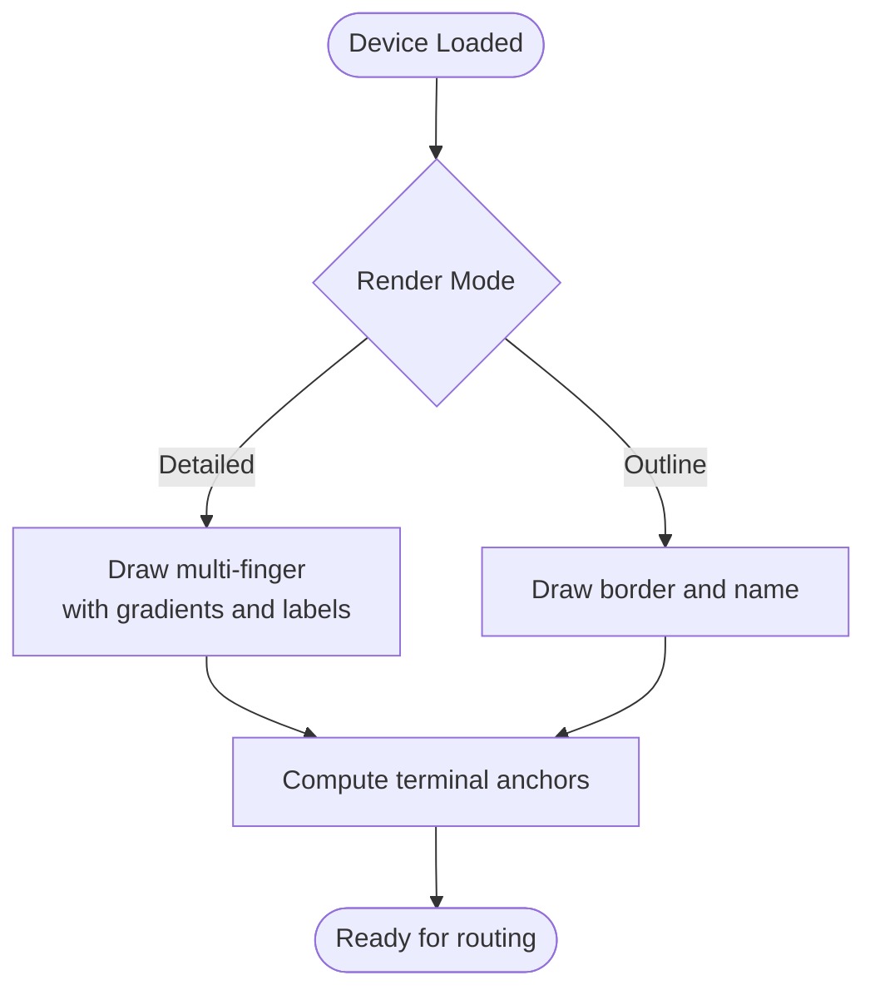

**Diagram sources**
- [device_item.py:247-452](file://symbolic_editor/device_item.py#L247-L452)
- [editor_view.py:204-220](file://symbolic_editor/editor_view.py#L204-L220)

**Section sources**
- [device_item.py:190-243](file://symbolic_editor/device_item.py#L190-L243)
- [editor_view.py:204-220](file://symbolic_editor/editor_view.py#L204-L220)

### Visual Styling and Highlights
- Color palette: Per device type with source/gate/drains/border/labels; special dummy color scheme.
- Match highlighting: Persistent colored border for matched groups; lock badge shown on devices.
- Abutment highlights: Manual abutment flags draw amber stripes on left/right edges with tick marks.

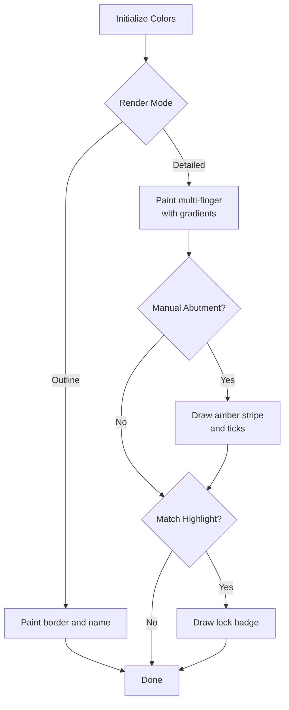

**Diagram sources**
- [device_item.py:57-84](file://symbolic_editor/device_item.py#L57-L84)
- [device_item.py:344-452](file://symbolic_editor/device_item.py#L344-L452)

**Section sources**
- [device_item.py:57-84](file://symbolic_editor/device_item.py#L57-L84)
- [device_item.py:344-452](file://symbolic_editor/device_item.py#L344-L452)

### Device Property Management and Validation
- Node data: Devices carry type, electrical parameters (l, w, nf, nfin, m), geometry (x, y, width, height, orientation), and terminal nets.
- Properties panel: Displays device, electrical, hierarchy, connections, and geometry groups.
- Parameter validation: Hierarchy module extracts integers safely, clamps non-positive values, and warns on invalid inputs.

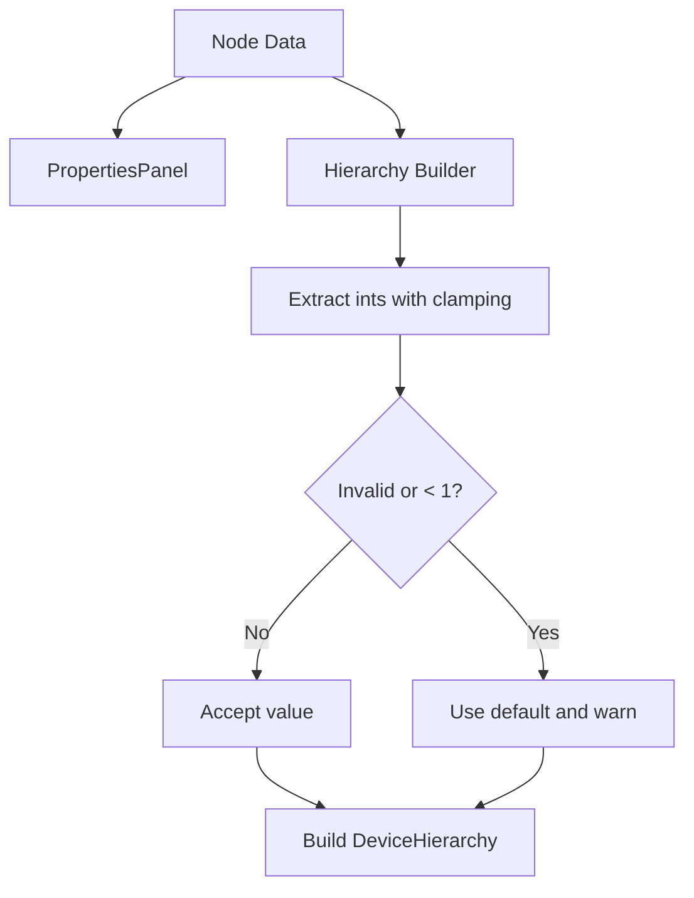

**Diagram sources**
- [properties_panel.py:175-234](file://symbolic_editor/properties_panel.py#L175-L234)
- [hierarchy.py:99-127](file://parser/hierarchy.py#L99-L127)

**Section sources**
- [properties_panel.py:175-234](file://symbolic_editor/properties_panel.py#L175-L234)
- [hierarchy.py:99-127](file://parser/hierarchy.py#L99-L127)

### Integration with Circuit Hierarchy System
- Device matching: Matches netlist devices to layout instances by type and logical parent; collapses expanded multi-finger netlists onto shared layout instances.
- Hierarchy construction: Builds DeviceHierarchy with multipliers (m), fingers (nf), and array flags; generates leaf devices with parent pointers.
- Circuit graph: Adds electrical edges based on net classification (shared gate, shared source/drain, etc.) and merges with layout geometry.

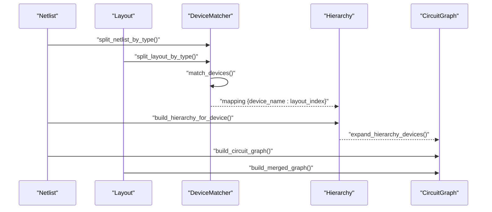

**Diagram sources**
- [device_matcher.py:85-151](file://parser/device_matcher.py#L85-L151)
- [hierarchy.py:219-475](file://parser/hierarchy.py#L219-L475)
- [circuit_graph.py:131-191](file://parser/circuit_graph.py#L131-L191)

**Section sources**
- [device_matcher.py:85-151](file://parser/device_matcher.py#L85-L151)
- [hierarchy.py:219-475](file://parser/hierarchy.py#L219-L475)
- [circuit_graph.py:131-191](file://parser/circuit_graph.py#L131-L191)

### Abutment Detection and Edge Highlighting
- Candidate detection: Scans same-type transistors for shared S/D nets; enforces consecutive fingers within the same parent; selects one candidate per parent pair to avoid combinatorial explosion.
- Highlight map: Maps each device to left/right edge highlights based on terminal and flip state.

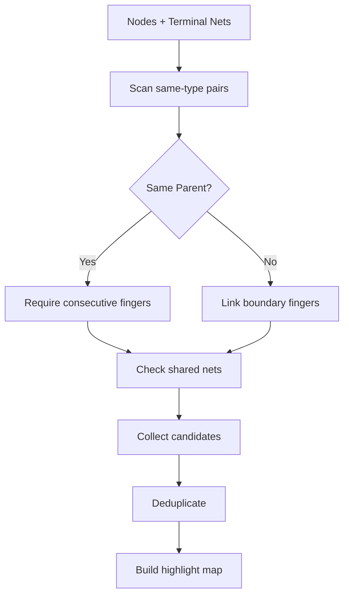

**Diagram sources**
- [abutment_engine.py:65-181](file://symbolic_editor/abutment_engine.py#L65-L181)
- [abutment_engine.py:198-225](file://symbolic_editor/abutment_engine.py#L198-L225)

**Section sources**
- [abutment_engine.py:65-181](file://symbolic_editor/abutment_engine.py#L65-L181)
- [abutment_engine.py:198-225](file://symbolic_editor/abutment_engine.py#L198-L225)

### Examples of Device Creation, Modification, and Property Updates
- Creating devices from JSON: The editor loads nodes with geometry and electrical parameters, instantiating DeviceItem, ResistorItem, or CapacitorItem accordingly.
- Modifying properties: Properties panel displays device and hierarchy fields; changes can be made in the node data and reflected in the UI.
- Updating render mode: The editor exposes methods to switch between detailed and outline modes for all devices.

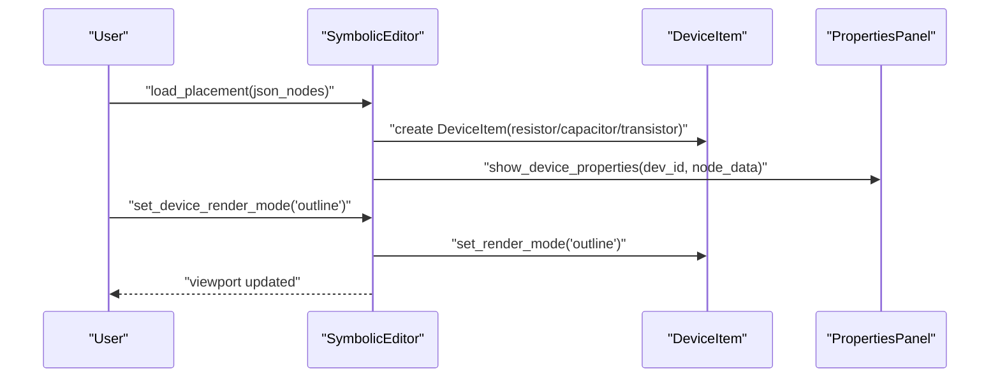

**Diagram sources**
- [editor_view.py:352-452](file://symbolic_editor/editor_view.py#L352-L452)
- [editor_view.py:204-220](file://symbolic_editor/editor_view.py#L204-L220)
- [properties_panel.py:175-234](file://symbolic_editor/properties_panel.py#L175-L234)

**Section sources**
- [editor_view.py:352-452](file://symbolic_editor/editor_view.py#L352-L452)
- [editor_view.py:204-220](file://symbolic_editor/editor_view.py#L204-L220)
- [properties_panel.py:175-234](file://symbolic_editor/properties_panel.py#L175-L234)

## Dependency Analysis
- DeviceItem depends on PySide6 for painting and Qt graphics primitives; it encapsulates device visuals and interactions.
- Passive items reuse a shared base class to minimize duplication.
- SymbolicEditor orchestrates device creation, hierarchy groups, and property panels; it manages grid snapping and render modes.
- AbutmentEngine is decoupled and operates on node data and terminal nets.
- Parser modules provide independent utilities for matching, hierarchy modeling, and graph building.

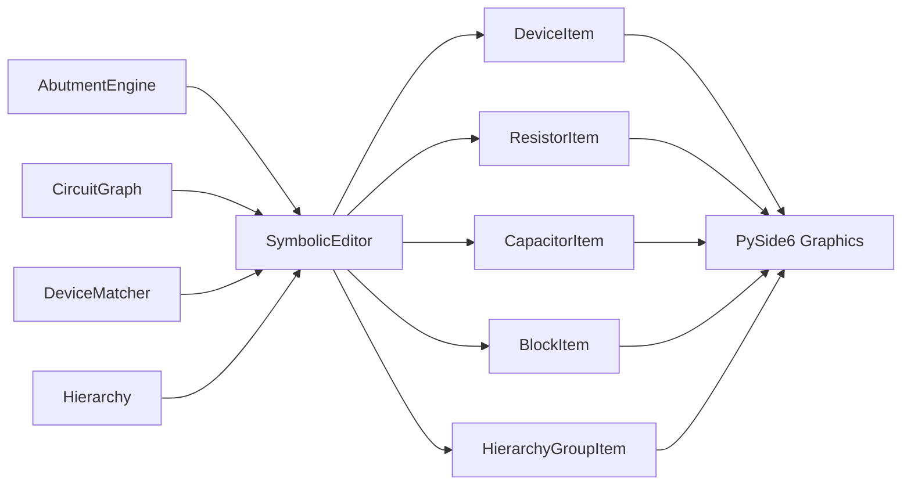

**Diagram sources**
- [device_item.py:1-10](file://symbolic_editor/device_item.py#L1-L10)
- [passive_item.py:10-16](file://symbolic_editor/passive_item.py#L10-L16)
- [block_item.py:1-4](file://symbolic_editor/block_item.py#L1-L4)
- [hierarchy_group_item.py:14-17](file://symbolic_editor/hierarchy_group_item.py#L14-L17)
- [editor_view.py:22-37](file://symbolic_editor/editor_view.py#L22-L37)
- [abutment_engine.py:38-40](file://symbolic_editor/abutment_engine.py#L38-L40)
- [circuit_graph.py:7-8](file://parser/circuit_graph.py#L7-L8)
- [device_matcher.py:8-11](file://parser/device_matcher.py#L8-L11)
- [hierarchy.py:24-35](file://parser/hierarchy.py#L24-L35)

**Section sources**
- [device_item.py:1-10](file://symbolic_editor/device_item.py#L1-L10)
- [passive_item.py:10-16](file://symbolic_editor/passive_item.py#L10-L16)
- [block_item.py:1-4](file://symbolic_editor/block_item.py#L1-L4)
- [hierarchy_group_item.py:14-17](file://symbolic_editor/hierarchy_group_item.py#L14-L17)
- [editor_view.py:22-37](file://symbolic_editor/editor_view.py#L22-L37)
- [abutment_engine.py:38-40](file://symbolic_editor/abutment_engine.py#L38-L40)
- [circuit_graph.py:7-8](file://parser/circuit_graph.py#L7-L8)
- [device_matcher.py:8-11](file://parser/device_matcher.py#L8-L11)
- [hierarchy.py:24-35](file://parser/hierarchy.py#L24-L35)

## Performance Considerations
- Rendering modes: Outline mode reduces drawing complexity for large layouts.
- Snapping and grid: Disabling per-item snapping preserves original coordinates until user interaction; enables precise exports.
- Hierarchy visibility: Descending/ascending toggles minimize visual clutter and improve responsiveness.
- Abutment candidate filtering: Limits cross-parent checks to a single representative per parent pair to avoid O(N^2) combinatorics.

[No sources needed since this section provides general guidance]

## Troubleshooting Guide
- Device not selectable in non-descended hierarchy: The custom scene blocks selection for devices in non-descended groups; descend the hierarchy to enable selection.
- Abutment not applied: Verify that the abutment flags are set and that the devices share a non-power net on matching terminals; ensure consecutive fingers for same-parent pairs.
- Render mode not updating: Ensure the editor’s global render mode is set and propagated to DeviceItem instances.
- Property panel blank: Confirm that node data and terminal nets are present; the panel requires both to populate device and connection groups.

**Section sources**
- [editor_view.py:46-79](file://symbolic_editor/editor_view.py#L46-L79)
- [abutment_engine.py:65-181](file://symbolic_editor/abutment_engine.py#L65-L181)
- [editor_view.py:204-220](file://symbolic_editor/editor_view.py#L204-L220)
- [properties_panel.py:175-234](file://symbolic_editor/properties_panel.py#L175-L234)

## Conclusion
The device type system provides robust visual representations for PMOS/NMOS transistors with multi-finger configurations, along with resistors and capacitors. It integrates tightly with the editor’s hierarchy and property management, supports flexible rendering modes, and offers powerful abutment detection for diffusion sharing. The parser modules ensure accurate mapping between netlist and layout, enabling precise device grouping and property validation.

[No sources needed since this section summarizes without analyzing specific files]

## Appendices

### Example Data and Export
- Example graph JSON demonstrates device types, electrical parameters, terminal nets, and DRC rules.
- Export pipeline converts merged graphs to JSON with nodes and edges for AI placement.

**Section sources**
- [Miller_OTA_graph_compressed.json:1-186](file://examples/Miller_OTA/Miller_OTA_graph_compressed.json#L1-L186)
- [export_json.py:4-58](file://export/export_json.py#L4-L58)