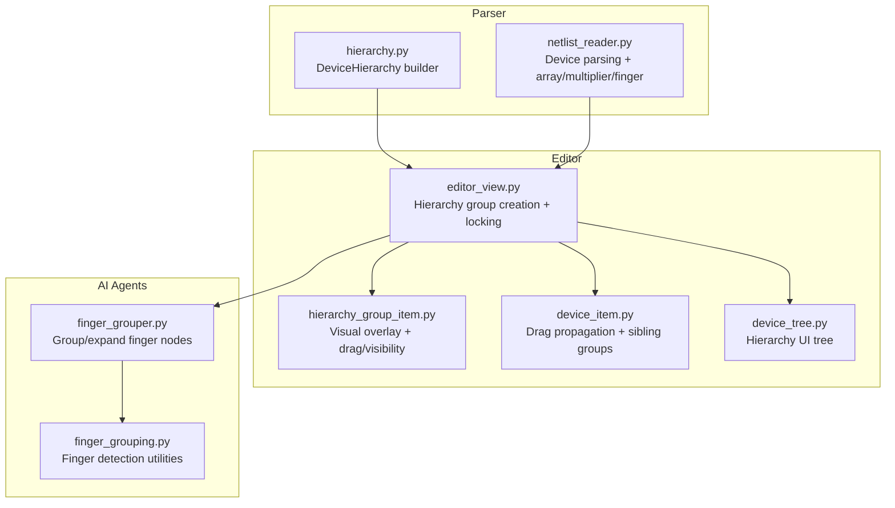
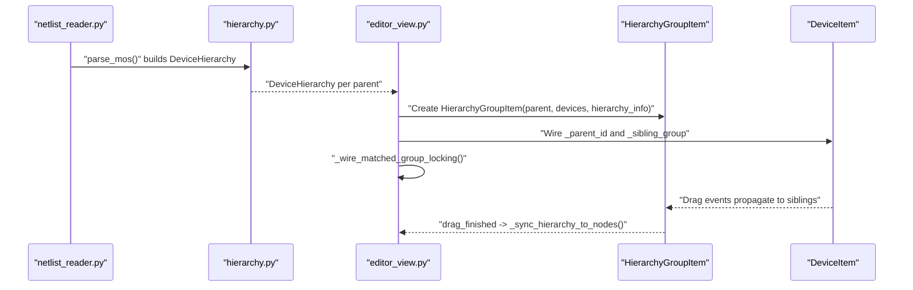
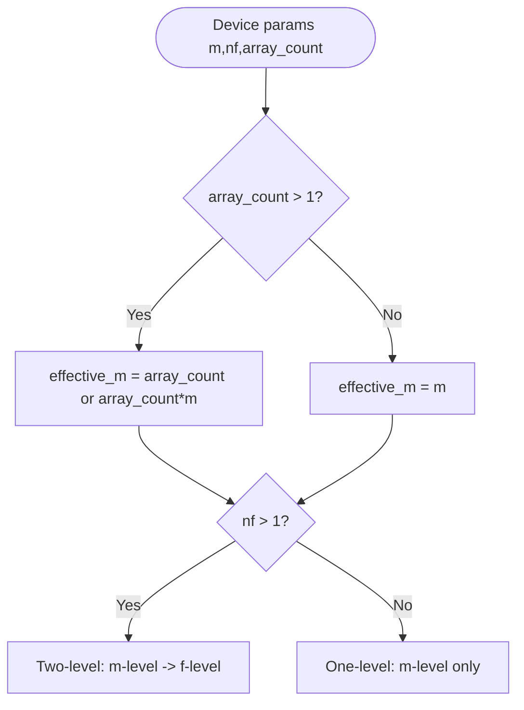
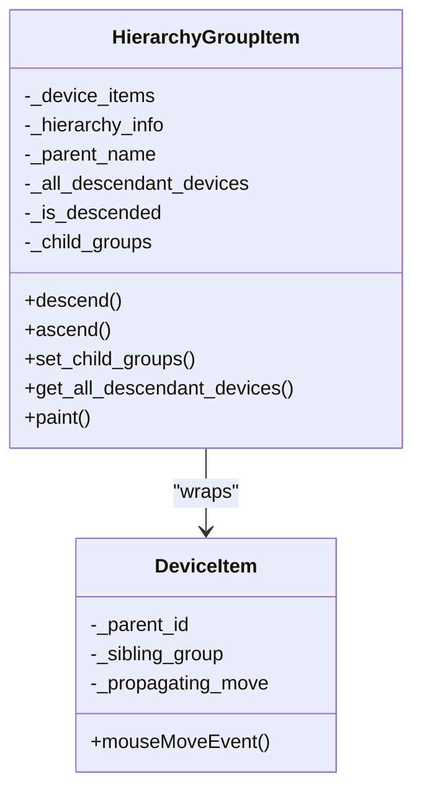
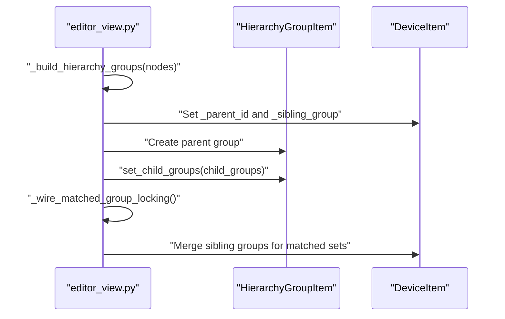
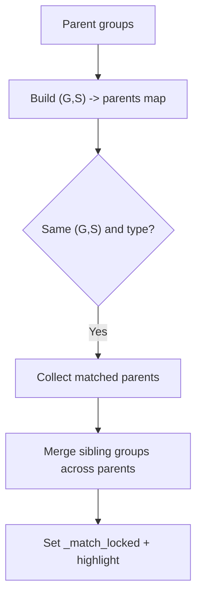
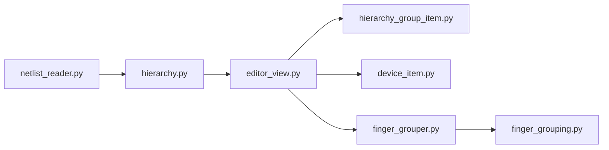

# Hierarchy Group Management

<cite>
**Referenced Files in This Document**
- [hierarchy_group_item.py](file://symbolic_editor/hierarchy_group_item.py)
- [editor_view.py](file://symbolic_editor/editor_view.py)
- [device_item.py](file://symbolic_editor/device_item.py)
- [device_tree.py](file://symbolic_editor/device_tree.py)
- [hierarchy.py](file://parser/hierarchy.py)
- [netlist_reader.py](file://parser/netlist_reader.py)
- [finger_grouper.py](file://ai_agent/ai_initial_placement/finger_grouper.py)
- [finger_grouping.py](file://ai_agent/ai_chat_bot/finger_grouping.py)
- [SYMBOLIC_HIERARCHY.md](file://docs/SYMBOLIC_HIERARCHY.md)
- [HIERARCHY_SELECTION_UPDATE.md](file://docs/HIERARCHY_SELECTION_UPDATE.md)
- [test_group_movement.py](file://tests/test_group_movement.py)
</cite>

## Table of Contents
1. [Introduction](#introduction)
2. [Project Structure](#project-structure)
3. [Core Components](#core-components)
4. [Architecture Overview](#architecture-overview)
5. [Detailed Component Analysis](#detailed-component-analysis)
6. [Dependency Analysis](#dependency-analysis)
7. [Performance Considerations](#performance-considerations)
8. [Troubleshooting Guide](#troubleshooting-guide)
9. [Conclusion](#conclusion)
10. [Appendices](#appendices)

## Introduction
This document explains the hierarchy group management system that organizes analog layout devices into a two-level hierarchy: multiplier (m) and finger (nf), with optional array expansion. It covers:
- Two-level hierarchy structure with multiplier and finger grouping
- Array detection and management
- Parent-child relationships and visual hierarchy representation
- Group creation, device association, and drag synchronization
- Rigid-body locking for matched device groups and sibling coordination
- Visibility controls, expand/collapse operations, and integration with device selection
- Practical workflows, performance considerations for large groups, and troubleshooting

## Project Structure
The hierarchy system spans parsing, editor, and AI agent modules:
- Parser: builds DeviceHierarchy trees from SPICE/CDL parameters and detects arrays/multipliers/fingers
- Editor: renders HierarchyGroupItem overlays, manages visibility, and synchronizes drag events
- AI Agents: pre/post-process device graphs to collapse/expand finger-level nodes for efficient LLM planning

**Diagram sources**
- [hierarchy.py:183-310](file://parser/hierarchy.py#L183-L310)
- [netlist_reader.py:478-620](file://parser/netlist_reader.py#L478-L620)
- [editor_view.py:472-693](file://symbolic_editor/editor_view.py#L472-L693)
- [hierarchy_group_item.py:28-167](file://symbolic_editor/hierarchy_group_item.py#L28-L167)
- [device_item.py:17-51](file://symbolic_editor/device_item.py#L17-L51)
- [device_tree.py:25-592](file://symbolic_editor/device_tree.py#L25-L592)
- [finger_grouper.py:116-232](file://ai_agent/ai_initial_placement/finger_grouper.py#L116-L232)
- [finger_grouping.py:116-191](file://ai_agent/ai_chat_bot/finger_grouping.py#L116-L191)

**Section sources**
- [hierarchy.py:1-475](file://parser/hierarchy.py#L1-L475)
- [netlist_reader.py:478-620](file://parser/netlist_reader.py#L478-L620)
- [editor_view.py:472-693](file://symbolic_editor/editor_view.py#L472-L693)
- [hierarchy_group_item.py:28-167](file://symbolic_editor/hierarchy_group_item.py#L28-L167)
- [device_item.py:17-51](file://symbolic_editor/device_item.py#L17-L51)
- [device_tree.py:25-592](file://symbolic_editor/device_tree.py#L25-L592)
- [finger_grouper.py:116-232](file://ai_agent/ai_initial_placement/finger_grouper.py#L116-L232)
- [finger_grouping.py:116-191](file://ai_agent/ai_chat_bot/finger_grouping.py#L116-L191)

## Core Components
- DeviceHierarchy and HierarchyNode: define the logical hierarchy tree with levels 0 (parent), 1 (multiplier/array), and 2 (fingers). Supports counting leaves, collecting leaves, and building from parameters.
- HierarchyGroupItem: visual overlay that wraps DeviceItems into draggable, selectable groups with symbolic view and expand/collapse behavior.
- SymbolicEditor: loads placement data, builds hierarchy groups, wires matched group locking, and manages drag synchronization.
- DeviceItem: individual device visuals with drag propagation to sibling groups and match-lock highlighting.
- DeviceTreePanel: UI tree showing instances, nets, and groups derived from hierarchy metadata.
- AI finger grouping: pre/post-process device graphs to reduce token counts and preserve interdigitated matching.

**Section sources**
- [hierarchy.py:133-177](file://parser/hierarchy.py#L133-L177)
- [hierarchy_group_item.py:28-167](file://symbolic_editor/hierarchy_group_item.py#L28-L167)
- [editor_view.py:472-693](file://symbolic_editor/editor_view.py#L472-L693)
- [device_item.py:17-51](file://symbolic_editor/device_item.py#L17-L51)
- [device_tree.py:25-592](file://symbolic_editor/device_tree.py#L25-L592)
- [finger_grouper.py:116-232](file://ai_agent/ai_initial_placement/finger_grouper.py#L116-L232)

## Architecture Overview
The system integrates parsing, visualization, and AI processing:
- Parsing constructs DeviceHierarchy from SPICE parameters and detects arrays/multipliers/fingers
- Editor builds HierarchyGroupItem overlays and wires sibling groups for rigid-body drag
- AI agents collapse finger-level nodes into transistor-level groups for LLM planning and expand them afterward

**Diagram sources**
- [netlist_reader.py:478-620](file://parser/netlist_reader.py#L478-L620)
- [hierarchy.py:219-310](file://parser/hierarchy.py#L219-L310)
- [editor_view.py:472-693](file://symbolic_editor/editor_view.py#L472-L693)
- [hierarchy_group_item.py:28-167](file://symbolic_editor/hierarchy_group_item.py#L28-L167)
- [device_item.py:17-51](file://symbolic_editor/device_item.py#L17-L51)

## Detailed Component Analysis

### Two-Level Hierarchy: Multiplier and Finger Grouping
- Multiplier level: devices with m>1 produce child groups labeled _mN
- Finger level: devices with nf>1 produce leaf nodes labeled _fN
- Mixed: devices with both m>1 and nf>1 form a two-level tree
- Array detection: array suffix <N> parsed and grouped; effective m considers array_count and m

**Diagram sources**
- [hierarchy.py:219-310](file://parser/hierarchy.py#L219-L310)

**Section sources**
- [hierarchy.py:219-310](file://parser/hierarchy.py#L219-L310)
- [netlist_reader.py:544-620](file://parser/netlist_reader.py#L544-L620)

### Array Detection and Management
- Array suffix parsing: extracts base name and 0-based index from names like MM9<7>
- Grouping by parent: reconstructs DeviceHierarchy from expanded devices
- Sorting: names sorted by _mN_fM to ensure correct order

**Section sources**
- [hierarchy.py:44-92](file://parser/hierarchy.py#L44-L92)
- [hierarchy.py:316-418](file://parser/hierarchy.py#L316-L418)
- [netlist_reader.py:544-620](file://parser/netlist_reader.py#L544-L620)

### Parent-Child Relationships and Visual Hierarchy Representation
- HierarchyGroupItem wraps DeviceItems and computes a bounding box
- Header bar enables double-click to descend/ascend
- Visibility toggles: when not descended, parent group visible and children hidden; when descended, parent hidden and children visible
- Z-order ensures DeviceItems are above overlays so they receive drag events

**Diagram sources**
- [hierarchy_group_item.py:28-167](file://symbolic_editor/hierarchy_group_item.py#L28-L167)
- [device_item.py:17-51](file://symbolic_editor/device_item.py#L17-L51)

**Section sources**
- [hierarchy_group_item.py:28-167](file://symbolic_editor/hierarchy_group_item.py#L28-L167)
- [SYMBOLIC_HIERARCHY.md:116-170](file://docs/SYMBOLIC_HIERARCHY.md#L116-L170)

### Group Creation Process and Device Association
- Editor groups devices by parent and builds HierarchyGroupItem for each parent
- For two-level hierarchies, child groups are created per multiplier index
- Sibling groups are wired so dragging any finger moves the entire group
- Standalone devices are wrapped into single-device groups

**Diagram sources**
- [editor_view.py:472-693](file://symbolic_editor/editor_view.py#L472-L693)
- [device_item.py:17-51](file://symbolic_editor/device_item.py#L17-L51)
- [hierarchy_group_item.py:143-150](file://symbolic_editor/hierarchy_group_item.py#L143-L150)

**Section sources**
- [editor_view.py:472-693](file://symbolic_editor/editor_view.py#L472-L693)
- [device_item.py:224-242](file://symbolic_editor/device_item.py#L224-L242)

### Rigid-Body Locking Mechanism for Matched Device Groups
- Detection: auto-detect matched groups by shared G and S nets (excluding power nets)
- Merging: replace each device’s sibling list with the full matched group
- Visual feedback: match-locked devices get a special highlight
- Drag synchronization: all devices in a matched group move together as one rigid body

**Diagram sources**
- [editor_view.py:694-788](file://symbolic_editor/editor_view.py#L694-L788)
- [device_item.py:140-154](file://symbolic_editor/device_item.py#L140-L154)

**Section sources**
- [editor_view.py:694-788](file://symbolic_editor/editor_view.py#L694-L788)
- [device_item.py:140-154](file://symbolic_editor/device_item.py#L140-L154)

### Sibling Group Coordination and Drag Synchronization
- During drag, DeviceItem propagates movement deltas to all siblings in the same group
- Propagation guards prevent recursive updates
- HierarchyGroupItem receives drag_finished and syncs positions back to node data

**Section sources**
- [device_item.py:224-242](file://symbolic_editor/device_item.py#L224-L242)
- [editor_view.py:789-795](file://symbolic_editor/editor_view.py#L789-L795)

### Hierarchy Visibility Controls and Expand/Collapse Operations
- Double-click header bar to descend/ascend
- Keyboard shortcuts: 'D' to descend nearest hierarchy, Escape to ascend
- Selection blocking: devices in non-descended hierarchies cannot be selected
- Symbolic view: parent visible, children hidden; detailed view: children visible, parent hidden

**Section sources**
- [hierarchy_group_item.py:189-202](file://symbolic_editor/hierarchy_group_item.py#L189-L202)
- [HIERARCHY_SELECTION_UPDATE.md:66-70](file://docs/HIERARCHY_SELECTION_UPDATE.md#L66-L70)
- [SYMBOLIC_HIERARCHY.md:73-115](file://docs/SYMBOLIC_HIERARCHY.md#L73-L115)

### Integration with Device Selection System
- Custom HierarchyAwareScene intercepts selection at Qt level and blocks devices in non-descended hierarchies
- Secondary check in SymbolicEditor._on_selection_changed ensures no blocked devices remain selected
- DeviceTreePanel displays hierarchy groups and allows selection of parent devices

**Section sources**
- [editor_view.py:39-79](file://symbolic_editor/editor_view.py#L39-L79)
- [device_tree.py:310-355](file://symbolic_editor/device_tree.py#L310-L355)

### Practical Examples of Hierarchy Building Workflows
- Workflow 1: Multiplier-only device (m=3, nf=1)
  - Create one parent group with three child groups (_m1, _m2, _m3)
- Workflow 2: Finger-only device (m=1, nf=4)
  - Create one parent group with four visible leaf devices
- Workflow 3: Mixed device (m=2, nf=3)
  - Create one parent group with two child groups; each child group has three leaf devices
- Workflow 4: Array device with m=2, nf=1
  - Treat as array copies; create one parent group with two child groups

**Section sources**
- [hierarchy.py:282-309](file://parser/hierarchy.py#L282-L309)
- [editor_view.py:594-638](file://symbolic_editor/editor_view.py#L594-L638)

### AI Agent Integration for Finger Grouping
- Preprocessing: collapse finger-level nodes into transistor-level groups to reduce tokens and improve matching awareness
- Matching: detect structurally matched groups and interdigitate fingers (e.g., ABBA pattern)
- Postprocessing: expand groups back to finger-level coordinates with abutment spacing

**Section sources**
- [finger_grouper.py:116-232](file://ai_agent/ai_initial_placement/finger_grouper.py#L116-L232)
- [finger_grouper.py:256-305](file://ai_agent/ai_initial_placement/finger_grouper.py#L256-L305)
- [finger_grouper.py:568-641](file://ai_agent/ai_initial_placement/finger_grouper.py#L568-L641)
- [finger_grouping.py:116-191](file://ai_agent/ai_chat_bot/finger_grouping.py#L116-L191)

## Dependency Analysis
The hierarchy system exhibits clear module boundaries:
- Parser depends on hierarchy builders to construct logical trees
- Editor depends on parser outputs and device items to render overlays and manage interactions
- AI agents depend on editor outputs to pre/post-process device graphs

**Diagram sources**
- [netlist_reader.py:478-620](file://parser/netlist_reader.py#L478-L620)
- [hierarchy.py:219-310](file://parser/hierarchy.py#L219-L310)
- [editor_view.py:472-693](file://symbolic_editor/editor_view.py#L472-L693)
- [hierarchy_group_item.py:28-167](file://symbolic_editor/hierarchy_group_item.py#L28-L167)
- [device_item.py:17-51](file://symbolic_editor/device_item.py#L17-L51)
- [finger_grouper.py:116-232](file://ai_agent/ai_initial_placement/finger_grouper.py#L116-L232)
- [finger_grouping.py:116-191](file://ai_agent/ai_chat_bot/finger_grouping.py#L116-L191)

**Section sources**
- [netlist_reader.py:478-620](file://parser/netlist_reader.py#L478-L620)
- [hierarchy.py:219-310](file://parser/hierarchy.py#L219-L310)
- [editor_view.py:472-693](file://symbolic_editor/editor_view.py#L472-L693)
- [hierarchy_group_item.py:28-167](file://symbolic_editor/hierarchy_group_item.py#L28-L167)
- [device_item.py:17-51](file://symbolic_editor/device_item.py#L17-L51)
- [finger_grouper.py:116-232](file://ai_agent/ai_initial_placement/finger_grouper.py#L116-L232)
- [finger_grouping.py:116-191](file://ai_agent/ai_chat_bot/finger_grouping.py#L116-L191)

## Performance Considerations
- Symbolic view reduces visual clutter and improves responsiveness when zoomed out by hiding child devices until descended
- Drag propagation uses batched sibling updates with propagation guards to avoid recursive loops
- AI finger grouping reduces token counts and computational overhead by collapsing finger-level nodes into transistor-level groups before LLM planning
- Grid snapping and row pitch computation help maintain alignment and reduce layout conflicts

[No sources needed since this section provides general guidance]

## Troubleshooting Guide
Common issues and resolutions:
- Devices still visible when parent not descended
  - Cause: visibility not enforced by HierarchyGroupItem
  - Fix: ensure set_child_groups() is called to initialize visibility
- Cannot descend into hierarchy
  - Cause: has_children() returns False or device_items empty
  - Fix: verify child groups or devices are properly added to parent
- Selection not blocked for hidden devices
  - Cause: HierarchyAwareScene not used
  - Fix: confirm editor uses HierarchyAwareScene
- Dragging one finger does not move siblings
  - Cause: sibling groups not wired
  - Fix: verify _wire_matched_group_locking and _sibling_group assignments
- Large groups cause slow performance
  - Mitigation: rely on symbolic view; avoid descending into very large multi-level hierarchies unless necessary

**Section sources**
- [SYMBOLIC_HIERARCHY.md:210-226](file://docs/SYMBOLIC_HIERARCHY.md#L210-L226)
- [HIERARCHY_SELECTION_UPDATE.md:189-205](file://docs/HIERARCHY_SELECTION_UPDATE.md#L189-L205)
- [test_group_movement.py:44-74](file://tests/test_group_movement.py#L44-L74)

## Conclusion
The hierarchy group management system provides a robust, scalable framework for organizing analog layouts into manageable two-level structures. It combines precise parsing, visual overlays, rigid-body locking, and AI-driven grouping to support efficient design and placement workflows. The system’s visibility controls, expand/collapse mechanics, and integration with device selection ensure intuitive navigation and safe interactions, even with large multi-finger and multiplier arrays.

## Appendices

### Appendix A: Practical Workflows
- Building a mixed hierarchy (m=2, nf=3):
  - Create parent group and two child groups
  - Each child group contains three leaf devices
  - Use 'D' to descend into child groups, then into fingers
- Working with arrays:
  - Treat array copies as multiplier-level children
  - Maintain array_index metadata for accurate grouping
- Locked matched groups:
  - Drag any device in a matched group to move the entire block
  - Unlock via AI commands or UI actions when needed

[No sources needed since this section provides general guidance]