# Interactive Symbolic Canvas

<cite>
**Referenced Files in This Document**
- [main.py](file://symbolic_editor/main.py)
- [layout_tab.py](file://symbolic_editor/layout_tab.py)
- [editor_view.py](file://symbolic_editor/editor_view.py)
- [device_item.py](file://symbolic_editor/device_item.py)
- [passive_item.py](file://symbolic_editor/passive_item.py)
- [block_item.py](file://symbolic_editor/block_item.py)
- [hierarchy_group_item.py](file://symbolic_editor/hierarchy_group_item.py)
- [abutment_engine.py](file://symbolic_editor/abutment_engine.py)
- [icons.py](file://symbolic_editor/icons.py)
</cite>

## Table of Contents
1. [Introduction](#introduction)
2. [Project Structure](#project-structure)
3. [Core Components](#core-components)
4. [Architecture Overview](#architecture-overview)
5. [Detailed Component Analysis](#detailed-component-analysis)
6. [Dependency Analysis](#dependency-analysis)
7. [Performance Considerations](#performance-considerations)
8. [Troubleshooting Guide](#troubleshooting-guide)
9. [Conclusion](#conclusion)

## Introduction
This document explains the Interactive Symbolic Canvas feature that powers analog layout design in the application. It covers the canvas architecture, device manipulation tools (move, swap, delete, flip), batch selection, dummy device placement, drag-and-drop and keyboard interactions, device item system (PMOS/NMOS transistors and passive components), navigation and viewport controls, and integration with the AI assistance system. Practical workflows, grouping techniques, and optimization strategies for large layouts are included.

## Project Structure
The Interactive Symbolic Canvas is implemented as a tabbed application shell hosting multiple independent layout documents. Each tab combines:
- A Symbolic Editor canvas (QGraphicsView/QGraphicsScene) for interactive device placement
- A device tree panel for hierarchical navigation
- A properties panel for device/block inspection
- A chat panel for AI-assisted design
- A KLayout preview panel for physical verification

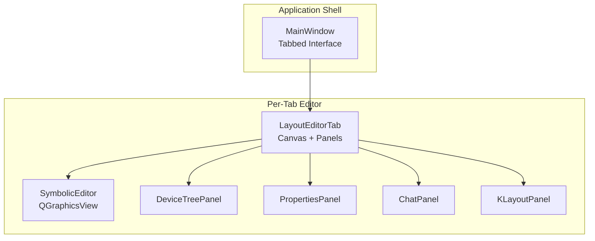

**Diagram sources**
- [main.py:80-148](file://symbolic_editor/main.py#L80-L148)
- [layout_tab.py:64-237](file://symbolic_editor/layout_tab.py#L64-L237)

**Section sources**
- [main.py:80-148](file://symbolic_editor/main.py#L80-L148)
- [layout_tab.py:64-237](file://symbolic_editor/layout_tab.py#L64-L237)

## Core Components
- SymbolicEditor: central QGraphicsView canvas with grid snapping, selection, device rendering modes, and hierarchy support
- DeviceItem: visual representation of PMOS/NMOS transistors with multi-finger rendering, flip controls, and terminal anchors
- PassiveItem: visual representation of resistors and capacitors with terminal anchors and orientation
- BlockItem: movable group representing hierarchical blocks
- HierarchyGroupItem: draggable bounding box for arrays/multipliers/fingers with descend/ascend behavior
- AbutmentEngine: computes abutment candidates and edge highlight maps for diffusion sharing
- LayoutEditorTab: orchestrates actions (swap, flip, delete, match, AI placement), integrates panels, and manages undo/redo
- MainWindow: tab manager, toolbar, menu, and global shortcuts

**Section sources**
- [editor_view.py:81-191](file://symbolic_editor/editor_view.py#L81-L191)
- [device_item.py:17-508](file://symbolic_editor/device_item.py#L17-L508)
- [passive_item.py:24-313](file://symbolic_editor/passive_item.py#L24-L313)
- [block_item.py:11-144](file://symbolic_editor/block_item.py#L11-L144)
- [hierarchy_group_item.py:28-236](file://symbolic_editor/hierarchy_group_item.py#L28-L236)
- [abutment_engine.py:65-225](file://symbolic_editor/abutment_engine.py#L65-L225)
- [layout_tab.py:64-237](file://symbolic_editor/layout_tab.py#L64-L237)
- [main.py:80-148](file://symbolic_editor/main.py#L80-L148)

## Architecture Overview
The canvas architecture separates concerns across panels and the editor:
- Input: keyboard shortcuts, toolbar actions, and mouse interactions
- Processing: LayoutEditorTab translates actions into editor operations and node updates
- Rendering: SymbolicEditor draws devices, grids, overlays, and hierarchy groups
- AI Integration: ChatPanel sends commands that LayoutEditorTab executes atomically with undo batching

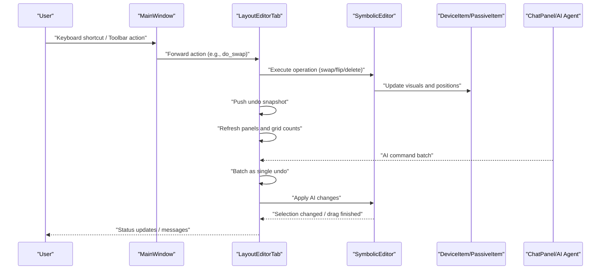

**Diagram sources**
- [main.py:621-629](file://symbolic_editor/main.py#L621-L629)
- [layout_tab.py:736-820](file://symbolic_editor/layout_tab.py#L736-L820)
- [layout_tab.py:1702-1722](file://symbolic_editor/layout_tab.py#L1702-L1722)
- [editor_view.py:81-191](file://symbolic_editor/editor_view.py#L81-L191)

## Detailed Component Analysis

### Canvas Architecture and Navigation
- Grid and Snapping
  - Base grid spacing and row pitch are computed from device sizes; snapping applies per-axis for precise alignment
  - Virtual grid extents allow planning beyond current device count
- View Controls
  - Zoom via mouse wheel or toolbar buttons; pan via middle mouse drag
  - Fit-to-view and reset zoom
- Rendering Modes
  - Detailed vs outline device rendering
  - Block overlays visible in transistor view; symbol view hides individual devices under hierarchy groups

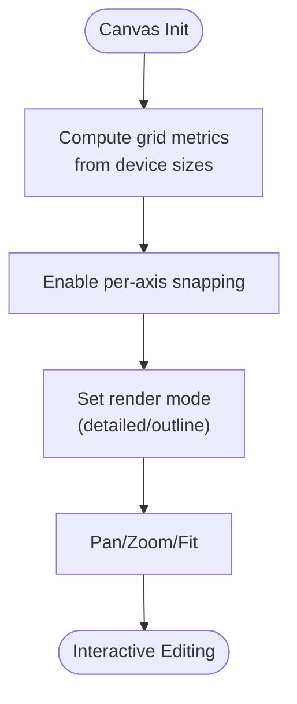

**Diagram sources**
- [editor_view.py:352-452](file://symbolic_editor/editor_view.py#L352-L452)
- [editor_view.py:1879-1901](file://symbolic_editor/editor_view.py#L1879-L1901)

**Section sources**
- [editor_view.py:139-184](file://symbolic_editor/editor_view.py#L139-L184)
- [editor_view.py:352-452](file://symbolic_editor/editor_view.py#L352-L452)
- [editor_view.py:1879-1901](file://symbolic_editor/editor_view.py#L1879-L1901)

### Device Manipulation Tools
- Move Mode
  - Toggle with a key; enables dragging a single device; enforces matched group movement constraints
- Swap
  - Select exactly two devices; swaps positions and orientations atomically
- Flip Horizontal/Vertical
  - Applies to selected devices; updates orientation metadata
- Delete
  - Removes selected devices; updates node list and scene
- Merge Shared Source/Drain
  - Aligns two devices along shared terminals with optional flip to avoid overlap

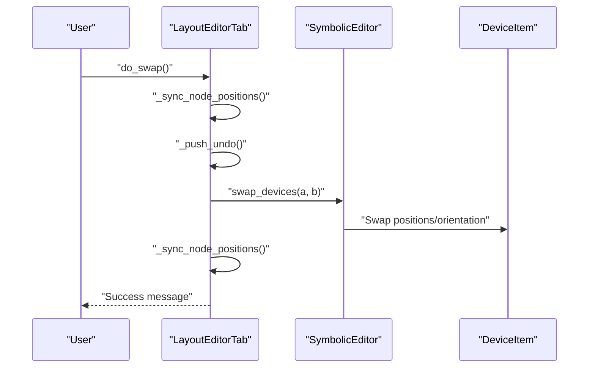

**Diagram sources**
- [layout_tab.py:740-749](file://symbolic_editor/layout_tab.py#L740-L749)
- [layout_tab.py:789-803](file://symbolic_editor/layout_tab.py#L789-L803)
- [layout_tab.py:805-820](file://symbolic_editor/layout_tab.py#L805-L820)

**Section sources**
- [layout_tab.py:421-481](file://symbolic_editor/layout_tab.py#L421-L481)
- [layout_tab.py:740-749](file://symbolic_editor/layout_tab.py#L740-L749)
- [layout_tab.py:756-787](file://symbolic_editor/layout_tab.py#L756-L787)
- [layout_tab.py:789-803](file://symbolic_editor/layout_tab.py#L789-L803)
- [layout_tab.py:805-820](file://symbolic_editor/layout_tab.py#L805-L820)

### Batch Selection and Keyboard Shortcuts
- Batch selection
  - Ctrl+Click to select multiple devices; Shift+Click extends selection
  - Select All via menu or toolbar
- Shortcuts
  - Fit view: F
  - Detailed view: Shift+F
  - Outline view: Ctrl+F
  - Dummy mode toggle: D
  - Move mode toggle: M
  - Escape clears selection and exits modes

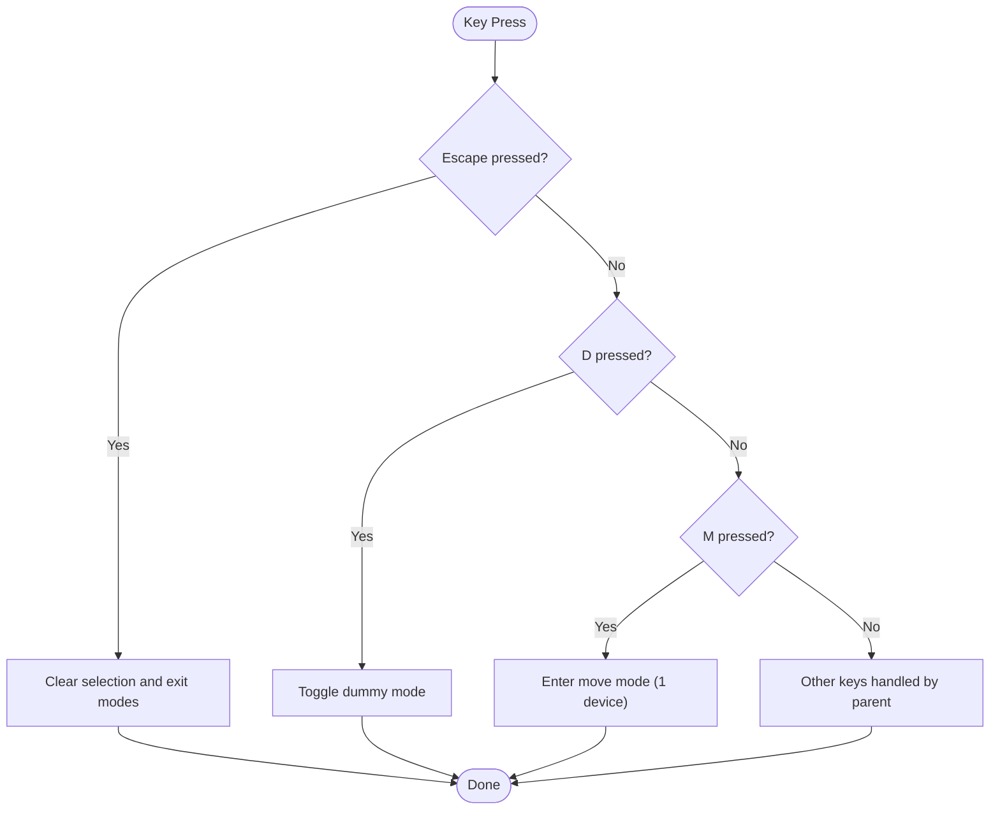

**Diagram sources**
- [layout_tab.py:380-416](file://symbolic_editor/layout_tab.py#L380-L416)

**Section sources**
- [layout_tab.py:380-416](file://symbolic_editor/layout_tab.py#L380-L416)

### Mouse Interaction Patterns
- Rubber-band selection for batch selection
- Drag-and-drop with per-axis snapping
- Middle mouse drag for panning
- Double-click on hierarchy group header to descend/ascend
- Right-click context menus for manual abutment flags (amber edge indicators)

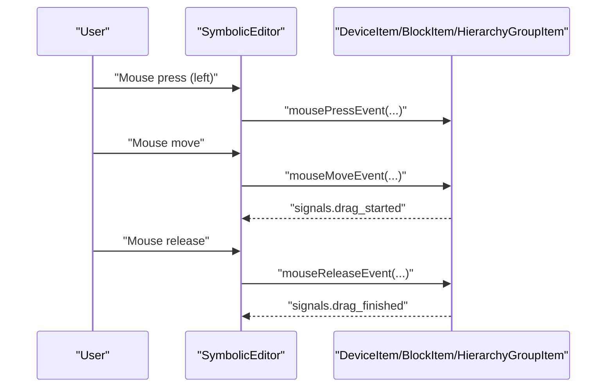

**Diagram sources**
- [device_item.py:209-242](file://symbolic_editor/device_item.py#L209-L242)
- [block_item.py:77-96](file://symbolic_editor/block_item.py#L77-L96)
- [hierarchy_group_item.py:169-202](file://symbolic_editor/hierarchy_group_item.py#L169-L202)

**Section sources**
- [editor_view.py:101-108](file://symbolic_editor/editor_view.py#L101-L108)
- [device_item.py:209-242](file://symbolic_editor/device_item.py#L209-L242)
- [block_item.py:77-96](file://symbolic_editor/block_item.py#L77-L96)
- [hierarchy_group_item.py:169-202](file://symbolic_editor/hierarchy_group_item.py#L169-L202)

### Device Item System
- PMOS/NMOS Transistors
  - Multi-finger rendering with source/drain and gate segments
  - Terminal anchors for routing connections
  - Flip controls and orientation metadata
- Passive Components
  - Resistors: zig-zag body with terminal labels
  - Capacitors: parallel-plate body with polarity labels
  - Same drag/snap/orientation interface as transistors

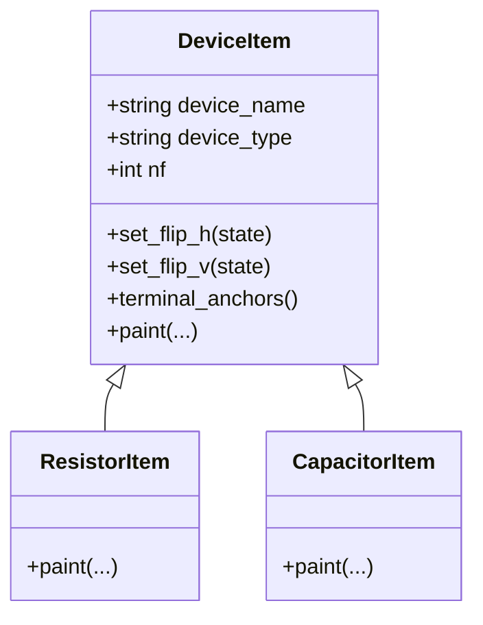

**Diagram sources**
- [device_item.py:17-508](file://symbolic_editor/device_item.py#L17-L508)
- [passive_item.py:135-313](file://symbolic_editor/passive_item.py#L135-L313)

**Section sources**
- [device_item.py:17-508](file://symbolic_editor/device_item.py#L17-L508)
- [passive_item.py:24-313](file://symbolic_editor/passive_item.py#L24-L313)

### Hierarchy and Grouping
- HierarchyGroupItem
  - Draggable bounding box around grouped devices (arrays, multipliers, fingers)
  - Descend/ascend toggles visibility of children vs group
- BlockItem
  - Represents a block grouping multiple devices; moves children together
- Parent-child wiring and matched group locking
  - Sibling groups merged for matched devices to move as one rigid body

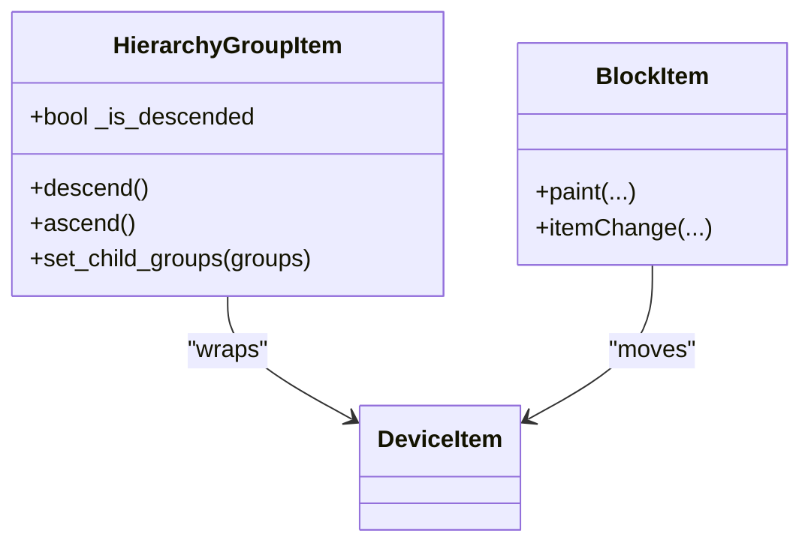

**Diagram sources**
- [hierarchy_group_item.py:28-236](file://symbolic_editor/hierarchy_group_item.py#L28-L236)
- [block_item.py:11-144](file://symbolic_editor/block_item.py#L11-L144)

**Section sources**
- [hierarchy_group_item.py:28-236](file://symbolic_editor/hierarchy_group_item.py#L28-L236)
- [block_item.py:11-144](file://symbolic_editor/block_item.py#L11-L144)
- [editor_view.py:472-693](file://symbolic_editor/editor_view.py#L472-L693)

### Dummy Device Placement Workflow
- Toggle dummy placement mode
- Preview follows cursor with half-device width snapping to nearest free slot
- Commit places a dummy aligned to the nearest NMOS/PMOS row and column capacity
- Dummy IDs are generated automatically and inserted into node list

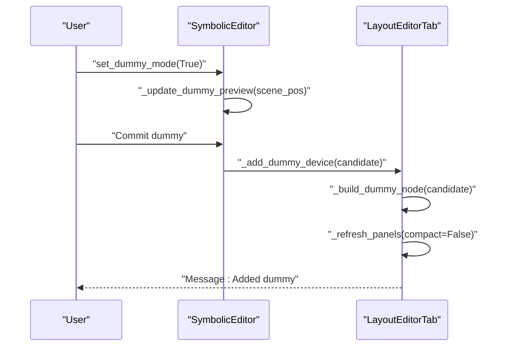

**Diagram sources**
- [editor_view.py:192-347](file://symbolic_editor/editor_view.py#L192-L347)
- [layout_tab.py:972-1067](file://symbolic_editor/layout_tab.py#L972-L1067)
- [layout_tab.py:1035-1067](file://symbolic_editor/layout_tab.py#L1035-L1067)

**Section sources**
- [editor_view.py:192-347](file://symbolic_editor/editor_view.py#L192-L347)
- [layout_tab.py:972-1067](file://symbolic_editor/layout_tab.py#L972-L1067)

### Abutment Analysis and Diffusion Sharing
- AbutmentEngine scans transistors for shared S/D nets (same-type only)
- Highlights candidate pairs and determines required flips
- Edge highlight map drives visual glow on device edges
- Candidates injected into AI placement constraints

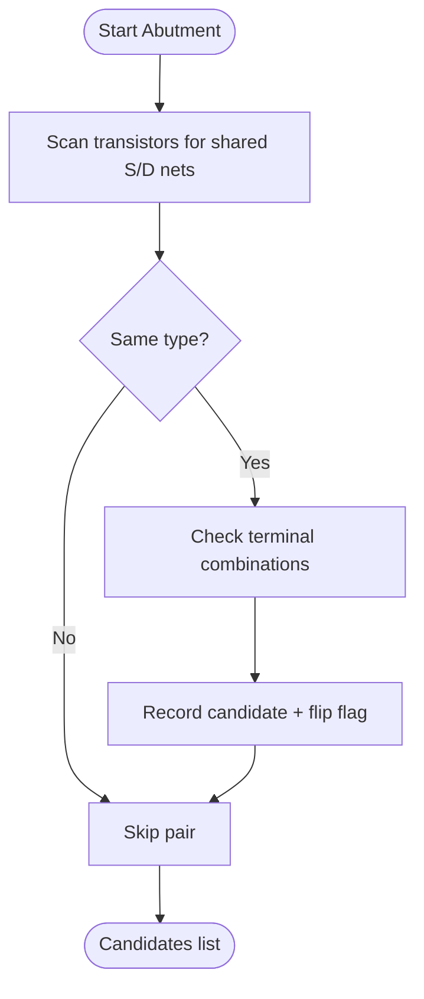

**Diagram sources**
- [abutment_engine.py:65-180](file://symbolic_editor/abutment_engine.py#L65-L180)
- [abutment_engine.py:198-225](file://symbolic_editor/abutment_engine.py#L198-L225)

**Section sources**
- [abutment_engine.py:65-180](file://symbolic_editor/abutment_engine.py#L65-L180)
- [abutment_engine.py:198-225](file://symbolic_editor/abutment_engine.py#L198-L225)
- [layout_tab.py:978-1001](file://symbolic_editor/layout_tab.py#L978-L1001)

### Integration with AI Assistance System
- AI commands batched into a single undo operation
- Supported actions: swap, abut, move device/group, move row, add dummy(s), route hints (priority, width, spacing, reroute)
- Stage completion highlights devices and restores opacity after a timeout
- DRC audit stage can dim devices and highlight overlaps

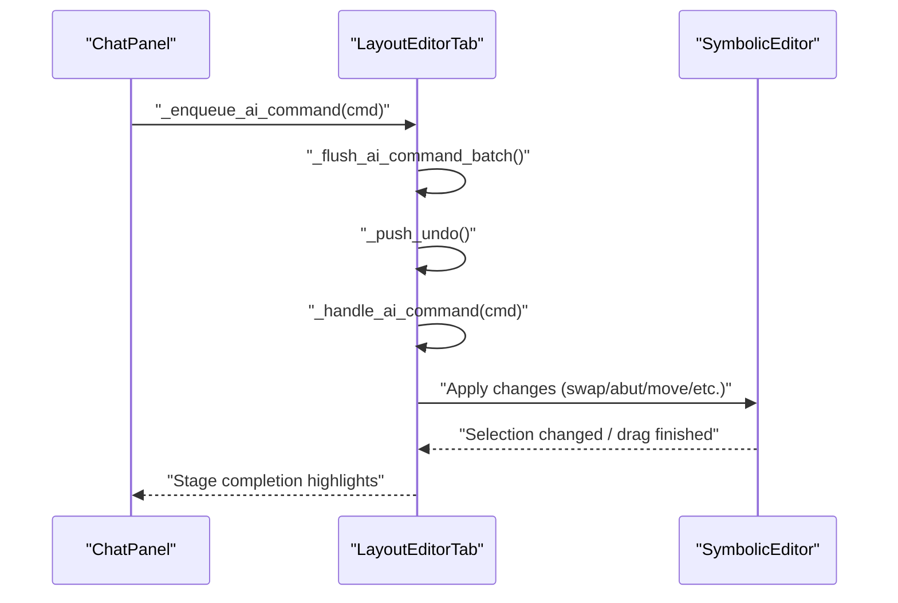

**Diagram sources**
- [layout_tab.py:1702-1722](file://symbolic_editor/layout_tab.py#L1702-L1722)
- [layout_tab.py:1803-1979](file://symbolic_editor/layout_tab.py#L1803-L1979)
- [layout_tab.py:1727-1781](file://symbolic_editor/layout_tab.py#L1727-L1781)

**Section sources**
- [layout_tab.py:1702-1722](file://symbolic_editor/layout_tab.py#L1702-L1722)
- [layout_tab.py:1803-1979](file://symbolic_editor/layout_tab.py#L1803-L1979)
- [layout_tab.py:1727-1781](file://symbolic_editor/layout_tab.py#L1727-L1781)

## Dependency Analysis
The canvas relies on a layered design:
- UI shell (MainWindow) delegates actions to active tab
- LayoutEditorTab orchestrates editor operations and panel updates
- SymbolicEditor renders devices and manages grid/snapping
- Device/Passive/Block/Hierarchy items encapsulate painting and interaction
- AbutmentEngine provides external analysis used by editor and AI

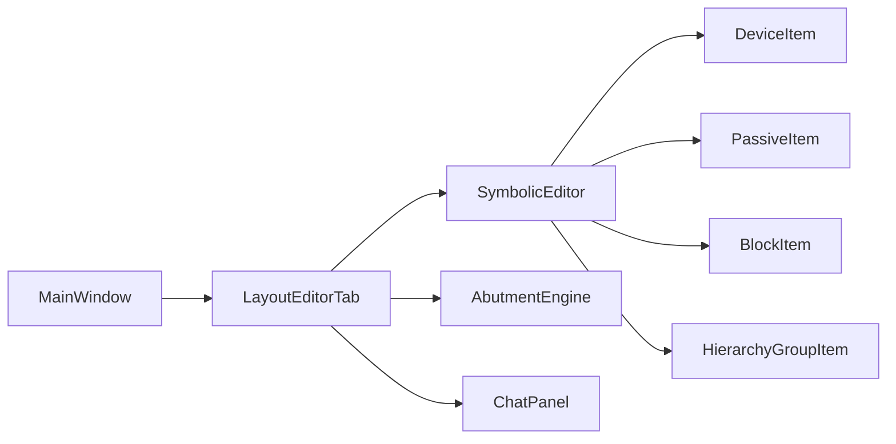

**Diagram sources**
- [main.py:621-629](file://symbolic_editor/main.py#L621-L629)
- [layout_tab.py:64-237](file://symbolic_editor/layout_tab.py#L64-L237)
- [editor_view.py:81-191](file://symbolic_editor/editor_view.py#L81-L191)
- [abutment_engine.py:65-180](file://symbolic_editor/abutment_engine.py#L65-L180)

**Section sources**
- [main.py:621-629](file://symbolic_editor/main.py#L621-L629)
- [layout_tab.py:64-237](file://symbolic_editor/layout_tab.py#L64-L237)
- [editor_view.py:81-191](file://symbolic_editor/editor_view.py#L81-L191)
- [abutment_engine.py:65-180](file://symbolic_editor/abutment_engine.py#L65-L180)

## Performance Considerations
- Rendering
  - Antialiasing enabled; background caching improves grid drawing
  - Outline mode reduces visual complexity for large layouts
- Snapping and Movement
  - Per-axis snapping minimizes jitter and improves precision
  - Hierarchy groups hide children in symbolic view to reduce draw overhead
- Large Layouts
  - Virtual grid extents prevent unnecessary redraws
  - Compact rows and abutment compaction reduce overlap and improve readability
- AI Integration
  - Command batching consolidates undo steps and minimizes UI thrash
  - Stage highlights temporarily dim devices to focus attention on audit results

[No sources needed since this section provides general guidance]

## Troubleshooting Guide
- Selection Issues
  - Use rubber-band selection; ensure items are not blocked by hierarchy rules
  - Clear selection with Escape
- Drag Behavior
  - Ensure snapping is enabled; verify per-axis grid values
  - For matched groups, moving one device moves the entire group
- Dummy Placement
  - Confirm dummy mode is enabled; ensure sufficient column capacity
  - If placement fails, adjust virtual grid or row capacity
- Abutment
  - Verify shared S/D nets and same-type devices
  - Use manual abut flags for overrides
- AI Commands
  - Check that devices are unlocked (not part of a matched group)
  - Review stage completion highlights for DRC feedback

**Section sources**
- [layout_tab.py:380-416](file://symbolic_editor/layout_tab.py#L380-L416)
- [layout_tab.py:972-1067](file://symbolic_editor/layout_tab.py#L972-L1067)
- [layout_tab.py:978-1001](file://symbolic_editor/layout_tab.py#L978-L1001)
- [layout_tab.py:1803-1979](file://symbolic_editor/layout_tab.py#L1803-L1979)

## Conclusion
The Interactive Symbolic Canvas provides a powerful, interactive environment for analog layout design with precise device manipulation, robust grouping, and seamless AI integration. Its architecture balances performance and usability, enabling efficient workflows for both experienced designers and AI-assisted design sessions.