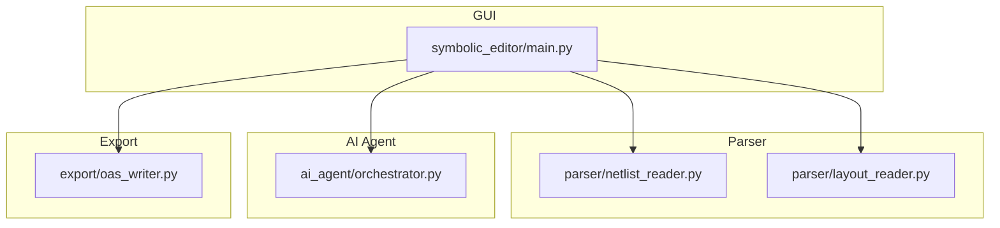
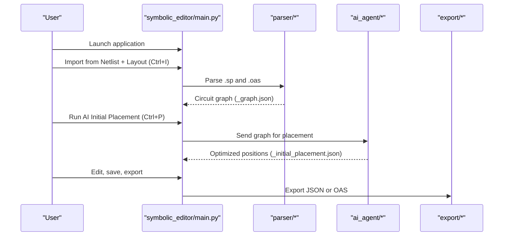
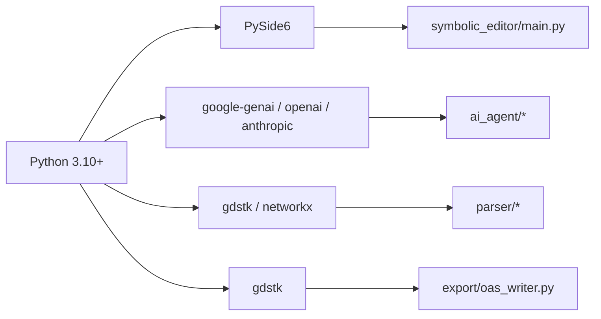

# Getting Started

<cite>
**Referenced Files in This Document**
- [README.md](file://README.md)
- [USER_GUIDE.md](file://docs/USER_GUIDE.md)
- [requirements.txt](file://requirements.txt)
- [packages/resolved_requirements.txt](file://packages/resolved_requirements.txt)
- [symbolic_editor/main.py](file://symbolic_editor/main.py)
- [parser/run_parser_example.py](file://parser/run_parser_example.py)
- [parser/netlist_reader.py](file://parser/netlist_reader.py)
- [parser/layout_reader.py](file://parser/layout_reader.py)
- [export/oas_writer.py](file://export/oas_writer.py)
- [examples/Layout_RTL.json](file://examples/Layout_RTL.json)
</cite>

## Table of Contents
1. [Introduction](#introduction)
2. [Project Structure](#project-structure)
3. [Core Components](#core-components)
4. [Architecture Overview](#architecture-overview)
5. [Detailed Component Analysis](#detailed-component-analysis)
6. [Dependency Analysis](#dependency-analysis)
7. [Performance Considerations](#performance-considerations)
8. [Troubleshooting Guide](#troubleshooting-guide)
9. [Conclusion](#conclusion)
10. [Appendices](#appendices)

## Introduction
This guide helps you install, configure, and run the AI-Based Analog Layout Automation desktop application. You will learn how to set up the environment, import circuits from netlist and layout files, load existing example layouts, and verify your installation. Practical, step-by-step instructions are provided so you can go from first launch to your first successful layout operation.

## Project Structure
At a high level, the application is organized into:
- A PySide6 GUI front-end that hosts the editor, device hierarchy, AI chat, and KLayout integration.
- A parser that reads SPICE netlists and OASIS/GDS layout files, builds a circuit graph, and matches devices.
- An AI agent that provides multi-agent assistance and initial placement.
- Export utilities to produce JSON and OASIS layout outputs.

**Diagram sources**
- [symbolic_editor/main.py](file://symbolic_editor/main.py)
- [parser/netlist_reader.py](file://parser/netlist_reader.py)
- [parser/layout_reader.py](file://parser/layout_reader.py)
- [export/oas_writer.py](file://export/oas_writer.py)

**Section sources**
- [README.md](file://README.md)
- [USER_GUIDE.md](file://docs/USER_GUIDE.md)

## Core Components
- GUI shell and tabbed interface: The main window manages menus, toolbars, and tabs hosting the editor workspace.
- Parser pipeline: Reads SPICE netlists, extracts layout instances, matches devices, and constructs a circuit graph.
- AI assistant: Provides multi-agent analysis and placement suggestions.
- Exporters: Produce JSON placement exports and OASIS layout files.

What you will accomplish:
- Install Python and dependencies.
- Configure API keys for AI providers.
- Launch the GUI and import a new circuit from netlist and layout files.
- Load an existing example layout and run AI placement.
- Save and export your work.

**Section sources**
- [README.md](file://README.md)
- [USER_GUIDE.md](file://docs/USER_GUIDE.md)

## Architecture Overview
The end-to-end workflow from design files to a placed layout is fully integrated in the GUI. The diagram below maps the major steps and the files involved.

**Diagram sources**
- [README.md](file://README.md)
- [USER_GUIDE.md](file://docs/USER_GUIDE.md)
- [symbolic_editor/main.py](file://symbolic_editor/main.py)
- [parser/run_parser_example.py](file://parser/run_parser_example.py)

## Detailed Component Analysis

### Installation and Setup
Follow these steps to prepare your environment and run the application.

- Clone the repository and navigate to the project root.
- Create a virtual environment and activate it.
- Install dependencies from the requirements file.
- Configure API keys for at least one AI provider.

Verification steps:
- Confirm the GUI launches without import errors.
- Verify that AI placement produces a new placement file.

**Section sources**
- [README.md](file://README.md)
- [USER_GUIDE.md](file://docs/USER_GUIDE.md)
- [requirements.txt](file://requirements.txt)
- [packages/resolved_requirements.txt](file://packages/resolved_requirements.txt)

### Running the Application
Launch the GUI and explore the main window. From here you can:
- Load an existing placement JSON.
- Import a new circuit from netlist and layout files.
- Run AI initial placement.
- Save and export your work.

Example commands:
- Launch the GUI.
- Load an example placement JSON directly from the command line.
- Use the “Quick Start Examples” menu to open example circuits.

**Section sources**
- [README.md](file://README.md)
- [USER_GUIDE.md](file://docs/USER_GUIDE.md)
- [symbolic_editor/main.py](file://symbolic_editor/main.py)

### Importing a New Circuit from Netlist and Layout Files
Use the GUI to import a new circuit:
- Open the GUI.
- Choose File > Import from Netlist + Layout (Ctrl+I).
- Select your SPICE netlist (.sp) and optionally your layout file (.oas or .gds).
- The parser generates a circuit graph and displays it on the canvas.
- Save the generated graph file for future use.

Behind the scenes:
- The netlist reader parses the SPICE file and flattens hierarchy.
- The layout reader extracts transistor instances and parameters.
- The device matcher aligns netlist devices to layout instances.
- The circuit graph is built and saved as a JSON file.

**Section sources**
- [README.md](file://README.md)
- [USER_GUIDE.md](file://docs/USER_GUIDE.md)
- [parser/run_parser_example.py](file://parser/run_parser_example.py)
- [parser/netlist_reader.py](file://parser/netlist_reader.py)
- [parser/layout_reader.py](file://parser/layout_reader.py)

### Loading an Existing Example Layout
There are several ready-to-load example layouts. You can:
- Open the GUI and choose File > Open JSON (Ctrl+O) to load a placement JSON.
- Pass an example JSON path directly to the launcher.
- Use the “Quick Start Examples” menu to open example pairs.

Example JSON format highlights:
- Devices include type, parameters, nets, and geometry.
- Topologies and decisions cache are included for advanced workflows.

**Section sources**
- [README.md](file://README.md)
- [USER_GUIDE.md](file://docs/USER_GUIDE.md)
- [examples/Layout_RTL.json](file://examples/Layout_RTL.json)

### Running AI Initial Placement
With a circuit loaded (either imported or opened from JSON):
- Choose Design > Run AI Initial Placement (Ctrl+P).
- The AI analyzes the graph and returns optimized positions.
- A new placement JSON is saved and the canvas updates.

Requirements:
- Set a valid API key for at least one provider in your environment configuration.

**Section sources**
- [README.md](file://README.md)
- [USER_GUIDE.md](file://docs/USER_GUIDE.md)

### Exporting Your Work
After refining your layout:
- Save your work to the current JSON file.
- Export a clean placement JSON.
- Export to OASIS for downstream EDA tools.

Export specifics:
- The OAS writer updates cell references and applies abutment strategies based on PCell properties.

**Section sources**
- [README.md](file://README.md)
- [USER_GUIDE.md](file://docs/USER_GUIDE.md)
- [export/oas_writer.py](file://export/oas_writer.py)

## Dependency Analysis
The application depends on a broad ecosystem of libraries for GUI, AI, parsing, and layout generation. The requirements file enumerates the core dependencies, including PySide6 for the GUI, AI SDKs for Gemini/OpenAI, and parsing libraries for OASIS/GDS.

**Diagram sources**
- [requirements.txt](file://requirements.txt)
- [packages/resolved_requirements.txt](file://packages/resolved_requirements.txt)
- [symbolic_editor/main.py](file://symbolic_editor/main.py)
- [export/oas_writer.py](file://export/oas_writer.py)

**Section sources**
- [requirements.txt](file://requirements.txt)
- [packages/resolved_requirements.txt](file://packages/resolved_requirements.txt)

## Performance Considerations
- Network latency affects AI placement response times. Free tiers may throttle requests; retry after a short delay if needed.
- Very large layouts increase parsing and rendering time. Consider simplifying or splitting designs when possible.
- Use the “Fit View” shortcut to quickly center your layout after loading.

## Troubleshooting Guide
Common issues and fixes:
- Missing API key: Ensure at least one provider key is configured in your environment configuration. Restart the application after editing.
- Missing PySide6 or other dependencies: Activate your virtual environment and reinstall dependencies from the requirements file.
- Blank canvas after loading: Press the “Fit View” shortcut to center the layout.
- AI placement does nothing: Confirm the API key is present and valid, then retry the placement operation.
- Device mismatch during import: Ensure the netlist and layout contain the same number of NMOS and PMOS devices.

**Section sources**
- [USER_GUIDE.md](file://docs/USER_GUIDE.md)

## Conclusion
You now have the essentials to install the application, configure AI providers, import or load circuits, run AI placement, and export your work. Use the examples as starting points, and leverage the AI assistant for iterative refinement of your layouts.

## Appendices

### Quick Reference: End-to-End Workflow
- Launch the GUI.
- Import a new circuit via File > Import from Netlist + Layout.
- Run AI Initial Placement.
- Edit, save, and export as needed.

**Section sources**
- [README.md](file://README.md)
- [USER_GUIDE.md](file://docs/USER_GUIDE.md)