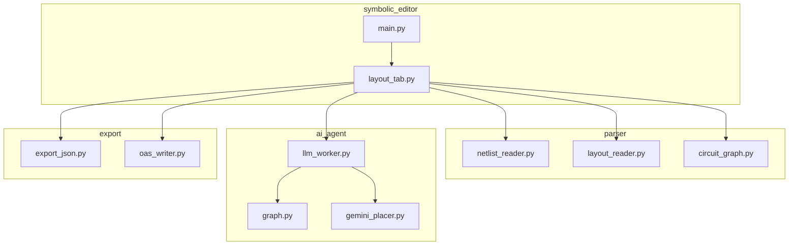
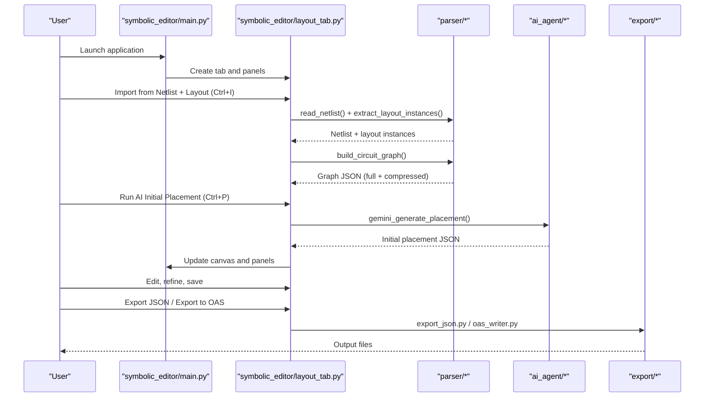
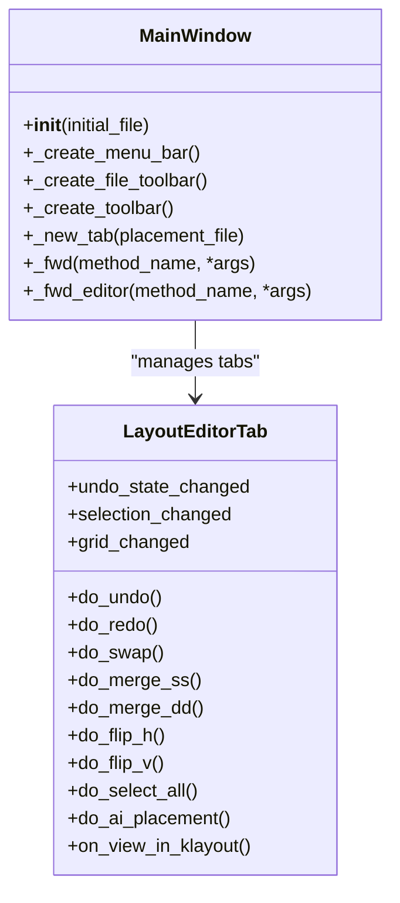
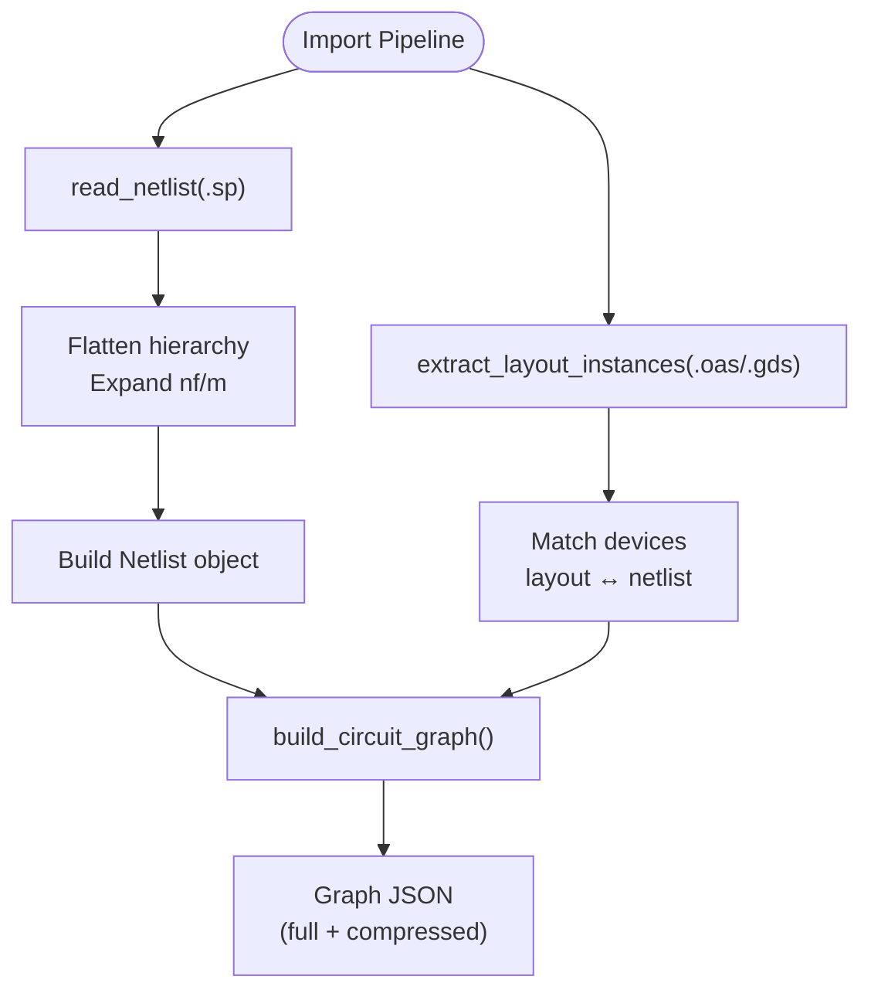
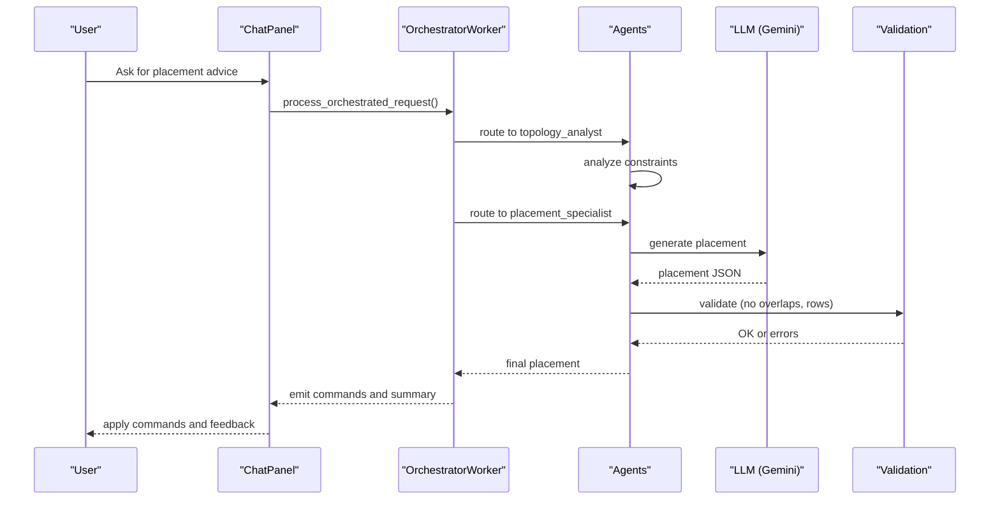
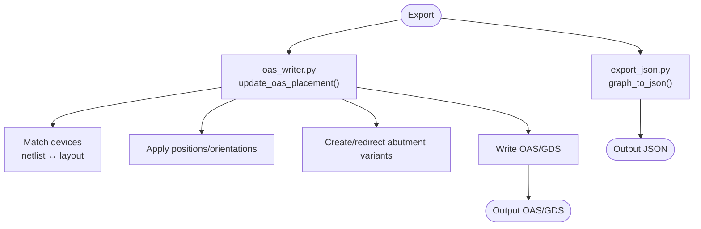
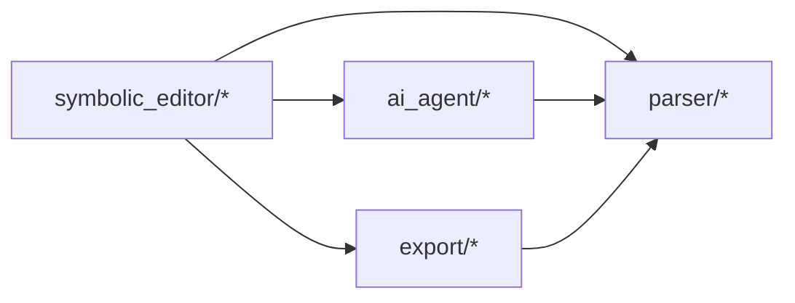

# Project Overview

<cite>
**Referenced Files in This Document**
- [README.md](file://README.md)
- [USER_GUIDE.md](file://docs/USER_GUIDE.md)
- [main.py](file://symbolic_editor/main.py)
- [layout_tab.py](file://symbolic_editor/layout_tab.py)
- [netlist_reader.py](file://parser/netlist_reader.py)
- [layout_reader.py](file://parser/layout_reader.py)
- [circuit_graph.py](file://parser/circuit_graph.py)
- [gemini_placer.py](file://ai_agent/ai_initial_placement/gemini_placer.py)
- [llm_worker.py](file://ai_agent/ai_chat_bot/llm_worker.py)
- [graph.py](file://ai_agent/ai_chat_bot/graph.py)
- [export_json.py](file://export/export_json.py)
- [oas_writer.py](file://export/oas_writer.py)
</cite>

## Table of Contents
1. [Introduction](#introduction)
2. [Project Structure](#project-structure)
3. [Core Components](#core-components)
4. [Architecture Overview](#architecture-overview)
5. [Detailed Component Analysis](#detailed-component-analysis)
6. [Dependency Analysis](#dependency-analysis)
7. [Performance Considerations](#performance-considerations)
8. [Troubleshooting Guide](#troubleshooting-guide)
9. [Conclusion](#conclusion)
10. [Appendices](#appendices)

## Introduction
This project is a desktop application that accelerates analog IC layout creation by blending a symbolic, interactive canvas with AI-assisted PMOS/NMOS device-level floorplanning. It targets VLSI engineers and students who design analog circuits and seek to streamline placement, improve symmetry and matching, and integrate modern AI into established EDA workflows. The system supports importing SPICE netlists and layout files, generating dual-format graph JSONs (full vs. compressed), running AI-powered initial placement, and exporting back to OASIS for downstream tools.

Key value proposition:
- Retains full compatibility with traditional EDA flows while augmenting them with AI.
- Preserves device-level detail for interactive editing and integrates AI as a guided assistant.
- Provides a structured pipeline from netlist import to AI placement and final layout export.

Target audience:
- Analog IC layout engineers optimizing device placement and matching.
- Students learning layout techniques (current mirrors, differential pairs, matching).
- Researchers exploring AI-driven EDA workflows.

## Project Structure
The repository is organized into modular packages:
- symbolic_editor: PySide6 GUI application hosting the interactive canvas, device hierarchy, AI chat panel, and KLayout integration.
- parser: Netlist and layout readers, graph builders, and device matchers.
- ai_agent: AI systems for initial placement and a multi-agent chat pipeline.
- export: JSON export and OASIS writer for final layout generation.
- examples: Ready-to-load example circuits.
- docs: User guide and implementation notes.

**Diagram sources**
- [main.py:1-800](file://symbolic_editor/main.py#L1-L800)
- [layout_tab.py:1-2023](file://symbolic_editor/layout_tab.py#L1-L2023)
- [netlist_reader.py:1-855](file://parser/netlist_reader.py#L1-L855)
- [layout_reader.py:1-442](file://parser/layout_reader.py#L1-L442)
- [circuit_graph.py:1-191](file://parser/circuit_graph.py#L1-L191)
- [llm_worker.py:1-461](file://ai_agent/ai_chat_bot/llm_worker.py#L1-L461)
- [graph.py:1-52](file://ai_agent/ai_chat_bot/graph.py#L1-L52)
- [gemini_placer.py:1-597](file://ai_agent/ai_initial_placement/gemini_placer.py#L1-L597)
- [export_json.py:1-58](file://export/export_json.py#L1-L58)
- [oas_writer.py:1-520](file://export/oas_writer.py#L1-L520)

**Section sources**
- [README.md:131-191](file://README.md#L131-L191)
- [USER_GUIDE.md:713-774](file://docs/USER_GUIDE.md#L713-L774)

## Core Components
- PySide6 GUI (symbolic_editor): Multi-tab application shell with a central canvas, device hierarchy, AI chat panel, and KLayout preview. It manages menus, toolbars, keyboard shortcuts, and delegates actions to the active tab.
- Parser (parser): Reads SPICE netlists and OASIS/GDS layouts, flattens hierarchies, parses device parameters, matches layout instances to netlist devices, and builds connectivity graphs.
- AI Agent (ai_agent): Provides two primary capabilities:
  - Initial placement: Gemini-based placement generator with robust JSON sanitization and validation.
  - Multi-agent chat: A 4-stage pipeline (Topology → Strategy → Placement → DRC → Routing) with human-in-the-loop interrupts.
- Export (export): Exports placement JSON and writes updated OASIS files with corrected positions, orientations, and abutment variants.

Executive summary of core features:
- Interactive canvas: Move, swap, delete, flip, merge, select-all; undo/redo; fit/view; dummy device placement; row-based abutment.
- AI chat panel: Multi-agent pipeline with classifier, topology analyst, placement specialist, DRC critic, and routing previewer; executes layout commands.
- Initial placement system: AI-optimized device coordinates generated from graph JSON.
- EDA tool integration: Import netlist + layout, export JSON, and export to OAS for KLayout.

**Section sources**
- [README.md:59-129](file://README.md#L59-L129)
- [USER_GUIDE.md:139-196](file://docs/USER_GUIDE.md#L139-L196)

## Architecture Overview
The system’s workflow spans GUI orchestration, parsing, AI processing, and export. The GUI drives import, placement, and refinement; parsers convert design files into graphs; AI agents generate or advise placements; exporters write back to OASIS.

**Diagram sources**
- [main.py:1-800](file://symbolic_editor/main.py#L1-L800)
- [layout_tab.py:1-2023](file://symbolic_editor/layout_tab.py#L1-L2023)
- [netlist_reader.py:726-761](file://parser/netlist_reader.py#L726-L761)
- [layout_reader.py:357-441](file://parser/layout_reader.py#L357-L441)
- [circuit_graph.py:131-190](file://parser/circuit_graph.py#L131-L190)
- [gemini_placer.py:422-597](file://ai_agent/ai_initial_placement/gemini_placer.py#L422-L597)
- [export_json.py:4-57](file://export/export_json.py#L4-L57)
- [oas_writer.py:269-519](file://export/oas_writer.py#L269-L519)

## Detailed Component Analysis

### GUI Frontend (PySide6)
- MainWindow hosts a tabbed interface; each tab encapsulates a LayoutEditorTab with its own editor, device tree, properties panel, chat panel, and KLayout preview.
- Menus and toolbars provide import, save, export, AI placement, and view controls.
- Keyboard shortcuts and mode toggles (dummy, abutment, move) enable efficient editing.
- The active tab receives user actions and coordinates with parsers, AI, and exporters.

**Diagram sources**
- [main.py:80-750](file://symbolic_editor/main.py#L80-L750)
- [layout_tab.py:64-365](file://symbolic_editor/layout_tab.py#L64-L365)

**Section sources**
- [main.py:1-800](file://symbolic_editor/main.py#L1-L800)
- [layout_tab.py:1-800](file://symbolic_editor/layout_tab.py#L1-L800)

### Parser Modules
- Netlist reader: Flattens hierarchical SPICE/CDL netlists, expands multi-finger/multiplier devices, and constructs a Netlist object with devices and connectivity.
- Layout reader: Parses OAS/GDS files, extracts transistor instances with geometry and orientation, and supports flat and hierarchical layouts.
- Circuit graph builder: Creates NetworkX graphs from netlists and merges with layout geometry for device-level placement.

**Diagram sources**
- [netlist_reader.py:260-761](file://parser/netlist_reader.py#L260-L761)
- [layout_reader.py:357-441](file://parser/layout_reader.py#L357-L441)
- [circuit_graph.py:131-190](file://parser/circuit_graph.py#L131-L190)

**Section sources**
- [netlist_reader.py:1-855](file://parser/netlist_reader.py#L1-L855)
- [layout_reader.py:1-442](file://parser/layout_reader.py#L1-L442)
- [circuit_graph.py:1-191](file://parser/circuit_graph.py#L1-L191)

### AI Agent System
- Initial placement: Gemini-based placement generator that validates outputs and ensures correct row assignments and no overlaps.
- Multi-agent chat: Orchestrated pipeline with classifier, topology analyst, strategy selector, placement specialist, DRC critic, and routing previewer. Human-in-the-loop interrupts enable strategy selection and visual review.

**Diagram sources**
- [llm_worker.py:167-461](file://ai_agent/ai_chat_bot/llm_worker.py#L167-L461)
- [graph.py:1-52](file://ai_agent/ai_chat_bot/graph.py#L1-L52)
- [gemini_placer.py:422-597](file://ai_agent/ai_initial_placement/gemini_placer.py#L422-L597)

**Section sources**
- [llm_worker.py:1-461](file://ai_agent/ai_chat_bot/llm_worker.py#L1-L461)
- [graph.py:1-52](file://ai_agent/ai_chat_bot/graph.py#L1-L52)
- [gemini_placer.py:1-597](file://ai_agent/ai_initial_placement/gemini_placer.py#L1-L597)

### Export Capabilities
- JSON export: Converts merged NetworkX graph to a compact JSON suitable for AI prompts.
- OASIS writer: Updates cell reference positions and orientations in OAS/GDS files, applies abutment variants, and writes the final layout.

**Diagram sources**
- [export_json.py:4-57](file://export/export_json.py#L4-L57)
- [oas_writer.py:269-519](file://export/oas_writer.py#L269-L519)

**Section sources**
- [export_json.py:1-58](file://export/export_json.py#L1-L58)
- [oas_writer.py:1-520](file://export/oas_writer.py#L1-L520)

## Dependency Analysis
High-level dependencies:
- GUI depends on parser modules for import and on export modules for output.
- AI chat depends on graph definitions and orchestrator workers; initial placement depends on Gemini APIs.
- Export relies on parser utilities for device matching and geometry inversion.

**Diagram sources**
- [main.py:1-800](file://symbolic_editor/main.py#L1-L800)
- [layout_tab.py:1-2023](file://symbolic_editor/layout_tab.py#L1-L2023)
- [netlist_reader.py:1-855](file://parser/netlist_reader.py#L1-L855)
- [layout_reader.py:1-442](file://parser/layout_reader.py#L1-L442)
- [circuit_graph.py:1-191](file://parser/circuit_graph.py#L1-L191)
- [llm_worker.py:1-461](file://ai_agent/ai_chat_bot/llm_worker.py#L1-L461)
- [gemini_placer.py:1-597](file://ai_agent/ai_initial_placement/gemini_placer.py#L1-L597)
- [export_json.py:1-58](file://export/export_json.py#L1-L58)
- [oas_writer.py:1-520](file://export/oas_writer.py#L1-L520)

**Section sources**
- [README.md:131-191](file://README.md#L131-L191)
- [USER_GUIDE.md:713-774](file://docs/USER_GUIDE.md#L713-L774)

## Performance Considerations
- Dual graph format: Full JSON for GUI detail; compressed JSON for AI prompts reduces token usage and speeds inference.
- Validation and sanitization: Initial placement includes robust JSON parsing and placement validation to prevent retries and failures.
- Human-in-the-loop pipeline: Interrupts allow users to correct or refine intermediate steps, reducing wasted compute.
- Export optimization: Variant cell catalog avoids redundant cell duplication and efficiently applies abutment flags.

[No sources needed since this section provides general guidance]

## Troubleshooting Guide
Common issues and resolutions:
- Missing API key: Ensure a valid key is set in the environment file for at least one supported provider.
- Module import errors: Activate the virtual environment and install dependencies from the requirements file.
- Blank canvas: Use Fit View to auto-zoom to loaded devices.
- Device mismatch: Confirm netlist and layout contain the same number of PMOS/NMOS devices for accurate matching.
- Slow AI responses: Rate limits may apply; wait and retry or switch providers.

**Section sources**
- [USER_GUIDE.md:653-711](file://docs/USER_GUIDE.md#L653-L711)

## Conclusion
This project demonstrates a practical fusion of traditional EDA and modern AI. By offering an interactive canvas, AI chat assistance, and a robust export pipeline, it accelerates analog layout workflows while maintaining fidelity to device-level details and established toolchains. Its modular architecture enables incremental adoption and future enhancements.

[No sources needed since this section summarizes without analyzing specific files]

## Appendices
- Quick start commands and keyboard shortcuts are documented in the project’s README and user guide.
- Example circuits are provided under the examples directory for immediate exploration.

**Section sources**
- [README.md:11-129](file://README.md#L11-L129)
- [USER_GUIDE.md:1-22](file://docs/USER_GUIDE.md#L1-L22)