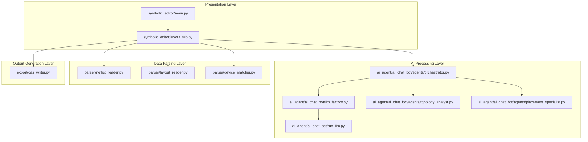
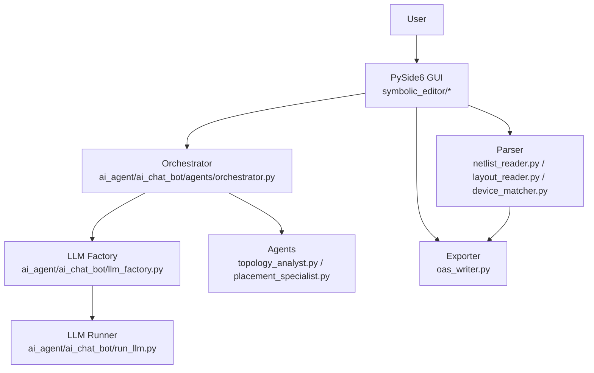
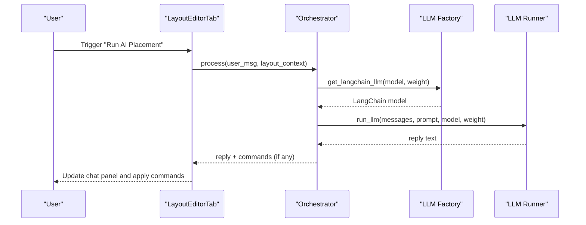
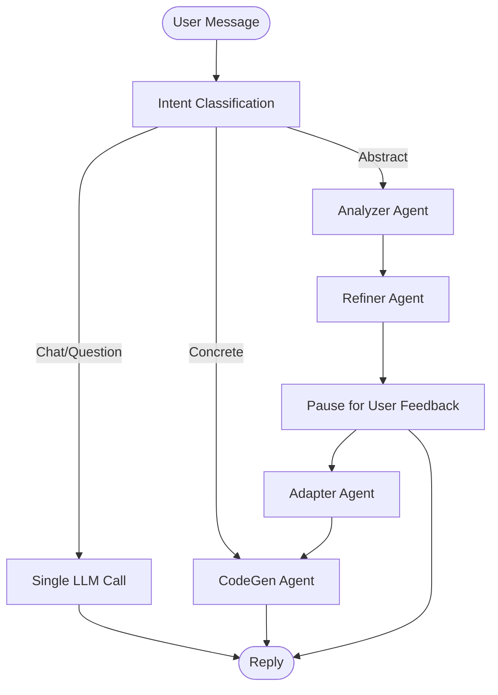
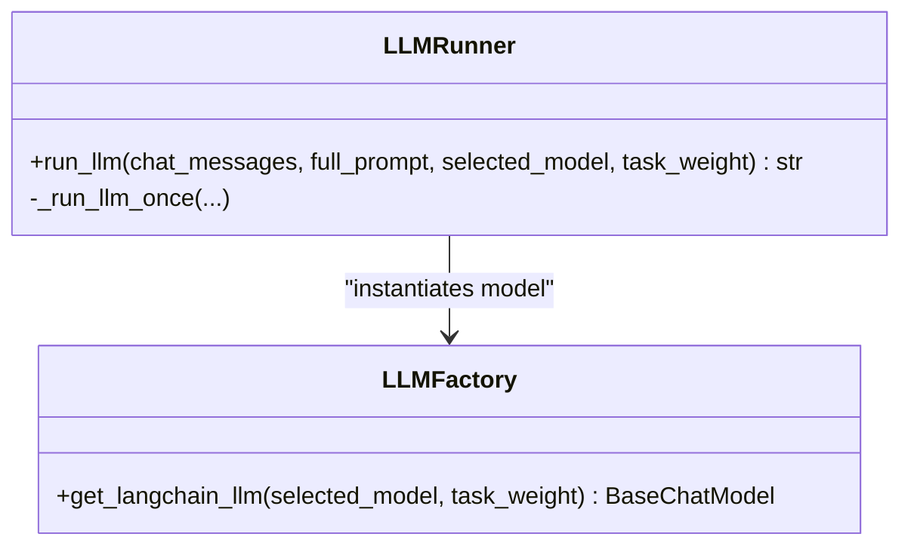
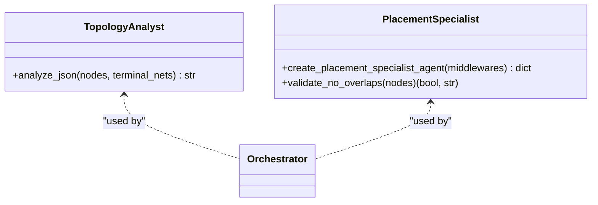
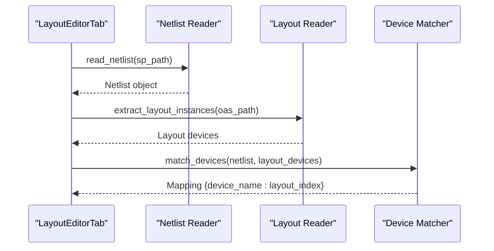
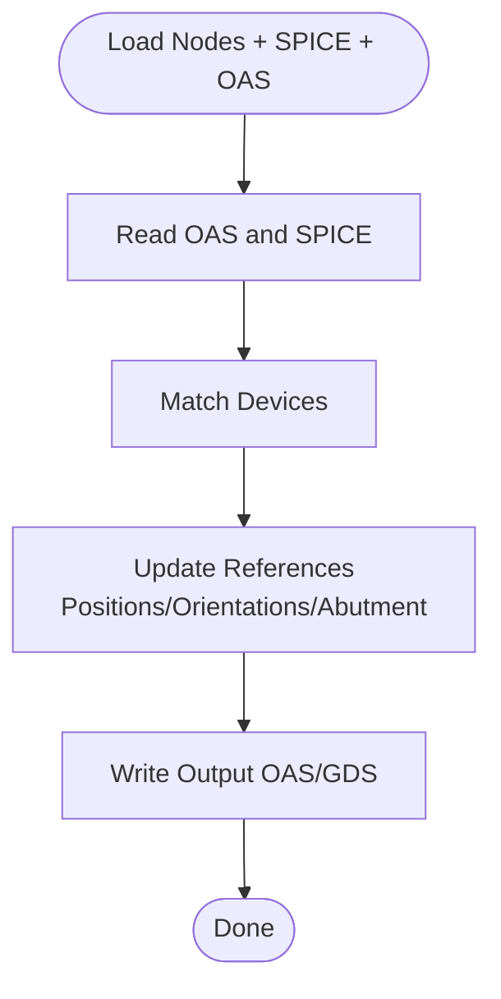
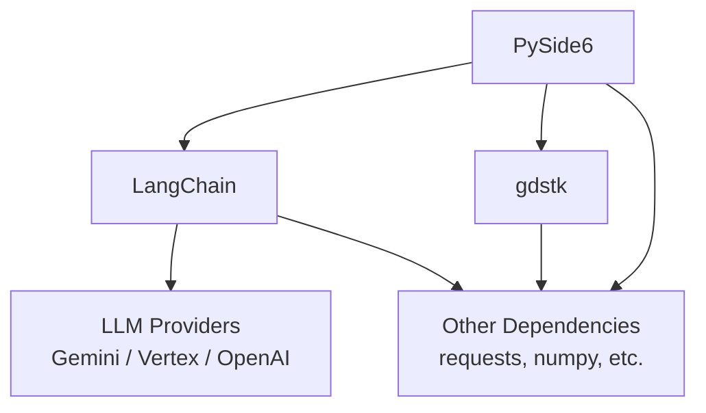

# System Architecture

<cite>
**Referenced Files in This Document**
- [README.md](file://README.md)
- [requirements.txt](file://requirements.txt)
- [symbolic_editor/main.py](file://symbolic_editor/main.py)
- [symbolic_editor/layout_tab.py](file://symbolic_editor/layout_tab.py)
- [ai_agent/ai_chat_bot/llm_factory.py](file://ai_agent/ai_chat_bot/llm_factory.py)
- [ai_agent/ai_chat_bot/run_llm.py](file://ai_agent/ai_chat_bot/run_llm.py)
- [ai_agent/ai_chat_bot/agents/orchestrator.py](file://ai_agent/ai_chat_bot/agents/orchestrator.py)
- [ai_agent/ai_chat_bot/agents/topology_analyst.py](file://ai_agent/ai_chat_bot/agents/topology_analyst.py)
- [ai_agent/ai_chat_bot/agents/placement_specialist.py](file://ai_agent/ai_chat_bot/agents/placement_specialist.py)
- [parser/netlist_reader.py](file://parser/netlist_reader.py)
- [parser/layout_reader.py](file://parser/layout_reader.py)
- [parser/device_matcher.py](file://parser/device_matcher.py)
- [export/oas_writer.py](file://export/oas_writer.py)
</cite>

## Table of Contents
1. [Introduction](#introduction)
2. [Project Structure](#project-structure)
3. [Core Components](#core-components)
4. [Architecture Overview](#architecture-overview)
5. [Detailed Component Analysis](#detailed-component-analysis)
6. [Dependency Analysis](#dependency-analysis)
7. [Performance Considerations](#performance-considerations)
8. [Troubleshooting Guide](#troubleshooting-guide)
9. [Conclusion](#conclusion)

## Introduction
This document describes the AI-Based Analog Layout Automation system architecture. The system integrates a PySide6-based GUI frontend with an AI agent pipeline, a robust parser for SPICE netlists and layout data, and export capabilities for OASIS/GDS. The architecture emphasizes layered separation:
- Presentation Layer (GUI)
- AI Processing Layer (multi-agent orchestration and LLM abstraction)
- Data Parsing Layer (netlist and layout readers, device matcher)
- Output Generation Layer (exporters and KLayout integration)

It documents component interactions, data flows from netlist import through AI processing to final layout export, system context diagrams, modular design principles, plugin architecture for LLM providers, and integration patterns with external tools like KLayout and EDA platforms.

## Project Structure
The repository is organized into four primary layers:
- symbolic_editor/: PySide6 GUI application hosting the canvas, device tree, chat panel, and KLayout integration
- ai_agent/: Multi-agent AI system with LLM factory, orchestrator, and specialized agents
- parser/: Netlist and layout readers, device matcher, and supporting utilities
- export/: Output writers for JSON and OASIS, plus KLayout rendering

**Diagram sources**
- [symbolic_editor/main.py:1-800](file://symbolic_editor/main.py#L1-L800)
- [symbolic_editor/layout_tab.py:1-800](file://symbolic_editor/layout_tab.py#L1-L800)
- [ai_agent/ai_chat_bot/llm_factory.py:1-131](file://ai_agent/ai_chat_bot/llm_factory.py#L1-L131)
- [ai_agent/ai_chat_bot/run_llm.py:1-162](file://ai_agent/ai_chat_bot/run_llm.py#L1-L162)
- [ai_agent/ai_chat_bot/agents/orchestrator.py:1-226](file://ai_agent/ai_chat_bot/agents/orchestrator.py#L1-L226)
- [ai_agent/ai_chat_bot/agents/topology_analyst.py:1-326](file://ai_agent/ai_chat_bot/agents/topology_analyst.py#L1-L326)
- [ai_agent/ai_chat_bot/agents/placement_specialist.py:1-829](file://ai_agent/ai_chat_bot/agents/placement_specialist.py#L1-L829)
- [parser/netlist_reader.py:1-855](file://parser/netlist_reader.py#L1-L855)
- [parser/layout_reader.py:1-442](file://parser/layout_reader.py#L1-L442)
- [parser/device_matcher.py:1-151](file://parser/device_matcher.py#L1-L151)
- [export/oas_writer.py:1-520](file://export/oas_writer.py#L1-L520)

**Section sources**
- [README.md:131-191](file://README.md#L131-L191)

## Core Components
- PySide6 GUI (symbolic_editor): Provides the interactive canvas, device hierarchy, chat panel, KLayout preview, and toolbar actions. It manages per-tab documents and delegates AI commands and export operations.
- AI Agent System (ai_agent): Implements a multi-agent pipeline with an orchestrator, classifier, topology analyst, and placement specialist. It uses a centralized LLM factory and a unified LLM runner with retry/backoff logic.
- Parser (parser): Reads SPICE netlists and OASIS/GDS layout files, builds device graphs, and matches netlist devices to layout instances.
- Export (export): Generates JSON placement exports and updates OAS/GDS files with new positions, abutment variants, and orientations.

Key responsibilities:
- Presentation: User interaction, drag-and-drop, keyboard shortcuts, and workspace modes
- AI Processing: Intent classification, multi-agent orchestration, and command generation
- Data Parsing: Hierarchical netlist flattening, device parsing, and spatial matching
- Output Generation: OASIS/GDS updates, abutment handling, and KLayout integration

**Section sources**
- [symbolic_editor/main.py:1-800](file://symbolic_editor/main.py#L1-L800)
- [symbolic_editor/layout_tab.py:1-800](file://symbolic_editor/layout_tab.py#L1-L800)
- [ai_agent/ai_chat_bot/llm_factory.py:1-131](file://ai_agent/ai_chat_bot/llm_factory.py#L1-L131)
- [ai_agent/ai_chat_bot/run_llm.py:1-162](file://ai_agent/ai_chat_bot/run_llm.py#L1-L162)
- [ai_agent/ai_chat_bot/agents/orchestrator.py:1-226](file://ai_agent/ai_chat_bot/agents/orchestrator.py#L1-L226)
- [parser/netlist_reader.py:1-855](file://parser/netlist_reader.py#L1-L855)
- [parser/layout_reader.py:1-442](file://parser/layout_reader.py#L1-L442)
- [parser/device_matcher.py:1-151](file://parser/device_matcher.py#L1-L151)
- [export/oas_writer.py:1-520](file://export/oas_writer.py#L1-L520)

## Architecture Overview
The system follows a layered architecture with clear separation of concerns:
- Presentation Layer: Hosted by PySide6, it renders the symbolic layout, device hierarchy, and chat UI. It emits actions (e.g., import, AI placement, export) that trigger backend processing.
- AI Processing Layer: Provides a plugin-like LLM abstraction and a multi-agent orchestration pipeline. The orchestrator routes user intents to specialized agents and compiles [CMD] blocks for the GUI to execute.
- Data Parsing Layer: Converts SPICE netlists and layout files into structured graphs and matches devices for synchronization.
- Output Generation Layer: Produces JSON exports and updates OAS/GDS files with new placements and abutment variants.

**Diagram sources**
- [symbolic_editor/main.py:1-800](file://symbolic_editor/main.py#L1-L800)
- [ai_agent/ai_chat_bot/agents/orchestrator.py:1-226](file://ai_agent/ai_chat_bot/agents/orchestrator.py#L1-L226)
- [ai_agent/ai_chat_bot/llm_factory.py:1-131](file://ai_agent/ai_chat_bot/llm_factory.py#L1-L131)
- [ai_agent/ai_chat_bot/run_llm.py:1-162](file://ai_agent/ai_chat_bot/run_llm.py#L1-L162)
- [ai_agent/ai_chat_bot/agents/topology_analyst.py:1-326](file://ai_agent/ai_chat_bot/agents/topology_analyst.py#L1-L326)
- [ai_agent/ai_chat_bot/agents/placement_specialist.py:1-829](file://ai_agent/ai_chat_bot/agents/placement_specialist.py#L1-L829)
- [parser/netlist_reader.py:1-855](file://parser/netlist_reader.py#L1-L855)
- [parser/layout_reader.py:1-442](file://parser/layout_reader.py#L1-L442)
- [parser/device_matcher.py:1-151](file://parser/device_matcher.py#L1-L151)
- [export/oas_writer.py:1-520](file://export/oas_writer.py#L1-L520)

## Detailed Component Analysis

### GUI Frontend (PySide6)
- MainWindow and LayoutEditorTab manage multi-tab documents, device tree, properties panel, chat panel, and KLayout preview.
- Emits actions for import, AI placement, save/export, and workspace switching.
- Integrates with AI workers and device matcher to synchronize layout state.

**Diagram sources**
- [symbolic_editor/layout_tab.py:1-800](file://symbolic_editor/layout_tab.py#L1-L800)
- [ai_agent/ai_chat_bot/agents/orchestrator.py:1-226](file://ai_agent/ai_chat_bot/agents/orchestrator.py#L1-L226)
- [ai_agent/ai_chat_bot/llm_factory.py:1-131](file://ai_agent/ai_chat_bot/llm_factory.py#L1-L131)
- [ai_agent/ai_chat_bot/run_llm.py:1-162](file://ai_agent/ai_chat_bot/run_llm.py#L1-L162)

**Section sources**
- [symbolic_editor/main.py:1-800](file://symbolic_editor/main.py#L1-L800)
- [symbolic_editor/layout_tab.py:1-800](file://symbolic_editor/layout_tab.py#L1-L800)

### AI Agent Orchestration
- Orchestrator classifies user intent (chat/question/concrete/abstract) and routes to appropriate agents.
- Supports a four-stage pipeline: Analyzer → Refiner (pause) → Adapter → CodeGen.
- Uses a lightweight state machine to handle user feedback for abstract requests.

**Diagram sources**
- [ai_agent/ai_chat_bot/agents/orchestrator.py:1-226](file://ai_agent/ai_chat_bot/agents/orchestrator.py#L1-L226)

**Section sources**
- [ai_agent/ai_chat_bot/agents/orchestrator.py:1-226](file://ai_agent/ai_chat_bot/agents/orchestrator.py#L1-L226)

### LLM Factory and Runner
- LLM Factory centralizes model instantiation, selecting providers (Gemini, Alibaba, Vertex) and weights (light/heavy).
- LLM Runner provides a unified interface with automatic retry/backoff for transient API errors.

**Diagram sources**
- [ai_agent/ai_chat_bot/llm_factory.py:1-131](file://ai_agent/ai_chat_bot/llm_factory.py#L1-L131)
- [ai_agent/ai_chat_bot/run_llm.py:1-162](file://ai_agent/ai_chat_bot/run_llm.py#L1-L162)

**Section sources**
- [ai_agent/ai_chat_bot/llm_factory.py:1-131](file://ai_agent/ai_chat_bot/llm_factory.py#L1-L131)
- [ai_agent/ai_chat_bot/run_llm.py:1-162](file://ai_agent/ai_chat_bot/run_llm.py#L1-L162)

### Specialized Agents
- Topology Analyst: Parses layout JSON and identifies matching/symmetry requirements and circuit topologies.
- Placement Specialist: Generates [CMD] blocks for device positioning with strict inventory conservation, row-based constraints, and routing quality checks.

**Diagram sources**
- [ai_agent/ai_chat_bot/agents/topology_analyst.py:1-326](file://ai_agent/ai_chat_bot/agents/topology_analyst.py#L1-L326)
- [ai_agent/ai_chat_bot/agents/placement_specialist.py:1-829](file://ai_agent/ai_chat_bot/agents/placement_specialist.py#L1-L829)

**Section sources**
- [ai_agent/ai_chat_bot/agents/topology_analyst.py:1-326](file://ai_agent/ai_chat_bot/agents/topology_analyst.py#L1-L326)
- [ai_agent/ai_chat_bot/agents/placement_specialist.py:1-829](file://ai_agent/ai_chat_bot/agents/placement_specialist.py#L1-L829)

### Parser Modules
- Netlist Reader: Flattens hierarchical SPICE/CDL netlists, parses devices (MOS, resistors, capacitors), and builds connectivity.
- Layout Reader: Extracts device instances from OAS/GDS, handling flat and hierarchical layouts, and PCell parameter parsing.
- Device Matcher: Matches netlist devices to layout instances by type, count, and logical parents.

**Diagram sources**
- [parser/netlist_reader.py:1-855](file://parser/netlist_reader.py#L1-L855)
- [parser/layout_reader.py:1-442](file://parser/layout_reader.py#L1-L442)
- [parser/device_matcher.py:1-151](file://parser/device_matcher.py#L1-L151)

**Section sources**
- [parser/netlist_reader.py:1-855](file://parser/netlist_reader.py#L1-L855)
- [parser/layout_reader.py:1-442](file://parser/layout_reader.py#L1-L442)
- [parser/device_matcher.py:1-151](file://parser/device_matcher.py#L1-L151)

### Export and KLayout Integration
- OAS Writer updates OAS/GDS files with new positions, orientations, and abutment variants. It rebuilds libraries and references to ensure correctness.
- KLayout integration is available via the GUI panel for preview and viewing.

**Diagram sources**
- [export/oas_writer.py:1-520](file://export/oas_writer.py#L1-L520)

**Section sources**
- [export/oas_writer.py:1-520](file://export/oas_writer.py#L1-L520)

## Dependency Analysis
Technology stack and third-party dependencies include:
- PySide6 for GUI
- LangChain and providers (Google Generative AI, Vertex AI, OpenAI-compatible)
- gdstk for OASIS/GDS manipulation
- Additional scientific and networking libraries for parsing, HTTP, and utilities

**Diagram sources**
- [requirements.txt:1-157](file://requirements.txt#L1-L157)

**Section sources**
- [requirements.txt:1-157](file://requirements.txt#L1-L157)

## Performance Considerations
- Dual graph format: The system generates both full and compressed graph JSONs to balance GUI fidelity and AI prompt efficiency.
- LLM retry/backoff: Automatic exponential backoff reduces transient API failures impacting the multi-agent pipeline.
- Spatial matching: Device matching leverages natural sorting and spatial grouping to minimize mismatches.
- Export pipeline: Fresh library reconstruction ensures correctness at the cost of memory; consider incremental updates for very large designs.

## Troubleshooting Guide
Common issues and resolutions:
- LLM API errors: The LLM runner detects rate limiting and service unavailability, returning informative messages and retrying with backoff.
- Partial device matching: When counts differ between netlist and layout, the matcher falls back to logical parent grouping and logs warnings.
- OAS/GDS updates: Ensure the original OAS file contains top-level cells and that device types match expected PCell naming conventions.

**Section sources**
- [ai_agent/ai_chat_bot/run_llm.py:1-162](file://ai_agent/ai_chat_bot/run_llm.py#L1-L162)
- [parser/device_matcher.py:1-151](file://parser/device_matcher.py#L1-L151)
- [export/oas_writer.py:1-520](file://export/oas_writer.py#L1-L520)

## Conclusion
The AI-Based Analog Layout Automation system cleanly separates presentation, AI processing, parsing, and output generation into cohesive layers. Its modular design enables extensible LLM provider plugins, robust multi-agent orchestration, and seamless integration with EDA tools through OASIS/GDS and KLayout. The dual graph format and careful spatial matching ensure efficient AI prompting and reliable layout synchronization.