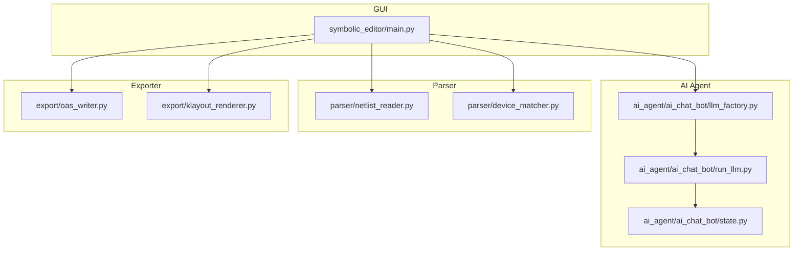
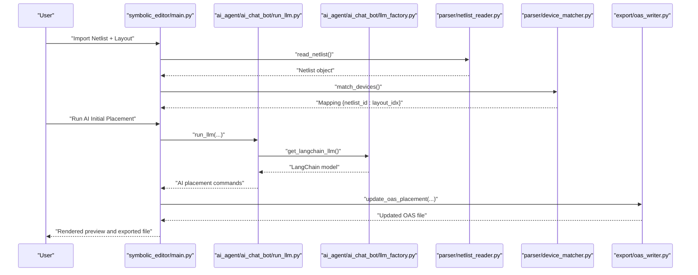
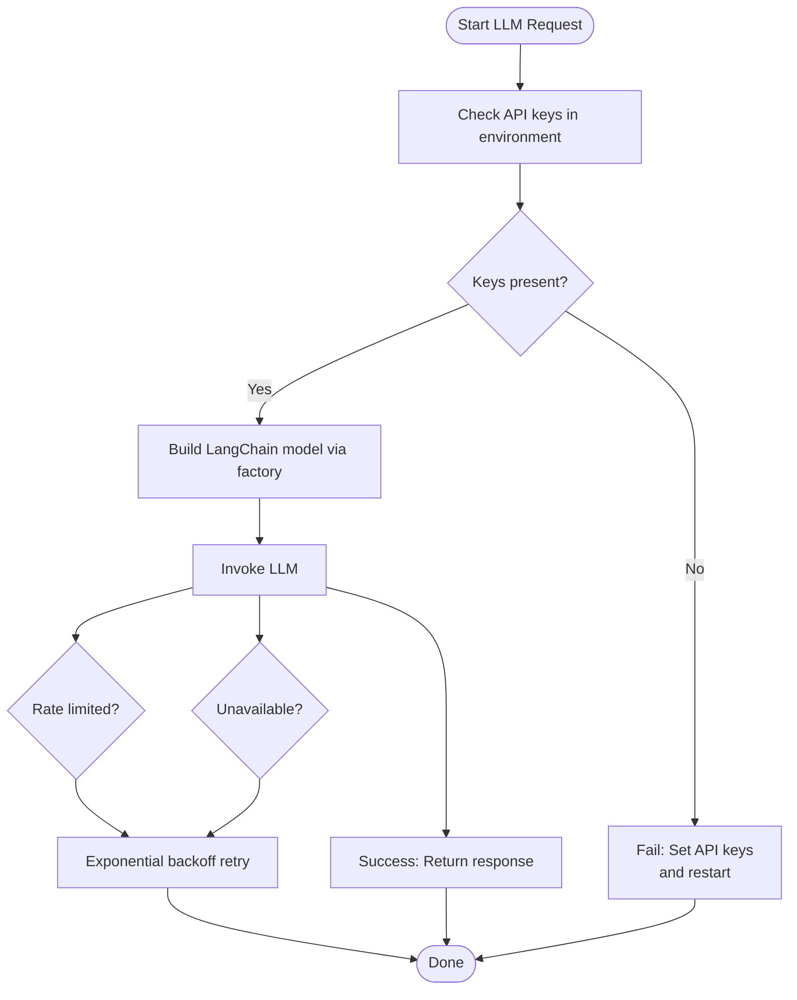
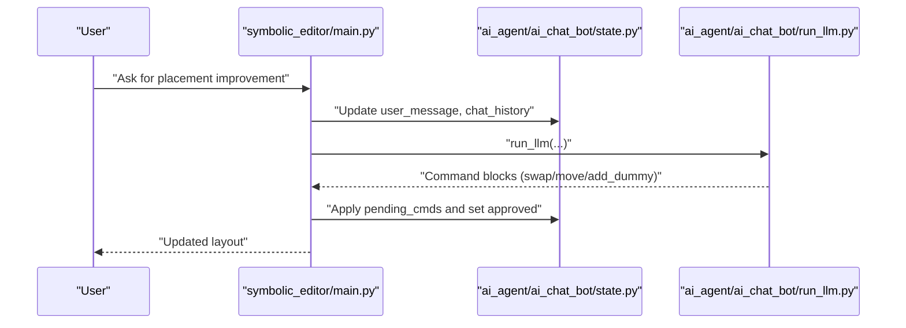
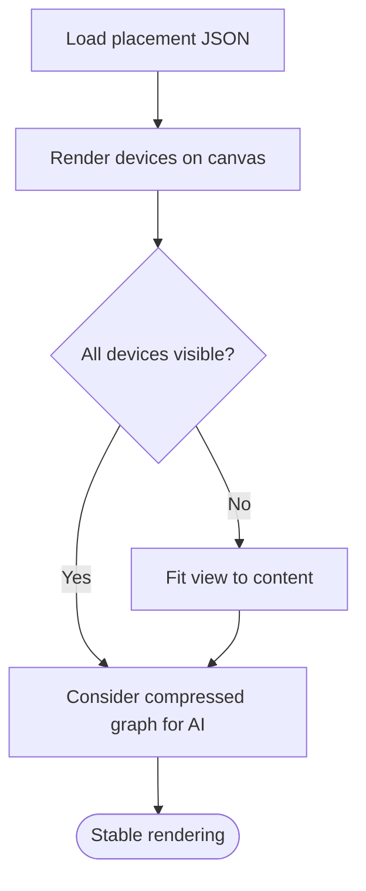
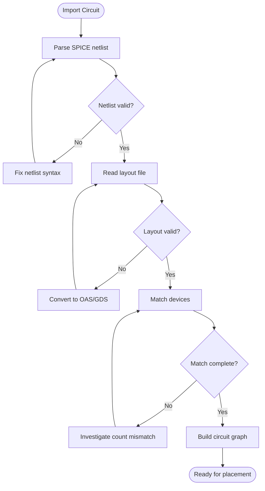
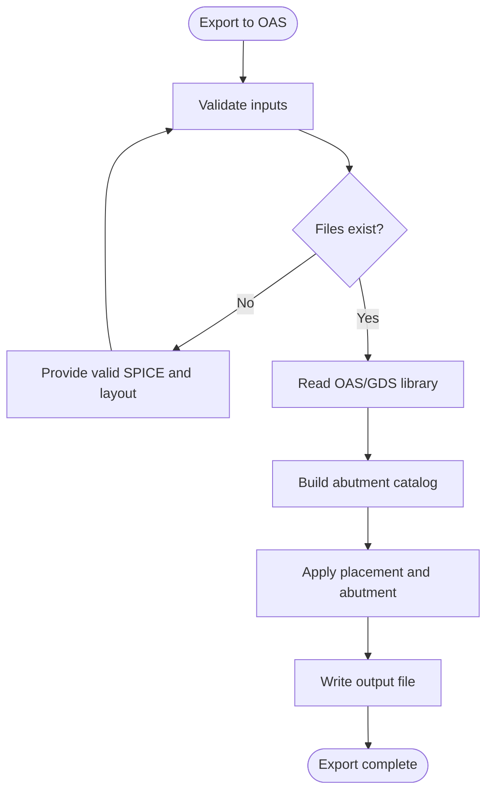
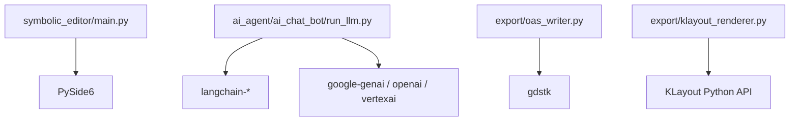

# Troubleshooting and FAQ

<cite>
**Referenced Files in This Document**
- [README.md](file://README.md)
- [USER_GUIDE.md](file://docs/USER_GUIDE.md)
- [requirements.txt](file://requirements.txt)
- [main.py](file://symbolic_editor/main.py)
- [ai_model_dialog.py](file://symbolic_editor/dialogs/ai_model_dialog.py)
- [llm_factory.py](file://ai_agent/ai_chat_bot/llm_factory.py)
- [run_llm.py](file://ai_agent/ai_chat_bot/run_llm.py)
- [state.py](file://ai_agent/ai_chat_bot/state.py)
- [netlist_reader.py](file://parser/netlist_reader.py)
- [device_matcher.py](file://parser/device_matcher.py)
- [oas_writer.py](file://export/oas_writer.py)
- [klayout_renderer.py](file://export/klayout_renderer.py)
</cite>

## Table of Contents
1. [Introduction](#introduction)
2. [Project Structure](#project-structure)
3. [Core Components](#core-components)
4. [Architecture Overview](#architecture-overview)
5. [Detailed Component Analysis](#detailed-component-analysis)
6. [Dependency Analysis](#dependency-analysis)
7. [Performance Considerations](#performance-considerations)
8. [Troubleshooting Guide](#troubleshooting-guide)
9. [Conclusion](#conclusion)
10. [Appendices](#appendices)

## Introduction
This document provides comprehensive troubleshooting guidance for the AI-Based Analog Layout Automation project. It focuses on:
- API key configuration and LLM provider connectivity
- AI response quality and multi-agent pipeline issues
- Canvas rendering and memory concerns with large layouts
- Import problems (netlist parsing, layout compatibility, device matching)
- Export issues (file format conversion and EDA tool integration)
- Debugging procedures and diagnostic strategies
- Known limitations and practical workarounds

## Project Structure
The application is organized into modular components:
- GUI shell and canvas: symbolic_editor
- AI chat and multi-agent pipeline: ai_agent
- Parser for netlist and layout: parser
- Exporters for JSON and OASIS: export

**Diagram sources**
- [main.py:1-800](file://symbolic_editor/main.py#L1-L800)
- [llm_factory.py:1-131](file://ai_agent/ai_chat_bot/llm_factory.py#L1-L131)
- [run_llm.py:1-162](file://ai_agent/ai_chat_bot/run_llm.py#L1-L162)
- [state.py:1-37](file://ai_agent/ai_chat_bot/state.py#L1-L37)
- [netlist_reader.py:1-855](file://parser/netlist_reader.py#L1-L855)
- [device_matcher.py:1-151](file://parser/device_matcher.py#L1-L151)
- [oas_writer.py:1-520](file://export/oas_writer.py#L1-L520)
- [klayout_renderer.py:1-74](file://export/klayout_renderer.py#L1-L74)

**Section sources**
- [README.md:131-191](file://README.md#L131-L191)
- [USER_GUIDE.md:713-779](file://docs/USER_GUIDE.md#L713-L779)

## Core Components
- GUI entry and orchestration: [main.py:1-800](file://symbolic_editor/main.py#L1-L800)
- LLM factory and provider selection: [llm_factory.py:1-131](file://ai_agent/ai_chat_bot/llm_factory.py#L1-L131)
- Unified LLM runner with retries: [run_llm.py:1-162](file://ai_agent/ai_chat_bot/run_llm.py#L1-L162)
- AI state container: [state.py:1-37](file://ai_agent/ai_chat_bot/state.py#L1-L37)
- Netlist parsing and flattening: [netlist_reader.py:1-855](file://parser/netlist_reader.py#L1-L855)
- Layout-to-netlist device matching: [device_matcher.py:1-151](file://parser/device_matcher.py#L1-L151)
- OASIS writer and abutment handling: [oas_writer.py:1-520](file://export/oas_writer.py#L1-L520)
- KLayout renderer for previews: [klayout_renderer.py:1-74](file://export/klayout_renderer.py#L1-L74)

**Section sources**
- [main.py:1-800](file://symbolic_editor/main.py#L1-L800)
- [llm_factory.py:1-131](file://ai_agent/ai_chat_bot/llm_factory.py#L1-L131)
- [run_llm.py:1-162](file://ai_agent/ai_chat_bot/run_llm.py#L1-L162)
- [state.py:1-37](file://ai_agent/ai_chat_bot/state.py#L1-L37)
- [netlist_reader.py:1-855](file://parser/netlist_reader.py#L1-L855)
- [device_matcher.py:1-151](file://parser/device_matcher.py#L1-L151)
- [oas_writer.py:1-520](file://export/oas_writer.py#L1-L520)
- [klayout_renderer.py:1-74](file://export/klayout_renderer.py#L1-L74)

## Architecture Overview
The end-to-end workflow integrates GUI orchestration, AI multi-agent pipeline, parsing, and exporting.

**Diagram sources**
- [main.py:1-800](file://symbolic_editor/main.py#L1-L800)
- [run_llm.py:76-162](file://ai_agent/ai_chat_bot/run_llm.py#L76-L162)
- [llm_factory.py:29-131](file://ai_agent/ai_chat_bot/llm_factory.py#L29-L131)
- [netlist_reader.py:726-761](file://parser/netlist_reader.py#L726-L761)
- [device_matcher.py:85-151](file://parser/device_matcher.py#L85-L151)
- [oas_writer.py:269-520](file://export/oas_writer.py#L269-L520)

## Detailed Component Analysis

### API Key Configuration and LLM Connectivity
Common issues:
- Missing or invalid API keys
- Provider-specific environment variables
- Network throttling and rate limits
- Model selection and timeouts

Diagnostic steps:
- Confirm environment variables are present and valid
- Verify provider-specific variables (e.g., Vertex project/location)
- Check LLM factory logs for provider/model selection and timeouts
- Review retry logic for transient errors

**Diagram sources**
- [llm_factory.py:29-131](file://ai_agent/ai_chat_bot/llm_factory.py#L29-L131)
- [run_llm.py:76-162](file://ai_agent/ai_chat_bot/run_llm.py#L76-L162)

**Section sources**
- [llm_factory.py:19-27](file://ai_agent/ai_chat_bot/llm_factory.py#L19-L27)
- [llm_factory.py:46-47](file://ai_agent/ai_chat_bot/llm_factory.py#L46-L47)
- [llm_factory.py:57-126](file://ai_agent/ai_chat_bot/llm_factory.py#L57-L126)
- [run_llm.py:20-43](file://ai_agent/ai_chat_bot/run_llm.py#L20-L43)
- [run_llm.py:91-124](file://ai_agent/ai_chat_bot/run_llm.py#L91-L124)
- [run_llm.py:126-162](file://ai_agent/ai_chat_bot/run_llm.py#L126-L162)
- [USER_GUIDE.md:653-711](file://docs/USER_GUIDE.md#L653-L711)

### AI Response Quality and Multi-Agent Pipeline
Common issues:
- Ambiguous prompts leading to low-quality commands
- Pipeline stalls or partial results
- State inconsistencies across stages

Best practices:
- Provide explicit device IDs and precise actions
- Load a matching SPICE netlist for topology context
- Use the multi-agent pipeline for complex tasks
- Inspect and approve intermediate results

**Diagram sources**
- [state.py:1-37](file://ai_agent/ai_chat_bot/state.py#L1-L37)
- [run_llm.py:76-162](file://ai_agent/ai_chat_bot/run_llm.py#L76-L162)
- [main.py:1-800](file://symbolic_editor/main.py#L1-L800)

**Section sources**
- [state.py:3-37](file://ai_agent/ai_chat_bot/state.py#L3-L37)
- [run_llm.py:45-69](file://ai_agent/ai_chat_bot/run_llm.py#L45-L69)
- [USER_GUIDE.md:531-586](file://docs/USER_GUIDE.md#L531-L586)

### Canvas Rendering and Memory Issues with Large Layouts
Common issues:
- Blank or partially visible canvas
- Slow rendering with many devices
- Out-of-memory errors on very large designs

Mitigations:
- Fit view after loading
- Reduce unnecessary visual complexity
- Prefer compressed graph for AI prompts
- Use standard cell examples to test performance

**Diagram sources**
- [main.py:1-800](file://symbolic_editor/main.py#L1-L800)
- [USER_GUIDE.md:682-691](file://docs/USER_GUIDE.md#L682-L691)

**Section sources**
- [USER_GUIDE.md:682-691](file://docs/USER_GUIDE.md#L682-L691)

### Import Problems: Netlist Parsing, Layout Compatibility, Device Matching
Common issues:
- Netlist parsing errors (missing or malformed lines)
- Layout file compatibility (.oas vs .gds)
- Device count mismatches between netlist and layout

Diagnostic steps:
- Validate SPICE netlist syntax and hierarchy
- Ensure layout file is valid OASIS/GDS
- Confirm NMOS/PMOS counts match between netlist and layout
- Check terminal output for matching warnings

**Diagram sources**
- [netlist_reader.py:260-318](file://parser/netlist_reader.py#L260-L318)
- [netlist_reader.py:726-761](file://parser/netlist_reader.py#L726-L761)
- [device_matcher.py:85-151](file://parser/device_matcher.py#L85-L151)
- [oas_writer.py:269-281](file://export/oas_writer.py#L269-L281)

**Section sources**
- [netlist_reader.py:121-149](file://parser/netlist_reader.py#L121-L149)
- [netlist_reader.py:260-318](file://parser/netlist_reader.py#L260-L318)
- [netlist_reader.py:726-761](file://parser/netlist_reader.py#L726-L761)
- [device_matcher.py:85-151](file://parser/device_matcher.py#L85-L151)
- [USER_GUIDE.md:696-701](file://docs/USER_GUIDE.md#L696-L701)

### Export Problems: File Format Conversion and EDA Tool Integration
Common issues:
- Incorrect output format selection
- Missing or invalid input files
- Abutment variant creation failures
- KLayout rendering errors

Diagnostic steps:
- Verify input SPICE and layout files exist
- Check output format extension (.oas or .gds)
- Inspect KLayout renderer logs for missing files
- Validate abutment flags and geometric clipping

**Diagram sources**
- [oas_writer.py:269-281](file://export/oas_writer.py#L269-L281)
- [oas_writer.py:303-417](file://export/oas_writer.py#L303-L417)
- [oas_writer.py:514-520](file://export/oas_writer.py#L514-L520)
- [klayout_renderer.py:16-36](file://export/klayout_renderer.py#L16-L36)

**Section sources**
- [oas_writer.py:269-281](file://export/oas_writer.py#L269-L281)
- [oas_writer.py:303-417](file://export/oas_writer.py#L303-L417)
- [oas_writer.py:514-520](file://export/oas_writer.py#L514-L520)
- [klayout_renderer.py:16-36](file://export/klayout_renderer.py#L16-L36)

### Debugging Procedures and Logging Strategies
Recommended practices:
- Enable verbose logging in parsers and exporters
- Inspect terminal output for warnings and errors
- Use the AI model selection dialog to verify environment variables
- Monitor LLM factory initialization logs
- Validate intermediate artifacts (graph JSON, placement JSON)

Checklist:
- API keys present and accessible
- Network connectivity verified
- Files exist and are readable
- Matching produces a complete mapping
- Export writes to intended path

**Section sources**
- [ai_model_dialog.py:280-308](file://symbolic_editor/dialogs/ai_model_dialog.py#L280-L308)
- [llm_factory.py:49-54](file://ai_agent/ai_chat_bot/llm_factory.py#L49-L54)
- [llm_factory.py:128-130](file://ai_agent/ai_chat_bot/llm_factory.py#L128-L130)
- [netlist_reader.py:737-740](file://parser/netlist_reader.py#L737-L740)
- [netlist_reader.py:778-781](file://parser/netlist_reader.py#L778-L781)

## Dependency Analysis
External dependencies relevant to troubleshooting:
- PySide6 for GUI
- LangChain providers (Google GenAI, OpenAI, Vertex AI)
- gdstk for OASIS/GDS manipulation
- KLayout for rendering previews

**Diagram sources**
- [requirements.txt:1-157](file://requirements.txt#L1-L157)
- [main.py:1-800](file://symbolic_editor/main.py#L1-L800)
- [run_llm.py:1-162](file://ai_agent/ai_chat_bot/run_llm.py#L1-L162)
- [oas_writer.py:1-520](file://export/oas_writer.py#L1-L520)
- [klayout_renderer.py:1-74](file://export/klayout_renderer.py#L1-L74)

**Section sources**
- [requirements.txt:29-30](file://requirements.txt#L29-L30)
- [requirements.txt:153-157](file://requirements.txt#L153-L157)

## Performance Considerations
- Prefer compressed graph format for AI prompts to reduce payload size
- Limit concurrent LLM calls and use exponential backoff for resilience
- Use simulated annealing post-processing selectively for large layouts
- Keep device counts balanced between netlist and layout to minimize matching overhead

[No sources needed since this section provides general guidance]

## Troubleshooting Guide

### API Key and Provider Connectivity
Symptoms:
- “All AI models failed”
- Rate limit errors (429/503)
- Empty or minimal AI responses

Actions:
- Ensure at least one API key is set in environment
- Verify provider-specific variables (e.g., Vertex project/location)
- Check LLM factory logs for provider/model selection
- Implement exponential backoff for transient errors

**Section sources**
- [USER_GUIDE.md:653-711](file://docs/USER_GUIDE.md#L653-L711)
- [llm_factory.py:46-47](file://ai_agent/ai_chat_bot/llm_factory.py#L46-L47)
- [llm_factory.py:57-126](file://ai_agent/ai_chat_bot/llm_factory.py#L57-L126)
- [run_llm.py:91-124](file://ai_agent/ai_chat_bot/run_llm.py#L91-L124)

### AI Response Quality and Multi-Agent Pipeline
Symptoms:
- Vague or ambiguous commands
- Pipeline stalls or partial results
- Unexpected layout changes

Actions:
- Provide explicit device IDs and precise actions
- Load a matching SPICE netlist for topology context
- Use the multi-agent pipeline for complex tasks
- Inspect and approve intermediate results

**Section sources**
- [USER_GUIDE.md:531-586](file://docs/USER_GUIDE.md#L531-L586)
- [state.py:3-37](file://ai_agent/ai_chat_bot/state.py#L3-L37)

### Canvas Rendering and Large Layouts
Symptoms:
- Blank canvas after loading
- Slow rendering with many devices
- Out-of-memory errors

Actions:
- Fit view after loading
- Reduce visual complexity
- Use compressed graph for AI prompts
- Test with standard cell examples

**Section sources**
- [USER_GUIDE.md:682-691](file://docs/USER_GUIDE.md#L682-L691)

### Import Problems
Symptoms:
- Import succeeds but devices have wrong positions
- Device matching warnings in terminal
- Netlist parsing errors

Actions:
- Validate SPICE netlist syntax and hierarchy
- Ensure layout file is valid OASIS/GDS
- Confirm NMOS/PMOS counts match between netlist and layout
- Check terminal output for matching warnings

**Section sources**
- [USER_GUIDE.md:696-701](file://docs/USER_GUIDE.md#L696-L701)
- [netlist_reader.py:260-318](file://parser/netlist_reader.py#L260-L318)
- [device_matcher.py:117-136](file://parser/device_matcher.py#L117-L136)

### Export Problems
Symptoms:
- Export fails with file not found errors
- Incorrect output format
- KLayout rendering errors

Actions:
- Verify input SPICE and layout files exist
- Check output format extension (.oas or .gds)
- Inspect KLayout renderer logs for missing files
- Validate abutment flags and geometric clipping

**Section sources**
- [oas_writer.py:272-275](file://export/oas_writer.py#L272-L275)
- [oas_writer.py:420-423](file://export/oas_writer.py#L420-L423)
- [klayout_renderer.py:28-36](file://export/klayout_renderer.py#L28-L36)

### Debugging and Logging
Actions:
- Enable verbose logging in parsers and exporters
- Inspect terminal output for warnings and errors
- Use the AI model selection dialog to verify environment variables
- Monitor LLM factory initialization logs
- Validate intermediate artifacts (graph JSON, placement JSON)

**Section sources**
- [ai_model_dialog.py:280-308](file://symbolic_editor/dialogs/ai_model_dialog.py#L280-L308)
- [llm_factory.py:49-54](file://ai_agent/ai_chat_bot/llm_factory.py#L49-L54)
- [netlist_reader.py:737-740](file://parser/netlist_reader.py#L737-L740)
- [netlist_reader.py:778-781](file://parser/netlist_reader.py#L778-L781)

## Conclusion
This guide consolidates actionable steps to diagnose and resolve common issues across API configuration, AI pipeline reliability, import/export workflows, and performance. By following the structured troubleshooting procedures and leveraging the diagnostic strategies outlined above, most problems can be quickly identified and resolved.

[No sources needed since this section summarizes without analyzing specific files]

## Appendices

### Quick Fixes Checklist
- Confirm API keys are set and valid
- Fit view after loading
- Validate netlist and layout compatibility
- Use multi-agent pipeline for complex tasks
- Export with correct file extension

**Section sources**
- [USER_GUIDE.md:653-711](file://docs/USER_GUIDE.md#L653-L711)
- [USER_GUIDE.md:682-691](file://docs/USER_GUIDE.md#L682-L691)
- [USER_GUIDE.md:696-701](file://docs/USER_GUIDE.md#L696-L701)
- [USER_GUIDE.md:531-586](file://docs/USER_GUIDE.md#L531-L586)
- [oas_writer.py:420-423](file://export/oas_writer.py#L420-L423)