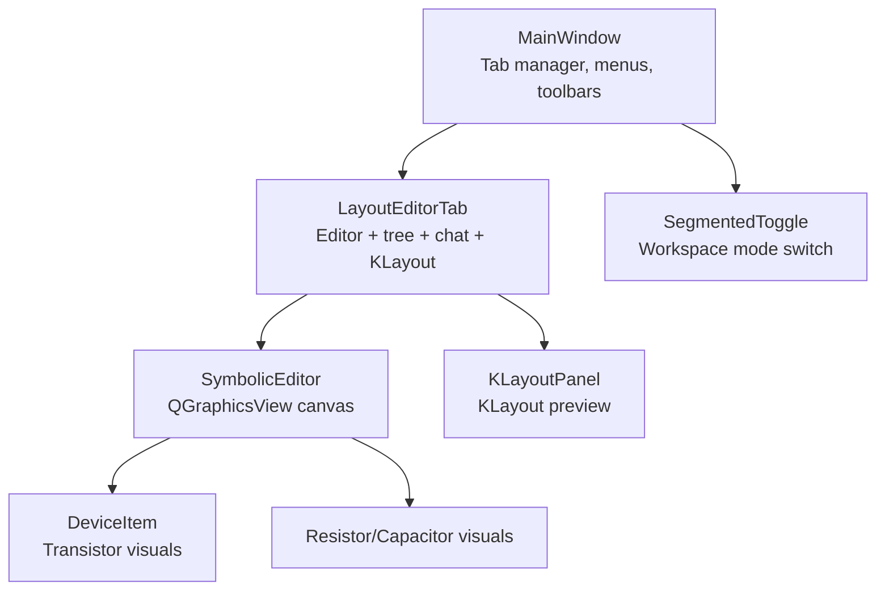
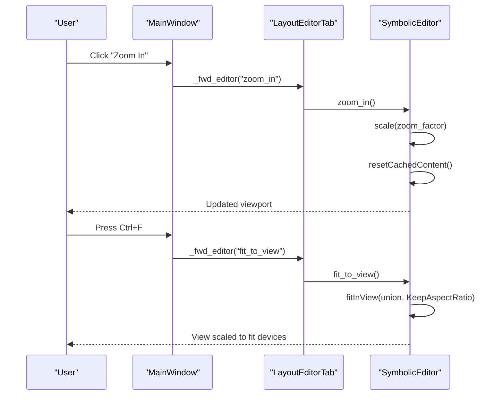
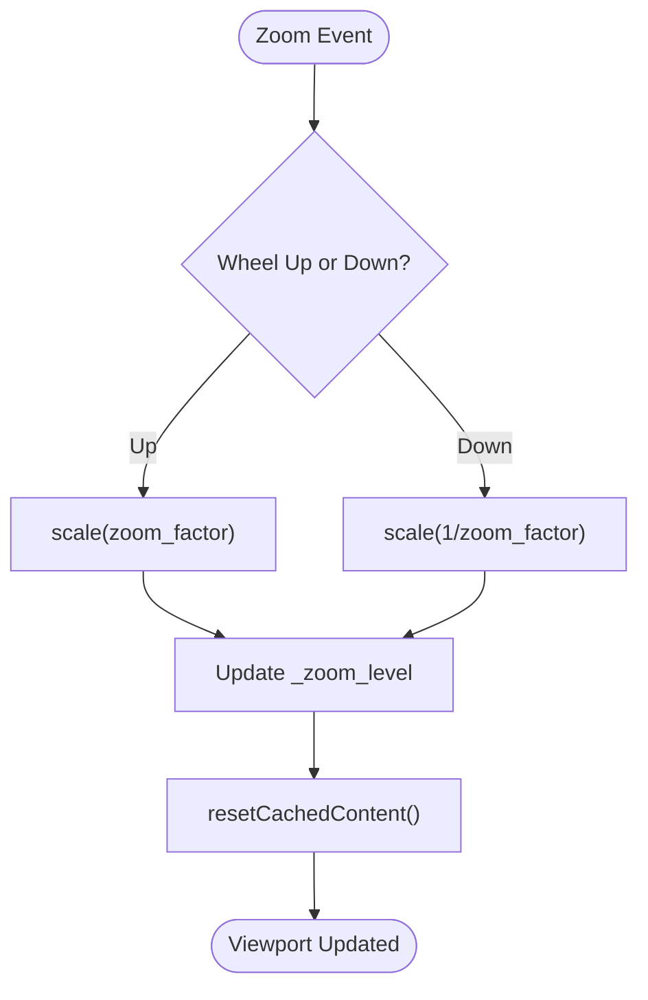
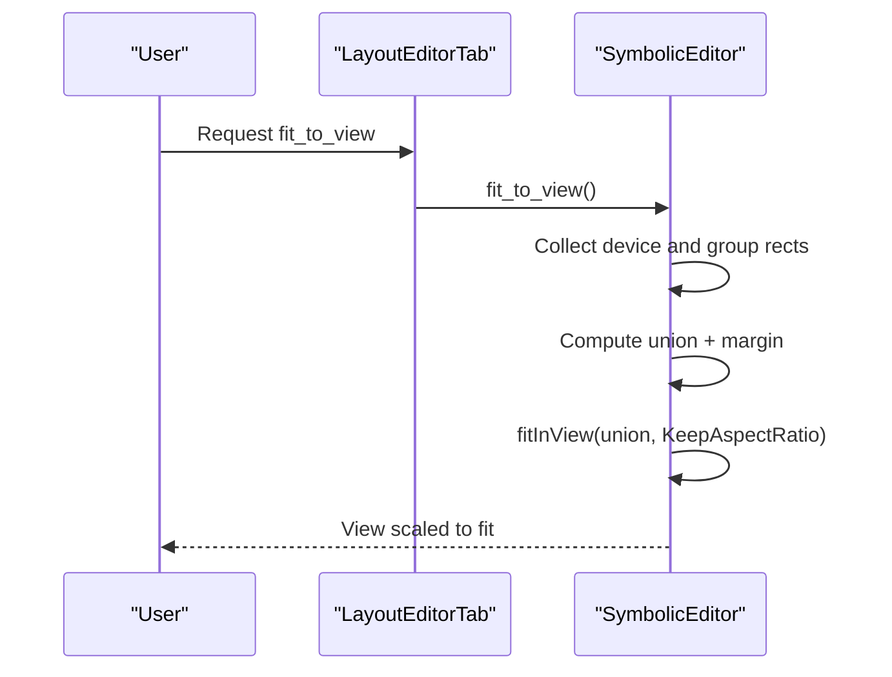
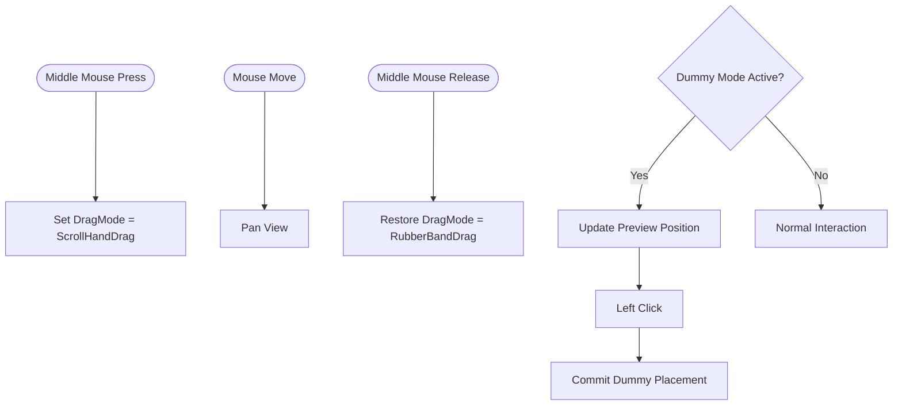
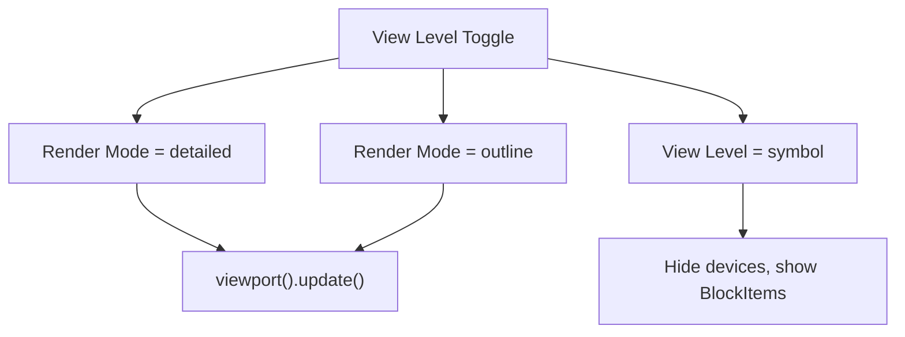
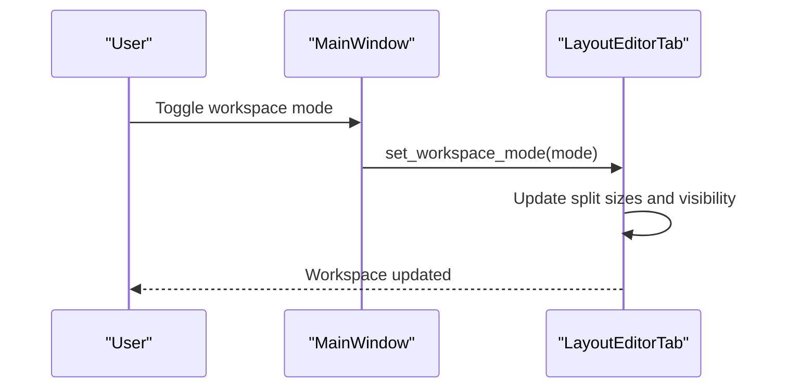
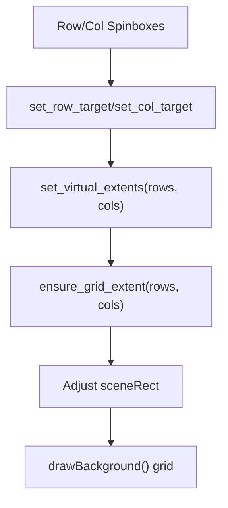
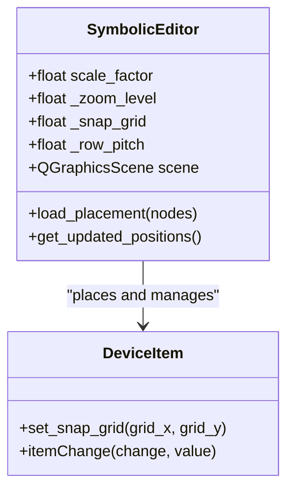
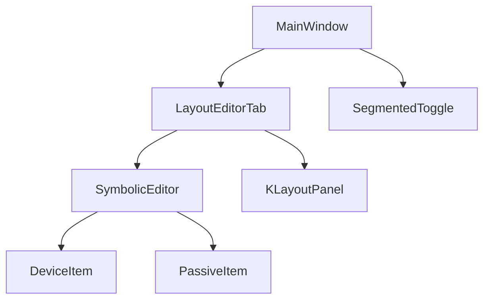

# Canvas Navigation and View Controls

<cite>
**Referenced Files in This Document**
- [main.py](file://symbolic_editor/main.py)
- [layout_tab.py](file://symbolic_editor/layout_tab.py)
- [editor_view.py](file://symbolic_editor/editor_view.py)
- [view_toggle.py](file://symbolic_editor/view_toggle.py)
- [klayout_panel.py](file://symbolic_editor/klayout_panel.py)
- [device_item.py](file://symbolic_editor/device_item.py)
- [passive_item.py](file://symbolic_editor/passive_item.py)
</cite>

## Table of Contents
1. [Introduction](#introduction)
2. [Project Structure](#project-structure)
3. [Core Components](#core-components)
4. [Architecture Overview](#architecture-overview)
5. [Detailed Component Analysis](#detailed-component-analysis)
6. [Dependency Analysis](#dependency-analysis)
7. [Performance Considerations](#performance-considerations)
8. [Troubleshooting Guide](#troubleshooting-guide)
9. [Conclusion](#conclusion)

## Introduction
This document explains the canvas navigation system and view controls for the Symbolic Layout Editor. It covers zoom operations (zoom in/out/reset), fit-to-view, panning, view level controls (detailed device view, outline device view, block symbol view), workspace mode switching (symbolic, KLayout, combined), grid system configuration, and the underlying coordinate system and viewport management. It also includes performance considerations for large layouts and rendering optimizations.

## Project Structure
The Symbolic Layout Editor is organized around a tabbed interface where each tab hosts an independent editor session. The main application manages menus, toolbars, and workspace mode toggles, delegating canvas-specific actions to the active tab’s editor.

**Diagram sources**
- [main.py:80-148](file://symbolic_editor/main.py#L80-L148)
- [layout_tab.py:64-107](file://symbolic_editor/layout_tab.py#L64-L107)
- [editor_view.py:81-93](file://symbolic_editor/editor_view.py#L81-L93)
- [view_toggle.py:11-29](file://symbolic_editor/view_toggle.py#L11-L29)
- [klayout_panel.py:30-39](file://symbolic_editor/klayout_panel.py#L30-L39)

**Section sources**
- [main.py:80-148](file://symbolic_editor/main.py#L80-L148)
- [layout_tab.py:64-107](file://symbolic_editor/layout_tab.py#L64-L107)

## Core Components
- MainWindow: Provides the application shell, menus, toolbar, and delegates commands to the active tab.
- LayoutEditorTab: Encapsulates a single layout document with editor, device tree, properties panel, chat panel, and KLayout preview. Manages grid targets and workspace mode.
- SymbolicEditor: The interactive canvas built on QGraphicsView, implementing zoom, pan, fit-to-view, view levels, and device rendering.
- SegmentedToggle: Workspace mode selector (symbolic, KLayout, both).
- KLayoutPanel: Renders a KLayout preview of the exported OAS file.
- DeviceItem and PassiveItem: Visual representations of devices with snapping, flipping, and terminal anchors.

**Section sources**
- [main.py:80-148](file://symbolic_editor/main.py#L80-L148)
- [layout_tab.py:64-107](file://symbolic_editor/layout_tab.py#L64-L107)
- [editor_view.py:81-93](file://symbolic_editor/editor_view.py#L81-L93)
- [view_toggle.py:11-29](file://symbolic_editor/view_toggle.py#L11-L29)
- [klayout_panel.py:30-39](file://symbolic_editor/klayout_panel.py#L30-L39)
- [device_item.py:17-51](file://symbolic_editor/device_item.py#L17-L51)
- [passive_item.py:24-47](file://symbolic_editor/passive_item.py#L24-L47)

## Architecture Overview
The navigation and view control system is centered on the SymbolicEditor canvas. Navigation actions (zoom, pan, fit-to-view) are invoked from the main UI and routed to the active tab’s editor. Workspace mode switching toggles visibility between the symbolic canvas and KLayout preview. Grid settings influence device placement and visual grid rendering.

**Diagram sources**
- [main.py:331-333](file://symbolic_editor/main.py#L331-L333)
- [main.py:626-629](file://symbolic_editor/main.py#L626-L629)
- [layout_tab.py:251-261](file://symbolic_editor/layout_tab.py#L251-L261)
- [editor_view.py:1887-1895](file://symbolic_editor/editor_view.py#L1887-L1895)
- [editor_view.py:1547-1571](file://symbolic_editor/editor_view.py#L1547-L1571)

## Detailed Component Analysis

### Zoom Functionality
- Zoom in/out: Uses mouse wheel events to scale the view transform and adjusts the internal zoom level. The cache is invalidated to redraw grid and items.
- Zoom reset: Resets the transformation matrix and restores the default zoom level.
- Keyboard shortcuts: Zoom actions are bound in the main menu and toolbar.

**Diagram sources**
- [editor_view.py:1879-1895](file://symbolic_editor/editor_view.py#L1879-L1895)
- [main.py:331-333](file://symbolic_editor/main.py#L331-L333)

**Section sources**
- [editor_view.py:1879-1901](file://symbolic_editor/editor_view.py#L1879-L1901)
- [main.py:331-333](file://symbolic_editor/main.py#L331-L333)

### Fit-to-View
- Computes the union of device and hierarchy group bounding boxes, adds margins, and fits the view to the resulting rectangle while preserving aspect ratio.
- Updates the internal zoom level to reflect the current transform.

**Diagram sources**
- [layout_tab.py:251-261](file://symbolic_editor/layout_tab.py#L251-L261)
- [editor_view.py:1547-1571](file://symbolic_editor/editor_view.py#L1547-L1571)

**Section sources**
- [layout_tab.py:251-261](file://symbolic_editor/layout_tab.py#L251-L261)
- [editor_view.py:1547-1571](file://symbolic_editor/editor_view.py#L1547-L1571)

### Panning and Mouse Interaction
- Pan with middle mouse: Switches to ScrollHandDrag mode on middle mouse press, enabling smooth panning.
- Dummy placement preview: Tracks mouse movement to preview placement under the nearest row and snaps to free slots.
- Click-to-place dummy: Commits the preview when clicking in dummy mode.

**Diagram sources**
- [editor_view.py:1905-1936](file://symbolic_editor/editor_view.py#L1905-L1936)
- [editor_view.py:246-290](file://symbolic_editor/editor_view.py#L246-L290)
- [editor_view.py:340-347](file://symbolic_editor/editor_view.py#L340-L347)

**Section sources**
- [editor_view.py:1905-1936](file://symbolic_editor/editor_view.py#L1905-L1936)
- [editor_view.py:246-290](file://symbolic_editor/editor_view.py#L246-L290)
- [editor_view.py:340-347](file://symbolic_editor/editor_view.py#L340-L347)

### View Level Controls
- Detailed device view: Sets device render mode to detailed while keeping transistor view.
- Outline device view: Sets device render mode to outline.
- Block symbol view: Switches to symbol view, hiding individual devices and showing block overlays.

**Diagram sources**
- [editor_view.py:213-219](file://symbolic_editor/editor_view.py#L213-L219)
- [editor_view.py:1692-1721](file://symbolic_editor/editor_view.py#L1692-L1721)

**Section sources**
- [editor_view.py:213-219](file://symbolic_editor/editor_view.py#L213-L219)
- [editor_view.py:1692-1721](file://symbolic_editor/editor_view.py#L1692-L1721)

### Workspace Mode Switching
- Modes: symbolic, klayout, both.
- Toggling switches visibility of the canvas and KLayout panel, restoring previous sizes when switching back to “both”.

**Diagram sources**
- [main.py:408-412](file://symbolic_editor/main.py#L408-L412)
- [layout_tab.py:338-362](file://symbolic_editor/layout_tab.py#L338-L362)

**Section sources**
- [main.py:408-412](file://symbolic_editor/main.py#L408-L412)
- [layout_tab.py:338-362](file://symbolic_editor/layout_tab.py#L338-L362)

### Grid System Configuration
- Grid parameters: base grid size, row pitch, and snap grids for X/Y.
- Virtual grid extents: rows/columns beyond actual device count are shown as empty slots.
- Grid targets: spinboxes in the UI adjust virtual row/column counts, which the editor enforces on the scene.
- Grid rendering: Infinite cartesian grid drawn in the background with major/minor lines.

**Diagram sources**
- [layout_tab.py:650-676](file://symbolic_editor/layout_tab.py#L650-L676)
- [layout_tab.py:1124-1122](file://symbolic_editor/layout_tab.py#L1124-L1122)
- [editor_view.py:1839-1875](file://symbolic_editor/editor_view.py#L1839-L1875)

**Section sources**
- [layout_tab.py:650-676](file://symbolic_editor/layout_tab.py#L650-L676)
- [layout_tab.py:1124-1122](file://symbolic_editor/layout_tab.py#L1124-L1122)
- [editor_view.py:1839-1875](file://symbolic_editor/editor_view.py#L1839-L1875)

### Canvas Coordinate System and Viewport Management
- Scene coordinates: Positive Y increases upward in layout data; Qt flips Y for screen rendering, so the editor negates Y when placing items.
- Scale factor: A constant factor converts layout units to scene pixels.
- Scene rect: Practically unlimited canvas size to accommodate large layouts.
- Transform and zoom level: The current zoom level is derived from the view transform.

**Diagram sources**
- [editor_view.py:112-113](file://symbolic_editor/editor_view.py#L112-L113)
- [editor_view.py:365-382](file://symbolic_editor/editor_view.py#L365-L382)
- [editor_view.py:456-466](file://symbolic_editor/editor_view.py#L456-L466)
- [device_item.py:86-92](file://symbolic_editor/device_item.py#L86-L92)

**Section sources**
- [editor_view.py:112-113](file://symbolic_editor/editor_view.py#L112-L113)
- [editor_view.py:365-382](file://symbolic_editor/editor_view.py#L365-L382)
- [editor_view.py:456-466](file://symbolic_editor/editor_view.py#L456-L466)
- [device_item.py:86-92](file://symbolic_editor/device_item.py#L86-L92)

### KLayout Integration
- KLayoutPanel renders a KLayout preview from an OAS file and supports refreshing and opening in KLayout.
- Workspace mode switching can display only the KLayout panel or combine both views.

**Section sources**
- [klayout_panel.py:171-226](file://symbolic_editor/klayout_panel.py#L171-L226)
- [layout_tab.py:338-362](file://symbolic_editor/layout_tab.py#L338-L362)

## Dependency Analysis
The navigation and view control system exhibits clear separation of concerns:
- MainWindow delegates UI actions to LayoutEditorTab.
- LayoutEditorTab orchestrates editor actions and workspace mode changes.
- SymbolicEditor encapsulates all canvas behaviors (zoom, pan, fit, view levels).
- DeviceItem and PassiveItem provide rendering primitives with snapping and orientation support.

**Diagram sources**
- [main.py:80-148](file://symbolic_editor/main.py#L80-L148)
- [layout_tab.py:64-107](file://symbolic_editor/layout_tab.py#L64-L107)
- [editor_view.py:81-93](file://symbolic_editor/editor_view.py#L81-L93)
- [device_item.py:17-51](file://symbolic_editor/device_item.py#L17-L51)
- [passive_item.py:24-47](file://symbolic_editor/passive_item.py#L24-L47)
- [view_toggle.py:11-29](file://symbolic_editor/view_toggle.py#L11-L29)
- [klayout_panel.py:30-39](file://symbolic_editor/klayout_panel.py#L30-L39)

**Section sources**
- [main.py:80-148](file://symbolic_editor/main.py#L80-L148)
- [layout_tab.py:64-107](file://symbolic_editor/layout_tab.py#L64-L107)
- [editor_view.py:81-93](file://symbolic_editor/editor_view.py#L81-L93)
- [device_item.py:17-51](file://symbolic_editor/device_item.py#L17-L51)
- [passive_item.py:24-47](file://symbolic_editor/passive_item.py#L24-L47)
- [view_toggle.py:11-29](file://symbolic_editor/view_toggle.py#L11-L29)
- [klayout_panel.py:30-39](file://symbolic_editor/klayout_panel.py#L30-L39)

## Performance Considerations
- Rendering optimizations:
  - Background caching: The view caches the background to accelerate grid drawing.
  - Cache invalidation: Explicitly resets cached content after transformations and grid updates.
  - Efficient grid drawing: Draws only visible grid segments within the viewport.
- Large layout strategies:
  - Unlimited scene rect to avoid clipping.
  - Virtual grid extents to manage perceived density without adding real items.
  - Snapping and compaction routines minimize visual artifacts and improve usability.
- Practical tips:
  - Use fit-to-view after large operations to reduce unnecessary redraws.
  - Prefer outline view for dense layouts to reduce visual complexity.
  - Limit simultaneous overlays (e.g., block overlays) when working with very large designs.

[No sources needed since this section provides general guidance]

## Troubleshooting Guide
- Zoom does not change:
  - Verify mouse wheel events are handled and zoom factor is applied.
  - Ensure cache is invalidated after scaling.
- Fit-to-view does not work:
  - Confirm device items exist and bounding rects are computed.
  - Check that margins are applied and fitInView is called with KeepAspectRatio.
- Panning ineffective:
  - Ensure middle mouse press triggers ScrollHandDrag mode.
  - Verify mouse release restores RubberBandDrag mode.
- Grid not aligning:
  - Check snap grid and row pitch calculations.
  - Confirm virtual extents are set and scene rect expanded appropriately.
- Workspace mode not switching:
  - Validate split sizes are saved/restored and visibility toggled correctly.

**Section sources**
- [editor_view.py:1879-1901](file://symbolic_editor/editor_view.py#L1879-L1901)
- [editor_view.py:1547-1571](file://symbolic_editor/editor_view.py#L1547-L1571)
- [editor_view.py:1905-1936](file://symbolic_editor/editor_view.py#L1905-L1936)
- [layout_tab.py:1124-1122](file://symbolic_editor/layout_tab.py#L1124-L1122)
- [layout_tab.py:338-362](file://symbolic_editor/layout_tab.py#L338-L362)

## Conclusion
The canvas navigation and view controls provide a robust, efficient system for interacting with analog layouts. Zoom, pan, and fit-to-view are straightforward and responsive, while view level and workspace mode toggles enable flexible workflows. The grid system and coordinate handling ensure precise placement and scalable rendering, with practical performance optimizations for large layouts.