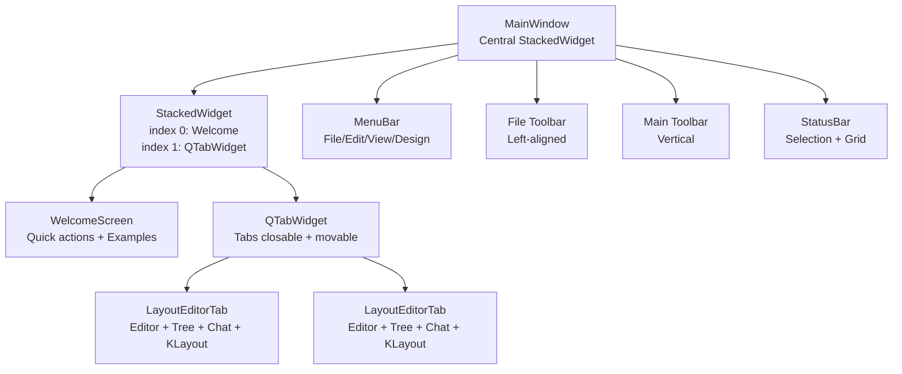
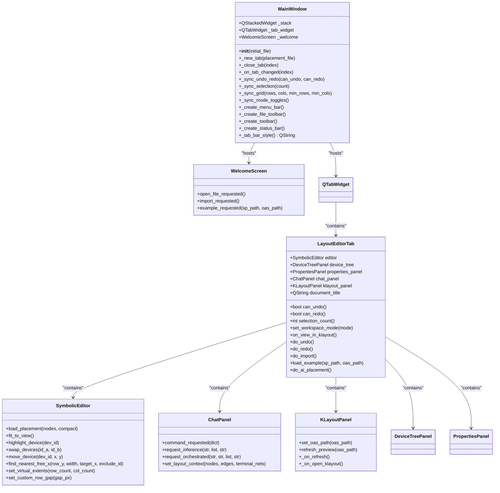
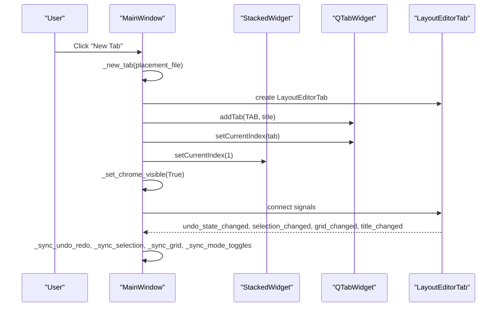
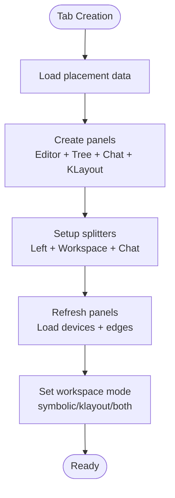
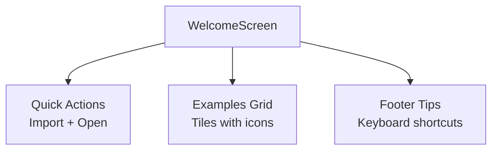
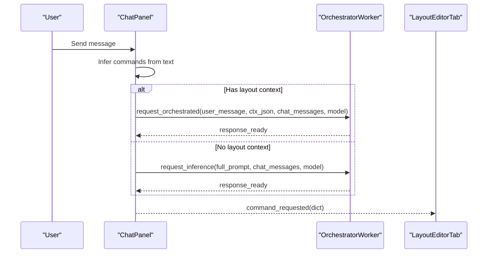
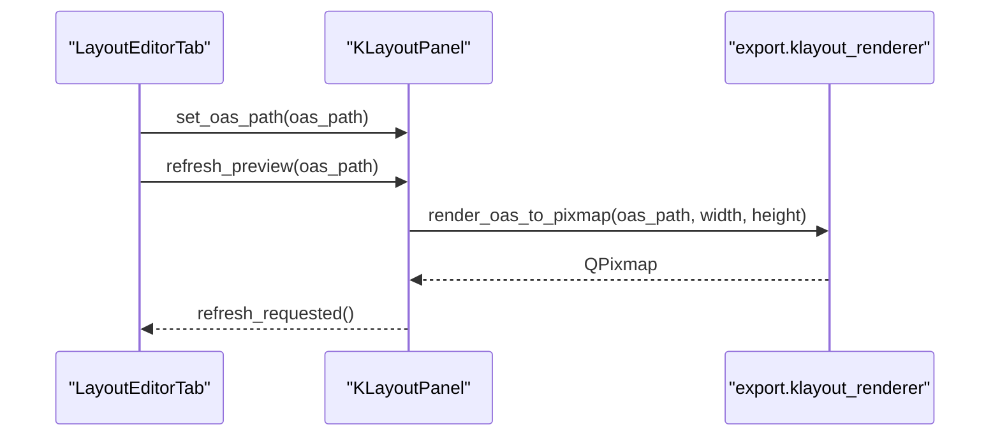
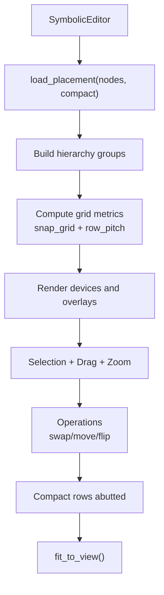
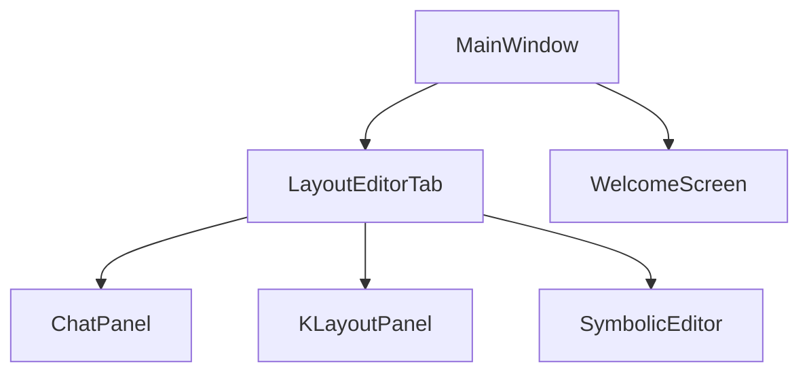

# Main Window Layout

<cite>
**Referenced Files in This Document**
- [main.py](file://symbolic_editor/main.py)
- [layout_tab.py](file://symbolic_editor/layout_tab.py)
- [welcome_screen.py](file://symbolic_editor/widgets/welcome_screen.py)
- [chat_panel.py](file://symbolic_editor/chat_panel.py)
- [klayout_panel.py](file://symbolic_editor/klayout_panel.py)
- [editor_view.py](file://symbolic_editor/editor_view.py)
</cite>

## Table of Contents
1. [Introduction](#introduction)
2. [Project Structure](#project-structure)
3. [Core Components](#core-components)
4. [Architecture Overview](#architecture-overview)
5. [Detailed Component Analysis](#detailed-component-analysis)
6. [Dependency Analysis](#dependency-analysis)
7. [Performance Considerations](#performance-considerations)
8. [Troubleshooting Guide](#troubleshooting-guide)
9. [Conclusion](#conclusion)

## Introduction
This document describes the main application window layout and structure for the Symbolic Layout Editor. The application uses a tabbed interface where each tab is an independent LayoutEditorTab that contains an editor canvas, device tree, AI chat panel, and KLayout preview panel. When no tabs are open, a WelcomeScreen is displayed. The window integrates a central stacked widget architecture to switch between the welcome screen and the tabbed interface. The application also implements a dark theme using a custom Fusion style palette and provides comprehensive application chrome elements including menu bars, toolbars, and status bars.

## Project Structure
The main window implementation centers around the MainWindow class, which orchestrates:
- A central stacked widget that alternates between the WelcomeScreen and the tabbed interface
- A QTabWidget hosting multiple LayoutEditorTab instances
- A menu bar with File, Edit, View, and Design menus
- Two toolbars: a vertical main toolbar and a horizontal file quick-actions toolbar
- A status bar with selection and grid controls

**Diagram sources**
- [main.py:80-118](file://symbolic_editor/main.py#L80-L118)
- [main.py:123-148](file://symbolic_editor/main.py#L123-L148)
- [main.py:239-362](file://symbolic_editor/main.py#L239-L362)
- [main.py:366-511](file://symbolic_editor/main.py#L366-L511)
- [main.py:574-611](file://symbolic_editor/main.py#L574-L611)

**Section sources**
- [main.py:80-118](file://symbolic_editor/main.py#L80-L118)
- [main.py:239-362](file://symbolic_editor/main.py#L239-L362)
- [main.py:366-511](file://symbolic_editor/main.py#L366-L511)
- [main.py:574-611](file://symbolic_editor/main.py#L574-L611)

## Core Components
- MainWindow: Hosts the stacked widget, manages tabs, and synchronizes toolbar/status with the active tab. Implements dark theme via Fusion style and custom palette.
- LayoutEditorTab: Self-contained tab with editor, device tree, properties panel, chat panel, and KLayout preview. Manages undo/redo, selection, grid, and workspace modes.
- WelcomeScreen: Landing page shown when no tabs exist, offering quick actions and example circuits.
- ChatPanel: AI assistant panel with multi-agent orchestration and command extraction.
- KLayoutPanel: Renders OAS previews and integrates with KLayout.
- SymbolicEditor: Interactive canvas for device placement, hierarchy navigation, and grid operations.

**Section sources**
- [main.py:80-118](file://symbolic_editor/main.py#L80-L118)
- [layout_tab.py:64-100](file://symbolic_editor/layout_tab.py#L64-L100)
- [welcome_screen.py:179-191](file://symbolic_editor/widgets/welcome_screen.py#L179-L191)
- [chat_panel.py:95-117](file://symbolic_editor/chat_panel.py#L95-L117)
- [klayout_panel.py:30-40](file://symbolic_editor/klayout_panel.py#L30-L40)
- [editor_view.py:81-120](file://symbolic_editor/editor_view.py#L81-L120)

## Architecture Overview
The application uses a layered architecture:
- Centralized shell: MainWindow manages chrome, stacked widget, and tab lifecycle
- Per-tab isolation: LayoutEditorTab encapsulates all panels and state
- Dark theme integration: Fusion style with custom QPalette and global stylesheet
- Event-driven synchronization: Signals propagate between tab and main window for toolbar/status updates

**Diagram sources**
- [main.py:80-118](file://symbolic_editor/main.py#L80-L118)
- [main.py:123-148](file://symbolic_editor/main.py#L123-L148)
- [layout_tab.py:64-100](file://symbolic_editor/layout_tab.py#L64-L100)
- [welcome_screen.py:179-191](file://symbolic_editor/widgets/welcome_screen.py#L179-L191)
- [chat_panel.py:95-117](file://symbolic_editor/chat_panel.py#L95-L117)
- [klayout_panel.py:30-40](file://symbolic_editor/klayout_panel.py#L30-L40)
- [editor_view.py:81-120](file://symbolic_editor/editor_view.py#L81-L120)

## Detailed Component Analysis

### MainWindow: Central Shell and Dark Theme
- Central stacked widget: Switches between index 0 (WelcomeScreen) and index 1 (QTabWidget)
- Tab management: Creates, closes, and switches tabs; synchronizes toolbar/status with the active tab
- Menu bar: Comprehensive File, Edit, View, and Design menus with keyboard shortcuts
- Toolbars: Left-aligned vertical main toolbar and top-aligned file quick-actions toolbar with custom styles
- Status bar: Shows selection count and grid controls with custom styling
- Dark theme: Applies Fusion style and a custom QPalette with dark backgrounds and accent colors; global tooltip styling

**Diagram sources**
- [main.py:123-148](file://symbolic_editor/main.py#L123-L148)
- [main.py:150-167](file://symbolic_editor/main.py#L150-L167)
- [main.py:201-234](file://symbolic_editor/main.py#L201-L234)

**Section sources**
- [main.py:80-118](file://symbolic_editor/main.py#L80-L118)
- [main.py:239-362](file://symbolic_editor/main.py#L239-L362)
- [main.py:366-511](file://symbolic_editor/main.py#L366-L511)
- [main.py:574-611](file://symbolic_editor/main.py#L574-L611)
- [main.py:758-790](file://symbolic_editor/main.py#L758-L790)

### LayoutEditorTab: Independent Tab Container
- Panels: Device tree, properties, SymbolicEditor, ChatPanel, KLayoutPanel
- Splitter layout: Left-side vertical splitter for tree and properties; right-side workspace with editor and KLayout preview
- Workspace modes: Toggle between symbolic-only, KLayout-only, or both views
- Undo/redo: Maintains stacks and emits signals for synchronization
- Selection/grid: Tracks selection count and grid extents
- AI integration: Import from netlist/OAS, run AI initial placement, and manage dummy/abutment modes

**Diagram sources**
- [layout_tab.py:74-100](file://symbolic_editor/layout_tab.py#L74-L100)
- [layout_tab.py:101-175](file://symbolic_editor/layout_tab.py#L101-L175)
- [layout_tab.py:338-365](file://symbolic_editor/layout_tab.py#L338-L365)

**Section sources**
- [layout_tab.py:64-100](file://symbolic_editor/layout_tab.py#L64-L100)
- [layout_tab.py:101-175](file://symbolic_editor/layout_tab.py#L101-L175)
- [layout_tab.py:338-365](file://symbolic_editor/layout_tab.py#L338-L365)

### WelcomeScreen: Landing Page and Quick Start
- Quick actions: Import netlist + layout, open saved JSON
- Example gallery: Grid of example circuits scraped from the examples directory with icons and availability indicators
- Dark theme styling: Consistent with the application’s theme and hover animations

**Diagram sources**
- [welcome_screen.py:179-191](file://symbolic_editor/widgets/welcome_screen.py#L179-L191)
- [welcome_screen.py:235-255](file://symbolic_editor/widgets/welcome_screen.py#L235-L255)
- [welcome_screen.py:265-277](file://symbolic_editor/widgets/welcome_screen.py#L265-L277)
- [welcome_screen.py:280-286](file://symbolic_editor/widgets/welcome_screen.py#L280-L286)

**Section sources**
- [welcome_screen.py:179-191](file://symbolic_editor/widgets/welcome_screen.py#L179-L191)
- [welcome_screen.py:235-255](file://symbolic_editor/widgets/welcome_screen.py#L235-L255)
- [welcome_screen.py:265-277](file://symbolic_editor/widgets/welcome_screen.py#L265-L277)
- [welcome_screen.py:280-286](file://symbolic_editor/widgets/welcome_screen.py#L280-L286)

### ChatPanel: AI Assistant and Command Execution
- Multi-agent orchestration: Uses OrchestratorWorker for complex tasks; falls back to single-agent LLMWorker
- Command extraction: Parses natural language for swap/move/dummy commands
- Layout context: Receives nodes, edges, and terminal nets to inform AI decisions
- UI: Custom-styled chat bubbles, animated thinking indicators, and clear controls

**Diagram sources**
- [chat_panel.py:463-514](file://symbolic_editor/chat_panel.py#L463-L514)
- [chat_panel.py:584-651](file://symbolic_editor/chat_panel.py#L584-L651)
- [chat_panel.py:656-787](file://symbolic_editor/chat_panel.py#L656-L787)

**Section sources**
- [chat_panel.py:95-117](file://symbolic_editor/chat_panel.py#L95-L117)
- [chat_panel.py:463-514](file://symbolic_editor/chat_panel.py#L463-L514)
- [chat_panel.py:584-651](file://symbolic_editor/chat_panel.py#L584-L651)
- [chat_panel.py:656-787](file://symbolic_editor/chat_panel.py#L656-L787)

### KLayoutPanel: OAS Preview and KLayout Integration
- Preview rendering: Uses export.klayout_renderer to convert OAS to pixmap
- Controls: Refresh and Open in KLayout buttons
- Status: Shows file path and render dimensions

**Diagram sources**
- [layout_tab.py:537-546](file://symbolic_editor/layout_tab.py#L537-L546)
- [klayout_panel.py:171-226](file://symbolic_editor/klayout_panel.py#L171-L226)

**Section sources**
- [klayout_panel.py:30-40](file://symbolic_editor/klayout_panel.py#L30-L40)
- [klayout_panel.py:163-170](file://symbolic_editor/klayout_panel.py#L163-L170)
- [klayout_panel.py:171-226](file://symbolic_editor/klayout_panel.py#L171-L226)

### SymbolicEditor: Interactive Canvas and Grid Operations
- Scene management: Custom HierarchyAwareScene blocks selection of non-descended devices
- Rendering: Antialiasing, background caching, rubber-band selection, and pan/zoom
- Device operations: Swap, move, flip, and hierarchy descent/ascend
- Grid and compaction: Snapping, row/column calculations, and abutment-aware compaction
- Connectivity: Net colorization and curved connection visualization

**Diagram sources**
- [editor_view.py:39-93](file://symbolic_editor/editor_view.py#L39-L93)
- [editor_view.py:352-452](file://symbolic_editor/editor_view.py#L352-L452)
- [editor_view.py:1034-1084](file://symbolic_editor/editor_view.py#L1034-L1084)
- [editor_view.py:1547-1572](file://symbolic_editor/editor_view.py#L1547-L1572)

**Section sources**
- [editor_view.py:81-120](file://symbolic_editor/editor_view.py#L81-L120)
- [editor_view.py:352-452](file://symbolic_editor/editor_view.py#L352-L452)
- [editor_view.py:1034-1084](file://symbolic_editor/editor_view.py#L1034-L1084)
- [editor_view.py:1547-1572](file://symbolic_editor/editor_view.py#L1547-L1572)

## Dependency Analysis
The main window depends on:
- LayoutEditorTab for tab content and state
- WelcomeScreen for initial state
- ChatPanel, KLayoutPanel, and SymbolicEditor for integrated functionality
- Qt widgets for UI composition and styling

**Diagram sources**
- [main.py:80-118](file://symbolic_editor/main.py#L80-L118)
- [layout_tab.py:64-100](file://symbolic_editor/layout_tab.py#L64-L100)

**Section sources**
- [main.py:80-118](file://symbolic_editor/main.py#L80-L118)
- [layout_tab.py:64-100](file://symbolic_editor/layout_tab.py#L64-L100)

## Performance Considerations
- Canvas caching: SymbolicEditor enables background caching to improve rendering performance
- Scene invalidation: Reset cached content on changes to keep visuals fresh
- Grid computations: Efficient row/column calculations and compacting reduce layout overhead
- Worker threads: AI inference runs on separate threads to keep UI responsive

## Troubleshooting Guide
- Tab creation fails: Verify that the initial file path is valid and accessible
- Welcome screen not appearing: Ensure no tabs exist; the stacked widget switches to index 0 when tabs are closed
- Chat panel errors: Confirm layout context is set before orchestrating; otherwise, single-agent mode is used
- KLayout preview failures: Check OAS file existence and permissions; ensure KLayout is installed or accessible
- Undo/redo disabled: Confirm the active tab has items in its undo stack

**Section sources**
- [main.py:114-118](file://symbolic_editor/main.py#L114-L118)
- [main.py:150-158](file://symbolic_editor/main.py#L150-L158)
- [chat_panel.py:584-651](file://symbolic_editor/chat_panel.py#L584-L651)
- [klayout_panel.py:171-226](file://symbolic_editor/klayout_panel.py#L171-L226)

## Conclusion
The Symbolic Layout Editor’s main window provides a robust, dark-themed, tabbed interface with comprehensive application chrome. Each tab encapsulates a full-featured editor environment, while the central stacked widget ensures a seamless transition between the welcome screen and active editing sessions. The integration of AI assistance, KLayout preview, and interactive canvas operations delivers a powerful workflow for analog layout automation.