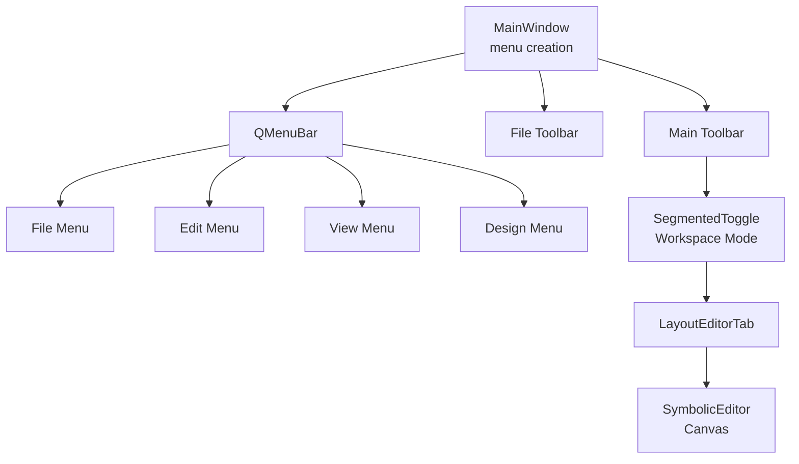
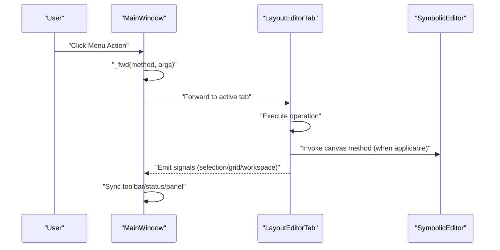
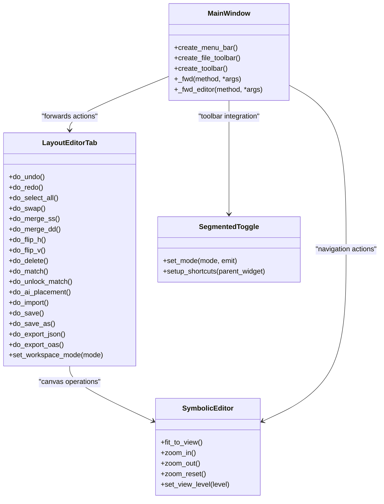

# Menu System and Shortcuts

<cite>
**Referenced Files in This Document**
- [main.py](file://symbolic_editor/main.py)
- [layout_tab.py](file://symbolic_editor/layout_tab.py)
- [view_toggle.py](file://symbolic_editor/view_toggle.py)
- [editor_view.py](file://symbolic_editor/editor_view.py)
- [icons.py](file://symbolic_editor/icons.py)
- [import_dialog.py](file://symbolic_editor/dialogs/import_dialog.py)
- [match_dialog.py](file://symbolic_editor/dialogs/match_dialog.py)
</cite>

## Table of Contents
1. [Introduction](#introduction)
2. [Project Structure](#project-structure)
3. [Core Components](#core-components)
4. [Architecture Overview](#architecture-overview)
5. [Detailed Component Analysis](#detailed-component-analysis)
6. [Dependency Analysis](#dependency-analysis)
7. [Performance Considerations](#performance-considerations)
8. [Troubleshooting Guide](#troubleshooting-guide)
9. [Conclusion](#conclusion)

## Introduction
This document explains the complete menu system architecture of the Symbolic Layout Editor, focusing on:
- File menu: import/export operations, quick-start examples, and application reload
- Edit menu: undo/redo, selection, and row gap configuration with embedded controls
- View menu: canvas navigation, panel toggling, and workspace mode switching
- Design menu: device manipulation, dummy placement, device matching, and AI placement integration
- Keyboard shortcuts and their placement in the interface
- Segmented toggle controls for workspace mode and their integration with toolbar actions
- Menu styling with custom CSS and embedded widget actions

## Project Structure
The menu system is implemented in the main application shell and integrated with per-tab editor logic:
- The main window constructs menus, toolbars, and status bars
- Per-tab logic handles menu forwarding, device operations, and AI pipelines
- Segmented toggle controls provide workspace mode switching
- Icons are procedurally generated for consistent visuals

**Diagram sources**
- [main.py:239-362](file://symbolic_editor/main.py#L239-L362)
- [main.py:366-511](file://symbolic_editor/main.py#L366-L511)
- [view_toggle.py:11-130](file://symbolic_editor/view_toggle.py#L11-L130)
- [layout_tab.py:64-237](file://symbolic_editor/layout_tab.py#L64-L237)
- [editor_view.py:81-200](file://symbolic_editor/editor_view.py#L81-L200)

**Section sources**
- [main.py:239-362](file://symbolic_editor/main.py#L239-L362)
- [main.py:366-511](file://symbolic_editor/main.py#L366-L511)
- [view_toggle.py:11-130](file://symbolic_editor/view_toggle.py#L11-L130)
- [layout_tab.py:64-237](file://symbolic_editor/layout_tab.py#L64-L237)
- [editor_view.py:81-200](file://symbolic_editor/editor_view.py#L81-L200)

## Core Components
- MainWindow: Creates menus, toolbars, and status bar; forwards actions to the active tab; manages application-wide state (tabs, chrome visibility)
- LayoutEditorTab: Implements per-tab operations (undo/redo, select all, swap, merge, flip, delete, match, AI placement, import, export)
- SegmentedToggle: Provides workspace mode selection (symbolic, KLayout, both) with styled buttons and keyboard shortcuts
- SymbolicEditor: Canvas with navigation (fit view, zoom, reset), view levels (symbol/transistor), and device interactions
- Icons: Procedurally generated vector icons for toolbar/menu actions

**Section sources**
- [main.py:80-149](file://symbolic_editor/main.py#L80-L149)
- [layout_tab.py:64-237](file://symbolic_editor/layout_tab.py#L64-L237)
- [view_toggle.py:11-130](file://symbolic_editor/view_toggle.py#L11-L130)
- [editor_view.py:81-200](file://symbolic_editor/editor_view.py#L81-L200)
- [icons.py:40-476](file://symbolic_editor/icons.py#L40-L476)

## Architecture Overview
The menu system delegates most operations to the active tab, which coordinates with the canvas, panels, and AI pipeline.

**Diagram sources**
- [main.py:621-629](file://symbolic_editor/main.py#L621-L629)
- [main.py:123-148](file://symbolic_editor/main.py#L123-L148)
- [layout_tab.py:713-732](file://symbolic_editor/layout_tab.py#L713-L732)

## Detailed Component Analysis

### File Menu
- New Tab, Import Netlist + Layout, Open JSON, Save, Save As, Export JSON, Export to OAS, Close Tab
- Quick Start Examples: dynamically lists example subdirectories and adds actions bound to load routines
- Reload App: restarts the application by re-executing the executable

Keyboard shortcuts:
- New Tab: Ctrl+T
- Import: Ctrl+I
- Open: StandardKey.Open
- Save: StandardKey.Save
- Save As: Ctrl+Shift+S
- Close Tab: Ctrl+W
- Reload App: Ctrl+Shift+R

Notes:
- Import triggers a modal dialog to select SPICE and optional layout files
- Quick Start examples scan the examples directory and add actions per example pair

**Section sources**
- [main.py:251-288](file://symbolic_editor/main.py#L251-L288)
- [main.py:183-197](file://symbolic_editor/main.py#L183-L197)
- [layout_tab.py:1079-1127](file://symbolic_editor/layout_tab.py#L1079-L1127)
- [import_dialog.py:8-175](file://symbolic_editor/dialogs/import_dialog.py#L8-L175)

### Edit Menu
- Undo, Redo, Select All, Delete Selected
- Embedded row gap configuration:
  - Checkbox: "Close Row Gap"
  - Double spin box: row gap value in micrometers
  - Styling applied to both the checkbox and spin box
  - Behavior: enables/disables custom row gap on the canvas

Keyboard shortcuts:
- Undo: StandardKey.Undo
- Redo: StandardKey.Redo
- Select All: StandardKey.SelectAll
- Delete: Del

Toolbar integration:
- Undo/Redo actions are mirrored in the main toolbar
- Select All and Delete are available in the main toolbar
- Row gap controls are embedded in the Edit menu via a QWidgetAction

**Section sources**
- [main.py:289-327](file://symbolic_editor/main.py#L289-L327)
- [main.py:201-208](file://symbolic_editor/main.py#L201-L208)
- [layout_tab.py:486-501](file://symbolic_editor/layout_tab.py#L486-L501)
- [layout_tab.py:736-820](file://symbolic_editor/layout_tab.py#L736-L820)

### View Menu
- Fit to View, Zoom In, Zoom Out, Reset Zoom
- Toggle Device Tree, Toggle Chat Panel, Toggle KLayout Preview
- Detailed Device View, Outline Device View, Block Symbols
- Workspace Mode: Symbolic, KLayout, Both (with keyboard shortcuts)

Keyboard shortcuts:
- Fit to View: F (local to workspace shell)
- Detailed/Outline Device View: Shift+F/Ctrl+F (local to workspace shell)
- Workspace modes: Ctrl+1, Ctrl+2, Ctrl+3

Integration:
- Fit/Zoom actions are forwarded to the canvas
- Panel toggles are handled by the tab and workspace shell
- Workspace mode toggles are synchronized between the menu, toolbar, and segmented toggle

**Section sources**
- [main.py:329-346](file://symbolic_editor/main.py#L329-L346)
- [layout_tab.py:249-262](file://symbolic_editor/layout_tab.py#L249-L262)
- [layout_tab.py:324-376](file://symbolic_editor/layout_tab.py#L324-L376)
- [layout_tab.py:338-365](file://symbolic_editor/layout_tab.py#L338-L365)
- [editor_view.py:1547-1572](file://symbolic_editor/editor_view.py#L1547-L1572)
- [editor_view.py:1887-1900](file://symbolic_editor/editor_view.py#L1887-L1900)

### Design Menu
- Swap Selected (2), Merge Shared Source, Merge Shared Drain, Flip Horizontal, Flip Vertical
- Toggle Dummy Placement, Match Devices, Unlock Matched
- Run AI Placement, View in KLayout

Keyboard shortcuts:
- Swap: Ctrl+Shift+X
- Flip Horizontal: Ctrl+H
- Flip Vertical: Ctrl+J
- Match Devices: Ctrl+M
- Unlock Matched: Ctrl+U
- Run AI Placement: Ctrl+P

Workflow highlights:
- Swap/Flip/Merge operate on selected devices and push undo states
- Match Devices opens a dialog to choose matching technique and applies placements
- AI Placement launches a model selection dialog and runs the AI pipeline

**Section sources**
- [main.py:347-362](file://symbolic_editor/main.py#L347-L362)
- [layout_tab.py:736-820](file://symbolic_editor/layout_tab.py#L736-L820)
- [layout_tab.py:824-967](file://symbolic_editor/layout_tab.py#L824-L967)
- [layout_tab.py:1132-1224](file://symbolic_editor/layout_tab.py#L1132-L1224)

### Keyboard Shortcuts and Placement
- Global shortcuts:
  - Undo: StandardKey.Undo
  - Redo: StandardKey.Redo
  - Select All: StandardKey.SelectAll
  - Delete: Del
  - Close Tab: Ctrl+W
- Local shortcuts (active within the workspace shell):
  - Fit to View: F
  - Detailed Device View: Shift+F
  - Outline Device View: Ctrl+F
- Workspace mode shortcuts:
  - Symbolic: Ctrl+1
  - KLayout: Ctrl+2
  - Both: Ctrl+3

Placement:
- Menu actions define global shortcuts
- Local shortcuts are attached to the workspace shell widget
- Toolbar actions provide convenient access to frequent operations

**Section sources**
- [main.py:251-288](file://symbolic_editor/main.py#L251-L288)
- [layout_tab.py:249-262](file://symbolic_editor/layout_tab.py#L249-L262)
- [view_toggle.py:122-130](file://symbolic_editor/view_toggle.py#L122-L130)

### Segmented Toggle Controls for Workspace Mode
- Three modes: Symbolic, KLayout, Both
- Styled buttons with hover/checked states
- Emits mode changes to update the workspace split
- Integrated with toolbar and View menu actions

Integration:
- Toolbar: a SegmentedToggle instance is embedded in the file toolbar
- View menu: actions set the mode programmatically
- Workspace shell visibility is controlled by the tab’s set_workspace_mode

**Section sources**
- [view_toggle.py:11-130](file://symbolic_editor/view_toggle.py#L11-L130)
- [main.py:408-412](file://symbolic_editor/main.py#L408-L412)
- [layout_tab.py:338-365](file://symbolic_editor/layout_tab.py#L338-L365)

### Menu Styling with Custom CSS
- Menubar and menu items use dark theme styles with custom fonts and separators
- Edit menu embedded row gap control uses dedicated styles for checkbox and spin box
- Toolbars and segmented toggle use distinct styles for contrast and usability
- Status bar displays selection counts and grid targets with styled widgets

**Section sources**
- [main.py:241-249](file://symbolic_editor/main.py#L241-L249)
- [main.py:303-326](file://symbolic_editor/main.py#L303-L326)
- [main.py:373-381](file://symbolic_editor/main.py#L373-L381)
- [main.py:422-429](file://symbolic_editor/main.py#L422-L429)
- [main.py:567-610](file://symbolic_editor/main.py#L567-L610)

### Embedded Widget Actions (Row Gap Configuration)
- A QWidgetAction wraps a QHBoxLayout containing a QCheckBox and a QDoubleSpinBox
- The checkbox enables/disables the custom row gap
- The spin box sets the gap value in micrometers
- Changes are forwarded to the tab and canvas to update device layouts

**Section sources**
- [main.py:301-327](file://symbolic_editor/main.py#L301-L327)
- [layout_tab.py:486-501](file://symbolic_editor/layout_tab.py#L486-L501)

## Dependency Analysis
The menu system exhibits clear separation of concerns:
- MainWindow owns UI construction and delegates logic to LayoutEditorTab
- LayoutEditorTab owns device operations, AI pipeline, and file operations
- SegmentedToggle is a reusable UI component for workspace mode
- SymbolicEditor encapsulates canvas operations and view-level toggles
- Icons are centralized for consistent visuals

**Diagram sources**
- [main.py:239-362](file://symbolic_editor/main.py#L239-L362)
- [main.py:621-629](file://symbolic_editor/main.py#L621-L629)
- [layout_tab.py:64-237](file://symbolic_editor/layout_tab.py#L64-L237)
- [view_toggle.py:11-130](file://symbolic_editor/view_toggle.py#L11-L130)
- [editor_view.py:81-200](file://symbolic_editor/editor_view.py#L81-L200)

**Section sources**
- [main.py:239-362](file://symbolic_editor/main.py#L239-L362)
- [layout_tab.py:64-237](file://symbolic_editor/layout_tab.py#L64-L237)
- [view_toggle.py:11-130](file://symbolic_editor/view_toggle.py#L11-L130)
- [editor_view.py:81-200](file://symbolic_editor/editor_view.py#L81-L200)

## Performance Considerations
- Menu actions are lightweight; most work is delegated to the active tab
- Undo/redo stacks are simple lists; keep operations atomic to minimize stack growth
- Canvas updates are optimized with cached backgrounds and selective refresh
- AI placement runs asynchronously via worker threads to avoid blocking the UI

## Troubleshooting Guide
- If menu actions do nothing:
  - Verify the active tab exists and exposes the requested method
  - Check that the tab’s editor is initialized
- If row gap controls are disabled:
  - Ensure the checkbox is checked to enable the spin box
  - Confirm the tab’s set_close_row_gap is invoked with the correct value
- If workspace mode does not switch:
  - Confirm the segmented toggle emits mode changes
  - Verify set_workspace_mode updates both the canvas and panel visibility
- If import fails:
  - Ensure a valid SPICE file is selected
  - Check for errors raised during parsing and confirm the overlay hides after completion

**Section sources**
- [main.py:621-629](file://symbolic_editor/main.py#L621-L629)
- [layout_tab.py:486-501](file://symbolic_editor/layout_tab.py#L486-L501)
- [layout_tab.py:338-365](file://symbolic_editor/layout_tab.py#L338-L365)
- [layout_tab.py:1079-1127](file://symbolic_editor/layout_tab.py#L1079-L1127)

## Conclusion
The menu system is designed around a clear delegation pattern: MainWindow constructs UI and synchronizes state, while LayoutEditorTab encapsulates all domain logic. The Edit menu’s embedded row gap controls and the SegmentedToggle for workspace mode provide powerful, integrated functionality. Consistent styling and keyboard shortcuts improve usability, while asynchronous AI pipelines keep the interface responsive.