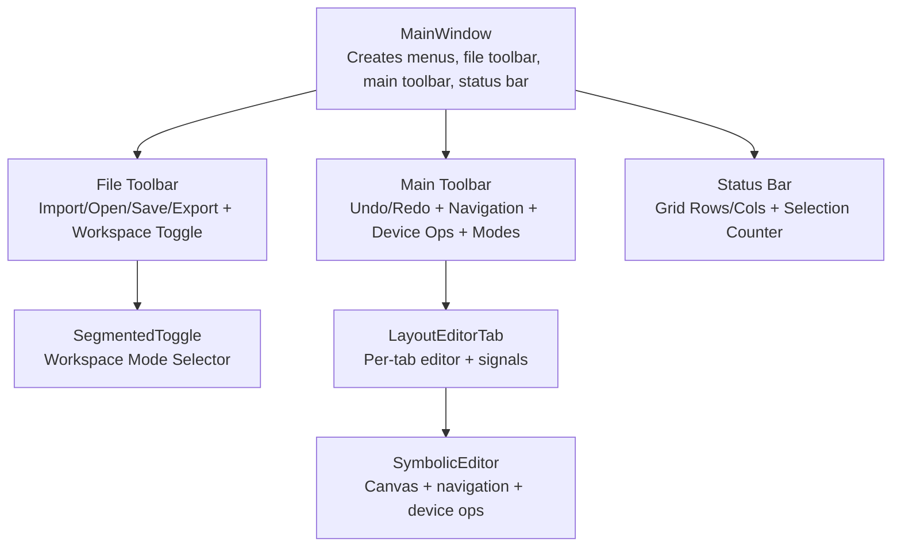
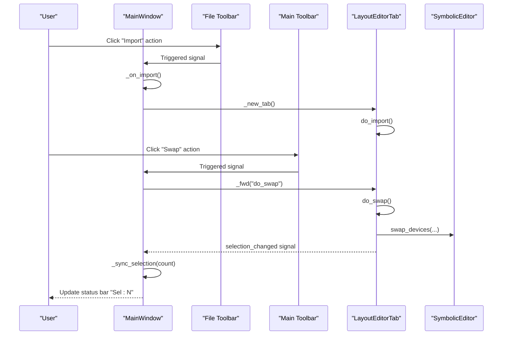
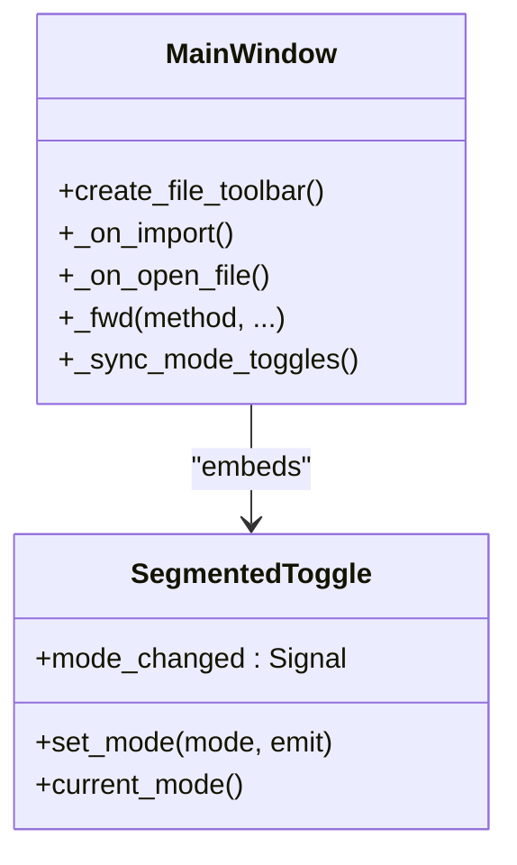
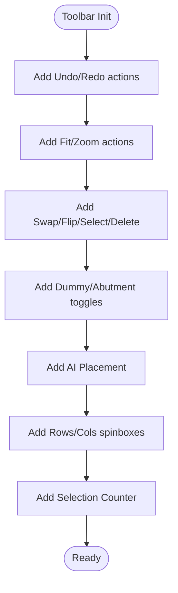
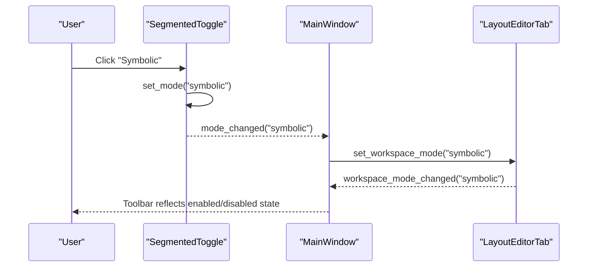
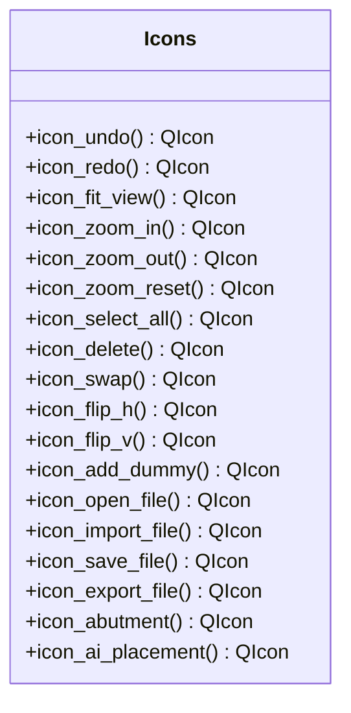
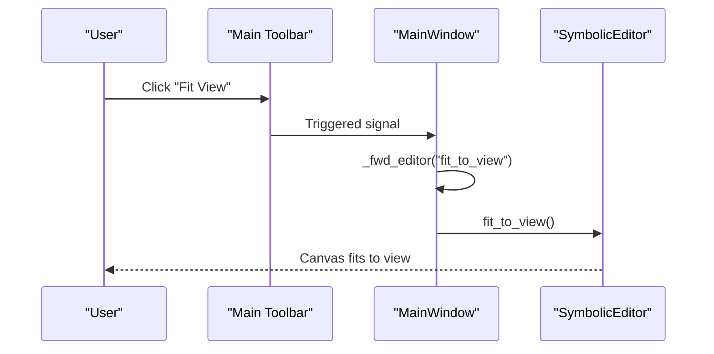
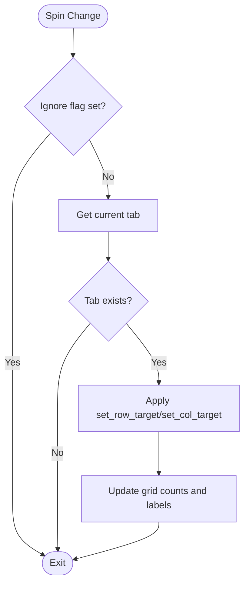
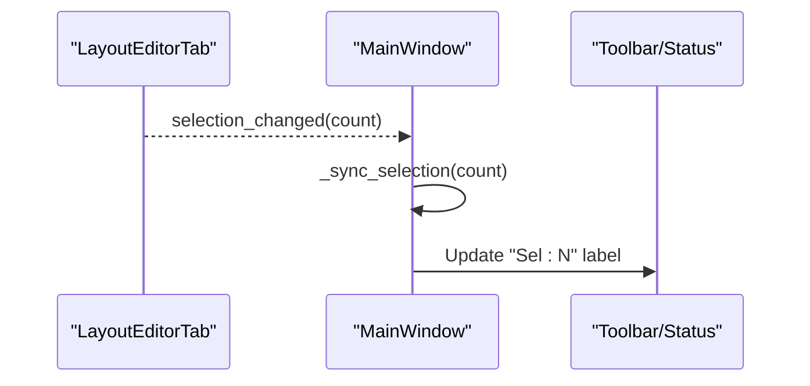
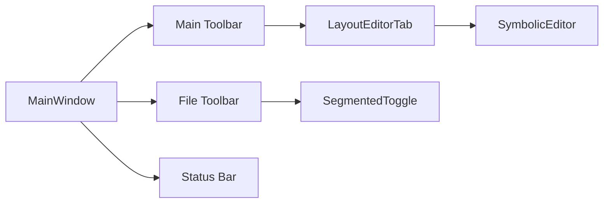

# Toolbar Controls and Quick Actions

<cite>
**Referenced Files in This Document**
- [main.py](file://symbolic_editor/main.py)
- [icons.py](file://symbolic_editor/icons.py)
- [view_toggle.py](file://symbolic_editor/view_toggle.py)
- [layout_tab.py](file://symbolic_editor/layout_tab.py)
- [editor_view.py](file://symbolic_editor/editor_view.py)
</cite>

## Table of Contents
1. [Introduction](#introduction)
2. [Project Structure](#project-structure)
3. [Core Components](#core-components)
4. [Architecture Overview](#architecture-overview)
5. [Detailed Component Analysis](#detailed-component-analysis)
6. [Dependency Analysis](#dependency-analysis)
7. [Performance Considerations](#performance-considerations)
8. [Troubleshooting Guide](#troubleshooting-guide)
9. [Conclusion](#conclusion)

## Introduction
This document explains the toolbar system and quick action controls used in the Symbolic Layout Editor. It covers:
- The left vertical toolbar with icon buttons for undo/redo, canvas navigation, device manipulation, and special modes.
- The file toolbar with quick import/open/save/export actions and workspace mode toggle.
- Toolbar styling, icon management, and button behavior (hover and checked states).
- Segmented toggle controls for workspace mode selection and their integration with menu actions.
- Embedded spin boxes for grid configuration synchronized with tab state.
- Toolbar positioning, orientation, and the relationship between toolbar actions and their menu equivalents.
- Selection counter display and its integration with device manipulation workflows.

## Project Structure
The toolbar system spans several modules:
- The main application window constructs and manages toolbars and status area.
- Icons are procedurally generated for consistent visuals.
- A segmented toggle widget provides workspace mode selection.
- The layout tab integrates toolbar actions with editor operations and emits signals for synchronization.

**Diagram sources**
- [main.py:107-111](file://symbolic_editor/main.py#L107-L111)
- [main.py:366-511](file://symbolic_editor/main.py#L366-L511)
- [view_toggle.py:11-121](file://symbolic_editor/view_toggle.py#L11-L121)
- [layout_tab.py:64-109](file://symbolic_editor/layout_tab.py#L64-L109)
- [editor_view.py:81-191](file://symbolic_editor/editor_view.py#L81-L191)

**Section sources**
- [main.py:107-111](file://symbolic_editor/main.py#L107-L111)
- [main.py:366-511](file://symbolic_editor/main.py#L366-L511)
- [view_toggle.py:11-121](file://symbolic_editor/view_toggle.py#L11-L121)
- [layout_tab.py:64-109](file://symbolic_editor/layout_tab.py#L64-L109)
- [editor_view.py:81-191](file://symbolic_editor/editor_view.py#L81-L191)

## Core Components
- File toolbar: Quick actions for import, open, save, export, and a workspace mode toggle.
- Main vertical toolbar: Undo/redo, fit view/zoom controls, device manipulation (swap, flip H/V), special modes (dummy placement, abutment analysis), AI placement, select all, delete, and grid spin boxes with selection counter.
- Status bar: Grid rows/columns and selection counter.
- Segmented toggle: Workspace mode selector with three states (symbolic, KLayout, both).
- Icon system: Procedurally generated vector icons for all toolbar actions.

**Section sources**
- [main.py:366-511](file://symbolic_editor/main.py#L366-L511)
- [main.py:574-611](file://symbolic_editor/main.py#L574-L611)
- [icons.py:40-476](file://symbolic_editor/icons.py#L40-L476)
- [view_toggle.py:11-121](file://symbolic_editor/view_toggle.py#L11-L121)

## Architecture Overview
The toolbar system is coordinated by the main window, which:
- Creates toolbars and status bar.
- Wires toolbar actions to forward calls to the active tab.
- Synchronizes toolbar state with tab signals (undo/redo availability, selection count, grid counts, workspace mode).
- Provides a segmented toggle for workspace mode selection integrated with menu actions.

**Diagram sources**
- [main.py:183-196](file://symbolic_editor/main.py#L183-L196)
- [main.py:209-218](file://symbolic_editor/main.py#L209-L218)
- [main.py:621-629](file://symbolic_editor/main.py#L621-L629)
- [layout_tab.py:740-749](file://symbolic_editor/layout_tab.py#L740-L749)

## Detailed Component Analysis

### File Toolbar
- Purpose: Provide quick access to file operations and workspace mode toggle.
- Controls:
  - Import netlist + layout.
  - Open JSON.
  - Save current layout.
  - Export JSON.
  - Workspace mode toggle (symbolic/KLayout/both) via a segmented toggle.
- Behavior:
  - Actions are QAction instances with icons from the icon system.
  - Workspace toggle is disabled until a tab is open; it synchronizes with tab workspace mode.
  - Tooltips reflect keyboard shortcuts where applicable.

**Diagram sources**
- [main.py:366-413](file://symbolic_editor/main.py#L366-L413)
- [view_toggle.py:11-121](file://symbolic_editor/view_toggle.py#L11-L121)

**Section sources**
- [main.py:366-413](file://symbolic_editor/main.py#L366-L413)
- [main.py:220-234](file://symbolic_editor/main.py#L220-L234)
- [view_toggle.py:11-121](file://symbolic_editor/view_toggle.py#L11-L121)

### Main Vertical Toolbar
- Orientation: Left vertical toolbar with icon-only buttons.
- Categories:
  - Undo/redo: Action-enabled state synchronized with tab.
  - Canvas navigation: Fit view, zoom in/out, zoom reset.
  - Device manipulation: Swap, flip horizontal, flip vertical, select all, delete.
  - Special modes: Toggle dummy placement (checkable), abutment analysis (checkable), AI placement.
  - Grid configuration: Rows and Columns spin boxes bound to tab virtual grid targets.
  - Selection counter: Persistent label showing selected device count.
- Styling: Custom CSS for background, borders, hover, pressed, and checked states.

**Diagram sources**
- [main.py:414-511](file://symbolic_editor/main.py#L414-L511)

**Section sources**
- [main.py:414-511](file://symbolic_editor/main.py#L414-L511)
- [main.py:201-218](file://symbolic_editor/main.py#L201-L218)

### Segmented Toggle Controls (Workspace Mode)
- Purpose: Switch between symbolic workspace, KLayout preview, or both views.
- States: "symbolic", "klayout", "both".
- Integration:
  - Toolbar embedding with a dedicated stylesheet variant.
  - Shortcuts mapped to Ctrl+1, Ctrl+2, Ctrl+3.
  - Emits mode_changed signal; MainWindow/tab synchronize accordingly.

**Diagram sources**
- [view_toggle.py:113-121](file://symbolic_editor/view_toggle.py#L113-L121)
- [main.py:647-650](file://symbolic_editor/main.py#L647-L650)
- [layout_tab.py:338-362](file://symbolic_editor/layout_tab.py#L338-L362)

**Section sources**
- [view_toggle.py:11-121](file://symbolic_editor/view_toggle.py#L11-L121)
- [main.py:647-650](file://symbolic_editor/main.py#L647-L650)
- [layout_tab.py:338-362](file://symbolic_editor/layout_tab.py#L338-L362)

### Icon Management
- All icons are procedurally generated using QPainter on QPixmap with anti-aliased strokes.
- A cache stores generated icons for reuse.
- Palette supports dark theme foreground, accent, warnings, and specialized colors for device types.

**Diagram sources**
- [icons.py:40-476](file://symbolic_editor/icons.py#L40-L476)

**Section sources**
- [icons.py:12-34](file://symbolic_editor/icons.py#L12-L34)
- [icons.py:40-476](file://symbolic_editor/icons.py#L40-L476)

### Canvas Navigation and Editor Integration
- Navigation actions (fit view, zoom in/out, zoom reset) are forwarded to the active editor.
- The editor maintains zoom level, scale factor, and grid snapping parameters.
- View-level toggles (detailed vs outline) are exposed by the editor.

**Diagram sources**
- [main.py:446-464](file://symbolic_editor/main.py#L446-L464)
- [layout_tab.py:249-261](file://symbolic_editor/layout_tab.py#L249-L261)
- [editor_view.py:81-191](file://symbolic_editor/editor_view.py#L81-L191)

**Section sources**
- [main.py:446-464](file://symbolic_editor/main.py#L446-L464)
- [layout_tab.py:249-261](file://symbolic_editor/layout_tab.py#L249-L261)
- [editor_view.py:81-191](file://symbolic_editor/editor_view.py#L81-L191)

### Grid Configuration Spin Boxes and Synchronization
- Two embedded spin boxes labeled "Rows:" and "Cols:" appear in the main toolbar.
- Values are synchronized with tab state:
  - Minimums reflect actual device coverage; values reflect virtual grid targets.
  - Changes trigger tab methods to adjust virtual grid extents and ensure minimums.
- Status bar contains parallel spin boxes for immediate feedback.

**Diagram sources**
- [main.py:660-673](file://symbolic_editor/main.py#L660-L673)
- [layout_tab.py:650-676](file://symbolic_editor/layout_tab.py#L650-L676)
- [main.py:212-218](file://symbolic_editor/main.py#L212-L218)

**Section sources**
- [main.py:501-562](file://symbolic_editor/main.py#L501-L562)
- [main.py:583-610](file://symbolic_editor/main.py#L583-L610)
- [main.py:660-673](file://symbolic_editor/main.py#L660-L673)
- [layout_tab.py:650-676](file://symbolic_editor/layout_tab.py#L650-L676)

### Selection Counter Display
- A persistent label "Sel: N" appears in both the main toolbar and status bar.
- Updated whenever the tab’s selection changes.
- Integrates with device manipulation workflows (e.g., swap, flip, delete) that trigger selection updates.

**Diagram sources**
- [layout_tab.py:629-631](file://symbolic_editor/layout_tab.py#L629-L631)
- [main.py:209-210](file://symbolic_editor/main.py#L209-L210)

**Section sources**
- [main.py:209-210](file://symbolic_editor/main.py#L209-L210)
- [layout_tab.py:629-631](file://symbolic_editor/layout_tab.py#L629-L631)

### Relationship Between Toolbar Actions and Menus
- Many toolbar actions mirror menu actions and share the same underlying methods.
- Keyboard shortcuts are duplicated between toolbar tooltips and menu entries.
- Workspace mode selection is available in both the toolbar segmented toggle and the menu.

**Section sources**
- [main.py:251-362](file://symbolic_editor/main.py#L251-L362)
- [main.py:433-498](file://symbolic_editor/main.py#L433-L498)

## Dependency Analysis
- MainWindow depends on:
  - SegmentedToggle for workspace mode selection.
  - Icons module for QAction icons.
  - LayoutEditorTab for forwarding commands and receiving signals.
- LayoutEditorTab depends on:
  - SymbolicEditor for canvas operations.
  - SegmentedToggle for workspace mode control.
- Status bar mirrors grid spin boxes and selection counter synchronized from tab signals.

**Diagram sources**
- [main.py:107-111](file://symbolic_editor/main.py#L107-L111)
- [main.py:366-511](file://symbolic_editor/main.py#L366-L511)
- [layout_tab.py:64-109](file://symbolic_editor/layout_tab.py#L64-L109)

**Section sources**
- [main.py:107-111](file://symbolic_editor/main.py#L107-L111)
- [main.py:366-511](file://symbolic_editor/main.py#L366-L511)
- [layout_tab.py:64-109](file://symbolic_editor/layout_tab.py#L64-L109)

## Performance Considerations
- Procedural icons minimize external assets and enable efficient caching.
- Toolbar stylesheets use minimal selectors to reduce repaint overhead.
- Grid spin boxes ignore updates during programmatic synchronization to avoid loops.
- Editor caches background to improve rendering performance during frequent updates.

## Troubleshooting Guide
- Undo/redo buttons disabled:
  - Ensure the active tab has undo/redo history; MainWindow enables/disables based on tab signals.
- Workspace toggle disabled:
  - The toggle is enabled only when a tab is present; open a tab to activate it.
- Grid spin boxes not updating:
  - Verify the ignore flag is not blocking updates; confirm tab methods are invoked on value changes.
- Selection counter not reflecting changes:
  - Confirm the tab emits selection_changed and MainWindow updates the label accordingly.

**Section sources**
- [main.py:201-207](file://symbolic_editor/main.py#L201-L207)
- [main.py:231-234](file://symbolic_editor/main.py#L231-L234)
- [main.py:660-673](file://symbolic_editor/main.py#L660-L673)
- [layout_tab.py:629-631](file://symbolic_editor/layout_tab.py#L629-L631)

## Conclusion
The toolbar system provides a cohesive, styled, and responsive interface for file operations, canvas navigation, device manipulation, and workspace control. Its design leverages a centralized MainWindow that forwards actions to the active tab, ensuring consistent behavior across toolbar and menu interactions. Styling and icon generation maintain a unified dark-theme aesthetic, while segmented toggles and spin boxes integrate tightly with tab state for predictable user workflows.