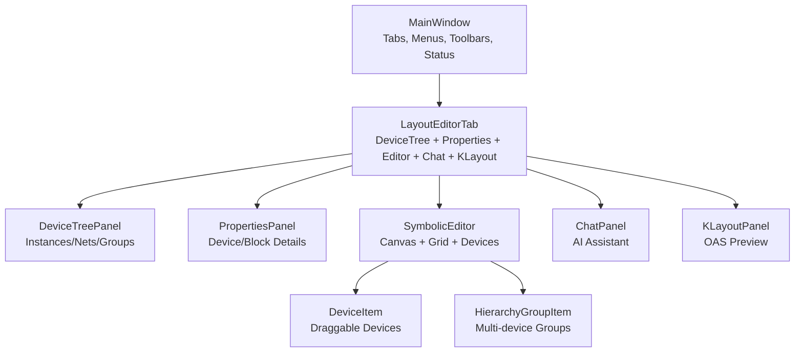
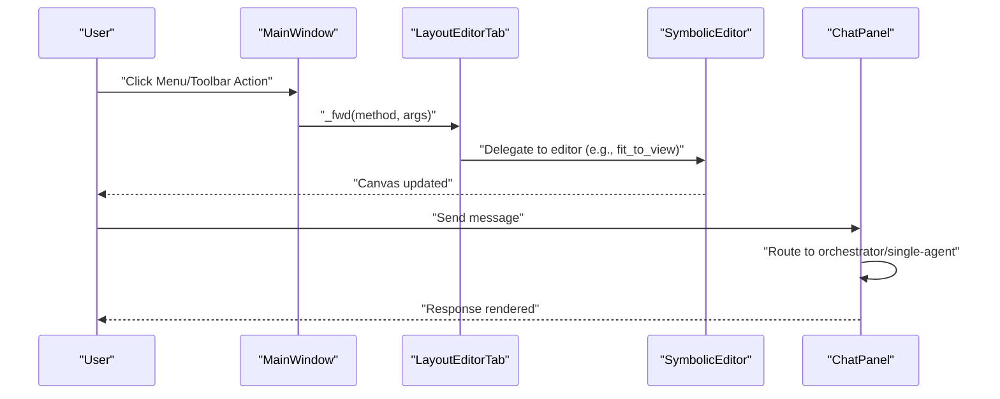
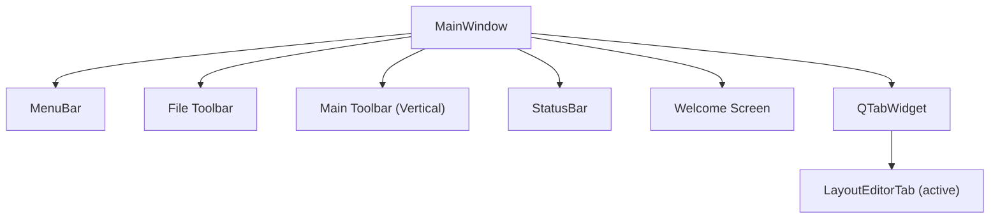
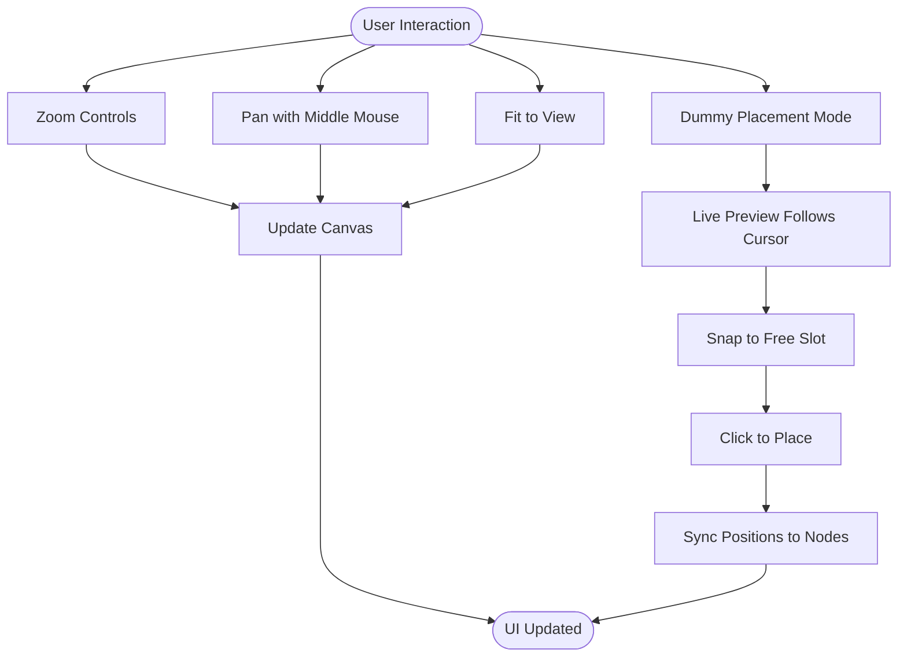
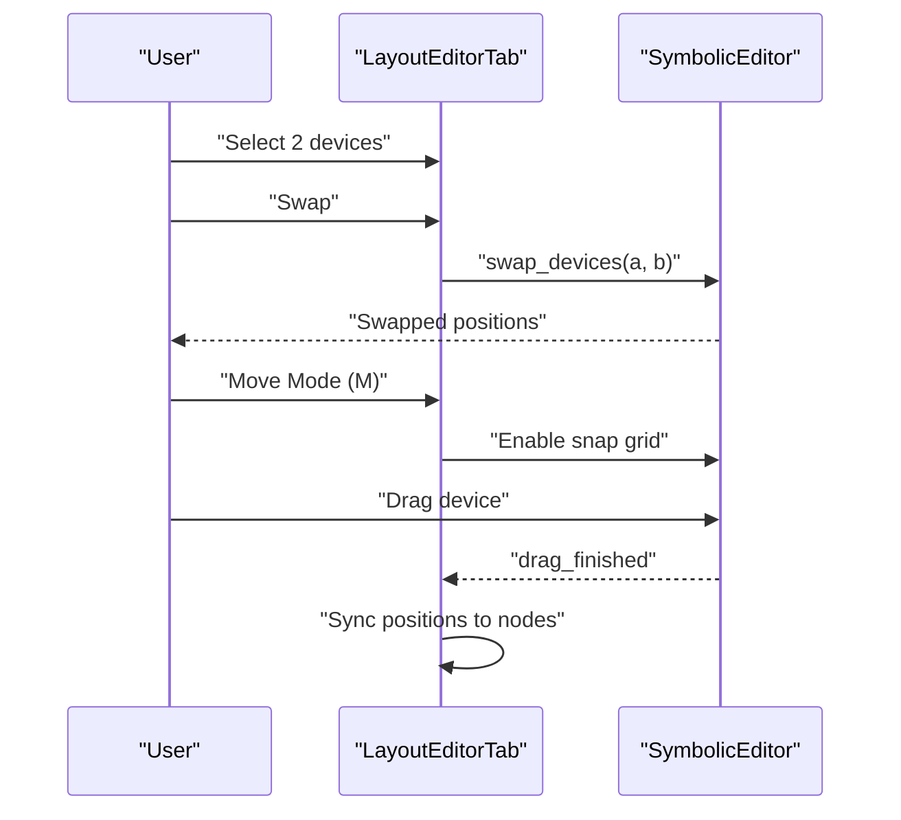
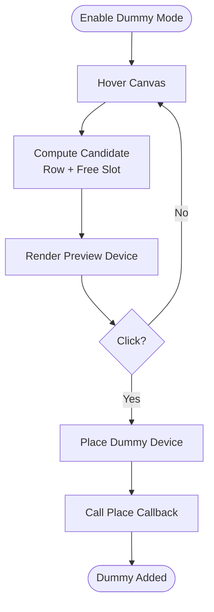
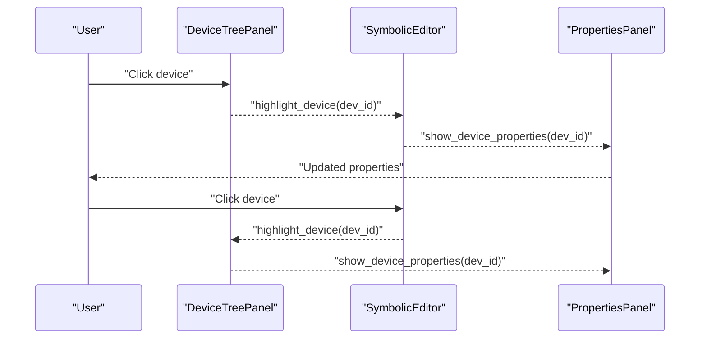
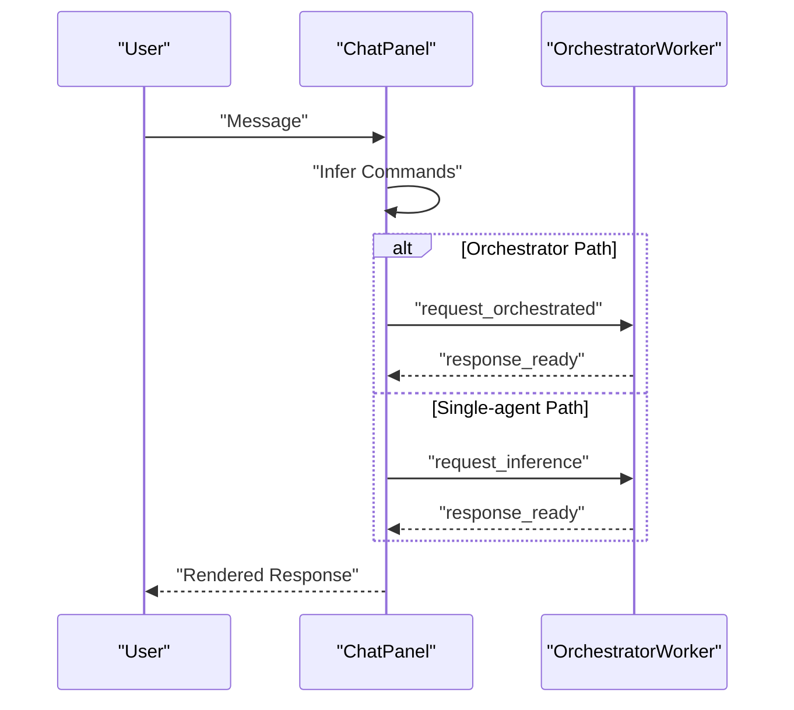
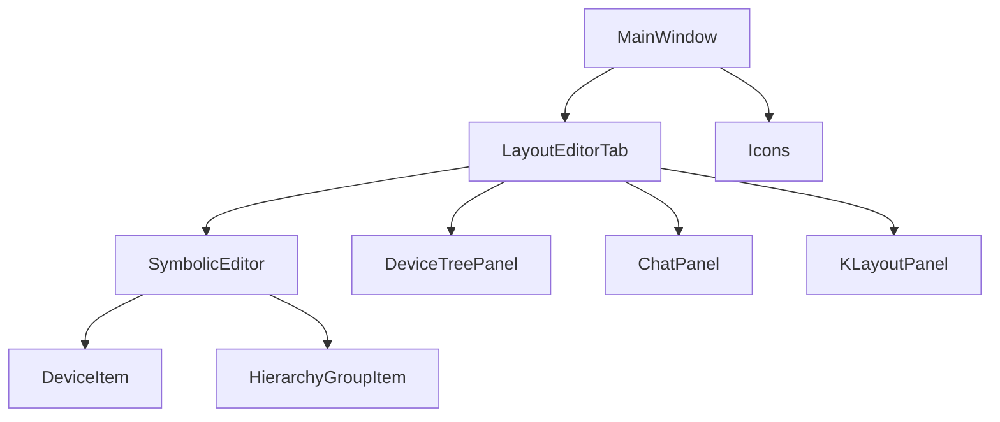

# User Interface Guide

<cite>
**Referenced Files in This Document**
- [main.py](file://symbolic_editor/main.py)
- [layout_tab.py](file://symbolic_editor/layout_tab.py)
- [editor_view.py](file://symbolic_editor/editor_view.py)
- [device_tree.py](file://symbolic_editor/device_tree.py)
- [chat_panel.py](file://symbolic_editor/chat_panel.py)
- [klayout_panel.py](file://symbolic_editor/klayout_panel.py)
- [view_toggle.py](file://symbolic_editor/view_toggle.py)
- [icons.py](file://symbolic_editor/icons.py)
- [device_item.py](file://symbolic_editor/device_item.py)
- [hierarchy_group_item.py](file://symbolic_editor/hierarchy_group_item.py)
</cite>

## Table of Contents
1. [Introduction](#introduction)
2. [Project Structure](#project-structure)
3. [Core Components](#core-components)
4. [Architecture Overview](#architecture-overview)
5. [Detailed Component Analysis](#detailed-component-analysis)
6. [Dependency Analysis](#dependency-analysis)
7. [Performance Considerations](#performance-considerations)
8. [Troubleshooting Guide](#troubleshooting-guide)
9. [Conclusion](#conclusion)
10. [Appendices](#appendices)

## Introduction
This guide documents the PySide6-based graphical user interface for the Symbolic Layout Editor. It explains the main window layout, toolbar and menu system, device hierarchy panel, canvas area, and AI chat panel. It also covers canvas navigation (zoom, pan, fit view), device manipulation tools (move, swap, delete, flip, merge), the dummy device placement workflow with live preview and grid snapping, keyboard shortcuts, device hierarchy navigation and selection, and customization options for managing multiple layout tabs.

## Project Structure
The application is organized around a multi-tab shell where each tab hosts a complete layout editing environment:
- Central shell: MainWindow manages tabs, menus, toolbars, and status bar
- Per-tab shell: LayoutEditorTab composes the device tree, properties panel, canvas editor, AI chat panel, and KLayout preview
- Canvas: SymbolicEditor provides interactive device placement, routing visualization, and grid-snapped editing
- Panels: DeviceTreePanel, PropertiesPanel, ChatPanel, and KLayoutPanel provide complementary views and controls
- Navigation: SegmentedToggle switches between symbolic, KLayout, and both views

**Diagram sources**
- [main.py:80-118](file://symbolic_editor/main.py#L80-L118)
- [layout_tab.py:64-108](file://symbolic_editor/layout_tab.py#L64-L108)
- [editor_view.py:81-110](file://symbolic_editor/editor_view.py#L81-L110)
- [device_tree.py:25-42](file://symbolic_editor/device_tree.py#L25-L42)
- [chat_panel.py:95-120](file://symbolic_editor/chat_panel.py#L95-L120)
- [klayout_panel.py:30-40](file://symbolic_editor/klayout_panel.py#L30-L40)
- [device_item.py:17-56](file://symbolic_editor/device_item.py#L17-L56)
- [hierarchy_group_item.py:28-90](file://symbolic_editor/hierarchy_group_item.py#L28-L90)

**Section sources**
- [main.py:80-118](file://symbolic_editor/main.py#L80-L118)
- [layout_tab.py:64-108](file://symbolic_editor/layout_tab.py#L64-L108)

## Core Components
- MainWindow: Hosts the tabbed interface, menu bar, toolbar, and status bar. Manages tab lifecycle, delegates actions to the active tab, and synchronizes toolbar and status indicators.
- LayoutEditorTab: Self-contained editor shell with device tree, properties panel, canvas, chat panel, and KLayout preview. Handles device manipulation, selection, and workspace mode switching.
- SymbolicEditor: Interactive canvas with grid snapping, zoom/pan, device rendering, hierarchy groups, and dummy placement preview.
- DeviceTreePanel: Hierarchical view of devices, nets, and blocks with tabbed navigation.
- ChatPanel: AI assistant panel with multi-agent orchestration and command extraction.
- KLayoutPanel: Renders and previews OAS layouts using KLayout.
- SegmentedToggle: Workspace mode selector (symbolic, KLayout, both).
- Icons: Procedurally generated toolbar icons.

**Section sources**
- [main.py:80-118](file://symbolic_editor/main.py#L80-L118)
- [layout_tab.py:64-108](file://symbolic_editor/layout_tab.py#L64-L108)
- [editor_view.py:81-110](file://symbolic_editor/editor_view.py#L81-L110)
- [device_tree.py:25-42](file://symbolic_editor/device_tree.py#L25-L42)
- [chat_panel.py:95-120](file://symbolic_editor/chat_panel.py#L95-L120)
- [klayout_panel.py:30-40](file://symbolic_editor/klayout_panel.py#L30-L40)
- [view_toggle.py:11-30](file://symbolic_editor/view_toggle.py#L11-L30)
- [icons.py:39-103](file://symbolic_editor/icons.py#L39-L103)

## Architecture Overview
The UI architecture centers on a tabbed shell where each tab encapsulates a complete editing environment. The main window delegates actions to the active tab, which in turn controls the canvas, panels, and workers. The canvas integrates device items, hierarchy groups, and rendering modes. The chat panel communicates with AI workers via Qt signals and slots.

**Diagram sources**
- [main.py:621-629](file://symbolic_editor/main.py#L621-L629)
- [layout_tab.py:220-227](file://symbolic_editor/layout_tab.py#L220-L227)
- [chat_panel.py:463-514](file://symbolic_editor/chat_panel.py#L463-L514)

## Detailed Component Analysis

### Main Window Layout and Controls
- Menu Bar: File (New/Open/Save/Export/Close), Edit (Undo/Redo/Select All/Delete), View (Fit/Zoom/Toggle Panels/Device View/Workspace Modes), Design (Swap/Merge/Flip/Dummy/Match/AI Placement).
- File Toolbar: Quick actions for import/open/save/export and workspace toggle.
- Main Toolbar (Vertical): Undo/Redo, Fit View/Zoom In/Out/Reset, Swap/Flip H/V, Dummy Toggle, Abutment, AI Placement, Select All, Delete, plus grid row/column spinners and selection counter.
- Status Bar: Grid row/column spinners and selection indicator.
- Tab Management: QTabWidget with closable and movable tabs; WelcomeScreen appears when no tabs are open.

**Diagram sources**
- [main.py:239-362](file://symbolic_editor/main.py#L239-L362)
- [main.py:366-511](file://symbolic_editor/main.py#L366-L511)
- [main.py:574-611](file://symbolic_editor/main.py#L574-L611)

**Section sources**
- [main.py:239-362](file://symbolic_editor/main.py#L239-L362)
- [main.py:366-511](file://symbolic_editor/main.py#L366-L511)
- [main.py:574-611](file://symbolic_editor/main.py#L574-L611)

### Canvas Navigation System
- Zoom Controls: Zoom In/Out buttons and keyboard shortcuts; Reset Zoom; Fit to View.
- Pan: Middle mouse drag enables panning; rubberband selection for multi-select.
- View Levels: Detailed devices, outline devices, block symbols.
- Grid Snapping: Automatic grid alignment; virtual grid extents; row gap override.
- Dummy Placement Preview: Live preview follows cursor; snaps to nearest free slot; click to commit.

**Diagram sources**
- [editor_view.py:109-113](file://symbolic_editor/editor_view.py#L109-L113)
- [editor_view.py:192-203](file://symbolic_editor/editor_view.py#L192-L203)
- [editor_view.py:246-347](file://symbolic_editor/editor_view.py#L246-L347)
- [layout_tab.py:249-261](file://symbolic_editor/layout_tab.py#L249-L261)

**Section sources**
- [editor_view.py:109-113](file://symbolic_editor/editor_view.py#L109-L113)
- [editor_view.py:192-203](file://symbolic_editor/editor_view.py#L192-L203)
- [editor_view.py:246-347](file://symbolic_editor/editor_view.py#L246-L347)
- [layout_tab.py:249-261](file://symbolic_editor/layout_tab.py#L249-L261)

### Device Manipulation Tools
- Select All: Select all devices on canvas.
- Swap: Exchange positions of two selected devices.
- Flip Horizontal/Vertical: Mirror selected devices.
- Delete: Remove selected devices.
- Merge: Combine two devices sharing Source/Source or Drain/Drain with proper orientation and overlap resolution.
- Move Mode: Drag a single selected device; matched groups move together; Esc or M toggles move mode.

**Diagram sources**
- [layout_tab.py:736-800](file://symbolic_editor/layout_tab.py#L736-L800)
- [editor_view.py:352-466](file://symbolic_editor/editor_view.py#L352-L466)

**Section sources**
- [layout_tab.py:736-800](file://symbolic_editor/layout_tab.py#L736-L800)
- [editor_view.py:352-466](file://symbolic_editor/editor_view.py#L352-L466)

### Dummy Device Placement Workflow
- Toggle Dummy Mode: Toolbar action or D key; enables mouse tracking and live preview.
- Live Preview: Ghost device follows cursor; respects row boundaries; semi-transparent.
- Grid Snapping: Places at nearest free slot; finds free X aligned to target row.
- Commit: Click places the dummy; callback triggers placement; preview cleared after commit.

**Diagram sources**
- [editor_view.py:192-203](file://symbolic_editor/editor_view.py#L192-L203)
- [editor_view.py:246-347](file://symbolic_editor/editor_view.py#L246-L347)
- [layout_tab.py:228](file://symbolic_editor/layout_tab.py#L228)

**Section sources**
- [editor_view.py:192-203](file://symbolic_editor/editor_view.py#L192-L203)
- [editor_view.py:246-347](file://symbolic_editor/editor_view.py#L246-L347)
- [layout_tab.py:228](file://symbolic_editor/layout_tab.py#L228)

### Keyboard Shortcuts
- Global: Ctrl+T (New Tab), Ctrl+I (Import), Ctrl+O (Open), Ctrl+S (Save), Ctrl+Shift+S (Save As), Ctrl+W (Close Tab), Ctrl+Shift+R (Reload App)
- Edit: Undo/Redo, Select All, Delete
- View: Fit to View, Zoom In/Out/Reset, Toggle Panels, Device View, Workspace Modes (Ctrl+1/2/3)
- Design: Swap (Ctrl+Shift+X), Flip H (Ctrl+H), Flip V (Ctrl+J), Toggle Dummy (D), Match Devices (Ctrl+M), Unlock Matched (Ctrl+U), AI Placement (Ctrl+P), View in KLayout
- Canvas: F (Fit View), Shift+F (Detailed View), Ctrl+F (Outline View), D (Dummy Mode), M (Move Mode)

**Section sources**
- [main.py:252-362](file://symbolic_editor/main.py#L252-L362)
- [layout_tab.py:249-261](file://symbolic_editor/layout_tab.py#L249-L261)

### Device Hierarchy Navigation and Selection
- DeviceTreePanel: Tabs for Instances, Nets, Groups; highlights devices and shows connections; supports block selection.
- Selection: Click device in tree or canvas; properties panel updates; grid counters reflect virtual extents.
- Hierarchy Groups: Visual bounding boxes; drag group to move children; double-click header to descend/ascend; child visibility controlled by descent state.
- Selection Synchronization: Canvas selection updates tree and properties; vice versa.

**Diagram sources**
- [device_tree.py:528-592](file://symbolic_editor/device_tree.py#L528-L592)
- [layout_tab.py:611-627](file://symbolic_editor/layout_tab.py#L611-L627)
- [hierarchy_group_item.py:128-141](file://symbolic_editor/hierarchy_group_item.py#L128-L141)

**Section sources**
- [device_tree.py:528-592](file://symbolic_editor/device_tree.py#L528-L592)
- [layout_tab.py:611-627](file://symbolic_editor/layout_tab.py#L611-L627)
- [hierarchy_group_item.py:128-141](file://symbolic_editor/hierarchy_group_item.py#L128-L141)

### AI Chat Panel
- Multi-agent Orchestration: Detects keywords to route to orchestrator pipeline; otherwise single-agent inference.
- Command Extraction: Parses natural language for swap/move/add-dummy intents; executes commands immediately.
- Thinking Indicator: Animated dots or staged labels during multi-agent processing.
- Layout Context: Sends nodes/edges/terminal nets to AI for informed responses.

**Diagram sources**
- [chat_panel.py:463-514](file://symbolic_editor/chat_panel.py#L463-L514)
- [chat_panel.py:584-651](file://symbolic_editor/chat_panel.py#L584-L651)

**Section sources**
- [chat_panel.py:463-514](file://symbolic_editor/chat_panel.py#L463-L514)
- [chat_panel.py:584-651](file://symbolic_editor/chat_panel.py#L584-L651)

### KLayout Preview Panel
- Displays OAS preview rendered by KLayout; supports Refresh and Open in KLayout.
- Shows status and image area with scrollbars; integrates with workspace mode.

**Section sources**
- [klayout_panel.py:30-140](file://symbolic_editor/klayout_panel.py#L30-L140)
- [klayout_panel.py:171-226](file://symbolic_editor/klayout_panel.py#L171-L226)

### Customizing the Interface and Managing Tabs
- Workspace Modes: SegmentedToggle switches between symbolic, KLayout, and both views; shortcuts Ctrl+1/2/3.
- Panel Visibility: Device Tree and Chat Panel can be collapsed; reopen strips appear when hidden.
- Tab Management: New tabs, close tabs, reorder tabs, and set document titles; welcome screen when no tabs.
- Grid Controls: Row/Column spinners adjust virtual grid extents; synchronized with status bar and toolbar.

**Section sources**
- [view_toggle.py:113-130](file://symbolic_editor/view_toggle.py#L113-L130)
- [layout_tab.py:302-322](file://symbolic_editor/layout_tab.py#L302-L322)
- [main.py:127-148](file://symbolic_editor/main.py#L127-L148)
- [layout_tab.py:650-676](file://symbolic_editor/layout_tab.py#L650-L676)

## Dependency Analysis
The UI components are loosely coupled via signals/slots and delegation:
- MainWindow delegates actions to LayoutEditorTab via method forwarding.
- LayoutEditorTab wires device tree, canvas, chat panel, and KLayout panel; updates properties panel on selection changes.
- SymbolicEditor manages device items and hierarchy groups; emits selection and click signals.
- Icons are generated procedurally and reused across toolbars and panels.

**Diagram sources**
- [main.py:621-629](file://symbolic_editor/main.py#L621-L629)
- [layout_tab.py:211-227](file://symbolic_editor/layout_tab.py#L211-L227)
- [icons.py:39-103](file://symbolic_editor/icons.py#L39-L103)

**Section sources**
- [main.py:621-629](file://symbolic_editor/main.py#L621-L629)
- [layout_tab.py:211-227](file://symbolic_editor/layout_tab.py#L211-L227)

## Performance Considerations
- Canvas Rendering: Antialiasing and background caching improve rendering performance; grid drawing optimized with caching.
- Grid Metrics: Derived from device sizes; snap grid and row pitch computed to minimize redraw overhead.
- Hierarchy Groups: Child visibility toggled without changing positions to preserve state and reduce layout churn.
- AI Workers: Dedicated QThread with signal-based communication avoids blocking the UI.

## Troubleshooting Guide
- No OAS Available: KLayout panel shows “No OAS file available” when exporting to OAS is required before preview.
- Render Errors: KLayout preview reports errors; check OAS file validity and KLayout availability.
- Selection Issues: Hierarchy-aware scene blocks selection of non-descended devices; ensure proper hierarchy descent.
- Undo/Redo: Undo stacks updated on drag start/end; ensure nodes are synced before undo/redo operations.
- Dummy Placement: If preview does not appear, verify dummy mode is enabled and there are devices to align against.

**Section sources**
- [klayout_panel.py:171-226](file://symbolic_editor/klayout_panel.py#L171-L226)
- [editor_view.py:46-78](file://symbolic_editor/editor_view.py#L46-L78)
- [layout_tab.py:700-731](file://symbolic_editor/layout_tab.py#L700-L731)

## Conclusion
The Symbolic Layout Editor provides a comprehensive, tabbed PySide6 interface integrating device manipulation, hierarchical navigation, AI-assisted design, and physical preview. Users can efficiently navigate the canvas, manage devices, collaborate with the AI assistant, and preview layouts in KLayout, all while customizing the workspace to their workflow.

## Appendices

### UI Element Visual Descriptions
- Toolbar Icons: Generated procedurally with distinct shapes for each action (e.g., fit-view brackets, magnifying glass for zoom, trash can for delete).
- Device Items: Color-coded by type (NMOS/PMOS/dummies) with terminal labels; selectable and movable with snap-to-grid.
- Hierarchy Groups: Semi-transparent bounding boxes with header area for drag and double-click to descend/ascend.
- Panels: Dark-themed with subtle borders and hover effects; collapsible with reopen strips.

**Section sources**
- [icons.py:39-103](file://symbolic_editor/icons.py#L39-L103)
- [device_item.py:57-84](file://symbolic_editor/device_item.py#L57-L84)
- [hierarchy_group_item.py:64-85](file://symbolic_editor/hierarchy_group_item.py#L64-L85)
- [device_tree.py:48-84](file://symbolic_editor/device_tree.py#L48-L84)