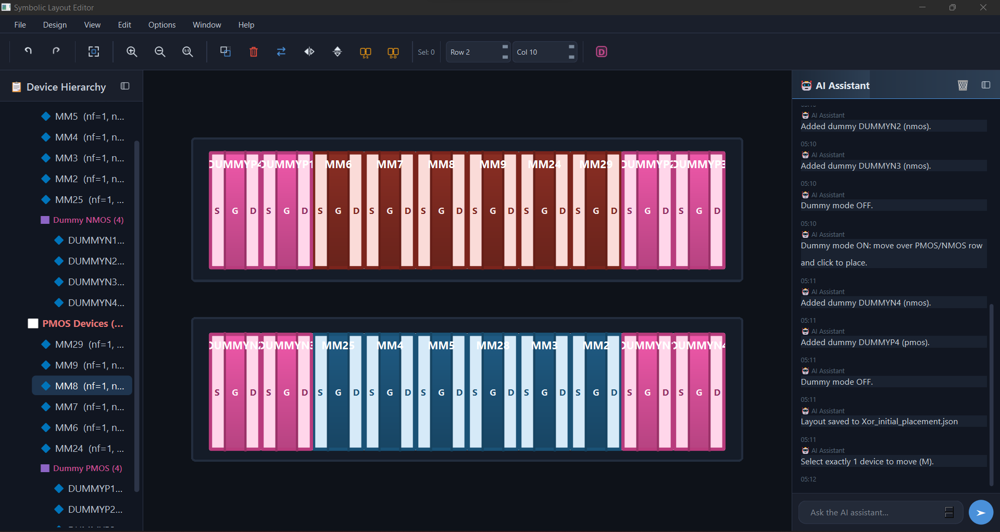

# AI-Based Analog Layout Automation

> Symbolic analog layout editor with AI-assisted placement for PMOS/NMOS device-level floorplanning.




---

## Quick Start

```bash
# 1. Clone the repository (new_main branch)
git clone -b new_main https://github.com/orabi55/AI-Based-Analog-Layout-Automation.git
cd AI-Based-Analog-Layout-Automation

# 2. Create a virtual environment
python -m venv .venv
# Windows
.venv\Scripts\activate
# macOS / Linux
source .venv/bin/activate

# 3. Install dependencies
pip install -r requirements.txt

# 4. Configure API keys
copy .env.example .env        # Windows
# cp .env.example .env        # macOS / Linux
# Then edit .env and paste your API keys

# 5. Run the application
python symbolic_editor/main.py
```

### Import a New Circuit

1. Open the GUI: `python symbolic_editor/main.py`
2. **File > Import from Netlist + Layout** (`Ctrl+I`) — select your `.sp` and `.oas` files.
3. System automatically generates:
   - `_graph.json` — Full format (for GUI display)
   - `_graph_compressed.json` — Optimized format (for AI prompts, 95% smaller)
4. **Design > Run AI Initial Placement** (`Ctrl+P`) — AI-optimized device positions.
5. Edit, refine, save, and export.

### Load an Existing Example

```bash
python symbolic_editor/main.py examples/current_mirror/CM_initial_placement.json
python symbolic_editor/main.py examples/xor/Xor_Automation_initial_placement.json
python symbolic_editor/main.py examples/std_cell/Std_Cell_initial_placement.json
```

> **For a detailed walkthrough see [docs/USER_GUIDE.md](docs/USER_GUIDE.md)**

---

## Features

### Interactive Symbolic Canvas
- **Move, swap, delete, flip (H/V), merge (S-S / D-D), select-all** — full keyboard-driven editing.
- **Undo / Redo** with unlimited history.
- **Fit view** (`F`), zoom in/out/reset with mouse wheel or toolbar buttons.
- **Move mode** (`M`) — pick up a selected device and reposition it.
- **Middle-mouse pan** for scrolling the canvas.
- Row-based **abutted placement**: PMOS and NMOS devices pack edge-to-edge, sharing Source/Drain diffusion.
- **Horizontal flip** keeps text labels (S, G, D, device name) always readable — only geometry is mirrored.

### Import Pipeline (GUI-Integrated)
- **Import from Netlist + Layout** (`Ctrl+I`) — parse `.sp` + `.oas` files directly in the GUI.
- **Run AI Initial Placement** (`Ctrl+P`) — Gemini LLM generates optimized device coordinates.
- Parser modules automatically match netlist devices to layout instances.

### Dummy Device Placement
- Toggle dummy mode from the toolbar (`D` key).
- **Live ghost preview** follows the cursor at 55% opacity showing exactly where the dummy will land.
- Click to place; the dummy snaps to the nearest free grid slot in the closest PMOS or NMOS row.
- Dummy devices are rendered with dedicated pink styling to distinguish them from active transistors.

### Multi-Tab GUI Architecture
- **Tabbed Workspace:** Open multiple `.oas`/`.sp` pairs or JSON saves simultaneously.
- **Isolated Environments:** Each tab maintains its own isolated AI chat history, canvas state, and placement pipeline.
- **Welcome Screen:** "Quick Start" project launcher directly from the main window.
- **Minimap Navigation:** Scalable minimap in the bottom right for instant navigation across large designs.
- **Searchable Device Tree:** Instantly filter devices via regex or substring in the hierarchy panel.
- **Command Palette:** Press `Ctrl+Shift+P` for quick, fuzzy-searchable access to all actions.

### AI Placement & Multi-Agent Pipeline
- **Topology Analyst (Fast LLM):** Scans the netlist to categorize every transistor (Diff-Pair, Current Mirror, Cascode, Tail, Latch, Switch).
- **Deterministic Placement Engine:** Eliminates LLM hallucination. Uses topology classifications to deterministically assign functional rows (e.g. `[TAIL] [DIFF_PAIR] [LATCH]`).
- **Matching Enforcement:** Automatically forces **ABBA interdigitation** for diff-pairs and **centroid adjacent** placement for mirrors/latches.
- **Square-Ratio Packing:** Smart row-splitting guarantees an optimal 1:1 square aspect ratio instead of extremely wide strips.
- **DRC Healing & Symmetry:** Aligns rows to a center vertical axis to ensure perfectly symmetric layout output.
- **Simulated Annealing (SA) Post-Optimization:** Rapid intra-row device swapping to minimize Half-Perimeter Wirelength (HPWL).
- **Abutment Engine:** Automatically identifies shared Source/Drain nets and snaps adjacent fingers to 0.070µm pitch to save area.

### Broad AI Provider Support
- **Google Vertex AI (Cloud ADC):** Run Gemini and Claude securely via Google Cloud Application Default Credentials (no API key needed).
- **Alibaba DashScope (Qwen):** Ultra-fast, cost-effective placement models (`qwen-plus`, `qwen3.6-max`).
- **Google AI Studio (Gemini), Groq, OpenAI, DeepSeek, Ollama.**
- Built-in chat panel for interacting directly with the layout context.

### Keyboard Shortcuts

| Key | Action |
|-----|--------|
| `Ctrl+I` | Import from Netlist + Layout |
| `Ctrl+P` | Run AI Initial Placement |
| `Ctrl+O` | Load placement JSON |
| `Ctrl+S` | Save current tab |
| `Ctrl+Shift+S` | Save As |
| `Ctrl+E` | Export JSON |
| `Ctrl+Shift+E` | Export to OAS |
| `Ctrl+W` | Close current tab |
| `Ctrl+Shift+P`| Open Command Palette |
| `G` | Merge S-S (selected pair) |
| `Shift+G` | Merge D-D (selected pair) |
| `M` | Toggle move mode |
| `D` | Toggle dummy placement mode |
| `F` | Fit view |
| `Delete` | Delete selected devices |
| `Ctrl+A` | Select all |
| `Ctrl+Z` | Undo |
| `Ctrl+Y` | Redo |
| `Esc` | Cancel current mode / deselect |

---

## API Key Configuration

Copy the template and fill in your keys:

```bash
copy .env.example .env   # Windows
# cp .env.example .env   # macOS / Linux
```

At minimum, set **one** of these (Gemini recommended):

| Provider | Env Variable | Free Tier / Notes |
|----------|-------------|-----------|
| Google Gemini | `GEMINI_API_KEY` | Yes — [aistudio.google.com](https://aistudio.google.com) |
| Groq | `GROQ_API_KEY` | Yes — [console.groq.com](https://console.groq.com) |
| Alibaba Qwen | `ALIBABA_API_KEY` | Very cheap — [DashScope](https://dashscope.aliyun.com) |
| Google Vertex | `VERTEX_PROJECT_ID` | Enterprise ADC — run `gcloud auth application-default login` |
| OpenAI | `OPENAI_API_KEY` | No (Paid) |
| DeepSeek | `DEEPSEEK_API_KEY` | No (Paid) |

---

## Project Structure

```
AI-Based-Analog-Layout-Automation/
|
|-- symbolic_editor/           # PySide6 GUI application
|   |-- main.py                #   Main window, toolbar, menus, import pipeline
|   |-- editor_view.py         #   QGraphicsView canvas
|   |-- device_item.py         #   QGraphicsRectItem for each transistor
|   |-- device_tree.py         #   Device Hierarchy side panel
|   |-- chat_panel.py          #   AI Chat side panel
|   |-- klayout_panel.py       #   KLayout integration panel
|   \-- icons.py               #   Procedural vector icons
|
|-- ai_agent/                  # Multi-agent AI system
|   |-- ai_initial_placement/  #   AI initial placement module
|   |   |-- placer_utils.py    #     Graph compression utilities
|   |   |-- gemini_placer.py   #     Gemini-based placement
|   |   |-- groq_placer.py     #     Groq-based placement
|   |   |-- openai_placer.py   #     OpenAI-based placement
|   |   |-- deepseek_placer.py #     DeepSeek-based placement
|   |   |-- ollama_placer.py   #     Ollama-based placement
|   |   \-- finger_grouper.py  #     Multi-finger device grouping
|   \-- ai_chat_bot/           #   AI chat bot module
|       |-- llm_worker.py      #     LLM API worker
|       \-- agents/            #     Multi-agent pipeline
|
|-- parser/                    # Netlist & layout file readers
|   |-- netlist_reader.py      #   SPICE netlist parser
|   |-- layout_reader.py       #   OASIS/GDS layout parser
|   |-- circuit_graph.py       #   Circuit graph builder
|   |-- device_matcher.py      #   Layout <-> schematic matching
|   |-- hierarchy.py           #   Hierarchical netlist support
|   |-- merged_graph.py        #   Graph merging utilities
|   |-- device.py              #   Device data model
|   |-- netlist.py             #   Netlist data model
|   \-- units.py               #   Unit conversions
|
|-- export/                    # Output file generators
|   |-- export_json.py         #   JSON placement export
|   |-- oas_writer.py          #   OASIS file writer
|   \-- klayout_renderer.py    #   KLayout rendering
|
|-- examples/                  # Example circuits (ready to load)
|   |-- current_mirror/        #   NMOS current mirror
|   |-- comparator/            #   Analog comparator
|   |-- xor/                   #   CMOS XOR gate
|   \-- std_cell/              #   Large standard cell
|
|-- docs/                      # Documentation
|   |-- USER_GUIDE.md          #   Comprehensive user guide
|   |-- JSON_OPTIMIZATION_README.md       # JSON compression guide
|   |-- JSON_OPTIMIZATION_SUMMARY.md      # Compression implementation details
|   |-- SYMBOLIC_HIERARCHY.md             # Hierarchy documentation
|   |-- HIERARCHY_SELECTION_UPDATE.md     # Hierarchy selection guide
|   \-- images/                #   Screenshots
|
|-- .env.example               # API key template
|-- requirements.txt           # Python dependencies
\-- README.md                  # This file
```

### Key Features

- **Dual Graph JSON Format**: Imports generate both full format (`_graph.json` for GUI) and compressed format (`_graph_compressed.json` for AI prompts)
- **AI-Ready Prompts**: Compressed format automatically used by AI placement agents (95% smaller)
- **GUI Compatible**: Full format preserves device-level detail needed for interactive canvas display

---

## License

This project is developed as part of an academic senior design project.
