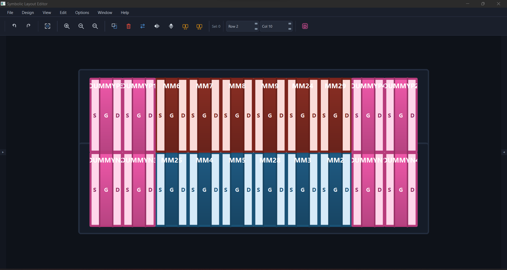

# AI-Based Analog Layout Automation

> Symbolic analog layout editor with AI-assisted placement for PMOS/NMOS device-level floorplanning.




---

## Quick Start

```bash
# 1. Clone the repository
git clone https://github.com/orabi55/AI-Based-Analog-Layout-Automation.git
cd AI-Based-Analog-Layout-Automation

# 2. Create a virtual environment
python -m venv .venv
# Windows
.venv\Scripts\activate
# macOS / Linux
source .venv/bin/activate

# 3. Install dependencies
pip install -r requirements.txt

# 4. Configure API keys
copy .env.example .env        # Windows
# cp .env.example .env        # macOS / Linux
# Then edit .env and paste your API keys

# 5. Run the application
python symbolic_editor/main.py
```

Load an example placement directly:

```bash
python symbolic_editor/main.py examples/xor/Xor_initial_placement.json
```

> **📖 For a detailed walkthrough see [docs/USER_GUIDE.md](docs/USER_GUIDE.md)**

---

## Features

### Interactive Symbolic Canvas
- **Move, swap, delete, flip (H/V), merge (S-S / D-D), select-all** — full keyboard-driven editing.
- **Undo / Redo** with unlimited history.
- **Fit view** (`F`), zoom in/out/reset with mouse wheel or toolbar buttons.
- **Move mode** (`M`) — pick up a selected device and reposition it.
- **Middle-mouse pan** for scrolling the canvas.
- Row-based **abutted placement**: PMOS and NMOS devices pack edge-to-edge, sharing Source/Drain diffusion.
- **Horizontal flip** keeps text labels (S, G, D, device name) always readable — only geometry is mirrored.

### Dummy Device Placement
- Toggle dummy mode from the toolbar (`D` key).
- **Live ghost preview** follows the cursor at 55 % opacity showing exactly where the dummy will land.
- Click to place; the dummy snaps to the nearest free grid slot in the closest PMOS or NMOS row.
- Dummy devices are rendered with dedicated pink styling to distinguish them from active transistors.

### AI Chat Panel (Multi-Agent Pipeline)
- Built-in chat with **LLM cascade** (Gemini → Groq → OpenAI → DeepSeek → Ollama).
- **4-stage pipeline**: Topology Analysis → Placement → DRC Check → Routing Preview.
- AI can execute layout commands: swap, move, flip, merge, add dummy, delete, and more.
- Chat messages appear with timestamps; layout context is sent automatically.

### Keyboard Shortcuts
| Key | Action |
|-----|--------|
| `G` | Merge S-S (selected pair) |
| `Shift+G` | Merge D-D (selected pair) |
| `M` | Toggle move mode |
| `D` | Toggle dummy placement mode |
| `F` | Fit view |
| `Delete` | Delete selected devices |
| `Ctrl+A` | Select all |
| `Ctrl+Z` | Undo |
| `Ctrl+Y` | Redo |
| `Ctrl+S` | Save |
| `Ctrl+Shift+S` | Save As |
| `Ctrl+E` | Export |
| `Esc` | Cancel current mode / deselect |

### Dark Theme & Vector Icons
- Global dark palette (#0e1219 canvas, #111621 panels, #1a1f2b toolbar).
- Procedural QPainter vector icons — no external image files required.

---

## API Key Configuration

Copy the template and fill in your keys:

```bash
copy .env.example .env   # Windows
# cp .env.example .env   # macOS / Linux
```

At minimum, set **one** of these (Gemini recommended):

| Provider | Env Variable | Free Tier |
|----------|-------------|-----------|
| Google Gemini | `GEMINI_API_KEY` | ✅ [aistudio.google.com](https://aistudio.google.com) |
| Groq | `GROQ_API_KEY` | ✅ [console.groq.com](https://console.groq.com) |
| OpenAI | `OPENAI_API_KEY` | ❌ Paid |
| DeepSeek | `DEEPSEEK_API_KEY` | ❌ Paid |

---

## Project Structure

```
AI-Based-Analog-Layout-Automation/
│
├── symbolic_editor/        # PySide6 GUI application
│   ├── main.py             #   Main window, toolbar, menus, commands
│   ├── editor_view.py      #   QGraphicsView canvas
│   ├── device_item.py      #   QGraphicsRectItem for each transistor
│   ├── device_tree.py      #   Device Hierarchy side panel
│   ├── chat_panel.py       #   AI Chat side panel
│   ├── klayout_panel.py    #   KLayout integration panel
│   └── icons.py            #   Procedural vector icons
│
├── ai_agent/               # Multi-agent AI system
│   ├── orchestrator.py     #   4-stage pipeline controller
│   ├── llm_worker.py       #   LLM API worker (Qt thread)
│   ├── topology_analyst.py #   Stage 1 — circuit constraint extraction
│   ├── placement_specialist.py # Stage 2 — device placement
│   ├── drc_critic.py       #   Stage 3 — DRC violation checker
│   ├── routing_previewer.py#   Stage 4 — routing cost optimizer
│   ├── pipeline_optimizer.py#  Deterministic placement optimizer
│   ├── classifier_agent.py #   User intent classifier
│   ├── strategy_selector.py#   Placement strategy selection
│   ├── analog_kb.py        #   Analog layout knowledge base
│   ├── rag_store.py        #   RAG vector store
│   ├── rag_indexer.py      #   RAG example indexer
│   └── rag_retriever.py    #   RAG example retriever
│
├── parser/                 # Netlist & layout file readers
│   ├── netlist_reader.py   #   SPICE netlist parser
│   ├── layout_reader.py    #   OASIS/GDS layout parser
│   ├── circuit_graph.py    #   Circuit graph builder
│   └── device_matcher.py   #   Layout ↔ schematic matching
│
├── export/                 # Output file generators
│   ├── export_json.py      #   JSON placement export
│   ├── oas_writer.py       #   OASIS file writer
│   └── klayout_renderer.py #   KLayout rendering
│
├── examples/               # Example circuits (ready to load)
│   ├── comparator/         #   Comparator circuit
│   ├── xor/                #   XOR gate
│   └── std_cell/           #   Standard cell
│
├── tests/                  # Test suite
├── netlists/               # Additional SPICE netlists
├── scripts/                # Utility scripts
├── logs/                   # Runtime logs
├── images/                 # Screenshots for documentation
├── docs/                   # User documentation
│   └── USER_GUIDE.md       #   Comprehensive user guide
│
├── .env.example            # API key template
├── requirements.txt        # Python dependencies
└── README.md               # This file
```

---

## License

This project is developed as part of an academic senior design project.
