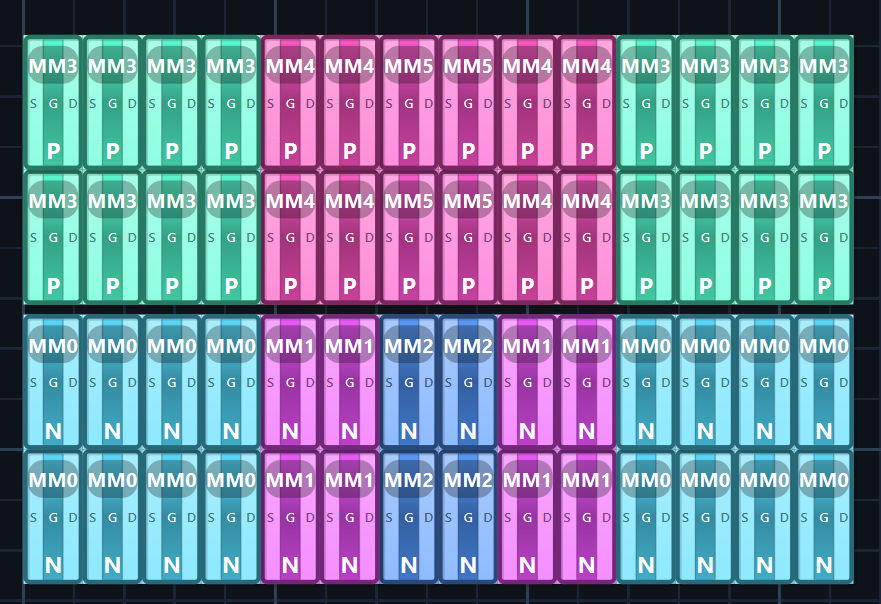
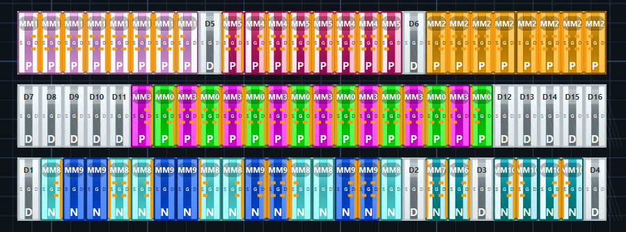

# AI-Based Analog Layout Automation

[](https://www.python.org/downloads/)
[](#)

A state-of-the-art symbolic analog layout editor and automation framework. This project leverages a **LangGraph-driven multi-agent pipeline** to transform circuit netlists into production-ready, DRC-clean analog layouts through LLM-assisted placement and deterministic geometric expansion.


---

## 🚀 Overview

Analog layout has traditionally been a manual, time-consuming process requiring deep expertise in matching, parasitic management, and design rules. This platform bridges the gap between high-level schematic intent and physical geometry by using **LLMs (Large Language Models)** as strategic floorplanners and **Deterministic Geometric Engines** as physical executors.

### Core Innovation: The Decoupled Pipeline
Unlike naive AI approaches that attempt to "draw" layout pixels, our system uses a structured approach:
1. **Strategic Reasoning**: Specialized agents analyze topology (e.g., Identifying Differential Pairs).
2. **Logical Placement**: The LLM generates high-level placement commands (`MOVE`, `ALIGN`).
3. **Physical Expansion**: A pure-Python engine expands logical blocks into precise, PDK-compliant transistor fingers and source/drain abutments.

---

## 🖼️ Layout Examples & Case Studies

The AI agent is trained to handle complex analog topologies, ensuring high-quality matching and area efficiency.

### 1. NMOS Current Mirror (Symmetric Matching)
The system identifies the reference and mirror branches, automatically applying common-centroid or interdigitated patterns to minimize mismatch.


### 2. High-Speed Comparator (Differential Pair Optimization)
For comparators, the pipeline prioritizes the input differential pair, ensuring perfectly symmetric parasitic environments and minimal cross-coupling.


---

## 🧠 Detailed AI Pipeline

The system operates as a **Multi-Agent State Machine** (LangGraph), where each node specializes in a specific aspect of the layout lifecycle:

| Stage | Responsibility | Output |
| :--- | :--- | :--- |
| **Topology Analyst** | Structural netlist decomposition. | Identified Diff-Pairs, Mirrors, Cascodes. |
| **Strategy Selector** | Floorplan planning & Row assignment. | Logic-to-Row mapping, Symmetry axes. |
| **Placement Specialist** | Coordinate generation (Logical). | `[CMD]` blocks (MOVE, ALIGN, FLIP). |
| **Finger Expansion** | Physical geometry calculation. | Precise micron-level finger coordinates. |
| **Routing Previewer** | Connectivity & routability scoring. | Wirelength (HPWL) and crossing estimates. |
| **DRC Critic** | Overlap & spacing verification. | Violation reports & auto-fix instructions. |

---

## ✨ Key Features & Mathematical Optimization

### 📐 Area & Parasitic Optimization
- **Source/Drain Abutment**: Automatically identifies shared nets between adjacent transistors and snaps them together (at 0.070µm pitch) to significantly reduce parasitic capacitance and area.
- **Simulated Annealing**: Post-placement intra-row optimization to minimize Half-Perimeter Wirelength (HPWL).

### 🤖 Intelligent Layout Assistance
- **Self-Healing DRC**: If the LLM places two devices too close, the **DRC Critic** calculates the exact `dx/dy` shift required and forces a correction in the next turn.
- **Skill-Based Prompting**: Injecting expert layout "recipes" (e.g., ABBA matching for diff-pairs) into the LLM context only when relevant to the current circuit.

### 🎨 Professional Symbolic UI
- **Live Dummy Previews**: High-opacity "ghost" previews for dummy placement to ensure perfect alignment before clicking.
- **Isolated Tabs**: Work on multiple circuit blocks simultaneously; each tab has its own independent AI context and undo history.
- **Real-Time Minimap**: Scalable navigation for large-scale analog blocks.

---

## 🚦 Quick Start

### 1. Installation
```bash
# Clone the repository
git clone https://github.com/orabi55/AI-Based-Analog-Layout-Automation.git
cd AI-Based-Analog-Layout-Automation

# Setup environment
python -m venv .venv
source .venv/bin/activate  # Or .venv\Scripts\activate on Windows

# Install dependencies
pip install -r requirements.txt
```

### 2. Configuration
Copy the `.env.example` to `.env` and add your API keys (Gemini is recommended for best results).
```bash
cp .env.example .env
```

### 3. Launching the Editor
```bash
python symbolic_editor/main.py
```

---

## ⌨️ Global Shortcuts

| Key | Action |
|-----|--------|
| `Ctrl+I` | Import Netlist/Layout |
| `Ctrl+P` | **Run AI Initial Placement** |
| `Ctrl+S` | Save Progress |
| `Ctrl+Shift+E`| Export to OASIS |
| `M` | Toggle Move Mode |
| `D` | Toggle Dummy Mode |
| `F` | Fit View to Canvas |
| `G` / `Shift+G`| Merge S-S / D-D (Abutment) |

---

## 🏗️ Project Structure & Documentation

- **`ai_agent/`**: The "Brain" (LangGraph, Agents, Placement logic). See **[ai_agent.md](ai_agent.md)**.
- **`symbolic_editor/`**: The "Body" (PySide6 GUI, Canvas, Interactive tools).
- **`parser/`**: The "Eyes" (SPICE and OASIS parsing engines).
- **`docs/`**: Detailed documentation:
    - **[USER_GUIDE.md](docs/USER_GUIDE.md)**: Standard operating procedures.
    - **[SYMBOLIC_HIERARCHY.md](docs/SYMBOLIC_HIERARCHY.md)**: Data structure deep-dive.

---

## 🎓 Academic Credit

This project was developed as an academic senior design project focused on the intersection of Machine Learning and Electronic Design Automation (EDA).

---
© 2026 AI-Based Analog Layout Automation Team
