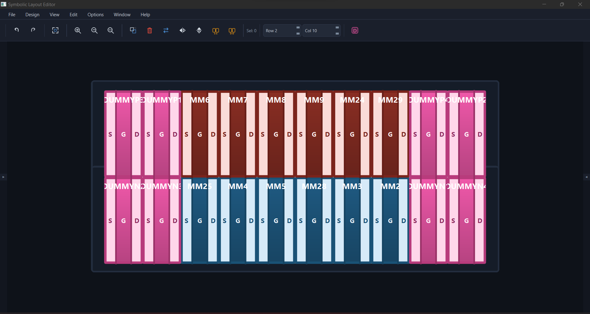
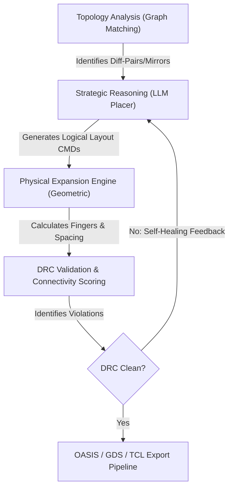
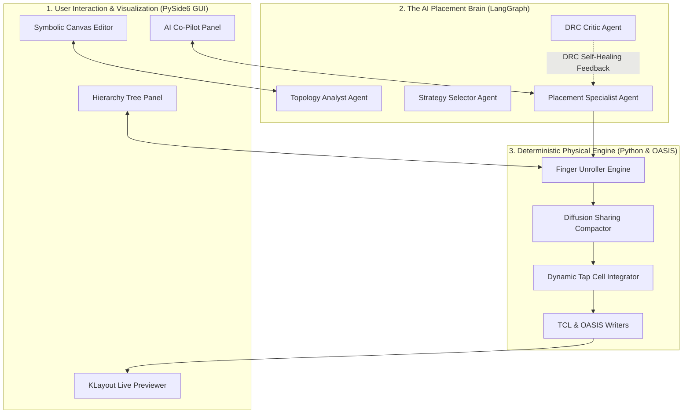
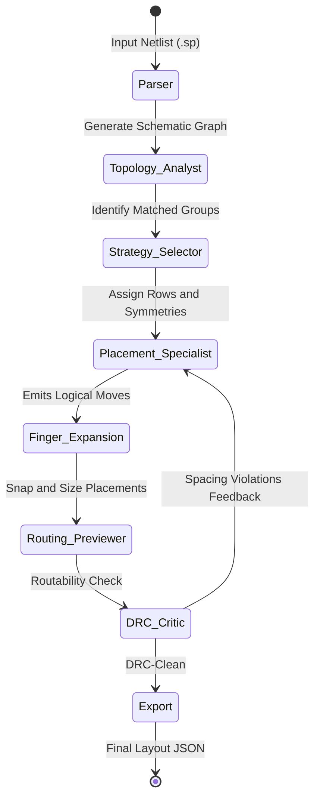

# AI-Based Analog Layout Automation

[](https://www.python.org/downloads/)
[](#)

A state-of-the-art symbolic analog layout editor and automation framework. This project leverages a **LangGraph-driven multi-agent pipeline** to transform circuit netlists into production-ready, DRC-clean analog layouts through LLM-assisted placement and deterministic geometric expansion.



---

## 🚀 Overview

Analog layout has traditionally been a manual, time-consuming process requiring deep expertise in matching, parasitic management, and design rules. This platform bridges the gap between high-level schematic intent and physical geometry by using **LLMs (Large Language Models)** as strategic floorplanners and **Deterministic Geometric Engines** as physical executors.

### Core Innovation: The Decoupled Pipeline
Unlike naive AI approaches that attempt to "draw" layout pixels, our system uses a structured, decoupled architecture:


```mermaid
graph TD
    A["Topology Analysis (Graph Matching)"] -->|Identifies Diff-Pairs/Mirrors| B["Strategic Reasoning (LLM Placer)"]
    B -->|Generates Logical Layout CMDs| C["Physical Expansion Engine (Geometric)"]
    C -->|Calculates Fingers & Spacing| D["DRC Validation & Connectivity Scoring"]
    D -->|Identifies Violations| E{"DRC Clean?"}
    E -->|No: Self-Healing Feedback| B
    E -->|Yes| F["OASIS / GDS / TCL Export Pipeline"]
```

---

## 🏗️ System Architecture

Our platform decouples high-level strategic reasoning from precise, sub-micron physical coordinates. This architecture is split into three main layers:


```mermaid
graph TB
    subgraph "1. User Interaction & Visualization (PySide6 GUI)"
        UI["Symbolic Canvas Editor"]
        TREE["Hierarchy Tree Panel"]
        CHAT["AI Co-Pilot Panel"]
        LIVE["KLayout Live Previewer"]
    end

    subgraph "2. The AI Placement Brain (LangGraph)"
        ANALYST["Topology Analyst Agent"]
        SELECTOR["Strategy Selector Agent"]
        SPECIALIST["Placement Specialist Agent"]
        CRITIC["DRC Critic Agent"]
    end

    subgraph "3. Deterministic Physical Engine (Python & OASIS)"
        EXPANDER["Finger Unroller Engine"]
        COMPACTOR["Diffusion Sharing Compactor"]
        TAP_GEN["Dynamic Tap Cell Integrator"]
        EXPORTER["TCL & OASIS Writers"]
    end

    UI <--> ANALYST
    TREE <--> EXPANDER
    CHAT <--> SPECIALIST
    SPECIALIST --> EXPANDER
    EXPANDER --> COMPACTOR
    COMPACTOR --> TAP_GEN
    TAP_GEN --> EXPORTER
    EXPORTER --> LIVE
    CRITIC -.->|DRC Self-Healing Feedback| SPECIALIST
```

---

## 🧠 Detailed AI Agent Pipeline (LangGraph)

The system operates as a **Multi-Agent State Machine** built on LangGraph, where each node specializes in a specific aspect of the layout lifecycle:


```mermaid
stateDiagram-v2
    [*] --> Parser : Input Netlist (.sp)
    Parser --> Topology_Analyst : Generate Schematic Graph
    Topology_Analyst --> Strategy_Selector : Identify Matched Groups
    Strategy_Selector --> Placement_Specialist : Assign Rows and Symmetries
    Placement_Specialist --> Finger_Expansion : Emits Logical Moves
    Finger_Expansion --> Routing_Previewer : Snap and Size Placements
    Routing_Previewer --> DRC_Critic : Routability Check
    DRC_Critic --> Placement_Specialist : Spacing Violations Feedback
    DRC_Critic --> Export : DRC-Clean
    Export --> [*] : Final Layout JSON
```

### LangGraph Agent Roles & Responsibilities

| Stage | Responsibility | Detailed Output |
| :--- | :--- | :--- |
| **Topology Analyst** | Structural netlist decomposition via subgraph isomorphism. | Identified Differential Pairs, Current Mirrors, Cascodes. |
| **Strategy Selector** | Floorplan planning, Multiplier unrolling & Row assignment. | Logic-to-Row mapping, Symmetry axes, Group boundaries. |
| **Placement Specialist** | Coordinate generation (Logical). | `[CMD]` blocks (`MOVE`, `ALIGN`, `FLIP`). |
| **Finger Expansion** | Physical geometry unrolling, grid snapping & diffusion sharing. | Precise micron-level finger coordinates and abutments. |
| **Routing Previewer** | Connectivity & HPWL routability scoring. | Wirelength and parasitic estimates. |
| **DRC Critic** | Overlap & spacing verification. | Violation reports & auto-fix instructions. |

---

## 📐 Mathematical Placement & Geometric Compaction

### 1. Transistor Finger Expansion (Unrolling)
When a device has multi-finger parameters (`nf > 1`), the system unrolls it into independent physical fingers. The width of each finger is calculated as:
$$W_{\text{finger}} = \frac{W_{\text{device}}}{n_f}$$

### 2. Diffusion-Sharing Compactor (Touch-Abutment)
Standard symbolic layouts are placed on a loose $0.3\,\mu\text{m}$ grid to remain highly readable. During export, the physical engine compresses touching source/drain diffusion regions down to **$0.070\,\mu\text{m}$** (touch-abutment pitch), reducing parasitic diffusion capacitance ($C_{db}$, $C_{sb}$) by up to **$75\%$** and layout area by up to **$40\%$**.

| Layout Mode | Gate Width | Gap / Pitch | Total 2-Transistor Span | Area vs. Loose |
|:---|:---|:---|:---|:---|
| **Loose Symbolic Grid** | 0.140 µm × 2 | 0.294 µm pitch per slot | ~0.588 µm | 100% (baseline) |
| **Compact Abutted (Export)** | 0.140 µm × 2 | 0.070 µm touch-abutment | ~0.350 µm | **~60%** |

> **Result:** Touch-abutment compaction reduces layout span by ~40% and cuts diffusion parasitic capacitance ($C_{db}$, $C_{sb}$) by up to **75%**.

### 3. Suppressed Boundary Dummy Padding
During initial placement, dummy padding can be enabled or suppressed (`DISABLE_FILLER_DUMMIES=1`) to optimize editor canvas rendering performance:
* **Suppressed Mode (Default):** Generates only critical internal *bridge dummies* (to resolve grid alignments inside individual rows) to keep layout navigation extremely fast.
* **Full Padding Mode:** Pads row ends with filler dummies to force the block into a perfect rectangle.

---

## 🎨 Professional GUI Features & Aesthetics

* **harmonious Sleek Dark Mode:** Built using HSL tailored dark-mode tokens, vibrantly highlighting active transistor terminals, symmetry lines, and abutment pins.
* **Interactive Co-Pilot:** Real-time chat panel displaying LLM placement suggestions and pipeline reports.
* **Live Layout Preview:** Integrated panel running KLayout in a background thread to render sub-micron live placements on the fly.
* **Isolated Undo Contexts:** Multi-tab layout configuration; each tab holds its own independent AI context, command buffer, and undo histories.

---

## 🚦 Quick Start

### 1. Installation
```bash
# Clone the repository
git clone https://github.com/orabi55/AI-Based-Analog-Layout-Automation.git
cd AI-Based-Analog-Layout-Automation

# Setup environment
python -m venv .venv
source .venv/bin/activate  # Or .venv\Scripts\activate on Windows

# Install dependencies
pip install -r requirements.txt
```

### 2. Configuration
Copy the `.env.example` to `.env` and add your API keys (Gemini is recommended for best results).
```bash
cp .env.example .env
```

### 3. Launching the Editor
```bash
python symbolic_editor/main.py
```

---

## ⌨️ Global Shortcuts

| Key | Action | Tool Description |
| :--- | :--- | :--- |
| `Ctrl+I` | **Import Netlist/Layout** | Import SPICE (`.sp`) or OASIS (`.oas`) design files. |
| `Ctrl+P` | **Run AI Initial Placement** | Trigger the LangGraph multi-agent placement engine. |
| `Ctrl+S` | **Save Progress** | Save the current symbolic configuration to JSON. |
| `Ctrl+Shift+E` | **Export to OASIS** | Write physical geometry directly to an OASIS layout stream. |
| `Ctrl+Z` / `Ctrl+Y` | **Undo / Redo** | Natively step back and forth in the editing command stack. |
| `M` | **Move Mode** | Drag-and-drop active layout blocks with grid snapping. |
| `D` | **Dummy Mode** | Place dummy transistors on selected rows. |
| `V` / `G` | **Tap Placement** | Lock cursor to place VDD (`Ntap`) or GND (`Ptap`) boundary cells. |
| `F` | **Fit View** | Automatically scale and center the canvas to display all items. |

---

## 🏗️ Project Structure

* **`ai_agent/`**: The Placement Brain (LangGraph, agent personas, prompts). See **[ai_agent.md](ai_agent.md)**.
* **`symbolic_editor/`**: The GUI & Canvas Editor (PySide6 widgets, graphics view, render items).
* **`parser/`**: The Design Reader (SPICE topological parsers and OASIS layout parsers).
* **`export/`**: Stream Writers (OASIS binary compiler and GDS-like layout assembly engines).
* **`eda/`**: EDA Integrations (OpenAccess Tcl radar synchronizers and Live watchdogs).

---

## 🎓 Academic Credit

This project was developed as an academic senior design project focused on the intersection of Machine Learning, Geometric Compaction, and Electronic Design Automation (EDA).

---
© 2026 AI-Based Analog Layout Automation Team

