# AI-Based Analog Layout Automation

[](https://www.python.org/downloads/)
[](#)

A state-of-the-art symbolic analog layout editor and automation framework. This project leverages a **LangGraph-driven multi-agent pipeline** to transform circuit netlists into production-ready, DRC-clean analog layouts through LLM-assisted placement and deterministic geometric expansion.

---

## 1. System Architecture

Our platform decouples high-level strategic reasoning from precise, sub-micron physical coordinates. This architecture is split into three main layers:

* **User Interaction & Visualization (PySide6 GUI)**: Symbolic Canvas Editor, Hierarchy Tree Panel, and KLayout Live Previewer.
* **The AI Placement Brain (LangGraph)**: Cooperative agents orchestrating logical floorplans.
* **Deterministic Physical Engine (Python & OASIS)**: Multi-finger expansion, Viterbi DP diffusion compactor, tap infilling, and stream writers.

Below is the comprehensive system-level block diagram illustrating the unified data-flow across all layers, from SPICE netlist parsing to final binary OASIS/GDS and OpenAccess database injections:


---

## 2. Stage One: EDA Interface (Inputs)

The input stage acts as the **"eyes"** of the system, loading circuit schematics and physical PDK constraints to construct a unified design representation:

* **SPICE Netlist Parsing**: Instantiates circuit graphs by parsing `.sp` spice files. It extracts subcircuits, net names, and transistor models.
* **PDK Cell Bounding Box Queries**: Ingests template `.oas` layout cells using `gdstk` to calculate physical width/height boundaries in micrometers.
* **Unification Compiler**: Maps logical device terminals (Gate, Source, Drain, Bulk) to cell-level port pins.
* **Integrated Layout JSON**: Outputs a unified design JSON containing logical netlists and physical coordinates to initialize the Symbolic Canvas.


---

## 3. Stage Two: AI Initial Placement

The strategic placement is managed by a **Multi-Agent State Machine** built on LangGraph. This pipeline choreographs high-level floorplanning and self-heals collisions:


### 🤖 Multi-Agent Choreography & Prompt Engineering

Below are the detailed models, prompt strategies, and features of each agent:

#### A. Topology Analyst Agent
* **Model Used**: `gemini-2.5-flash` / `qwen-plus` (Light task weight)
* **Prompt Strategy**: Identifies symmetric match groups (e.g. differential pairs, current mirrors, bias chains) via subgraph isomorphism.
* **Features**: Graph match pattern discovery; maps transistor terminal matches.
* **Limitations**: Relies on structured device structures; highly custom analog topologies require manual tagging.

#### B. Strategy Selector Agent
* **Model Used**: `gemini-2.5-pro` / `claude-3-5-sonnet-v2@20241022` (Heavy task weight)
* **Prompt Strategy**: Analyzes matched groups, unrolls multipliers, assigns device groups to rows, and schedules vertical/horizontal symmetry axes.
* **Features**: Partitioning heuristics; thermal gradient balancing.
* **Limitations**: Multi-row planning uses coarse geometric aspect ratios.

#### C. Placement Specialist Agent
* **Model Used**: `gemini-2.5-pro` / `claude-3-5-sonnet-v2@20241022` (Heavy task weight)
* **Prompt Strategy**: Formulates logical floorplan coordinate instructions using relative positioning commands (`MOVE`, `ALIGN`, `FLIP`).
* **Features**: **Device Inventory Conservation** (validates that no devices are duplicated or dropped); skill injection middleware.
* **Limitations**: Operates on symbolic slot indexes; lacks physical sub-micron spacing metrics.

#### D. Deterministic Finger Expansion Engine
* **Model Used**: Pure-Python (No LLM)
* **Algorithm**: Unrolls devices into fingers ($W_{\text{finger}} = W_{\text{device}}/n_f$). Resolves phase alternation and computes optimal dummy placement.
* **Viterbi DP Compactor**: Uses an **$O(N)$ Viterbi Dynamic Programming Solver** to find the mathematically optimal finger flip orientation to maximize diffusion sharing (abutment), reducing parasitics by up to $75\%$.

#### E. Routing Previewer
* **Model Used**: Pure-Python (No LLM)
* **Algorithm**: Calculates Half-Perimeter Wire Length (HPWL) and net crossing complexity to output a normalized routability score.

#### F. DRC Critic Agent
* **Model Used**: `gemini-2.5-flash` / `qwen-plus` (Light task weight)
* **Prompt Strategy**: Sweeps expanded coordinates for bounding-box overlaps or spacing violations. Injects correction updates back to the Placement Specialist for self-healing retries (capped at 2).
* **Features**: Sweep-line geometric collision detection; automated correction delta generation.
* **Limitations**: Simple bounding-box clearance validation; does not parse complex process-specific DRC deck files.

---

## 4. Chatbot & GUI Visualization

### 🖼️ GUI Welcome Screen & Panels
Upon launch, designers are greeted with the **GUI Welcome Screen**, allowing them to select target SPICE designs and select AI models:

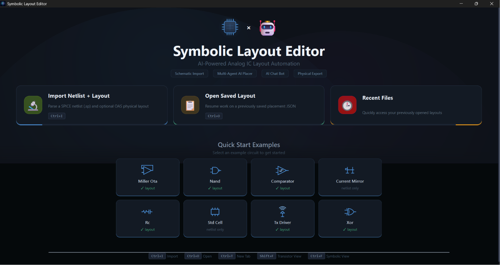

Once loaded, the **Symbolic Canvas Editor** provides visual tabs, design hierarchies, and a real-time ratsnest view:


---

### 💬 Interactive Chatbot Co-Pilot Features & Limitations

The AI Chatbot Co-Pilot allows designers to refine layouts in real-time using natural language:


#### 🚀 Features
* **Intent Classification**: In [classifier.py](file:///d:/Senior%202/Layout_Project/Automation/new_main_last_dance/AI-Based-Analog-Layout-Automation/ai_agent/agents/classifier.py), splits requests into `"general_chat"` (context-free) and `"layout_query"` (context-rich).
* **Conversational Fast Path**: If `"general_chat"` is active (e.g. *"Explain what a cascode mirror is"*), it bypasses layout serialization and tool-binding, streaming replies in **under 1 second** and saving **>90%** of token costs.
* **Interactive Editing**: Natural language commands (e.g. *"Align MM1 and MM2 vertically"*) are parsed into strict XML commands and committed directly to the GUI undo/redo stack.

#### ⚠️ Limitations
* Conversational fast-path cannot query device details unless the user shifts topics back to a layout query.
* Free-form placement updates are limited by the precision of the LLM's XML command generator.

---

## 5. EDA Interface (Outputs)

The output engine translates symbolic designs into production-ready physical structures:

* **TCL Coordinate Injection**: Writes space-separated coordinates for OpenAccess-resident tools.
* **Headless OASIS Compiler**: In [oas_writer.py](file:///d:/Senior%202/Layout_Project/Automation/new_main_last_dance/AI-Based-Analog-Layout-Automation/export/oas_writer.py), compiles physical cells, abutment pitches, and infills tap cells from `tests/taps.oas` directly into binary `.oas` streams.


---

## 6. Examples

Below are three representative circuit implementations comparing logical schematics, unoptimized initial placements, and fully optimized, compacted layouts.

---

### 🧩 A. XOR Gate (Digital cell placed in Analog Framework)
Demonstrates the unrolling and optimization of a standard 12-transistor digital XOR cell. The AI placement engine balances the PMOS and NMOS clusters and centers them to minimize routing crossings.

| 1. AI Generated Schematic Graph | 2. Before AI Placement (Unoptimized) |
| :---: | :---: |
| 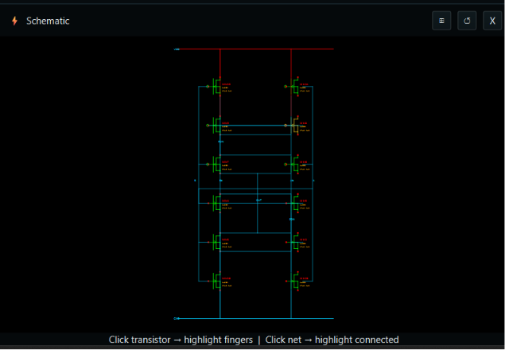 | 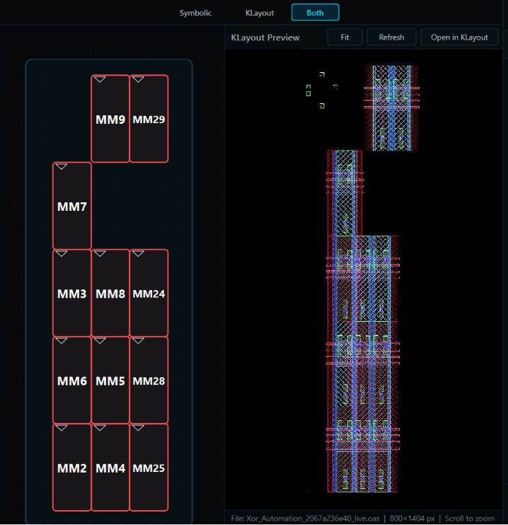 |

| 3. Symbolic Canvas Layout | 4. Transistor-Level Placement | 5. Final OASIS Layout View |
| :---: | :---: | :---: |
| 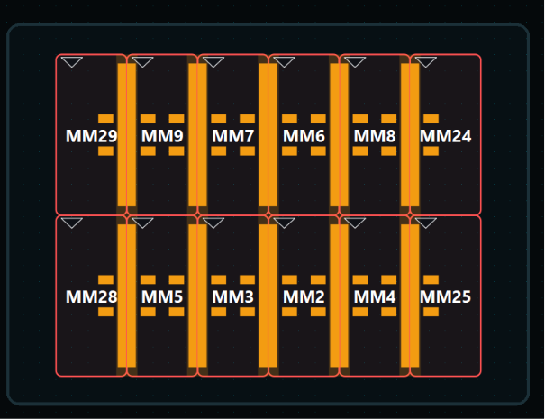 | 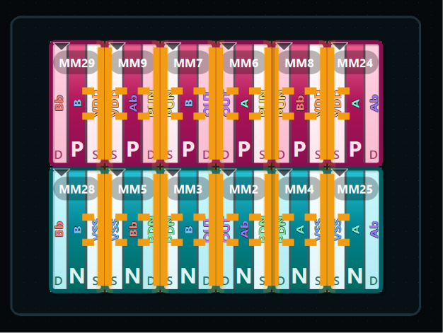 | 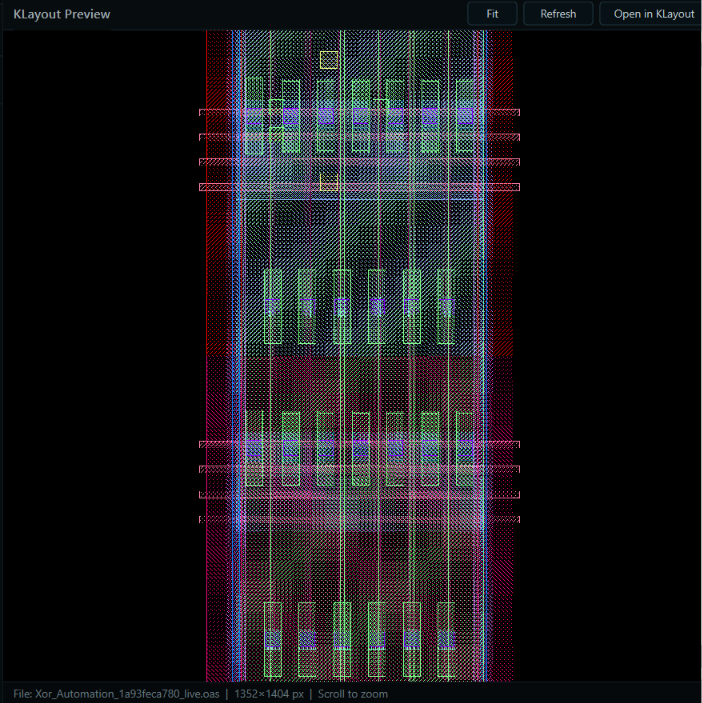 |

---

### 🧩 B. High-Performance Current Mirror
Shows active matched rows aligned with alternating source/drain terminals and grid-aligned dummies to guarantee uniform spatial gradients.

| 1. Before AI Placement (Unoptimized) | 2. Symbolic Canvas Layout |
| :---: | :---: |
|  | 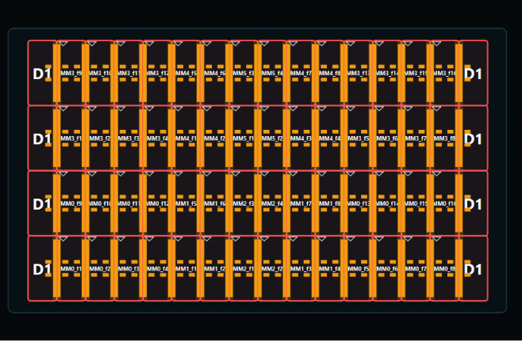 |

| 3. Transistor-Level Placement | 4. Transistor-Level (Colored Nodes) |
| :---: | :---: |
| 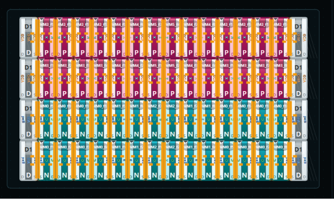 | 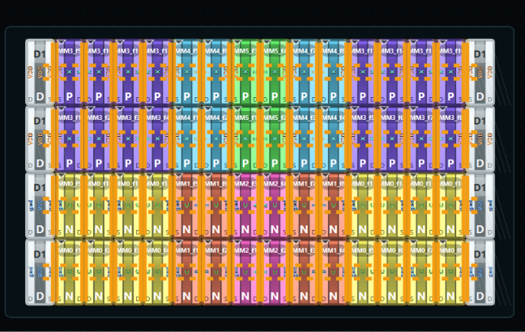 |

| 5. KLayout Physical View | 6. Synopsys Custom Compiler View |
| :---: | :---: |
|  | 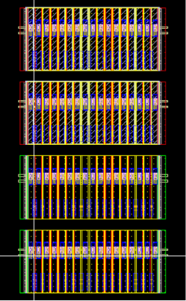 |

---

### 🧩 C. Differential Pair (Comparator Block)
Displays the input stage of a dynamic comparator. The AI placement specialist and symmetry enforcer interleave active devices and center them symmetrically with outer balanced dummy pads to eliminate thermal and process gradients.

| 1. AI Generated Schematic Graph | 2. Before AI Placement (Unoptimized) | 3. Final Symmetric Compacted Layout |
| :---: | :---: | :---: |
| 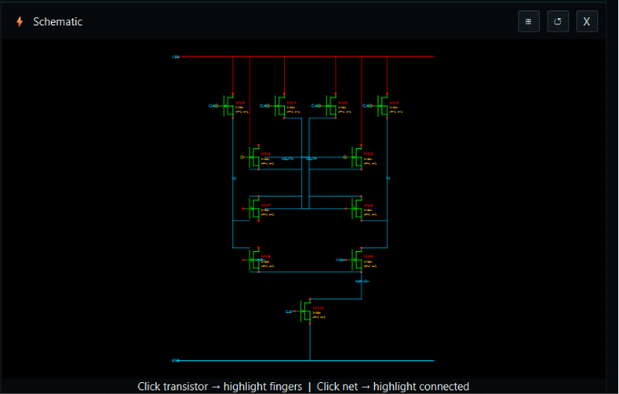 |  | 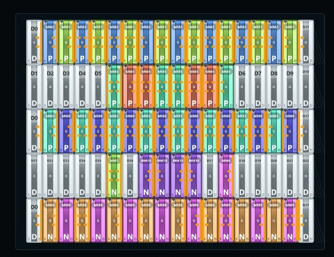 |

---

## 7. Installation and Setup

Follow these steps to clone the repository, install the required dependencies, and launch the application:

### Step 1: Clone the Repository
Open a terminal and clone the repository using Git:
```bash
git clone https://github.com/orabi55/AI-Based-Analog-Layout-Automation.git
cd AI-Based-Analog-Layout-Automation
```

### Step 2: Set Up a Virtual Environment
Create and activate a Python virtual environment to manage dependencies locally:
* **On Windows (PowerShell)**:
  ```powershell
  python -m venv .venv
  .venv\Scripts\Activate.ps1
  ```
* **On macOS / Linux**:
  ```bash
  python -m venv .venv
  source .venv/bin/activate
  ```

### Step 3: Install Required Dependencies
Install the package requirements listed in `requirements.txt` via `pip`:
```bash
pip install -r requirements.txt
```

### Step 4: Configure API Keys
Copy the example environment file to `.env` and fill in your LLM API keys:
* **On Windows**:
  ```powershell
  copy .env.example .env
  ```
* **On macOS / Linux**:
  ```bash
  cp .env.example .env
  ```
Open the `.env` file and insert your API credentials (Gemini is recommended for free, high-performance execution):
```env
GEMINI_API_KEY=your_gemini_api_key_here
```

### Step 5: Launch the Application
Run the main symbolic editor script to open the graphical welcome dialog:
```bash
python symbolic_editor/main.py
```

---

## 8. Operational Workflow (How to Use the Tool)

Operating the layout editor is simple and follows a standard EDA front-to-back workflow. Below is a detailed description of each phase in the design loop:

### Phase 1: Setup & Import
1. **Launch the Editor**: Start the application using:
   ```bash
   python symbolic_editor/main.py
   ```
2. **Import design files**: Press `Ctrl+I` (or go to `File > Import from Netlist + Layout`).
   * Select a **SPICE Netlist file (`.sp`)** containing your transistor subcircuits.
   * Select a **Template OASIS Layout file (`.oas`)** containing your physical PDK cell templates.
3. The editor automatically parses the spice subcircuit, calculates cell bounding boxes, maps Gate/Source/Drain terminals, and displays unplaced logical transistor blocks on the left **Hierarchy Tree Panel**.

### Phase 2: AI-Assisted Initial Placement
1. **Run AI Floorplanning**: Press `Ctrl+P` (or go to `Design > Run AI Initial Placement`).
2. An **AI Settings Dialog** will open:
   * **Select AI Model**: Choose from the dropdown (Google Gemini, Alibaba Qwen, etc.).
   * **Toggle Abutment**: Check/uncheck to enable/disable touch-abutment compaction.
3. Click **Proceed**. The LangGraph multi-agent pipeline starts in a background thread:
   * The **Topology Analyst** matches differential pairs/mirrors.
   * The **Strategy Selector** assigns rows and symmetry axes.
   * The **Placement Specialist** calculates slot coordinates.
   * The **DRC Critic** automatically repairs placement overlaps.
4. Once completed, the final layout snaps onto the **Symbolic Canvas** with connection ratsnest lines showing signal nets.

### Phase 3: Interactive Visual Editing
Designers can manually refine the AI-generated layout using standard keyboard and mouse controls on the symbolic canvas:
* **Move Mode (`M` key)**: Select a transistor block and drag it left or right. It automatically snaps to the symbolic coordinate grid slot.
* **Gate / Net Swapping**: Double-click (or right-click) on any active transistor to toggle its `swapped_sd` flag. This swaps its Source and Drain terminals, optimizing local diffusion sharing.
* **Place Dummy Transistors (`D` key)**: Select an empty slot in a row and press `D` to place a dummy cell. Dummy cells can be merged with active transistors to isolate signal boundaries.
* **Tap Cell Integration**: Use shortcut keys `V` and `G` to place VDD (N-well tap) and GND (substrate tap) cell boundaries.
* **Canvas Focus (`F` key)**: Press `F` to center and scale the view to fit all placed components.

### Phase 4: Chatbot Co-Pilot Dialogue
Use the right-side **AI Co-Pilot Chat Panel** to interact with the strategist:
* Ask **General questions**: Type *"What is a common-centroid matching pattern?"*. The classifier selects `"general_chat"`, bypassing layout data to stream answers in under 1 second.
* Ask **Layout queries**: Type *"Are MM1 and MM2 sharing source diffusions?"*. The classifier selects `"layout_query"`, injecting the device properties to answer.
* Execute **Layout actions**: Type *"Align MM1 and MM2 on Row 1"*. The chatbot compiles this to `[CMD] ALIGN MM1 MM2 row=1 [/CMD]`, updating the canvas.

### Phase 5: Compaction & Physical Export
1. **Compile layout**: Press `Ctrl+Shift+E` (or go to `File > Export to OASIS`).
2. The physical compiler performs touch-abutment compaction, compressing symbolic $0.3\,\mu\text{m}$ spacings down to PDK-minimum $0.070\,\mu\text{m}$ pitch.
3. The engine recursively infills tap cells, merges contiguous diffusions, and writes a physical `.oas` layout binary stream.
4. **Live KLayout Sync**: The refresh is sent to a headless KLayout socket process to display the compiled sub-micron shapes in real-time.

---

## 9. Conclusion and Future Work

### 🏁 Conclusion
The AI-Based Analog Layout Automation platform successfully bridges schematic topologies and physical layout geometries. By combining **LangGraph multi-agent strategic floorplanning** with a **deterministic physical engine**, the platform eliminates manual layout bottlenecks, enforces matching symmetries, and automatically self-heals design rule violations.

### 🔮 Future Work
1. **Detailed Dynamic Routing**: Expand ratsnest scoring to direct, router-level wire synthesis.
2. **Multi-layer DRC Integration**: Connect with industrial DRC decks (like Calibre) for verification.
3. **Advanced RAG Sharing**: Sync local Chroma vector stores to central cloud database systems.

---

## 10. Acknowledgements

This project was developed as an academic senior design project focused on the intersection of Machine Learning, Geometric Compaction, and Electronic Design Automation (EDA).

This work was successfully completed through a collaborative partnership between:
* **ASU (Ain Shams University)**
* **Cairo University**
* **Si-Vision Company**

---

© 2026 AI-Based Analog Layout Automation Team
