# AI-Based Analog Layout Automation

[](https://www.python.org/downloads/)
[](#)

A state-of-the-art symbolic analog layout editor and automation framework. This project leverages a **LangGraph-driven multi-agent pipeline** to transform circuit netlists into production-ready, DRC-clean analog layouts through LLM-assisted placement and deterministic geometric expansion.

---

## 🚀 System Architecture

Our platform decouples high-level strategic reasoning from precise, sub-micron physical coordinates. This architecture is split into three main layers:

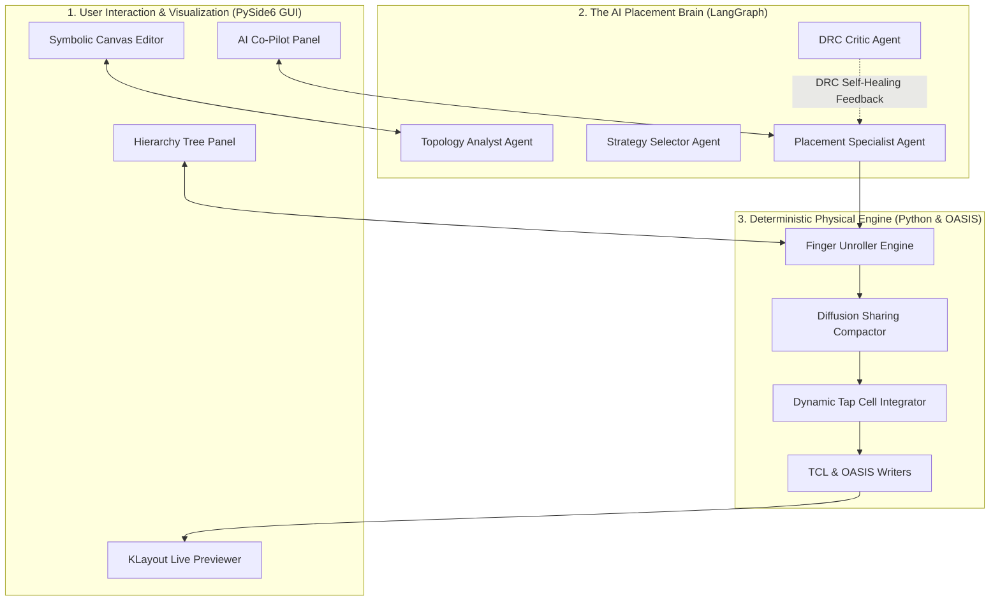
```mermaid
graph TB
    subgraph "1. User Interaction & Visualization (PySide6 GUI)"
        UI["Symbolic Canvas Editor"]
        TREE["Hierarchy Tree Panel"]
        CHAT["AI Co-Pilot Panel"]
        LIVE["KLayout Live Previewer"]
    end

    subgraph "2. The AI Placement Brain (LangGraph)"
        ANALYST["Topology Analyst Agent"]
        SELECTOR["Strategy Selector Agent"]
        SPECIALIST["Placement Specialist Agent"]
        CRITIC["DRC Critic Agent"]
    end

    subgraph "3. Deterministic Physical Engine (Python & OASIS)"
        EXPANDER["Finger Unroller Engine"]
        COMPACTOR["Diffusion Sharing Compactor"]
        TAP_GEN["Dynamic Tap Cell Integrator"]
        EXPORTER["TCL & OASIS Writers"]
    end

    UI <--> ANALYST
    TREE <--> EXPANDER
    CHAT <--> SPECIALIST
    SPECIALIST --> EXPANDER
    EXPANDER --> COMPACTOR
    COMPACTOR --> TAP_GEN
    TAP_GEN --> EXPORTER
    EXPORTER --> LIVE
    CRITIC -.->|DRC Self-Healing Feedback| SPECIALIST
```

### 🖼️ System Block Diagram Overview
Below is the comprehensive system-level block diagram illustrating the unified data-flow across all layers, from SPICE netlist parsing to final binary OASIS/GDS and OpenAccess database injections:

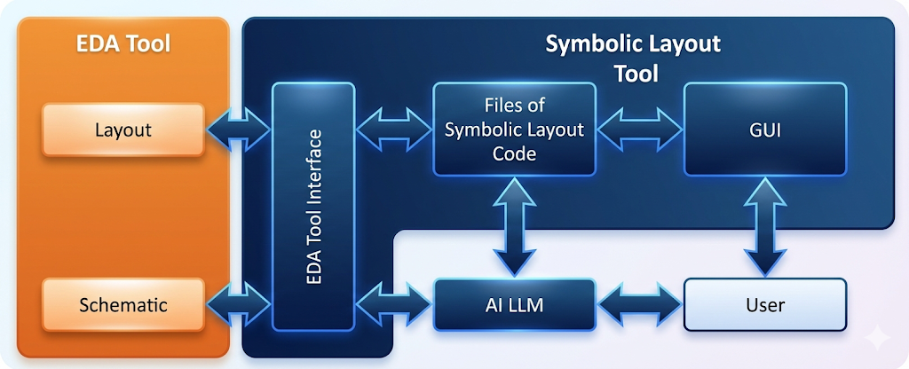

---

## 🛠️ Step-by-Step Pipeline Explanation

The entire analog layout automation pipeline is structured into discrete, sequential stages. Below is a detailed breakdown of each stage, including its **role**, **features**, **limitations**, **models used**, and **illustrative code snippets**.

---

### 📂 Stage 1: SPICE Netlist Parsing & Subgraph Extraction

#### 🔬 The Topology Analyst
* **Role**: Parses native SPICE netlists (`.sp`), builds an abstract topological graph, and matches structural subgraphs to identify matched transistor groups (differential pairs, current mirrors, cascodes).
* **Model Used**: `gemini-2.5-flash` / `qwen-plus` (Light task weight)
* **Features**:
  * Tokenizes netlist lines and handles subcircuit declarations dynamically.
  * Employs subgraph isomorphism via [MatchingEngine](file:///d:/Senior%202/Layout_Project/Automation/new_main_last_dance/AI-Based-Analog-Layout-Automation/ai_agent/matching/engine.py) to identify matched pairs sharing source/gate junctions.
  * Extracts connectivity relationships to map logical device ports (Gate, Source, Drain, Bulk).
* **Limitations**:
  * Relies on standard naming conventions and symmetric topologies; highly custom or non-standard circuits may require manual subgraph annotation.

```python
# Extract matched groups from a circuit graph
from ai_agent.matching.engine import MatchingEngine
engine = MatchingEngine(nodes, edges)
differential_pairs = engine.find_differential_pairs()
current_mirrors = engine.find_current_mirrors()
```

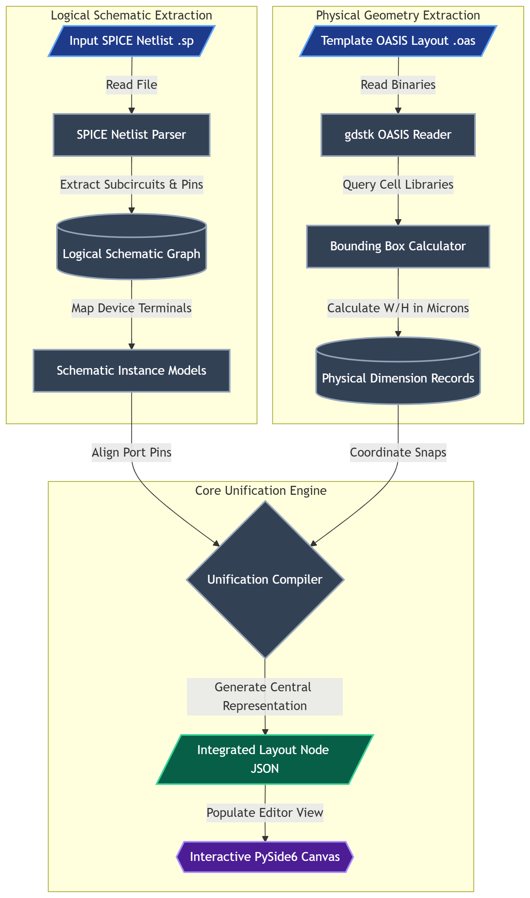

---

### 📐 Stage 2: Floorplan Strategy Selection

#### 🎭 The Strategy Selector
* **Role**: Determines the optimal row configuration, multi-finger transistor unrolling, and symmetry axes (e.g. vertical reflection) for matched groups.
* **Model Used**: `gemini-2.5-pro` / `claude-3-5-sonnet-v2@20241022` (Heavy task weight)
* **Features**:
  * Recommends row partitioning strategies (e.g., placing the diff-pair on Row 1, load mirror on Row 2).
  * Automatically assigns horizontal/vertical symmetry axes.
  * Integrates with the [SkillCatalog](file:///d:/Senior%202/Layout_Project/Automation/new_main_last_dance/AI-Based-Analog-Layout-Automation/ai_agent/skills/loader.py) to load layout expertise rules (e.g., common-centroid matching).
* **Limitations**:
  * Strategy decisions are based on heuristic aspect ratios; does not evaluate actual wire parasitics at this stage.

```python
# Selecting rows and layout symmetry axes
from ai_agent.agents.strategy_selector import select_strategy
strategy = select_strategy(matched_groups, aspect_ratio_target=1.0)
row_map = strategy.get("row_assignments")
```

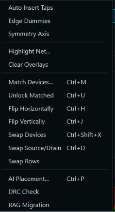

---

### 📐 Stage 3: High-Level Floorplanning

#### 📐 The Placement Specialist
* **Role**: Generates logical floorplan layout coordinates using logical command blocks (`MOVE`, `ALIGN`, `FLIP`).
* **Model Used**: `gemini-2.5-pro` / `claude-3-5-sonnet-v2@20241022` (Heavy task weight)
* **Features**:
  * Outputs strict, parseable XML `[CMD]` blocks to adjust logical device slot indices.
  * Employs **Device Inventory Conservation** to guarantee that every transistor in the schematic is accounted for (no additions or deletions allowed).
  * Dynamic skill injection via [SkillMiddleware](file:///d:/Senior%202/Layout_Project/Automation/new_main_last_dance/AI-Based-Analog-Layout-Automation/ai_agent/knowledge/skill_injector.py) to inject domain rules.
* **Limitations**:
  * Logical floorplanning operates on a coarse-grained grid without sub-micron physical coordinates.

```xml
<!-- Example output generated by the Placement Specialist -->
[CMD] MOVE MM1 x=0 y=0 [/CMD]
[CMD] MOVE MM2 x=1 y=0 [/CMD]
[CMD] FLIP MM2 orientation=MY [/CMD]
```

---

### 📐 Stage 4: Geometric Finger Expansion

#### 📐 The Finger Expansion & Compactor Engine
* **Role**: Resolves physical transistor geometry coordinates, unrolls devices into discrete fingers (`nf > 1`), and runs diffusion sharing compaction.
* **Model Used**: Pure-Python Deterministic Geometry Engine (no LLM)
* **Features**:
  * Unrolls transistors into fingers and computes finger gate widths: $W_{\text{finger}} = W_{\text{device}} / n_f$.
  * Integrates an **$O(N)$ Viterbi Dynamic Programming (DP) Solver** in [finger_grouper.py](file:///d:/Senior%202/Layout_Project/Automation/new_main_last_dance/AI-Based-Analog-Layout-Automation/ai_agent/placement/finger_grouper.py) to calculate the mathematically optimal finger flip orientations to maximize diffusion sharing (abutment), reducing parasitics by up to $75\%$.
  * Automatically generates internal *bridge dummies* and boundary *padding dummies*.
* **Limitations**:
  * Cannot split a single device dynamically into asymmetric multipliers; fingers must have identical widths.

```python
# Unrolling devices and running Viterbi DP flip optimization
from ai_agent.placement.finger_grouper import expand_device_fingers
expanded_devices = expand_device_fingers(logical_nodes, no_abutment=False)
```

---

### 📐 Stage 5: Routability Analysis

#### 📐 The Routing Previewer
* **Role**: Scores the placement configuration by estimating net routing complexity and parasitic parameters.
* **Model Used**: Pure-Python Geometry (no LLM)
* **Features**:
  * Generates ratsnest overlay visual lines on the Pyside6 Symbolic Canvas.
  * Calculates **Half-Perimeter Wire Length (HPWL)** and detects net crossings to rate placements.
* **Limitations**:
  * Does not route the actual copper lines; only provides straight-line ratsnest distance estimates.

```python
# Evaluating routing wirelength scoring
from ai_agent.tools.scoring import score_routing_hpwl
hpwl_score = score_routing_hpwl(expanded_devices, terminal_nets)
```

---

### 📐 Stage 6: Spacing & Collision Verification

#### 📐 The DRC Critic
* **Role**: Sweeps the expanded physical nodes to detect overlap or minimum clearance violations and runs self-healing feedback loop corrections.
* **Model Used**: `gemini-2.5-flash` / `qwen-plus` (Light task weight)
* **Features**:
  * Uses a sweep-line geometric collision detection algorithm.
  * Automatically generates natural language feedback (e.g., *"Shift MM3 right by 0.3um to resolve overlap with MM2"*).
  * Triggers a self-healing loop back to the Placement Specialist (maximum 2 retries).
* **Limitations**:
  * Spacing rules are modeled on bounding boxes; does not run multi-layer process-specific DRC rule decks (like Calibre).

```python
# Sweep-line spacing verification
from ai_agent.tools.drc import run_drc_check
violations = run_drc_check(expanded_devices, min_spacing=0.294)
```

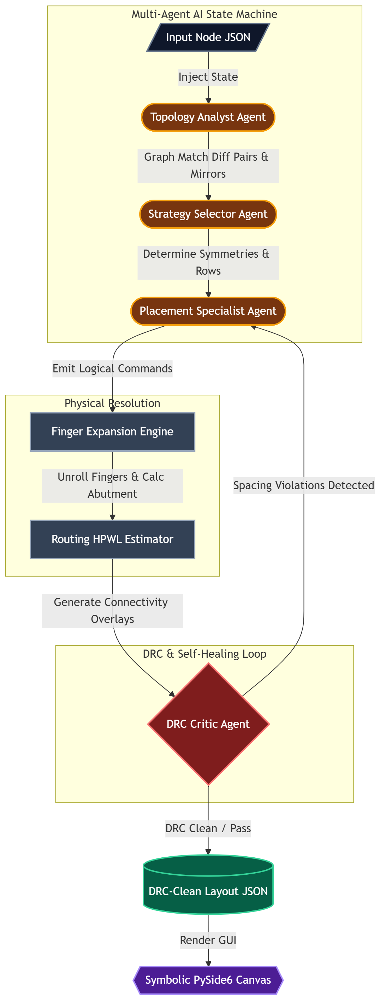

---

### 📐 Stage 7: Human-in-the-Loop Validation

#### 📐 The Human Viewer
* **Role**: Pauses the automated pipeline and renders the symbolic layout on the PySide6 canvas for designer review and manual refinement.
* **Model Used**: Interactive GUI Client (no LLM)
* **Features**:
  * Supports drag-and-drop mouse movements and keyboard shortcuts (`M` for Move, `D` for Dummy).
  * Multi-tab layout configuration where each tab holds its own independent AI context, command buffer, and undo histories.
  * Real-time sync with KLayout for a 2D/3D physical layout view.
* **Limitations**:
  * Halts fully automated headless scripts unless auto-approved.

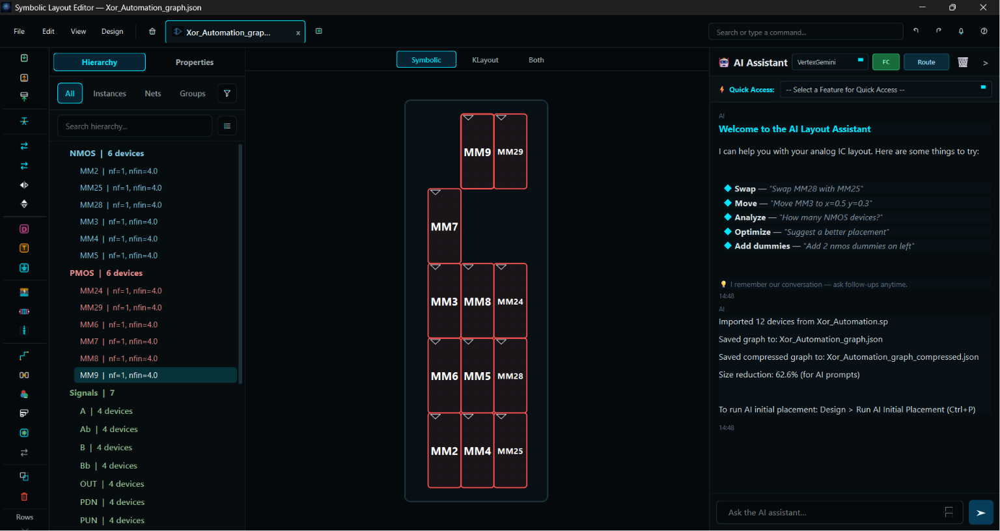

---

### 📐 Stage 8: Experience Persistence

#### 📐 The RAG Saver
* **Role**: Saves approved, high-quality layout floorplans into a local Vector Database/RAG library to serve as design templates.
* **Model Used**: ChromaDB / Vector Store Engine (no LLM)
* **Features**:
  * Indexes the topological graph of the circuit along with the final coordinate vectors.
  * During the *Topology Analyst* stage, the system queries the database to retrieve similar layouts.
* **Limitations**:
  * Database resides locally; requires syncing to share across design teams.

---

### 📐 Stage 9: Conversational Fast-Path (Interactive Chatbot Co-Pilot)

#### 📐 The Chatbot Co-Pilot
* **Role**: Bridges natural language commands (e.g. *"Move MM2 to Row 1"*) with canvas actions, and provides ultra-fast context-free answers for general chat or coding theory.
* **Model Used**: `gemini-2.5-flash` / `qwen-plus` (Light task weight)
* **Features**:
  * **Intent Classification** in [classifier.py](file:///d:/Senior%202/Layout_Project/Automation/new_main_last_dance/AI-Based-Analog-Layout-Automation/ai_agent/agents/classifier.py): Automatically splits user requests into `"general_chat"` (context-free fast path) and `"layout_query"` (context-rich design queries).
  * **Conversational Fast Path** in [workers.py](file:///d:/Senior%202/Layout_Project/Automation/new_main_last_dance/AI-Based-Analog-Layout-Automation/ai_agent/llm/workers.py): If `"general_chat"` is classified (e.g., *"Explain what a cascode mirror is"*), the chatbot bypasses active layout serialization and tool-binding, streaming responses in **under 1 second** and saving **>90%** of API token costs.
  * Automatically falls back to layout-aware mode if layout queries are asked.
* **Limitations**:
  * Fast path cannot access active device states unless the conversation switches to a design query.

```python
# Conversational Fast Path routing in process_request_with_tools
if intent == "general_chat":
    self.response_started.emit(message_id)
    final_text, _ = stream_llm(general_chat_messages, llm, message_id, self, emit_done=True)
    return
```

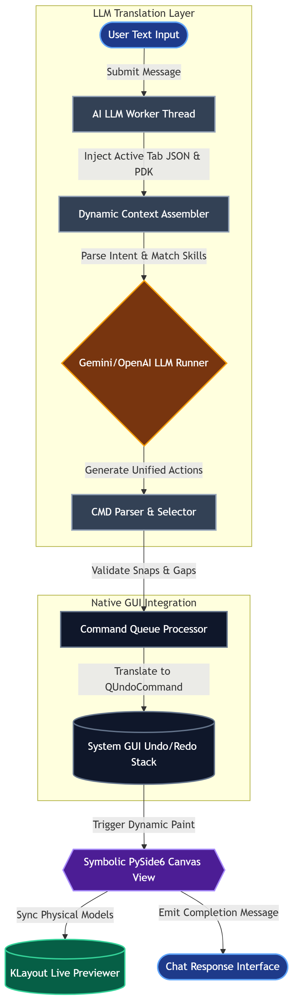

---

## 💾 Physical Export & EDA Integrations

The layout backend provides two main physical compile outputs:

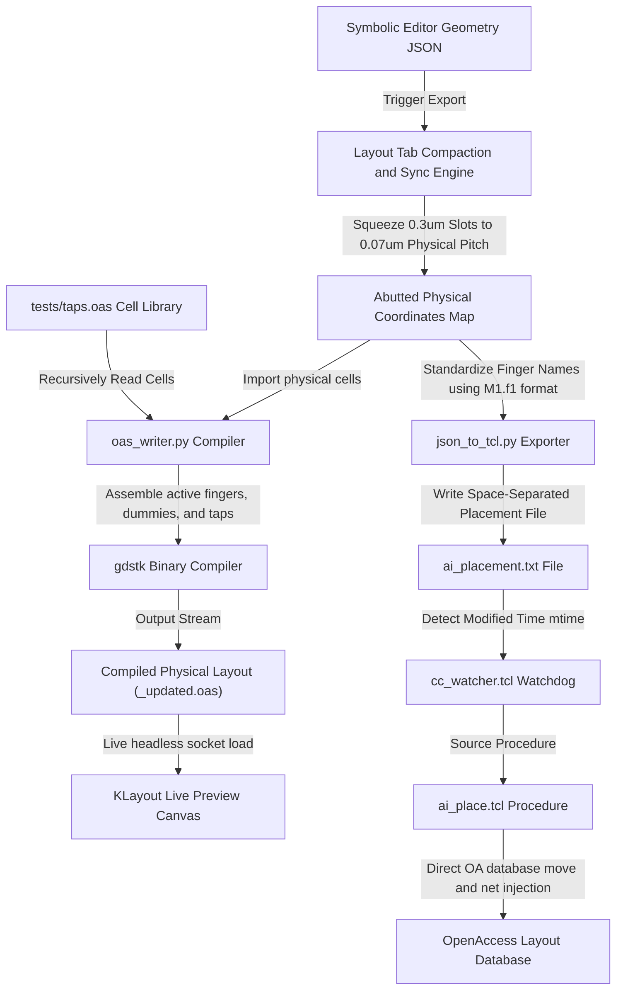
```mermaid
graph TD
    SYMBOLIC["Symbolic Editor Geometry JSON"] -->|Trigger Export| SYNC["Layout Tab Compaction and Sync Engine"]
    SYNC -->|Squeeze 0.3um Slots to 0.07um Physical Pitch| COMPACT_STATE["Abutted Physical Coordinates Map"]

    COMPACT_STATE -->|Import physical cells| OAS_WRITER["oas_writer.py Compiler"]
    TAP_OAS["tests/taps.oas Cell Library"] -->|Recursively Read Cells| OAS_WRITER
    OAS_WRITER  -->|Assemble active fingers, dummies, and taps| BINARY_COMP["gdstk Binary Compiler"]
    BINARY_COMP -->|Output Stream| OAS_FILE["Compiled Physical Layout (_updated.oas)"]
    OAS_FILE    -->|Live headless socket load| KL_PREVIEW["KLayout Live Preview Canvas"]

    COMPACT_STATE -->|Standardize Finger Names using M1.f1 format| TCL_EXPORT["json_to_tcl.py Exporter"]
    TCL_EXPORT  -->|Write Space-Separated Placement File| TXT_FILE["ai_placement.txt File"]
    TXT_FILE    -->|Detect Modified Time mtime| WATCHER["cc_watcher.tcl Watchdog"]
    WATCHER     -->|Source Procedure| AI_PLACE["ai_place.tcl Procedure"]
    AI_PLACE    -->|Direct OA database move and net injection| OA_DB["OpenAccess Layout Database"]
```

### 1. Headless Binary OASIS Exporter
* Programmatically compiles physical cell files into a binary `.oas` layout stream.
* Reads tie/tap geometry boundaries and infills `Ntap`/`Ptap` boundary cells from `tests/taps.oas`.
* Refresh updates instantly refresh KLayout's canvas.

### 2. Synopsys/Cadence OpenAccess TCL Exporter
* The `json_to_tcl.py` exporter writes space-separated physical coordinate placement files.
* A watchdog script running inside the CAD tool (e.g. Synopsys Custom Compiler, Cadence Virtuoso) detects file writes.
* Triggers database procedures to move transistor cell views in-memory and inject PCell parameters (`leftAbut`/`rightAbut`) to generate DRC-clean, LVS-validated physical layouts.

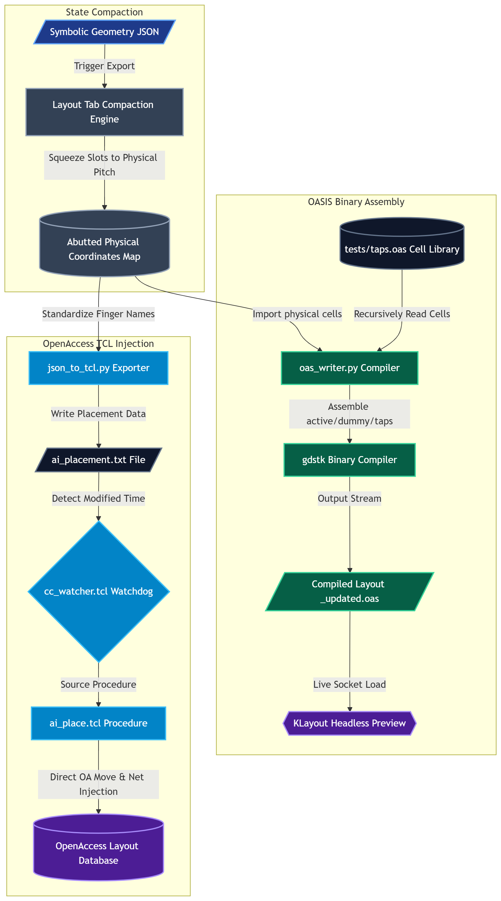

---

## 📊 Layout Symmetry & Optimization Results

Below are before/after comparisons showing how the strategic agent optimizer and geometric compaction engine organize layouts from random starting states into symmetric, DRC-clean analog blocks:

### 1. Differential Pair (Comparator Block)
The AI placement specialist and symmetry enforcer interleave active devices and center them symmetrically with outer balanced dummy pads:

| Before Optimization (Unsymmetrical & Unaligned) | After Optimization (Symmetric & Compacted) |
| :---: | :---: |
| 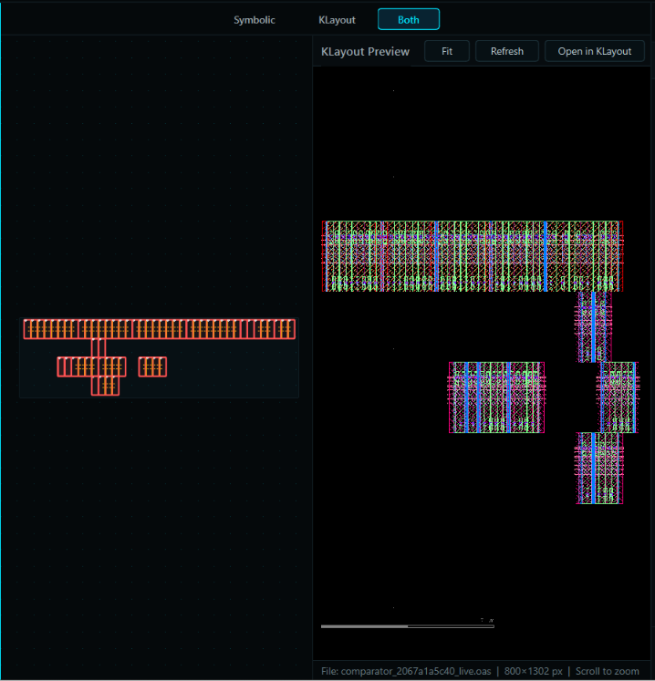 | 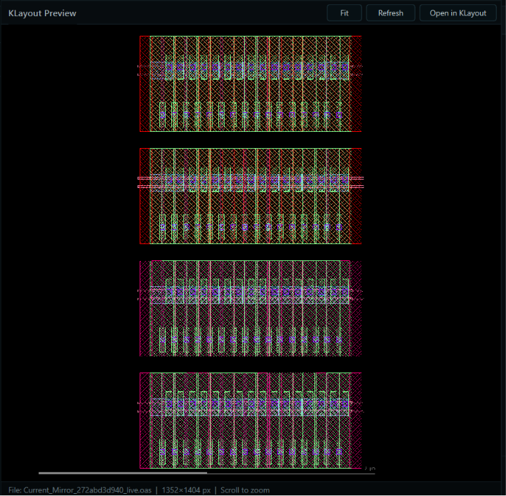 |

### 2. High-Performance Current Mirror
Active matched rows are aligned with alternating source/drain terminals and grid-aligned dummies to guarantee uniform spatial gradients:

| Before Optimization (Randomly Spaced) | After Optimization (Unified Symmetry & Compaction) |
| :---: | :---: |
| 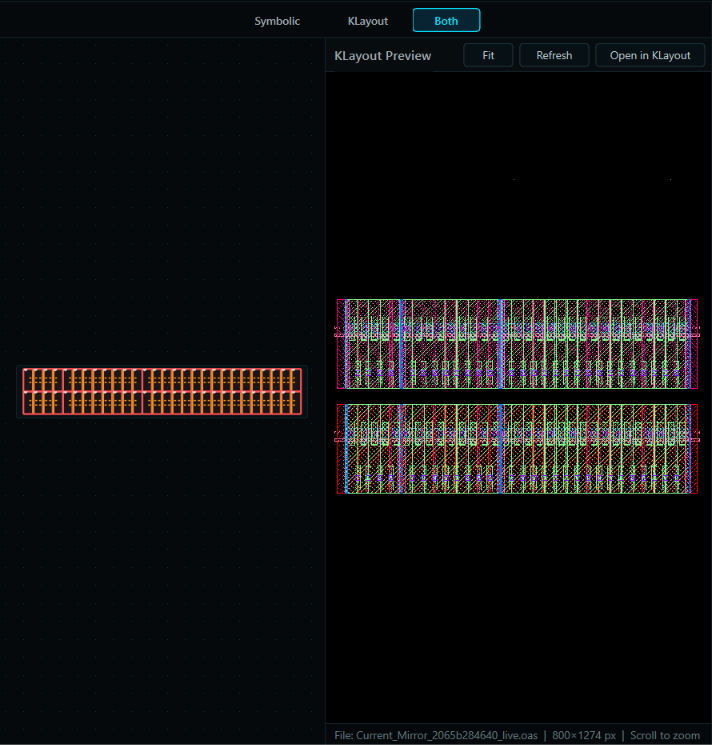 |  |

---

## 🚦 Quick Start

### 1. Installation
```bash
# Clone the repository
git clone https://github.com/orabi55/AI-Based-Analog-Layout-Automation.git
cd AI-Based-Analog-Layout-Automation

# Setup environment
python -m venv .venv
source .venv/bin/activate  # Or .venv\Scripts\activate on Windows

# Install dependencies
pip install -r requirements.txt
```

### 2. Configuration
Copy the `.env.example` to `.env` and add your API keys.
```bash
cp .env.example .env
```

### 3. Launching the Editor
```bash
python symbolic_editor/main.py
```

---

## ⌨️ Global Shortcuts

| Key | Action | Tool Description |
| :--- | :--- | :--- |
| `Ctrl+I` | **Import Netlist/Layout** | Import SPICE (`.sp`) or OASIS (`.oas`) design files. |
| `Ctrl+P` | **Run AI Initial Placement** | Trigger the LangGraph multi-agent placement engine. |
| `Ctrl+S` | **Save Progress** | Save the current symbolic configuration to JSON. |
| `Ctrl+Shift+E` | **Export to OASIS** | Write physical geometry directly to an OASIS layout stream. |
| `Ctrl+Z` / `Ctrl+Y` | **Undo / Redo** | Natively step back and forth in the editing command stack. |
| `M` | **Move Mode** | Drag-and-drop active layout blocks with grid snapping. |
| `D` | **Dummy Mode** | Place dummy transistors on selected rows. |
| `V` / `G` | **Tap Placement** | Lock cursor to place VDD (`Ntap`) or GND (`Ptap`) boundary cells. |
| `F` | **Fit View** | Automatically scale and center the canvas to display all items. |

---

© 2026 AI-Based Analog Layout Automation Team
