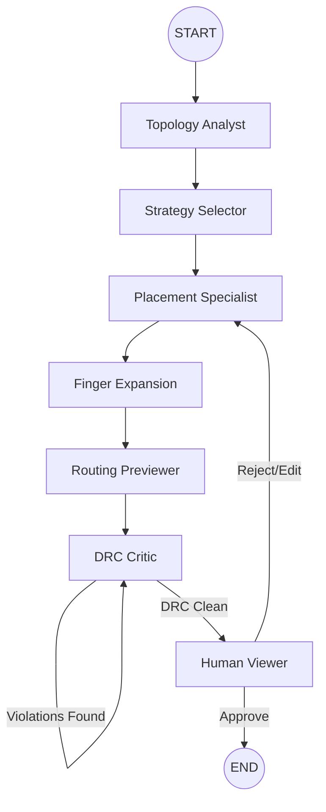
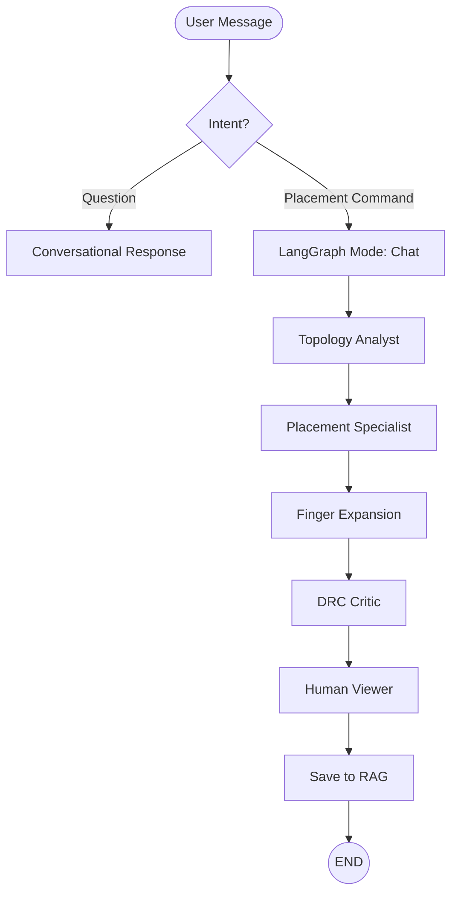

# AI Agent System — Comprehensive Technical Documentation

## 1. Overview
The `ai_agent` module is the intelligence core of the Layout Automation project. It leverages **LangGraph** to orchestrate a multi-agent pipeline capable of transforming abstract circuit descriptions into production-ready analog layouts. It supports two primary operational modes: **Autonomous Initial Placement** and **Interactive Chatbot-assisted Editing**.

### Core Value Proposition
- **Expert-Level Heuristics**: Encapsulates analog layout knowledge (symmetry, matching, spacing) into a structured **Skill System**.
- **Self-Correcting Pipeline**: Integrated **DRC Critic** loops that detect and fix violations without human intervention.
- **Deterministic Finger Expansion**: High-level logical placements are mathematically expanded into physical fingers using precise PDK rules.

---

## 2. Functional Architecture

The system is built on a "Decoupled Agency" architecture where the state machine (LangGraph) is separated from the agent logic (Prompts/LLMs) and the physical tools (Placement/DRC).

### High-Level Component Map
| Layer | Directory | Responsibility |
| :--- | :--- | :--- |
| **Orchestration** | `graph/`, `nodes/` | Manages the state machine, flow control, and node transitions. |
| **Intelligence** | `agents/`, `llm/` | Contains the LLM prompts, model factory, and specialized agent personas. |
| **Geometry** | `placement/`, `matching/` | Pure Python algorithms for finger grouping, symmetry, and pattern matching. |
| **Expertise** | `skills/`, `knowledge/` | Structured domain knowledge and layout rules. |
| **Utility** | `tools/`, `utils/` | Concrete tools (DRC, inventory checks) and shared helpers. |

---

## 3. The LangGraph Pipeline (Step-by-Step)

The pipeline consists of 8 specialized stages. In **Initial Placement** mode, it runs end-to-end. In **Chat** mode, it selectively executes based on user intent.

### Step 1: Topology Analyst (`node_topology_analyst`)
- **Agent**: `agents/topology_analyst.py`
- **Goal**: Identify structural patterns in the netlist.
- **Action**: Detects Differential Pairs, Current Mirrors, Cascode chains, and Dummy requirements.

### Step 2: Strategy Selector (`node_strategy_selector`)
- **Agent**: `agents/strategy_selector.py`
- **Goal**: Plan the high-level floorplan.
- **Action**: Assigns devices to rows, decides on symmetry axes, and selects matching patterns (e.g., ABBA vs Interdigitated).

### Step 3: Placement Specialist (`node_placement_specialist`)
- **Agent**: `agents/placement_specialist.py`
- **Goal**: Generate logical coordinates.
- **Action**: Produces `[CMD]` blocks (e.g., `MOVE`, `ALIGN`) while enforcing "Inventory Conservation" (no device left behind).

### Step 4: Finger Expansion (`node_finger_expansion`)
- **Logic**: `placement/finger_grouper.py`
- **Goal**: Convert logical blocks to physical layout.
- **Action**: Expands a single "Logical Device" into multiple physical "Fingers" based on `nf` (number of fingers) and PDK spacing rules.

### Step 5: Routing Previewer (`node_routing_previewer`)
- **Agent**: `agents/routing_previewer.py`
- **Goal**: Estimate routability.
- **Action**: Scores the placement based on net crossings and wire length estimates.

### Step 6: DRC Critic (`node_drc_critic`)
- **Agent**: `agents/drc_critic.py`
- **Tool**: `tools/drc.py`
- **Goal**: Ensure physical validity.
- **Action**: Performs sweep-line overlap detection. If errors exist, it generates a "Violation Report" and loops back to itself for self-correction.

### Step 7: Human Viewer (`node_human_viewer`)
- **Goal**: Human-in-the-loop validation.
- **Action**: Interrupts the graph and waits for user approval or feedback via the UI.

### Step 8: RAG Saver (`node_save_to_rag`)
- **Goal**: Learning and persistence.
- **Action**: Saves successful placements and their corresponding prompts to a knowledge base for future retrieval.

---

## 4. Execution Flowcharts

### A. Initial Placement Flow (`Ctrl+P`)

### B. Chatbot Interaction Flow

---

## 5. Detailed Directory Breakdown

### `ai_agent/agents/`
Specialized LLM "brains" with distinct system prompts.
- `orchestrator.py`: Entry point for chat logic; routes between conversational and graph-based tasks.
- `classifier.py`: Uses a small LLM to determine if a user wants to "move things" or just "ask a question."
- `prompts.py`: Central repository for all system prompts, ensuring consistent agent behavior.

### `ai_agent/placement/`
The "Physical Engine" — no LLMs here, just math and geometry.
- `finger_grouper.py`: The most critical file. Handles logical-to-physical mapping.
- `abutment.py`: Logic for merging source/drain regions of adjacent transistors to save area.
- `symmetry.py`: Enforces mirror and cross-coupling symmetry during placement.
- `normalizer.py`: Ensures all coordinates are snapped to the PDK grid.

### `ai_agent/matching/`
The "Pattern Engine" — identifies symmetric clusters.
- `engine.py`: Orchestrates pattern detection (e.g., finding current mirrors in a netlist).
- `patterns.py`: Definitions of common analog patterns (Differential pairs, Cross-coupled).
- `universal_pattern_generator.py`: Generates placement templates for any matched pattern (e.g., "ABBA" or "Common-Centroid").

### `ai_agent/knowledge/`
The "Expert Database."
- `analog_rules.py`: A massive collection of hardcoded layout principles (e.g., "Place NMOS below PMOS," "Keep dummies on edges").
- `skill_injector.py`: The middleware that selects which skills to show the LLM based on the current circuit's topology.

### `ai_agent/llm/`
Model abstraction layer.
- `factory.py`: Standardizes how Gemini, Qwen, or Vertex AI models are instantiated.
- `runner.py`: Handles API retries, timeout logic, and token usage tracking.
- `workers.py`: PyQt-compatible `QThread` wrappers that allow the graph to run without freezing the UI.

### `ai_agent/graph/`
The "Railway System" for state data.
- `state.py`: Defines the `LayoutState` dictionary, which stores everything from the netlist to the final DRC report.
- `builder.py`: Compiles the nodes and edges into a runnable LangGraph application.

### `ai_agent/tools/`
Capabilities provided to the agents.
- `drc.py`: Fast, sweep-line based overlap detection.
- `circuit_graph.py`: Converts raw JSON netlists into a graph object for easier analysis of connectivity.
- `overlap_resolver.py`: Heuristics for pushing overlapping blocks apart.

---

## 6. Development Standards

1. **State Immutability**: Never modify `LayoutState` in-place. Always return a dictionary with updated fields.
2. **Deterministic Expansion**: The LLM should only handle *logical* placement (moving blocks). The `finger_expansion` node handles the *physical* details (exact microns/pixels).
3. **No Qt in Core**: Files in `agents/`, `graph/`, and `placement/` must NOT import PyQt modules. This allows for headless testing and faster execution.
4. **Inventory Conservation**: Every device ID provided in the input must exist in the output. The `Placement Specialist` must be prompted to never "hallucinate" or "delete" devices.

---

## 7. Troubleshooting & FAQs

### Why is the LLM hallucinating coordinates?
Ensure that the `Strategy Selector` has provided a clear row assignment. Hallucinations often happen when the LLM is overwhelmed by too many devices without a structural plan.

### How do I add a new agent node?
1. Define the node function in `ai_agent/nodes/`.
2. Add the agent logic in `ai_agent/agents/`.
3. Register the node in `ai_agent/graph/builder.py`.
4. Define the routing logic in `ai_agent/graph/edges.py`.

### How does DRC correction work?
The `DRC Critic` doesn't just say "there is an error." It provides the specific `dx` and `dy` needed to fix the overlap, which the LLM uses to regenerate the `MOVE` commands.
