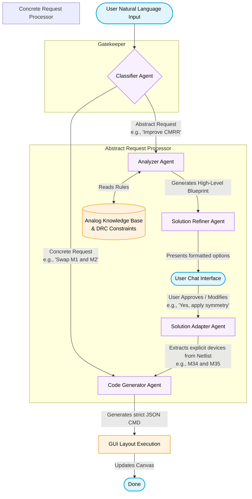

# LayoutCopilot Multi-Agent Workflow

This flowchart illustrates the step-by-step process of how a user's natural language request is handled by the different specialized LLM agents in the LayoutCopilot framework.

