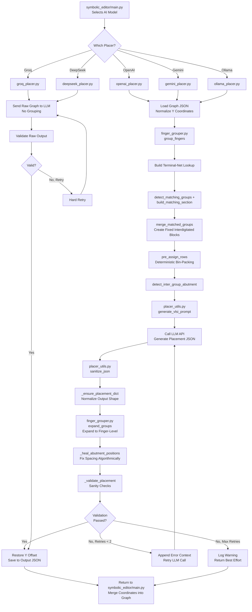

# AI Initial Placement Module

## Overview

The **AI Initial Placement** module generates 2D placement coordinates `(x, y)` for analog FinFET transistor circuits using Large Language Models (LLMs). It takes a circuit graph representation (nodes = devices, edges = nets) as input and returns each device with geometry placements that respect VLSI design rules, including row structure (PMOS above NMOS), abutment spacing, symmetry for matched pairs, and overlap avoidance.

This module is a core component of the **AI-Based Analog Layout Automation** system, providing intelligent initial placement that understands analog circuit topology and design constraints.

---

## Architecture

The module follows a **hub-and-spoke** design pattern:

```
                    symbolic_editor/main.py
                              |
               (selects LLM provider at runtime)
                              |
        +---------------------+----------------------+
        |          |          |          |           |
  openai_placer gemini_placer groq_placer deepseek  ollama_placer
        |          |          |          |           |
        +----------+----------+----------+-----------+
                   |                        |
           placer_utils.py          finger_grouper.py
        (sanitization,              (grouping, matching,
         validation,                row assignment,
         healing, prompt)           expansion, merging)
```

### Core Shared Libraries

| File | Lines | Purpose |
|------|-------|---------|
| `placer_utils.py` | ~739 | JSON sanitization, prompt building, validation, coordinate normalization, placement healing |
| `finger_grouper.py` | ~1611 | Finger/multiplier grouping, matching detection, row assignment, ABBA interdigitation, expansion |

### LLM Provider Placers

| File | LLM Model | Pipeline |
|------|-----------|----------|
| `openai_placer.py` | GPT-4o-mini | Full pipeline (grouping → merging → row assignment → placement → expansion → healing) |
| `gemini_placer.py` | Gemini 2.5 Flash | Full pipeline with debug output |
| `ollama_placer.py` | llama3.2 (local) | Full pipeline, 10-minute timeout, temperature 0.1 |
| `groq_placer.py` | Llama-3.3-70B | Simplified pipeline (raw graph → LLM → validate) |
| `deepseek_placer.py` | deepseek-chat | Simplified pipeline via OpenAI-compatible API |

---

## Detailed File Descriptions

### `placer_utils.py` — Shared Utilities

Provides all pre/post-processing logic used by every placer provider.

#### Key Functions

| Function | Purpose |
|----------|---------|
| `_repair_truncated_json(text)` | Handles LLM token-limit truncation by counting open/closed braces and appending missing closers |
| `sanitize_json(text) -> dict` | Multi-stage JSON parser: tries `json.loads`, strips markdown fences, removes comments/trailing commas, bracket-repair, incremental trim-and-retry |
| `_ensure_placement_dict(parsed) -> dict` | Normalizes any LLM output shape to `{"nodes": [...]}`, handling bare arrays or dicts with keys like `"placement"`, `"result"`, `"layout"`, `"devices"` |
| `_build_net_adjacency(nodes, edges) -> str` | Builds human-readable adjacency table grouped by signal nets (excluding power rails), flags `[CROSS-ROW]` connections |
| `_build_device_inventory(nodes, row_summary) -> str` | Generates structured device inventory listing PMOS/NMOS with electrical parameters (`nfin`, `nf`, `l`) |
| `_build_block_info(nodes, graph_data) -> str` | Produces hierarchical block grouping summary (e.g., "opamp1 (two_stage_opamp): M1, M2, M3, M4") |
| `_validate_placement(original_nodes, result) -> list` | Post-placement sanity checks: verifies all devices present, no invented devices, type mismatches, overlap detection with abutment tolerance |
| `_normalise_coords(nodes) -> tuple` | Shifts all Y-coordinates so min(y) == 0; returns `(normalized_nodes, y_offset)` restored after placement |
| `_build_abutment_chains(nodes, candidates) -> list[list[str]]` | Uses Union-Find with path compression to extract connected components of abutted device pairs |
| `_heal_abutment_positions(nodes, candidates, no_abutment=False) -> list` | Robust post-placement healing: forces passives to dedicated row, builds abutment chains, force-packs chains at 0.070μm pitch, separates chains by device width |
| `generate_vlsi_prompt(...)` | Assembles complete structured VLSI placement prompt with DRC rules, row structure, fin grid quantization, spacing rules, voltage isolation, multi-finger handling |

#### Constants

```python
ABUT_SPACING = 0.070    # μm — spacing between abutted device origins
PITCH = 0.294           # μm — non-abutted device pitch (diffusion break)
PASSIVE_Y = 1.630       # μm — dedicated passive device row Y coordinate
```

---

### `finger_grouper.py` — Finger Grouping & Expansion

The most complex file. Handles collapsing individual finger/multiplier nodes into compact transistor-level groups before LLM placement, then expanding them back afterward.

**Problem Solved:** A comparator with `nf=6, m=8` produces **48 individual finger nodes** for ONE logical transistor. Sending ~190 finger nodes to the LLM causes token-limit truncation and loss of abutment chain awareness.

**Solution:**
1. `group_fingers()` — 190 finger nodes → ~12 transistor groups
2. LLM places 12 groups
3. `expand_groups()` — 12 groups → 190 fingers with correct 0.070μm abutment spacing

#### ID Parsing

Handles multiple naming conventions:

| Example ID | Parsed Result |
|------------|---------------|
| `"MM6_m2_f3"` | `("MM6", multiplier=2, finger=3)` |
| `"MM6_m3"` | `("MM6", multiplier=3, finger=None)` |
| `"MM5_f2"` | `("MM5", multiplier=None, finger=2)` |
| `"MM9<3>_f4"` | `("MM9", multiplier=3, finger=4)` (legacy array-bus) |
| `"MM1"` | `("MM1", multiplier=None, finger=None)` (single device) |

#### Core Functions

| Function | Purpose |
|----------|---------|
| `group_fingers(nodes, edges)` | Main entry point: buckets finger nodes under logical transistor keys, builds representative group nodes with combined electrical parameters and total width |
| `detect_matching_groups(group_nodes, group_edges)` | Groups transistors by electrical signature `(type, nf, m, total_fingers, l, nfin)` to find structurally identical devices; returns matched pairs, clusters, diff pairs, cross-coupled, tail sources |
| `_enrich_matching_info(...)` | Fills net-based matching: differential pairs (VINP/VINN gate nets), cross-coupled pairs (D↔G connections), tail current sources |
| `build_matching_section(...)` | Builds human-readable matching/symmetry section for LLM prompt; detects Strong-ARM latch topology with detailed placement strategy |
| `merge_matched_groups(...)` | Merges matched transistor pairs into fixed interdigitated blocks BEFORE LLM sees them (diff pairs → current mirrors → cross-coupled pairs priority order) |
| `pre_assign_rows(...)` | Deterministic bin-packing: separates by type, rectangular balancing if one type >1.15× wider, greedy largest-first bin-packing within `max_row_width`, symmetry-aware reordering |
| `detect_inter_group_abutment(...)` | Finds abutment opportunities between different transistor groups sharing a non-power S/D net |
| `expand_groups(group_placement, ...)` | Multi-pass expansion: enforces PMOS/NMOS bounding box separation, expands to individual fingers using appropriate pitch, resolves inter-group overlaps |
| `_resolve_row_overlaps(nodes, no_abutment)` | Groups by (Y, type), identifies chains by parent name, places chains consecutively at FINGER_PITCH, separates different chains by device width |
| `_generate_abba_pattern(fingers_a, fingers_b)` | Generates ABBA interdigitation pattern: `A1 B1 B2 A2 | A3 B3 B4 A4 | ...` |
| `_detect_current_mirrors(...)` | Finds current mirror pairs (same-type groups sharing a gate net that is also the drain of one — diode-connected) |
| `_symmetry_order(groups, ...)` | Reorders groups within a row: cross-coupled latch (center) → diff pair halves (flank) → tail sources (adjacent) → others (outer edges, split symmetrically) |

#### Constants

```python
PMOS_Y       = 0.668   # μm — default PMOS row Y
NMOS_Y       = 0.000   # μm — default NMOS row Y
ROW_PITCH    = 0.668   # μm — row-to-row vertical pitch
FINGER_PITCH = 0.070   # μm — abutted finger-to-finger pitch
STD_PITCH    = 0.294   # μm — non-abutted device pitch (diffusion break)
MAX_ROW_WIDTH = 8.0    # μm — trigger new row when exceeded
```

---

### Provider-Specific Placers

#### `openai_placer.py` (~130 lines)

Generates placement using OpenAI's GPT-4o-mini.

**Pipeline:**
1. Load graph JSON → Normalize Y coordinates
2. `group_fingers()` → `group_nodes, group_edges, finger_map`
3. Build terminal-net lookup → `build_matching_section()` + `detect_matching_groups()`
4. `merge_matched_groups()` → merged nodes/edges/finger_map
5. `pre_assign_rows()` → row summary with Y assignments
6. `detect_inter_group_abutment()` + existing abutment candidates
7. Build prompt via `generate_vlsi_prompt()`
8. Call `client.chat.completions.create(model="gpt-4o-mini", temperature=0.3)`
9. `sanitize_json()` → `_ensure_placement_dict()`
10. `expand_groups()` → finger-level coordinates
11. `_heal_abutment_positions()` → fix spacing algorithmically
12. `_validate_placement()` → check correctness
13. Restore original Y offset, save to output JSON
14. Retry up to `MAX_RETRIES=2` on failure

**API Key:** `OPENAI_API_KEY` environment variable

---

#### `gemini_placer.py` (~165 lines)

Generates placement using Google's Gemini 2.5 Flash.

**Differences from OpenAI placer:**
- Uses `google.genai` client with `model="gemini-2.5-flash"` and `max_output_tokens=65536`
- Writes raw LLM response to `debug_raw_output.json` for debugging
- Loads `.env` file from project root via `dotenv`
- Same full pipeline: finger grouping → matching → merging → row assignment → expansion → healing → validation

**API Key:** `GEMINI_API_KEY` environment variable (or `.env` file)

---

#### `groq_placer.py` (~100 lines)

Generates placement using Groq's Llama 3.3 70B for ultra-fast inference.

**Simplified Pipeline:** Sends raw node/edge graph directly to LLM → validates output. **No finger grouping, matching detection, row assignment, expansion, or healing steps.**

- Uses `groq.Groq` client with `model="llama-3.3-70b-versatile"`, `max_tokens=8192`
- Validation failures cause hard retry

**API Key:** `GROQ_API_KEY` environment variable

---

#### `deepseek_placer.py` (~100 lines)

Generates placement using DeepSeek's `deepseek-chat` model via OpenAI-compatible API.

**Same simplified pipeline as Groq placer** (no finger grouping, matching, or expansion).

- Uses `openai.OpenAI` client with `base_url="https://api.deepseek.com"`

**API Key:** `DEEPSEEK_API_KEY` environment variable

---

#### `ollama_placer.py` (~155 lines)

Generates placement using a local Ollama instance (default model: `llama3.2`).

**Full pipeline** (same as OpenAI/Gemini: finger grouping → matching → merging → row assignment → abutment detection → expansion → healing → validation).

**Differences:**
- Uses `requests.post("http://localhost:11434/api/generate")` with `"format": "json"`
- `REQUEST_TIMEOUT = 600` (10 minutes) since local models are slower
- Lower temperature: `0.1` (vs 0.3 for cloud models)
- **No API key needed** — runs locally

---

## Processing Flowchart



---

## Input/Output Format

### Input JSON Format

```json
{
  "nodes": [
    {
      "id": "MM1",
      "type": "nmos",
      "electrical": { "nf": 2, "nfin": 4, "l": 0.018 },
      "geometry": { "x": null, "y": null, "orientation": "R0" }
    }
  ],
  "edges": [
    { "source": "MM1", "target": "MM2", "net": "VINP" }
  ],
  "terminal_nets": {
    "VINP": ["MM1.gate", "MM2.gate"],
    "VOUTP": ["MM3.drain", "MM4.drain"]
  },
  "blocks": {
    "opamp1": { "type": "two_stage_opamp", "devices": ["MM1", "MM2", "MM3", "MM4"] }
  },
  "abutment_candidates": [["MM1", "MM2"]],
  "no_abutment": false
}
```

### Output JSON Format

```json
{
  "nodes": [
    {
      "id": "MM1",
      "type": "nmos",
      "electrical": { "nf": 2, "nfin": 4, "l": 0.018 },
      "geometry": {
        "x": 0.000,
        "y": 0.000,
        "orientation": "R0",
        "abutment": { "abut_left": false, "abut_right": true }
      }
    }
  ]
}
```

---

## Design Rules Enforced

| Rule | Value | Description |
|------|-------|-------------|
| Row Pitch | 0.668 μm | Vertical distance between rows |
| Fin Grid | 0.014 μm | Fin pitch quantization |
| Abutment Spacing | 0.070 μm | Pitch between abutted finger origins |
| Standard Pitch | 0.294 μm | Pitch between non-abutted devices |
| Passive Row | 1.630 μm | Dedicated Y coordinate for resistors/capacitors |
| PMOS/NMOS Separation | Bounding boxes must not overlap | PMOS rows above all NMOS rows |

---

## Integration with the Larger System

This module is called from **`symbolic_editor/main.py`** via the `_run_ai_initial_placement()` method:

1. The symbolic editor builds a circuit graph from a parsed netlist
2. User selects an AI model via GUI dialog
3. `_run_ai_initial_placement()` serializes the graph to a temp JSON file
4. The appropriate placer function is called with `(tmp_in_path, tmp_out_path)`
5. The placer writes the result (with x/y coordinates, orientation, abutment flags) to the output JSON
6. `_run_ai_initial_placement()` merges the placed coordinates back into the original graph data structure
7. The updated graph is used for downstream processing (DRC checks, layout generation, visualization)

---

## Configuration

All API keys are loaded from environment variables:

| Variable | Provider |
|----------|----------|
| `OPENAI_API_KEY` | OpenAI GPT-4o-mini |
| `GEMINI_API_KEY` | Google Gemini 2.5 Flash |
| `GROQ_API_KEY` | Groq Llama-3.3-70B |
| `DEEPSEEK_API_KEY` | DeepSeek deepseek-chat |
| *(none)* | Ollama (local, no key needed) |

Keys can be set via `.env` file at the project root or as environment variables.

---

## Retry Logic

All placers implement retry logic for failed LLM calls:

| Placer | Max Retries | Behavior on Failure |
|--------|-------------|---------------------|
| openai_placer | 2 | Appends error context to prompt, retries |
| gemini_placer | 2 | Appends error context to prompt, retries |
| ollama_placer | 2 | Appends error context to prompt, retries |
| groq_placer | 2 | Hard retry with same prompt |
| deepseek_placer | 2 | Hard retry with same prompt |
