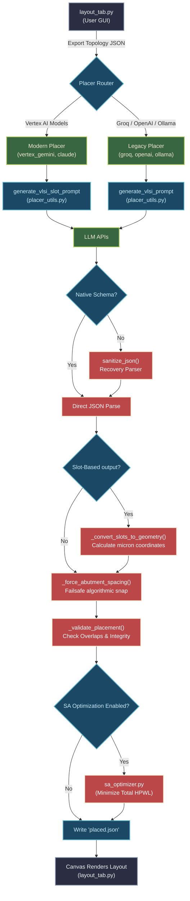

# AI Initial Placement Pipeline

Welcome to the **AI Initial Placement** subsystem of the Symbolic Analog Layout Editor. This module orchestrates the transition from an abstract electronic circuit schematic (topology graph) into a fully placed, DRC-aware geometric layout using state-of-the-art Large Language Models (LLMs).

## What is AI Initial Placement?
Analog layout design is a highly specialized skill requiring a balance between parasitic wire minimization, signal isolation, symmetric placement, and diffusion sharing (abutment) to save area. 
Traditionally, layout engineers spend hours manually arranging FinFET transistors on a canvas.

The **AI Initial Placement** framework transforms this manual labor into a fully automated, agentic workflow. We offload the complex topological reasoning (e.g., "Which transistor should naturally sit next to which to minimize crossing wires?") to an AI model, and we rely on rigorous Python mathematics to enforce absolute geometric DRC and scaling constraints, producing near-perfect analog initial seeds in less than 5 seconds.

---

## 🔀 System Workflow

The process is a hybrid pipeline combining AI "fuzzy" reasoning and Deterministic constraint solving.

### 1. Data Serialization
When the user clicks "Run Placement" in the GUI, the editor converts the currently visible transistors, passives, and signal nets into a compressed JSON graph (`tmp_gen_input.json`).
   
### 2. Normalization & Pre-Processing
The AI Engine routes the data to a specific model placer. Before reaching the AI, the topology is normalized (e.g., shifting coordinates origin to zero) and compressed. This shrinks the context token count by up to 95%, filtering out electrical properties that are irrelevant to spatial geometry.

### 3. Prompt Assembly & AI Inference
The system builds a dynamic, structured prompt. It handles two modes:
* **Slot-Based Prompting (Modern):** For advanced models like Gemini and Claude. The AI is asked strictly for *left-to-right integer order/sequence* (slots) rather than hallucinating precise floating points.
* **Floating-Point Prompting (Legacy):** For open-weight local models.

### 4. Mathematical Reconstruction & Abutment Healing
Once the AI returns a layout topology, the data runs back through a deterministic solver:
* The slot sequences are translated into absolute `(X, Y)` micron geometries.
* Transistors meant to "abut" (share diffusion regions to save area) are algorithmically snapped exactly `0.070µm` apart.
* Standalone transistors are placed at exactly `0.294µm` pitch.

### 5. Validation Check
The newly birthed geometry is pushed through `_validate_placement`. It checks for dropped components, overlapping bounding boxes, and cross-row contamination.

### 6. Simulated Annealing Post-Optimization 
If enabled, the placement is run through `sa_optimizer.py`. This algorithm performs thousands of micro-swaps on standalone devices. After every swap, it re-calculates the Half-Perimeter Wire Length (HPWL) and applies the swap only if it reduces physical wire delay. 

### 7. File Delivery
The optimized geometry file is dumped to disk (`tmp_gen_output_placed.json`), where the GUI `layout_tab` injects it directly into the user canvas.

---

## 📂 Key Components & File Architecture

### Core Utility Layer
* `placer_utils.py`
  * **Purpose:** The backbone engine of the pipeline. 
  * **Responsibilities:** JSON recovery & sanitization (`sanitize_json`), prompt generators (`generate_vlsi_slot_prompt`), deterministic math to floating-points (`_convert_slots_to_geometry`), abutment healing logic, and validation checks.
* `sa_optimizer.py`
  * **Purpose:** The local Simulated Annealer. 
  * **Responsibilities:** Runs a high-speed Python solver mimicking thermodynamic crystallization to swap components within their assigned rows until the global wire crossing (HPWL) hits a localized minimum.

### Placer Modules (The LLM Connectors)
* `vertex_gemini_placer.py` / `claude_vertex_placer.py`
  * **Purpose:** Modern Slot-Based pipelines using Google's GenAI and Anthropic's Vertex APIs. These modules enforce strict Native JSON structured payloads, completely eliminating unstructured AI hallucinations.
* `openai_placer.py` / `deepseek_placer.py` / `groq_placer.py`
  * **Purpose:** External API wrappers orchestrating standard LLM inference streams.
* `ollama_placer.py`
  * **Purpose:** Local inference interface. Allows fully offline layout automation via user-hosted open-weights models.

---

## 🧭 Functional Flowchart

Below is the visualized mapping for how a topology graph flows from the User Interface, through the AI APIs, into the mathematical solvers, and finally back to the screen canvas.

---

## 🛠 Adding a New AI Model
If you wish to integrate a new LLM provider into the pipeline:
1. Create a new `[modelname]_placer.py` module extending the structure found in existing placers.
2. Initialize your proprietary API client inside it.
3. Import the `placer_utils` suite. If your model natively supports JSON strict schema matching, use `generate_vlsi_slot_prompt()`. If not, route it through `generate_vlsi_prompt()`.
4. Ensure your script wraps the final `.json` logic block around `_restore_coords` before returning control.
5. Wire it into the `_run_ai_initial_placement()` router in `layout_tab.py`.
