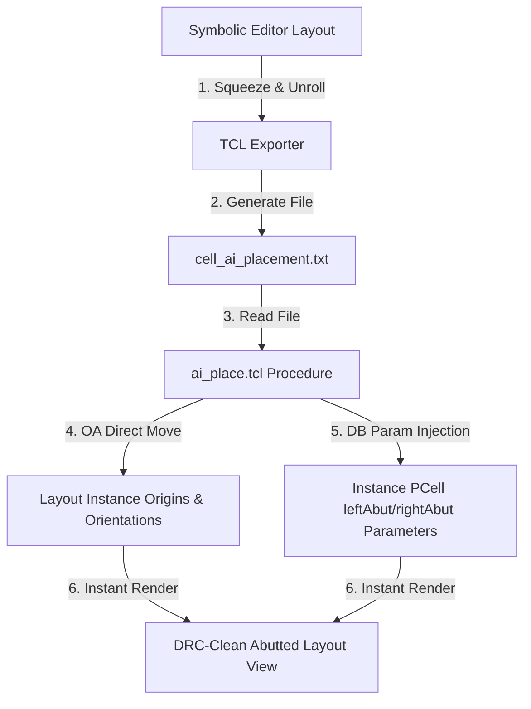

# AI-Based Analog Layout Placement & Abutment Synchronization

This directory contains `ai_place.tcl`, a custom high-performance Tcl procedure designed for seamless, instantaneous database integration in OpenAccess (OA) based custom layout design environments (such as Cadence Virtuoso or Synopsys Custom Compiler).

It bridges the gap between the AI-based layout optimization engine and active memory-resident physical layout databases.

---

## Workflow Overview



1. **AI Synthesis & Squeezing**: The symbolic layout engine unrolls multi-finger devices, groups them for symmetry and common centroid parameters, and squeezes standard $0.3\,\mu\text{m}$ slots down to physical $0.07\,\mu\text{m}$ contact diffusion-sharing boundaries.
2. **Text Export**: The layout engine exports a space-separated placement file containing device coordinates, orientation, and source/drain abutment properties.
3. **Database Injection**: The Tcl interpreter in the layout tool runs `ai_place.tcl`, which parses the file and applies the changes directly to active database instances without needing intermediate GDS/OAS streams.

---

## The AI Placement File Format

The placement output is exported as a space-separated, delimiter-free text file (`.txt`), where each line represents a unique transistor, dummy, or tap instance:

### Line Formats
* **Regular Transistor:**
  ```text
  <InstanceName> <X_Microns> <Y_Microns> <Orientation> [PCell_Parameters...]
  ```
  Example:
  ```text
  M1 0.490 0.668 R0 l=0.014 nf=1 nfin=4.0 m=1 left_abut=1 right_abut=1
  ```
* **Dummy Transistor:**
  ```text
  DUMMY <InstanceName> <CellType> <X_Microns> <Y_Microns> <Orientation> [PCell_Parameters...] [Terminals...]
  ```
  Example:
  ```text
  DUMMY D1 nfet 0.420 0.000 R0 l=0.014 nf=1 nfin=4.0 m=1 left_abut=1 right_abut=0 D=gnd! G=vdd! S=gnd! B=gnd!
  ```
* **Tap Cell:**
  ```text
  TAP <Rail> <CellType> <X_Microns> <Y_Microns> <Orientation>
  ```
  Example:
  ```text
  TAP GND Ptap -2.070 2.115 R0
  ```

---

## The `ai_place.tcl` Internal Architecture

The `ai_place_final` procedure parses the placement text file and executes layout database updates in four distinct pipeline phases:

| Phase | Operation | Direct Database API | Purpose / Description |
| :--- | :--- | :--- | :--- |
| **Phase 1** | **Active Device Movement** | `oa::setOrigin`, `oa::setOrient`, `db::setParamValue` | Queries active transistors (e.g. `M1.f1`) in the design database and moves them directly to target coordinates. Injects `leftAbut`/`rightAbut` properties to close layout diffusion gaps. |
| **Phase 2** | **Dummy Device Generation** | `le::createInst`, `db::setParamValue` | Dynamically instantiates new dummy transistors from the target PDK library (`SAED_PDK_14`) at designated coordinates, sets PCell parameters, and marks their PDK role as `Dummy`. |
| **Phase 3** | **Tap Cell Generation** | `le::createInst` | Dynamically instantiates substrate boundary tap cells (`Ntap`/`Ptap`) from the `taps` cell library. |
| **Phase 4** | **GUI Terminal Synchronization** | `de::getActiveFigure`, `gi::setField`, `gi::executeAction` | Safely and programmatically connects newly created dummy instance terminals (Gate, Drain, Source, Bulk) to layout nets via the GUI Property Editor, keeping database connectivity completely in sync. |

---

## Procedure Reference

### `ai_place {filename target_cell}`

Directly moves and updates parameters/connectivity for active design instances in OpenAccess memory.

#### Arguments
* **`filename`** *(string)*: The full or relative file path to the generated placement text file (e.g., `"xor_ai_placement.txt"`).
* **`target_cell`** *(string)*: The case-sensitive name of the active cell view target in design memory (e.g., `"xor"`).

> [!NOTE]
> `ai_place` is a convenient alias wrapper that forwards parameters to the core `ai_place_final` procedure. Both names can be used interchangeably.

---

## Step-by-Step Usage Guide

### 1. Open the Layout Editor
Open your custom layout suite (e.g., Synopsys Custom Compiler or Cadence Virtuoso) and open the target cell's layout view in **Edit Mode**.

### 2. Export Placement from Symbolic Editor
In the GUI of your Symbolic Editor:
* Click **Export TCL Placement** (or press the appropriate export shortcut).
* Save the file to your workspace (e.g., `eda/Xor_Automation_ai_placement.txt`).

### 3. Load the Tcl Script
In your layout tool's Command Interpreter Window (CIW) or console, source the Tcl script:

```tcl
source eda/ai_place.tcl
```

### 4. Execute the Placement
Invoke the `ai_place` procedure by passing the placement text file path and the target cell name:

```tcl
ai_place "examples/xor/Xor_Automation_ai_placement.txt" "xor"
```

### 5. Verify Results
The design layout will instantly refresh and show:
1. Every transistor moved to its designated sub-micron coordinate position.
2. Mirroring and rotation applied directly (such as `MY` orientations for symmetry pairs).
3. `leftAbut` and `rightAbut` PCell parameters set to `1` or `0`, rendering perfect gapless diffusion sharing.
4. Newly generated physical-only `Dummy` cells and substrate `Tap` cells drawn exactly on target grid boundaries.

---

## Automated Directory Sync (Live Watcher)

You can run `cc_watcher.tcl` to automatically detect changes to the placement file and update your layout in real-time as you edit in the GUI:

```tcl
source eda/cc_watcher.tcl
start_ai_watcher "eda/Xor_Automation_ai_placement.txt"
```

> [!TIP]
> The Live Watcher polls every $800\,\text{ms}$. When you save a new layout configuration, the watcher detects the updated modification time (`mtime`) and automatically triggers the placement procedure.
