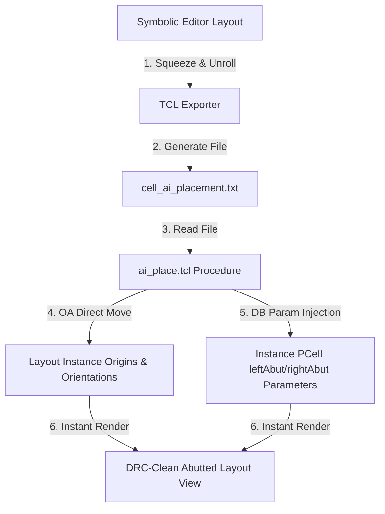

# AI-Based Analog Layout Placement & Abutment Synchronization

This directory contains `ai_place.tcl`, a custom high-performance Tcl procedure designed for seamless, instantaneous database integration in OpenAccess (OA) based custom layout design environments (such as Cadence Virtuoso or Synopsys Custom Compiler).

It bridges the gap between the AI-based layout optimization engine and active memory-resident physical layout databases.

---

## Workflow Overview



1. **AI Synthesis & Squeezing**: The symbolic layout engine unrolls multi-finger devices, groups them for symmetry and common centroid parameters, and squeezes standard $0.3\,\mu\text{m}$ slots down to physical $0.07\,\mu\text{m}$ contact diffusion-sharing boundaries.
2. **Text Export**: The layout engine exports a space-separated placement file containing device coordinates, orientation, and source/drain abutment properties.
3. **Database Injection**: The Tcl interpreter in the layout tool runs `ai_place.tcl`, which parses the file and applies the changes directly to active database instances without needing intermediate GDS/OAS streams.

---

## The AI Placement File Format

The placement output is exported as a space-separated, delimiter-free text file (`.txt`), where each line represents a unique transistor instance:

```text
InstanceName X_Microns Y_Microns Orientation PCell_Parameters... left_abut=0/1 right_abut=0/1
```

### Sample Placement File
```text
M28 0.000 -0.000 R0 l=0.014 nf=1 nfin=4.0 m=1 left_abut=1 right_abut=1
M5 0.140 -0.000 R0 l=0.014 nf=1 nfin=4.0 m=1 left_abut=0 right_abut=1
M4 0.210 -0.000 R0 l=0.014 nf=1 nfin=4.0 m=1 left_abut=1 right_abut=0
M3 0.070 -0.000 R0 l=0.014 nf=1 nfin=4.0 m=1 left_abut=0 right_abut=0
```

* **Instance Name**: Preserves suffix names (e.g. `_m1`, `_f1`) to align with unrolled fingers in the layout.
* **X / Y Coordinates**: Explicit coordinates on the physical grid in micrometers.
* **Orientation**: Rotation/mirroring code (e.g., `R0`, `R90`, `MY`).
* **PCell Parameters**: Centralized transistor parameters (e.g., channel length `l`, number of fingers `nf`).
* **Abutment Flags**: Explicitly resolves physical diffusion sharing on both sides:
  - `left_abut=1` / `right_abut=1`: Direct diffusion sharing with its neighbor (dummy or active).
  - `left_abut=0` / `right_abut=0`: Isolate terminal boundary (no physical diffusion sharing).

---

## Procedure Reference

### `ai_place {filename target_cell}`

Directly moves and updates parameters for active design instances in OpenAccess memory.

#### Arguments
* **`filename`** *(string)*: The full or relative file path to the generated placement text file (e.g., `"xor_ai_placement.txt"`).
* **`target_cell`** *(string)*: The case-sensitive name of the active cell view target in design memory (e.g., `"xor"`).

---

## Step-by-Step Usage Guide

### 1. Open the Layout Editor
Open your custom layout suite (e.g., Cadence Virtuoso) and open the target cell's layout view in **Edit Mode**.

### 2. Export Placement from Symbolic Editor
In the GUI of your Symbolic Editor:
* Click **Export TCL Placement** (or press the appropriate export shortcut).
* Save the file to your workspace (e.g., `eda/Xor_Automation_ai_placement.txt`).

### 3. Load the Tcl Script
In your layout tool's Command Interpreter Window (CIW) or console, source the Tcl script:

```tcl
source eda/ai_place.tcl
```

### 4. Execute the Placement
Invoke the `ai_place` procedure by passing the placement text file path and the target cell name:

```tcl
ai_place "examples/xor/Xor_Automation_ai_placement.txt" "xor"
```

### 5. Verify Results
The design layout will instantly refresh and show:
1. Every transistor moved to its designated sub-micron coordinate position.
2. Mirroring and rotation applied directly (such as `MY` orientations for symmetry pairs).
3. `leftAbut` and `rightAbut` PCell parameters set to `1` or `0`, rendering perfect gapless diffusion sharing.
