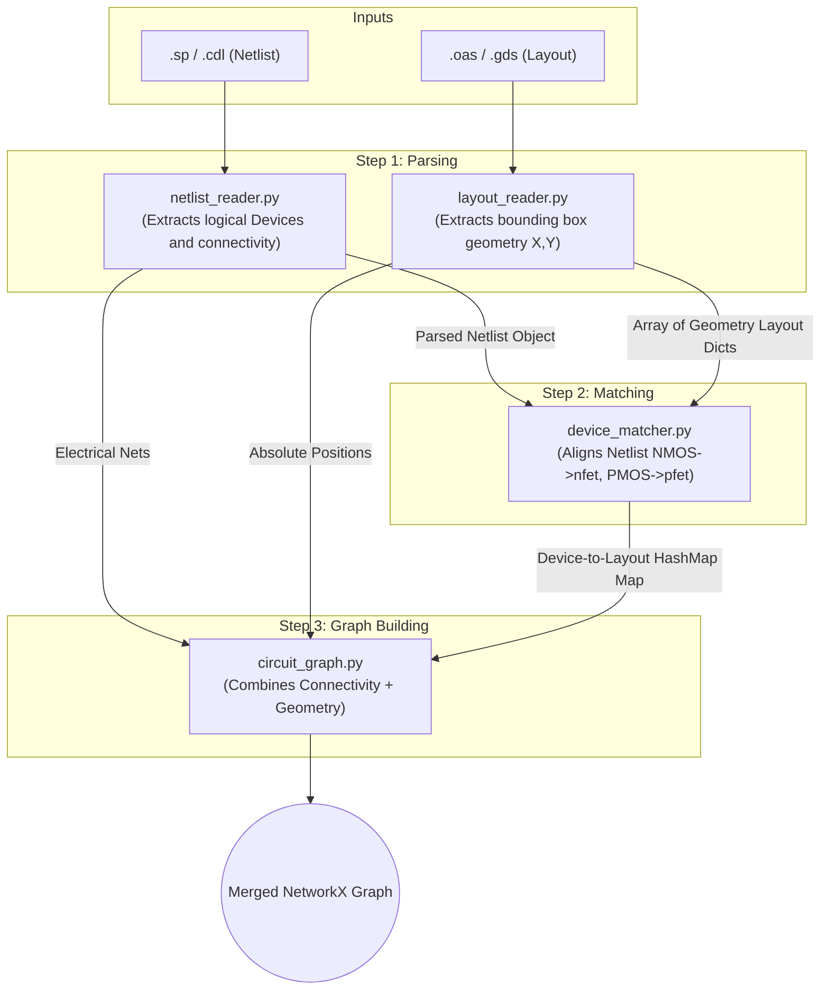

# Parser Subsystem

The `parser/` folder is responsible for converting SPICE/CDL netlists and OAS/GDS layout geometry files into a fully unified `NetworkX` graph. This graph combines both the electrical connectivity and the physical location of every transistor so the AI agents can properly reason about layout automation.

## Complete Execution Pipeline

To successfully understand a module, the system passes everything through an explicit 4-step processing pipeline:

## Step-by-Step Breakdown

1. **`netlist_reader.py`**: Reads your SPICE file and extracts objects (defined in `models.py`) called `Device` and `Netlist`. It resolves hierarchies and maps what pins connect to what nets.
2. **`layout_reader.py`**: Interrogates the `.oas` or `.gds` file using `gdstk` to find all standard references (like `nmos` or `pmos` PCells) and computes their absolute X,Y coordinates and sizes.
3. **`device_matcher.py`**: Since netlists and layout instances don't guarantee exact 1:1 name correlations, this step logically aligns the N-type transistors and P-type transistors between the Netlist memory object and the layout array. 
4. **`circuit_graph.py`**: Takes the matched objects and creates a unified graph representation. The nodes are transistors containing `x`, `y`, `width` attributes, and the edges represent the actual copper nets connecting them (like establishing a `Shared_Gate` relation).
