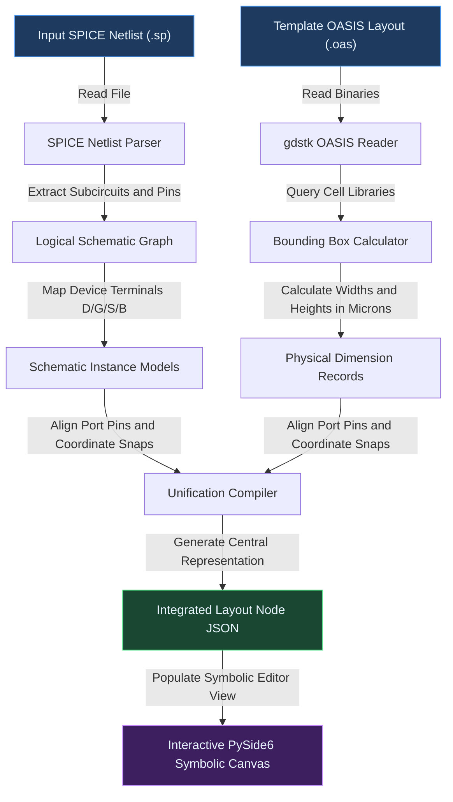
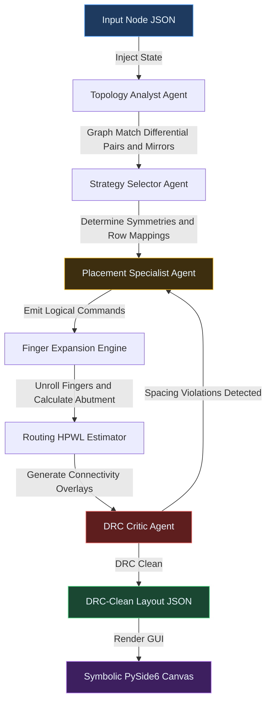
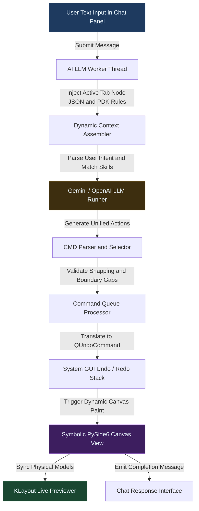
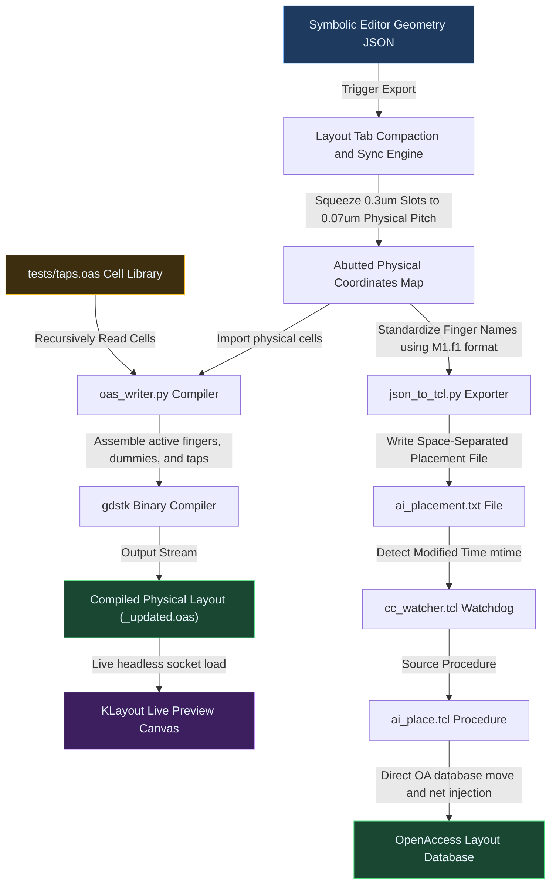

# System Deep-Dive: Architectural Flow Charts & Pipeline Specifications

This document provides exhaustive, high-fidelity **Mermaid Flow Charts** and detailed operational step-by-step walk-throughs for each of the four core subsystems of the AI-Based Analog Layout Automation platform:
1. **Topological & Geometry Parsing** (`parser/`)
2. **LangGraph Multi-Agent AI Placement System** (`ai_agent/`)
3. **Interactive Chat Bot Co-Pilot Pipeline** (`chat_panel/`)
4. **OASIS Layout Assembler & TCL Exporter Pipelines** (`export/` & `eda/`)

---

## 🔍 Part 1: Topological & Geometry Parsing Pipeline

The parsing pipeline acts as the **"eyes"** of the system. It ingests two different source formats — logical circuit netlists and physical PDK layout templates — and builds a unified schematic-geometry layout model.

### Operational Step-by-Step Flow
1. **SPICE Netlist Reading:** The logical parser opens the `.sp` file, tokenizes lines, extracts transistor subcircuit structures (e.g. `nfet`/`pfet` type families), and constructs a unified logical schematic network graph.
2. **OASIS Bounding Box Queries:** The physical reader uses `gdstk` to load physical PDK cell references from the template `.oas` layout. It queries cell geometry boundaries to compute exact widths and heights in micrometers.
3. **Model Alignment:** The unification engine maps logical device ports (Gate, Source, Drain, Bulk) to the cell's physical coordinate pins.
4. **JSON Node Generation:** Outputs a structured `nodes` list stored as JSON containing layout locations, dimensions, and net connectivity, instantly feeding the editor canvas.

---

## 🧠 Part 2: LangGraph Multi-Agent AI Placement Pipeline

The AI placement engine acts as the **"brain,"** leveraging a **Multi-Agent State Machine** (LangGraph) to plan, constrain, and self-heal the floorplan layout dynamically.

### Operational Agent Lifecycle
1. **Topology Analyst Agent:** Uses structural subgraph isomorphism algorithms to match topological circuit patterns. It automatically marks matching clusters such as input differential pairs and load mirrors.
2. **Strategy Selector Agent:** Determines the number of physical rows required, plans spatial symmetry axes (e.g. vertical mirrors), and schedules matched groups to avoid thermal gradients.
3. **Placement Specialist Agent:** A high-level LLM planner that issues coordinate placement directives using clean logical commands (e.g., `MOVE`, `ALIGN`, `FLIP`).
4. **Finger Expansion & Compactor:** Unrolls transistors into discrete fingers and resolves touch-abutments by compressing shared diffusion contacts down to 0.070 µm.
5. **DRC Critic Agent:** Evaluates overlap and clearance violations. If any collisions are found, it generates a physical correction delta (e.g., *"shift M1 right by 0.3um"*) and injects it as feedback back to the Placement Specialist for a corrected retry.

---

## 💬 Part 3: Interactive Chat Bot & Co-Pilot Pipeline

The Chat Bot serves as the **interactive translation layer**, bridging natural language UI instructions with native layout execution and undo stack states.

### Operational Step-by-Step Flow
1. **Context-Aware Assembly:** When the user types an instruction (e.g., *"Align MM1 and MM2 vertically"*), the chat panel collects the active tab's layout state, current selections, and PDK rules.
2. **LLM Command Synthesis:** The LLM matches the request against layout skills and translates natural language to strict XML command directives (e.g., `[CMD] MOVE MM1.f1 x=0.294 y=0.0 [/CMD]`).
3. **Native Undo/Redo Registration:** The Symbolic Editor parses the XML, wraps coordinates in strict `QUndoCommand` wrappers, and commits them to the GUI undo stack.
4. **GUI Update & Sync:** The canvas repaints grid items instantly. The changes are piped to KLayout's live background process to show the unrolled physical shapes dynamically.

---

## 💾 Part 4: OASIS Layout Assembler & TCL Exporter Pipelines

The export system represents the **physical execution layer**, providing two high-fidelity paths to translate the symbolic nodes into production-ready physical layouts.

### Double Export Pipeline Deep-Dive

#### 1. Binary OASIS Assembly Pipeline
* **Spatial Squeezing:** Symbolic slot positions are compacted down to touch-abutment coordinates.
* **Import & Infill:** The OAS layout assembler reads the physical tie/tap boundaries and imports `Ntap` and `Ptap` cells from `tests/taps.oas`.
* **Binary Streaming:** Translates geometries to a high-fidelity binary stream and writes a complete layout (`_updated.oas`).
* **Live Refresh:** Sends the layout path to KLayout via socket requests for real-time headless previews.

#### 2. OpenAccess TCL Exporter Pipeline
* **Clean Naming:** Formats instance IDs with proper hierarchical dot suffixes (e.g. `M1_f1` → `M1.f1`).
* **Radar Watchdog:** The `cc_watcher.tcl` background process running inside the EDA tool detects changes to the `ai_placement.txt` coordinate file.
* **Direct Database Injection:** Sources `ai_place.tcl`, calls the target cell view `getNext` OpenAccess instances, and uses `setOrigin`/`setOrient` to move transistors in-memory. It sets PCell `leftAbut`/`rightAbut` parameters directly, and programmatically types terminal net names in the GUI Property Editor, creating DRC-clean, LVS-validated layouts instantly.
