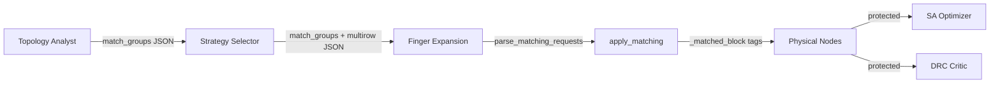

# Walkthrough: Matching Integration + Bug Fixes

## Changes Made

### 1. Bug Fix: ReAct Agent `create_agent()` Error

**File:** [nodes.py](file:///c:/Users/DELL%20G3/Desktop/GP/Automation/AI-Automation-New/ai_agent/ai_chat_bot/nodes.py)

The `create_agent()` call was using `prompt=` but the LangChain API uses `system_prompt=`. This caused every placement call to fall back to direct invoke with the warning:

```
[PLACEMENT] ⚠ ReAct path failed (create_agent() got an unexpected keyword argument 'prompt')
```

```diff
-            react_agent = create_agent(
-                model=llm,
-                tools=list(tools or []),
-                prompt=system_prompt,
-            )
+            react_agent = create_agent(
+                model=llm,
+                tools=list(tools or []),
+                system_prompt=system_prompt,
+            )
```

---

### 2. New: Headless Matching Adapter

**File:** [matching_adapter.py](file:///c:/Users/DELL%20G3/Desktop/GP/Automation/AI-Automation-New/ai_agent/ai_chat_bot/agents/matching_adapter.py) [NEW]

Qt-free adapter wrapping `universal_pattern_generator.generate_placement_grid()`. The AI flow calls this deterministically — the LLM never computes centroids.

**Key functions:**
| Function | Purpose |
|---|---|
| `apply_matching()` | Apply CC1D/CC2D/interdigitation to a set of devices → returns placed nodes + MatchedBlock |
| `parse_matching_requests()` | Extract `match_groups` JSON from LLM strategy/topology text |
| `is_in_matched_block()` | Check if a node is protected |
| `move_matched_block()` | Rigid-body move of an entire matched group |

After matching, every member node gets `_matched_block: <block_id>` tag — this is the key to downstream protection.

---

### 3. Diff Pair + Current Mirror Detection

**File:** [topology_analyst.py](file:///c:/Users/DELL%20G3/Desktop/GP/Automation/AI-Automation-New/ai_agent/ai_chat_bot/agents/topology_analyst.py)

Added explicit detection rules to the prompt:
- **Differential pair**: same-type transistors, shared source net (tail), different drain nets
- **Current mirror**: shared gate net, one diode-connected (gate=drain)
- **Cascode**: drain of bottom → source of top

Added mandatory `match_groups` JSON output section:
```json
{
  "match_groups": [
    {"devices": ["MM0", "MM1"], "technique": "COMMON_CENTROID_1D"},
    {"devices": ["MM3", "MM4"], "technique": "INTERDIGITATION"}
  ]
}
```

**File:** [strategy_selector.py](file:///c:/Users/DELL%20G3/Desktop/GP/Automation/AI-Automation-New/ai_agent/ai_chat_bot/agents/strategy_selector.py)

Added pass-through section requiring the strategy selector to carry forward `match_groups` from the topology analyst in its JSON output.

---

### 4. Block Protection (DRC + SA)

**DRC Critic** — Before applying any fix commands, filters out commands targeting matched-block member devices. Matched groups are never broken by individual device moves.

**SA Optimizer** — Matched block member IDs are injected into the abutment chain list so SA treats them as frozen and never swaps them.

---

### 5. Multi-Row Verification

The geometry engine correctly handles 7 rows (4 NMOS + 3 PMOS):

```
NMOS row 0 [nmos_input]    y=0.000   7 devices
NMOS row 1 [nmos_cascode]  y=0.835   7 devices
NMOS row 2 [nmos_mirror]   y=1.670   7 devices
NMOS row 3 [nmos_bias]     y=2.505   7 devices
PMOS row 0 [pmos_load]     y=4.342   7 devices
PMOS row 1 [pmos_cascode]  y=5.177   7 devices
PMOS row 2 [pmos_mirror]   y=6.012   7 devices
```

- PMOS/NMOS separation: **PASS** (min PMOS y=4.342 > max NMOS y=2.505)
- All 49 devices placed with unique coordinates
- Auto-split for rows >16 devices works

---

## Test Results

| Test | Result |
|---|---|
| Common Centroid 1D (MM0 centroid = MM1 centroid = 1.029) | **PASS** |
| Interdigitation (8 fingers, ratio-balanced) | **PASS** |
| match_groups JSON parsing from strategy text | **PASS** |
| 7-row multi-row placement (4N + 3P) | **PASS** |
| PMOS/NMOS separation guarantee | **PASS** |
| Full import chain (nodes → graph → worker) | **PASS** |
| ReAct agent `system_prompt` fix | **PASS** |

## Data Flow


